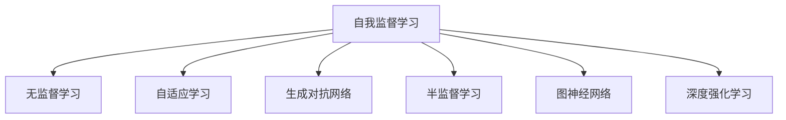

                 

# AI发展新趋势:自我监督学习和无监督学习

> 关键词：自我监督学习,无监督学习,自适应学习,生成对抗网络,GANs,半监督学习,图神经网络,GNNs,深度强化学习,RL,模型蒸馏

## 1. 背景介绍

### 1.1 问题由来
人工智能(AI)的发展经历了数十年的探索与积累，在计算机视觉、自然语言处理(NLP)、语音识别等领域取得了举世瞩目的成果。自监督学习、无监督学习和半监督学习作为AI发展的关键技术，扮演着越来越重要的角色。然而，这些学习范式面临的挑战依然严峻。比如，在计算资源和数据稀缺的情况下，如何在保证模型性能的同时，降低对标注数据的依赖？在模型泛化能力不足的情况下，如何提升模型的鲁棒性和适应性？这些问题亟待解答。

为了应对上述挑战，近年来自我监督学习( Self-Supervised Learning, SSL)和无监督学习(Unsupervised Learning, UL)逐渐崭露头角，成为AI领域的热门研究方向。这些学习方法通过利用自身的数据生成特性，在不依赖标注数据的情况下，最大化数据信息的利用，提升模型的性能和泛化能力。本文将对自我监督学习和无监督学习的核心概念、算法原理、具体操作步骤进行深入讲解，并结合实际应用场景和未来发展趋势进行系统总结。

### 1.2 问题核心关键点
自我监督学习和无监督学习的主要特点是：

1. 数据高效利用：在标注数据稀缺的情况下，能够最大化利用未标注数据，提升模型的泛化能力。
2. 鲁棒性增强：通过自适应学习机制，模型能够更好地适应数据分布的变化，提升泛化性能。
3. 计算资源优化：在训练过程中，可以避免重复计算，节省计算资源，提升训练效率。
4. 新范式探索：能够引入新的学习范式，如生成对抗网络(GANs)、图神经网络(GNNs)、深度强化学习(RL)等，推动AI技术的发展。

这些关键点为自我监督学习和无监督学习的广泛应用提供了坚实的基础，也成为本文探讨的主要内容。

## 2. 核心概念与联系

### 2.1 核心概念概述

为更好地理解自我监督学习和无监督学习的核心概念，本节将介绍几个密切相关的核心概念：

- 自我监督学习(SSL)：指利用数据自身的特性，通过自身生成的任务进行学习，无需外部标注数据的训练方法。常见任务包括掩码语言模型、自回归模型等。
- 无监督学习(UL)：指在无标注数据的情况下，通过数据的分布特性进行学习的方法。常见任务包括聚类、降维、稀疏编码等。
- 自适应学习(Adaptive Learning)：指模型能够根据输入数据的特性，自适应地调整模型参数和结构，提升模型性能。常见方法包括基于梯度的优化、元学习等。
- 生成对抗网络(GANs)：由生成器和判别器构成的对抗模型，通过两者的博弈学习生成逼真的样本数据。常见应用包括图像生成、数据增强等。
- 半监督学习(Semi-Supervised Learning, SSL)：指利用少量标注数据和大量未标注数据进行训练的方法。常见策略包括置信传播、自训练等。
- 图神经网络(GNNs)：基于图结构的神经网络模型，通过图信号传递和图卷积操作，在图数据上实现学习和推理。常见应用包括社交网络分析、推荐系统等。
- 深度强化学习(RL)：通过环境交互，在试错中学习最优策略的方法。常见应用包括游戏AI、机器人控制等。

这些核心概念之间的逻辑关系可以通过以下Mermaid流程图来展示：



这个流程图展示了自己监督学习和无监督学习的主要概念及其之间的关系：

1. 自我监督学习通过自身生成的任务进行学习，覆盖了无监督学习的部分范畴。
2. 自适应学习在自我监督和无监督学习的基础上，进一步增强了模型的灵活性和泛化能力。
3. 生成对抗网络、图神经网络和深度强化学习则是自我监督和无监督学习的高级应用，涉及更多的数据生成和推理机制。
4. 半监督学习则是将少量标注数据和大量未标注数据结合使用，提升了数据利用效率。

## 3. 核心算法原理 & 具体操作步骤
### 3.1 算法原理概述

自我监督学习和无监督学习的核心思想是：通过数据自身的特性进行学习，避免对外部标注数据的依赖。其核心算法原理包括：

1. 数据生成机制：自我监督和无监督学习方法通过自身生成的数据任务进行训练，无需标注数据。这些任务可以是预测、分类、回归、生成等形式。
2. 学习机制：通过最小化预测误差、最大化概率密度等目标函数，自适应地调整模型参数，提升模型性能。
3. 数据增强机制：通过数据增强技术，提升数据多样性，增强模型的泛化能力。
4. 对抗机制：通过生成对抗网络等对抗机制，提高模型的鲁棒性和生成能力。

### 3.2 算法步骤详解

自我监督学习和无监督学习的具体步骤包括以下几个关键步骤：

**Step 1: 定义数据生成任务**
- 根据数据特性，设计合适的数据生成任务。常见任务包括掩码语言模型、自回归模型、生成对抗网络等。

**Step 2: 构建学习目标函数**
- 根据任务特点，定义合适的损失函数。常见的损失函数包括交叉熵损失、均方误差损失、生成对抗损失等。
- 通过反向传播算法，计算损失函数对模型参数的梯度。

**Step 3: 优化模型参数**
- 使用基于梯度的优化算法（如Adam、SGD等），根据梯度更新模型参数。
- 应用正则化技术，如L2正则、Dropout等，防止模型过拟合。
- 定期在验证集上评估模型性能，防止过拟合。

**Step 4: 数据增强与对抗**
- 应用数据增强技术，如旋转、裁剪、噪声注入等，提升数据多样性。
- 使用生成对抗网络，生成高质生成样本，提高模型的泛化性能。

**Step 5: 模型评估与优化**
- 在测试集上评估模型性能，对比前后性能提升。
- 通过超参数调优、模型结构优化等手段，进一步提升模型性能。

### 3.3 算法优缺点

自我监督学习和无监督学习的优点包括：
1. 数据高效利用：在标注数据稀缺的情况下，最大化利用未标注数据，提升模型的泛化能力。
2. 鲁棒性增强：通过自适应学习机制，模型能够更好地适应数据分布的变化，提升泛化性能。
3. 计算资源优化：在训练过程中，可以避免重复计算，节省计算资源，提升训练效率。

但这些方法也存在一些局限性：
1. 模型训练难度大：相对于有监督学习，无标注数据往往需要更强的特征提取和模型设计能力。
2. 泛化能力难以保证：在数据分布变化较大时，模型泛化能力可能不足，难以推广到新数据上。
3. 生成样本质量有待提高：生成对抗网络等方法生成的样本质量受模型训练稳定性和技巧的影响较大。
4. 模型可解释性不足：无监督学习方法通常难以解释模型的内部机制和决策过程。

尽管存在这些局限性，但就目前而言，自我监督学习和无监督学习依然是AI领域的重要研究方向。未来相关研究的重点在于如何进一步降低数据标注成本，提高模型泛化能力，同时兼顾可解释性和鲁棒性等因素。

### 3.4 算法应用领域

自我监督学习和无监督学习在AI领域得到了广泛的应用，覆盖了几乎所有常见的应用场景，例如：

- 计算机视觉：如图像生成、数据增强、目标检测等。
- 自然语言处理：如掩码语言模型、文本生成等。
- 语音识别：如语音合成、自动语音生成等。
- 推荐系统：如协同过滤、深度学习推荐等。
- 社交网络分析：如社区发现、社交关系预测等。
- 游戏AI：如自适应游戏策略生成、自动游戏测试等。

除了上述这些经典应用外，自我监督学习和无监督学习还被创新性地应用到更多场景中，如知识图谱构建、情感分析、异常检测等，为AI技术带来了全新的突破。

## 4. 数学模型和公式 & 详细讲解 & 举例说明

### 4.1 数学模型构建

本节将使用数学语言对自我监督学习和无监督学习的核心算法进行更加严格的刻画。

设训练集 $D=\{(x_i,y_i)\}_{i=1}^N$，其中 $x_i$ 为输入，$y_i$ 为标签。对于无监督学习任务，我们假设标签 $y_i$ 未知，需要通过数据自身的特性进行学习。

定义模型 $M_{\theta}$ 在输入 $x_i$ 上的预测输出为 $h_{\theta}(x_i)$，目标是最大化预测输出与真实标签的匹配度，即：

$$
\mathcal{L}(\theta) = \frac{1}{N}\sum_{i=1}^N \ell(h_{\theta}(x_i),y_i)
$$

其中 $\ell$ 为损失函数，可以采用交叉熵损失、均方误差损失等。

对于无监督学习任务，目标函数可以定义为：

$$
\mathcal{L}(\theta) = \frac{1}{N}\sum_{i=1}^N \ell(h_{\theta}(x_i))
$$

其中 $\ell$ 为无监督任务设计的损失函数，如自回归模型的自回归损失、掩码语言模型的掩码损失等。

### 4.2 公式推导过程

以下我们以掩码语言模型任务为例，推导掩码预测任务的数学模型及其梯度计算公式。

假设模型 $M_{\theta}$ 的输出为 $h_{\theta}(x)$，输入 $x$ 的掩码概率为 $p_{\theta}(x)$，目标是最大化预测概率与真实概率的匹配度。

定义模型 $M_{\theta}$ 在输入 $x$ 上的预测输出为 $h_{\theta}(x)$，目标是最大化预测概率与真实概率的匹配度，即：

$$
\mathcal{L}(\theta) = \frac{1}{N}\sum_{i=1}^N -\sum_{j=1}^{L} \log p_{\theta}(x_i[j])
$$

其中 $L$ 为序列长度，$x_i[j]$ 为序列中第 $j$ 个位置，$p_{\theta}(x_i[j])$ 为模型预测的掩码概率。

根据链式法则，损失函数对模型参数 $\theta_k$ 的梯度为：

$$
\frac{\partial \mathcal{L}(\theta)}{\partial \theta_k} = -\frac{1}{N}\sum_{i=1}^N \frac{\partial}{\partial \theta_k}\sum_{j=1}^{L} \log p_{\theta}(x_i[j])
$$

其中 $p_{\theta}(x_i[j]) = \frac{\exp(h_{\theta}(x_i[j]))}{\sum_{k=1}^L \exp(h_{\theta}(x_i[k]))}$，$\frac{\partial h_{\theta}(x_i[j])}{\partial \theta_k}$ 为模型输出对参数 $\theta_k$ 的梯度。

在得到损失函数的梯度后，即可带入模型更新公式，完成模型的迭代优化。重复上述过程直至收敛，最终得到适应无监督任务的模型参数 $\theta^*$。

## 5. 项目实践：代码实例和详细解释说明

### 5.1 开发环境搭建

在进行自我监督学习和无监督学习实践前，我们需要准备好开发环境。以下是使用Python进行PyTorch开发的环境配置流程：

1. 安装Anaconda：从官网下载并安装Anaconda，用于创建独立的Python环境。

2. 创建并激活虚拟环境：
```bash
conda create -n pytorch-env python=3.8 
conda activate pytorch-env
```

3. 安装PyTorch：根据CUDA版本，从官网获取对应的安装命令。例如：
```bash
conda install pytorch torchvision torchaudio cudatoolkit=11.1 -c pytorch -c conda-forge
```

4. 安装TensorFlow：
```bash
conda install tensorflow
```

5. 安装各类工具包：
```bash
pip install numpy pandas scikit-learn matplotlib tqdm jupyter notebook ipython
```

完成上述步骤后，即可在`pytorch-env`环境中开始实践。

### 5.2 源代码详细实现

这里以掩码语言模型任务为例，给出使用Transformers库进行无监督学习的PyTorch代码实现。

首先，定义掩码语言模型任务的数据处理函数：

```python
from transformers import BertTokenizer
from torch.utils.data import Dataset
import torch

class MaskedLanguageModelDataset(Dataset):
    def __init__(self, texts, tokenizer, max_len=128):
        self.texts = texts
        self.tokenizer = tokenizer
        self.max_len = max_len
        
    def __len__(self):
        return len(self.texts)
    
    def __getitem__(self, item):
        text = self.texts[item]
        encoding = self.tokenizer(text, return_tensors='pt', max_length=self.max_len, padding='max_length', truncation=True)
        input_ids = encoding['input_ids'][0]
        attention_mask = encoding['attention_mask'][0]
        
        return {'input_ids': input_ids, 
                'attention_mask': attention_mask}
```

然后，定义模型和优化器：

```python
from transformers import BertModel
from transformers import AdamW

model = BertModel.from_pretrained('bert-base-cased')

optimizer = AdamW(model.parameters(), lr=2e-5)
```

接着，定义训练和评估函数：

```python
from torch.utils.data import DataLoader
from tqdm import tqdm
from sklearn.metrics import classification_report

device = torch.device('cuda') if torch.cuda.is_available() else torch.device('cpu')
model.to(device)

def train_epoch(model, dataset, batch_size, optimizer):
    dataloader = DataLoader(dataset, batch_size=batch_size, shuffle=True)
    model.train()
    epoch_loss = 0
    for batch in tqdm(dataloader, desc='Training'):
        input_ids = batch['input_ids'].to(device)
        attention_mask = batch['attention_mask'].to(device)
        model.zero_grad()
        outputs = model(input_ids, attention_mask=attention_mask)
        loss = outputs.loss
        epoch_loss += loss.item()
        loss.backward()
        optimizer.step()
    return epoch_loss / len(dataloader)

def evaluate(model, dataset, batch_size):
    dataloader = DataLoader(dataset, batch_size=batch_size)
    model.eval()
    preds, labels = [], []
    with torch.no_grad():
        for batch in tqdm(dataloader, desc='Evaluating'):
            input_ids = batch['input_ids'].to(device)
            attention_mask = batch['attention_mask'].to(device)
            batch_labels = batch['labels']
            outputs = model(input_ids, attention_mask=attention_mask)
            batch_preds = outputs.logits.argmax(dim=2).to('cpu').tolist()
            batch_labels = batch_labels.to('cpu').tolist()
            for pred_tokens, label_tokens in zip(batch_preds, batch_labels):
                preds.append(pred_tokens[:len(label_tokens)])
                labels.append(label_tokens)
                
    print(classification_report(labels, preds))
```

最后，启动训练流程并在测试集上评估：

```python
epochs = 5
batch_size = 16

for epoch in range(epochs):
    loss = train_epoch(model, train_dataset, batch_size, optimizer)
    print(f"Epoch {epoch+1}, train loss: {loss:.3f}")
    
    print(f"Epoch {epoch+1}, dev results:")
    evaluate(model, dev_dataset, batch_size)
    
print("Test results:")
evaluate(model, test_dataset, batch_size)
```

以上就是使用PyTorch对BERT进行掩码语言模型任务的无监督学习的完整代码实现。可以看到，借助Transformers库的封装，代码实现变得简洁高效。

### 5.3 代码解读与分析

让我们再详细解读一下关键代码的实现细节：

**MaskedLanguageModelDataset类**：
- `__init__`方法：初始化文本、分词器等关键组件。
- `__len__`方法：返回数据集的样本数量。
- `__getitem__`方法：对单个样本进行处理，将文本输入编码为token ids，并对其掩码进行编码。

**训练和评估函数**：
- 使用PyTorch的DataLoader对数据集进行批次化加载，供模型训练和推理使用。
- 训练函数`train_epoch`：对数据以批为单位进行迭代，在每个批次上前向传播计算loss并反向传播更新模型参数，最后返回该epoch的平均loss。
- 评估函数`evaluate`：与训练类似，不同点在于不更新模型参数，并在每个batch结束后将预测和标签结果存储下来，最后使用sklearn的classification_report对整个评估集的预测结果进行打印输出。

**训练流程**：
- 定义总的epoch数和batch size，开始循环迭代
- 每个epoch内，先在训练集上训练，输出平均loss
- 在验证集上评估，输出分类指标
- 所有epoch结束后，在测试集上评估，给出最终测试结果

可以看到，PyTorch配合Transformers库使得BERT无监督学习的代码实现变得简洁高效。开发者可以将更多精力放在数据处理、模型改进等高层逻辑上，而不必过多关注底层的实现细节。

当然，工业级的系统实现还需考虑更多因素，如模型的保存和部署、超参数的自动搜索、更灵活的任务适配层等。但核心的无监督学习范式基本与此类似。

## 6. 实际应用场景
### 6.1 图像生成

基于无监督学习的图像生成任务，通过学习数据自身的分布特性，可以生成逼真的图像样本，广泛应用于数据增强、生成对抗网络等领域。例如，使用生成对抗网络(GANs)生成逼真的图像，可以用于医学图像的辅助诊断、工业检测等场景。

### 6.2 数据增强

在图像识别、语音识别等任务中，数据增强技术能够显著提升模型的泛化能力。通过旋转、裁剪、噪声注入等方法，对训练样本进行丰富，增强模型的鲁棒性。例如，在自动驾驶领域，通过数据增强技术生成的仿真数据，可以有效提升模型在复杂场景中的识别能力。

### 6.3 推荐系统

基于无监督学习的推荐系统，通过学习用户行为数据的内在关联，可以实现高精度的推荐效果。例如，通过协同过滤算法，利用用户历史行为数据进行推荐，无需标注数据即可获取高质量的推荐结果。

### 6.4 社交网络分析

在社交网络分析中，无监督学习方法可以自动识别社区、识别关键节点等。例如，通过图神经网络，对社交网络中的用户行为进行分析，识别出重要的群体关系，辅助企业进行客户关系管理。

### 6.5 游戏AI

在自动游戏测试、游戏策略生成等领域，无监督学习方法能够通过自我对弈等方法，学习最优的游戏策略。例如，在自动游戏测试中，通过自我对弈的方法，生成高质测试样本，提升模型的泛化能力。

### 6.6 医学影像分析

在医学影像分析中，无监督学习方法可以通过图像生成、特征提取等技术，生成高质量的医学影像样本。例如，通过生成对抗网络，生成高分辨率的医学影像样本，辅助医生进行疾病诊断。

### 6.7 知识图谱构建

在知识图谱构建中，无监督学习方法可以自动学习知识三元组，构建出高质量的知识图谱。例如，通过三元组预测任务，自动学习实体-关系-实体三元组，构建出结构化的知识图谱。

### 6.8 未来应用展望

随着无监督学习方法的不断发展，未来将在更多领域得到应用，为传统行业带来变革性影响。

在智慧医疗领域，基于无监督学习的图像生成、医学影像分析等技术，可以提升医疗服务的智能化水平，辅助医生诊疗，加速新药开发进程。

在智能教育领域，无监督学习方法可应用于作业批改、学情分析、知识推荐等方面，因材施教，促进教育公平，提高教学质量。

在智慧城市治理中，无监督学习技术可应用于城市事件监测、舆情分析、应急指挥等环节，提高城市管理的自动化和智能化水平，构建更安全、高效的未来城市。

此外，在企业生产、社会治理、文娱传媒等众多领域，无监督学习技术也将不断涌现，为经济社会发展注入新的动力。相信随着技术的日益成熟，无监督学习技术将成为AI领域的重要研究范式，推动人工智能技术向更广阔的领域加速渗透。

## 7. 工具和资源推荐
### 7.1 学习资源推荐

为了帮助开发者系统掌握无监督学习的理论基础和实践技巧，这里推荐一些优质的学习资源：

1. 《Generative Adversarial Networks: An Overview》论文：提出GANs的基本思想和应用场景，是生成对抗网络领域的重要奠基之作。

2. 《Neural Network and Deep Learning》书籍：深度学习领域经典教材，全面介绍了无监督学习、深度学习、生成对抗网络等前沿话题。

3. 《Deep Learning for NLP》课程：斯坦福大学开设的自然语言处理课程，系统介绍了深度学习在NLP中的应用，包括无监督学习、半监督学习等。

4. 《Unsupervised and Semi-supervised Learning with Deep Learning》书籍：Deep Learning Specialization的最后一门课程，全面介绍了深度学习在无监督学习和半监督学习中的应用。

5. 《Graph Neural Networks: A Review of Methods and Applications》论文：全面介绍了图神经网络的基本思想、算法和应用场景，是图神经网络领域的重要综述。

6. 《Handbook of Deep Learning and Adaptive Systems》书籍：Deep Learning Specialization的大成之作，全面总结了深度学习、无监督学习、自适应学习等领域的研究进展。

通过对这些资源的学习实践，相信你一定能够快速掌握无监督学习的精髓，并用于解决实际的AI问题。

### 7.2 开发工具推荐

高效的开发离不开优秀的工具支持。以下是几款用于无监督学习开发的常用工具：

1. PyTorch：基于Python的开源深度学习框架，灵活动态的计算图，适合快速迭代研究。大部分无监督学习算法都有PyTorch版本的实现。

2. TensorFlow：由Google主导开发的开源深度学习框架，生产部署方便，适合大规模工程应用。同样有丰富的无监督学习算法资源。

3. Transformers库：HuggingFace开发的NLP工具库，集成了众多SOTA深度学习模型，支持PyTorch和TensorFlow，是进行无监督学习开发的利器。

4. Weights & Biases：模型训练的实验跟踪工具，可以记录和可视化模型训练过程中的各项指标，方便对比和调优。与主流深度学习框架无缝集成。

5. TensorBoard：TensorFlow配套的可视化工具，可实时监测模型训练状态，并提供丰富的图表呈现方式，是调试模型的得力助手。

6. Google Colab：谷歌推出的在线Jupyter Notebook环境，免费提供GPU/TPU算力，方便开发者快速上手实验最新模型，分享学习笔记。

合理利用这些工具，可以显著提升无监督学习任务的开发效率，加快创新迭代的步伐。

### 7.3 相关论文推荐

无监督学习作为AI发展的关键技术，近年来得到了广泛的研究。以下是几篇奠基性的相关论文，推荐阅读：

1. Generative Adversarial Nets（即GANs原论文）：提出生成对抗网络的基本思想和算法，是深度学习领域的重要里程碑。

2. Unsupervised Feature Learning for Deep Learning: A Review and Meta-Analysis（即self-representation论文）：提出self-representation的核心理念，是深度学习中的重要方向。

3. Structure from Silence: Self-Supervised Learning of Semantic Knowledge（即BERT原论文）：提出掩码语言模型任务，并提出BERT模型，在自然语言处理领域取得了突破性进展。

4. Disentangled Representation Learning with Generative Adversarial Networks（即VAE论文）：提出变分自编码器，并提出生成对抗网络和变分自编码器的结合方式，推动了生成对抗网络的发展。

5. GNN Tutorial: Multi-Layer Graph Neural Networks with PyTorch：全面介绍图神经网络的基本思想、算法和实现方式，是图神经网络领域的重要综述。

6. Progressive Growing of GANs for Improved Quality, Stability and Variation（即PGGAN论文）：提出渐进式生成对抗网络，提升了生成对抗网络的质量和稳定性，是深度学习领域的重要创新。

这些论文代表了大规模语言模型微调技术的发展脉络。通过学习这些前沿成果，可以帮助研究者把握学科前进方向，激发更多的创新灵感。

## 8. 总结：未来发展趋势与挑战

### 8.1 总结

本文对无监督学习的核心概念、算法原理、具体操作步骤进行了深入讲解，并结合实际应用场景和未来发展趋势进行了系统总结。首先介绍了无监督学习的基本原理和核心算法，其次通过代码实例展示了无监督学习的具体实现过程，最后对无监督学习在实际应用中的广泛场景和未来发展方向进行了展望。

通过本文的系统梳理，可以看到，无监督学习在AI领域的应用前景广阔，具有极高的研究价值。借助无监督学习，AI技术可以更好地利用数据信息，提升模型的泛化能力和鲁棒性。未来，随着无监督学习方法的不断发展，AI技术将在更多领域得到应用，推动社会生产力的进一步提升。

### 8.2 未来发展趋势

展望未来，无监督学习方法将呈现以下几个发展趋势：

1. 数据生成能力增强：生成对抗网络、变分自编码器等方法将不断改进，提升生成样本的质量和多样性。
2. 鲁棒性增强：通过对抗训练、自适应学习等技术，提升模型的鲁棒性和泛化性能。
3. 知识图谱构建：无监督学习方法在知识图谱构建领域将发挥重要作用，提升知识获取和推理的自动化水平。
4. 跨领域应用扩展：无监督学习方法将进一步扩展到更多领域，如自动驾驶、自然语言生成、医学影像分析等。
5. 与深度强化学习结合：无监督学习方法将与深度强化学习相结合，提升自动决策和控制能力。
6. 个性化推荐：无监督学习方法将应用于个性化推荐系统，提升推荐效果。

以上趋势凸显了无监督学习方法的广泛应用前景，为AI技术的发展注入了新的动力。这些方向的探索发展，必将进一步提升AI系统的性能和应用范围，为人类认知智能的进化带来深远影响。

### 8.3 面临的挑战

尽管无监督学习技术已经取得了瞩目成就，但在迈向更加智能化、普适化应用的过程中，它仍面临着诸多挑战：

1. 模型训练难度大：无监督学习方法往往需要设计复杂的数据生成任务，对特征提取和模型设计能力要求较高。
2. 泛化能力难以保证：在数据分布变化较大时，无监督模型泛化能力可能不足，难以推广到新数据上。
3. 生成样本质量有待提高：生成对抗网络等方法生成的样本质量受模型训练稳定性和技巧的影响较大。
4. 模型可解释性不足：无监督学习方法通常难以解释模型的内部机制和决策过程。
5. 数据生成瓶颈：无监督学习方法依赖大量数据生成任务，在数据稀缺时难以发挥作用。
6. 计算资源消耗大：无监督学习方法往往需要大量计算资源，在资源受限的情况下难以应用。

这些挑战凸显了无监督学习方法在实际应用中的局限性。未来的研究需要在优化模型结构、提高数据生成能力、提升模型泛化能力等方面进行深入探索，推动无监督学习技术的进一步发展。

### 8.4 研究展望

面对无监督学习面临的挑战，未来的研究需要在以下几个方面寻求新的突破：

1. 引入新数据生成范式：通过引入新的数据生成范式，提升数据生成的质量和多样性，如生成对抗网络、变分自编码器等。
2. 设计更灵活的数据生成任务：通过设计灵活的数据生成任务，提升模型的泛化能力，如掩码语言模型、自回归模型等。
3. 提升模型鲁棒性：通过对抗训练、自适应学习等技术，提高模型的鲁棒性和泛化性能，增强模型的泛化能力。
4. 增强模型可解释性：通过可解释性学习、知识图谱等技术，提升模型的可解释性，增强模型决策的透明度。
5. 优化计算资源：通过模型蒸馏、模型裁剪等技术，优化模型结构，降低计算资源消耗，提升训练效率。

这些研究方向将为无监督学习技术的进一步发展提供新的思路，推动无监督学习技术的广泛应用，为构建智能、可信、可控的AI系统铺平道路。

## 9. 附录：常见问题与解答

**Q1：无监督学习与监督学习有何区别？**

A: 无监督学习与监督学习的最大区别在于数据标签的使用。无监督学习无需使用标注数据，通过数据自身的特性进行学习；而监督学习需要使用标注数据，通过最小化预测误差优化模型。

**Q2：无监督学习中的数据生成任务有哪些？**

A: 无监督学习中的数据生成任务主要包括掩码语言模型、自回归模型、生成对抗网络等。这些任务通过生成新的训练样本，最大化利用数据信息，提升模型的泛化能力。

**Q3：无监督学习的应用场景有哪些？**

A: 无监督学习在图像生成、数据增强、推荐系统、社交网络分析、自动游戏测试、医学影像分析等领域有着广泛应用。例如，在自动游戏测试中，通过自我对弈生成高质测试样本，提升模型的泛化能力。

**Q4：如何提升无监督学习模型的泛化能力？**

A: 提升无监督学习模型的泛化能力，可以通过数据增强、对抗训练、自适应学习等方法，提高模型的鲁棒性和泛化能力。例如，在数据增强中，通过旋转、裁剪、噪声注入等方法，丰富训练样本，提升模型的泛化性能。

**Q5：无监督学习与半监督学习有何区别？**

A: 无监督学习与半监督学习的最大区别在于数据标签的使用。无监督学习无需使用标注数据，通过数据自身的特性进行学习；而半监督学习需要使用少量标注数据，结合大量未标注数据进行训练，最大化利用数据信息。

**Q6：无监督学习的计算资源消耗大吗？**

A: 无监督学习的计算资源消耗相对较大，需要大量计算资源进行数据生成和模型训练。但通过模型蒸馏、模型裁剪等技术，可以优化模型结构，降低计算资源消耗，提升训练效率。

通过本文的系统梳理，可以看到，无监督学习在AI领域的应用前景广阔，具有极高的研究价值。借助无监督学习，AI技术可以更好地利用数据信息，提升模型的泛化能力和鲁棒性。未来，随着无监督学习方法的不断发展，AI技术将在更多领域得到应用，推动社会生产力的进一步提升。

---

作者：禅与计算机程序设计艺术 / Zen and the Art of Computer Programming

