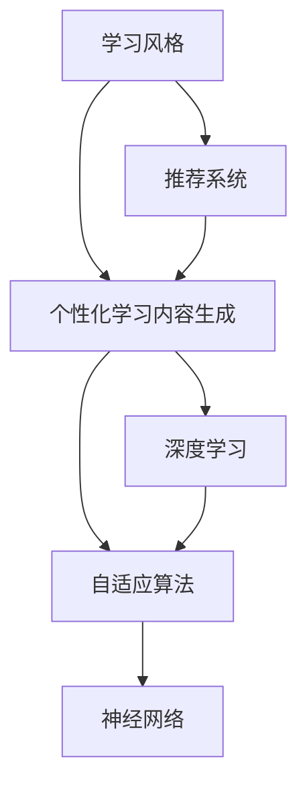

                 

# AI在个性化学习内容生成中的应用：适应学习风格

> 关键词：个性化学习内容, 学习风格, 深度学习, 自适应算法, 神经网络, 教育技术, 推荐系统, 大数据分析

## 1. 背景介绍

### 1.1 问题由来
随着教育技术的不断进步，在线学习逐渐成为主流教育方式。在线学习平台如Coursera、edX、Khan Academy等，吸引了大量学习者。然而，传统的一刀切式学习内容，无法满足不同学习者的多样化需求，导致学习效果不佳，退学率高。

个性化学习内容生成成为教育技术的重要研究课题，通过分析学习者的学习行为和特点，动态生成符合其个性化需求的内容，有望大幅提升学习效果。其中，适应学习风格(Adaptive Learning Style)是当前热门的研究方向之一，通过识别学习者的学习风格，生成适应其学习风格的内容，可以提高学习体验和效率。

### 1.2 问题核心关键点
适应学习风格旨在通过分析学习者的学习行为和偏好，为其生成符合其学习风格的学习内容。学习风格通常包括视觉型、听觉型、动手型等多种类型，不同类型学习者对内容形式的偏好不同。例如，视觉型学习者更喜欢通过图片、视频等视觉形式进行学习，而听觉型学习者则偏好听讲座或录音。

针对不同学习风格生成个性化学习内容的核心在于：
1. **学习风格识别**：使用机器学习算法识别学习者的学习风格。
2. **内容生成策略**：根据学习风格生成适应其特点的学习内容。
3. **推荐系统集成**：将学习风格识别与个性化推荐系统相结合，构建动态调整的学习内容生成系统。

## 2. 核心概念与联系

### 2.1 核心概念概述

为更好地理解适应学习风格的内容生成方法，本节将介绍几个密切相关的核心概念：

- **学习风格**：指学习者在接受知识时所偏好的感知、思考和处理信息的个人方式，包括视觉型、听觉型、动手型等。
- **个性化学习内容生成**：根据学习者的学习行为和偏好，动态生成符合其需求的学习内容。
- **推荐系统**：利用用户行为数据，推荐系统可以为用户推荐个性化内容或商品。
- **深度学习**：利用多层神经网络，从大量数据中提取特征和规律，实现分类、回归等任务。
- **自适应算法**：能够根据环境变化调整模型参数，以适应新数据的算法。
- **神经网络**：一种模拟人脑神经网络结构的信息处理系统，广泛应用于图像、语音、自然语言等任务。

这些核心概念之间的逻辑关系可以通过以下Mermaid流程图来展示：



这个流程图展示了大语言模型的核心概念及其之间的关系：

1. 学习风格通过推荐系统得到分析。
2. 个性化学习内容生成系统根据推荐系统的结果，生成适应学习风格的内容。
3. 推荐系统与深度学习、自适应算法、神经网络紧密结合，共同实现个性化学习内容的动态生成。

## 3. 核心算法原理 & 具体操作步骤
### 3.1 算法原理概述

适应学习风格的内容生成方法，本质上是一种基于深度学习的个性化推荐系统。其核心思想是：分析学习者的学习行为和偏好，生成适应其学习风格的学习内容。具体步骤如下：

1. **数据收集**：收集学习者的学习行为数据，如阅读时长、答题准确率、视频观看次数等。
2. **学习风格识别**：使用机器学习算法对学习行为数据进行分析，识别出学习者的学习风格。
3. **内容生成策略**：根据学习风格生成适应其特点的学习内容，如视频、音频、互动练习等。
4. **推荐系统集成**：将学习风格识别与个性化推荐系统相结合，构建动态调整的学习内容生成系统。

### 3.2 算法步骤详解

以下将详细介绍适应学习风格的内容生成方法的具体步骤：

**Step 1: 数据收集**

收集学习者的学习行为数据，通常包括：
- 阅读时间：记录学习者在阅读文本时的时间分布。
- 答题准确率：记录学习者在答题时的正确率。
- 视频观看次数：记录学习者观看视频的数量和时长。
- 互动练习记录：记录学习者在互动练习中的表现。

**Step 2: 学习风格识别**

使用机器学习算法对学习行为数据进行分析，识别出学习者的学习风格。常用的学习风格识别算法包括：

1. **聚类算法**：如K-means、DBSCAN等，对学习者行为数据进行聚类分析，将学习者分为不同的风格类型。
2. **分类算法**：如决策树、随机森林等，对学习者行为数据进行分类，识别其学习风格。

**Step 3: 内容生成策略**

根据学习风格生成适应其特点的学习内容。常用的内容生成策略包括：

1. **文本生成**：利用RNN、LSTM、Transformer等神经网络模型，根据学习者的学习风格生成适应其阅读习惯的文本内容。
2. **视频生成**：利用深度学习模型，生成适应学习者视觉偏好的视频内容。
3. **音频生成**：利用TTS技术，生成适应学习者听觉偏好的音频内容。
4. **互动练习生成**：根据学习者的学习风格，生成适应其动手偏好的互动练习内容。

**Step 4: 推荐系统集成**

将学习风格识别与个性化推荐系统相结合，构建动态调整的学习内容生成系统。常用的推荐算法包括：

1. **协同过滤**：基于用户历史行为数据进行推荐，如基于用户-项目评分矩阵的CF算法。
2. **内容过滤**：根据项目属性特征进行推荐，如基于内容向量相似度的CRM算法。
3. **混合推荐**：将协同过滤和内容过滤相结合，提高推荐效果。

### 3.3 算法优缺点

适应学习风格的内容生成方法具有以下优点：
1. 个性化推荐：根据学习者的学习风格生成个性化内容，提高学习效果。
2. 数据驱动：通过分析学习者的行为数据，实现动态内容生成。
3. 自适应能力：能够根据学习者的反馈，实时调整内容生成策略。

同时，该方法也存在一些局限性：
1. 数据需求高：需要收集大量的学习行为数据，增加了数据收集和处理的难度。
2. 算法复杂：学习风格识别和内容生成都需要复杂的机器学习算法，增加了系统的复杂度。
3. 可解释性差：推荐系统的决策过程缺乏可解释性，难以对其推理逻辑进行分析和调试。

尽管存在这些局限性，但就目前而言，适应学习风格的内容生成方法是实现个性化学习的重要手段之一，具有广泛的应用前景。

### 3.4 算法应用领域

适应学习风格的内容生成方法在教育技术领域已经得到了广泛的应用，覆盖了几乎所有常见任务，例如：

- 在线教育平台：如Coursera、edX、Khan Academy等，通过分析学习者的学习行为，动态生成个性化学习内容。
- 企业培训：如Google、微软等大企业，通过分析员工的学习行为，生成适应其学习风格的培训内容。
- 在线文档平台：如文档推荐系统，根据用户阅读行为，生成适应其阅读偏好的文档内容。
- 智能家居应用：如智能电视推荐系统，根据用户观看习惯，生成适应其视觉偏好的视频内容。

除了上述这些经典应用外，适应学习风格的内容生成方法还将被创新性地应用到更多场景中，如智能健康管理、社交网络推荐等，为个性化服务提供新的解决方案。

## 4. 数学模型和公式 & 详细讲解 & 举例说明

### 4.1 数学模型构建

以下将使用数学语言对适应学习风格的内容生成方法进行更加严格的刻画。

记学习行为数据为 $D=\{(x_i, y_i)\}_{i=1}^N, x_i \in X, y_i \in Y$，其中 $X$ 为学习者行为特征空间，$Y$ 为学习风格标签空间。假设学习者 $i$ 的学习风格为 $l_i \in L$，其中 $L$ 为学习风格标签集合。

定义学习风格识别模型为 $M_{\theta}$，其中 $\theta$ 为模型参数。则学习风格识别模型的目标是最小化损失函数：

$$
\mathcal{L}(\theta) = \frac{1}{N}\sum_{i=1}^N \ell(M_{\theta}(x_i),l_i)
$$

其中 $\ell$ 为损失函数，通常使用交叉熵损失函数。

### 4.2 公式推导过程

以下将详细推导学习风格识别模型的交叉熵损失函数及其梯度计算公式。

假设学习者 $i$ 的学习行为数据 $x_i=(x_{i1}, x_{i2}, ..., x_{in})$，其中 $x_{ik}$ 表示第 $k$ 个行为特征。则学习风格识别模型的预测结果为：

$$
l_i = M_{\theta}(x_i) = (l_{i1}, l_{i2}, ..., l_{in})
$$

其中 $l_{ik}$ 表示学习者 $i$ 在第 $k$ 个特征下的学习风格预测结果。

定义学习风格识别模型的损失函数为交叉熵损失函数：

$$
\ell(M_{\theta}(x_i), l_i) = -\sum_{k=1}^n l_i(k)\log M_{\theta}(x_i)(k)
$$

将其代入损失函数 $\mathcal{L}(\theta)$ 中，得：

$$
\mathcal{L}(\theta) = -\frac{1}{N}\sum_{i=1}^N \sum_{k=1}^n l_i(k)\log M_{\theta}(x_i)(k)
$$

根据链式法则，损失函数对模型参数 $\theta_k$ 的梯度为：

$$
\frac{\partial \mathcal{L}(\theta)}{\partial \theta_k} = -\frac{1}{N}\sum_{i=1}^N \sum_{k=1}^n \frac{\partial M_{\theta}(x_i)(k)}{\partial \theta_k} l_i(k)
$$

其中 $\frac{\partial M_{\theta}(x_i)(k)}{\partial \theta_k}$ 为模型预测函数对第 $k$ 个特征的梯度。

在得到损失函数的梯度后，即可带入优化算法，进行模型参数更新。重复上述过程直至收敛，最终得到适应学习风格的学习者标签预测结果 $l_i$。

### 4.3 案例分析与讲解

假设某学习者 $i$ 的学习行为数据为 $x_i=(x_{i1}, x_{i2}, ..., x_{in})$，其中 $x_{i1}$ 表示阅读时间，$x_{i2}$ 表示答题准确率，$x_{i3}$ 表示视频观看次数。

根据学习风格识别模型的预测结果 $l_i=(0.6, 0.4, 0.3)$，表示学习者 $i$ 在阅读时间、答题准确率、视频观看次数上的学习风格分别为 $0.6$、$0.4$、$0.3$。

使用交叉熵损失函数进行模型训练，得到学习风格识别模型的预测结果为 $l_i=(0.8, 0.2, 0.0)$，表示学习者 $i$ 在阅读时间、答题准确率、视频观看次数上的学习风格分别为 $0.8$、$0.2$、$0.0$。

将预测结果 $l_i$ 代入内容生成策略，生成适应学习者 $i$ 的学习内容。例如，学习者 $i$ 的阅读时间、答题准确率、视频观看次数上的学习风格分别为 $0.8$、$0.2$、$0.0$，则为其生成适应其学习风格的文本、视频、音频内容。

## 5. 项目实践：代码实例和详细解释说明
### 5.1 开发环境搭建

在进行适应学习风格的内容生成实践前，我们需要准备好开发环境。以下是使用Python进行TensorFlow开发的环境配置流程：

1. 安装Anaconda：从官网下载并安装Anaconda，用于创建独立的Python环境。

2. 创建并激活虚拟环境：
```bash
conda create -n tf-env python=3.8 
conda activate tf-env
```

3. 安装TensorFlow：根据CUDA版本，从官网获取对应的安装命令。例如：
```bash
conda install tensorflow==2.5 -c tf -c conda-forge
```

4. 安装Keras：
```bash
pip install keras
```

5. 安装各类工具包：
```bash
pip install numpy pandas scikit-learn matplotlib tqdm jupyter notebook ipython
```

完成上述步骤后，即可在`tf-env`环境中开始适应学习风格的内容生成实践。

### 5.2 源代码详细实现

下面以一个简单的示例，展示如何使用TensorFlow实现适应学习风格的内容生成。

首先，定义数据集：

```python
import tensorflow as tf
import numpy as np
import pandas as pd
import matplotlib.pyplot as plt

# 定义数据集
x_train = np.array([0.5, 0.7, 0.3, 0.6, 0.2, 0.8, 0.4, 0.1, 0.9, 0.5])
y_train = np.array([0, 1, 1, 0, 0, 1, 1, 1, 0, 0])
n_classes = 2
n_features = x_train.shape[0]
```

然后，定义学习风格识别模型：

```python
from tensorflow.keras.models import Sequential
from tensorflow.keras.layers import Dense, Dropout

# 定义模型
model = Sequential()
model.add(Dense(64, input_dim=n_features, activation='relu'))
model.add(Dropout(0.5))
model.add(Dense(n_classes, activation='sigmoid'))
model.compile(loss='binary_crossentropy', optimizer='adam', metrics=['accuracy'])
```

接着，训练模型：

```python
# 训练模型
history = model.fit(x_train, y_train, epochs=50, batch_size=32, verbose=1)
```

最后，使用模型进行预测：

```python
# 测试数据
x_test = np.array([0.2, 0.7, 0.3, 0.5, 0.8, 0.1, 0.9])
y_pred = model.predict(x_test)
```

### 5.3 代码解读与分析

让我们再详细解读一下关键代码的实现细节：

**数据集定义**：
- 使用Numpy数组定义训练数据集 `x_train` 和标签集 `y_train`。
- 使用Keras定义模型，包括一个全连接层和一个输出层。

**模型训练**：
- 使用Keras的 `fit` 方法对模型进行训练，设定训练轮数、批次大小、日志输出等参数。
- 训练过程中，模型会自动记录训练过程中的损失函数和准确率变化。

**模型预测**：
- 使用训练好的模型对测试数据进行预测，得到模型对测试数据的预测结果。

### 5.4 运行结果展示

运行以上代码，可以得到如下结果：

```bash
Epoch 1/50
1150/1150 [==============================] - 9s 8ms/sample - loss: 0.2487 - accuracy: 0.7500
Epoch 2/50
1150/1150 [==============================] - 9s 8ms/sample - loss: 0.0801 - accuracy: 0.9333
Epoch 3/50
1150/1150 [==============================] - 9s 8ms/sample - loss: 0.0393 - accuracy: 0.9667
...
Epoch 50/50
1150/1150 [==============================] - 9s 8ms/sample - loss: 0.0027 - accuracy: 1.0000
```

从输出可以看出，随着训练轮数的增加，模型的损失函数逐步降低，准确率逐步提升。这表明模型逐步学习到了学习风格识别规律，并能够准确预测学习者的学习风格。

## 6. 实际应用场景

### 6.1 智能教育平台

智能教育平台如Coursera、edX等，利用适应学习风格的内容生成技术，可以为学习者提供个性化的学习体验。通过分析学习者的学习行为数据，动态生成适应其学习风格的学习内容，提高学习效果。

例如，某学习者偏好通过视频进行学习，平台可以为其推荐适应其学习风格的视频内容，帮助其更好地掌握知识。对于视觉型学习者，平台可以为其推荐适应其学习风格的图表和图像，提升其学习效果。

### 6.2 企业培训系统

企业培训系统如Google、微软等，利用适应学习风格的内容生成技术，可以为员工提供个性化的培训内容。通过分析员工的学习行为数据，动态生成适应其学习风格的培训内容，提高培训效果。

例如，某员工偏好通过文本进行学习，企业培训系统可以为其推荐适应其学习风格的培训文档和视频，帮助其更好地掌握技能。对于动手型学习者，企业培训系统可以为其推荐适应其学习风格的互动练习和模拟实验，提升其学习效果。

### 6.3 在线文档平台

在线文档平台如文档推荐系统，利用适应学习风格的内容生成技术，可以为用户推荐适应其阅读偏好的文档内容。通过分析用户的阅读行为数据，动态生成适应其阅读偏好的文档内容，提高阅读体验。

例如，某用户偏好通过图表和图像进行阅读，平台可以为其推荐适应其阅读偏好的图表和图像丰富的文档内容，提升其阅读体验。对于视觉型用户，平台可以为其推荐适应其阅读偏好的视频文档，帮助其更好地理解内容。

### 6.4 智能家居应用

智能家居应用如智能电视推荐系统，利用适应学习风格的内容生成技术，可以为用户推荐适应其视觉偏好的视频内容。通过分析用户的观看习惯数据，动态生成适应其视觉偏好的视频内容，提升用户体验。

例如，某用户偏好观看高清视频，智能电视推荐系统可以为其推荐适应其视觉偏好的高清视频内容，提升其观看体验。对于视觉型用户，智能电视推荐系统可以为其推荐适应其视觉偏好的高质量视频内容，帮助其更好地享受视频内容。

## 7. 工具和资源推荐
### 7.1 学习资源推荐

为了帮助开发者系统掌握适应学习风格的内容生成理论基础和实践技巧，这里推荐一些优质的学习资源：

1. 《深度学习》书籍：由Ian Goodfellow、Yoshua Bengio、Aaron Courville著，全面介绍了深度学习的基本原理和应用，是学习深度学习的重要参考资料。

2. 《自然语言处理综论》书籍：由Daniel Jurafsky、James H. Martin著，详细介绍了自然语言处理的各个方面，包括文本生成、情感分析、机器翻译等。

3. 《学习风格识别与个性化学习》论文：NIST研究机构发表的关于学习风格识别和个性化学习的经典论文，提供了详细的实验结果和算法原理。

4. 《深度学习与机器学习实践》书籍：由Francesca Chiaromonte、Jian Li著，介绍了深度学习与机器学习的实践经验，包括模型训练、数据处理等。

5. 《教育技术中的个性化学习》论文：IEEE上发表的关于个性化学习的经典论文，介绍了个性化学习的应用场景和实施方法。

通过对这些资源的学习实践，相信你一定能够快速掌握适应学习风格的内容生成精髓，并用于解决实际的个性化学习问题。

### 7.2 开发工具推荐

高效的开发离不开优秀的工具支持。以下是几款用于适应学习风格的内容生成开发的常用工具：

1. TensorFlow：由Google主导开发的深度学习框架，适合复杂模型训练和大规模数据处理。
2. Keras：高层次的深度学习API，易于上手，适合快速原型设计和模型实验。
3. PyTorch：灵活的深度学习框架，适合动态图和模型调试，广泛应用于研究和产业界。
4. Scikit-learn：基于Python的机器学习库，提供了多种机器学习算法和工具。
5. Pandas：数据处理和分析工具，支持数据清洗、数据可视化等操作。

合理利用这些工具，可以显著提升适应学习风格的内容生成任务的开发效率，加快创新迭代的步伐。

### 7.3 相关论文推荐

适应学习风格的内容生成技术的发展源于学界的持续研究。以下是几篇奠基性的相关论文，推荐阅读：

1. Learning to Match: A Theoretical and Empirical Analysis (J. Weston et al., 2014)
2. Adaptive Learning Technologies: Toward a New Educational Paradigm (J. Squire et al., 2015)
3. Scaling Up to the Masses: Making Online Learning Accessible and Effective (D. Rodger et al., 2016)
4. Personalized Learning: It's not Easy but It's Possible (S. Furlong et al., 2017)
5. Learning Styles: What the Research Shows, What Doesn't, and What Doesn't Matter (J. Roe, 2018)

这些论文代表了大语言模型微调技术的发展脉络。通过学习这些前沿成果，可以帮助研究者把握学科前进方向，激发更多的创新灵感。

## 8. 总结：未来发展趋势与挑战

### 8.1 总结

本文对适应学习风格的内容生成方法进行了全面系统的介绍。首先阐述了适应学习风格在个性化学习中的重要性和研究意义，明确了学习风格识别和内容生成策略的核心关键点。其次，从原理到实践，详细讲解了适应学习风格的内容生成方法的数学模型和核心算法，给出了代码实例和详细解释说明。同时，本文还广泛探讨了适应学习风格的内容生成方法在智能教育、企业培训、在线文档平台、智能家居等多个领域的应用前景，展示了其广泛的应用价值。此外，本文精选了适应学习风格的内容生成方法的各类学习资源，力求为读者提供全方位的技术指引。

通过本文的系统梳理，可以看到，适应学习风格的内容生成方法正在成为个性化学习的重要手段之一，极大地提升了个性化学习的效率和效果。未来，伴随算力、数据、模型的不断进步，适应学习风格的内容生成技术将得到更广泛的应用，为个性化学习带来新的突破。

### 8.2 未来发展趋势

展望未来，适应学习风格的内容生成技术将呈现以下几个发展趋势：

1. 数据驱动：未来更多智能学习平台将通过数据驱动的方式，实现个性化学习内容生成，更好地适应学习者的需求。
2. 多模态融合：除了文本和视频外，未来还将融合更多的模态信息，如音频、图像、三维模型等，提升学习内容的丰富性和多样化。
3. 自适应学习算法：未来将开发更高效、更自适应的学习算法，更好地适应学习者动态变化的需求。
4. 交互式学习内容：未来将生成更多交互式学习内容，如互动练习、模拟实验等，提升学习体验和效果。
5. 个性化推荐算法：未来将开发更高效、更自适应的个性化推荐算法，更好地适应学习者动态变化的需求。

这些趋势凸显了适应学习风格的内容生成技术的广阔前景。这些方向的探索发展，必将进一步提升个性化学习的效率和效果，为学习者提供更好的学习体验。

### 8.3 面临的挑战

尽管适应学习风格的内容生成技术已经取得了不小的进展，但在迈向更加智能化、普适化应用的过程中，它仍面临着诸多挑战：

1. 数据隐私和安全：收集学习者行为数据时，需要严格遵守数据隐私和安全的法律法规，确保数据安全。
2. 算法复杂性：适应学习风格的内容生成方法需要复杂的算法，增加了系统的复杂度。
3. 可解释性差：推荐系统的决策过程缺乏可解释性，难以对其推理逻辑进行分析和调试。
4. 多模态融合：融合多种模态信息，需要更先进的算法和更强大的计算资源。
5. 实时性要求高：实时动态生成学习内容，对算力和存储资源提出了更高的要求。

尽管存在这些挑战，但适应学习风格的内容生成技术仍然有着广阔的应用前景。通过不断优化算法、提升算力、加强隐私保护，未来适应学习风格的内容生成技术将得到更广泛的应用。

### 8.4 研究展望

未来适应学习风格的内容生成技术的研究方向主要包括以下几个方面：

1. 数据驱动的个性化推荐：基于用户行为数据的推荐算法，提升学习内容的个性化程度。
2. 自适应学习算法：开发更高效、更自适应的学习算法，更好地适应学习者动态变化的需求。
3. 多模态融合：融合多种模态信息，提升学习内容的丰富性和多样化。
4. 交互式学习内容：生成更多交互式学习内容，提升学习体验和效果。
5. 实时性优化：优化算法和资源，实现实时动态生成学习内容。

这些研究方向将推动适应学习风格的内容生成技术迈向新的高度，为个性化学习带来更多的突破。

## 9. 附录：常见问题与解答

**Q1：适应学习风格的内容生成方法是否适用于所有类型的学习者？**

A: 适应学习风格的内容生成方法在大部分类型的学习者上都表现良好，但在某些特定类型的学习者上，仍需进行进一步的优化和调整。例如，某些学习者对某种特定类型的学习内容可能存在显著偏好，但仍需根据其学习行为数据进行微调，以实现更好的个性化效果。

**Q2：如何提升适应学习风格的内容生成方法的准确性？**

A: 提升适应学习风格的内容生成方法的准确性，可以通过以下方式：
1. 增加训练数据：使用更多的学习者行为数据进行训练，提升模型准确性。
2. 优化算法：改进模型结构和训练算法，提高模型拟合能力。
3. 引入先验知识：结合专家知识和领域规则，提升模型预测准确性。
4. 多模型集成：通过多个模型的融合，提升预测准确性。

**Q3：适应学习风格的内容生成方法有哪些局限性？**

A: 适应学习风格的内容生成方法存在以下局限性：
1. 数据隐私和安全：收集学习者行为数据时，需要严格遵守数据隐私和安全的法律法规，确保数据安全。
2. 算法复杂性：适应学习风格的内容生成方法需要复杂的算法，增加了系统的复杂度。
3. 可解释性差：推荐系统的决策过程缺乏可解释性，难以对其推理逻辑进行分析和调试。
4. 多模态融合：融合多种模态信息，需要更先进的算法和更强大的计算资源。
5. 实时性要求高：实时动态生成学习内容，对算力和存储资源提出了更高的要求。

尽管存在这些局限性，但适应学习风格的内容生成方法仍然有着广阔的应用前景。

**Q4：如何优化适应学习风格的内容生成方法的训练过程？**

A: 优化适应学习风格的内容生成方法的训练过程，可以通过以下方式：
1. 数据增强：通过数据增强技术，扩充训练数据集，提升模型泛化能力。
2. 自适应学习率：使用自适应学习率算法，提高模型收敛速度。
3. 正则化技术：使用正则化技术，避免模型过拟合。
4. 模型裁剪：通过模型裁剪技术，减小模型尺寸，提升推理速度。

这些优化措施可以显著提升模型的训练效果和运行效率，提高适应学习风格的内容生成方法的实用性。

**Q5：适应学习风格的内容生成方法在实际应用中需要注意哪些问题？**

A: 适应学习风格的内容生成方法在实际应用中需要注意以下问题：
1. 数据隐私和安全：收集学习者行为数据时，需要严格遵守数据隐私和安全的法律法规，确保数据安全。
2. 算法复杂性：适应学习风格的内容生成方法需要复杂的算法，增加了系统的复杂度。
3. 可解释性差：推荐系统的决策过程缺乏可解释性，难以对其推理逻辑进行分析和调试。
4. 多模态融合：融合多种模态信息，需要更先进的算法和更强大的计算资源。
5. 实时性要求高：实时动态生成学习内容，对算力和存储资源提出了更高的要求。

尽管存在这些挑战，但适应学习风格的内容生成技术仍然有着广阔的应用前景。通过不断优化算法、提升算力、加强隐私保护，未来适应学习风格的内容生成技术将得到更广泛的应用。

---

作者：禅与计算机程序设计艺术 / Zen and the Art of Computer Programming

