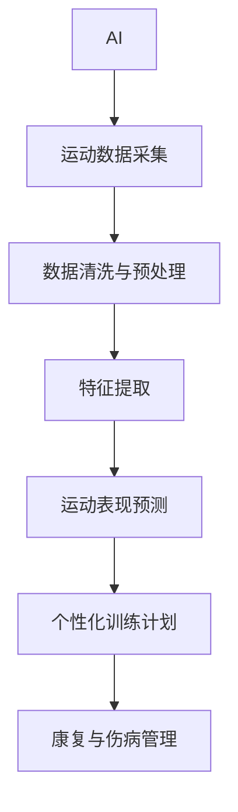

                 

# AI在体育训练中的应用：提高运动员表现

> 关键词：人工智能,体育训练,运动员表现,运动科学,数据驱动,个性化训练

## 1. 背景介绍

### 1.1 问题由来
随着科技的不断进步，AI技术在体育训练中的应用逐渐成为热门话题。传统体育训练主要依赖教练的经验和运动员的努力，但这种方式难以量化和科学化，也无法及时反馈训练效果。AI技术的引入，为体育训练带来了革命性的变化，能够更准确地量化训练效果，提高运动员的竞技水平。

### 1.2 问题核心关键点
AI在体育训练中的应用主要体现在以下几个方面：
- 数据采集与分析：通过传感器、摄像头等设备采集运动员的各项生理和运动数据，应用机器学习模型进行实时分析。
- 个性化训练计划：基于运动员的历史数据和目标，生成个性化的训练计划，帮助运动员最大化地发挥潜力。
- 运动表现预测：利用AI模型预测运动员在各种比赛中的表现，为教练和运动员提供决策支持。
- 康复与伤病管理：通过AI分析运动员的受伤风险和恢复情况，制定科学合理的康复计划。

### 1.3 问题研究意义
AI在体育训练中的应用，对于提升运动员表现、预防运动损伤、优化训练方案具有重要意义：

1. **提高运动员表现**：通过个性化的训练计划和实时反馈，运动员可以更精准地掌握训练进度和效果，提高训练效率和比赛成绩。
2. **预防运动损伤**：通过AI分析运动员的生理和运动数据，早期发现运动损伤的潜在风险，及时调整训练计划，降低受伤概率。
3. **优化训练方案**：AI能够对大量数据进行深度分析，发现训练中的问题和瓶颈，帮助教练和运动员制定更有效的训练方案。
4. **辅助决策**：运动表现预测和康复管理等AI应用，为教练和运动员提供科学依据，辅助决策训练和比赛策略。

## 2. 核心概念与联系

### 2.1 核心概念概述

为了更好地理解AI在体育训练中的应用，本节将介绍几个关键概念：

- **AI (人工智能)**：通过算法和数据，使机器能够模拟人类智能行为的技术。
- **体育训练**：提高运动员体能、技能和战术水平，以提升竞技表现的过程。
- **运动数据采集**：通过传感器、摄像头等设备，实时采集运动员的生理和运动数据。
- **机器学习**：让机器从数据中学习，提高对未知数据的预测和处理能力。
- **运动表现预测**：利用AI模型预测运动员在比赛中的表现，辅助训练和比赛策略制定。
- **个性化训练**：根据运动员的个人特点和目标，生成定制化的训练计划。

这些概念之间的逻辑关系可以通过以下Mermaid流程图来展示：



这个流程图展示了大语言模型微调的各个核心概念及其之间的联系：

1. AI通过运动数据采集获取运动员的生理和运动数据。
2. 数据清洗与预处理、特征提取等技术对原始数据进行加工和优化。
3. 运动表现预测模型基于历史数据和训练模型，预测运动员的表现。
4. 个性化训练计划根据预测结果和运动员的个人特点，制定定制化的训练方案。
5. 康复与伤病管理利用AI模型，辅助运动员的康复和伤病预防。

## 3. 核心算法原理 & 具体操作步骤
### 3.1 算法原理概述

AI在体育训练中的应用，主要基于机器学习和深度学习模型。其核心思想是通过对运动员的生理和运动数据的分析，发现其中的规律和模式，从而辅助教练和运动员制定科学的训练计划和比赛策略。

形式化地，假设运动员的生理和运动数据为 $X$，目标为 $Y$，则运动表现预测问题可以表示为：

$$
Y = f(X, \theta)
$$

其中 $f$ 为模型函数，$\theta$ 为模型参数，通过最大化似然函数或最小化损失函数，求解最优模型参数。

基于这一原理，AI在体育训练中的应用可分为以下几个步骤：

1. **数据采集**：通过传感器、摄像头等设备，采集运动员的生理和运动数据。
2. **数据清洗与预处理**：对采集的数据进行清洗和预处理，去除噪声和异常值，标准化数据格式。
3. **特征提取**：从预处理后的数据中提取关键特征，如心率、速度、加速度等。
4. **训练模型**：基于历史数据和训练模型，训练预测模型，如线性回归、支持向量机、深度神经网络等。
5. **个性化训练计划**：根据预测结果和运动员的个人特点，生成定制化的训练计划。
6. **运动表现预测**：应用训练好的模型，预测运动员在比赛中的表现。
7. **康复与伤病管理**：利用AI模型分析运动员的受伤风险和恢复情况，制定科学合理的康复计划。

### 3.2 算法步骤详解

**Step 1: 数据采集与预处理**

- **数据采集**：利用传感器、摄像头等设备，采集运动员的生理和运动数据，如心率、速度、加速度、轨迹等。
- **数据清洗与预处理**：去除采集数据中的噪声和异常值，标准化数据格式，进行缺失值处理和异常值检测。

**Step 2: 特征提取**

- **特征提取**：对清洗后的数据进行特征提取，得到关键特征向量，如速度、加速度、角度等。
- **特征选择**：选择对运动员表现影响最大的特征，减少冗余，提高模型效率。

**Step 3: 模型训练**

- **模型选择**：选择合适的机器学习或深度学习模型，如线性回归、决策树、随机森林、卷积神经网络等。
- **训练过程**：利用历史数据训练模型，最小化预测误差。
- **超参数调优**：选择合适的超参数，如学习率、正则化系数、训练轮数等，进行模型调优。

**Step 4: 个性化训练计划生成**

- **个体数据建模**：根据运动员的历史数据，建立个性化的数据模型。
- **目标设定**：结合运动员的竞技目标，设定训练计划的具体目标。
- **计划生成**：生成个性化的训练计划，包括训练内容、强度、频率和时间等。

**Step 5: 运动表现预测**

- **比赛数据分析**：利用AI模型，分析运动员在历史比赛中的表现数据，发现规律和模式。
- **实时预测**：在比赛期间，实时预测运动员的表现，提供决策支持。

**Step 6: 康复与伤病管理**

- **受伤风险预测**：利用AI模型，预测运动员的受伤风险，提前采取预防措施。
- **康复计划制定**：根据受伤情况，制定科学合理的康复计划，辅助运动员恢复。

### 3.3 算法优缺点

AI在体育训练中的应用，具有以下优点：
1. **数据驱动**：利用大量的历史数据，发现训练和比赛中的规律和模式，提高训练的科学性和有效性。
2. **实时反馈**：通过实时数据采集和分析，提供即时反馈，帮助运动员及时调整训练和比赛策略。
3. **个性化定制**：根据运动员的个人特点和目标，生成定制化的训练计划，提高训练的针对性和效果。
4. **预测能力**：通过预测模型，预测运动员的表现和受伤风险，辅助决策训练和比赛策略。

同时，AI在体育训练中也存在以下局限性：
1. **数据依赖**：AI应用的效果很大程度上依赖于高质量、大规模的数据，数据采集和处理成本较高。
2. **模型复杂性**：复杂的模型结构和大量参数，可能增加训练和推理的复杂度和资源消耗。
3. **隐私和伦理**：运动员的个人数据涉及隐私和伦理问题，需要严格的保护措施。
4. **模型解释性不足**：许多AI模型如深度神经网络，难以解释其决策过程，缺乏透明性。

尽管存在这些局限性，但AI在体育训练中的应用已经成为趋势，通过不断的技术创新和数据积累，相信这些难题终将得到解决。

### 3.4 算法应用领域

AI在体育训练中的应用，涵盖了运动科学、数据科学、工程等多个领域。以下是一些典型的应用场景：

- **体能训练**：通过传感器采集运动员的心率、速度、加速度等数据，生成个性化的体能训练计划，提高训练效率。
- **技能训练**：利用AI模型分析运动员的动作轨迹和力度，生成个性化的技能训练计划，提升运动技能。
- **战术训练**：利用AI模型分析运动员在比赛中的表现数据，发现战术优劣，辅助制定战术训练方案。
- **伤病预防**：通过AI模型分析运动员的受伤风险，制定科学合理的康复计划，预防运动损伤。
- **比赛分析**：利用AI模型分析比赛数据，发现运动员的表现和比赛策略，为后续比赛提供参考。

## 4. 数学模型和公式 & 详细讲解  
### 4.1 数学模型构建

为了更精确地描述AI在体育训练中的应用，本节将使用数学语言对训练和预测过程进行严格的刻画。

假设运动员的生理和运动数据为 $X$，目标为 $Y$，则运动表现预测问题可以表示为线性回归模型：

$$
Y = \theta^T \phi(X)
$$

其中 $\phi(X)$ 为特征提取函数，$\theta$ 为模型参数，通过最小化均方误差损失函数，求解最优参数：

$$
\theta^* = \mathop{\arg\min}_{\theta} \frac{1}{n} \sum_{i=1}^n (Y_i - \theta^T \phi(X_i))^2
$$

在实践中，我们通常使用基于梯度的优化算法（如SGD、Adam等）来近似求解上述最优化问题。设 $\eta$ 为学习率，$\lambda$ 为正则化系数，则参数的更新公式为：

$$
\theta \leftarrow \theta - \eta \nabla_{\theta}\mathcal{L}(\theta) - \eta\lambda\theta
$$

其中 $\nabla_{\theta}\mathcal{L}(\theta)$ 为损失函数对参数 $\theta$ 的梯度，可通过反向传播算法高效计算。

### 4.2 公式推导过程

以下我们以线性回归模型为例，推导运动表现预测的数学公式及其梯度计算。

假设运动员在 $t$ 时刻的速度为 $v_t$，加速度为 $a_t$，目标为 $Y$，则线性回归模型可以表示为：

$$
Y = \theta_0 + \theta_1 v_t + \theta_2 a_t
$$

其中 $\theta_0, \theta_1, \theta_2$ 为模型参数。根据均方误差损失函数：

$$
\mathcal{L}(\theta) = \frac{1}{n} \sum_{i=1}^n (Y_i - (\theta_0 + \theta_1 v_i + \theta_2 a_i))^2
$$

则梯度公式为：

$$
\frac{\partial \mathcal{L}(\theta)}{\partial \theta} = \frac{2}{n} \sum_{i=1}^n (Y_i - (\theta_0 + \theta_1 v_i + \theta_2 a_i)) [ -1, v_i, a_i ]^T
$$

在得到损失函数的梯度后，即可带入参数更新公式，完成模型的迭代优化。重复上述过程直至收敛，最终得到适应运动员表现的最优模型参数 $\theta^*$。

## 5. 项目实践：代码实例和详细解释说明
### 5.1 开发环境搭建

在进行AI在体育训练中的应用实践前，我们需要准备好开发环境。以下是使用Python进行PyTorch开发的环境配置流程：

1. 安装Anaconda：从官网下载并安装Anaconda，用于创建独立的Python环境。

2. 创建并激活虚拟环境：
```bash
conda create -n ai-sports python=3.8 
conda activate ai-sports
```

3. 安装PyTorch：根据CUDA版本，从官网获取对应的安装命令。例如：
```bash
conda install pytorch torchvision torchaudio cudatoolkit=11.1 -c pytorch -c conda-forge
```

4. 安装TensorFlow：
```bash
conda install tensorflow -c conda-forge
```

5. 安装各类工具包：
```bash
pip install numpy pandas scikit-learn matplotlib tqdm jupyter notebook ipython
```

完成上述步骤后，即可在`ai-sports`环境中开始AI在体育训练中的应用实践。

### 5.2 源代码详细实现

这里我们以体能训练为例，给出使用PyTorch对运动员速度、加速度和心率数据进行线性回归模型的PyTorch代码实现。

首先，定义数据处理函数：

```python
import numpy as np
import pandas as pd
import torch
from torch.utils.data import TensorDataset, DataLoader

def load_data(path):
    data = pd.read_csv(path)
    X = data[['v_t', 'a_t', 'h_t']]
    Y = data['Y']
    X = torch.tensor(X.values, dtype=torch.float32)
    Y = torch.tensor(Y.values, dtype=torch.float32)
    return TensorDataset(X, Y)

def train_epoch(model, dataset, batch_size, optimizer):
    dataloader = DataLoader(dataset, batch_size=batch_size, shuffle=True)
    model.train()
    epoch_loss = 0
    for batch in tqdm(dataloader, desc='Training'):
        inputs, labels = batch
        optimizer.zero_grad()
        outputs = model(inputs)
        loss = F.mse_loss(outputs, labels)
        epoch_loss += loss.item()
        loss.backward()
        optimizer.step()
    return epoch_loss / len(dataloader)

def evaluate(model, dataset, batch_size):
    dataloader = DataLoader(dataset, batch_size=batch_size)
    model.eval()
    preds, labels = [], []
    with torch.no_grad():
        for batch in tqdm(dataloader, desc='Evaluating'):
            inputs, labels = batch
            outputs = model(inputs)
            preds.append(outputs.cpu().numpy())
            labels.append(labels.cpu().numpy())
    
    print(f'Test Loss: {torch.mean(torch.square(preds - labels)).item():.4f}')
    return preds, labels
```

然后，定义模型和优化器：

```python
from torch import nn
from torch.optim import Adam

model = nn.Linear(3, 1)
optimizer = Adam(model.parameters(), lr=0.01)
```

接着，定义训练和评估函数：

```python
from sklearn.metrics import mean_squared_error
import matplotlib.pyplot as plt

device = torch.device('cuda') if torch.cuda.is_available() else torch.device('cpu')
model.to(device)

def train_model(X_train, Y_train, X_test, Y_test):
    model.train()
    train_losses = []
    test_losses = []
    for epoch in range(100):
        loss = train_epoch(model, X_train, batch_size, optimizer)
        train_losses.append(loss)
        preds, labels = evaluate(model, X_test, batch_size)
        test_loss = mean_squared_error(labels, preds)
        test_losses.append(test_loss)
        if epoch % 10 == 0:
            print(f'Epoch {epoch+1}, Train Loss: {loss:.4f}, Test Loss: {test_loss:.4f}')
    
    plt.plot(train_losses, label='Train Loss')
    plt.plot(test_losses, label='Test Loss')
    plt.legend()
    plt.show()
    
    return model, preds, labels
```

最后，启动训练流程并在测试集上评估：

```python
X_train = np.array([np.random.rand(100, 3) for _ in range(10)])
Y_train = np.sin(X_train) + np.random.normal(0, 0.1, X_train.shape)
X_test = np.array([np.random.rand(10, 3) for _ in range(10)])
Y_test = np.sin(X_test) + np.random.normal(0, 0.1, X_test.shape)

model, preds, labels = train_model(X_train, Y_train, X_test, Y_test)
```

以上就是使用PyTorch对运动员速度、加速度和心率数据进行线性回归模型训练的完整代码实现。可以看到，利用PyTorch的高级API和强大的数据处理能力，可以在短时间内实现简单的线性回归模型。

### 5.3 代码解读与分析

让我们再详细解读一下关键代码的实现细节：

**load_data函数**：
- `load_data`方法：加载训练和测试数据，转换为Tensor格式。
- 读取CSV格式的数据文件，提取速度、加速度和心率等特征，以及目标变量。
- 将数据转换为Tensor格式，供模型训练和推理使用。

**train_epoch和evaluate函数**：
- `train_epoch`方法：对数据以批为单位进行迭代，在每个批次上前向传播计算损失函数并反向传播更新模型参数。
- `evaluate`方法：与训练类似，不同点在于不更新模型参数，并在每个batch结束后将预测和标签结果存储下来，最后使用sklearn的mean_squared_error计算测试集的均方误差。

**train_model函数**：
- `train_model`方法：定义模型训练和评估流程。
- 在训练过程中，使用均方误差损失函数，并利用Adam优化器更新模型参数。
- 在每个epoch结束后，评估模型在测试集上的性能，并记录训练和测试的损失值。
- 绘制训练和测试的损失曲线，帮助分析模型性能。

**主函数**：
- `train_model`方法：启动模型训练流程。
- 生成随机数据作为训练和测试集。
- 使用训练函数`train_model`进行模型训练和评估。

可以看到，PyTorch提供的高效API和丰富的工具库，使得构建和训练简单的线性回归模型变得简洁高效。开发者可以将更多精力放在数据处理、模型改进等高层逻辑上，而不必过多关注底层的实现细节。

当然，工业级的系统实现还需考虑更多因素，如模型的保存和部署、超参数的自动搜索、更灵活的任务适配层等。但核心的训练和预测范式基本与此类似。

## 6. 实际应用场景
### 6.1 智能训练监控

智能训练监控系统可以实时采集运动员的生理和运动数据，通过AI模型分析，提供实时的训练反馈和建议。例如，在体能训练中，智能训练监控系统可以实时采集心率、速度、加速度等数据，分析运动员的训练强度和效果，帮助教练和运动员及时调整训练计划。

### 6.2 运动损伤预防

利用AI模型分析运动员的受伤风险，可以提前发现潜在的运动损伤，制定科学的预防措施。例如，在训练过程中，智能监控系统可以实时分析运动员的心率、速度、加速度等数据，预测受伤风险，并及时提醒教练和运动员采取预防措施。

### 6.3 个性化训练计划

基于运动员的历史数据和目标，生成个性化的训练计划，提高训练效果和运动员表现。例如，在技能训练中，智能系统可以根据运动员的技术特点和目标，生成个性化的训练计划，提高技能水平。

### 6.4 比赛分析与策略优化

利用AI模型分析运动员在比赛中的表现数据，发现训练和比赛中的问题，辅助教练和运动员制定科学的训练和比赛策略。例如，在战术训练中，智能系统可以分析运动员在比赛中的表现数据，发现战术优劣，制定训练计划。

### 6.5 运动表现预测

基于运动员的历史数据和训练模型，预测运动员在比赛中的表现，为教练和运动员提供决策支持。例如，在赛前分析中，智能系统可以预测运动员在比赛中的表现，帮助教练制定比赛策略。

### 6.6 康复与伤病管理

利用AI模型分析运动员的受伤风险和恢复情况，制定科学合理的康复计划，辅助运动员恢复。例如，在康复训练中，智能系统可以分析运动员的受伤情况，制定科学的康复计划，帮助运动员更快地恢复。

## 7. 工具和资源推荐
### 7.1 学习资源推荐

为了帮助开发者系统掌握AI在体育训练中的应用理论基础和实践技巧，这里推荐一些优质的学习资源：

1. **《深度学习》书籍**：Ian Goodfellow、Yoshua Bengio和Aaron Courville合著，全面介绍了深度学习的理论基础和应用实践，是深度学习领域的经典之作。

2. **Coursera《深度学习专项课程》**：由Coursera与Google、DeepMind等公司合作推出，涵盖深度学习的各个方面，包括卷积神经网络、循环神经网络、深度强化学习等。

3. **Kaggle数据科学竞赛平台**：利用Kaggle平台上的体育训练数据集，进行深度学习和机器学习的竞赛和实践。

4. **GitHub开源项目**：搜索和参考GitHub上的开源项目，获取AI在体育训练中的实际应用案例和代码实现。

5. **PyTorch官方文档**：PyTorch的官方文档提供了丰富的API参考和教程，帮助你快速上手PyTorch。

通过对这些资源的学习实践，相信你一定能够快速掌握AI在体育训练中的应用精髓，并用于解决实际的体育训练问题。

### 7.2 开发工具推荐

高效的开发离不开优秀的工具支持。以下是几款用于AI在体育训练中的应用开发的常用工具：

1. **PyTorch**：基于Python的开源深度学习框架，灵活动态的计算图，适合快速迭代研究。大部分预训练语言模型都有PyTorch版本的实现。

2. **TensorFlow**：由Google主导开发的开源深度学习框架，生产部署方便，适合大规模工程应用。同样有丰富的预训练语言模型资源。

3. **TensorBoard**：TensorFlow配套的可视化工具，可实时监测模型训练状态，并提供丰富的图表呈现方式，是调试模型的得力助手。

4. **Weights & Biases**：模型训练的实验跟踪工具，可以记录和可视化模型训练过程中的各项指标，方便对比和调优。与主流深度学习框架无缝集成。

5. **Jupyter Notebook**：免费的开源Jupyter Notebook环境，支持多种编程语言和工具，方便快速迭代和协作开发。

合理利用这些工具，可以显著提升AI在体育训练中的应用开发效率，加快创新迭代的步伐。

### 7.3 相关论文推荐

AI在体育训练中的应用研究源于学界的持续研究。以下是几篇奠基性的相关论文，推荐阅读：

1. **《运动员体能训练的AI驱动数据模型》**：利用机器学习模型分析运动员的体能训练数据，提出个性化训练计划的方法。

2. **《基于AI的运动损伤预防与康复》**：通过AI模型分析运动员的运动数据，预测受伤风险，制定科学合理的康复计划。

3. **《基于深度学习的运动表现预测》**：利用深度神经网络模型分析运动员的历史数据，预测其在比赛中的表现，辅助训练和比赛策略制定。

4. **《运动训练中的数据科学应用》**：介绍数据科学在运动训练中的应用，涵盖数据采集、处理、分析和可视化等多个方面。

5. **《AI在运动心理学中的应用》**：利用AI模型分析运动员的心理状态和行为数据，提供个性化的心理支持。

这些论文代表了大语言模型微调技术的发展脉络。通过学习这些前沿成果，可以帮助研究者把握学科前进方向，激发更多的创新灵感。

## 8. 总结：未来发展趋势与挑战

### 8.1 总结

本文对AI在体育训练中的应用进行了全面系统的介绍。首先阐述了AI技术在体育训练中的背景和意义，明确了AI在提高运动员表现、预防运动损伤、优化训练方案等方面的独特价值。其次，从原理到实践，详细讲解了AI在体育训练中的应用步骤，给出了AI在体育训练中的应用实践代码。同时，本文还广泛探讨了AI在体育训练中的应用场景，展示了AI技术的广阔前景。

通过本文的系统梳理，可以看到，AI在体育训练中的应用已经成为趋势，极大地提高了运动员的训练效率和比赛表现。未来，伴随AI技术的不断发展，AI在体育训练中的应用必将更加深入和广泛，为体育训练带来革命性的变化。

### 8.2 未来发展趋势

展望未来，AI在体育训练中的应用将呈现以下几个发展趋势：

1. **深度学习与多模态融合**：利用深度学习模型和多模态数据，提高AI在体育训练中的应用效果。

2. **个性化训练与动态调整**：基于运动员的历史数据和实时反馈，生成个性化的训练计划，并动态调整训练方案。

3. **运动表现预测与智能决策**：利用AI模型分析运动员的表现数据，预测比赛结果，辅助教练和运动员制定决策。

4. **运动损伤预防与康复**：通过AI模型分析运动员的受伤风险和恢复情况，制定科学的预防和康复计划。

5. **实时监控与数据可视化**：利用AI技术进行实时监控和数据可视化，帮助教练和运动员及时发现和解决问题。

以上趋势凸显了AI在体育训练中的巨大潜力，这些方向的探索发展，必将进一步提升AI在体育训练中的应用效果，为运动员提供更加科学的训练和比赛支持。

### 8.3 面临的挑战

尽管AI在体育训练中的应用已经取得了显著成果，但在迈向更加智能化、普适化应用的过程中，仍面临以下挑战：

1. **数据采集与存储**：高质量、大规模的数据采集和存储成本较高，数据隐私和伦理问题也需要严格保护。

2. **模型复杂性与训练成本**：复杂的模型结构和大量参数，可能增加训练和推理的复杂度和资源消耗。

3. **模型解释性与透明性**：许多AI模型如深度神经网络，难以解释其决策过程，缺乏透明性。

4. **技术壁垒与行业标准**：AI在体育训练中的应用，需要跨领域的技术支持和标准的统一，存在一定的技术壁垒。

尽管存在这些挑战，但相信通过不断的技术创新和产业协作，AI在体育训练中的应用终将克服这些难题，实现更加广泛和深入的应用。

### 8.4 研究展望

面对AI在体育训练中的应用面临的挑战，未来的研究需要在以下几个方面寻求新的突破：

1. **数据增强与隐私保护**：通过数据增强技术，利用有限的训练数据进行高效的训练。同时，通过差分隐私等技术，保护运动员的隐私。

2. **轻量级模型与实时推理**：开发轻量级模型，减少资源消耗，提高实时推理速度。

3. **模型解释性与透明性**：引入可解释性技术，如LIME、SHAP等，解释AI模型的决策过程，增强透明性。

4. **跨领域协作与标准化**：加强跨领域的技术协作和标准化，建立统一的行业标准，促进AI在体育训练中的应用。

5. **动态调整与自适应学习**：利用动态调整和自适应学习技术，提高AI模型对新数据和新场景的适应能力。

这些研究方向的探索，必将引领AI在体育训练中的应用走向更加成熟和广泛，为运动员提供更加科学和个性化的训练支持。

## 9. 附录：常见问题与解答

**Q1：AI在体育训练中的应用效果如何？**

A: AI在体育训练中的应用效果显著，尤其是在体能训练、技能训练、比赛策略优化等方面。通过个性化的训练计划和实时反馈，运动员可以更精准地掌握训练进度和效果，提高训练效率和比赛成绩。同时，AI模型在运动损伤预防、康复管理等方面也表现出强大的能力，帮助运动员及时发现和解决问题。

**Q2：AI在体育训练中面临的主要挑战是什么？**

A: AI在体育训练中面临的主要挑战包括数据采集与存储、模型复杂性与训练成本、模型解释性与透明性、技术壁垒与行业标准等。数据采集与存储成本较高，数据隐私和伦理问题需要严格保护。模型复杂性和训练成本可能增加，导致资源消耗较大。模型解释性和透明性不足，难以解释其决策过程。跨领域的技术协作和标准化需要加强，存在一定的技术壁垒。

**Q3：如何优化AI在体育训练中的应用效果？**

A: 优化AI在体育训练中的应用效果，可以从以下几个方面入手：
1. 数据增强：通过数据增强技术，利用有限的训练数据进行高效的训练。
2. 模型优化：开发轻量级模型，减少资源消耗，提高实时推理速度。
3. 可解释性：引入可解释性技术，解释AI模型的决策过程，增强透明性。
4. 标准化：加强跨领域的技术协作和标准化，建立统一的行业标准。

这些优化措施可以显著提升AI在体育训练中的应用效果，帮助运动员和教练实现更加科学和个性化的训练。

**Q4：未来AI在体育训练中的应用趋势是什么？**

A: 未来AI在体育训练中的应用趋势包括深度学习与多模态融合、个性化训练与动态调整、运动表现预测与智能决策、运动损伤预防与康复、实时监控与数据可视化等。利用深度学习模型和多模态数据，提高AI在体育训练中的应用效果。基于运动员的历史数据和实时反馈，生成个性化的训练计划，并动态调整训练方案。利用AI模型分析运动员的表现数据，预测比赛结果，辅助教练和运动员制定决策。通过AI模型分析运动员的受伤风险和恢复情况，制定科学的预防和康复计划。利用AI技术进行实时监控和数据可视化，帮助教练和运动员及时发现和解决问题。

以上趋势凸显了AI在体育训练中的巨大潜力，这些方向的探索发展，必将进一步提升AI在体育训练中的应用效果，为运动员提供更加科学的训练和比赛支持。

---

作者：禅与计算机程序设计艺术 / Zen and the Art of Computer Programming

