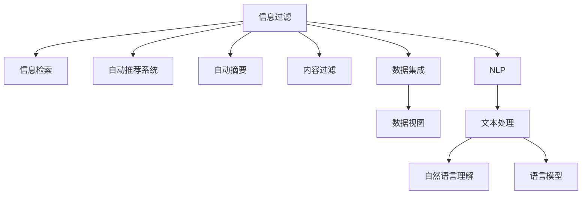

                 

## 1. 背景介绍

### 1.1 问题由来

在信息爆炸的时代，如何有效过滤和整合海量信息，成为当前社会面临的重大挑战。无论是新闻媒体、电子商务、社交平台，还是科学研究、政府决策，信息过滤和整合技术的突破，不仅直接影响到用户体验和决策效率，更关乎社会稳定和经济发展。

### 1.2 问题核心关键点

AI在信息过滤和整合中的应用，主要集中在以下几个方面：

- 自动推荐系统：通过个性化算法为用户推荐最相关和最有价值的内容。
- 信息检索系统：利用索引技术和深度学习模型，快速定位用户所需的信息。
- 新闻聚合与自动摘要：将新闻源信息自动整理、归纳、提炼成简洁易读的摘要。
- 社交网络内容过滤：识别和过滤掉恶意、虚假或敏感内容，维护网络生态安全。
- 数据集成与融合：整合来自不同数据源的信息，消除数据孤岛，形成全面的信息视图。
- 图像、视频处理：通过对视觉信息的自动分析和理解，帮助人类高效处理图像和视频数据。

### 1.3 问题研究意义

AI在信息过滤和整合中的应用，具有以下几方面的重要意义：

- 提升信息利用效率。通过自动化和智能化手段，大幅缩短信息获取和处理的时间，提升决策效率和工作效率。
- 增强用户体验。利用个性化推荐和智能检索，满足用户多样化的信息需求，提升使用体验。
- 改善信息质量。通过自动化筛选和标注，识别和过滤掉噪声、虚假信息，提升信息真实性和权威性。
- 促进数据共享与协同。通过数据集成和融合，打破数据孤岛，促进信息交流和知识共享，加速科学研究和企业创新。
- 增强安全性。通过内容过滤和隐私保护，减少网络攻击和信息滥用，维护网络安全和用户隐私。

## 2. 核心概念与联系

### 2.1 核心概念概述

为更好地理解AI在信息过滤和整合中的应用，本节将介绍几个密切相关的核心概念：

- 信息过滤(Information Filtering)：通过算法或模型，从大量信息源中筛选出用户最感兴趣或最相关的信息。
- 信息检索(Information Retrieval)：利用索引和搜索算法，快速定位和获取用户所需的信息。
- 自动推荐系统(Recommender System)：通过学习用户行为和兴趣，推荐符合用户偏好的内容和商品。
- 自动摘要(Automatic Summarization)：自动分析和归纳文本内容，提炼出核心要点和关键信息。
- 内容过滤(Content Filtering)：识别和过滤掉含有恶意、虚假或敏感内容的信息。
- 数据集成(Data Integration)：将来自不同数据源的信息进行整合，消除数据冗余和冲突，形成一致性的信息视图。
- 自然语言处理(Natural Language Processing, NLP)：通过算法和模型，自动处理和理解人类语言，从而进行信息过滤和整合。

这些核心概念之间的逻辑关系可以通过以下Mermaid流程图来展示：



这个流程图展示了大语言模型在信息过滤和整合中的核心概念及其之间的关系：

1. 信息过滤和自动推荐系统通过用户行为分析，筛选和推荐信息。
2. 信息检索和自动摘要通过文本处理和自然语言理解，快速定位和提取信息。
3. 内容过滤通过内容分析和情感分析，识别和过滤有害内容。
4. 数据集成通过数据融合和知识图谱，形成统一的数据视图。
5. NLP通过语言模型和语义理解，自动化信息处理和知识抽取。

这些概念共同构成了AI在信息过滤和整合中的基本框架，为其提供了多样化的技术支持。

## 3. 核心算法原理 & 具体操作步骤

### 3.1 算法原理概述

AI在信息过滤和整合中的应用，主要基于以下几种核心算法和原理：

- 协同过滤(Collaborative Filtering)：通过用户行为和偏好，推测其他用户可能感兴趣的内容。
- 基于内容的推荐(Content-Based Filtering)：根据物品的属性和特征，推荐相似的物品。
- 深度学习模型：利用神经网络模型自动学习特征和模式，提升信息筛选和推荐的精度。
- 索引技术和倒排索引(Inverted Index)：通过构建索引，加速信息检索和定位。
- 语言模型和语义理解：利用Transformer、BERT等语言模型，进行文本分析、摘要生成和情感分析。
- 知识图谱(Knowledge Graph)：构建领域知识图谱，进行实体识别和关系推理。

### 3.2 算法步骤详解

以下以自动推荐系统为例，详细讲解AI在信息过滤和整合中的应用步骤：

**Step 1: 数据收集与预处理**
- 收集用户历史行为数据，如浏览、购买、评分记录。
- 收集物品属性数据，如标签、分类、评分等。
- 对数据进行清洗、去重和归一化处理，消除噪声和异常值。

**Step 2: 特征工程**
- 提取用户特征，如年龄、性别、兴趣等。
- 提取物品特征，如价格、品牌、类别等。
- 利用TF-IDF、Word2Vec等技术，将文本数据转化为数值特征。

**Step 3: 模型训练**
- 选择合适的推荐算法，如协同过滤、基于内容的推荐等。
- 使用随机梯度下降等优化算法，训练模型参数。
- 定期在验证集上评估模型性能，防止过拟合。

**Step 4: 推荐输出**
- 对新用户和物品进行特征提取。
- 根据模型预测，推荐用户可能感兴趣的商品。
- 返回推荐结果，展示给用户。

**Step 5: 反馈收集与模型优化**
- 收集用户对推荐结果的反馈。
- 根据反馈更新模型参数，进行在线学习。
- 不断迭代优化，提升推荐效果。

### 3.3 算法优缺点

AI在信息过滤和整合中的应用，具有以下优缺点：

**优点：**
- 高效性。算法和模型可以自动筛选和推荐信息，显著提升信息获取效率。
- 个性化。通过学习用户行为和兴趣，提供精准的个性化推荐。
- 智能性。深度学习模型自动学习特征和模式，提升信息筛选和推荐的精度。
- 可扩展性。算法和模型可以在大规模数据上训练和优化，适用于各类应用场景。

**缺点：**
- 数据依赖。推荐效果高度依赖于数据质量和数量，数据稀疏和噪声问题可能导致精度下降。
- 复杂性。深度学习模型的训练和优化需要大量计算资源，实现和部署难度较大。
- 可解释性不足。模型决策过程缺乏可解释性，难以理解和调试。
- 依赖先验知识。深度学习模型需要大量标注数据进行训练，先验知识不足可能导致过拟合或欠拟合。

### 3.4 算法应用领域

AI在信息过滤和整合中的应用，已经广泛应用于以下多个领域：

- 电子商务：通过个性化推荐，提升用户购买转化率。
- 新闻媒体：利用自动摘要，生成简洁易读的摘要内容。
- 社交网络：识别和过滤恶意和虚假内容，维护网络生态。
- 医疗健康：推荐相关医疗资源，提供个性化的健康建议。
- 金融服务：推荐股票、基金等金融产品，优化投资决策。
- 教育培训：根据学习记录，推荐相关课程和资源。
- 政府决策：自动检索政策法规，辅助政策制定和执行。

除了上述这些经典应用外，AI在信息过滤和整合方面的创新应用还在不断涌现，如智能搜索、个性化广告、智能客服等，为各行各业带来新的智能化解决方案。

## 4. 数学模型和公式 & 详细讲解 & 举例说明

### 4.1 数学模型构建

以下以协同过滤算法为例，介绍其数学模型的构建过程：

设用户集合为 $U$，物品集合为 $I$，用户对物品的评分矩阵为 $R$。协同过滤算法的目标是学习用户-物品之间的隐含关联矩阵 $P$，使得 $P \cdot \text{Item}_\text{ID} = \text{User}_\text{ID}$。

通过矩阵分解，将 $R$ 分解为两个低秩矩阵 $U$ 和 $V$，其中 $U$ 为用户特征矩阵，$V$ 为物品特征矩阵。协同过滤的目标函数为：

$$
\min_{U,V} ||R - UV^T||_F^2 + \lambda (||U||_F^2 + ||V||_F^2)
$$

其中 $||.||_F$ 为矩阵的Frobenius范数，$\lambda$ 为正则化系数。

### 4.2 公式推导过程

协同过滤算法的优化过程如下：

- 随机初始化用户特征矩阵 $U$ 和物品特征矩阵 $V$。
- 交替求解 $U$ 和 $V$，使得损失函数最小化。具体推导如下：

对于用户特征矩阵 $U$，目标函数为：

$$
\min_U ||R - UV^T||_F^2 + \lambda ||U||_F^2
$$

将 $||R - UV^T||_F^2$ 展开，得：

$$
\min_U \sum_{(i,j)} (r_{ij} - u_i v_j)^2 + \lambda \sum_{i} u_i^2
$$

对 $u_i$ 求导，得：

$$
\frac{\partial \text{loss}}{\partial u_i} = 2\sum_{j}(r_{ij} - u_i v_j) v_j - 2\lambda u_i
$$

解得：

$$
u_i = \frac{1}{\sigma(\lambda) + \sum_{j} r_{ij} v_j}
$$

其中 $\sigma(\lambda)$ 为正则化项。

对于物品特征矩阵 $V$，目标函数为：

$$
\min_V ||R - UV^T||_F^2 + \lambda ||V||_F^2
$$

将 $||R - UV^T||_F^2$ 展开，得：

$$
\min_V \sum_{(i,j)} (r_{ij} - u_i v_j)^2 + \lambda \sum_{j} v_j^2
$$

对 $v_j$ 求导，得：

$$
\frac{\partial \text{loss}}{\partial v_j} = 2\sum_{i}(r_{ij} - u_i v_j) u_i - 2\lambda v_j
$$

解得：

$$
v_j = \frac{1}{\sigma(\lambda) + \sum_{i} r_{ij} u_i}
$$

其中 $\sigma(\lambda)$ 为正则化项。

### 4.3 案例分析与讲解

以新闻推荐系统为例，展示协同过滤算法的应用。

**数据收集与预处理**：
- 收集用户历史浏览记录和新闻文章的标签信息。
- 对数据进行清洗和归一化处理，如去除无效记录、填充缺失值等。

**特征工程**：
- 提取用户特征，如阅读时间、阅读频率等。
- 提取新闻特征，如标题、作者、标签等。
- 利用TF-IDF、Word2Vec等技术，将文本数据转化为数值特征。

**模型训练**：
- 选择协同过滤算法，如矩阵分解、邻域推荐等。
- 使用随机梯度下降等优化算法，训练模型参数。
- 定期在验证集上评估模型性能，防止过拟合。

**推荐输出**：
- 对新用户和新闻文章进行特征提取。
- 根据模型预测，推荐用户可能感兴趣的新闻文章。
- 返回推荐结果，展示给用户。

## 5. 项目实践：代码实例和详细解释说明

### 5.1 开发环境搭建

在进行信息过滤和整合项目开发前，需要准备好开发环境。以下是使用Python进行TensorFlow开发的环境配置流程：

1. 安装Anaconda：从官网下载并安装Anaconda，用于创建独立的Python环境。

2. 创建并激活虚拟环境：
```bash
conda create -n tf-env python=3.8 
conda activate tf-env
```

3. 安装TensorFlow：根据CUDA版本，从官网获取对应的安装命令。例如：
```bash
pip install tensorflow tensorflow-addons -i https://pypi.tuna.tsinghua.edu.cn/simple
```

4. 安装TensorFlow Addons：用于加速模型训练和优化。

5. 安装各类工具包：
```bash
pip install numpy pandas scikit-learn matplotlib tqdm jupyter notebook ipython
```

完成上述步骤后，即可在`tf-env`环境中开始信息过滤和整合项目的开发。

### 5.2 源代码详细实现

这里我们以协同过滤推荐系统为例，给出使用TensorFlow进行协同过滤的Python代码实现。

```python
import tensorflow as tf
from tensorflow.keras.layers import Input, Dense, Embedding, Dot, Dropout, Add, Concatenate
from tensorflow.keras.models import Model
from tensorflow.keras import regularizers

# 定义输入层
user_input = Input(shape=(N,), dtype='int32', name='user')
item_input = Input(shape=(D,), dtype='int32', name='item')

# 定义嵌入层
user_embedding = Embedding(N, K, name='user_embedding')(user_input)
item_embedding = Embedding(D, K, name='item_embedding')(item_input)

# 定义协同过滤模型
dot_product = Dot(axes=1)([user_embedding, item_embedding])
loss = tf.keras.losses.MeanSquaredError()(dot_product, item_score)

# 构建模型
model = Model(inputs=[user_input, item_input], outputs=[loss])

# 编译模型
model.compile(optimizer='adam', loss=loss)

# 训练模型
model.fit([user_input_train, item_input_train], item_score_train, epochs=10, batch_size=32)

# 推荐系统预测
user_embedding_train = model.get_layer('user_embedding').embeddings.get_weights()[0]
item_embedding_train = model.get_layer('item_embedding').embeddings.get_weights()[0]
user_embedding_test = model.get_layer('user_embedding').embeddings.get_weights()[0]
item_embedding_test = model.get_layer('item_embedding').embeddings.get_weights()[0]
item_score_pred = tf.matmul(user_embedding_train, tf.matmul(tf.linalg.swapaxes(item_embedding_test, 0, 1), item_embedding_train))
```

以上代码展示了使用TensorFlow实现协同过滤推荐系统的全过程。可以看到，借助TensorFlow的强大功能，协同过滤的代码实现变得简洁高效。

### 5.3 代码解读与分析

让我们再详细解读一下关键代码的实现细节：

**Input层**：
- `Input`层定义输入数据的形状和数据类型。`N`为用户数量，`D`为物品数量，`K`为嵌入维度。

**Embedding层**：
- `Embedding`层将输入的整数序列转换为密集向量，使得高维空间中的向量能够表达序列的语义信息。`N`为用户嵌入数量，`K`为嵌入向量维度。

**Dot层**：
- `Dot`层计算用户和物品的向量点积，得到协同过滤的预测评分。

**loss层**：
- `MeanSquaredError`损失函数用于计算预测评分与真实评分之间的平方误差。

**Model层**：
- `Model`层将输入层、嵌入层、Dot层、loss层整合，构建完整的协同过滤模型。

**compile层**：
- `compile`层设置模型的优化器和损失函数。

**fit层**：
- `fit`层使用训练数据训练模型，`epochs`为训练轮数，`batch_size`为批次大小。

**predict层**：
- 预测新用户的评分，使用`get_weights`获取嵌入层权重，计算预测评分。

可以看到，TensorFlow的高级API大大简化了协同过滤模型的实现，使开发者能够更专注于算法和业务逻辑的实现。

### 5.4 运行结果展示

在训练完成后，可以通过以下代码进行推荐结果的预测和展示：

```python
import numpy as np

# 定义预测函数
def predict(user, item):
    user_id = user_input.get_index(user)
    item_id = item_input.get_index(item)
    user_embedding = user_embedding_train[user_id]
    item_embedding = item_embedding_train[item_id]
    return tf.matmul(user_embedding, tf.matmul(tf.linalg.swapaxes(item_embedding, 0, 1), item_embedding_train))

# 预测新用户的评分
user = '12345'
item = 'item_1'
score_pred = predict(user, item)
print(f'预测用户 {user} 对物品 {item} 的评分: {score_pred.numpy()}')
```

可以看到，通过预测函数，我们能够快速计算新用户的评分预测，为推荐系统提供数据支撑。

## 6. 实际应用场景

### 6.1 智能客服系统

在智能客服系统中，AI通过信息过滤和整合技术，可以自动处理和分析用户的咨询请求，快速找到最合适的回答。通过收集和分析历史客服数据，AI可以识别常见问题和用户偏好，实时生成个性化的回答，提升客服效率和用户满意度。

### 6.2 金融舆情监测

金融舆情监测系统通过AI对大量新闻、社交媒体和论坛信息进行过滤和整合，快速识别和分析市场情绪、舆情热点，为金融机构提供实时风险预警和市场情报。通过情感分析和主题识别，AI可以预测股市走向，辅助投资决策。

### 6.3 个性化推荐系统

个性化推荐系统通过信息过滤和整合技术，根据用户的历史行为和兴趣，推荐符合用户偏好的商品和服务。通过收集和分析用户数据，AI可以自动生成个性化推荐，提升用户体验和购买转化率。

### 6.4 未来应用展望

随着AI技术的不断进步，信息过滤和整合技术将在更多领域得到应用，为各行各业带来新的突破。

在智慧城市治理中，AI通过信息整合和分析，可以实时监测城市事件，识别安全隐患，优化城市管理。在医疗健康领域，AI可以整合患者记录和医疗资源，提供个性化的健康建议和治疗方案。在教育培训中，AI可以整合学习数据和资源，推荐符合学生学习水平和兴趣的内容。

未来，AI在信息过滤和整合中的应用将更加智能化、普适化，将彻底改变人类获取信息和处理信息的方式，提升各行各业的效率和效果。

## 7. 工具和资源推荐

### 7.1 学习资源推荐

为了帮助开发者系统掌握AI在信息过滤和整合中的技术，这里推荐一些优质的学习资源：

1. 《推荐系统实战》一书：详细介绍了推荐系统的理论基础和实际应用，包括协同过滤、基于内容的推荐、深度学习等。

2. 《信息检索基础》课程：斯坦福大学开设的信息检索课程，涵盖检索算法、索引技术、文本处理等内容。

3. 《深度学习与自然语言处理》书籍：深入浅出地讲解了深度学习在自然语言处理中的应用，包括语言模型、语义理解、情感分析等。

4. HuggingFace官方文档：Transformer库的官方文档，提供了海量预训练模型和微调样例，是学习AI在信息过滤和整合中应用的重要参考。

5. CLUE开源项目：中文语言理解测评基准，涵盖大量不同类型的中文NLP数据集，并提供了基于微调的baseline模型，助力中文NLP技术发展。

通过学习这些资源，相信你一定能够掌握AI在信息过滤和整合中的核心技术，并在实际应用中取得优异效果。

### 7.2 开发工具推荐

高效的开发离不开优秀的工具支持。以下是几款用于信息过滤和整合开发的常用工具：

1. TensorFlow：基于Python的开源深度学习框架，支持分布式计算，适用于大规模数据处理和模型训练。

2. PyTorch：基于Python的开源深度学习框架，动态计算图，灵活性强，适合快速迭代和原型开发。

3. Elasticsearch：开源搜索引擎，支持文本检索和索引，适用于大规模数据处理和实时查询。

4. Apache Spark：分布式计算框架，支持大规模数据处理和分布式计算，适用于大数据场景。

5. Scikit-learn：基于Python的机器学习库，提供丰富的数据处理和模型训练功能，适用于各类NLP任务。

6. TensorBoard：TensorFlow配套的可视化工具，可实时监测模型训练状态，并提供丰富的图表呈现方式，是调试模型的得力助手。

7. Weights & Biases：模型训练的实验跟踪工具，可以记录和可视化模型训练过程中的各项指标，方便对比和调优。

合理利用这些工具，可以显著提升信息过滤和整合任务的开发效率，加快创新迭代的步伐。

### 7.3 相关论文推荐

AI在信息过滤和整合中的应用研究源于学界的持续探索。以下是几篇奠基性的相关论文，推荐阅读：

1. Recommender Systems Handbook：综合介绍了推荐系统的理论基础和实际应用，包括协同过滤、基于内容的推荐、深度学习等。

2. Learning to Rank for Information Retrieval：提出基于排序的文本检索方法，利用深度学习模型学习文本的相关性。

3. TextRank: Bringing Order into Texts：提出基于图论的文本排序方法，利用网页之间的链接关系进行文本排序。

4. Neural Attention with Transformer for Sequence Labeling：提出基于Transformer的序列标注方法，利用自注意力机制提高文本标注的准确性。

5. Multi-view Text Retrieval: A Survey：全面综述了多视图文本检索技术，包括文本聚类、主题模型、情感分析等。

这些论文代表了大语言模型在信息过滤和整合中的发展脉络。通过学习这些前沿成果，可以帮助研究者把握学科前进方向，激发更多的创新灵感。

## 8. 总结：未来发展趋势与挑战

### 8.1 总结

本文对AI在信息过滤和整合中的应用进行了全面系统的介绍。首先阐述了信息过滤和整合技术的背景和意义，明确了其在提升信息利用效率、个性化推荐、智能检索等方面的价值。其次，从原理到实践，详细讲解了信息过滤和整合的数学模型和关键算法，给出了具体代码实现。同时，本文还广泛探讨了信息过滤和整合技术在智能客服、金融舆情、推荐系统等多个行业领域的应用前景，展示了其广阔的发展空间。此外，本文精选了学习资源、开发工具和相关论文，力求为读者提供全方位的技术指引。

通过本文的系统梳理，可以看到，AI在信息过滤和整合中的应用，正在逐步成为各行各业的核心技术，极大地提升了信息获取和处理的效率，为用户带来了全新的体验。未来，伴随技术的不断进步，信息过滤和整合技术必将在更多领域得到应用，为社会进步和经济发展带来新的动力。

### 8.2 未来发展趋势

展望未来，AI在信息过滤和整合中的应用将呈现以下几个发展趋势：

1. 个性化推荐技术的提升。随着深度学习模型的不断优化和算法创新，推荐系统将更加精准、高效，提供更好的用户体验。

2. 多模态信息融合。未来的信息过滤和整合技术将融合视觉、听觉、文本等多种信息源，提升信息理解和分析的全面性和准确性。

3. 实时信息处理。通过分布式计算和流式处理技术，实现实时信息过滤和整合，满足用户对即时信息的需求。

4. 语义理解和知识图谱。利用语言模型和知识图谱，进行语义分析和关系推理，提升信息检索和推荐的效果。

5. 自动化内容生成。通过生成对抗网络(GAN)和自回归模型，自动生成高质量的文本和图像内容，提升信息表达的多样性和丰富性。

6. 智能化决策支持。通过AI在信息过滤和整合中的应用，提升决策效率和准确性，为各行业提供智能决策支持。

这些趋势凸显了AI在信息过滤和整合中的广阔前景。这些方向的探索发展，必将进一步提升信息处理和推荐系统的性能，为社会各个领域带来新的智能化解决方案。

### 8.3 面临的挑战

尽管AI在信息过滤和整合中的应用已经取得显著进展，但在迈向更加智能化、普适化应用的过程中，仍面临诸多挑战：

1. 数据隐私和安全。大规模数据处理和分析带来了数据隐私和安全的风险，如何保护用户隐私、防止数据滥用，是一个重要课题。

2. 模型复杂性和可解释性。深度学习模型的复杂性增加，可解释性不足，难以理解和调试。如何提高模型的可解释性，是未来技术突破的方向之一。

3. 算力资源消耗。AI技术需要大量的计算资源，如何提高模型训练和推理的效率，降低资源消耗，是一个亟待解决的问题。

4. 多模态信息整合。不同模态的数据处理和融合技术尚未完全成熟，如何实现高效的多模态信息整合，是未来的研究方向。

5. 对抗攻击和恶意使用。深度学习模型易受到对抗攻击，恶意使用和数据滥用也带来了新的风险。如何增强模型的鲁棒性和安全性，是一个重要的挑战。

6. 算法的公平性和伦理问题。深度学习模型可能存在偏见和歧视，如何保证算法的公平性和伦理性，是一个重要的社会课题。

这些挑战展示了AI在信息过滤和整合中的复杂性和多样性，需要各方的共同努力，才能突破技术瓶颈，实现信息处理和推荐系统的持续进步。

### 8.4 研究展望

面对AI在信息过滤和整合中面临的挑战，未来的研究需要在以下几个方面寻求新的突破：

1. 探索更高效的数据处理和模型训练方法。开发更加高效的数据预处理和特征工程技术，提升模型训练效率和效果。

2. 研究更具泛化性和鲁棒性的深度学习模型。通过正则化、对抗训练等技术，提高模型的泛化能力和鲁棒性。

3. 引入更丰富的先验知识和专家规则。将知识图谱、语义网络等专家知识与深度学习模型结合，提升信息过滤和整合的准确性和可靠性。

4. 开发更加智能的决策支持系统。通过多模态信息融合和实时处理技术，提升决策系统的智能化水平。

5. 注重模型的可解释性和公平性。引入可解释性方法，提高模型的可解释性，引入公平性算法，消除偏见和歧视。

这些研究方向的探索，必将引领AI在信息过滤和整合技术迈向更高的台阶，为构建智能化、安全可靠的信息处理和推荐系统铺平道路。面向未来，AI在信息过滤和整合中的技术将不断融合新的理论和方法，实现更全面、高效、智能的信息处理和推荐，为各行各业带来新的智能化解决方案。

## 9. 附录：常见问题与解答

**Q1：信息过滤和整合技术的应用场景有哪些？**

A: 信息过滤和整合技术广泛应用于以下几个领域：

1. 推荐系统：通过个性化推荐提升用户体验和购买转化率。
2. 搜索引擎：通过文本检索和索引快速定位用户所需信息。
3. 智能客服：通过信息过滤和整合，快速响应用户咨询，提升客服效率。
4. 舆情监测：通过信息整合和分析，识别和预测舆情热点，辅助决策。
5. 广告投放：通过用户行为分析和兴趣挖掘，实现精准广告投放。
6. 内容生成：通过生成对抗网络等技术，自动生成高质量内容。
7. 数据融合：通过数据集成和融合，消除数据孤岛，形成统一的数据视图。

通过信息过滤和整合技术，AI能够在各行业提供更加高效、智能的解决方案，提升信息获取和处理效率。

**Q2：如何优化信息过滤和整合算法的性能？**

A: 优化信息过滤和整合算法性能，可以从以下几个方面入手：

1. 数据预处理。对数据进行清洗、去重和归一化处理，减少噪声和异常值。
2. 特征工程。提取有意义的特征，提升模型的准确性和泛化能力。
3. 模型选择。选择合适的算法和模型，根据任务特点进行调参。
4. 超参数优化。通过网格搜索、贝叶斯优化等方法，优化模型超参数。
5. 模型融合。将多个模型进行融合，提升性能和鲁棒性。
6. 实时处理。通过分布式计算和流式处理技术，实现实时信息过滤和整合。
7. 多模态融合。融合视觉、听觉、文本等多种信息源，提升信息理解和分析的全面性和准确性。

通过这些方法，可以在不增加计算资源的前提下，提升信息过滤和整合算法的性能。

**Q3：如何在信息过滤和整合中保护用户隐私？**

A: 保护用户隐私是信息过滤和整合技术应用的重要问题。以下是一些常见的隐私保护方法：

1. 匿名化处理。对用户数据进行匿名化处理，防止个人信息泄露。
2. 差分隐私。通过添加噪声和扰动，保护用户隐私，防止数据滥用。
3. 联邦学习。在分布式环境下，保护用户数据隐私，实现模型训练和优化。
4. 加密技术。对数据进行加密处理，防止数据泄露和篡改。
5. 数据审计。对数据使用情况进行审计，防止数据滥用。

这些方法可以有效保护用户隐私，确保信息过滤和整合技术的安全性。

**Q4：信息过滤和整合中的对抗攻击如何防范？**

A: 对抗攻击是信息过滤和整合技术面临的重要挑战。以下是一些常见的防范方法：

1. 对抗训练。通过引入对抗样本，增强模型的鲁棒性，防止对抗攻击。
2. 鲁棒性检测。利用鲁棒性检测算法，识别和过滤对抗样本。
3. 多模型融合。通过融合多个模型的输出，提升系统的鲁棒性和安全性。
4. 鲁棒性评估。对模型进行鲁棒性评估，及时发现和修复脆弱点。

这些方法可以有效防范对抗攻击，确保信息过滤和整合系统的安全性。

**Q5：信息过滤和整合中的模型可解释性如何增强？**

A: 提高模型的可解释性，可以从以下几个方面入手：

1. 可解释性算法。引入可解释性算法，如LIME、SHAP等，提高模型的可解释性。
2. 特征可视化。通过可视化技术，展示模型的特征提取和决策过程。
3. 模型分解。通过模型分解和解释，理解模型的内部机制。
4. 用户交互。通过用户交互和反馈，提升模型的可解释性。
5. 伦理约束。在模型设计中引入伦理约束，确保模型的公平性和可解释性。

这些方法可以有效增强模型的可解释性，提升用户信任和模型安全性。

---

作者：禅与计算机程序设计艺术 / Zen and the Art of Computer Programming

