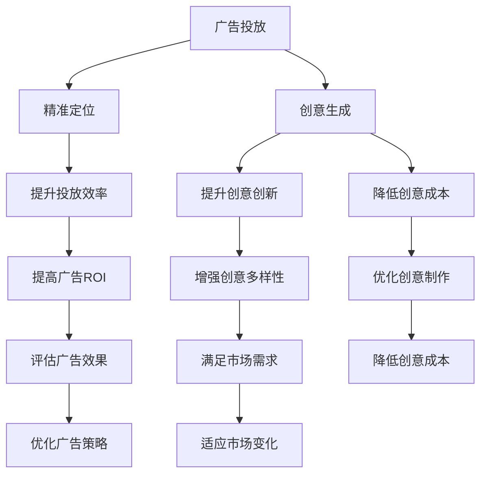

                 

# AI在广告领域的应用：精准定位与创意

## 1. 背景介绍

### 1.1 问题由来
随着数字化转型加速，广告业正经历着前所未有的变革。传统广告依赖于媒介投放，而现代广告越来越依赖数据驱动。AI技术，尤其是机器学习和深度学习，在广告领域的应用，已经带来了广告精准投放和创意生成的革命。AI不仅提升了广告投放的效率和效果，还促进了广告创意的新形式。

### 1.2 问题核心关键点
AI在广告领域的应用主要集中在精准定位和创意生成两个方面。精准定位通过数据分析和机器学习算法，帮助广告主找到最合适的受众群体，以实现更高的广告投放效率和效果。创意生成则利用深度学习模型和生成对抗网络(GANs)等技术，快速生成高质量的广告创意，大幅降低创意制作的时间和成本。

### 1.3 问题研究意义
AI在广告领域的应用，对于提升广告投放的精准性和创意的创新性，有着重要意义：

1. **提高广告投放的精准性**：通过数据分析和算法优化，广告可以更精准地触及目标受众，减少资源浪费，提高投资回报率。
2. **提升广告创意的创新性**：AI可以快速生成多种创意方案，激发广告创意的创新性，适应市场的多变需求。
3. **降低创意制作的成本**：AI自动生成广告创意，减少了人工制作的时间和成本，使得广告创意更加高效和经济。
4. **优化广告效果评估**：AI技术可以分析广告效果，提供详细的优化建议，帮助广告主持续改进广告策略。
5. **适应市场动态变化**：AI可以实时监控市场变化，快速调整广告策略，保持广告投放的竞争优势。

## 2. 核心概念与联系

### 2.1 核心概念概述

为了更好地理解AI在广告领域的应用，本文将介绍几个核心概念：

- **广告投放**：通过媒介（如电视、网络、户外等）将广告信息传达给目标受众的过程。
- **精准定位**：利用数据分析和机器学习算法，确定广告投放的目标受众，以实现更高的投放精准性。
- **创意生成**：利用AI技术，自动生成多种广告创意，提升广告制作的效率和效果。
- **机器学习**：一种通过数据学习模型的方法，用于提升广告投放的精准性和创意的创新性。
- **深度学习**：一种机器学习的分支，利用神经网络处理复杂的数据，广泛应用于广告创意生成中。
- **生成对抗网络(GANs)**：一种生成模型，用于生成高质量的广告创意图像。

这些核心概念之间的逻辑关系可以通过以下Mermaid流程图来展示：



这个流程图展示了广告投放、精准定位、创意生成与AI技术的联系：

1. 广告投放与精准定位的结合，提升了广告的投放效率和效果。
2. 创意生成与广告投放的结合，增强了广告创意的多样性和创新性。
3. AI技术在广告投放和创意生成中的应用，带来了广告投放的精准性提升和创意制作的效率提升。
4. AI技术通过优化广告投放策略和创意制作流程，实现了广告效果的优化和广告成本的降低。

## 3. 核心算法原理 & 具体操作步骤

### 3.1 算法原理概述

AI在广告领域的应用主要通过以下几个算法原理实现：

- **数据预处理与特征工程**：通过收集和处理用户数据，提取有意义的特征，用于构建广告投放和创意生成的模型。
- **机器学习模型**：利用监督学习、无监督学习、强化学习等方法，构建广告投放的精准定位模型和创意生成的生成模型。
- **深度学习模型**：利用神经网络处理复杂的非线性数据，提升广告创意的生成效果。
- **生成对抗网络(GANs)**：通过生成器与判别器的对抗过程，生成高质量的广告创意图像。

### 3.2 算法步骤详解

以下以精准定位为例，详细讲解AI在广告领域的具体应用步骤：

1. **数据收集**：收集用户的历史行为数据、社交媒体数据、搜索引擎数据等，构建用户画像。
2. **特征工程**：提取用户特征，如年龄、性别、兴趣、地理位置等，用于构建广告投放模型。
3. **模型训练**：使用机器学习算法，训练广告投放的精准定位模型，用于预测用户对不同广告的兴趣。
4. **模型评估**：在测试集上评估模型的性能，选择最优模型进行投放。
5. **广告投放**：利用训练好的模型，将广告投放给最有可能感兴趣的受众。

### 3.3 算法优缺点

AI在广告领域的应用有以下优点：

- **提升广告投放的精准性**：通过数据分析和机器学习算法，精准定位目标受众，减少资源浪费。
- **提升广告创意的创新性**：AI可以快速生成多种广告创意，激发广告创意的创新性。
- **降低创意制作的成本**：AI自动生成广告创意，减少了人工制作的时间和成本。

同时，AI在广告领域的应用也存在一些局限性：

- **依赖高质量数据**：AI模型的效果依赖于数据的质量和数量，获取高质量数据成本较高。
- **模型复杂度高**：AI模型需要大量的计算资源，模型复杂度高，训练和推理时间长。
- **解释性不足**：AI模型的决策过程通常缺乏可解释性，难以对其推理逻辑进行分析和调试。
- **公平性和偏见**：AI模型可能学习到数据中的偏见，导致广告投放的公平性问题。

### 3.4 算法应用领域

AI在广告领域的应用范围非常广泛，覆盖了广告投放和创意生成等多个方面。以下是几个典型的应用场景：

- **搜索引擎广告**：利用AI技术优化广告投放的精准性，提升广告的点击率和转化率。
- **社交媒体广告**：通过分析用户的社交行为和兴趣，精准定位目标受众，提高广告效果。
- **视频广告**：利用深度学习技术生成高质量的视频广告创意，提升广告的吸引力和传播力。
- **程序化广告**：利用AI技术自动优化广告投放策略，实现广告的实时投放和动态调整。
- **智能推荐系统**：通过AI技术优化广告推荐算法，提升用户体验和广告效果。

## 4. 数学模型和公式 & 详细讲解 & 举例说明

### 4.1 数学模型构建

在广告投放中，常用的数学模型包括线性回归模型、逻辑回归模型、决策树模型等。以下以线性回归模型为例，讲解其在广告投放中的应用。

假设广告投放的效果可以用用户点击率来衡量，设 $y$ 为用户点击率，$x_1$、$x_2$、$x_3$ 分别为广告投放的时间、地理位置和广告创意等特征。线性回归模型的形式为：

$$
y = \beta_0 + \beta_1 x_1 + \beta_2 x_2 + \beta_3 x_3 + \epsilon
$$

其中 $\beta_0$、$\beta_1$、$\beta_2$、$\beta_3$ 为模型的系数，$\epsilon$ 为误差项。

### 4.2 公式推导过程

线性回归模型的最小二乘估计公式为：

$$
\hat{\beta} = (X^T X)^{-1} X^T y
$$

其中 $X = \begin{bmatrix} 1 & x_{11} & x_{12} & x_{13} \\ 1 & x_{21} & x_{22} & x_{23} \\ \vdots \\ 1 & x_{n1} & x_{n2} & x_{n3} \end{bmatrix}$，$y = \begin{bmatrix} y_1 \\ y_2 \\ \vdots \\ y_n \end{bmatrix}$。

### 4.3 案例分析与讲解

以某电商平台为例，假设广告投放的效果可以用用户点击率来衡量，设 $y$ 为用户点击率，$x_1$ 为用户年龄，$x_2$ 为用户性别，$x_3$ 为广告创意。收集大量历史数据，通过线性回归模型拟合用户点击率与广告投放特征之间的关系，得到最优系数 $\hat{\beta}$，即可用于预测不同广告投放效果。

## 5. 项目实践：代码实例和详细解释说明

### 5.1 开发环境搭建

在进行广告投放和创意生成的项目实践前，我们需要准备好开发环境。以下是使用Python进行TensorFlow开发的环境配置流程：

1. 安装Anaconda：从官网下载并安装Anaconda，用于创建独立的Python环境。
2. 创建并激活虚拟环境：
```bash
conda create -n tf-env python=3.8 
conda activate tf-env
```
3. 安装TensorFlow：根据CUDA版本，从官网获取对应的安装命令。例如：
```bash
conda install tensorflow-gpu=2.7.0 -c pytorch -c conda-forge
```
4. 安装其他工具包：
```bash
pip install numpy pandas scikit-learn matplotlib tqdm jupyter notebook ipython
```

完成上述步骤后，即可在`tf-env`环境中开始广告投放和创意生成的项目实践。

### 5.2 源代码详细实现

以下是一个简单的广告投放项目的代码实现：

```python
import tensorflow as tf
import numpy as np
from sklearn.model_selection import train_test_split

# 构造广告投放数据
data = np.random.rand(1000, 4)
target = np.random.randint(0, 2, size=(1000,))

# 数据预处理
X_train, X_test, y_train, y_test = train_test_split(data, target, test_size=0.2, random_state=42)

# 构建线性回归模型
X = tf.keras.Input(shape=(4,))
y = tf.keras.layers.Dense(1, activation='sigmoid')(X)
model = tf.keras.Model(inputs=X, outputs=y)

# 编译模型
model.compile(optimizer='adam', loss='binary_crossentropy', metrics=['accuracy'])

# 训练模型
model.fit(X_train, y_train, epochs=10, batch_size=32, validation_data=(X_test, y_test))

# 评估模型
loss, accuracy = model.evaluate(X_test, y_test)
print(f"Test loss: {loss:.4f}")
print(f"Test accuracy: {accuracy:.4f}")
```

### 5.3 代码解读与分析

让我们再详细解读一下关键代码的实现细节：

**广告投放数据构造**：
- `data` 数组构造了1000个样本的特征向量，每个样本包含4个特征。
- `target` 数组构造了1000个样本的标签，标签为0或1，表示用户是否点击了广告。

**数据预处理**：
- 使用`train_test_split`函数将数据划分为训练集和测试集，比例为80%和20%。
- `X_train` 和 `y_train` 分别为训练集的特征和标签，`X_test` 和 `y_test` 分别为测试集的特征和标签。

**模型构建**：
- `X` 输入层，表示特征向量。
- `y` 输出层，使用sigmoid激活函数，表示用户点击的概率。
- `model` 构建线性回归模型。

**模型编译**：
- `optimizer` 优化器，使用Adam优化器。
- `loss` 损失函数，使用二元交叉熵损失函数。
- `metrics` 评估指标，使用准确率。

**模型训练**：
- `fit` 方法进行模型训练，指定训练集和测试集，设置迭代次数和批次大小。

**模型评估**：
- `evaluate` 方法评估模型性能，返回损失和准确率。

在实际应用中，广告投放和创意生成的项目通常会涉及大量的数据处理和特征工程，代码实现会更加复杂。但核心的算法流程与上述示例类似，可以基于此进一步扩展和优化。

## 6. 实际应用场景

### 6.1 搜索引擎广告

搜索引擎广告是AI在广告领域的重要应用之一。通过收集用户的搜索历史和点击行为，利用机器学习算法，可以精准定位目标受众，优化广告投放效果。例如，通过分析用户的搜索关键词和浏览记录，广告系统可以推荐用户可能感兴趣的产品或服务，提高广告的点击率和转化率。

### 6.2 社交媒体广告

社交媒体广告利用用户的行为数据和社交网络关系，构建广告投放模型。通过分析用户的社交行为和兴趣，可以精准投放广告，提高广告效果。例如，根据用户的社交互动和兴趣标签，推荐相关广告内容，增强广告的吸引力和互动性。

### 6.3 视频广告

视频广告利用深度学习技术生成高质量的视频广告创意，提升广告的吸引力和传播力。通过分析用户的观看行为和兴趣，自动生成多种视频广告，满足不同用户的需求。例如，利用GANs生成多样化的视频广告，提高广告的点击率和用户留存率。

### 6.4 程序化广告

程序化广告通过自动优化广告投放策略，实现广告的实时投放和动态调整。通过分析用户的实时行为和兴趣，自动调整广告投放参数，提高广告的投放效率和效果。例如，实时监控广告点击率，自动调整广告预算和投放渠道，实现最优的广告投放策略。

### 6.5 智能推荐系统

智能推荐系统利用AI技术优化广告推荐算法，提升用户体验和广告效果。通过分析用户的浏览行为和兴趣，推荐相关广告内容，增强广告的个性化和精准性。例如，利用协同过滤和内容推荐算法，推荐用户可能感兴趣的广告，提高广告的点击率和转化率。

## 7. 工具和资源推荐

### 7.1 学习资源推荐

为了帮助开发者系统掌握AI在广告领域的应用，这里推荐一些优质的学习资源：

1. **《深度学习与广告技术》系列博文**：由AI技术专家撰写，深入浅出地介绍了深度学习在广告领域的应用，涵盖广告投放、创意生成等多个方面。
2. **Coursera《深度学习专项课程》**：斯坦福大学开设的深度学习课程，系统讲解深度学习的基础理论和应用案例，包括广告技术。
3. **Google AI博客**：谷歌AI团队发布的最新研究和应用成果，涵盖广告领域的诸多前沿技术。
4. **《广告算法与优化》书籍**：系统介绍广告算法和优化技术，适合广告从业者和技术开发者。
5. **Kaggle广告竞赛**：参与广告领域的Kaggle竞赛，积累实战经验，提升广告技术能力。

通过对这些资源的学习实践，相信你一定能够快速掌握AI在广告领域的应用技术，并用于解决实际的广告问题。

### 7.2 开发工具推荐

高效的开发离不开优秀的工具支持。以下是几款用于广告投放和创意生成的常用工具：

1. **TensorFlow**：由谷歌主导开发的开源深度学习框架，适合大规模工程应用，广告投放和创意生成的项目通常基于TensorFlow实现。
2. **Keras**：基于TensorFlow的高级神经网络API，提供了简单易用的接口，适合快速原型设计和模型部署。
3. **Jupyter Notebook**：开源的交互式笔记本，支持Python编程和代码运行，适合广告技术的实验和验证。
4. **Tableau**：数据可视化工具，用于展示广告投放和创意生成的效果，帮助广告主进行决策分析。
5. **Hadoop/Spark**：大数据处理工具，用于处理大规模广告数据，支持广告投放和创意生成的实时分析。

合理利用这些工具，可以显著提升广告投放和创意生成的开发效率，加快创新迭代的步伐。

### 7.3 相关论文推荐

AI在广告领域的应用源于学界的持续研究。以下是几篇奠基性的相关论文，推荐阅读：

1. **《广告投放的机器学习研究综述》**：系统总结了机器学习在广告投放中的应用，涵盖数据收集、特征工程、模型训练等多个方面。
2. **《基于深度学习的广告创意生成》**：利用深度学习模型生成高质量的广告创意，提升了广告创意的创新性和多样性。
3. **《广告投放的协同过滤推荐算法》**：利用协同过滤算法优化广告推荐，提高了广告的个性化和精准性。
4. **《程序化广告的实时优化算法》**：研究程序化广告的实时优化算法，提高了广告的投放效率和效果。
5. **《智能推荐系统的深度学习模型》**：利用深度学习模型优化广告推荐算法，提升了广告的效果和用户体验。

这些论文代表了大语言模型微调技术的发展脉络。通过学习这些前沿成果，可以帮助研究者把握学科前进方向，激发更多的创新灵感。

## 8. 总结：未来发展趋势与挑战

### 8.1 总结

本文对AI在广告领域的应用进行了全面系统的介绍。首先阐述了广告投放和创意生成的背景和意义，明确了AI在广告领域的应用价值。其次，从原理到实践，详细讲解了广告投放的数学模型和算法流程，给出了广告投放的代码实现。同时，本文还广泛探讨了AI在广告投放和创意生成中的应用场景，展示了AI技术的巨大潜力。

通过本文的系统梳理，可以看到，AI在广告领域的应用已经渗透到广告投放和创意生成的各个环节，提升了广告投放的精准性和创意的多样性。未来，伴随AI技术的不断进步，广告投放和创意生成将实现更加智能化、自动化的发展，广告投放和创意制作将更加高效和经济。

### 8.2 未来发展趋势

展望未来，AI在广告领域的应用将呈现以下几个发展趋势：

1. **实时化和动态化**：AI在广告投放和创意生成中的应用将更加实时化和动态化，能够根据用户实时行为和市场变化，快速调整广告策略。
2. **智能化和个性化**：利用AI技术，广告投放和创意生成将更加智能化和个性化，能够根据用户兴趣和行为数据，提供精准的广告推荐和创意生成。
3. **跨平台和跨设备**：AI技术将在多个平台和设备上应用，如移动设备、智能家居、可穿戴设备等，实现跨平台和跨设备的用户广告投放和创意生成。
4. **多模态和融合化**：AI技术将融合多种模态数据，如文本、图像、视频等，实现多模态广告投放和创意生成。
5. **自动化和高效化**：AI技术将实现广告投放和创意生成的自动化和高效化，减少人工干预，提高广告投放和创意制作的效率。
6. **可解释性和透明度**：AI技术将更加注重可解释性和透明度，帮助广告主理解和信任广告推荐和创意生成的过程。

以上趋势凸显了AI在广告领域的应用前景。这些方向的探索发展，必将进一步提升广告投放的精准性和创意制作的效率，为广告行业带来新的变革和机遇。

### 8.3 面临的挑战

尽管AI在广告领域的应用已经取得了显著成就，但在迈向更加智能化、普适化应用的过程中，仍面临诸多挑战：

1. **数据隐私和安全**：广告投放和创意生成依赖于大量的用户数据，如何保护用户隐私和数据安全是一个重要问题。
2. **公平性和偏见**：AI模型可能学习到数据中的偏见，导致广告投放的公平性问题，如何消除偏见是一个亟待解决的问题。
3. **模型复杂性和成本**：AI模型需要大量的计算资源和数据，训练和推理过程复杂，成本较高，如何优化模型和降低成本是一个重要课题。
4. **解释性和透明性**：AI模型的决策过程缺乏可解释性，难以对其推理逻辑进行分析和调试，如何提高模型的可解释性和透明性是一个重要研究方向。
5. **跨平台和设备兼容**：广告投放和创意生成需要在多个平台和设备上应用，如何实现跨平台和设备的兼容和优化是一个重要问题。

正视AI在广告领域的应用挑战，积极应对并寻求突破，将是大语言模型微调走向成熟的必由之路。相信随着学界和产业界的共同努力，这些挑战终将一一被克服，AI在广告领域的应用必将在未来大放异彩。

### 8.4 研究展望

面对AI在广告领域的应用挑战，未来的研究需要在以下几个方面寻求新的突破：

1. **数据隐私和安全保护**：研究数据隐私保护技术，如差分隐私、联邦学习等，保护用户隐私和数据安全。
2. **公平性和偏见消除**：研究消除模型偏见的算法和技术，确保广告投放的公平性和公正性。
3. **模型优化和成本降低**：研究高效模型压缩和优化技术，如知识蒸馏、量化加速等，降低AI模型的计算和存储成本。
4. **模型可解释性和透明性增强**：研究提高模型可解释性的技术，如可解释AI、因果推断等，增强模型的透明性和可信度。
5. **跨平台和设备兼容**：研究跨平台和设备兼容的技术，如模型压缩、推理优化等，实现多平台和多设备的无缝应用。
6. **多模态和融合化**：研究融合多模态数据的技术，如多模态特征提取、多模态模型训练等，实现多模态广告投放和创意生成。

这些研究方向的探索，必将引领AI在广告领域的应用进入新的高度，为广告行业带来更加智能、高效和公平的用户体验。

## 9. 附录：常见问题与解答

**Q1：AI在广告投放中的主要作用是什么？**

A: AI在广告投放中的主要作用是通过数据分析和机器学习算法，精准定位目标受众，提升广告的投放效率和效果。

**Q2：广告投放的线性回归模型如何训练？**

A: 广告投放的线性回归模型通过最小二乘估计方法训练，具体步骤如下：
1. 构造广告投放数据。
2. 数据预处理，划分训练集和测试集。
3. 构建线性回归模型，定义输入层、输出层和模型结构。
4. 编译模型，设置优化器、损失函数和评估指标。
5. 训练模型，指定训练集和测试集，设置迭代次数和批次大小。
6. 评估模型，计算测试集的损失和准确率。

**Q3：广告创意生成的深度学习模型有哪些？**

A: 广告创意生成的深度学习模型包括：
1. 卷积神经网络(CNN)：用于图像广告创意生成。
2. 循环神经网络(RNN)：用于文本广告创意生成。
3. 生成对抗网络(GANs)：用于生成高质量的广告创意图像。
4. 变分自编码器(VAEs)：用于生成多种广告创意，提高创意的多样性。

**Q4：程序化广告的实时优化算法有哪些？**

A: 程序化广告的实时优化算法包括：
1. 在线学习算法：通过实时监控广告效果，动态调整投放策略。
2. 强化学习算法：通过奖励机制和优化算法，实现广告投放的自动优化。
3. 协同过滤算法：通过分析用户行为数据，推荐最优的广告投放方案。

**Q5：智能推荐系统的深度学习模型有哪些？**

A: 智能推荐系统的深度学习模型包括：
1. 协同过滤算法：通过分析用户行为数据，推荐相关广告内容。
2. 内容推荐算法：通过分析广告内容和用户兴趣，推荐最优的广告创意。
3. 混合推荐算法：结合协同过滤和内容推荐算法，提升广告推荐的精准性和多样性。

通过这些学习资源、开发工具和相关论文的推荐，相信你一定能够快速掌握AI在广告领域的应用技术，并用于解决实际的广告问题。

---

作者：禅与计算机程序设计艺术 / Zen and the Art of Computer Programming

