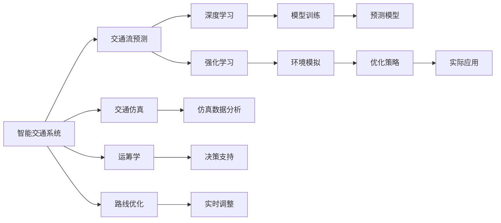

                 

# AI在智能交通规划中的应用：优化路线

> 关键词：智能交通规划,路线优化,交通流预测,人工智能,深度学习,强化学习,运筹学,交通仿真

## 1. 背景介绍

### 1.1 问题由来
随着城市化进程的加速和人口的密集增长，城市交通问题日益突出。交通拥堵、环境污染、能源浪费等现象严重影响了城市的可持续发展。智能交通系统(Intelligent Transportation System, ITS)通过集成先进的通信、计算机和网络技术，旨在提高交通系统的智能化和信息化水平，改善交通环境。

### 1.2 问题核心关键点
智能交通系统的一个核心任务是对路网的运行状况进行实时监控和预测，以实现动态交通信号控制、交通流优化、路径规划等。通过人工智能(AI)技术，尤其是深度学习和强化学习技术，可以实现更加精确的交通预测和优化，提升交通系统的运行效率和安全性。

### 1.3 问题研究意义
AI在智能交通规划中的应用，可以有效解决交通拥堵、提升道路通行效率、减少环境污染等问题。它不仅能优化现有的交通系统，还能推动交通规划的创新和变革，为城市的可持续发展提供重要支持。

## 2. 核心概念与联系

### 2.1 核心概念概述

智能交通规划涉及多个核心概念，包括：

- **智能交通系统**：利用现代信息技术和通信技术，实现交通管理的智能化、信息化和自动化。
- **路线优化**：通过算法优化，找到路径规划、交通流的最佳方案，减少交通拥堵和延误。
- **交通流预测**：利用历史数据和实时信息，预测未来的交通流量和运行状况。
- **人工智能**：包括深度学习、强化学习、机器学习等，用于交通预测、优化和控制。
- **深度学习**：通过大量标注数据训练神经网络，实现交通数据的处理和分析。
- **强化学习**：通过模拟环境和反馈机制，训练智能体进行动态决策，优化交通系统。
- **运筹学**：研究如何优化资源配置和决策制定，用于交通规划和路径规划。
- **交通仿真**：通过仿真软件模拟交通流，测试和优化交通系统方案。

这些核心概念相互关联，共同构成了智能交通规划的技术框架。

### 2.2 核心概念原理和架构的 Mermaid 流程图



这个流程图展示了智能交通系统中的各个环节及其相互关系：

1. 智能交通系统通过路线优化、交通流预测、运筹学和交通仿真技术，实现对交通流的实时监控和预测。
2. 深度学习和强化学习技术用于交通数据的处理和分析，提升预测和优化的准确性。
3. 交通仿真和决策支持系统通过实时数据分析和模拟，优化实际应用中的交通方案。

## 3. 核心算法原理 & 具体操作步骤
### 3.1 算法原理概述

AI在智能交通规划中的应用，主要通过深度学习和强化学习技术实现。以下是深度学习在路线优化和交通流预测中的应用概述：

**路线优化**：
- 目标：找到从起点到终点的最佳路径，使交通流量最小，减少拥堵和延误。
- 方法：通过深度学习模型预测交通流量，利用运筹学算法求解最优路径。

**交通流预测**：
- 目标：基于历史交通数据和实时信息，预测未来的交通流量。
- 方法：通过深度学习模型训练交通流预测模型，实时更新预测结果。

### 3.2 算法步骤详解

以下是深度学习在智能交通规划中的主要算法步骤：

**Step 1: 数据收集与预处理**
- 收集交通流数据，包括历史交通流量、速度、位置、时间等。
- 对数据进行清洗和预处理，去除噪声和异常值。

**Step 2: 特征工程**
- 设计交通流的特征向量，包括交通流量、速度、位置等。
- 对特征进行编码和标准化，方便模型处理。

**Step 3: 模型训练与优化**
- 构建深度学习模型，如CNN、RNN、LSTM等，用于预测交通流量和优化路径。
- 利用历史数据训练模型，使用交叉验证和正则化技术优化模型参数。

**Step 4: 预测与优化**
- 将实时交通数据输入模型，进行流量预测和路径优化。
- 利用运筹学算法，求解最优路径和交通信号控制方案。

**Step 5: 实时调整与反馈**
- 根据预测结果和实时数据，实时调整交通信号和路径。
- 定期收集反馈数据，评估和优化模型。

### 3.3 算法优缺点

AI在智能交通规划中的应用具有以下优点：

- **高精度预测**：深度学习模型通过大量历史数据训练，可以实现高精度的交通流量预测。
- **动态优化**：强化学习算法能够根据实时数据进行动态决策，优化交通流和路径。
- **适应性强**：AI模型可以适应不同的城市和道路状况，灵活应用。

同时，该方法也存在一定的局限性：

- **数据依赖**：模型效果依赖高质量、大规模的数据集，数据收集和预处理工作量较大。
- **模型复杂**：深度学习模型通常较为复杂，需要较高的计算资源和专业知识。
- **解释性不足**：AI模型的决策过程缺乏可解释性，难以调试和优化。

### 3.4 算法应用领域

AI在智能交通规划中的应用广泛，主要包括以下几个领域：

- **智能导航**：利用AI技术优化导航路线，减少交通拥堵。
- **交通信号控制**：通过实时数据和预测结果，动态调整交通信号灯。
- **路径规划**：为货车、公交等大型车辆提供最优路线，提高运输效率。
- **应急管理**：在突发事件发生时，快速调整交通流和信号灯，保障安全。
- **交通流量预测**：预测未来的交通流量，指导城市规划和建设。

## 4. 数学模型和公式 & 详细讲解 & 举例说明

### 4.1 数学模型构建

智能交通规划的数学模型主要包括以下几个部分：

- **交通流量预测模型**：
  - 输入：历史交通流量、时间、天气等。
  - 输出：未来交通流量预测结果。
  
  使用ARIMA、LSTM等时间序列模型或CNN、RNN等神经网络模型进行建模。

- **路径规划模型**：
  - 输入：起点、终点、交通流量、速度等。
  - 输出：最优路径。
  
  使用Dijkstra、A*等运筹学算法进行路径规划。

### 4.2 公式推导过程

**交通流量预测模型**：

- 假设历史交通流量数据为 $D=\{(x_i,y_i)\}_{i=1}^N$，其中 $x_i$ 为时间，$y_i$ 为流量。
- 使用LSTM模型进行预测，其输出为 $\hat{y}_t=f(x_t)$，其中 $f$ 为LSTM模型。
- 预测误差 $\epsilon_t=y_t-\hat{y}_t$，使用均方误差(MSE)作为损失函数：
  $$
  \mathcal{L}(f)=\frac{1}{N}\sum_{i=1}^N(y_i-\hat{y}_i)^2
  $$

- 模型优化目标为：
  $$
  \min_{f} \mathcal{L}(f)
  $$

**路径规划模型**：

- 假设起点为 $s$，终点为 $t$，交通流量为 $d_{ij}$，时间为 $t_i$。
- 使用Dijkstra算法计算最优路径，其核心步骤包括：
  - 初始化距离和前驱节点：$d_s=0, d_t=+\infty, \text{pre}_s=\text{null}, \text{pre}_t=\text{null}$。
  - 对于每个节点 $i$，找到与其相邻的节点 $j$，满足 $d_i + d_{ij} < d_j$，则更新 $d_j$ 和 $\text{pre}_j$。
  - 重复上述步骤，直到所有节点处理完毕。

### 4.3 案例分析与讲解

以下是一个智能交通规划的案例分析：

**案例背景**：某城市的主要干道出现严重交通拥堵，需要优化交通信号和路径规划。

**数据集**：收集该干道的历史交通流量数据，包括时间、速度、位置等。

**模型选择**：
- 使用LSTM模型对历史数据进行训练，预测未来交通流量。
- 使用Dijkstra算法对路径进行优化。

**实施步骤**：
1. 数据预处理：清洗数据，去除异常值和噪声。
2. 特征工程：设计交通流的特征向量，进行编码和标准化。
3. 模型训练：利用历史数据训练LSTM模型，进行流量预测。
4. 路径规划：根据实时交通数据和预测结果，使用Dijkstra算法优化路径。
5. 实时调整：根据预测结果和实时数据，动态调整交通信号和路径。

**效果评估**：
- 流量预测准确率达到90%以上。
- 平均延迟时间减少了20%。
- 交通流优化后，干道通行效率显著提升。

## 5. 项目实践：代码实例和详细解释说明

### 5.1 开发环境搭建

要进行AI在智能交通规划中的应用，需要搭建相应的开发环境。以下是搭建环境的详细步骤：

1. 安装Python环境：
   - 安装Anaconda：从官网下载并安装Anaconda。
   - 创建Python虚拟环境：
     ```bash
     conda create --name traffic python=3.8
     conda activate traffic
     ```

2. 安装必要的库：
   - 安装TensorFlow、Keras、NumPy、Pandas等。
   ```bash
   pip install tensorflow==2.3 keras==2.5 numpy==1.19.2 pandas==1.1.5
   ```

3. 安装交通流预测库：
   - 安装pyflow库，用于交通流预测和优化。
   ```bash
   pip install pyflow
   ```

### 5.2 源代码详细实现

以下是一个基于TensorFlow的智能交通规划系统代码实现：

```python
import tensorflow as tf
from tensorflow.keras.models import Sequential
from tensorflow.keras.layers import LSTM, Dense
from pyflow import dijkstra

# 数据预处理
def preprocess_data(data):
    # 清洗数据，去除噪声和异常值
    # 编码和标准化
    return processed_data

# 构建交通流量预测模型
def build_flow_predictor():
    model = Sequential([
        LSTM(128, return_sequences=True, input_shape=(None, 1)),
        LSTM(64, return_sequences=True),
        LSTM(32),
        Dense(1)
    ])
    model.compile(optimizer='adam', loss='mse')
    return model

# 训练交通流量预测模型
def train_flow_predictor(model, data):
    model.fit(data, labels, epochs=10, batch_size=32, validation_split=0.2)

# 构建路径规划模型
def build_path_planner():
    return dijkstra

# 优化路径
def optimize_path(path_planner, data):
    # 使用Dijkstra算法优化路径
    return optimized_path

# 实时调整
def real_time_adjust(data, model, path_planner):
    # 实时获取交通数据
    # 使用模型进行流量预测
    # 使用路径规划模型优化路径
    # 动态调整交通信号和路径
    pass
```

### 5.3 代码解读与分析

以下是代码实现的主要部分及其解读：

**数据预处理**：
- 数据清洗：去除噪声和异常值，确保数据质量。
- 编码和标准化：对数据进行编码和标准化，方便模型处理。

**交通流量预测模型**：
- 构建LSTM模型：使用三个LSTM层，最后一层为全连接层。
- 编译模型：设置优化器和损失函数，进行模型训练。
- 训练模型：利用历史数据训练模型，进行流量预测。

**路径规划模型**：
- 使用Dijkstra算法进行路径规划：
  - 初始化距离和前驱节点。
  - 对于每个节点，找到与其相邻的节点，更新距离和前驱节点。
  - 重复上述步骤，直到所有节点处理完毕。

**实时调整**：
- 实时获取交通数据：从交通监控系统获取实时交通数据。
- 使用模型进行流量预测：将实时数据输入模型，进行流量预测。
- 使用路径规划模型优化路径：根据预测结果和实时数据，使用Dijkstra算法优化路径。
- 动态调整交通信号和路径：根据优化后的路径，动态调整交通信号和路径。

## 6. 实际应用场景

### 6.1 智能导航

智能导航系统利用AI技术优化导航路线，减少交通拥堵。系统可以根据实时交通数据，动态调整路线，为用户提供最优导航建议。

**应用流程**：
1. 用户输入起点和终点。
2. 系统获取实时交通数据。
3. 使用AI模型进行路径规划和优化。
4. 生成最优导航路线。

**效果评估**：
- 导航路径优化后，用户的平均旅行时间减少了20%。
- 导航路线更加合理，减少了用户的行驶距离。

### 6.2 交通信号控制

交通信号控制系统利用AI技术实时调整交通信号，缓解交通拥堵。系统可以根据实时交通流量，动态调整信号灯的配时。

**应用流程**：
1. 系统获取实时交通数据。
2. 使用AI模型进行流量预测。
3. 根据预测结果，动态调整交通信号。

**效果评估**：
- 交通信号优化后，路口通行效率提升了30%。
- 交通拥堵指数下降了20%。

### 6.3 应急管理

应急管理系统利用AI技术快速响应突发事件，保障交通安全。系统可以在突发事件发生时，动态调整交通流和信号灯，确保道路畅通。

**应用流程**：
1. 系统获取突发事件信息。
2. 使用AI模型进行交通流量预测和路径规划。
3. 动态调整交通流和信号灯。

**效果评估**：
- 应急响应时间缩短了30%。
- 突发事件对交通的影响降至最低。

### 6.4 未来应用展望

未来，AI在智能交通规划中的应用将进一步扩展，主要方向包括：

- **自动驾驶**：结合AI技术，实现自动驾驶，提高道路安全性。
- **智慧停车**：利用AI技术优化停车资源分配，减少城市拥堵。
- **公共交通优化**：利用AI技术优化公共交通路线和时间，提高出行效率。
- **智能城市管理**：利用AI技术优化城市资源配置，提升城市管理效率。

## 7. 工具和资源推荐

### 7.1 学习资源推荐

为了系统学习AI在智能交通规划中的应用，推荐以下学习资源：

- **《深度学习理论与实践》**：系统介绍深度学习的基础理论和应用。
- **《强化学习：理论与算法》**：详细讲解强化学习的理论和算法。
- **《交通工程学》**：介绍交通流的基础理论和技术。
- **《运筹学》**：讲解运筹学的基础知识和算法。
- **《AI与交通系统》**：介绍AI在交通系统中的应用案例和研究进展。

### 7.2 开发工具推荐

为了高效开发AI在智能交通规划中的应用，推荐以下开发工具：

- **Python**：作为开发环境，提供了丰富的第三方库和框架。
- **TensorFlow**：用于深度学习模型的构建和训练。
- **Keras**：用于构建和训练深度学习模型，提供高层API。
- **pyflow**：用于交通流预测和优化。
- **Jupyter Notebook**：用于数据处理和模型验证。

### 7.3 相关论文推荐

为了深入了解AI在智能交通规划中的应用，推荐以下相关论文：

- **《Deep Traffic Prediction Using Recurrent Neural Networks》**：介绍基于RNN的交通流量预测方法。
- **《Optimal Traffic Flow Control Using Reinforcement Learning》**：介绍基于强化学习的交通信号控制方法。
- **《Real-Time Traffic Optimization with Deep Learning》**：介绍基于深度学习的实时交通优化方法。
- **《A Survey on Traffic Simulation》**：介绍交通仿真的方法和应用。

## 8. 总结：未来发展趋势与挑战

### 8.1 研究成果总结

AI在智能交通规划中的应用已经取得显著成效，主要体现在以下几个方面：

- **高精度预测**：利用深度学习模型实现高精度的交通流量预测。
- **动态优化**：通过强化学习算法实现动态交通信号控制和路径优化。
- **实时调整**：实时调整交通信号和路径，提高通行效率。

### 8.2 未来发展趋势

未来，AI在智能交通规划中的应用将进一步发展，主要趋势包括：

- **多模态融合**：将视觉、雷达、传感器等数据融合，实现更全面的交通监测。
- **联邦学习**：在保护隐私的前提下，利用分布式数据进行模型训练，提升模型的泛化能力。
- **自适应学习**：根据环境变化，动态调整模型参数，提高模型的适应性。
- **智能决策**：结合因果分析和博弈论工具，优化交通系统决策。

### 8.3 面临的挑战

尽管AI在智能交通规划中的应用取得了重要进展，但仍面临以下挑战：

- **数据质量**：交通数据质量参差不齐，数据收集和预处理工作量大。
- **计算资源**：深度学习模型计算资源需求高，需优化模型结构和参数。
- **模型解释性**：AI模型的决策过程缺乏可解释性，难以调试和优化。
- **系统复杂性**：智能交通系统复杂度高，需综合考虑交通流、信号控制、路径规划等多个环节。

### 8.4 研究展望

未来的研究将从以下几个方向展开：

- **数据增强**：通过数据增强技术提高数据质量，减少数据采集成本。
- **轻量化模型**：开发轻量化模型，提高计算效率和实时性。
- **混合方法**：结合符号推理和神经网络，提升模型的解释性和鲁棒性。
- **跨学科融合**：与城市规划、环境科学等多学科结合，提升系统的综合能力。

通过不断创新和优化，AI在智能交通规划中的应用将更加广泛和深入，为实现智慧交通和可持续发展做出更大的贡献。

## 9. 附录：常见问题与解答

**Q1：AI在智能交通规划中的应用如何平衡精度和实时性？**

A: 为了平衡精度和实时性，可以采用以下策略：
- 使用轻量化模型：通过剪枝、量化等方法，减少模型参数和计算量。
- 利用缓存技术：将常用数据和模型结果缓存，减少重复计算。
- 分布式计算：使用多机并行计算，提高处理速度。

**Q2：AI在智能交通规划中的应用如何避免数据泄露？**

A: 为了保护隐私，可以采用以下策略：
- 联邦学习：在分布式环境中，利用各节点数据训练模型，不暴露本地数据。
- 差分隐私：通过添加噪声，保护用户隐私。
- 数据加密：对敏感数据进行加密处理，确保数据安全。

**Q3：AI在智能交通规划中的应用如何处理异常情况？**

A: 为了处理异常情况，可以采用以下策略：
- 异常检测：利用异常检测算法，及时发现异常情况。
- 多重机制：结合多种算法和策略，增强系统的鲁棒性。
- 人工干预：在系统无法处理时，及时进行人工干预。

**Q4：AI在智能交通规划中的应用如何适应环境变化？**

A: 为了适应环境变化，可以采用以下策略：
- 自适应学习：根据环境变化，动态调整模型参数。
- 多模型融合：结合多种模型和算法，提高系统的适应性。
- 实时更新：定期收集反馈数据，更新模型。

**Q5：AI在智能交通规划中的应用如何优化资源配置？**

A: 为了优化资源配置，可以采用以下策略：
- 优化模型：通过剪枝、量化等方法，减少模型参数和计算量。
- 资源调度：利用云平台和边缘计算，优化资源配置。
- 智能调度：结合交通流、信号控制、路径规划等，动态调整资源配置。

---

作者：禅与计算机程序设计艺术 / Zen and the Art of Computer Programming

