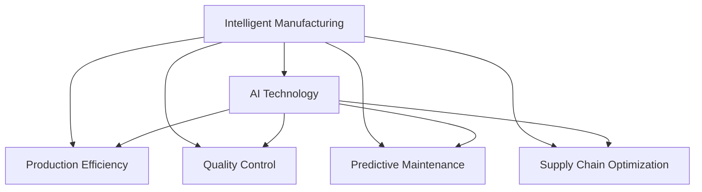

                 

# AI在智能制造中的应用：提高生产效率

> 关键词：智能制造,AI技术,生产效率,质量控制,设备维护,供应链优化,大数据分析

## 1. 背景介绍

### 1.1 问题由来
在制造业中，传统的生产方式已经无法满足现代企业对产品质量、生产效率和成本控制的需求。随着人工智能技术的迅猛发展，AI技术在智能制造中的应用已成为提升生产效率和质量、优化供应链管理的关键。通过AI技术的引入，企业可以实现自动化、智能化生产，极大地提升生产效率和产品竞争力。

智能制造（Intelligent Manufacturing）是指利用AI和大数据等先进技术，实现从设计到生产的全流程智能化，提高制造效率和产品质量，降低生产成本，提升企业竞争力。AI在智能制造中的应用涵盖了质量控制、设备维护、供应链优化等多个方面，为制造业带来了革命性的变化。

### 1.2 问题核心关键点
AI在智能制造中的应用主要体现在以下几个方面：

- 自动化生产：通过机器人和自动化设备，实现生产的自动化，减少人力成本。
- 预测性维护：利用传感器和AI算法，预测设备故障，提前进行维护，减少停机时间。
- 质量控制：通过图像识别、语音识别等技术，实时监控生产过程，确保产品质量。
- 供应链优化：利用大数据分析和AI算法，优化供应链管理，提高物流效率和减少库存成本。
- 个性化定制：根据客户需求，利用AI算法进行产品设计和生产优化，实现个性化定制。

这些应用场景都展示了AI在提升生产效率和优化生产管理方面的巨大潜力。

## 2. 核心概念与联系

### 2.1 核心概念概述

为更好地理解AI在智能制造中的应用，本节将介绍几个密切相关的核心概念：

- 智能制造（Intelligent Manufacturing）：通过自动化、信息化和智能化手段，提高制造过程的效率和质量。
- AI技术（Artificial Intelligence）：利用计算机模拟人类智能，实现机器学习、数据分析、自然语言处理、计算机视觉等功能。
- 生产效率（Production Efficiency）：指在单位时间内完成的产品数量或产值。
- 质量控制（Quality Control）：通过检测和监控，确保产品符合质量标准。
- 预测性维护（Predictive Maintenance）：利用AI和传感器数据，预测设备故障，提前进行维护。
- 供应链优化（Supply Chain Optimization）：通过数据分析和优化算法，提高供应链效率，降低成本。

这些核心概念之间的逻辑关系可以通过以下Mermaid流程图来展示：



这个流程图展示了一些核心概念及其之间的关系：

1. 智能制造通过AI技术实现自动化、智能化生产。
2. AI技术包括机器学习、数据分析、自然语言处理、计算机视觉等，为智能制造提供技术支持。
3. 生产效率、质量控制、预测性维护、供应链优化都是智能制造的关键应用场景。
4. 这些应用场景之间互相依赖，共同提升智能制造的整体效果。

## 3. 核心算法原理 & 具体操作步骤
### 3.1 算法原理概述

AI在智能制造中的应用主要基于以下几个算法原理：

- 机器学习（Machine Learning）：通过数据训练模型，实现对生产过程的预测和优化。
- 数据分析（Data Analysis）：利用统计学和数据挖掘技术，从海量数据中提取有价值的信息，优化生产过程。
- 自然语言处理（Natural Language Processing, NLP）：通过AI技术解析和理解生产相关的文本数据，实现智能化决策。
- 计算机视觉（Computer Vision）：利用图像识别和处理技术，监控生产过程和产品外观，确保质量标准。

这些算法原理构成了AI在智能制造中的应用基础，通过不同算法和技术的组合，可以针对不同的应用场景，实现生产过程的自动化、智能化和优化。

### 3.2 算法步骤详解

基于AI技术的智能制造流程一般包括以下几个关键步骤：

**Step 1: 数据收集和预处理**
- 收集生产过程中的数据，如设备状态、生产日志、质量检测数据等。
- 对数据进行清洗和预处理，确保数据质量和一致性。

**Step 2: 数据建模和训练**
- 根据应用场景选择合适的AI模型，如回归模型、分类模型、神经网络等。
- 利用历史数据对模型进行训练，调整模型参数，优化模型性能。

**Step 3: 模型部署和应用**
- 将训练好的模型部署到生产环境中，实现实时数据处理和决策。
- 利用模型进行生产过程的监控、预测和优化。

**Step 4: 持续优化和改进**
- 根据生产数据不断调整模型参数，优化模型性能。
- 引入新数据和新算法，实现持续改进。

通过这些步骤，可以实现AI在智能制造中的应用，提升生产效率和产品质量。

### 3.3 算法优缺点

AI在智能制造中的应用具有以下优点：

1. 自动化程度高：AI技术可以实现生产过程的自动化，减少人力成本，提高生产效率。
2. 数据驱动决策：通过数据分析和建模，实现生产过程的科学决策，提高质量控制。
3. 预测性维护：通过预测性维护，减少设备故障和停机时间，降低生产成本。
4. 实时监控和反馈：AI技术可以实现生产过程的实时监控和反馈，及时发现和解决问题。

同时，AI在智能制造中的应用也存在一些缺点：

1. 初始成本高：AI技术的引入需要大量的硬件设备和软件开发成本。
2. 数据质量要求高：AI模型的性能依赖于高质量的数据，数据处理和预处理的复杂度较高。
3. 技术门槛高：AI技术需要专业的人才和知识储备，对技术人员要求较高。
4. 系统复杂度高：智能制造系统涉及多个模块和组件，系统设计和集成复杂度较高。

尽管存在这些缺点，但AI在智能制造中的应用已经在诸多领域取得了显著的成果，成为提升生产效率和质量的重要手段。

### 3.4 算法应用领域

AI在智能制造中的应用已经涵盖了多个领域，包括：

- 自动化生产：利用机器人和自动化设备，实现生产的自动化和智能化。
- 质量控制：通过图像识别和语音识别技术，实时监控生产过程，确保产品质量。
- 设备维护：利用传感器和AI算法，预测设备故障，提前进行维护。
- 供应链优化：利用大数据分析和AI算法，优化供应链管理，提高物流效率和减少库存成本。
- 个性化定制：根据客户需求，利用AI算法进行产品设计和生产优化，实现个性化定制。

这些应用领域展示了AI在智能制造中的广泛应用，为制造企业带来了显著的效益。

## 4. 数学模型和公式 & 详细讲解  
### 4.1 数学模型构建

在智能制造中，AI的应用通常基于以下几个数学模型：

- 线性回归模型：用于预测生产效率、设备维护等场景。
- 分类模型：用于质量控制、供应链优化等场景。
- 神经网络模型：用于更复杂的场景，如图像识别、语音识别等。

以线性回归模型为例，假设生产效率 $y$ 与影响因素 $x_1, x_2, ..., x_n$ 之间的关系可以表示为：

$$
y = \beta_0 + \beta_1x_1 + \beta_2x_2 + ... + \beta_nx_n + \epsilon
$$

其中，$\beta_0, \beta_1, ..., \beta_n$ 为模型参数，$\epsilon$ 为随机误差项。

通过最小二乘法等方法，可以利用历史数据对模型进行训练，得到最优参数 $\beta$：

$$
\hat{\beta} = \arg\min_{\beta} \sum_{i=1}^n (y_i - \beta_0 - \beta_1x_{i1} - \beta_2x_{i2} - ... - \beta_nx_{in})^2
$$

在实际应用中，线性回归模型通常使用R、Python等工具实现。

### 4.2 公式推导过程

以线性回归模型为例，下面详细介绍其推导过程：

假设生产效率 $y$ 与影响因素 $x_1, x_2, ..., x_n$ 之间的关系为：

$$
y = \beta_0 + \beta_1x_1 + \beta_2x_2 + ... + \beta_nx_n + \epsilon
$$

利用最小二乘法，可以将问题转化为求解如下优化问题：

$$
\min_{\beta} \sum_{i=1}^n (y_i - \beta_0 - \beta_1x_{i1} - \beta_2x_{i2} - ... - \beta_nx_{in})^2
$$

对该问题进行求导，得：

$$
\frac{\partial}{\partial\beta_j} \sum_{i=1}^n (y_i - \beta_0 - \beta_1x_{i1} - \beta_2x_{i2} - ... - \beta_nx_{in})^2 = -2\sum_{i=1}^n (y_i - \beta_0 - \beta_1x_{i1} - \beta_2x_{i2} - ... - \beta_nx_{in})x_{ij}
$$

令上式等于0，得到模型参数 $\beta_j$ 的估计值：

$$
\hat{\beta}_j = \frac{\sum_{i=1}^n (y_i - \bar{y})x_{ij}}{\sum_{i=1}^n x_{ij}^2}
$$

其中，$\bar{y}$ 为样本均值。

通过求解上述优化问题，可以得到线性回归模型的最优参数 $\beta$。

### 4.3 案例分析与讲解

以预测设备故障为例，我们可以使用线性回归模型进行设备故障预测。假设设备故障概率 $y$ 与影响因素 $x_1, x_2, ..., x_n$ 之间的关系为：

$$
y = \beta_0 + \beta_1x_1 + \beta_2x_2 + ... + \beta_nx_n + \epsilon
$$

其中，$x_1, x_2, ..., x_n$ 可能包括设备运行时间、温度、压力等。通过历史数据对模型进行训练，可以得到最优参数 $\beta$。然后，利用训练好的模型，可以实时预测设备故障概率，提前进行维护。

## 5. 项目实践：代码实例和详细解释说明
### 5.1 开发环境搭建

在进行智能制造应用开发前，我们需要准备好开发环境。以下是使用Python进行TensorFlow开发的环境配置流程：

1. 安装Anaconda：从官网下载并安装Anaconda，用于创建独立的Python环境。

2. 创建并激活虚拟环境：
```bash
conda create -n tensorflow-env python=3.8 
conda activate tensorflow-env
```

3. 安装TensorFlow：根据CUDA版本，从官网获取对应的安装命令。例如：
```bash
conda install tensorflow tensorflow-estimator tensorflow-hub tensorflow-addons -c tensorflow -c conda-forge
```

4. 安装相关库：
```bash
pip install matplotlib numpy pandas scikit-learn tensorflow-addons
```

完成上述步骤后，即可在`tensorflow-env`环境中开始智能制造应用的开发。

### 5.2 源代码详细实现

下面我们以预测设备故障为例，给出使用TensorFlow进行智能制造预测的Python代码实现。

首先，定义预测模型的函数：

```python
import tensorflow as tf
import numpy as np

def predict_fault(model, x):
    return model.predict(x)
```

然后，定义数据加载函数：

```python
def load_data(file_path):
    data = np.loadtxt(file_path, delimiter=',')
    x = data[:, :-1]
    y = data[:, -1]
    return x, y
```

接着，定义训练和评估函数：

```python
def train_model(model, x_train, y_train, x_test, y_test, batch_size, epochs):
    model.compile(optimizer=tf.keras.optimizers.Adam(learning_rate=0.001), loss='mse', metrics=['mae'])
    model.fit(x_train, y_train, batch_size=batch_size, epochs=epochs, validation_data=(x_test, y_test))
    return model

def evaluate_model(model, x_test, y_test):
    loss, mae = model.evaluate(x_test, y_test)
    print(f"MAE: {mae:.2f}")
```

最后，启动训练流程并在测试集上评估：

```python
epochs = 50
batch_size = 32

x_train, y_train = load_data('train.csv')
x_test, y_test = load_data('test.csv')

model = tf.keras.Sequential([
    tf.keras.layers.Dense(64, activation='relu', input_shape=(x_train.shape[1],)),
    tf.keras.layers.Dense(1)
])

model = train_model(model, x_train, y_train, x_test, y_test, batch_size, epochs)

evaluate_model(model, x_test, y_test)
```

以上就是使用TensorFlow进行智能制造预测的完整代码实现。可以看到，通过TensorFlow的简单易用的API，我们可以快速实现预测模型。

### 5.3 代码解读与分析

让我们再详细解读一下关键代码的实现细节：

**predict_fault函数**：
- 该函数接收一个已训练好的模型和输入数据x，返回预测结果。

**load_data函数**：
- 该函数用于加载数据，将CSV文件中的数据加载到数组中，并分别取出特征x和标签y。

**train_model函数**：
- 该函数定义了训练过程，包括模型编译、训练和评估。
- 使用Adam优化器，设定了学习率为0.001，损失函数为均方误差，评估指标为平均绝对误差。
- 使用训练数据进行模型训练，设定批次大小为32，迭代轮数为50次。

**evaluate_model函数**：
- 该函数用于评估模型性能，计算测试集上的平均绝对误差。

**训练流程**：
- 定义总的迭代轮数和批次大小。
- 加载训练集和测试集数据。
- 创建模型，包括一个输入层和一个输出层。
- 调用train_model函数进行模型训练，返回训练好的模型。
- 调用evaluate_model函数在测试集上评估模型性能。

可以看到，TensorFlow的简单易用的API使得模型训练和评估变得非常快捷和简单。开发者可以将更多精力放在数据处理和模型优化上，而不必过多关注底层的实现细节。

## 6. 实际应用场景
### 6.1 自动化生产

自动化生产是AI在智能制造中最重要的应用场景之一。通过自动化设备，如机器人、自动化生产线，实现生产过程的自动化，减少人力成本，提高生产效率。

在实际应用中，企业可以部署AI驱动的自动化设备，监控生产过程，实时调整设备参数，优化生产流程。例如，使用计算机视觉技术对产品质量进行检测，利用机器学习算法预测设备故障，及时进行维护。这些技术的应用，能够大幅提升生产效率，降低生产成本。

### 6.2 质量控制

质量控制是AI在智能制造中的关键应用场景之一。通过图像识别、语音识别等技术，实时监控生产过程，确保产品质量符合标准。

例如，在制造过程中，使用计算机视觉技术检测产品的外观、尺寸、缺陷等，利用自然语言处理技术解析生产过程中的文本数据，进行实时质量监控。这些技术的应用，能够实时发现和解决问题，提高产品质量，减少次品率。

### 6.3 设备维护

设备维护是AI在智能制造中的另一个重要应用场景。通过预测性维护，提前发现和解决设备故障，减少停机时间和维修成本。

例如，利用传感器数据和AI算法，预测设备故障，提前进行维护。使用机器学习算法分析设备的运行数据，判断设备的健康状况，制定维护计划。这些技术的应用，能够减少设备的意外停机，提高生产效率，降低维护成本。

### 6.4 供应链优化

供应链优化是AI在智能制造中的重要应用场景之一。通过大数据分析和AI算法，优化供应链管理，提高物流效率和减少库存成本。

例如，利用大数据分析技术，分析市场需求、供应商数据和生产数据，制定最优的生产计划和供应链策略。使用机器学习算法预测市场需求和生产需求，进行库存管理。这些技术的应用，能够优化供应链管理，提高物流效率，降低库存成本。

### 6.5 个性化定制

个性化定制是AI在智能制造中的新兴应用场景之一。通过AI技术，根据客户需求，进行产品设计和生产优化，实现个性化定制。

例如，利用自然语言处理技术解析客户的需求，利用计算机视觉技术检测客户的需求，进行产品设计和生产优化。使用机器学习算法分析客户的历史数据和行为数据，制定个性化的生产计划。这些技术的应用，能够实现个性化定制，提高客户满意度，增加市场竞争力。

## 7. 工具和资源推荐
### 7.1 学习资源推荐

为了帮助开发者系统掌握AI在智能制造中的应用，这里推荐一些优质的学习资源：

1. TensorFlow官方文档：TensorFlow的官方文档提供了详细的API说明和示例代码，适合初学者快速上手。

2. PyTorch官方文档：PyTorch的官方文档提供了简单易用的API和丰富的示例代码，适合初学者快速上手。

3. Google Cloud AI Platform：谷歌提供的AI云服务平台，包括多种AI算法和模型，适合企业快速部署AI应用。

4. Coursera《机器学习》课程：由斯坦福大学开设的机器学习课程，提供丰富的理论知识和实践案例，适合深入学习。

5. 《机器学习实战》书籍：涵盖机器学习的基本概念和实践案例，适合入门学习。

通过对这些资源的学习实践，相信你一定能够快速掌握AI在智能制造中的应用，并用于解决实际的智能制造问题。

### 7.2 开发工具推荐

高效的开发离不开优秀的工具支持。以下是几款用于智能制造应用的常用工具：

1. TensorFlow：由Google主导开发的开源深度学习框架，生产部署方便，适合大规模工程应用。

2. PyTorch：由Facebook主导开发的开源深度学习框架，灵活高效的计算图，适合快速迭代研究。

3. Scikit-learn：Python的科学计算库，提供了丰富的机器学习算法和数据处理工具。

4. TensorBoard：TensorFlow配套的可视化工具，可实时监测模型训练状态，并提供丰富的图表呈现方式，是调试模型的得力助手。

5. Weights & Biases：模型训练的实验跟踪工具，可以记录和可视化模型训练过程中的各项指标，方便对比和调优。

6. Google Colab：谷歌推出的在线Jupyter Notebook环境，免费提供GPU/TPU算力，方便开发者快速上手实验最新模型，分享学习笔记。

合理利用这些工具，可以显著提升智能制造应用的开发效率，加快创新迭代的步伐。

### 7.3 相关论文推荐

AI在智能制造中的应用源于学界的持续研究。以下是几篇奠基性的相关论文，推荐阅读：

1. CNNs for Machine or Object Recognition（CNN用于机器识别）：提出卷积神经网络（CNN）算法，广泛应用于图像识别和计算机视觉领域。

2. Deep Reinforcement Learning for Resource Allocation（深度强化学习用于资源分配）：提出深度强化学习算法，优化生产资源分配，提高生产效率。

3. Real-Time Video Classification with TensorFlow（使用TensorFlow进行实时视频分类）：利用TensorFlow进行实时视频分类，应用于质量控制和检测。

4. Predictive Maintenance via Cyclic Neural Network（使用循环神经网络进行预测性维护）：提出循环神经网络（RNN）算法，进行设备故障预测。

5. Supply Chain Predictive Analytics（供应链预测分析）：利用大数据分析和机器学习算法，优化供应链管理，提高物流效率。

这些论文代表了大语言模型微调技术的发展脉络。通过学习这些前沿成果，可以帮助研究者把握学科前进方向，激发更多的创新灵感。

## 8. 总结：未来发展趋势与挑战

### 8.1 总结

本文对AI在智能制造中的应用进行了全面系统的介绍。首先阐述了智能制造和AI技术的背景和意义，明确了AI在提升生产效率和优化生产管理方面的独特价值。其次，从原理到实践，详细讲解了AI在智能制造中的应用方法，包括预测性维护、质量控制、设备维护、供应链优化、个性化定制等多个方面。最后，本文还探讨了AI在智能制造中的应用前景和挑战，提出了未来发展的方向和展望。

通过本文的系统梳理，可以看到，AI技术在智能制造中的应用已经取得了显著的成果，为制造企业带来了显著的效益。未来，伴随AI技术的不断演进，智能制造必将迎来更大的发展机遇，进一步提升生产效率和产品质量，实现制造业的智能化和可持续发展。

### 8.2 未来发展趋势

展望未来，AI在智能制造中的应用将呈现以下几个发展趋势：

1. 自动化水平提升：AI技术将进一步提升自动化生产设备的智能化水平，实现更复杂、更精确的生产控制。

2. 预测性维护普及：预测性维护将更广泛地应用于设备维护中，减少设备故障和停机时间，降低维护成本。

3. 质量控制精准化：AI技术将更深入地应用于质量控制中，通过图像识别、语音识别等技术，实现更精确、更实时的质量检测。

4. 供应链管理智能化：AI技术将进一步优化供应链管理，通过大数据分析和机器学习算法，实现更高效、更精准的供应链管理。

5. 个性化定制普及：AI技术将更广泛地应用于个性化定制中，通过自然语言处理和计算机视觉技术，实现更灵活、更个性化的产品设计和生产。

这些趋势凸显了AI在智能制造中的广阔前景。这些方向的探索发展，必将进一步提升智能制造的整体水平，为制造企业带来更多的经济效益。

### 8.3 面临的挑战

尽管AI在智能制造中的应用已经取得了显著的成果，但在迈向更加智能化、普适化应用的过程中，它仍面临着诸多挑战：

1. 数据质量瓶颈：AI模型的性能依赖于高质量的数据，数据处理和预处理的复杂度较高。

2. 技术门槛高：AI技术需要专业的人才和知识储备，对技术人员要求较高。

3. 系统复杂度高：智能制造系统涉及多个模块和组件，系统设计和集成复杂度较高。

4. 成本高：AI技术的引入需要大量的硬件设备和软件开发成本。

尽管存在这些挑战，但AI在智能制造中的应用已经取得了显著的成果，成为提升生产效率和质量的重要手段。未来，通过不断优化和改进，这些挑战终将一一被克服，AI技术必将在智能制造中发挥更大的作用。

### 8.4 研究展望

面对AI在智能制造中所面临的挑战，未来的研究需要在以下几个方面寻求新的突破：

1. 数据增强：通过数据增强技术，扩充训练集，提高数据质量和模型性能。

2. 知识图谱：将符号化的先验知识与神经网络模型进行融合，提高模型的知识表达能力。

3. 跨模态融合：利用多模态数据，实现视觉、语音、文本等多种信息的融合，提升模型的综合分析能力。

4. 模型压缩：通过模型压缩技术，减少模型参数和计算资源消耗，实现更轻量级的部署。

5. 持续学习：通过持续学习技术，使模型能够不断学习新知识，保持模型的时效性和适应性。

这些研究方向将推动AI在智能制造中的应用不断深入，为制造企业带来更大的经济效益和社会价值。

## 9. 附录：常见问题与解答

**Q1：AI在智能制造中的应用是否适用于所有制造企业？**

A: AI在智能制造中的应用主要适用于具备一定技术基础和数据积累的企业。对于小型制造企业，需要根据自身情况进行评估，选择适合的AI解决方案。

**Q2：AI在智能制造中的应用成本是否高？**

A: AI在智能制造中的应用成本确实较高，主要体现在设备投资和软件开发成本上。但通过分阶段实施，逐步引入AI技术，可以降低初始成本，并获得长期经济效益。

**Q3：AI在智能制造中的应用是否需要专业人才？**

A: AI在智能制造中的应用确实需要专业人才进行开发和维护。可以通过培训、合作等方式，逐步培养企业内部的AI技术人才，提升整体技术水平。

**Q4：AI在智能制造中的应用是否需要大量的数据？**

A: 是的，AI模型的性能依赖于高质量的数据。企业需要投入一定的时间和资源进行数据收集和处理，确保数据质量和一致性。

**Q5：AI在智能制造中的应用是否容易实现？**

A: AI在智能制造中的应用虽然具有巨大的潜力，但实现过程较为复杂，需要系统的规划和实施。建议企业在实施前，进行详细的技术评估和需求分析，制定合理的实施计划。

通过回答这些问题，可以看出AI在智能制造中的应用既有挑战，也有机遇。企业需要根据自身情况，制定合理的AI战略，逐步推进AI技术的应用，实现生产效率和质量的提升。

---

作者：禅与计算机程序设计艺术 / Zen and the Art of Computer Programming

