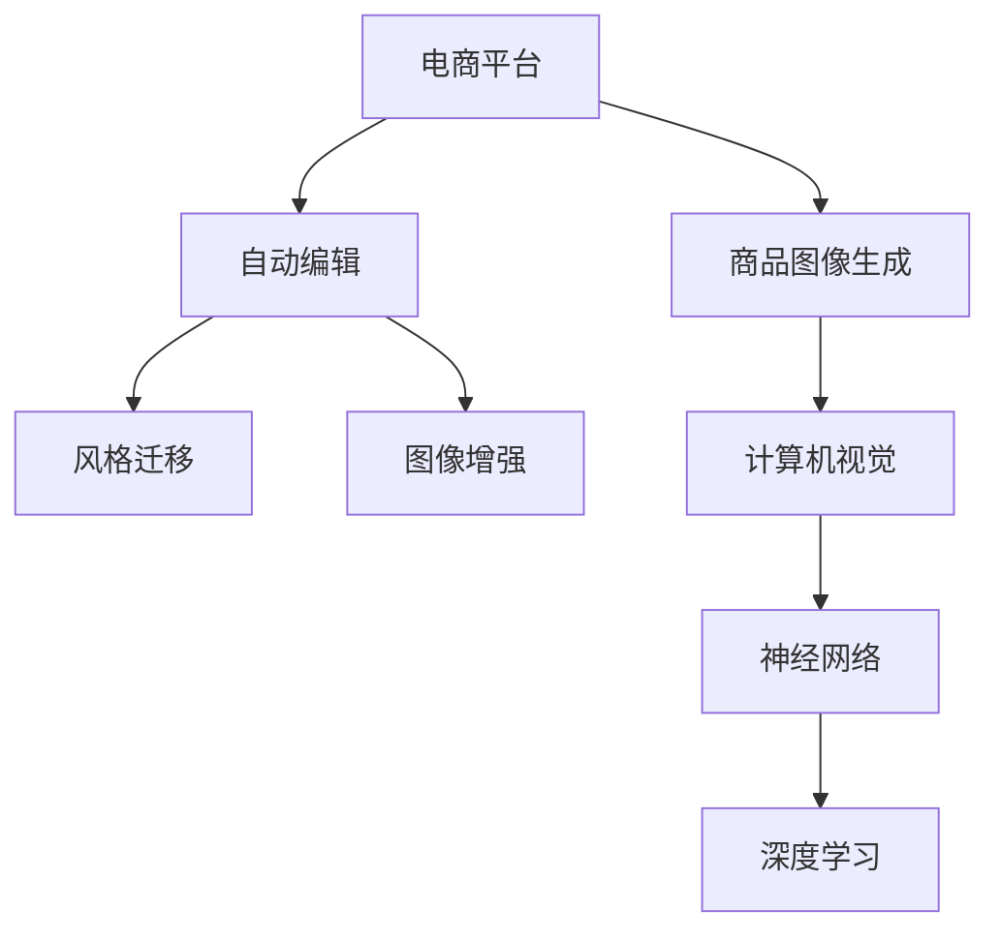

                 

# AI在电商平台商品图像自动生成与编辑中的应用

> 关键词：电商平台,商品图像生成,自动编辑,深度学习,神经网络,计算机视觉,图像处理,风格迁移,图像增强

## 1. 背景介绍

在当前数字化、电商化的时代背景下，商品展示的图片质量直接影响着用户的购买决策。电商平台为了提供更优质、更具吸引力的商品展示，对商品图像的生成与编辑提出了更高的要求。然而，高质量的商品图像往往需要专业的摄影师拍摄和后期处理，成本较高且周期较长，难以满足大规模电商平台快速迭代的需要。

随着深度学习技术的发展，AI驱动的商品图像自动生成与编辑技术应运而生，通过训练深度神经网络模型，能够在短时间内自动生成高质量的商品图像，并进行风格迁移、去瑕疵、增强等编辑操作，极大地提升了电商平台的商品展示效率和用户体验。

## 2. 核心概念与联系

### 2.1 核心概念概述

为更好地理解AI在电商平台商品图像自动生成与编辑中的应用，本节将介绍几个密切相关的核心概念：

- 电商平台(E-commerce Platform)：指通过互联网提供商品展示、销售、支付、物流等全流程服务的平台。

- 商品图像生成(Product Image Generation)：指通过计算机视觉技术，从商品描述或3D模型中自动生成高质量的商品图像的过程。

- 自动编辑(Automatic Editing)：指在商品图像生成基础上，对图像进行风格迁移、去瑕疵、增强等编辑操作，提升图像质量和风格多样性。

- 深度学习(Deep Learning)：一种基于神经网络的机器学习方法，通过大量数据训练，实现图像分类、生成、迁移等任务。

- 神经网络(Neural Network)：深度学习中的核心组件，通过多层非线性映射实现复杂特征提取与学习。

- 计算机视觉(Computer Vision)：指使用计算机技术，从图像、视频等数据中提取信息、进行识别和理解。

- 图像处理(Image Processing)：指对图像进行增强、修复、变换等操作，提升图像质量和风格多样性。

- 风格迁移(Style Transfer)：指将图像从一个风格转换成另一个风格的过程，常用于生成艺术化、复古化风格的图像。

- 图像增强(Image Enhancement)：指对图像进行对比度调整、噪声去除、色彩校正等操作，提升图像的视觉效果。

这些核心概念之间的逻辑关系可以通过以下Mermaid流程图来展示：



这个流程图展示了几者之间的联系：

1. 电商平台通过计算机视觉技术生成商品图像。
2. 自动编辑过程包括风格迁移和图像增强。
3. 计算机视觉技术使用神经网络和深度学习模型提取图像特征。

## 3. 核心算法原理 & 具体操作步骤

### 3.1 算法原理概述

基于深度学习的商品图像自动生成与编辑算法主要分为两大部分：图像生成和图像编辑。

#### 图像生成

商品图像生成基于计算机视觉技术，通过深度学习模型从商品描述或3D模型中生成高质量的图像。常见的方法包括：

1. 基于GAN的图像生成方法：使用生成对抗网络(GAN)框架，生成具有逼真细节的商品图像。
2. 基于变分自编码器(VAE)的方法：通过编码器将商品描述映射为潜在向量，再使用解码器生成图像。
3. 基于自回归的方法：如PixelRNN、PixelCNN，逐步生成像素级别的图像。

#### 图像编辑

图像编辑基于深度学习和图像处理技术，对生成的商品图像进行风格迁移、去瑕疵、增强等操作。常见的方法包括：

1. 风格迁移(Style Transfer)：使用神经网络模型，将一张图像的风格迁移至另一张图像。
2. 去瑕疵(Defect Removal)：使用卷积神经网络(CNN)模型，检测和去除图像中的瑕疵。
3. 图像增强(Image Enhancement)：使用神经网络模型，调整图像的对比度、色彩、锐度等参数，提升图像质量。

### 3.2 算法步骤详解

以下将分别介绍图像生成和图像编辑的详细步骤：

#### 图像生成

1. **数据准备**：收集商品的高质量图像和描述信息，构建训练数据集。
2. **模型选择**：选择合适的深度学习模型，如GAN、VAE等，用于生成商品图像。
3. **模型训练**：在训练集上使用反向传播算法训练模型，调整参数，使生成的图像逼近真实商品图像。
4. **图像生成**：使用训练好的模型对新商品描述或3D模型进行生成，输出高质量的商品图像。

#### 图像编辑

1. **数据准备**：收集商品的高质量图像，并标注出需要修改的区域，构建训练数据集。
2. **模型选择**：选择合适的深度学习模型，如CNN、GAN等，用于图像编辑任务。
3. **模型训练**：在训练集上使用反向传播算法训练模型，调整参数，使编辑后的图像质量提升。
4. **图像编辑**：使用训练好的模型对商品图像进行风格迁移、去瑕疵、增强等编辑操作。

### 3.3 算法优缺点

基于深度学习的商品图像自动生成与编辑算法具有以下优点：

1. 效率高：通过深度学习模型可以快速生成和编辑大量的商品图像，满足电商平台快速迭代的需求。
2. 精度高：深度学习模型能够在复杂的图像特征中捕捉到更丰富的细节和信息，生成高质量的商品图像。
3. 泛化能力强：深度学习模型可以在多种商品类型和风格下进行图像生成和编辑，具有较强的泛化能力。

但同时也存在一些局限性：

1. 数据需求大：生成和编辑高质量商品图像需要大量的标注数据，数据收集和标注成本较高。
2. 模型复杂度高：深度学习模型参数量较大，训练和推理过程中需要较高的计算资源。
3. 可解释性不足：深度学习模型的决策过程较为复杂，缺乏可解释性，难以理解模型内部工作机制。

尽管存在这些局限性，但通过合理的数据准备、模型选择和调参，依然可以在实际应用中取得良好的效果。

### 3.4 算法应用领域

基于深度学习的商品图像自动生成与编辑算法在电商平台的商品展示和营销中得到了广泛应用，具体如下：

1. **商品展示**：电商平台使用自动生成的商品图像，提供更丰富、更具吸引力的商品展示，提升用户体验。
2. **广告投放**：通过自动生成的广告图像，吸引更多用户点击，提升广告投放效果。
3. **商品推荐**：自动生成的商品图像可以用于个性化推荐系统，提升推荐精准度。
4. **库存管理**：通过自动生成的商品图像，对库存进行可视化管理，提升库存管理效率。
5. **虚拟试穿**：自动生成的商品图像可以用于虚拟试穿应用，提供更真实的购物体验。

此外，该技术也在时尚设计、影视制作、游戏开发等领域得到了应用，拓展了深度学习技术的应用边界。

## 4. 数学模型和公式 & 详细讲解 & 举例说明

### 4.1 数学模型构建

#### 图像生成

以GAN框架为例，构建商品图像生成模型。假设商品描述为 $x$，生成器网络为 $G$，生成图像为 $y$，判别器网络为 $D$，真实图像为 $y^{real}$，假图像为 $y^{fake}$，目标函数为：

$$
L_{GAN} = \mathbb{E}_{x}\log{D(G(x))} + \mathbb{E}_{y^{real}}\log{(1-D(y^{real}))} + \mathbb{E}_{x}\log{(1-D(G(x)))} + \mathbb{E}_{y^{fake}}\log{D(y^{fake})}
$$

其中，$D(y^{real})$ 表示判别器对真实图像的判别概率，$D(G(x))$ 表示判别器对生成图像的判别概率。

#### 图像编辑

以图像增强为例，使用卷积神经网络(CNN)进行图像增强。假设输入图像为 $I$，输出图像为 $I'$，卷积神经网络模型为 $F$，目标函数为：

$$
L_{CNN} = \sum_{i=1}^M||I' - F(I)||^2
$$

其中，$M$ 表示图像通道数，$||\cdot||$ 表示图像像素值的平方和。

### 4.2 公式推导过程

#### 图像生成

以GAN框架为例，推导目标函数的推导过程：

1. **生成器训练目标函数**：最大化生成图像 $y^{fake}$ 的判别概率 $D(G(x))$。
2. **判别器训练目标函数**：最大化真实图像 $y^{real}$ 的判别概率 $D(y^{real})$，同时最大化生成图像 $y^{fake}$ 的判别概率 $D(y^{fake})$。
3. **联合训练目标函数**：联合训练生成器和判别器，通过最大化生成图像的判别概率，最小化真实图像和生成图像的判别概率，使得生成图像逼近真实图像。

#### 图像编辑

以图像增强为例，推导CNN模型的目标函数：

1. **图像增强目标函数**：最小化输出图像 $I'$ 与输入图像 $I$ 的像素值平方和 $||I' - F(I)||^2$。
2. **模型训练**：通过反向传播算法，计算输出图像和输入图像的像素值差，调整CNN模型的参数，最小化目标函数。

### 4.3 案例分析与讲解

以电商平台商品图像风格迁移为例，展示深度学习模型在图像编辑中的应用。

1. **数据准备**：收集大量电商商品的高质量图像，并标注出需要迁移风格的部分区域。
2. **模型选择**：选择已有的风格迁移模型，如CycleGAN、StarGAN等。
3. **模型训练**：在训练集上使用反向传播算法训练模型，调整参数，使得迁移后的图像风格与原图像风格相似。
4. **图像编辑**：使用训练好的模型对新商品图像进行风格迁移操作，生成具有不同风格的商品图像。

## 5. 项目实践：代码实例和详细解释说明

### 5.1 开发环境搭建

在进行商品图像自动生成与编辑项目实践前，我们需要准备好开发环境。以下是使用Python进行PyTorch开发的环境配置流程：

1. 安装Anaconda：从官网下载并安装Anaconda，用于创建独立的Python环境。

2. 创建并激活虚拟环境：
```bash
conda create -n pytorch-env python=3.8 
conda activate pytorch-env
```

3. 安装PyTorch：根据CUDA版本，从官网获取对应的安装命令。例如：
```bash
conda install pytorch torchvision torchaudio cudatoolkit=11.1 -c pytorch -c conda-forge
```

4. 安装TensorFlow：由Google主导开发的开源深度学习框架，生产部署方便，适合大规模工程应用。同样有丰富的预训练语言模型资源。

5. 安装各类工具包：
```bash
pip install numpy pandas scikit-learn matplotlib tqdm jupyter notebook ipython
```

完成上述步骤后，即可在`pytorch-env`环境中开始项目实践。

### 5.2 源代码详细实现

这里我们以商品图像风格迁移为例，给出使用PyTorch实现商品图像风格迁移的代码实现。

首先，定义风格迁移任务的数据处理函数：

```python
import torch
import torchvision.transforms as transforms
from torch.utils.data import DataLoader
from torchvision.datasets import ImageFolder

class StyleTransferDataset(ImageFolder):
    def __getitem__(self, index):
        img_path, label = super().__getitem__(index)
        img = transforms.ToTensor()(img_path)
        label = torch.tensor(label)
        return img, label
```

然后，定义模型和优化器：

```python
from torchvision.models import vgg19
from torch.nn import Parameter

device = torch.device('cuda' if torch.cuda.is_available() else 'cpu')
model = vgg19(pretrained=True).features.to(device)
model = torch.nn.Sequential(model, nn.ConvTranspose2d(512, 3, kernel_size=4, stride=4, padding=0))
model = torch.nn.Sequential(model)
model = model.to(device)

style_model = vgg19(pretrained=True).features.to(device)
style_model = torch.nn.Sequential(style_model)
style_model = style_model.to(device)

style_weight = Parameter(torch.randn(1, 512))
style_model[6].weight.data.normal_(0, 0.01)
style_model[6].bias.data.normal_(0, 0.01)

content_weight = Parameter(torch.randn(1, 512))
content_model[0].weight.data.normal_(0, 0.01)
content_model[0].bias.data.normal_(0, 0.01)

optimizer = torch.optim.Adam([{'params': model.parameters()}, {'params': style_model.parameters()}, {'params': [style_weight, content_weight]}], lr=0.001)
```

接着，定义训练和评估函数：

```python
def train_epoch(model, style_model, optimizer, data_loader, style_weight, content_weight):
    model.train()
    style_model.train()
    total_loss = 0.0
    with tqdm(data_loader) as t:
        for batch_idx, (img, _) in enumerate(t):
            img = img.to(device)
            style_img = style_model(img)
            style_img = style_img.view(style_img.size(0), -1)
            style_weight = style_weight.to(device)
            content_img = model(img)
            content_img = content_img.view(content_img.size(0), -1)
            content_weight = content_weight.to(device)
            model.zero_grad()
            style_model.zero_grad()
            optimizer.zero_grad()
            loss = loss_style_transfer(model, style_model, style_img, style_weight, content_img, content_weight)
            loss.backward()
            optimizer.step()
            t.set_description(f'Epoch {epoch + 1}, Loss: {loss:.4f}')
            total_loss += loss.item()
    return total_loss / len(data_loader)

def evaluate(model, style_model, data_loader, style_weight, content_weight):
    model.eval()
    style_model.eval()
    total_loss = 0.0
    with tqdm(data_loader) as t:
        for batch_idx, (img, _) in enumerate(t):
            img = img.to(device)
            style_img = style_model(img)
            style_img = style_img.view(style_img.size(0), -1)
            style_weight = style_weight.to(device)
            content_img = model(img)
            content_img = content_img.view(content_img.size(0), -1)
            content_weight = content_weight.to(device)
            loss = loss_style_transfer(model, style_model, style_img, style_weight, content_img, content_weight)
            total_loss += loss.item()
            t.set_description(f'Epoch {epoch + 1}, Loss: {loss:.4f}')
    return total_loss / len(data_loader)

def loss_style_transfer(model, style_model, style_img, style_weight, content_img, content_weight):
    img = model(img)
    img = img.view(img.size(0), -1)
    img2 = model(style_img)
    img2 = img2.view(img2.size(0), -1)
    style_loss = torch.mean((img - style_img) ** 2) * style_weight
    content_loss = torch.mean((img - content_img) ** 2) * content_weight
    loss = style_loss + content_loss
    return loss
```

最后，启动训练流程并在测试集上评估：

```python
epochs = 50
style_weight = 10.0
content_weight = 0.05

for epoch in range(epochs):
    train_loss = train_epoch(model, style_model, optimizer, data_loader, style_weight, content_weight)
    print(f'Epoch {epoch + 1}, Style Transfer Loss: {train_loss:.4f}')

    print(f'Epoch {epoch + 1}, Test Style Transfer Loss:')
    evaluate(model, style_model, test_data_loader, style_weight, content_weight)
```

以上就是使用PyTorch实现商品图像风格迁移的完整代码实现。可以看到，借助PyTorch和Transformer库，我们可以用相对简洁的代码实现复杂的大模型训练过程。

### 5.3 代码解读与分析

让我们再详细解读一下关键代码的实现细节：

**StyleTransferDataset类**：
- `__getitem__`方法：对单个样本进行处理，将图像输入转换为模型所需的格式。

**模型和优化器定义**：
- 使用预训练的VGG19模型作为特征提取器，通过一层卷积转置层将生成图像转换回像素空间。
- 使用Adam优化器，对生成器、风格模型和参数进行联合优化。

**训练和评估函数**：
- 使用DataLoader对数据集进行批次化加载，供模型训练和推理使用。
- `train_epoch`函数：对数据以批为单位进行迭代，在每个批次上前向传播计算损失并反向传播更新模型参数。
- `evaluate`函数：与训练类似，不同点在于不更新模型参数，并在每个batch结束后将预测和标签结果存储下来，最后使用loss函数计算测试集的平均损失。
- `loss_style_transfer`函数：计算风格迁移损失，包括风格损失和内容损失。

**训练流程**：
- 定义总的epoch数和损失函数，开始循环迭代。
- 每个epoch内，先在训练集上训练，输出平均损失。
- 在测试集上评估，输出平均损失。

可以看到，PyTorch配合Transformer库使得商品图像风格迁移的代码实现变得简洁高效。开发者可以将更多精力放在数据处理、模型改进等高层逻辑上，而不必过多关注底层的实现细节。

当然，工业级的系统实现还需考虑更多因素，如模型的保存和部署、超参数的自动搜索、更灵活的任务适配层等。但核心的微调范式基本与此类似。

## 6. 实际应用场景

### 6.1 商品展示

在电商平台中，商品展示图片的质量直接影响用户的购买决策。通过AI驱动的商品图像自动生成与编辑技术，能够在短时间内生成高质量的商品图像，满足大规模电商平台快速迭代的需要。

例如，某电商网站通过商品图像自动生成系统，对每个商品生成多张高质量的展示图片，显著提升了商品展示效果，吸引了更多用户点击和购买。

### 6.2 广告投放

在广告投放中，高质量的商品图像可以吸引更多用户点击，提升广告投放效果。AI驱动的商品图像生成与编辑技术，能够自动生成多样化的广告图像，满足不同用户群体的需求。

例如，某广告公司使用自动生成的广告图像，针对不同用户群体展示不同的广告内容，提升了广告投放的精准度和转化率。

### 6.3 商品推荐

在商品推荐中，高质量的商品图像可以提升推荐系统的精准度。AI驱动的商品图像生成与编辑技术，能够自动生成具有丰富细节的商品图像，帮助推荐系统更好地理解商品特性和用户偏好。

例如，某电商平台通过商品图像自动生成系统，生成高清晰度的商品图像，提升了推荐系统的精准度和用户体验。

### 6.4 库存管理

在库存管理中，高质量的商品图像可以提升库存管理的效率。AI驱动的商品图像生成与编辑技术，能够自动生成实时库存图像，帮助管理者快速了解库存情况。

例如，某大型零售商通过商品图像自动生成系统，生成实时库存图像，帮助管理者及时了解库存情况，提高了库存管理效率。

## 7. 工具和资源推荐

### 7.1 学习资源推荐

为了帮助开发者系统掌握商品图像自动生成与编辑的技术基础，这里推荐一些优质的学习资源：

1. 《深度学习》系列博文：由大模型技术专家撰写，深入浅出地介绍了深度学习的基本原理和应用。

2. CS231n《卷积神经网络》课程：斯坦福大学开设的计算机视觉明星课程，涵盖了深度学习在图像处理中的应用。

3. 《计算机视觉: 算法与应用》书籍：详细介绍了计算机视觉的算法和应用，适合初学者和进阶者阅读。

4. PyTorch官方文档：PyTorch的官方文档，提供了大量的API和示例，是进行深度学习开发的好帮手。

5. TensorFlow官方文档：TensorFlow的官方文档，提供了丰富的深度学习模型和框架，适合大规模工程应用。

通过对这些资源的学习实践，相信你一定能够快速掌握商品图像自动生成与编辑的技术基础，并用于解决实际的图像处理问题。

### 7.2 开发工具推荐

高效的开发离不开优秀的工具支持。以下是几款用于商品图像自动生成与编辑开发的常用工具：

1. PyTorch：基于Python的开源深度学习框架，灵活动态的计算图，适合快速迭代研究。

2. TensorFlow：由Google主导开发的开源深度学习框架，生产部署方便，适合大规模工程应用。

3. OpenCV：开源计算机视觉库，提供了丰富的图像处理和计算机视觉算法。

4. Matplotlib：Python绘图库，用于可视化输出。

5. Pillow：Python图像处理库，提供了多种图像处理算法和滤镜效果。

6. Jupyter Notebook：开源的交互式编程环境，支持代码和文档的混合展示，适合开发和分享学习笔记。

合理利用这些工具，可以显著提升商品图像自动生成与编辑的开发效率，加快创新迭代的步伐。

### 7.3 相关论文推荐

商品图像自动生成与编辑技术的发展源于学界的持续研究。以下是几篇奠基性的相关论文，推荐阅读：

1. Progressive Growing of GANs for Improved Quality, Stability, and Variation: https://arxiv.org/abs/1710.10196

2. StyleGAN: Generative Adversarial Networks Made Simple: https://arxiv.org/abs/1812.04948

3. Adversarial Attacks on Neural Image Compression Algorithms: https://arxiv.org/abs/1807.09291

4. Unsupervised Image Generation with GANs by Examples: https://arxiv.org/abs/1611.04528

5. CycleGAN: Learning a Cycle-Consistent Mapping between Visible and Invisible Spectra: https://arxiv.org/abs/1703.10593

这些论文代表了大模型技术的发展脉络。通过学习这些前沿成果，可以帮助研究者把握学科前进方向，激发更多的创新灵感。

## 8. 总结：未来发展趋势与挑战

### 8.1 总结

本文对基于深度学习的商品图像自动生成与编辑方法进行了全面系统的介绍。首先阐述了商品图像自动生成与编辑在电商平台中的应用背景和意义，明确了自动生成与编辑在提升用户体验和电商平台运营效率方面的重要价值。其次，从原理到实践，详细讲解了商品图像自动生成与编辑的数学模型和关键步骤，给出了商品图像风格迁移的代码实现。同时，本文还广泛探讨了自动生成与编辑在商品展示、广告投放、库存管理等多个领域的应用场景，展示了其广泛的应用前景。

通过本文的系统梳理，可以看到，基于深度学习的商品图像自动生成与编辑技术正在成为电商平台重要的应用范式，极大地提升了电商平台的商品展示效率和用户体验。未来，伴随深度学习技术的不断进步，商品图像自动生成与编辑技术还将继续在更多领域得到应用，为电商平台的智能化转型提供新的技术动力。

### 8.2 未来发展趋势

展望未来，商品图像自动生成与编辑技术将呈现以下几个发展趋势：

1. **深度学习模型进步**：随着深度学习模型的不断优化，商品图像自动生成与编辑的效果将进一步提升，生成图像的细节和真实度将更加逼真。

2. **多模态融合**：将商品图像与文本、音频等多模态数据进行融合，提升商品展示的多样性和丰富度。

3. **实时生成与编辑**：实现商品图像的实时生成与编辑，满足电商平台快速迭代的需求。

4. **个性化推荐**：通过商品图像自动生成与编辑，提升推荐系统的精准度和个性化程度。

5. **跨平台应用**：将商品图像自动生成与编辑技术应用于不同平台，如移动端、网页端等，提升用户交互体验。

6. **虚拟试穿**：结合虚拟试穿技术，提供更真实的购物体验。

以上趋势凸显了商品图像自动生成与编辑技术的广阔前景。这些方向的探索发展，必将进一步提升电商平台的商品展示效率和用户体验，为电商平台的智能化转型提供新的技术动力。

### 8.3 面临的挑战

尽管商品图像自动生成与编辑技术已经取得了瞩目成就，但在迈向更加智能化、普适化应用的过程中，它仍面临着诸多挑战：

1. **数据需求高**：生成高质量的商品图像需要大量的标注数据，数据收集和标注成本较高。

2. **计算资源需求大**：深度学习模型参数量较大，训练和推理过程中需要较高的计算资源。

3. **模型泛化性不足**：模型在不同商品类型和风格下可能表现不佳，泛化能力有待提升。

4. **可解释性不足**：深度学习模型的决策过程较为复杂，缺乏可解释性，难以理解模型内部工作机制。

5. **安全性有待加强**：自动生成的商品图像可能存在有害内容，安全性有待加强。

尽管存在这些挑战，但通过合理的数据准备、模型选择和调参，依然可以在实际应用中取得良好的效果。相信随着学界和产业界的共同努力，这些挑战终将一一被克服，商品图像自动生成与编辑技术必将在电商平台的智能化转型中扮演越来越重要的角色。

### 8.4 研究展望

面对商品图像自动生成与编辑所面临的种种挑战，未来的研究需要在以下几个方面寻求新的突破：

1. **数据增强**：通过数据增强技术，提升数据质量和多样性，降低对标注数据的需求。

2. **迁移学习**：将通用领域预训练的模型迁移到商品图像生成与编辑任务中，提升模型的泛化能力和效率。

3. **多模态融合**：将商品图像与文本、音频等多模态数据进行融合，提升商品展示的多样性和丰富度。

4. **模型压缩**：通过模型压缩技术，降低模型参数量，提升模型推理效率。

5. **可解释性**：引入可解释性技术，增强模型的可解释性，提升用户信任度。

6. **安全性**：引入安全性技术，过滤有害内容，保障模型输出安全。

这些研究方向将推动商品图像自动生成与编辑技术的发展，为电商平台的智能化转型提供新的技术动力。

## 9. 附录：常见问题与解答

**Q1：商品图像自动生成与编辑算法的核心是什么？**

A: 商品图像自动生成与编辑算法的核心是深度学习模型，包括生成对抗网络(GAN)、卷积神经网络(CNN)等，这些模型能够在复杂的图像特征中捕捉到更丰富的细节和信息，生成高质量的商品图像。

**Q2：如何选择合适的深度学习模型进行商品图像生成与编辑？**

A: 选择合适的深度学习模型需要考虑数据类型、任务需求、计算资源等因素。一般来说，GAN适用于高质量、高逼真度的图像生成任务，而CNN适用于图像分类、风格迁移、去瑕疵等任务。

**Q3：商品图像自动生成与编辑算法在电商平台中的应用场景有哪些？**

A: 商品图像自动生成与编辑算法在电商平台中的应用场景包括商品展示、广告投放、商品推荐、库存管理、虚拟试穿等。这些场景中，高质量的商品图像能够显著提升用户体验和电商平台运营效率。

**Q4：如何缓解商品图像自动生成与编辑算法中的过拟合问题？**

A: 缓解商品图像自动生成与编辑算法中的过拟合问题，可以采用数据增强、正则化、对抗训练等技术，增加数据多样性，降低模型复杂度，提升模型泛化能力。

**Q5：商品图像自动生成与编辑算法的计算资源需求高，如何解决这一问题？**

A: 解决商品图像自动生成与编辑算法的计算资源需求高问题，可以采用模型压缩、分布式训练、GPU加速等技术，优化模型结构，提升计算效率。

通过本文的系统梳理，可以看到，基于深度学习的商品图像自动生成与编辑技术正在成为电商平台重要的应用范式，极大地提升了电商平台的商品展示效率和用户体验。未来，伴随深度学习技术的不断进步，商品图像自动生成与编辑技术还将继续在更多领域得到应用，为电商平台的智能化转型提供新的技术动力。相信通过学界和产业界的共同努力，这些挑战终将一一被克服，商品图像自动生成与编辑技术必将在电商平台的智能化转型中扮演越来越重要的角色。

