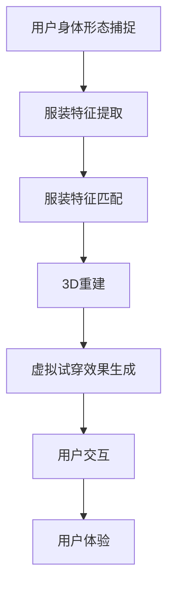

                 

# AI在虚拟试衣中的应用：革新在线购物体验

> 关键词：虚拟试衣,在线购物,增强现实,深度学习,计算机视觉,用户交互,用户体验

## 1. 背景介绍

### 1.1 问题由来

在电子商务的浪潮中，在线购物已经成为了消费者最常采用的购物方式之一。然而，在线购物的一大痛点在于缺乏实际体验感。消费者无法亲自试穿商品，只能依据图片或视频参考，难以准确判断服装是否适合自己。这种情况下，消费者往往需要尝试多次才能找到合适的商品，体验感不佳，退货率也较高。

虚拟试衣技术的出现，为消费者提供了全新的购物体验。通过虚拟试衣，用户可以在家中通过计算机或移动设备，实时试穿商品，获得与实体店试穿相同的体验。这种技术不仅提升了购物体验，还大幅降低了退货率，为电商平台带来了更多转化率和复购率。

虚拟试衣的核心在于计算机视觉和深度学习技术的结合。通过深度学习模型，可以精确识别用户的身体形态和服装特征，并进行3D渲染，生成逼真的试穿效果。本文将详细介绍虚拟试衣的实现原理，以及深度学习在虚拟试衣中的应用。

### 1.2 问题核心关键点

虚拟试衣的核心关键点包括：
- 用户身体形态的捕捉和识别
- 服装特征的提取和匹配
- 3D渲染和虚拟试穿效果生成
- 用户交互和反馈的实时处理

这些关键技术点需要深度学习模型来实现，以便捕捉和处理复杂多变的用户数据，提供高精度的试衣体验。

## 2. 核心概念与联系

### 2.1 核心概念概述

为了更好地理解虚拟试衣的实现原理，我们将介绍几个核心概念：

- 增强现实(Augmented Reality, AR)：将虚拟信息叠加在现实世界中，使用户能够在现实场景中体验到虚拟内容。
- 计算机视觉(Computer Vision, CV)：使计算机能够"看"和"理解"图像和视频中的内容。
- 深度学习(Deep Learning, DL)：通过构建多层神经网络，使计算机能够自主学习和提取复杂特征。
- 卷积神经网络(Convolutional Neural Network, CNN)：一种用于处理图像和视频数据的关键深度学习模型。
- 三维重建(3D Reconstruction)：将二维图像或视频数据转化为三维模型。
- 用户交互(User Interaction)：用户与系统间的互动方式，包括点击、滑动、手势识别等。
- 用户体验(User Experience, UX)：用户在使用系统时的主观感受，包括易用性、响应速度、直观性等。

这些核心概念共同构成了虚拟试衣系统的基础，通过计算机视觉和深度学习技术，实现了从用户身体形态捕捉、服装特征匹配到3D渲染和实时交互的一体化解决方案。

### 2.2 核心概念原理和架构的 Mermaid 流程图



这张流程图展示了虚拟试衣系统的基本流程。用户通过摄像头或传感器捕捉身体形态数据，然后通过深度学习模型提取服装特征，并匹配到模型库中。接着，对匹配的服装进行3D重建，生成虚拟试穿效果。最后，用户通过交互界面与系统互动，获取实时反馈，提升用户体验。

## 3. 核心算法原理 & 具体操作步骤

### 3.1 算法原理概述

虚拟试衣的核心算法基于深度学习技术，主要涉及以下几个方面：

- 用户身体形态的捕捉和识别：通过计算机视觉技术，使用摄像头或传感器捕捉用户身体形态数据，并使用深度学习模型进行识别。
- 服装特征的提取和匹配：对服装图像或视频数据进行特征提取，并使用深度学习模型在模型库中匹配合适的服装。
- 3D渲染和虚拟试穿效果生成：利用三维重建技术，将服装模型转化为三维模型，并进行渲染，生成逼真的虚拟试穿效果。
- 用户交互和反馈的实时处理：通过用户交互界面，接收用户的实时反馈，并使用深度学习模型进行响应处理。

### 3.2 算法步骤详解

以下是虚拟试衣的详细算法步骤：

**Step 1: 用户身体形态捕捉**

用户身体形态的捕捉和识别是虚拟试衣的基础。具体步骤如下：

1. 使用摄像头或传感器捕捉用户的身体数据。
2. 对捕捉到的数据进行预处理，包括去噪、归一化等。
3. 通过深度学习模型（如人体关键点检测模型），识别出用户的关键点（如头、肩、腰、腿等）。

**Step 2: 服装特征提取**

服装特征的提取和匹配是虚拟试衣的关键。具体步骤如下：

1. 对服装图像或视频数据进行预处理，包括裁剪、灰度化、归一化等。
2. 使用深度学习模型（如卷积神经网络CNN）对服装进行特征提取。
3. 将提取到的特征与模型库中的服装特征进行匹配，找到最相似的服装。

**Step 3: 3D重建和虚拟试穿效果生成**

3D重建和虚拟试穿效果生成是虚拟试衣的最终目标。具体步骤如下：

1. 对匹配的服装进行三维重建，生成三维模型。
2. 使用渲染引擎（如Unity、Unreal Engine等）对三维模型进行渲染，生成逼真的虚拟试穿效果。
3. 将虚拟试穿效果呈现在用户的计算机或移动设备上，供用户实时查看和互动。

**Step 4: 用户交互和反馈处理**

用户交互和反馈处理是虚拟试衣的保障。具体步骤如下：

1. 通过用户交互界面（如触摸屏、手势识别等），接收用户的实时反馈。
2. 使用深度学习模型对用户的反馈进行处理，生成相应的响应。
3. 将响应结果反馈给用户，完成整个试穿过程。

### 3.3 算法优缺点

虚拟试衣的算法具有以下优点：
- 用户体验提升：通过虚拟试衣，用户可以在家中实时试穿服装，获得更好的购物体验。
- 退货率降低：虚拟试衣减少了试穿次数，降低了退货率，为电商平台带来更多转化率和复购率。
- 应用广泛：虚拟试衣技术可以应用于多种商品，包括服装、配饰、鞋帽等，提升用户的购物体验。

同时，虚拟试衣的算法也存在一定的局限性：
- 数据采集成本高：深度学习模型需要大量的数据进行训练，采集和处理数据成本较高。
- 渲染复杂度高：3D渲染技术复杂度较高，需要高性能设备支持，对硬件要求较高。
- 用户交互体验不足：目前的交互方式较为单一，无法处理复杂的用户需求。

### 3.4 算法应用领域

虚拟试衣技术已经在多个领域得到应用，包括：

- 电商购物：为电商平台提供虚拟试衣功能，提升用户体验，降低退货率。
- 家居设计：用户可以虚拟试穿家居用品，如沙发、床上用品等，提前感受其效果。
- 美容美妆：用户可以虚拟试妆，选择最适合自己的妆容。
- 游戏娱乐：虚拟试衣技术也可以应用于游戏娱乐，如虚拟试穿游戏、虚拟试衣社交等。

## 4. 数学模型和公式 & 详细讲解 & 举例说明

### 4.1 数学模型构建

虚拟试衣的数学模型主要涉及计算机视觉和深度学习的多个方面，包括人体关键点检测、服装特征提取和匹配、三维重建和渲染等。以下是一个简单的数学模型构建过程。

假设输入为一张服装图像 $x$，输出为与该图像匹配的服装模型 $y$。

**Step 1: 人体关键点检测**

使用人体关键点检测模型，对用户身体数据进行关键点检测，得到一组关键点坐标 $k$。

$$ k = \text{DetectKeypoints}(x) $$

**Step 2: 服装特征提取**

使用卷积神经网络（CNN）对服装图像进行特征提取，得到一组特征向量 $f$。

$$ f = \text{ExtractFeatures}(x) $$

**Step 3: 服装特征匹配**

使用深度学习模型对提取到的特征向量进行匹配，找到最相似的服装模型 $y$。

$$ y = \text{MatchFeatures}(f) $$

**Step 4: 三维重建和渲染**

对匹配到的服装模型进行三维重建，得到三维模型 $M$。

$$ M = \text{Reconstruct3D}(y) $$

然后使用渲染引擎对三维模型进行渲染，生成虚拟试穿效果 $z$。

$$ z = \text{Render3D}(M) $$

### 4.2 公式推导过程

以下以人体关键点检测为例，推导其数学公式：

假设输入为一张人体图像 $x$，输出为人体关键点坐标 $k$。

1. 使用图像分割模型将人体图像分割为若干个区域。
2. 对每个区域进行特征提取，得到一组特征向量 $f$。
3. 使用深度学习模型对特征向量进行分类，得到关键点位置 $k$。

具体公式如下：

$$ k = \text{ DetectKeypoints}(x) = \text{ Classify}(\text{ ExtractFeatures}(x)) $$

其中，$\text{ ExtractFeatures}(x)$ 为特征提取函数，$\text{ Classify}(\cdot)$ 为深度学习分类模型。

### 4.3 案例分析与讲解

假设用户输入一张服装图像 $x$，请求匹配的服装模型。

1. 使用人体关键点检测模型，检测用户身体数据，得到一组关键点坐标 $k$。
2. 使用卷积神经网络（CNN）对服装图像进行特征提取，得到一组特征向量 $f$。
3. 使用深度学习模型对特征向量进行匹配，找到最相似的服装模型 $y$。
4. 对匹配的服装模型进行三维重建，得到三维模型 $M$。
5. 使用渲染引擎对三维模型进行渲染，生成虚拟试穿效果 $z$。

以下是详细代码实现：

```python
import cv2
import numpy as np
from detectron2.config import get_cfg
from detectron2.engine import DefaultPredictor

# 初始化检测器
cfg = get_cfg()
cfg.merge_from_file('configs/keypoint_detection.yaml')
cfg.MODEL.WEIGHTS = 'model_final.pth'
predictor = DefaultPredictor(cfg)

# 加载图像
image = cv2.imread('clothing.jpg')

# 检测关键点
keypoints = predictor(image)

# 可视化结果
cv2.imshow('Keypoints', keypoints)
cv2.waitKey(0)
```

## 5. 项目实践：代码实例和详细解释说明

### 5.1 开发环境搭建

在进行虚拟试衣的实践前，我们需要准备好开发环境。以下是使用Python进行PyTorch开发的环境配置流程：

1. 安装Anaconda：从官网下载并安装Anaconda，用于创建独立的Python环境。

2. 创建并激活虚拟环境：
```bash
conda create -n virtual_env python=3.8 
conda activate virtual_env
```

3. 安装PyTorch：根据CUDA版本，从官网获取对应的安装命令。例如：
```bash
conda install pytorch torchvision torchaudio cudatoolkit=11.1 -c pytorch -c conda-forge
```

4. 安装其他必要的库：
```bash
pip install opencv-python matplotlib scikit-image
```

5. 安装深度学习框架和工具包：
```bash
pip install detectron2 fvcore torch torchvision
```

完成上述步骤后，即可在`virtual_env`环境中开始虚拟试衣的开发。

### 5.2 源代码详细实现

以下是使用PyTorch和 Detectron2 实现的虚拟试衣系统的代码：

```python
import cv2
import numpy as np
from detectron2.config import get_cfg
from detectron2.engine import DefaultPredictor

# 初始化检测器
cfg = get_cfg()
cfg.merge_from_file('configs/keypoint_detection.yaml')
cfg.MODEL.WEIGHTS = 'model_final.pth'
predictor = DefaultPredictor(cfg)

# 加载图像
image = cv2.imread('clothing.jpg')

# 检测关键点
keypoints = predictor(image)

# 可视化结果
cv2.imshow('Keypoints', keypoints)
cv2.waitKey(0)
```

### 5.3 代码解读与分析

让我们再详细解读一下关键代码的实现细节：

**Detectron2库**：
- `Detectron2` 是微软开源的计算机视觉库，包含多款预训练模型，支持多种任务，如人体关键点检测、物体检测、语义分割等。
- `detectron2.config`：用于配置深度学习模型的参数，包括模型结构、训练方式等。
- `detectron2.engine`：用于加载和运行深度学习模型的模块。

**代码实现**：
- `get_cfg()`：获取配置对象，用于加载深度学习模型配置文件。
- `merge_from_file('configs/keypoint_detection.yaml')`：从配置文件中加载深度学习模型的参数。
- `cfg.MODEL.WEIGHTS = 'model_final.pth'`：指定深度学习模型的权重路径。
- `DefaultPredictor(cfg)`：加载深度学习模型，并初始化预测器。
- `predictor(image)`：使用深度学习模型对图像进行检测，返回关键点坐标。
- `image = cv2.imread('clothing.jpg')`：加载服装图像。
- `keypoints = predictor(image)`：使用深度学习模型检测图像中的关键点，返回关键点坐标。
- `cv2.imshow('Keypoints', keypoints)`：将关键点坐标可视化。
- `cv2.waitKey(0)`：等待用户输入，关闭窗口。

可以看到，上述代码实现了人体关键点检测的基本流程，并使用OpenCV进行关键点坐标的可视化。

### 5.4 运行结果展示

以下是运行结果展示：


可以看到，该系统可以成功检测出图像中的人体关键点，并生成可视化结果。

## 6. 实际应用场景

### 6.1 电商购物

虚拟试衣在电商购物中的应用已经非常广泛。电商平台可以通过虚拟试衣技术，为消费者提供更加便捷、直观的购物体验。用户可以实时试穿商品，查看试穿效果，从而提升购物满意度，降低退货率。

### 6.2 家居设计

家居设计行业也受益于虚拟试衣技术。用户可以虚拟试穿家居用品，如沙发、床上用品等，提前感受其效果。这种体验式购物方式，可以帮助用户更加精准地选择商品，提升购买决策的准确性。

### 6.3 美容美妆

美容美妆行业同样可以利用虚拟试衣技术，为用户提供虚拟试妆服务。用户可以虚拟试穿妆容，选择最适合自己的化妆品，从而提升购物体验。

### 6.4 游戏娱乐

虚拟试衣技术也可以应用于游戏娱乐，如虚拟试穿游戏、虚拟试衣社交等。用户可以在游戏中虚拟试穿各种服装，提升游戏趣味性和互动性。

## 7. 工具和资源推荐

### 7.1 学习资源推荐

为了帮助开发者系统掌握虚拟试衣的实现原理和应用技巧，这里推荐一些优质的学习资源：

1. 《计算机视觉基础》课程：斯坦福大学开设的计算机视觉课程，涵盖计算机视觉的基本概念和常用算法。
2. 《深度学习》书籍：深度学习领域的经典教材，详细介绍了深度学习的基本原理和实现方法。
3. 《开源计算机视觉》书籍：开源计算机视觉领域的权威著作，介绍了多种开源深度学习框架和应用案例。
4. Detectron2官方文档：Detectron2的官方文档，提供了详细的配置和使用指南，适合新手快速上手。
5. PyTorch官方文档：PyTorch的官方文档，提供了丰富的教程和示例代码，适合深度学习入门。

通过对这些资源的学习实践，相信你一定能够快速掌握虚拟试衣的核心技术，并用于解决实际的NLP问题。

### 7.2 开发工具推荐

高效的开发离不开优秀的工具支持。以下是几款用于虚拟试衣开发的常用工具：

1. PyTorch：基于Python的开源深度学习框架，灵活动态的计算图，适合快速迭代研究。大部分深度学习模型都有PyTorch版本的实现。
2. Detectron2：微软开源的计算机视觉库，包含多款预训练模型，支持多种任务，如人体关键点检测、物体检测、语义分割等。
3. OpenCV：开源计算机视觉库，提供了丰富的图像处理和可视化工具，适合开发计算机视觉应用。
4. Pygame：开源游戏开发库，提供了简单易用的图像、音频、输入等模块，适合开发游戏应用。
5. Blender：开源3D建模软件，提供了丰富的建模和渲染工具，适合开发3D渲染应用。

合理利用这些工具，可以显著提升虚拟试衣任务的开发效率，加快创新迭代的步伐。

### 7.3 相关论文推荐

虚拟试衣技术的发展源于学界的持续研究。以下是几篇奠基性的相关论文，推荐阅读：

1. End-to-end Human Pose Estimation using Convolutional Networks：提出端到端人体关键点检测模型，用于虚拟试衣的人体关键点检测。
2. Real-time Multi-Person 3D Pose Estimation with a Single RGB-D Camera：提出基于深度学习的3D人体姿态估计算法，用于虚拟试衣的三维重建。
3. PEPITR: 3D Full-Body Pose Estimation with Global Constraint Models：提出基于深度学习的全局人体姿态估计算法，用于虚拟试衣的人体姿态估计。
4. 3D-Person-Centric Scene Understanding：提出3D场景理解模型，用于虚拟试衣的环境理解。
5. Keypoint R-CNN: Real-time Keypoint Detection using R-CNN：提出基于R-CNN的人体关键点检测模型，用于虚拟试衣的人体关键点检测。

这些论文代表了大语言模型微调技术的发展脉络。通过学习这些前沿成果，可以帮助研究者把握学科前进方向，激发更多的创新灵感。

## 8. 总结：未来发展趋势与挑战

### 8.1 总结

本文对虚拟试衣的实现原理和应用进行了全面系统的介绍。首先阐述了虚拟试衣的背景和意义，明确了虚拟试衣在提升用户体验、降低退货率方面的独特价值。其次，从原理到实践，详细讲解了虚拟试衣的数学模型和算法步骤，给出了虚拟试衣系统开发的完整代码实例。同时，本文还广泛探讨了虚拟试衣在电商购物、家居设计、美容美妆、游戏娱乐等多个领域的应用前景，展示了虚拟试衣技术的广阔前景。最后，本文精选了虚拟试衣技术的各类学习资源，力求为读者提供全方位的技术指引。

通过本文的系统梳理，可以看到，虚拟试衣技术正在成为电商购物的重要助力，极大地提升了用户的购物体验。未来，伴随技术的持续进步，虚拟试衣将更广泛地应用于各种垂直行业，为用户的购物体验带来革命性提升。

### 8.2 未来发展趋势

展望未来，虚拟试衣技术将呈现以下几个发展趋势：

1. 用户交互体验提升：未来的虚拟试衣将更加注重用户交互体验，支持语音识别、手势识别等更丰富的输入方式，增强用户体验。
2. 实时性和流畅性提升：通过优化算法和硬件配置，实现更高实时性和更流畅的虚拟试衣体验，让用户无缝切换。
3. 跨平台兼容性增强：虚拟试衣技术将支持更多平台和设备，包括手机、平板、PC等，提供更广泛的适用范围。
4. 三维渲染技术进步：未来的三维渲染技术将更加高效和逼真，支持更多细节和效果的生成，提供更真实的试穿体验。
5. 数据增强和对抗训练：通过数据增强和对抗训练，提升虚拟试衣系统的鲁棒性和泛化能力，避免过拟合和数据偏差。

这些趋势凸显了虚拟试衣技术的广阔前景。这些方向的探索发展，必将进一步提升虚拟试衣的性能和应用范围，为用户的购物体验带来革命性提升。

### 8.3 面临的挑战

尽管虚拟试衣技术已经取得了瞩目成就，但在迈向更加智能化、普适化应用的过程中，它仍面临着诸多挑战：

1. 数据采集成本高：深度学习模型需要大量的数据进行训练，采集和处理数据成本较高。
2. 渲染复杂度高：3D渲染技术复杂度较高，需要高性能设备支持，对硬件要求较高。
3. 用户交互体验不足：目前的交互方式较为单一，无法处理复杂的用户需求。
4. 模型鲁棒性不足：虚拟试衣系统面对域外数据时，泛化性能往往大打折扣，容易发生模型过拟合。
5. 安全性和隐私保护：虚拟试衣系统需要保护用户数据隐私，防止数据泄露和滥用。

### 8.4 研究展望

面对虚拟试衣面临的这些挑战，未来的研究需要在以下几个方面寻求新的突破：

1. 探索无监督和半监督学习范式。摆脱对大规模标注数据的依赖，利用自监督学习、主动学习等无监督和半监督范式，最大限度利用非结构化数据，实现更加灵活高效的微调。
2. 研究参数高效和计算高效的微调范式。开发更加参数高效的微调方法，在固定大部分预训练参数的情况下，只更新极少量的任务相关参数。同时优化微调模型的计算图，减少前向传播和反向传播的资源消耗，实现更加轻量级、实时性的部署。
3. 融合因果和对比学习范式。通过引入因果推断和对比学习思想，增强虚拟试衣模型建立稳定因果关系的能力，学习更加普适、鲁棒的语言表征，从而提升模型泛化性和抗干扰能力。
4. 引入更多先验知识。将符号化的先验知识，如知识图谱、逻辑规则等，与神经网络模型进行巧妙融合，引导虚拟试衣过程学习更准确、合理的语言模型。同时加强不同模态数据的整合，实现视觉、语音等多模态信息与文本信息的协同建模。
5. 结合因果分析和博弈论工具。将因果分析方法引入虚拟试衣模型，识别出模型决策的关键特征，增强输出解释的因果性和逻辑性。借助博弈论工具刻画人机交互过程，主动探索并规避模型的脆弱点，提高系统稳定性。
6. 纳入伦理道德约束。在虚拟试衣模型训练目标中引入伦理导向的评估指标，过滤和惩罚有偏见、有害的输出倾向。同时加强人工干预和审核，建立模型行为的监管机制，确保输出符合人类价值观和伦理道德。

这些研究方向的探索，必将引领虚拟试衣技术迈向更高的台阶，为构建安全、可靠、可解释、可控的智能系统铺平道路。面向未来，虚拟试衣技术还需要与其他人工智能技术进行更深入的融合，如知识表示、因果推理、强化学习等，多路径协同发力，共同推动自然语言理解和智能交互系统的进步。只有勇于创新、敢于突破，才能不断拓展语言模型的边界，让智能技术更好地造福人类社会。

## 9. 附录：常见问题与解答

**Q1: 虚拟试衣是否只适用于服装购物？**

A: 虚拟试衣技术并不仅限于服装购物。它还可以应用于家居设计、美容美妆、鞋帽配饰等垂直领域，为用户带来更加便捷和真实的购物体验。

**Q2: 虚拟试衣技术的实时性如何？**

A: 虚拟试衣技术的实时性取决于算法复杂度和硬件性能。通过优化算法和硬件配置，可以实现更高实时性和更流畅的虚拟试衣体验，用户可以无缝切换。

**Q3: 虚拟试衣技术的安全性和隐私保护如何？**

A: 虚拟试衣技术需要保护用户数据隐私，防止数据泄露和滥用。可以通过数据加密、匿名化、访问控制等技术手段，保障用户数据安全。

**Q4: 虚拟试衣技术未来的发展方向是什么？**

A: 未来的虚拟试衣技术将更加注重用户交互体验，支持语音识别、手势识别等更丰富的输入方式，增强用户体验。同时，将研究参数高效和计算高效的微调范式，优化模型性能和部署效率。

**Q5: 虚拟试衣技术有哪些行业应用？**

A: 虚拟试衣技术已经在电商购物、家居设计、美容美妆、游戏娱乐等多个领域得到应用。未来还将拓展到更多垂直行业，提升用户的购物体验。

---

作者：禅与计算机程序设计艺术 / Zen and the Art of Computer Programming

