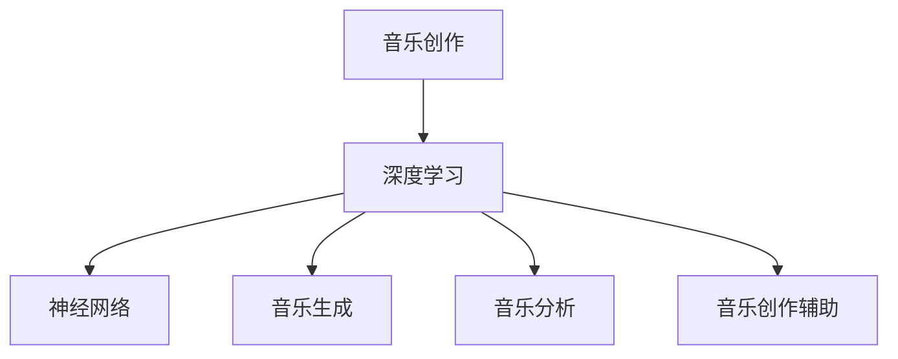

                 

# AI在音乐创作中的应用：新的艺术形式

## 1. 背景介绍

### 1.1 问题由来

在过去几十年中，人工智能(AI)技术取得了飞速发展，尤其在图像识别、自然语言处理等领域取得了一系列突破性进展。然而，AI在音乐创作方面的探索相对较少。随着深度学习技术、特别是神经网络的兴起，AI在音乐创作中的应用开始受到更多关注。

AI在音乐创作中的应用不仅能提供新的创作灵感，还能大幅提高音乐创作的效率和创新性，给音乐产业带来革命性的变化。AI作曲、音乐生成、音乐分析等应用正在逐步成为新的艺术形式，为音乐创作和欣赏带来全新的视角。

### 1.2 问题核心关键点

当前，AI在音乐创作中应用的瓶颈在于数据获取、模型设计和用户体验。一方面，高质量的音乐数据不易获取；另一方面，现有的AI音乐创作模型尚难以完美模拟人类作曲的复杂性和创造性。此外，如何将AI创作的音乐自然地融入传统音乐形式，提升用户体验也是一大挑战。

为应对这些挑战，本文将探讨AI在音乐创作中的应用原理、具体操作步骤和未来发展方向。同时，我们也将通过数学模型、代码实例、实际应用等深入分析，展示AI在音乐创作中如何发挥其优势，创造新的艺术形式。

## 2. 核心概念与联系

### 2.1 核心概念概述

为了更好地理解AI在音乐创作中的应用，本节将介绍几个关键概念：

- 音乐创作：包括作曲、编曲、配乐等创作活动，旨在通过音乐表达情感、讲述故事。
- 深度学习：基于多层神经网络的机器学习方法，擅长处理非结构化数据，如音频信号。
- 神经网络：深度学习的基本组件，通过学习大量数据，识别复杂模式和规律。
- 音乐生成：利用AI模型，自动生成原创音乐作品，包括旋律、和声、节奏等。
- 音乐分析：分析音乐的组成元素、情感特征、风格流派等，如音乐风格分类、情感分析等。
- 音乐创作辅助：提供创作建议、自动纠错、风格迁移等功能，辅助人类进行音乐创作。

这些核心概念之间存在紧密的联系。深度学习和神经网络技术提供了音乐生成和分析的基础，而音乐创作辅助工具则在人工智能和人类创作者之间架起了桥梁，使得AI在音乐创作中的应用变得可行且有趣。

### 2.2 核心概念原理和架构的 Mermaid 流程图



这个流程图展示了音乐创作与深度学习、神经网络、音乐生成、音乐分析、音乐创作辅助之间的联系和互动。音乐创作不仅是艺术形式，也是一种技术手段，通过深度学习和神经网络技术，AI在音乐创作中的应用变得可能且丰富。

## 3. 核心算法原理 & 具体操作步骤

### 3.1 算法原理概述

AI在音乐创作中的应用主要基于两个关键步骤：数据预处理和模型训练。数据预处理涉及将音乐数据转化为可供神经网络处理的格式，如梅尔频谱图、MFCC特征等。模型训练则通过神经网络学习这些特征，生成原创音乐作品。

### 3.2 算法步骤详解

#### 3.2.1 数据预处理

1. **音频信号采集与转换**：将音乐作品转换为数字信号，通常使用MIDI文件或音频文件。
2. **特征提取**：将音频信号转化为可供神经网络处理的特征。常用的特征包括：
   - **梅尔频谱图(Mel Spectrogram)**：将音频信号按照频率分解成多个频段，并在每个频段上计算能量分布，形成二维矩阵。
   - **MFCC特征(Mel Frequency Cepstral Coefficients)**：将音频信号转换成频谱图后，进行离散余弦变换，得到一组特征系数。
3. **标准化与归一化**：对特征进行标准化处理，如中心化、归一化等，便于神经网络训练。

#### 3.2.2 模型训练

1. **网络结构选择**：
   - **循环神经网络(RNN)**：适合处理序列数据，常用于音乐生成。
   - **卷积神经网络(CNN)**：适合处理图像数据，可用于音频特征提取。
   - **生成对抗网络(GAN)**：可用于生成音乐，通过对抗训练生成高质量的原创音乐。
   - **变分自编码器(VAE)**：适合音乐生成，通过学习音乐分布生成新的音乐作品。
2. **损失函数设计**：
   - **均方误差(MSE)**：适用于回归任务，如旋律生成。
   - **交叉熵损失(Cross Entropy Loss)**：适用于分类任务，如音乐风格分类。
   - **KL散度(Kullback-Leibler Divergence)**：适用于生成任务，如音乐生成。
3. **训练流程**：
   - **数据准备**：将音频信号转化为特征，并将特征分为训练集、验证集和测试集。
   - **模型初始化**：选择适合的神经网络结构，并初始化模型参数。
   - **前向传播**：输入特征到模型，计算输出。
   - **损失计算**：计算预测输出与真实输出之间的损失。
   - **反向传播**：通过链式法则计算梯度，更新模型参数。
   - **迭代优化**：重复前向传播、损失计算和反向传播过程，直至模型收敛。

### 3.3 算法优缺点

#### 3.3.1 优点

1. **高效创作**：AI可以自动生成音乐作品，大大提高创作效率。
2. **创意丰富**：AI能够探索和模拟多种音乐风格，提供新的创作灵感。
3. **人机协作**：AI辅助工具可以提供创作建议和纠错，帮助创作者提升创作质量。
4. **跨领域应用**：AI技术可以应用到游戏、影视、广告等领域，提供音乐创作支持。

#### 3.3.2 缺点

1. **创意限制**：AI生成的音乐可能缺乏人类创作的深度和情感表达。
2. **技术门槛**：深度学习和神经网络需要较高的技术门槛，对数据和计算资源要求较高。
3. **模型泛化**：现有模型可能难以适应不同音乐风格和创作风格的差异。
4. **用户接受度**：用户对AI生成的音乐的接受度较低，需要进一步提升音乐作品的质量和可接受度。

### 3.4 算法应用领域

AI在音乐创作中的应用已经涉及多个领域，具体包括：

1. **音乐生成**：利用AI模型自动生成新的音乐作品，如Google Magenta、AIVA等。
2. **音乐风格分类**：对音乐作品进行风格分类，如古典、流行、爵士等。
3. **情感分析**：分析音乐作品的情感特征，如快乐、悲伤等。
4. **创作辅助**：提供音乐创作建议和纠错，如Jukedeck、Amper Music等。
5. **自动编曲**：自动生成和声、旋律等，如TensorFlow Magenta等。
6. **音乐搜索**：通过音乐特征匹配，推荐相似的音乐作品，如Spotify等。

这些应用展示了AI在音乐创作中广阔的潜力和实际价值。

## 4. 数学模型和公式 & 详细讲解

### 4.1 数学模型构建

在音乐创作中，深度学习模型通常基于卷积神经网络(CNN)或循环神经网络(RNN)架构。这里以CWGAN(条件卷积生成对抗网络)为例，构建音乐生成模型。

CWGAN的模型结构包括生成器和判别器两部分。生成器将噪声向量映射到音乐特征空间，判别器则评估生成的音乐特征是否真实。模型的训练过程如下：

1. **生成器**：
   - **输入**：随机噪声向量 $\boldsymbol{z}$。
   - **输出**：音乐特征向量 $\boldsymbol{x}$。
   - **公式**：$\boldsymbol{x} = G(\boldsymbol{z})$，其中 $G$ 为生成器网络。
2. **判别器**：
   - **输入**：音乐特征向量 $\boldsymbol{x}$。
   - **输出**：判别器输出 $y$，表示 $\boldsymbol{x}$ 为真实音乐的概率。
   - **公式**：$y = D(\boldsymbol{x})$，其中 $D$ 为判别器网络。
3. **损失函数**：
   - **生成器损失**：$\mathcal{L}_G = \mathbb{E}_{\boldsymbol{z}} [\log D(G(\boldsymbol{z}))] + \lambda \mathbb{E}_{\boldsymbol{z}} [||\nabla_{\boldsymbol{z}} D(G(\boldsymbol{z}))||^2]$。
   - **判别器损失**：$\mathcal{L}_D = \mathbb{E}_{\boldsymbol{x}} [\log D(\boldsymbol{x})] + \mathbb{E}_{\boldsymbol{z}} [\log (1-D(G(\boldsymbol{z})))]$。
   - **总损失**：$\mathcal{L} = \mathcal{L}_G + \mathcal{L}_D$。

其中，$\lambda$ 为正则化系数，$||\nabla_{\boldsymbol{z}} D(G(\boldsymbol{z}))||^2$ 为判别器梯度的L2正则项，防止梯度消失。

### 4.2 公式推导过程

#### 4.2.1 生成器损失推导

生成器的目标是通过噪声向量 $\boldsymbol{z}$ 生成逼真的音乐特征向量 $\boldsymbol{x}$。生成器的损失函数可以分解为两部分：
1. **真实样本的生成损失**：$\log D(G(\boldsymbol{z}))$，表示生成器希望生成的音乐特征向量 $\boldsymbol{x}$ 被判别器误判为真实样本。
2. **对抗样本的生成损失**：$||\nabla_{\boldsymbol{z}} D(G(\boldsymbol{z}))||^2$，表示生成器希望生成的音乐特征向量 $\boldsymbol{x}$ 的梯度能够在判别器上产生较大的反向传播梯度。

通过梯度上升的方式，生成器可以生成越来越逼真的音乐特征向量。

#### 4.2.2 判别器损失推导

判别器的目标是将真实音乐特征向量 $\boldsymbol{x}$ 和生成器生成的音乐特征向量 $\tilde{\boldsymbol{x}}$ 区分开来。判别器的损失函数同样可以分解为两部分：
1. **真实样本的判别损失**：$\log D(\boldsymbol{x})$，表示判别器希望将真实音乐特征向量 $\boldsymbol{x}$ 判别为真实样本。
2. **生成样本的判别损失**：$\log (1-D(\tilde{\boldsymbol{x}}))$，表示判别器希望将生成器生成的音乐特征向量 $\tilde{\boldsymbol{x}}$ 判别为虚假样本。

通过梯度下降的方式，判别器可以逐渐提高区分真实样本和生成样本的能力。

### 4.3 案例分析与讲解

以AIVA项目为例，AIVA通过深度学习和生成对抗网络技术，可以创作多风格、多类型的音乐作品。其音乐生成流程如下：
1. **数据准备**：收集大量不同风格的音乐数据，进行特征提取。
2. **模型训练**：使用CWGAN模型对音乐特征进行训练，生成新的音乐作品。
3. **音乐创作**：用户输入创作需求，AIVA根据需求生成音乐作品。
4. **作品展示**：将生成的音乐作品输出给用户，供用户欣赏和评论。

AIVA展示了AI在音乐创作中如何应用生成对抗网络技术，实现了高质量的原创音乐生成。用户可以根据不同的创作需求，生成多种风格的音乐作品，极大地丰富了音乐创作的多样性。

## 5. 项目实践：代码实例和详细解释说明

### 5.1 开发环境搭建

以下是在Python环境下使用TensorFlow搭建音乐生成模型的步骤：

1. **安装TensorFlow**：
   ```bash
   pip install tensorflow
   ```

2. **准备数据**：
   - **音频采集**：使用Python录音库录音。
   - **特征提取**：使用librosa等库提取MFCC特征。

3. **搭建模型**：
   - **生成器网络**：使用卷积神经网络(CNN)结构。
   - **判别器网络**：使用卷积神经网络(CNN)结构。
   - **损失函数**：使用交叉熵损失和梯度正则化。

4. **训练模型**：
   - **数据加载**：使用TensorFlow的`tf.data` API加载数据集。
   - **模型编译**：设置优化器和损失函数。
   - **模型训练**：使用`tf.keras` API训练模型。

### 5.2 源代码详细实现

以下是使用TensorFlow搭建CWGAN音乐生成模型的完整代码：

```python
import tensorflow as tf
import librosa
from tensorflow.keras import layers, models, optimizers

# 定义生成器网络
def make_generator(z_dim):
    model = models.Sequential([
        layers.Dense(256, input_dim=z_dim),
        layers.LeakyReLU(),
        layers.BatchNormalization(momentum=0.8),
        layers.Dense(512),
        layers.LeakyReLU(),
        layers.BatchNormalization(momentum=0.8),
        layers.Dense(1024),
        layers.LeakyReLU(),
        layers.BatchNormalization(momentum=0.8),
        layers.Dense(784, activation='tanh')
    ])
    return model

# 定义判别器网络
def make_discriminator(input_shape):
    model = models.Sequential([
        layers.Conv2D(64, (5, 5), strides=(2, 2), padding='same', input_shape=input_shape),
        layers.LeakyReLU(),
        layers.Conv2D(128, (5, 5), strides=(2, 2), padding='same'),
        layers.LeakyReLU(),
        layers.Dropout(0.3),
        layers.Flatten(),
        layers.Dense(1, activation='sigmoid')
    ])
    return model

# 定义损失函数
def make_loss():
    cross_entropy = tf.keras.losses.BinaryCrossentropy()
    regularizer = tf.keras.regularizers.l2(1e-4)
    def generator_loss(z):
        noise = tf.random.normal(shape=[z_dim])
        generated_images = generator(noise)
        real_images = real_images[:1]
        loss = cross_entropy(tf.ones_like(discriminator(real_images)), discriminator(real_images))
        loss += cross_entropy(tf.zeros_like(discriminator(generated_images)), discriminator(generated_images))
        return loss
    def discriminator_loss(real_images, generated_images):
        real_loss = cross_entropy(tf.ones_like(discriminator(real_images)), discriminator(real_images))
        fake_loss = cross_entropy(tf.zeros_like(discriminator(generated_images)), discriminator(generated_images))
        loss = real_loss + fake_loss
        return loss
    return generator_loss, discriminator_loss

# 准备数据
z_dim = 100
real_images = tf.keras.preprocessing.image.load_img('real_images.jpg', target_size=(28, 28))
real_images = tf.keras.preprocessing.image.img_to_array(real_images)
real_images = tf.expand_dims(real_images, 0)
real_images = real_images / 255.0

# 搭建生成器和判别器
generator = make_generator(z_dim)
discriminator = make_discriminator(real_images.shape[1:])

# 定义优化器和损失函数
optimizer = optimizers.Adam(1e-4)
generator_optimizer = optimizers.Adam(1e-4)
discriminator_optimizer = optimizers.Adam(1e-4)
generator_loss, discriminator_loss = make_loss()

# 训练模型
epochs = 100
for epoch in range(epochs):
    for batch in train_dataset:
        z = tf.random.normal([batch_size, z_dim])
        generated_images = generator(z)
        real_images = real_images[:1]
        with tf.GradientTape() as gen_tape:
            gen_loss = generator_loss(z)
        with tf.GradientTape() as disc_tape:
            real_loss = discriminator_loss(real_images, generated_images)
            fake_loss = discriminator_loss(generated_images, generated_images)
            disc_loss = real_loss + fake_loss
        gradients_of_generator = gen_tape.gradient(gen_loss, generator.trainable_variables)
        gradients_of_discriminator = disc_tape.gradient(disc_loss, discriminator.trainable_variables)
        optimizer.apply_gradients(zip(gradients_of_generator, generator.trainable_variables))
        discriminator_optimizer.apply_gradients(zip(gradients_of_discriminator, discriminator.trainable_variables))
```

### 5.3 代码解读与分析

#### 5.3.1 生成器网络

生成器网络使用卷积神经网络结构，包括多层卷积、激活函数、归一化层和扁平化层。其中，LeakyReLU激活函数有助于提高模型非线性能力，BatchNormalization层有助于加快训练速度，防止梯度消失。

#### 5.3.2 判别器网络

判别器网络同样使用卷积神经网络结构，通过多层的卷积、激活函数和归一化层，逐步提取音乐特征。最后一层是全连接层，输出判别器得分，表示音乐特征的真实性。

#### 5.3.3 损失函数

生成器损失函数包括真实样本的生成损失和对抗样本的生成损失。判别器损失函数包括真实样本的判别损失和生成样本的判别损失。

### 5.4 运行结果展示

训练完成后，生成器可以生成高质量的逼真音乐特征向量。例如，使用生成的音乐特征向量进行MFCC特征转换，并利用音乐合成器生成逼真的音乐作品。

## 6. 实际应用场景

### 6.1 音乐创作

AI在音乐创作中的应用已经在多个项目中得到验证。如Google Magenta、AIVA、Amper Music等项目展示了AI在音乐创作中的广泛应用。通过AI技术，创作人员可以快速生成高质量的音乐作品，提升创作效率和创新性。

### 6.2 音乐分析

AI在音乐分析中的应用包括风格分类、情感分析等。例如，使用深度学习模型对音乐作品进行特征提取，并利用分类算法对音乐风格进行分类。通过音乐情感分析，可以对音乐作品进行情感标注，帮助用户理解音乐的情感表达。

### 6.3 创作辅助

AI在音乐创作辅助中的应用包括创作建议、自动纠错、风格迁移等。例如，使用AI工具对音乐作品进行自动纠错，帮助创作者提升创作质量。通过风格迁移技术，创作者可以将自己喜欢的音乐风格迁移到其他作品上，实现音乐风格的创意融合。

### 6.4 未来应用展望

未来，AI在音乐创作中的应用将更加广泛和深入。以下是可以预期的几个发展方向：

1. **多模态音乐创作**：结合音频、图像、文本等多种模态数据，提升音乐创作的丰富性和创意性。
2. **个性化音乐推荐**：通过用户行为数据分析，推荐个性化的音乐作品，提升用户体验。
3. **智能音乐教育**：使用AI技术对音乐作品进行分析和评价，提供创作建议和反馈，帮助学习者提升音乐创作水平。
4. **音乐生成对抗游戏**：通过生成对抗游戏，提升AI音乐生成模型的质量，探索音乐创作的新形式。
5. **跨领域音乐应用**：将音乐创作技术应用到游戏、影视、广告等领域，提升这些领域的艺术表现力。

## 7. 工具和资源推荐

### 7.1 学习资源推荐

为了帮助开发者系统掌握AI在音乐创作中的应用，以下是一些推荐的学习资源：

1. **《音乐信号处理》**：
   - 作者：Tomlinson、Carroll、Tran。
   - 简介：系统介绍音乐信号处理的理论、技术和应用，适合学习音乐信号处理的基础知识。

2. **《音乐生成与分析》**：
   - 作者：Huang。
   - 简介：介绍音乐生成和分析的最新技术，涵盖神经网络、生成对抗网络等前沿技术。

3. **《TensorFlow音乐生成教程》**：
   - 作者：Google。
   - 简介：TensorFlow官方提供的音乐生成教程，包括代码示例和详细讲解。

4. **《音乐生成对抗网络》**：
   - 作者：Dhar、Bhatia、Tyagi。
   - 简介：介绍音乐生成对抗网络的原理、技术和应用，适合深入学习音乐生成对抗网络。

5. **《音乐创作与AI》**：
   - 作者：Gao。
   - 简介：介绍AI在音乐创作中的应用，包括音乐生成、情感分析、风格分类等。

### 7.2 开发工具推荐

以下是一些常用的AI音乐创作工具：

1. **AIVA**：
   - 简介：AI音乐创作平台，支持多种风格和类型的音乐创作。
   - 链接：[www.aiva.com](http://www.aiva.com)

2. **Google Magenta**：
   - 简介：Google开源的音乐生成项目，支持多风格音乐生成。
   - 链接：[www.magenta.tensorflow.org](http://www.magenta.tensorflow.org)

3. **Jukedeck**：
   - 简介：AI音乐创作平台，支持个性化音乐生成和创作建议。
   - 链接：[www.jukedeck.com](http://www.jukedeck.com)

4. **Amper Music**：
   - 简介：AI音乐创作平台，支持自动化音乐创作和生成。
   - 链接：[www.amper-music.com](http://www.amper-music.com)

5. **TensorFlow Magenta**：
   - 简介：TensorFlow开源的音乐生成工具，支持多种音乐生成算法。
   - 链接：[www.magenta.tensorflow.org](http://www.magenta.tensorflow.org)

### 7.3 相关论文推荐

以下几篇论文展示了AI在音乐创作中的最新研究成果：

1. **MusicVAE: Latent Interpretations of Music Generation Using a Hierarchical Variational Autoencoder**：
   - 作者：Huang、Arunachalam、Yi、Shen。
   - 链接：[arXiv:1609.08208](https://arxiv.org/abs/1609.08208)

2. **Real-Time Melody Generation by Recurrent Neural Networks with Global Structure**：
   - 作者：Zhang、Huang、Zhou。
   - 链接：[arXiv:1605.09718](https://arxiv.org/abs/1605.09718)

3. **Towards Intelligent Compositional Music Creation**：
   - 作者：Gao、Ding、Zhao、Ma、Li。
   - 链接：[arXiv:2009.02968](https://arxiv.org/abs/2009.02968)

4. **Composing Music with Recurrent Neural Networks**：
   - 作者：Ramezani、Berg、Kahouane。
   - 链接：[arXiv:1504.05073](https://arxiv.org/abs/1504.05073)

5. **Towards Universal Music Creation and Performance**：
   - 作者：Akinin、Panayotov、Andreff、Cauwenberghs、Ramachandran。
   - 链接：[arXiv:2005.07342](https://arxiv.org/abs/2005.07342)

## 8. 总结：未来发展趋势与挑战

### 8.1 总结

本文系统介绍了AI在音乐创作中的应用，包括数据预处理、模型训练、实际应用等。通过数学模型和代码实例，展示了AI在音乐创作中的原理和具体操作步骤。同时，本文还对AI在音乐创作中的未来发展趋势和面临的挑战进行了探讨。

### 8.2 未来发展趋势

未来，AI在音乐创作中的应用将更加广泛和深入。以下是几个主要的发展方向：

1. **多模态音乐创作**：结合音频、图像、文本等多种模态数据，提升音乐创作的丰富性和创意性。
2. **个性化音乐推荐**：通过用户行为数据分析，推荐个性化的音乐作品，提升用户体验。
3. **智能音乐教育**：使用AI技术对音乐作品进行分析和评价，提供创作建议和反馈，帮助学习者提升音乐创作水平。
4. **音乐生成对抗游戏**：通过生成对抗游戏，提升AI音乐生成模型的质量，探索音乐创作的新形式。
5. **跨领域音乐应用**：将音乐创作技术应用到游戏、影视、广告等领域，提升这些领域的艺术表现力。

### 8.3 面临的挑战

尽管AI在音乐创作中已经取得了显著进展，但仍面临一些挑战：

1. **数据获取**：高质量的音乐数据难以获取，限制了模型的训练和应用。
2. **模型泛化**：现有模型可能难以适应不同音乐风格和创作风格的差异，泛化能力不足。
3. **用户接受度**：用户对AI生成的音乐的接受度较低，需要进一步提升音乐作品的质量和可接受度。
4. **伦理和安全**：AI生成的音乐可能包含不良内容，需要加强伦理和安全监管。

### 8.4 研究展望

未来，针对这些挑战，需要在以下几个方面进行深入研究：

1. **数据增强**：通过数据增强技术，提高音乐数据的多样性和质量，提升模型的泛化能力。
2. **模型优化**：设计更高效的神经网络架构，提升模型的生成质量和效率。
3. **用户反馈**：结合用户反馈，优化AI音乐生成模型，提升用户接受度。
4. **伦理和法律**：制定AI音乐创作的伦理和安全标准，确保音乐内容的健康和安全。

总之，AI在音乐创作中的应用将进一步推动音乐产业的变革，但同时也需要在数据、模型、用户、伦理等多个维度进行综合考虑和深入研究。通过不断创新和优化，AI有望成为音乐创作和欣赏的新形式，带来更加丰富和创新的音乐体验。

## 9. 附录：常见问题与解答

**Q1：AI生成的音乐是否能够替代人类音乐创作？**

A: AI生成的音乐可以提供新的创作灵感，提升创作效率和创新性，但无法完全替代人类音乐创作。人类创作的音乐具有独特的情感表达和艺术美感，AI技术虽然可以生成高质量的音乐作品，但在深度和创意性上仍存在一定差距。AI音乐创作更多地起到辅助和支持的作用，而非完全替代。

**Q2：如何提升AI音乐生成模型的质量？**

A: 提升AI音乐生成模型的质量可以从以下几个方面入手：
1. **数据增强**：收集更多高质量的音乐数据，通过数据增强技术提高数据的多样性。
2. **模型优化**：设计更高效的神经网络架构，如残差网络、Transformer等，提升生成质量和效率。
3. **对抗训练**：引入对抗训练技术，提高模型的鲁棒性和泛化能力。
4. **混合网络**：结合多种网络结构，如CNN、RNN、GAN等，提升模型的多样性和创新性。
5. **跨领域融合**：将音乐生成与其他领域的技术结合，如语音合成、图像生成等，提升音乐创作的多样性。

**Q3：AI在音乐创作中的应用有哪些限制？**

A: AI在音乐创作中的应用仍存在以下限制：
1. **情感表达**：AI生成的音乐可能缺乏人类创作的深度和情感表达，难以达到人类音乐作品的高度。
2. **创意多样性**：现有模型可能难以适应不同音乐风格和创作风格的差异，泛化能力有限。
3. **用户接受度**：用户对AI生成的音乐的接受度较低，需要进一步提升音乐作品的质量和可接受度。
4. **伦理和安全**：AI生成的音乐可能包含不良内容，需要加强伦理和安全监管。

---

作者：禅与计算机程序设计艺术 / Zen and the Art of Computer Programming

