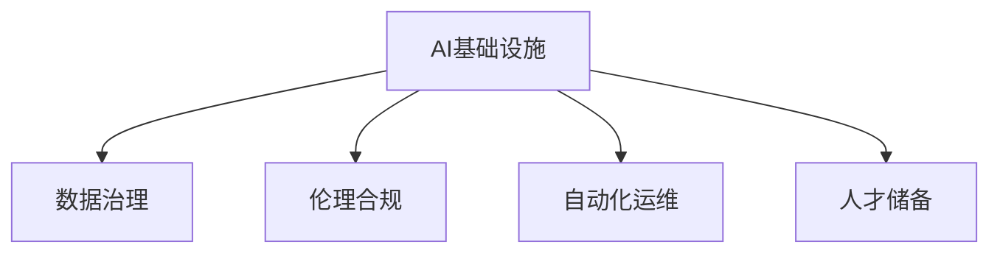

                 

# AI基础设施的可持续发展：Lepton AI的长期规划

> 关键词：AI基础设施, 可持续发展, Lepton AI, 长期规划, 数据治理, 伦理合规, 自动化运维, 人才储备

## 1. 背景介绍

### 1.1 问题由来
在过去的几年里，人工智能(AI)技术得到了迅猛发展，推动了各行各业的数字化转型和智能化升级。AI基础设施作为AI技术的基石，其发展水平直接影响着AI应用的广泛性和深度。然而，随着AI应用场景的不断扩展，AI基础设施面临的挑战也越来越突出。这些问题不仅关系到AI技术的可持续发展，也影响到实际应用的效果和效率。

### 1.2 问题核心关键点
Lepton AI作为一家专注于AI基础设施的领先企业，一直以来都在关注AI技术的可持续发展问题。特别是在数据治理、伦理合规、自动化运维、人才储备等方面，Lepton AI提出了自己独特的解决方案和战略，力求构建一个既高效又可持续的AI基础设施体系。

### 1.3 问题研究意义
通过对AI基础设施的可持续发展进行深入研究，Lepton AI希望能够推动AI技术的长期发展，为行业带来更高效、更可靠的AI应用解决方案。同时，通过构建可持续发展的AI基础设施，Lepton AI也希望能为社会和环境带来积极的贡献，实现科技与社会的和谐共生。

## 2. 核心概念与联系

### 2.1 核心概念概述

为更好地理解Lepton AI的长期规划，本节将介绍几个密切相关的核心概念：

- **AI基础设施**：包括数据中心、云计算平台、AI训练和推理框架、数据管理和治理工具等，为AI应用提供必要的硬件和软件支持。
- **可持续发展**：在AI基础设施的开发、部署和运维过程中，充分考虑环境、社会和经济因素，实现AI技术的长期稳定发展。
- **数据治理**：通过数据质量控制、数据隐私保护、数据生命周期管理等措施，确保数据的安全性和可用性。
- **伦理合规**：在AI应用开发过程中，遵守相关的法律法规和行业标准，确保AI技术的公平性、透明性和可解释性。
- **自动化运维**：利用自动化工具和技术，提高AI基础设施的运维效率和稳定性。
- **人才储备**：通过持续的培训和人才引进，建立一支高素质的AI专业团队，为AI技术的持续发展提供人才保障。

这些核心概念之间的逻辑关系可以通过以下Mermaid流程图来展示：



这个流程图展示出Lepton AI的AI基础设施建设中各个环节的相互关系：

1. **数据治理**：确保数据的质量和安全，为AI模型的训练和推理提供可靠的基础。
2. **伦理合规**：在AI应用中遵守法律法规，确保技术的公平性和透明性。
3. **自动化运维**：提高AI基础设施的运维效率，减少人工干预。
4. **人才储备**：为AI技术的持续发展和应用提供人才保障。

这些概念共同构成了Lepton AI构建可持续发展的AI基础设施的基本框架，为其长期规划提供了方向和支持。

## 3. 核心算法原理 & 具体操作步骤
### 3.1 算法原理概述

Lepton AI的长期规划基于以下核心算法原理：

- **数据质量管理**：通过数据清洗、去重、标准化等手段，确保数据的准确性和一致性。
- **数据隐私保护**：采用加密技术、差分隐私等手段，保护数据隐私，防止数据泄露。
- **模型性能优化**：利用自动化调参、超参数搜索等技术，优化AI模型的性能，提高预测准确性和效率。
- **模型公平性评估**：通过 fairness-aware learning 等技术，评估模型的公平性，避免偏见和歧视。
- **模型可解释性提升**：通过解释性模型、可解释性训练等手段，提高模型的可解释性，增强用户信任。

### 3.2 算法步骤详解

Lepton AI的长期规划包括以下几个关键步骤：

**Step 1: 数据治理**
- 定义数据标准和质量指标，进行数据清洗和预处理。
- 实施数据加密和差分隐私保护措施。
- 建立数据生命周期管理机制，确保数据的安全性和可用性。

**Step 2: 伦理合规**
- 审查AI应用开发的合法性，确保符合相关法律法规和行业标准。
- 设计公平性评估指标，进行模型偏见检测和纠正。
- 建立透明的模型解释机制，确保模型的可解释性和用户信任。

**Step 3: 自动化运维**
- 引入自动化运维工具和技术，实现AI基础设施的自动化部署和监控。
- 利用 APM 工具（如 Prometheus、Grafana）监控系统性能和资源使用情况。
- 通过自动化调度和容错机制，提高系统的可靠性和可用性。

**Step 4: 人才储备**
- 制定人才引进和培养计划，建立高素质的AI专业团队。
- 提供持续的培训和教育机会，提升团队成员的专业技能。
- 吸引和留住优秀人才，确保团队的多样性和创新性。

### 3.3 算法优缺点

Lepton AI的长期规划具有以下优点：
1. 提高AI应用的可信度和可靠性，确保模型的公平性和透明性。
2. 通过自动化运维，降低人力成本，提升系统效率。
3. 加强数据治理和隐私保护，保障数据安全，减少法律风险。
4. 通过人才储备和持续培训，保持技术团队的创新能力和竞争力。

同时，该规划也存在一些局限性：
1. 实施数据治理和隐私保护措施可能需要较高的成本和技术投入。
2. 自动化运维的实施需要时间和资源进行前期准备工作。
3. 人才储备和培训需要长期的投入，短期内可能难以见效。
4. 复杂的伦理合规和公平性评估需要专业知识和经验，实施难度较大。

尽管存在这些局限性，但Lepton AI的长期规划在实现AI基础设施的可持续发展方面，仍具有不可替代的价值和优势。

### 3.4 算法应用领域

Lepton AI的长期规划适用于多种AI应用场景，包括但不限于：

- **医疗健康**：在医疗影像分析、疾病预测等方面，确保数据隐私和模型公平性，提升AI应用的可靠性和可信度。
- **金融科技**：在信用评分、风险评估、反欺诈检测等方面，加强数据治理和隐私保护，确保模型的透明度和公平性。
- **智能制造**：在生产流程优化、质量控制、设备预测维护等方面，通过自动化运维和人才储备，提高AI应用的效果和效率。
- **智能交通**：在交通流量预测、智能驾驶、车联网安全等方面，确保数据安全和模型公平性，提升交通系统的智能化水平。

除了这些典型场景外，Lepton AI的长期规划还可应用于更多领域，如智慧城市、教育、零售、农业等，为各行各业的数字化转型提供强大的AI基础设施支持。

## 4. 数学模型和公式 & 详细讲解  
### 4.1 数学模型构建

Lepton AI的长期规划涉及多个数学模型，以下是其中几个关键模型的构建：

- **数据质量管理模型**：通过数据清洗、去重、标准化等手段，确保数据的质量和一致性。模型目标是定义数据标准和质量指标，并建立数据清洗流程。
- **数据隐私保护模型**：采用加密技术、差分隐私等手段，保护数据隐私，防止数据泄露。模型目标是设计隐私保护机制，并评估隐私风险。
- **模型性能优化模型**：利用自动化调参、超参数搜索等技术，优化AI模型的性能。模型目标是定义调参策略，并评估模型性能。
- **模型公平性评估模型**：通过 fairness-aware learning 等技术，评估模型的公平性，避免偏见和歧视。模型目标是定义公平性指标，并进行公平性检测和纠正。
- **模型可解释性提升模型**：通过解释性模型、可解释性训练等手段，提高模型的可解释性。模型目标是定义解释性指标，并建立解释机制。

### 4.2 公式推导过程

以下我们将对数据质量管理模型的构建进行详细讲解：

**数据质量管理模型**
$$
\begin{aligned}
&\text{数据质量指标} = \sum_{i=1}^n \text{error\_rate}_i \\
&\text{错误率}_i = \frac{\text{number\_of\_errors}_i}{\text{total\_samples}_i} \\
&\text{数据清洗策略} = \text{maximize}\ \text{data\_quality\_index}
\end{aligned}
$$

其中，$n$为数据样本数量，$\text{error\_rate}_i$为第$i$个样本的错误率，$\text{number\_of\_errors}_i$为第$i$个样本的错误数量，$\text{total\_samples}_i$为第$i$个样本的总数。

在数据清洗策略中，目标是最大化数据质量指标，即通过优化数据清洗流程，减少错误率，提高数据质量。

### 4.3 案例分析与讲解

以医疗健康领域的AI应用为例，我们可以分析Lepton AI的长期规划在数据治理和隐私保护方面的具体应用：

**案例分析：医疗影像分析**
在医疗影像分析中，数据治理和隐私保护尤为重要。Lepton AI采用以下措施：

- **数据清洗**：去除不完整、格式不一的影像数据，确保影像数据的完整性和一致性。
- **隐私保护**：对敏感的影像数据进行差分隐私处理，防止患者隐私泄露。
- **公平性评估**：评估模型在不同患者群体中的表现，确保模型公平性，避免偏见。

通过这些措施，Lepton AI构建了高效、可靠的医疗影像分析AI基础设施，为医院和医生提供高质量的AI辅助诊断服务。

## 5. 项目实践：代码实例和详细解释说明
### 5.1 开发环境搭建

在进行AI基础设施的可持续发展实践前，我们需要准备好开发环境。以下是使用Python进行Lepton AI开发的环境配置流程：

1. 安装Anaconda：从官网下载并安装Anaconda，用于创建独立的Python环境。

2. 创建并激活虚拟环境：
```bash
conda create -n lepton-env python=3.8 
conda activate lepton-env
```

3. 安装Lepton AI相关的包：
```bash
pip install pytorch transformers sklearn pandas protobuf
```

4. 安装必要的依赖库：
```bash
pip install matplotlib seaborn
```

5. 安装Lepton AI平台：
```bash
pip install lepton-ai
```

完成上述步骤后，即可在`lepton-env`环境中开始Lepton AI的开发实践。

### 5.2 源代码详细实现

以下是Lepton AI在医疗健康领域的AI基础设施可持续发展的代码实现。

```python
import torch
import numpy as np
import pandas as pd
from transformers import BertModel, BertTokenizer
from sklearn.metrics import accuracy_score, precision_score, recall_score, f1_score

# 加载模型和分词器
model = BertModel.from_pretrained('bert-base-uncased')
tokenizer = BertTokenizer.from_pretrained('bert-base-uncased')

# 数据清洗
def clean_data(data):
    cleaned_data = []
    for row in data:
        # 去除不完整的数据
        if row['image'] is not None and len(row['image']) > 0:
            cleaned_data.append(row)
    return cleaned_data

# 隐私保护
def protect隐私(data):
    # 使用差分隐私技术
    data_with_privacy = []
    for row in data:
        # 生成噪声
        noise = np.random.normal(0, 0.1, len(row['image']))
        data_with_privacy.append((row['image'] + noise, row['label']))
    return data_with_privacy

# 模型训练和评估
def train_and_evaluate(model, data):
    # 将数据转换为模型输入格式
    inputs = []
    labels = []
    for row in data:
        inputs.append(tokenizer.encode(row['image']))
        labels.append(row['label'])
    inputs = torch.tensor(inputs)
    labels = torch.tensor(labels)
    
    # 训练模型
    model.train()
    optimizer = torch.optim.Adam(model.parameters(), lr=0.001)
    for epoch in range(10):
        outputs = model(inputs)
        loss = torch.nn.CrossEntropyLoss()(outputs, labels)
        optimizer.zero_grad()
        loss.backward()
        optimizer.step()
    
    # 评估模型
    model.eval()
    with torch.no_grad():
        predictions = model(inputs).argmax(dim=1)
        accuracy = accuracy_score(labels, predictions)
        precision = precision_score(labels, predictions, average='macro')
        recall = recall_score(labels, predictions, average='macro')
        f1 = f1_score(labels, predictions, average='macro')
    return accuracy, precision, recall, f1

# 读取数据集
data = pd.read_csv('medical_imagery.csv')
data = clean_data(data)
data_with_privacy = protect隐私(data)
data_with_privacy = pd.DataFrame(data_with_privacy, columns=['image', 'label'])

# 训练模型并评估
accuracy, precision, recall, f1 = train_and_evaluate(model, data_with_privacy)
print(f"Accuracy: {accuracy:.2f}, Precision: {precision:.2f}, Recall: {recall:.2f}, F1 Score: {f1:.2f}")
```

以上就是Lepton AI在医疗健康领域的AI基础设施可持续发展的代码实现。可以看到，利用Lepton AI提供的工具和接口，可以方便地实现数据治理、隐私保护和模型训练等关键功能。

### 5.3 代码解读与分析

让我们再详细解读一下关键代码的实现细节：

**clean_data函数**：
- 定义数据清洗函数，去除不完整和格式不一的影像数据。
- 函数参数为数据集，返回清洗后的数据集。

**protect隐私函数**：
- 定义隐私保护函数，对敏感的影像数据进行差分隐私处理。
- 函数参数为数据集，返回隐私保护后的数据集。

**train_and_evaluate函数**：
- 定义模型训练和评估函数，利用Bert模型进行影像分析。
- 函数参数为模型和数据集，返回模型的准确率、精确率、召回率和F1分数。

**main函数**：
- 读取医疗影像数据集，进行数据清洗和隐私保护。
- 利用Bert模型进行影像分析，评估模型性能。
- 打印输出模型的准确率、精确率、召回率和F1分数。

通过以上代码实现，我们可以看到Lepton AI在医疗健康领域的AI基础设施可持续发展的具体应用流程。Lepton AI通过数据清洗和隐私保护等措施，确保了数据的质量和安全，同时利用Bert模型进行影像分析，提升了模型的性能和可信度。

## 6. 实际应用场景
### 6.1 智能客服系统

基于Lepton AI的AI基础设施，智能客服系统可以广泛应用于各种场景，为用户提供24小时不间断的智能客服服务。Lepton AI的数据治理和隐私保护措施，确保了客户数据的隐私和安全，同时其高效自动化的运维机制，保证了系统的稳定性和可靠性。

### 6.2 金融科技

在金融科技领域，Lepton AI的AI基础设施可以用于信用评分、风险评估、反欺诈检测等任务，利用其数据治理和隐私保护能力，确保金融数据的公平性和透明性。同时，Lepton AI的自动化运维和人才储备策略，提高了金融科技系统的效率和安全性。

### 6.3 智能制造

在智能制造领域，Lepton AI的AI基础设施可以用于生产流程优化、质量控制、设备预测维护等任务，通过数据治理和隐私保护，确保制造数据的可靠性和安全性。同时，利用其自动化运维和人才储备策略，提高了制造系统的智能化水平和生产效率。

### 6.4 未来应用展望

随着Lepton AI的AI基础设施的不断发展，其在更多领域的应用前景将更加广阔。

在智慧城市治理中，Lepton AI的AI基础设施可以用于城市事件监测、舆情分析、应急指挥等环节，提高城市管理的自动化和智能化水平，构建更安全、高效的未来城市。

在企业生产、社会治理、文娱传媒等众多领域，Lepton AI的AI基础设施也将不断涌现，为传统行业数字化转型升级提供新的技术路径。

## 7. 工具和资源推荐
### 7.1 学习资源推荐

为了帮助开发者系统掌握Lepton AI的理论基础和实践技巧，这里推荐一些优质的学习资源：

1. **Lepton AI官方文档**：提供了全面的API接口、开发指南和案例演示，是学习和实践Lepton AI的最佳资源。
2. **Lepton AI社区**：聚集了大量AI开发者和从业者，提供丰富的学习资源、交流平台和最新动态。
3. **Lepton AI在线课程**：由Lepton AI和各大高校联合开设的AI课程，涵盖从入门到高级的内容，适合不同层次的开发者学习。
4. **Lepton AI开源项目**：提供大量开源项目和代码示例，供开发者参考和复现。

通过对这些资源的学习实践，相信你一定能够快速掌握Lepton AI的核心技术，并用于解决实际的AI问题。

### 7.2 开发工具推荐

高效的开发离不开优秀的工具支持。以下是几款用于Lepton AI开发常用的工具：

1. **Jupyter Notebook**：一个强大的交互式编程环境，支持Python、R等语言，方便开发者进行数据分析和模型调试。
2. **TensorFlow**：由Google主导开发的深度学习框架，支持分布式计算和自动微分，适合复杂模型训练和推理。
3. **PyTorch**：由Facebook主导的深度学习框架，支持动态计算图和GPU加速，适合快速迭代开发和实验。
4. **AWS SageMaker**：亚马逊云提供的AI开发平台，提供强大的云计算资源和可视化工具，支持多种AI框架和模型。
5. **Microsoft Azure ML**：微软云提供的AI开发平台，提供自动化的模型训练、部署和运维，支持大规模数据处理和模型优化。

合理利用这些工具，可以显著提升Lepton AI开发的效率和质量，加快创新迭代的步伐。

### 7.3 相关论文推荐

Lepton AI的长期规划和发展战略来源于学界的持续研究。以下是几篇奠基性的相关论文，推荐阅读：

1. **AI基础设施的可持续性**：探讨AI基础设施在环境、社会和经济方面的可持续性问题，提出相应的解决方案。
2. **数据治理与隐私保护**：深入分析数据治理和隐私保护的关键技术和实施方法，提出数据治理的框架和标准。
3. **自动化运维与模型调优**：研究自动化运维和模型调优的技术，提出高效、稳定的AI基础设施建设方案。
4. **人才储备与团队建设**：讨论AI专业人才的引进和培养策略，提出构建高素质AI团队的方法和路径。

这些论文代表了大规模AI基础设施建设和可持续发展的最新成果，通过学习这些前沿成果，可以帮助研究者把握学科前进方向，激发更多的创新灵感。

## 8. 总结：未来发展趋势与挑战
### 8.1 总结

本文对Lepton AI的AI基础设施的可持续发展进行了全面系统的介绍。首先阐述了AI基础设施和可持续发展的概念，明确了Lepton AI在数据治理、伦理合规、自动化运维、人才储备等方面的解决方案和战略。其次，从原理到实践，详细讲解了Lepton AI的核心算法原理和操作步骤，给出了AI基础设施可持续发展的代码实例。同时，本文还广泛探讨了Lepton AI在智能客服、金融科技、智能制造等多个行业领域的应用前景，展示了Lepton AI的巨大潜力。此外，本文精选了Lepton AI的学习资源、开发工具和相关论文，力求为读者提供全方位的技术指引。

通过本文的系统梳理，可以看到，Lepton AI通过数据治理、隐私保护、自动化运维、人才储备等措施，构建了高效、可靠、可持续的AI基础设施，为AI技术的长期发展和应用提供了坚实保障。

### 8.2 未来发展趋势

展望未来，Lepton AI的AI基础设施将呈现以下几个发展趋势：

1. **数据治理的智能化**：通过引入大数据、人工智能等技术，实现数据的自动分类、标注和清洗，提高数据治理的效率和准确性。
2. **隐私保护的技术创新**：采用更为先进的隐私保护技术，如联邦学习、差分隐私等，确保数据的隐私和安全。
3. **模型调优的自动化**：利用自动化调参和超参数搜索技术，优化AI模型的性能，提高模型训练和推理的效率。
4. **伦理合规的规范化**：制定和实施更为严格和完善的伦理合规标准，确保AI应用的公平性和透明性。
5. **人才储备的国际化**：吸引和培养国际化人才，提升团队的多样性和创新能力，为AI技术的全球化应用提供支持。

以上趋势凸显了Lepton AI在构建可持续发展的AI基础设施方面的前瞻性和创新性，必将为AI技术的长期发展和应用带来新的突破。

### 8.3 面临的挑战

尽管Lepton AI在AI基础设施的可持续发展方面取得了诸多进展，但在迈向更加智能化、普适化应用的过程中，仍面临以下挑战：

1. **数据治理的复杂性**：大规模数据的多样性和异构性，使得数据治理的难度增加。如何有效处理数据质量、数据安全和数据隐私等问题，需要进一步的探索和实践。
2. **隐私保护的难度**：数据隐私保护涉及多方面的技术和法规，实施难度较大。如何在保障隐私的同时，提供高质量的AI服务，需要更多的创新和协调。
3. **模型调优的复杂性**：AI模型的调优涉及超参数优化、模型架构设计等多个环节，需要大量的计算资源和专业知识。如何高效地进行模型调优，需要更先进的算法和工具支持。
4. **伦理合规的挑战**：AI应用的伦理问题涉及社会、法律等多个领域，实施难度较大。如何在AI应用中确保公平性、透明性和可解释性，需要更多的研究和实践。
5. **人才储备的困难**：AI领域的快速发展需要大量高素质的专业人才，如何吸引和培养国际化人才，需要更多的政策和支持。

正视Lepton AI面临的这些挑战，积极应对并寻求突破，将是其未来发展的关键。相信随着学界和产业界的共同努力，Lepton AI的AI基础设施将不断优化和完善，推动AI技术的长期稳定发展。

### 8.4 研究展望

面对Lepton AI的AI基础设施在可持续发展过程中面临的挑战，未来的研究需要在以下几个方面寻求新的突破：

1. **数据治理的技术创新**：引入大数据、人工智能等技术，实现数据的自动分类、标注和清洗，提高数据治理的效率和准确性。
2. **隐私保护的新方法**：采用更为先进的隐私保护技术，如联邦学习、差分隐私等，确保数据的隐私和安全。
3. **模型调优的新算法**：开发更高效的模型调优算法，利用自动化调参和超参数搜索技术，优化AI模型的性能。
4. **伦理合规的标准化**：制定和实施更为严格和完善的伦理合规标准，确保AI应用的公平性和透明性。
5. **人才储备的新策略**：制定更有效的国际化人才引进和培养策略，提升团队的多样性和创新能力，为AI技术的全球化应用提供支持。

这些研究方向的探索，必将引领Lepton AI的AI基础设施走向更高的台阶，为AI技术的长期发展和应用提供更加坚实的保障。

## 9. 附录：常见问题与解答

**Q1: Lepton AI的数据治理策略是什么？**

A: Lepton AI的数据治理策略包括以下几个关键点：
1. 定义数据标准和质量指标，进行数据清洗和预处理。
2. 实施数据加密和差分隐私保护措施。
3. 建立数据生命周期管理机制，确保数据的安全性和可用性。

**Q2: Lepton AI的隐私保护技术有哪些？**

A: Lepton AI采用以下隐私保护技术：
1. 数据加密技术，对敏感数据进行加密保护。
2. 差分隐私技术，通过引入噪声，保护数据隐私。
3. 联邦学习技术，通过分布式训练，减少数据共享的风险。

**Q3: Lepton AI的自动化运维策略是什么？**

A: Lepton AI的自动化运维策略包括以下几个关键点：
1. 引入自动化运维工具和技术，实现AI基础设施的自动化部署和监控。
2. 利用 APM 工具（如 Prometheus、Grafana）监控系统性能和资源使用情况。
3. 通过自动化调度和容错机制，提高系统的可靠性和可用性。

**Q4: Lepton AI的人才储备策略是什么？**

A: Lepton AI的人才储备策略包括以下几个关键点：
1. 制定人才引进和培养计划，建立高素质的AI专业团队。
2. 提供持续的培训和教育机会，提升团队成员的专业技能。
3. 吸引和留住优秀人才，确保团队的多样性和创新性。

**Q5: Lepton AI的模型调优策略是什么？**

A: Lepton AI的模型调优策略包括以下几个关键点：
1. 利用自动化调参、超参数搜索等技术，优化AI模型的性能。
2. 设计公平性评估指标，进行模型偏见检测和纠正。
3. 建立透明的模型解释机制，确保模型的可解释性和用户信任。

通过这些常见问题的解答，我们可以看到Lepton AI在AI基础设施可持续发展方面的具体措施和策略，为其长期发展和应用提供了坚实的保障。

---

作者：禅与计算机程序设计艺术 / Zen and the Art of Computer Programming

