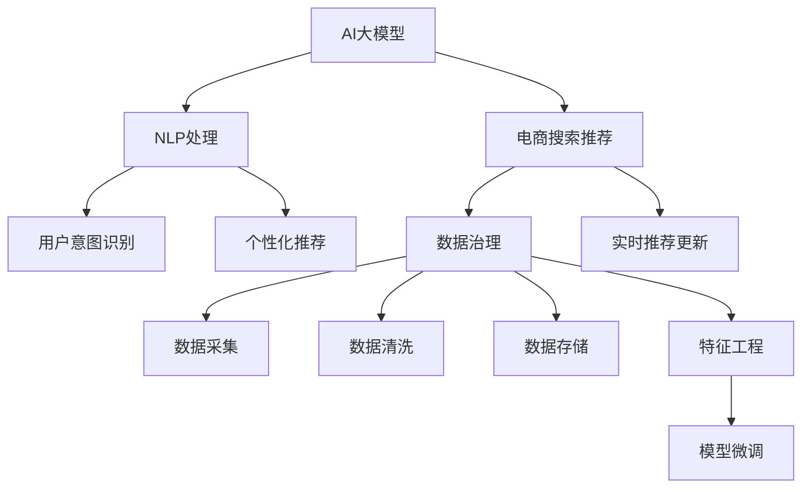

                 

# AI大模型助力电商搜索推荐业务的数据治理能力提升实践

> 关键词：AI大模型,电商搜索推荐,数据治理,自然语言处理(NLP),用户行为分析,特征工程,模型微调,推荐系统,产品体验优化

## 1. 背景介绍

### 1.1 问题由来
电商行业已经进入深度竞争的阶段，消费者对于个性化推荐的期待日益增高，这要求电商企业必须更精准地理解消费者的需求和行为，提供更加个性化的搜索和推荐服务。传统的搜索推荐系统依赖于统计模型和规则，在处理海量数据和复杂用户行为时显得力不从心。因此，引入AI大模型成为电商企业优化搜索推荐效果的重要手段。

### 1.2 问题核心关键点
大模型在电商搜索推荐中的应用主要集中在以下几个方面：
1. **用户意图识别**：通过自然语言处理(NLP)技术，理解用户搜索词的意图，进而生成更准确的搜索结果和推荐。
2. **个性化推荐**：利用大模型的自监督学习能力，提升推荐内容的个性化和多样性。
3. **实时推荐更新**：基于实时用户行为数据，动态更新推荐模型，提升推荐的时效性。

然而，这些应用场景也对数据治理能力提出了更高的要求。如何有效管理、分析和利用电商平台的丰富数据，是大模型在电商应用中成功的关键。

## 2. 核心概念与联系

### 2.1 核心概念概述

为更好地理解大模型在电商搜索推荐中的应用及其数据治理需求，本节将介绍几个密切相关的核心概念：

- **AI大模型**：指基于深度学习架构（如Transformer）的预训练模型，如BERT、GPT等，这些模型通过大规模数据预训练，具备强大的语言理解能力和泛化能力。
- **电商搜索推荐系统**：指电商平台为满足用户需求，提供搜索结果和商品推荐服务的系统。系统通过分析用户行为和商品特征，实现个性化推荐。
- **数据治理**：指对数据进行采集、管理、存储、清洗、分析等一系列技术手段，确保数据的准确性、完整性和一致性，为模型训练和应用提供坚实的基础。
- **自然语言处理(NLP)**：指使用AI技术处理、理解、生成自然语言的技术，如文本分类、情感分析、实体识别等。
- **用户行为分析**：通过分析用户搜索、浏览、购买等行为，识别用户需求和偏好，为推荐系统提供数据支持。
- **特征工程**：指从原始数据中提取、转换和构建特征，以供模型训练使用的过程。
- **模型微调**：指在预训练模型基础上，使用小规模标注数据进行有监督学习，优化模型在特定任务上的性能。

这些核心概念之间的逻辑关系可以通过以下Mermaid流程图来展示：



这个流程图展示了大模型在电商搜索推荐中的核心概念及其之间的关系：

1. 大模型通过预训练获得语言理解能力，应用于NLP任务。
2. NLP任务中的用户意图识别和个性化推荐，为电商搜索推荐提供数据支持和算法依据。
3. 电商搜索推荐系统依赖于数据治理，确保数据的质量和可靠性。
4. 数据治理过程涉及数据采集、清洗、存储等环节，为特征工程和模型训练提供数据。
5. 特征工程提取出有用的特征，供模型训练使用。
6. 模型微调进一步优化模型性能，使其更适用于电商推荐场景。
7. 实时推荐更新基于最新数据，动态调整推荐内容。

## 3. 核心算法原理 & 具体操作步骤
### 3.1 算法原理概述

大模型在电商搜索推荐中的应用，主要基于NLP技术和推荐系统。其核心思想是通过大模型理解用户意图和偏好，生成个性化的推荐内容。具体而言，基于监督学习的大模型微调方法，可以有效提升模型在特定任务上的表现，从而优化推荐效果。

### 3.2 算法步骤详解

基于监督学习的大模型微调一般包括以下几个关键步骤：

**Step 1: 数据治理和准备**
- **数据采集**：从电商平台中采集用户搜索词、浏览行为、购买记录等数据。数据采集应保证全面性和代表性，涵盖不同类型和场景。
- **数据清洗**：清洗数据中的噪声、异常值和重复数据，确保数据质量和一致性。
- **数据存储**：将清洗后的数据存储在高效的数据库中，如Hadoop、MySQL等，便于后续分析和模型训练。

**Step 2: 特征提取与工程**
- **特征选择**：根据电商业务特点，选择对推荐效果有显著影响的关键特征，如用户ID、商品ID、浏览时间、点击率等。
- **特征转换**：将原始数据转换为模型可接受的格式，如将时间戳转换为时间特征、将文本数据转换为向量表示等。
- **特征构建**：利用一些高级技术，如交叉特征、组合特征、时间特征等，构建更有意义的特征。

**Step 3: 模型选择与微调**
- **模型选择**：根据任务需求，选择合适的预训练模型，如BERT、GPT等。
- **微调目标**：定义模型微调的目标函数，如交叉熵损失、均方误差损失等。
- **微调过程**：使用小规模标注数据，对预训练模型进行有监督学习，调整模型参数以优化推荐效果。

**Step 4: 模型评估与部署**
- **模型评估**：在验证集上评估模型性能，如AUC、P-R曲线等。
- **模型部署**：将微调后的模型部署到推荐系统中，进行实时推荐。
- **性能优化**：根据实时推荐效果，持续优化模型和数据治理策略，提升推荐系统的整体性能。

### 3.3 算法优缺点

基于监督学习的大模型微调方法具有以下优点：
1. **效果好**：通过大量标注数据训练，模型能够更准确地理解和预测用户行为。
2. **易操作**：微调过程相对简单，不需要复杂的特征工程和算法优化。
3. **可解释性强**：微调后的模型权重变化易于解释，便于理解和调试。

同时，该方法也存在一些局限性：
1. **依赖标注数据**：微调效果依赖于高质量的标注数据，标注成本高。
2. **数据偏差**：标注数据可能存在偏差，导致模型泛化能力不足。
3. **冷启动问题**：对于新用户和新商品，推荐系统缺乏足够的历史数据，难以进行有效推荐。

### 3.4 算法应用领域

大模型微调技术在电商搜索推荐中的应用领域非常广泛，具体包括：

- **搜索意图识别**：理解用户搜索词的意图，生成更加精准的搜索结果。
- **个性化推荐**：基于用户行为数据，提供个性化的商品推荐。
- **推荐算法优化**：优化推荐算法，提升推荐系统的精度和覆盖率。
- **实时推荐更新**：根据实时用户行为数据，动态调整推荐内容。
- **用户行为分析**：分析用户行为数据，发现用户偏好和需求，优化推荐策略。

这些应用场景不仅提升了电商平台的推荐效果，还增强了用户体验和满意度，为电商企业带来了更高的商业价值。

## 4. 数学模型和公式 & 详细讲解 & 举例说明

### 4.1 数学模型构建

在大模型微调中，通常采用监督学习框架。以电商推荐系统为例，目标是在给定商品ID和用户ID的条件下，预测用户是否点击某个商品的概率。设$x_i$为用户ID和商品ID的向量表示，$y_i$为点击标签，则模型的目标为：

$$
\min_{\theta} \frac{1}{N}\sum_{i=1}^N L(y_i, M_{\theta}(x_i))
$$

其中，$M_{\theta}(x_i)$为模型对用户和商品特征的预测概率，$L$为损失函数，$\theta$为模型参数。

常见的损失函数包括二分类交叉熵损失函数：

$$
L(y_i, M_{\theta}(x_i)) = -y_i\log M_{\theta}(x_i) - (1-y_i)\log(1-M_{\theta}(x_i))
$$

### 4.2 公式推导过程

以用户行为预测为例，假设用户历史行为数据为$(x_1, y_1), (x_2, y_2), ..., (x_N, y_N)$，其中$x_i$为用户行为特征，$y_i$为点击标签。通过大模型微调，得到模型参数$\theta$后，对于新用户行为$x$，模型的预测概率为：

$$
M_{\theta}(x) = \frac{e^{W_{\theta}x}}{\sum_{i=1}^N e^{W_{\theta}x_i}}
$$

其中，$W_{\theta}$为模型参数，$e$为自然常数。

根据损失函数和模型预测，可以得到梯度更新公式：

$$
\frac{\partial \mathcal{L}}{\partial W_{\theta}} = -\frac{1}{N} \sum_{i=1}^N y_i(\frac{\partial M_{\theta}(x_i)}{\partial W_{\theta}} - \frac{\partial M_{\theta}(x)}{\partial W_{\theta}})
$$

通过反向传播算法，可以高效计算梯度并更新模型参数，从而实现模型的微调。

### 4.3 案例分析与讲解

以搜索意图识别为例，假设用户输入搜索词“iPhone 12”，大模型通过预训练学习到了该词的语义表示，通过微调学习任务特定的特征，能够更准确地预测用户意图是否为购买。在训练过程中，可以利用一些标注数据，如用户点击搜索结果的行为数据，来优化模型的预测准确度。具体流程如下：

1. **数据准备**：收集用户搜索词、点击位置、停留时间等数据，标注用户意图是否为购买。
2. **模型选择**：选择合适的预训练模型，如BERT。
3. **微调目标**：定义二分类交叉熵损失函数，预测用户意图是否为购买。
4. **模型训练**：使用标注数据训练模型，不断更新模型参数以提升预测准确度。
5. **模型评估**：在验证集上评估模型性能，优化超参数。
6. **模型部署**：将微调后的模型集成到搜索推荐系统中，实时识别用户意图。

## 5. 项目实践：代码实例和详细解释说明

### 5.1 开发环境搭建

在进行大模型微调实践前，我们需要准备好开发环境。以下是使用Python进行PyTorch开发的环境配置流程：

1. 安装Anaconda：从官网下载并安装Anaconda，用于创建独立的Python环境。

2. 创建并激活虚拟环境：
```bash
conda create -n pytorch-env python=3.8 
conda activate pytorch-env
```

3. 安装PyTorch：根据CUDA版本，从官网获取对应的安装命令。例如：
```bash
conda install pytorch torchvision torchaudio cudatoolkit=11.1 -c pytorch -c conda-forge
```

4. 安装相关库：
```bash
pip install transformers pandas sklearn
```

5. 安装所需的开发库和工具：
```bash
pip install joblib jupyter notebook matplotlib tqdm
```

完成上述步骤后，即可在`pytorch-env`环境中开始微调实践。

### 5.2 源代码详细实现

下面我们以电商平台上的搜索意图识别任务为例，给出使用Transformers库对BERT模型进行微调的PyTorch代码实现。

首先，定义搜索意图识别任务的数据处理函数：

```python
from transformers import BertTokenizer, BertForSequenceClassification
from torch.utils.data import Dataset, DataLoader
import torch
import pandas as pd
from sklearn.model_selection import train_test_split

class SearchIntentDataset(Dataset):
    def __init__(self, text, label, tokenizer, max_len=128):
        self.text = text
        self.label = label
        self.tokenizer = tokenizer
        self.max_len = max_len
        
    def __len__(self):
        return len(self.text)
    
    def __getitem__(self, item):
        text = self.text[item]
        label = self.label[item]
        
        encoding = self.tokenizer(text, return_tensors='pt', max_length=self.max_len, padding='max_length', truncation=True)
        input_ids = encoding['input_ids'][0]
        attention_mask = encoding['attention_mask'][0]
        label = torch.tensor(self.label[item], dtype=torch.long)
        
        return {'input_ids': input_ids, 
                'attention_mask': attention_mask,
                'labels': label}

# 读取数据
data = pd.read_csv('search_intent_data.csv')
texts = data['search_text'].values
labels = data['intent'].values

# 数据划分
train_texts, dev_texts, train_labels, dev_labels = train_test_split(texts, labels, test_size=0.2, random_state=42)

# 创建dataset
tokenizer = BertTokenizer.from_pretrained('bert-base-cased')

train_dataset = SearchIntentDataset(train_texts, train_labels, tokenizer)
dev_dataset = SearchIntentDataset(dev_texts, dev_labels, tokenizer)

# 设置微调超参数
model = BertForSequenceClassification.from_pretrained('bert-base-cased', num_labels=2)
optimizer = torch.optim.Adam(model.parameters(), lr=2e-5)
device = torch.device('cuda') if torch.cuda.is_available() else torch.device('cpu')

# 执行梯度训练
model.to(device)
for epoch in range(5):
    model.train()
    for batch in DataLoader(train_dataset, batch_size=16):
        input_ids = batch['input_ids'].to(device)
        attention_mask = batch['attention_mask'].to(device)
        labels = batch['labels'].to(device)
        model.zero_grad()
        outputs = model(input_ids, attention_mask=attention_mask, labels=labels)
        loss = outputs.loss
        loss.backward()
        optimizer.step()

    model.eval()
    with torch.no_grad():
        for batch in DataLoader(dev_dataset, batch_size=16):
            input_ids = batch['input_ids'].to(device)
            attention_mask = batch['attention_mask'].to(device)
            labels = batch['labels'].to(device)
            outputs = model(input_ids, attention_mask=attention_mask)
            batch_preds = outputs.logits.argmax(dim=1)
            batch_labels = labels.to('cpu').tolist()
            for pred, label in zip(batch_preds, batch_labels):
                print(f"Prediction: {pred}, True Label: {label}")
```

### 5.3 代码解读与分析

让我们再详细解读一下关键代码的实现细节：

**SearchIntentDataset类**：
- `__init__`方法：初始化文本、标签、分词器等关键组件，并进行序列化处理。
- `__len__`方法：返回数据集的样本数量。
- `__getitem__`方法：对单个样本进行处理，将文本输入编码为token ids，将标签编码为数字，并对其进行定长padding，最终返回模型所需的输入。

**数据处理流程**：
- 从CSV文件中读取原始数据，提取搜索词和意图标签。
- 对数据进行划分，划分为训练集和验证集。
- 创建SearchIntentDataset实例，用于数据的序列化和分批次处理。

**模型选择与初始化**：
- 选择合适的BERT模型，并进行实例化。
- 设置Adam优化器，定义学习率。

**模型训练**：
- 将模型迁移到GPU上，进行前向传播和后向传播，更新模型参数。
- 在验证集上评估模型性能，循环迭代训练过程。

**模型评估**：
- 在验证集上评估模型性能，输出预测结果和真实标签。

## 6. 实际应用场景

### 6.1 搜索意图识别

搜索意图识别是大模型在电商搜索推荐中的重要应用场景之一。通过大模型微调，可以准确理解用户的搜索意图，从而提供更加精准的搜索结果。以京东为例，京东的搜索意图识别系统通过大模型微调，可以准确识别用户是否想要搜索商品、比价或获取商品信息，进而提供定制化的搜索结果。

### 6.2 个性化推荐

个性化推荐是大模型在电商搜索推荐中的另一核心应用。通过大模型微调，推荐系统可以更深入地理解用户行为和偏好，生成个性化的商品推荐。以阿里巴巴为例，阿里巴巴的推荐系统通过大模型微调，可以基于用户的浏览记录、购买历史和搜索行为，生成个性化的商品推荐，提升用户满意度和转化率。

### 6.3 实时推荐更新

实时推荐更新是大模型在电商搜索推荐中的关键特性。通过大模型微调，推荐系统可以基于实时用户行为数据，动态更新推荐内容，提升推荐的时效性和相关性。以亚马逊为例，亚马逊的推荐系统通过大模型微调，可以实时更新推荐内容，捕捉用户的即时需求，提升用户体验和购买转化率。

### 6.4 未来应用展望

随着大模型技术的不断发展，基于大模型微调的电商搜索推荐系统将在更多场景中得到应用，带来更深远的影响：

1. **跨领域推荐**：大模型可以理解不同领域的内容，应用于跨领域的商品推荐，如将时尚商品推荐给体育爱好者，或将家居用品推荐给旅游爱好者。
2. **跨模态推荐**：大模型可以融合视觉、音频等多种模态数据，提供更加丰富和多样的推荐内容，如将视频推荐给用户，或根据用户的音乐偏好推荐商品。
3. **社会化推荐**：大模型可以理解用户之间的关系和社交网络，应用于基于社会化关系的网络推荐，提升推荐的个性化和多样性。
4. **增强现实推荐**：大模型可以结合增强现实技术，为用户提供虚拟商品试穿、试用等体验，提升推荐效果和用户体验。

这些应用场景将进一步拓展电商搜索推荐系统的边界，为用户带来更加丰富和个性化的购物体验。

## 7. 工具和资源推荐
### 7.1 学习资源推荐

为了帮助开发者系统掌握大模型在电商搜索推荐中的应用，这里推荐一些优质的学习资源：

1. **《深度学习与自然语言处理》**：斯坦福大学开设的NLP明星课程，涵盖深度学习在NLP中的各种应用，包括电商搜索推荐。
2. **《AI大模型在电商推荐中的应用》**：一篇系统介绍大模型在电商推荐中应用的博文，提供详细的理论知识和代码实现。
3. **《电商搜索推荐系统》**：一本系统介绍电商搜索推荐系统的书籍，涵盖搜索意图识别、个性化推荐等内容。
4. **HuggingFace官方文档**：Transformers库的官方文档，提供丰富的预训练模型和微调样例代码，是入门大模型的必备资料。
5. **Kaggle竞赛数据集**：Kaggle上的电商推荐竞赛数据集，可以用于实践和测试大模型在电商推荐中的应用效果。

通过对这些资源的学习实践，相信你一定能够快速掌握大模型在电商搜索推荐中的应用，并用于解决实际的电商问题。

### 7.2 开发工具推荐

高效的开发离不开优秀的工具支持。以下是几款用于大模型在电商搜索推荐应用开发的常用工具：

1. **Jupyter Notebook**：免费的交互式编程环境，适合快速迭代和协作开发。
2. **TensorBoard**：TensorFlow的可视化工具，可以实时监测模型训练状态，提供丰富的图表呈现方式。
3. **PyTorch**：基于Python的开源深度学习框架，支持动态计算图，适合快速迭代研究。
4. **Transformers库**：HuggingFace开发的NLP工具库，提供丰富的预训练模型和微调功能。
5. **Scikit-learn**：流行的机器学习库，提供各种特征工程和模型评估工具。

合理利用这些工具，可以显著提升电商搜索推荐应用的开发效率，加快创新迭代的步伐。

### 7.3 相关论文推荐

大模型在电商搜索推荐中的应用源于学界的持续研究。以下是几篇奠基性的相关论文，推荐阅读：

1. **"Attention is All You Need"**：提出Transformer结构，开启了NLP领域的预训练大模型时代。
2. **"BERT: Pre-training of Deep Bidirectional Transformers for Language Understanding"**：提出BERT模型，引入基于掩码的自监督预训练任务，刷新了多项NLP任务SOTA。
3. **"Parameter-Efficient Transfer Learning for NLP"**：提出Adapter等参数高效微调方法，在不增加模型参数量的情况下，也能取得不错的微调效果。
4. **"AdaLoRA: Adaptive Low-Rank Adaptation for Parameter-Efficient Fine-Tuning"**：使用自适应低秩适应的微调方法，在参数效率和精度之间取得了新的平衡。
5. **"Adversarial Regularization for Sequence Modeling"**：提出对抗训练方法，提升模型的鲁棒性和泛化能力。

这些论文代表了大模型在电商搜索推荐中的应用发展脉络。通过学习这些前沿成果，可以帮助研究者把握学科前进方向，激发更多的创新灵感。

## 8. 总结：未来发展趋势与挑战

### 8.1 总结

本文对基于大模型的电商搜索推荐系统进行了全面系统的介绍。首先阐述了大模型在电商搜索推荐中的应用背景和意义，明确了电商搜索推荐系统的核心任务和目标。其次，从原理到实践，详细讲解了大模型微调的数学原理和关键步骤，给出了微调任务开发的完整代码实例。同时，本文还广泛探讨了大模型在电商搜索推荐中的多种应用场景，展示了其强大的性能和潜力。此外，本文精选了微调技术的各类学习资源，力求为读者提供全方位的技术指引。

通过本文的系统梳理，可以看到，大模型在电商搜索推荐中的应用不仅提升了推荐的精度和效果，还增强了用户体验和满意度，为电商企业带来了更高的商业价值。未来，伴随大模型技术的不断演进，电商搜索推荐系统将在更多场景中得到应用，为电商行业带来更深远的影响。

### 8.2 未来发展趋势

展望未来，大模型在电商搜索推荐中的应用将呈现以下几个发展趋势：

1. **模型规模增大**：随着算力成本的下降和数据规模的扩张，大模型的参数量将持续增长，提升了推荐系统的性能和效果。
2. **跨模态推荐增强**：融合视觉、音频等多种模态数据，提供更加丰富和多样的推荐内容。
3. **社会化推荐普及**：结合用户之间的关系和社交网络，提升推荐的个性化和多样性。
4. **实时推荐优化**：基于实时用户行为数据，动态更新推荐内容，提升推荐的时效性和相关性。
5. **增强现实推荐**：结合增强现实技术，为用户提供虚拟商品试穿、试用等体验，提升推荐效果和用户体验。

这些趋势凸显了大模型在电商搜索推荐中的应用前景，为电商企业提供了更多的创新机会。相信随着技术的不断进步，大模型将在电商领域扮演越来越重要的角色，带来更加智能和个性化的推荐体验。

### 8.3 面临的挑战

尽管大模型在电商搜索推荐中的应用取得了显著成效，但在迈向更加智能化、普适化应用的过程中，仍面临诸多挑战：

1. **标注数据成本高**：高质量标注数据获取难度大，成本高。如何减少标注数据需求，提升模型的泛化能力，是未来的一个重要研究方向。
2. **模型复杂度高**：大模型的复杂度较高，推理速度较慢，内存占用较大。如何优化模型结构和推理算法，提升推荐系统的实时性和效率，是未来亟待解决的问题。
3. **数据隐私保护**：电商搜索推荐系统涉及用户隐私数据，如何在保障用户隐私的同时，优化推荐效果，是未来需要重点考虑的问题。
4. **模型可解释性**：大模型的决策过程难以解释，如何在保障用户信任的同时，提升模型的可解释性，是未来需要解决的挑战。
5. **冷启动问题**：新用户和新商品的数据较少，难以进行有效推荐。如何处理冷启动问题，提升新用户的推荐效果，是未来需要优化的问题。

正视这些挑战，积极应对并寻求突破，将是大模型在电商搜索推荐应用中取得更大成功的关键。

### 8.4 研究展望

面对大模型在电商搜索推荐应用中面临的挑战，未来的研究需要在以下几个方面寻求新的突破：

1. **无监督和半监督学习**：探索无监督和半监督学习范式，减少对标注数据的依赖，提升模型的泛化能力和鲁棒性。
2. **跨领域迁移学习**：将大模型的预训练知识迁移到不同领域的推荐系统中，提升模型的通用性和适应性。
3. **实时数据融合**：研究实时数据融合技术，动态更新推荐内容，提升推荐的时效性和相关性。
4. **增强现实技术**：结合增强现实技术，为用户提供更加沉浸式和互动式的推荐体验。
5. **可解释性研究**：研究模型的可解释性，提升用户对推荐系统的信任和满意度。

这些研究方向的探索，必将引领大模型在电商搜索推荐中的应用迈向更高的台阶，为电商企业带来更加智能和个性化的推荐服务。总之，大模型在电商搜索推荐中的应用需要不断创新和优化，才能真正实现智能化和个性化的电商推荐。

## 9. 附录：常见问题与解答

**Q1：电商搜索推荐系统和大模型微调有什么关系？**

A: 电商搜索推荐系统和大模型微调有着密切的关系。大模型在电商推荐中主要应用于用户意图识别、个性化推荐等任务，而微调则是提升这些任务性能的重要手段。通过大模型微调，电商推荐系统可以更准确地理解用户行为，生成更个性化的推荐内容。

**Q2：电商搜索推荐系统如何使用大模型微调？**

A: 电商搜索推荐系统在使用大模型微调时，主要包括以下步骤：
1. 数据治理：对电商数据进行采集、清洗、存储等处理，确保数据的质量和一致性。
2. 特征工程：从电商数据中提取、转换和构建特征，供大模型微调使用。
3. 模型选择：选择适合电商任务的大模型进行微调。
4. 微调目标：定义微调的目标函数，如交叉熵损失、均方误差损失等。
5. 模型训练：使用电商数据对大模型进行有监督学习，调整模型参数以优化推荐效果。
6. 模型评估：在验证集上评估模型性能，优化超参数。
7. 模型部署：将微调后的模型部署到电商推荐系统中，进行实时推荐。

**Q3：大模型微调在电商推荐中的效果如何？**

A: 大模型微调在电商推荐中通常能显著提升推荐效果，具体表现为：
1. 推荐精度提升：大模型通过理解用户意图和行为，生成更精准的推荐内容。
2. 个性化增强：大模型通过分析用户历史行为，生成个性化的推荐列表，提升用户体验。
3. 实时推荐优化：大模型可以基于实时数据动态更新推荐内容，提升推荐的时效性和相关性。
4. 冷启动问题解决：大模型可以通过用户搜索行为等少量数据，生成初步推荐内容，解决冷启动问题。

**Q4：大模型微调需要哪些硬件资源？**

A: 大模型微调通常需要高性能的GPU/TPU设备，以保证模型的快速训练和推理。同时，还需要充足的内存和存储空间，用于存储大量的电商数据和模型参数。

**Q5：电商推荐系统如何应对异常行为？**

A: 电商推荐系统应对异常行为的方法包括：
1. 异常检测：通过数据分析和机器学习，识别出异常行为并进行筛选。
2. 异常处理：对异常行为进行合理处理，如屏蔽、降权等。
3. 实时监控：实时监控推荐系统，及时发现和应对异常行为。

通过对这些问题的解答，相信你对大模型在电商搜索推荐中的应用有了更深入的理解。大模型在电商推荐中的应用展示了AI技术的强大潜力，未来随着技术的不断发展，必将带来更多的创新和突破。

---

作者：禅与计算机程序设计艺术 / Zen and the Art of Computer Programming

