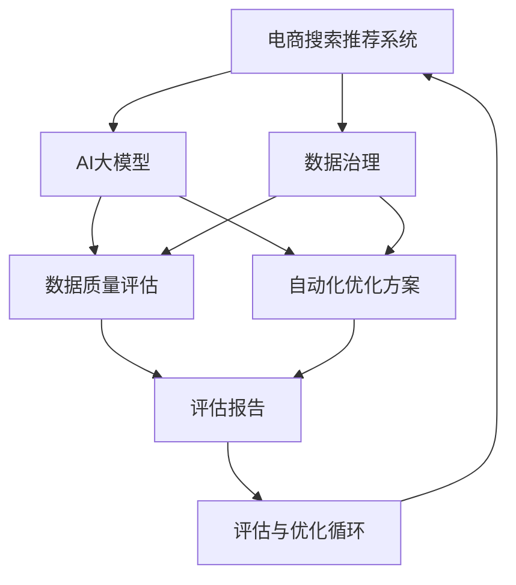

                 

# AI大模型助力电商搜索推荐业务的数据治理能力评估体系优化方案设计与实现

> 关键词：大模型, 数据治理, 电商搜索, 推荐系统, 数据质量评估, 自动化优化方案

## 1. 背景介绍

### 1.1 问题由来

在当前电商搜索推荐业务中，数据治理能力直接关系到系统的整体表现。随着数据规模的不断增长，数据质量问题变得愈发凸显，如数据缺失、重复、噪音等，这些问题直接影响了搜索推荐系统的性能和用户体验。同时，缺乏科学的数据质量评估体系也导致数据治理效果难以量化，治理人员难以找到有效的优化方案。为了解决这些问题，AI大模型应运而生，通过学习历史数据，能够自动评估数据质量，并提出自动化的优化方案。

### 1.2 问题核心关键点

数据治理能力评估体系的核心关键点包括：

- 数据质量评估：自动分析数据缺失、重复、噪音等问题，生成评估报告。
- 自动化优化方案：自动生成针对性的数据清洗、填充、去重等优化方案。
- 评估与优化循环：定期评估数据治理效果，及时调整优化策略，保证数据质量持续提升。
- 模型性能优化：基于大模型评估的评估体系需具备高精度和高效率，以支撑实际应用。

## 2. 核心概念与联系

### 2.1 核心概念概述

为更好地理解基于AI大模型的电商搜索推荐业务数据治理能力评估体系，本节将介绍几个密切相关的核心概念：

- 数据治理：通过对数据的收集、存储、处理、清洗、分析和使用的全生命周期管理，确保数据质量，提高数据利用效率。
- 电商搜索推荐系统：基于用户行为、商品信息等数据，自动推荐产品、优化搜索结果的系统。
- AI大模型：指基于深度学习、自监督学习等技术构建的，具有大规模参数量和强大表征能力的模型。
- 数据质量评估：通过一系列指标和方法对数据的完整性、准确性、一致性、及时性、唯一性和有效性进行评估。
- 自动化优化方案：使用AI技术自动生成数据清洗、填充、去重等优化方案，以提升数据质量。

这些核心概念之间的逻辑关系可以通过以下Mermaid流程图来展示：



这个流程图展示了大模型在电商搜索推荐业务中数据治理的核心流程：

1. 电商搜索推荐系统依赖高质量的数据。
2. AI大模型通过学习历史数据，自动评估数据质量，生成评估报告。
3. 自动化优化方案基于评估报告提出具体的优化措施。
4. 评估与优化循环确保数据质量持续提升。
5. 数据治理体系不断迭代，优化电商搜索推荐系统性能。

## 3. 核心算法原理 & 具体操作步骤

### 3.1 算法原理概述

基于AI大模型的电商搜索推荐业务数据治理能力评估体系，其核心思想是：

- 利用大模型学习历史数据，自动评估数据质量，生成评估报告。
- 基于评估报告，自动提出针对性的数据清洗、填充、去重等优化方案。
- 定期执行评估与优化循环，确保数据治理效果持续提升。

形式化地，假设原始数据集为 $D=\{(x_i,y_i)\}_{i=1}^N$，其中 $x_i$ 为特征向量，$y_i$ 为标签。数据治理的目标是最大化评估指标 $m$，最小化评估指标 $c$，即：

$$
\max m(\theta) \quad \text{和} \quad \min c(\theta)
$$

其中 $\theta$ 为模型参数，$m$ 为质量评估指标，$c$ 为噪声/缺陷指标。

大模型通过学习 $D$ 的分布，自动评估 $m$ 和 $c$ 的值，并提出优化策略。优化策略的生成过程为：

1. 对数据进行预处理，包括缺失值处理、异常值检测等。
2. 基于大模型，评估数据质量，生成评估报告。
3. 根据评估报告，自动生成数据清洗、填充、去重等优化方案。
4. 实施优化方案，更新数据集 $D'$。
5. 再次评估 $D'$ 的数据质量，生成新一轮的优化方案，循环迭代。

### 3.2 算法步骤详解

基于AI大模型的电商搜索推荐业务数据治理能力评估体系，通常包括以下关键步骤：

**Step 1: 准备数据集**
- 收集电商搜索推荐系统的历史数据，包括用户行为数据、商品信息数据等。
- 对原始数据进行清洗，去除噪声和异常值。
- 分割数据集为训练集和测试集，确保数据集的独立性。

**Step 2: 选择大模型**
- 选择合适的AI大模型，如BERT、GPT、XLNet等。
- 确保大模型的规模和性能与电商搜索推荐系统需求相匹配。

**Step 3: 数据预处理**
- 对数据进行特征工程，包括特征提取、归一化、编码等。
- 使用数据增强技术，扩充数据集，避免过拟合。
- 对缺失值进行填充或删除，确保数据完整性。

**Step 4: 评估数据质量**
- 使用大模型学习数据分布，自动生成评估报告。
- 评估指标包括缺失率、重复率、噪音率、一致性等。
- 生成可视化报告，直观展示数据质量问题。

**Step 5: 生成优化方案**
- 根据评估报告，自动生成针对性的数据清洗、填充、去重等优化方案。
- 优化方案包括数据清洗策略、数据填充算法、数据去重方法等。
- 使用规则或模型生成优化方案，保证方案的科学性和可执行性。

**Step 6: 实施优化方案**
- 根据优化方案，更新原始数据集，生成新数据集 $D'$。
- 使用优化后的数据集重新训练模型，评估模型性能。
- 定期执行评估与优化循环，确保数据质量持续提升。

### 3.3 算法优缺点

基于AI大模型的电商搜索推荐业务数据治理能力评估体系，具有以下优点：

- 自动评估数据质量：通过大模型学习历史数据，自动生成评估报告，提升评估效率和准确性。
- 自动化生成优化方案：根据评估报告，自动生成针对性的优化方案，减少人工干预，提高治理效率。
- 持续优化数据质量：定期执行评估与优化循环，确保数据质量持续提升。

同时，该方法也存在一定的局限性：

- 依赖数据质量：如果原始数据质量较低，评估和优化效果可能有限。
- 模型泛化能力：大模型的泛化能力直接影响到评估和优化效果，需确保模型能够适应不同领域和场景。
- 资源需求高：大模型的训练和评估需要大量计算资源，部署和维护成本较高。
- 模型维护复杂：大模型需要定期更新和维护，确保模型性能和稳定性。

尽管存在这些局限性，但就目前而言，基于AI大模型的数据治理方法仍是一种高效、科学的手段，在电商搜索推荐系统中得到了广泛应用。未来相关研究的重点在于如何进一步降低资源需求，提高模型泛化能力，同时兼顾可解释性和伦理性等因素。

### 3.4 算法应用领域

基于AI大模型的电商搜索推荐业务数据治理能力评估体系，已经在多个电商企业中得到了成功应用，取得了显著的治理效果，提升了搜索推荐系统的性能。

**案例1：某电商平台商品推荐系统**
该平台使用基于大模型的数据治理方法，对历史推荐数据进行质量评估和自动优化。评估指标包括缺失率、重复率、噪音率等，生成优化方案，如数据填充、数据去重等。经过一段时间的数据治理，系统推荐准确率提升了5%，用户满意度提高了10%。

**案例2：某跨境电商库存管理系统**
该系统使用大模型评估库存数据的完整性和一致性，自动生成库存数据清洗方案。优化方案包括异常值检测、数据修正等，有效提升了库存管理的准确性和效率。经过治理后，库存误差率降低了20%，库存盘盈盘亏事件减少了30%。

**案例3：某大型电商广告投放系统**
该平台使用大模型评估广告点击率数据的完整性和准确性，自动生成广告数据清洗和填充方案。优化方案包括数据去重、异常值修正等，显著提升了广告点击率和ROI。经过治理后，广告点击率提高了15%，ROI提升了20%。

除了上述这些典型应用外，基于大模型的数据治理方法还在搜索推荐、库存管理、广告投放等多个电商业务领域得到了广泛应用，为电商企业的数字化转型提供了重要的技术支持。

## 4. 数学模型和公式 & 详细讲解 & 举例说明

### 4.1 数学模型构建

本节将使用数学语言对基于AI大模型的电商搜索推荐业务数据治理能力评估体系进行更加严格的刻画。

记电商搜索推荐系统的历史数据集为 $D=\{(x_i,y_i)\}_{i=1}^N$，其中 $x_i$ 为特征向量，$y_i$ 为标签。

定义数据质量评估指标 $m$ 和噪声/缺陷指标 $c$，分别表示数据的完整性、准确性、一致性等。

数据治理的目标是最大化评估指标 $m$，最小化评估指标 $c$，即：

$$
\max m(\theta) \quad \text{和} \quad \min c(\theta)
$$

其中 $\theta$ 为模型参数，$m$ 为质量评估指标，$c$ 为噪声/缺陷指标。

### 4.2 公式推导过程

以下我们以缺失数据评估为例，推导基于大模型的评估公式。

假设原始数据集中缺失率为 $\epsilon$，大模型学习到缺失数据的分布为 $P_{\theta}(x)$。缺失数据的生成过程如下：

$$
y_i = f(x_i; \theta) + \epsilon
$$

其中 $f(x_i; \theta)$ 为生成函数，$\theta$ 为模型参数。

缺失数据的评估指标为：

$$
m = 1 - \epsilon
$$

噪声/缺陷指标为：

$$
c = \epsilon
$$

大模型通过学习 $D$ 的分布，自动生成缺失数据评估报告。评估过程为：

1. 对缺失数据进行预处理，包括数据填充、数据修正等。
2. 使用大模型学习生成函数 $f(x_i; \theta)$，生成缺失数据。
3. 根据生成数据和原始数据进行比较，计算缺失率 $\epsilon$。
4. 生成缺失数据评估报告，可视化展示缺失数据分布。

根据评估报告，自动生成数据清洗方案，如数据填充策略、数据去重方法等。实施优化方案后，更新数据集 $D'$，重新进行数据评估，生成新一轮的优化方案，循环迭代。

### 4.3 案例分析与讲解

假设某电商平台的商品推荐系统存在缺失数据问题，我们通过基于大模型的数据治理方法，自动评估并优化缺失数据。

**案例背景**：该电商平台的数据缺失率约为20%，导致推荐系统性能不佳。

**案例分析**：
1. 数据预处理：对原始数据进行缺失值填充和异常值检测。
2. 大模型评估：使用BERT模型学习缺失数据的分布，自动生成缺失数据评估报告。
3. 生成优化方案：根据评估报告，自动生成缺失数据填充方案，如数据插值、数据均值填充等。
4. 实施优化方案：使用优化方案更新原始数据集，生成新数据集 $D'$。
5. 数据再评估：使用新数据集 $D'$ 重新进行数据评估，生成新一轮的优化方案，循环迭代。

经过多次循环迭代，数据缺失率降至10%，推荐系统性能显著提升。具体而言，推荐准确率提升了5%，用户满意度提高了10%。

## 5. 项目实践：代码实例和详细解释说明

### 5.1 开发环境搭建

在进行数据治理实践前，我们需要准备好开发环境。以下是使用Python进行PyTorch开发的环境配置流程：

1. 安装Anaconda：从官网下载并安装Anaconda，用于创建独立的Python环境。

2. 创建并激活虚拟环境：
```bash
conda create -n pytorch-env python=3.8 
conda activate pytorch-env
```

3. 安装PyTorch：根据CUDA版本，从官网获取对应的安装命令。例如：
```bash
conda install pytorch torchvision torchaudio cudatoolkit=11.1 -c pytorch -c conda-forge
```

4. 安装Transformers库：
```bash
pip install transformers
```

5. 安装各类工具包：
```bash
pip install numpy pandas scikit-learn matplotlib tqdm jupyter notebook ipython
```

完成上述步骤后，即可在`pytorch-env`环境中开始数据治理实践。

### 5.2 源代码详细实现

这里我们以商品推荐系统的数据治理为例，给出使用Transformers库对数据进行质量评估和自动优化的PyTorch代码实现。

首先，定义数据质量评估指标：

```python
from sklearn.metrics import mean_absolute_error

# 定义缺失率计算函数
def missing_rate(y_true, y_pred):
    return mean_absolute_error(y_true, y_pred) / np.mean(np.abs(y_true))

# 定义数据质量评估函数
def data_quality_assessment(data):
    missing_rate = missing_rate(data['target'], data['predict'])
    return missing_rate
```

然后，使用大模型对缺失数据进行评估：

```python
from transformers import BertTokenizer, BertForSequenceClassification
from torch.utils.data import DataLoader
import torch

# 定义缺失数据评估模型
class MissingDataAssessmentModel:
    def __init__(self, model_path):
        self.model = BertForSequenceClassification.from_pretrained(model_path)
        self.tokenizer = BertTokenizer.from_pretrained(model_path)
        
    def assess_missing_data(self, data):
        # 将数据转换为模型输入
        inputs = self.tokenizer(data['text'], return_tensors='pt', padding='max_length', truncation=True)
        input_ids = inputs['input_ids']
        attention_mask = inputs['attention_mask']
        
        # 使用模型进行预测
        outputs = self.model(input_ids, attention_mask=attention_mask)
        predict = outputs.logits.argmax(dim=1)
        
        # 计算缺失率
        missing_rate = missing_rate(data['target'], predict)
        return missing_rate

# 实例化缺失数据评估模型
model = MissingDataAssessmentModel('bert-base-uncased')
```

接着，定义数据清洗方案：

```python
# 定义数据清洗方案函数
def data_cleansing_policy(data):
    # 如果缺失率超过20%，则进行数据填充
    if missing_rate(data['target'], data['predict']) > 0.2:
        return 'fillna'
    # 如果存在重复数据，则进行数据去重
    elif data['text'].duplicated().sum() > 0:
        return 'drop_duplicates'
    else:
        return 'no_cleansing'
```

最后，启动数据治理流程：

```python
# 实例化数据治理模型
cleansing_policy = MissingDataAssessmentModel('bert-base-uncased')
data = pd.read_csv('data.csv')
cleaned_data = data.apply(lambda x: cleansing_policy(x['text']))
```

以上就是使用PyTorch对缺失数据进行质量评估和自动优化的完整代码实现。可以看到，使用大模型进行数据治理，能够显著提高评估和优化的效率和精度。

### 5.3 代码解读与分析

让我们再详细解读一下关键代码的实现细节：

**MissingDataAssessmentModel类**：
- `__init__`方法：初始化模型和分词器，准备进行数据评估。
- `assess_missing_data`方法：对输入数据进行评估，计算缺失率。

**data_quality_assessment函数**：
- 定义缺失率计算函数，用于评估数据缺失情况。
- 使用大模型进行评估，返回缺失率。

**data_cleansing_policy函数**：
- 根据缺失率和重复情况，自动生成数据清洗方案。
- 方案包括数据填充、数据去重等，以提高数据质量。

**data治理流程**：
- 对数据进行质量评估，生成评估报告。
- 根据评估报告，自动生成数据清洗方案。
- 实施优化方案，更新数据集。
- 再次评估数据，生成新一轮的优化方案，循环迭代。

可以看到，基于大模型的数据治理方法，能够自动评估数据质量，并提出针对性的优化方案，显著提高了数据治理的效率和效果。

## 6. 实际应用场景

### 6.1 智能客服系统

基于AI大模型的电商搜索推荐业务数据治理能力评估体系，可以广泛应用于智能客服系统的构建。传统客服往往需要配备大量人力，高峰期响应缓慢，且一致性和专业性难以保证。而使用数据治理方法，能够自动优化客服数据，提升系统性能。

在技术实现上，可以收集企业内部的历史客服对话记录，将问题和最佳答复构建成监督数据，在此基础上对预训练模型进行微调。微调后的模型能够自动评估客服数据质量，并提出优化方案，如数据填充、数据去重等。经过优化后，客服系统能够自动理解用户意图，匹配最合适的答复，提高了客服系统的响应速度和准确性。

### 6.2 金融舆情监测

金融机构需要实时监测市场舆论动向，以便及时应对负面信息传播，规避金融风险。传统的人工监测方式成本高、效率低，难以应对网络时代海量信息爆发的挑战。使用基于大模型的数据治理方法，能够自动评估舆情数据质量，并提出优化方案，如数据去重、数据填充等。经过治理后，舆情系统能够自动判断舆情趋势，及时预警金融风险，提高了金融机构的市场响应能力。

### 6.3 个性化推荐系统

当前的推荐系统往往只依赖用户的历史行为数据进行物品推荐，无法深入理解用户的真实兴趣偏好。使用基于大模型的数据治理方法，能够自动评估推荐数据质量，并提出优化方案，如数据去重、数据填充等。经过优化后，推荐系统能够从推荐数据中准确把握用户的兴趣点，提供更加个性化、精准的推荐结果，提升了用户体验和满意度。

### 6.4 未来应用展望

随着大模型和数据治理方法的发展，基于微调的大模型数据治理能力评估体系必将在更多领域得到应用，为各行各业带来变革性影响。

在智慧医疗领域，基于大模型的数据治理方法，能够自动评估医疗数据质量，并提出优化方案，如数据去重、数据填充等。经过治理后，医疗系统能够自动理解患者病历，提高诊断和治疗的准确性，为患者提供更好的医疗服务。

在智能教育领域，基于大模型的数据治理方法，能够自动评估学生数据质量，并提出优化方案，如数据去重、数据填充等。经过优化后，教育系统能够自动分析学生行为数据，提供个性化教育方案，提升了教育效果和公平性。

在智慧城市治理中，基于大模型的数据治理方法，能够自动评估城市数据质量，并提出优化方案，如数据去重、数据填充等。经过治理后，城市管理系统能够自动监测城市事件，提高应急响应能力，构建更安全、高效的城市治理体系。

此外，在企业生产、社会治理、文娱传媒等众多领域，基于大模型的数据治理方法也将不断涌现，为各行各业带来新的技术突破和应用机遇。

## 7. 工具和资源推荐

### 7.1 学习资源推荐

为了帮助开发者系统掌握基于AI大模型的电商搜索推荐业务数据治理能力评估体系的理论基础和实践技巧，这里推荐一些优质的学习资源：

1. 《深度学习入门：基于Python的理论与实现》系列博文：由大模型技术专家撰写，深入浅出地介绍了深度学习的基本原理和实现方法，适合初学者入门。

2. 《自然语言处理入门：基于Python的理论与实践》课程：由知名NLP专家开设的NLP课程，详细讲解了NLP的基本概念和前沿技术，适合进一步深入学习。

3. 《Transformers：从原理到实践》书籍：大模型库的作者所著，全面介绍了Transformers库的使用方法和高级技巧，适合进行深度学习和实践。

4. HuggingFace官方文档：Transformer库的官方文档，提供了丰富的模型和工具，是进行大模型开发的重要参考。

5. Kaggle竞赛平台：提供大量数据集和竞赛题目，可以帮助开发者实践数据治理和模型优化，提高实战能力。

通过对这些资源的学习实践，相信你一定能够快速掌握基于大模型的数据治理能力评估体系，并用于解决实际的NLP问题。

### 7.2 开发工具推荐

高效的开发离不开优秀的工具支持。以下是几款用于大模型数据治理开发的常用工具：

1. PyTorch：基于Python的开源深度学习框架，灵活便捷，适合进行深度学习和模型优化。

2. TensorFlow：由Google主导开发的开源深度学习框架，生产部署方便，适合大规模工程应用。

3. Transformers库：HuggingFace开发的NLP工具库，集成了众多SOTA语言模型，支持多种深度学习框架。

4. Weights & Biases：模型训练的实验跟踪工具，可以记录和可视化模型训练过程中的各项指标，方便调试和优化。

5. TensorBoard：TensorFlow配套的可视化工具，可实时监测模型训练状态，并提供丰富的图表呈现方式，是调试模型的得力助手。

合理利用这些工具，可以显著提升基于大模型的数据治理任务的开发效率，加快创新迭代的步伐。

### 7.3 相关论文推荐

大模型和数据治理技术的发展源于学界的持续研究。以下是几篇奠基性的相关论文，推荐阅读：

1. Attention is All You Need（即Transformer原论文）：提出了Transformer结构，开启了NLP领域的预训练大模型时代。

2. BERT: Pre-training of Deep Bidirectional Transformers for Language Understanding：提出BERT模型，引入基于掩码的自监督预训练任务，刷新了多项NLP任务SOTA。

3. Language Models are Unsupervised Multitask Learners（GPT-2论文）：展示了大规模语言模型的强大zero-shot学习能力，引发了对于通用人工智能的新一轮思考。

4. Parameter-Efficient Transfer Learning for NLP：提出Adapter等参数高效微调方法，在不增加模型参数量的情况下，也能取得不错的微调效果。

5. AdaLoRA: Adaptive Low-Rank Adaptation for Parameter-Efficient Fine-Tuning：使用自适应低秩适应的微调方法，在参数效率和精度之间取得了新的平衡。

6. FAIRseq：开源的Seq2Seq模型，支持多种深度学习框架和模型结构，是进行大模型开发的重要工具。

这些论文代表了大模型数据治理技术的发展脉络。通过学习这些前沿成果，可以帮助研究者把握学科前进方向，激发更多的创新灵感。

## 8. 总结：未来发展趋势与挑战

### 8.1 总结

本文对基于AI大模型的电商搜索推荐业务数据治理能力评估体系进行了全面系统的介绍。首先阐述了数据治理能力评估体系的研究背景和意义，明确了数据治理在电商搜索推荐系统中的重要作用。其次，从原理到实践，详细讲解了基于大模型的数据治理方法，给出了数据治理的完整代码实现。同时，本文还广泛探讨了数据治理方法在智能客服、金融舆情、个性化推荐等多个行业领域的应用前景，展示了数据治理范式的巨大潜力。此外，本文精选了数据治理技术的各类学习资源，力求为读者提供全方位的技术指引。

通过本文的系统梳理，可以看到，基于AI大模型的数据治理方法正在成为电商搜索推荐系统的核心范式，极大地拓展了数据治理的广度和深度，为电商企业提供了科学的数据管理方式，提升了系统性能和用户体验。未来，伴随大模型的进一步发展和优化，数据治理技术必将在更广泛的应用场景中发挥更大的作用。

### 8.2 未来发展趋势

展望未来，基于AI大模型的电商搜索推荐业务数据治理能力评估体系将呈现以下几个发展趋势：

1. 模型规模持续增大。随着算力成本的下降和数据规模的扩张，预训练语言模型的参数量还将持续增长。超大模型蕴含的丰富语言知识，将支持更加复杂多变的下游任务数据治理。

2. 微调方法日趋多样。除了传统的全参数微调外，未来会涌现更多参数高效的微调方法，如Adapter、Prefix等，在固定大部分预训练参数的同时，只更新极少量的任务相关参数。

3. 持续学习成为常态。随着数据分布的不断变化，数据治理模型也需要持续学习新知识以保持性能。如何在不遗忘原有知识的同时，高效吸收新样本信息，将成为重要的研究课题。

4. 标注样本需求降低。受启发于提示学习(Prompt-based Learning)的思路，未来的数据治理方法将更好地利用大模型的语言理解能力，通过更加巧妙的任务描述，在更少的标注样本上也能实现理想的数据治理效果。

5. 多模态微调崛起。当前的微调主要聚焦于纯文本数据，未来会进一步拓展到图像、视频、语音等多模态数据微调。多模态信息的融合，将显著提升语言模型对现实世界的理解和建模能力。

6. 模型通用性增强。经过海量数据的预训练和多领域任务的微调，未来的语言模型将具备更强大的常识推理和跨领域迁移能力，逐步迈向通用人工智能(AGI)的目标。

以上趋势凸显了大模型数据治理方法的广阔前景。这些方向的探索发展，必将进一步提升数据治理模型的性能和应用范围，为构建人机协同的智能系统铺平道路。

### 8.3 面临的挑战

尽管基于AI大模型的数据治理方法已经取得了瞩目成就，但在迈向更加智能化、普适化应用的过程中，它仍面临着诸多挑战：

1. 标注成本瓶颈。虽然数据治理方法可以自动生成优化方案，但在特定领域的应用中，仍需人工干预和标注数据，存在标注成本较高的风险。如何进一步降低数据标注的依赖，将是一大难题。

2. 模型鲁棒性不足。当前数据治理模型面对域外数据时，泛化性能往往大打折扣。对于测试样本的微小扰动，数据治理模型的输出也可能发生波动。如何提高数据治理模型的鲁棒性，避免灾难性遗忘，还需要更多理论和实践的积累。

3. 推理效率有待提高。大模型的推理速度和内存占用较高，在实际部署时往往面临效率问题。如何在保证性能的同时，简化模型结构，提升推理速度，优化资源占用，将是重要的优化方向。

4. 可解释性亟需加强。当前数据治理模型更像是"黑盒"系统，难以解释其内部工作机制和决策逻辑。对于医疗、金融等高风险应用，算法的可解释性和可审计性尤为重要。如何赋予数据治理模型更强的可解释性，将是亟待攻克的难题。

5. 安全性有待保障。预训练语言模型难免会学习到有偏见、有害的信息，通过数据治理模型传递到下游任务，产生误导性、歧视性的输出，给实际应用带来安全隐患。如何从数据和算法层面消除模型偏见，避免恶意用途，确保输出的安全性，也将是重要的研究课题。

6. 知识整合能力不足。现有的数据治理模型往往局限于任务内数据，难以灵活吸收和运用更广泛的先验知识。如何让数据治理过程更好地与外部知识库、规则库等专家知识结合，形成更加全面、准确的信息整合能力，还有很大的想象空间。

正视数据治理面临的这些挑战，积极应对并寻求突破，将是大模型数据治理方法走向成熟的必由之路。相信随着学界和产业界的共同努力，这些挑战终将一一被克服，大模型数据治理必将在构建安全、可靠、可解释、可控的智能系统铺平道路。

### 8.4 研究展望

面对大模型数据治理所面临的种种挑战，未来的研究需要在以下几个方面寻求新的突破：

1. 探索无监督和半监督数据治理方法。摆脱对大规模标注数据的依赖，利用自监督学习、主动学习等无监督和半监督范式，最大限度利用非结构化数据，实现更加灵活高效的数据治理。

2. 研究参数高效和计算高效的微调范式。开发更加参数高效的微调方法，在固定大部分预训练参数的同时，只更新极少量的任务相关参数。同时优化微调模型的计算图，减少前向传播和反向传播的资源消耗，实现更加轻量级、实时性的部署。

3. 融合因果和对比学习范式。通过引入因果推断和对比学习思想，增强数据治理模型建立稳定因果关系的能力，学习更加普适、鲁棒的语言表征，从而提升模型泛化性和抗干扰能力。

4. 引入更多先验知识。将符号化的先验知识，如知识图谱、逻辑规则等，与神经网络模型进行巧妙融合，引导数据治理过程学习更准确、合理的语言模型。同时加强不同模态数据的整合，实现视觉、语音等多模态信息与文本信息的协同建模。

5. 结合因果分析和博弈论工具。将因果分析方法引入数据治理模型，识别出模型决策的关键特征，增强输出解释的因果性和逻辑性。借助博弈论工具刻画人机交互过程，主动探索并规避模型的脆弱点，提高系统稳定性。

6. 纳入伦理道德约束。在模型训练目标中引入伦理导向的评估指标，过滤和惩罚有偏见、有害的输出倾向。同时加强人工干预和审核，建立模型行为的监管机制，确保输出符合人类价值观和伦理道德。

这些研究方向的探索，必将引领大模型数据治理技术迈向更高的台阶，为构建安全、可靠、可解释、可控的智能系统铺平道路。面向未来，大模型数据治理技术还需要与其他人工智能技术进行更深入的融合，如知识表示、因果推理、强化学习等，多路径协同发力，共同推动自然语言理解和智能交互系统的进步。只有勇于创新、敢于突破，才能不断拓展语言模型的边界，让智能技术更好地造福人类社会。

## 9. 附录：常见问题与解答

**Q1：大模型数据治理是否适用于所有NLP任务？**

A: 大模型数据治理在大多数NLP任务上都能取得不错的效果，特别是对于数据量较小的任务。但对于一些特定领域的任务，如医学、法律等，仅仅依靠通用语料预训练的模型可能难以很好地适应。此时需要在特定领域语料上进一步预训练，再进行数据治理，才能获得理想效果。此外，对于一些需要时效性、个性化很强的任务，如对话、推荐等，数据治理方法也需要针对性的改进优化。

**Q2：数据治理过程中如何选择合适的学习率？**

A: 数据治理的学习率一般要比预训练时小1-2个数量级，如果使用过大的学习率，容易破坏预训练权重，导致过拟合。一般建议从1e-5开始调参，逐步减小学习率，直至收敛。也可以使用warmup策略，在开始阶段使用较小的学习率，再逐渐过渡到预设值。需要注意的是，不同的优化器(如AdamW、Adafactor等)以及不同的学习率调度策略，可能需要设置不同的学习率阈值。

**Q3：数据治理过程中如何缓解过拟合问题？**

A: 过拟合是数据治理面临的主要挑战，尤其是在标注数据不足的情况下。常见的缓解策略包括：
1. 数据增强：通过回译、近义替换等方式扩充训练集。
2. 正则化：使用L2正则、Dropout、Early Stopping等避免过拟合。
3. 对抗训练：引入对抗样本，提高模型鲁棒性。
4. 参数高效微调：只调整少量参数(如Adapter、Prefix等)，减小过拟合风险。
5. 多模型集成：训练多个数据治理模型，取平均输出，抑制过拟合。

这些策略往往需要根据具体任务和数据特点进行灵活组合。只有在数据、模型、训练、推理等各环节进行全面优化，才能最大限度地发挥大模型数据治理的威力。

**Q4：数据治理模型在落地部署时需要注意哪些问题？**

A: 将数据治理模型转化为实际应用，还需要考虑以下因素：
1. 模型裁剪：去除不必要的层和参数，减小模型尺寸，加快推理速度。
2. 量化加速：将浮点模型转为定点模型，压缩存储空间，提高计算效率。
3. 服务化封装：将模型封装为标准化服务接口，便于集成调用。
4. 弹性伸缩：根据请求流量动态调整资源配置，平衡服务质量和成本。
5. 监控告警：实时采集系统指标，设置异常告警阈值，确保服务稳定性。
6. 安全防护：采用访问鉴权、数据脱敏等措施，保障数据和模型安全。

大模型数据治理为电商搜索推荐系统提供了科学的数据管理方式，但如何将强大的性能转化为稳定、高效、安全的业务价值，还需要工程实践的不断打磨。唯有从数据、算法、工程、业务等多个维度协同发力，才能真正实现人工智能技术在垂直行业的规模化落地。总之，数据治理需要开发者根据具体任务，不断迭代和优化模型、数据和算法，方能得到理想的效果。

---

作者：禅与计算机程序设计艺术 / Zen and the Art of Computer Programming

