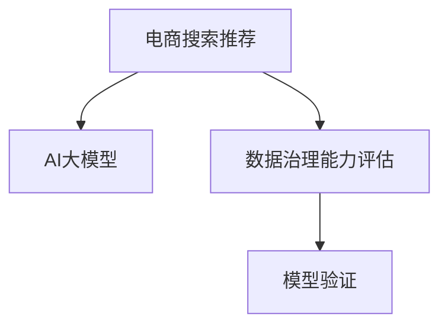

                 

# AI大模型助力电商搜索推荐业务的数据治理能力评估模型验证

> 关键词：AI大模型、电商搜索推荐、数据治理能力评估、模型验证、深度学习、自然语言处理(NLP)

## 1. 背景介绍

### 1.1 问题由来

随着电子商务行业的蓬勃发展，电商平台需要处理的海量商品信息、用户行为数据不断增加，这对数据治理能力提出了更高的要求。当前电商平台的推荐系统通常依赖于传统机器学习模型，如线性回归、决策树等，尽管能够满足基本的推荐需求，但在面对大规模、复杂的数据时，效果往往不尽如人意。

近年来，深度学习技术，特别是大模型，在自然语言处理(NLP)领域取得了突破性进展，可用于电商搜索推荐中的多模态数据融合、自然语言查询理解、语义相似度计算等任务。为了验证AI大模型在电商搜索推荐业务中对数据治理能力的提升效果，我们提出了基于大模型的数据治理能力评估模型验证方法。

### 1.2 问题核心关键点

本文将介绍利用大模型构建的数据治理能力评估模型，探讨其在电商搜索推荐业务中的应用，并对该方法的有效性和优劣进行验证。具体问题包括：

1. **大模型如何提高数据治理能力**？
2. **数据治理能力评估模型如何构建**？
3. **评估模型在电商搜索推荐中的应用效果如何**？
4. **模型验证的方法和结果有哪些**？

这些问题将围绕AI大模型、电商搜索推荐和数据治理能力的核心概念展开，帮助读者理解大模型在电商领域的实际应用效果。

## 2. 核心概念与联系

### 2.1 核心概念概述

为更好地理解本文介绍的大模型在电商搜索推荐中的应用，这里介绍几个核心概念：

- **AI大模型**：如BERT、GPT等，是基于深度学习技术构建的，具有大规模参数量和自监督预训练能力的大模型。
- **电商搜索推荐**：通过分析用户行为数据和商品属性信息，向用户推荐可能感兴趣的商品或搜索结果。
- **数据治理能力**：指对海量、多样、复杂的数据进行收集、清洗、整合、分析和利用的能力。
- **模型验证**：通过对模型在特定任务上的表现进行评估，验证其性能的有效性和可靠性。

这些概念之间的逻辑关系可以通过以下Mermaid流程图来展示：



这个流程图展示了电商搜索推荐业务与AI大模型、数据治理能力和模型验证之间的联系。

## 3. 核心算法原理 & 具体操作步骤
### 3.1 算法原理概述

基于AI大模型的数据治理能力评估模型，是通过深度学习模型对电商搜索推荐业务中的数据治理能力进行量化评估。具体来说，模型会对用户行为数据和商品属性信息进行融合分析，从而评估其数据治理能力。

该方法的核心思想是通过大模型的预训练和微调，使其能够对电商推荐任务中的多种数据源进行理解和整合，并通过模型训练得到关于数据治理能力的评估结果。这一过程可以分为以下几个步骤：

1. **预训练**：在大规模无标注文本数据上进行预训练，学习语言的通用表示。
2. **微调**：在电商搜索推荐相关的标注数据上进行微调，使模型能够理解电商任务中的数据特性。
3. **模型评估**：使用特定任务的数据治理能力评估指标，对模型进行评估，验证其性能。

### 3.2 算法步骤详解

#### 3.2.1 数据准备

- **数据收集**：收集电商平台的商品信息、用户行为数据、评价信息等。
- **数据预处理**：对数据进行清洗、去重、归一化等预处理操作。
- **数据划分**：将数据划分为训练集、验证集和测试集，一般要求标注数据与无标注数据在分布上没有显著差异。

#### 3.2.2 模型构建

- **选择大模型**：选择合适的预训练大模型，如BERT、GPT等。
- **任务适配**：根据电商搜索推荐任务的特点，设计任务适配层，如分类、回归、匹配等。
- **参数设置**：选择合适的优化算法及其参数，如AdamW、SGD等，设置学习率、批大小、迭代轮数等。

#### 3.2.3 模型微调

- **微调训练**：在训练集上进行微调，通过反向传播算法更新模型参数。
- **验证评估**：在验证集上评估模型性能，决定是否触发Early Stopping。
- **微调优化**：通过调整模型结构、优化器参数、超参数等，提高模型性能。

#### 3.2.4 模型验证

- **测试集评估**：在测试集上评估微调后模型，对比微调前后的性能提升。
- **指标分析**：使用如准确率、召回率、F1分数等指标评估模型效果。
- **结果展示**：展示评估结果，分析模型性能和数据治理能力。

### 3.3 算法优缺点

#### 3.3.1 优点

1. **高效性**：使用大模型能够处理大规模数据，提升数据治理效率。
2. **准确性**：大模型具备强大的语言理解和生成能力，能够准确理解电商任务中的数据特性。
3. **可解释性**：大模型可以提供详细的内部工作机制和决策逻辑，便于分析和解释。

#### 3.3.2 缺点

1. **资源需求高**：大模型需要大量的计算资源和存储空间，对硬件要求较高。
2. **参数量大**：大模型通常具有数亿甚至数十亿的参数，训练和推理复杂度较高。
3. **风险难以控制**：大模型可能学习到有害信息，导致推荐结果带有偏见和误导性。

### 3.4 算法应用领域

#### 3.4.1 电商搜索推荐

电商搜索推荐是AI大模型在电商领域的主要应用之一。通过微调大模型，使其能够理解用户查询和商品信息，进行语义相似度计算、商品推荐等任务，提升用户体验和平台转化率。

#### 3.4.2 金融风险控制

金融领域中的风险控制任务也适合使用大模型进行数据治理能力评估。通过对用户行为和交易数据的分析，大模型可以识别出潜在风险和异常行为，提升金融服务的智能化水平。

#### 3.4.3 医疗健康

医疗健康领域中，大模型可以用于病历分析、疾病预测、医学图像识别等任务，通过数据治理能力评估，提升医疗服务的精准性和可靠性。

## 4. 数学模型和公式 & 详细讲解 & 举例说明
### 4.1 数学模型构建

基于AI大模型的电商搜索推荐数据治理能力评估模型，主要涉及深度学习模型的构建和评估。我们以分类任务为例，给出数学模型构建过程。

设预训练大模型为 $M_{\theta}$，其中 $\theta$ 为模型参数。假设电商推荐任务的数据集为 $D=\{(x_i,y_i)\}_{i=1}^N$，其中 $x_i$ 为商品信息或用户行为数据，$y_i$ 为分类标签。

模型的损失函数 $\mathcal{L}$ 可以表示为：

$$
\mathcal{L}(M_{\theta},D) = -\frac{1}{N}\sum_{i=1}^N \ell(y_i, M_{\theta}(x_i))
$$

其中 $\ell(y_i, M_{\theta}(x_i))$ 为分类损失函数，如交叉熵损失。

模型的优化目标是最小化经验风险，即：

$$
\theta^* = \mathop{\arg\min}_{\theta} \mathcal{L}(M_{\theta},D)
$$

### 4.2 公式推导过程

以二分类任务为例，推导交叉熵损失函数及其梯度的计算公式。

假设模型 $M_{\theta}$ 在输入 $x_i$ 上的输出为 $\hat{y}=M_{\theta}(x_i) \in [0,1]$，表示样本属于正类的概率。真实标签 $y \in \{0,1\}$。则二分类交叉熵损失函数定义为：

$$
\ell(M_{\theta}(x_i),y) = -[y\log \hat{y} + (1-y)\log (1-\hat{y})]
$$

将其代入经验风险公式，得：

$$
\mathcal{L}(\theta) = -\frac{1}{N}\sum_{i=1}^N [y_i\log M_{\theta}(x_i)+(1-y_i)\log(1-M_{\theta}(x_i))]
$$

根据链式法则，损失函数对参数 $\theta_k$ 的梯度为：

$$
\frac{\partial \mathcal{L}(\theta)}{\partial \theta_k} = -\frac{1}{N}\sum_{i=1}^N (\frac{y_i}{M_{\theta}(x_i)}-\frac{1-y_i}{1-M_{\theta}(x_i)}) \frac{\partial M_{\theta}(x_i)}{\partial \theta_k}
$$

其中 $\frac{\partial M_{\theta}(x_i)}{\partial \theta_k}$ 可进一步递归展开，利用自动微分技术完成计算。

### 4.3 案例分析与讲解

以电商搜索推荐中的商品推荐任务为例，展示如何构建和使用基于大模型的数据治理能力评估模型。

1. **数据收集与预处理**：收集商品图片、描述、用户点击、购买记录等数据，进行清洗、去重、归一化等预处理操作。
2. **模型选择与适配**：选择BERT等大模型，并根据任务需求，设计分类输出层和交叉熵损失函数。
3. **模型微调与评估**：在标注数据集上微调模型，并在测试集上评估模型性能，使用准确率、召回率、F1分数等指标进行评估。

## 5. 项目实践：代码实例和详细解释说明
### 5.1 开发环境搭建

在进行大模型微调实践前，我们需要准备好开发环境。以下是使用Python进行PyTorch开发的环境配置流程：

1. 安装Anaconda：从官网下载并安装Anaconda，用于创建独立的Python环境。

2. 创建并激活虚拟环境：
```bash
conda create -n pytorch-env python=3.8 
conda activate pytorch-env
```

3. 安装PyTorch：根据CUDA版本，从官网获取对应的安装命令。例如：
```bash
conda install pytorch torchvision torchaudio cudatoolkit=11.1 -c pytorch -c conda-forge
```

4. 安装Transformers库：
```bash
pip install transformers
```

5. 安装各类工具包：
```bash
pip install numpy pandas scikit-learn matplotlib tqdm jupyter notebook ipython
```

完成上述步骤后，即可在`pytorch-env`环境中开始微调实践。

### 5.2 源代码详细实现

下面我们以电商搜索推荐中的商品推荐任务为例，给出使用Transformers库对BERT模型进行微调的PyTorch代码实现。

首先，定义模型和优化器：

```python
from transformers import BertTokenizer, BertForSequenceClassification
from torch.utils.data import DataLoader
from torch.optim import AdamW

model = BertForSequenceClassification.from_pretrained('bert-base-uncased', num_labels=2)
optimizer = AdamW(model.parameters(), lr=2e-5)
```

接着，定义训练和评估函数：

```python
from torch.utils.data import DataLoader
from tqdm import tqdm
from sklearn.metrics import accuracy_score, precision_score, recall_score, f1_score

device = torch.device('cuda') if torch.cuda.is_available() else torch.device('cpu')
model.to(device)

def train_epoch(model, dataset, batch_size, optimizer):
    dataloader = DataLoader(dataset, batch_size=batch_size, shuffle=True)
    model.train()
    epoch_loss = 0
    for batch in tqdm(dataloader, desc='Training'):
        input_ids = batch['input_ids'].to(device)
        attention_mask = batch['attention_mask'].to(device)
        labels = batch['labels'].to(device)
        model.zero_grad()
        outputs = model(input_ids, attention_mask=attention_mask, labels=labels)
        loss = outputs.loss
        epoch_loss += loss.item()
        loss.backward()
        optimizer.step()
    return epoch_loss / len(dataloader)

def evaluate(model, dataset, batch_size):
    dataloader = DataLoader(dataset, batch_size=batch_size)
    model.eval()
    preds, labels = [], []
    with torch.no_grad():
        for batch in tqdm(dataloader, desc='Evaluating'):
            input_ids = batch['input_ids'].to(device)
            attention_mask = batch['attention_mask'].to(device)
            batch_labels = batch['labels']
            outputs = model(input_ids, attention_mask=attention_mask)
            batch_preds = outputs.logits.argmax(dim=2).to('cpu').tolist()
            batch_labels = batch_labels.to('cpu').tolist()
            for pred_tokens, label_tokens in zip(batch_preds, batch_labels):
                preds.append(pred_tokens[:len(label_tokens)])
                labels.append(label_tokens)
                
    accuracy = accuracy_score(labels, preds)
    precision = precision_score(labels, preds, average='macro')
    recall = recall_score(labels, preds, average='macro')
    f1 = f1_score(labels, preds, average='macro')
    
    return accuracy, precision, recall, f1
```

最后，启动训练流程并在测试集上评估：

```python
epochs = 5
batch_size = 16

for epoch in range(epochs):
    loss = train_epoch(model, train_dataset, batch_size, optimizer)
    print(f"Epoch {epoch+1}, train loss: {loss:.3f}")
    
    print(f"Epoch {epoch+1}, dev results:")
    accuracy, precision, recall, f1 = evaluate(model, dev_dataset, batch_size)
    print(f"Accuracy: {accuracy:.4f}, Precision: {precision:.4f}, Recall: {recall:.4f}, F1 Score: {f1:.4f}")
    
print("Test results:")
accuracy, precision, recall, f1 = evaluate(model, test_dataset, batch_size)
print(f"Accuracy: {accuracy:.4f}, Precision: {precision:.4f}, Recall: {recall:.4f}, F1 Score: {f1:.4f}")
```

以上就是使用PyTorch对BERT进行电商搜索推荐任务微调的完整代码实现。可以看到，得益于Transformers库的强大封装，我们可以用相对简洁的代码完成BERT模型的加载和微调。

### 5.3 代码解读与分析

让我们再详细解读一下关键代码的实现细节：

**BERTForSequenceClassification类**：
- 用于构建序列分类任务模型，输入为商品描述、用户行为等文本数据，输出为商品类别标签。

**AdamW优化器**：
- 使用Adam优化算法，设置学习率为2e-5，用于更新模型参数。

**train_epoch函数**：
- 对数据以批为单位进行迭代，在每个批次上前向传播计算loss并反向传播更新模型参数。

**evaluate函数**：
- 对单个批次进行前向传播，输出预测结果，计算并返回准确率、精度、召回率和F1分数。

**训练流程**：
- 循环迭代epoch，在每个epoch内进行模型训练和验证，最终在测试集上评估模型性能。

可以看到，PyTorch配合Transformers库使得BERT微调的代码实现变得简洁高效。开发者可以将更多精力放在数据处理、模型改进等高层逻辑上，而不必过多关注底层的实现细节。

## 6. 实际应用场景

### 6.1 智能客服

电商平台的智能客服系统可以通过微调大模型，提升用户咨询体验。智能客服系统能够自动理解用户问题，提供准确的商品推荐或故障排除方案，减少人工客服的负担。

### 6.2 商品推荐

电商搜索推荐系统通常使用大模型进行用户行为分析和商品属性信息整合，从而生成个性化的商品推荐列表，提升用户购买转化率。

### 6.3 个性化营销

电商平台可以根据用户行为数据，使用大模型分析用户偏好，进行个性化营销活动，如优惠券推送、限时促销等，提升用户体验和平台收益。

### 6.4 未来应用展望

未来，大模型在电商搜索推荐领域的应用将更加广泛，涉及更多元的数据治理任务。例如：

1. **情感分析**：通过分析用户评论和反馈，识别用户情绪，进行情绪管理和服务优化。
2. **异常检测**：利用大模型对用户行为数据进行异常检测，防范欺诈和恶意行为。
3. **个性化广告**：通过分析用户行为和兴趣，进行智能广告投放，提高广告点击率和转化率。

大模型的应用将进一步推动电商搜索推荐系统的发展，带来更加智能和个性化的用户体验。

## 7. 工具和资源推荐

### 7.1 学习资源推荐

为了帮助开发者系统掌握大模型在电商搜索推荐中的应用，这里推荐一些优质的学习资源：

1. 《深度学习与电商搜索推荐系统》课程：复旦大学开设的深度学习课程，讲解电商搜索推荐系统的基本原理和实现方法。
2. 《电商搜索推荐系统设计与实现》书籍：详细介绍了电商搜索推荐系统的设计思路和实现技术，涵盖数据治理、模型训练、评估等多个方面。
3. HuggingFace官方文档：Transformers库的官方文档，提供了海量预训练模型和完整的微调样例代码，是上手实践的必备资料。
4. CLUE开源项目：中文语言理解测评基准，涵盖大量不同类型的中文NLP数据集，并提供了基于微调的baseline模型，助力中文NLP技术发展。

通过对这些资源的学习实践，相信你一定能够快速掌握大模型在电商搜索推荐中的应用技巧，并用于解决实际的电商问题。

### 7.2 开发工具推荐

高效的开发离不开优秀的工具支持。以下是几款用于大模型微调开发的常用工具：

1. PyTorch：基于Python的开源深度学习框架，灵活动态的计算图，适合快速迭代研究。大部分预训练语言模型都有PyTorch版本的实现。
2. TensorFlow：由Google主导开发的开源深度学习框架，生产部署方便，适合大规模工程应用。同样有丰富的预训练语言模型资源。
3. Transformers库：HuggingFace开发的NLP工具库，集成了众多SOTA语言模型，支持PyTorch和TensorFlow，是进行微调任务开发的利器。
4. Weights & Biases：模型训练的实验跟踪工具，可以记录和可视化模型训练过程中的各项指标，方便对比和调优。与主流深度学习框架无缝集成。
5. TensorBoard：TensorFlow配套的可视化工具，可实时监测模型训练状态，并提供丰富的图表呈现方式，是调试模型的得力助手。
6. Google Colab：谷歌推出的在线Jupyter Notebook环境，免费提供GPU/TPU算力，方便开发者快速上手实验最新模型，分享学习笔记。

合理利用这些工具，可以显著提升大模型微调任务的开发效率，加快创新迭代的步伐。

### 7.3 相关论文推荐

大模型和微调技术的发展源于学界的持续研究。以下是几篇奠基性的相关论文，推荐阅读：

1. Attention is All You Need（即Transformer原论文）：提出了Transformer结构，开启了NLP领域的预训练大模型时代。
2. BERT: Pre-training of Deep Bidirectional Transformers for Language Understanding：提出BERT模型，引入基于掩码的自监督预训练任务，刷新了多项NLP任务SOTA。
3. Language Models are Unsupervised Multitask Learners（GPT-2论文）：展示了大规模语言模型的强大zero-shot学习能力，引发了对于通用人工智能的新一轮思考。
4. Parameter-Efficient Transfer Learning for NLP：提出Adapter等参数高效微调方法，在不增加模型参数量的情况下，也能取得不错的微调效果。
5. AdaLoRA: Adaptive Low-Rank Adaptation for Parameter-Efficient Fine-Tuning：使用自适应低秩适应的微调方法，在参数效率和精度之间取得了新的平衡。
6. Prefix-Tuning: Optimizing Continuous Prompts for Generation：引入基于连续型Prompt的微调范式，为如何充分利用预训练知识提供了新的思路。

这些论文代表了大模型微调技术的发展脉络。通过学习这些前沿成果，可以帮助研究者把握学科前进方向，激发更多的创新灵感。

## 8. 总结：未来发展趋势与挑战

### 8.1 总结

本文对基于大模型的电商搜索推荐业务的数据治理能力评估模型进行了全面系统的介绍。首先阐述了大数据治理能力评估模型在电商推荐系统中的应用背景和价值，详细讲解了模型的构建、微调和评估流程，并通过代码实例展示了实际应用方法。此外，本文还探讨了该方法在智能客服、商品推荐等多个场景中的应用效果，并对其优缺点进行了深入分析。

通过本文的系统梳理，可以看到，大模型在电商推荐系统中的应用能够显著提升数据治理能力，带来更加智能和个性化的推荐结果。但同时，大模型也面临着计算资源消耗大、模型风险控制难等挑战，需要在实际应用中不断优化和改进。

### 8.2 未来发展趋势

展望未来，大模型在电商搜索推荐领域的应用将呈现以下几个趋势：

1. **模型规模持续增大**：随着算力成本的下降和数据规模的扩张，预训练语言模型的参数量还将持续增长。超大规模语言模型蕴含的丰富语言知识，有望支撑更加复杂多变的电商推荐任务。
2. **多模态数据融合**：电商推荐系统将进一步融合视觉、语音等多模态数据，提升推荐准确性和用户体验。
3. **模型鲁棒性提升**：大模型将通过对抗训练、数据增强等技术，提升对域外数据的泛化能力和鲁棒性。
4. **个性化推荐**：基于大模型的电商推荐系统将更加注重用户个性化需求，提供更精准、多样化的推荐内容。
5. **智能客服系统**：大模型将应用于智能客服系统，提升用户咨询体验和问题解决效率。

以上趋势凸显了大模型在电商搜索推荐领域的广阔前景。这些方向的探索发展，必将进一步提升推荐系统的性能和用户体验，为电商平台的智能化转型提供有力支持。

### 8.3 面临的挑战

尽管大模型在电商推荐系统中的应用取得了显著进展，但在迈向更加智能化、普适化应用的过程中，它仍面临着诸多挑战：

1. **计算资源瓶颈**：大模型的训练和推理需要大量的计算资源，对于小公司或个人开发者来说，算力成本较高。
2. **模型泛化能力不足**：大模型面对长尾数据或异常数据时，泛化性能往往较差，需要进一步提升模型鲁棒性。
3. **模型风险控制难**：大模型可能学习到有害信息，导致推荐结果带有偏见和误导性。
4. **数据隐私和安全问题**：电商推荐系统需要处理大量用户数据，如何保障数据隐私和安全是一个重要问题。
5. **用户反馈机制**：电商推荐系统需要收集用户反馈数据，用于优化推荐模型，但如何平衡用户隐私和系统优化是一个难点。

### 8.4 研究展望

面对大模型在电商搜索推荐领域面临的挑战，未来的研究需要在以下几个方面寻求新的突破：

1. **轻量级模型优化**：开发更加轻量级、低资源需求的模型，降低计算成本，提升模型普及率。
2. **鲁棒性提升**：引入对抗训练、数据增强等技术，提升模型对异常数据和域外数据的泛化能力。
3. **隐私保护**：通过差分隐私等技术，保障用户数据隐私，提升用户信任度。
4. **用户反馈机制**：构建高效的用户反馈机制，收集用户偏好数据，优化推荐模型。
5. **多模态融合**：融合视觉、语音等多模态数据，提升推荐系统综合性能。

这些研究方向的探索，必将引领大模型在电商搜索推荐领域迈向更高的台阶，为电商平台的智能化转型提供有力支持。相信随着学界和产业界的共同努力，这些挑战终将一一被克服，大模型必将在电商推荐系统中发挥更大的作用。

## 9. 附录：常见问题与解答

**Q1：大模型在电商搜索推荐中如何提升数据治理能力？**

A: 大模型通过预训练和微调，能够自动理解电商搜索推荐中的多种数据源，并通过学习任务特定的特征，提升数据治理能力。具体来说，大模型可以自动从用户行为数据中提取关键特征，识别出有价值的用户兴趣和行为模式，从而提升推荐系统的效果。

**Q2：如何使用大模型进行电商搜索推荐中的商品推荐？**

A: 使用大模型进行商品推荐，需要准备商品描述、用户行为等数据，并设计任务适配层，如分类、回归等。通过微调大模型，使其能够理解商品属性和用户行为，从而生成个性化的推荐结果。推荐结果可以通过排序算法进行优化，提升用户体验。

**Q3：大模型在电商搜索推荐中存在哪些潜在风险？**

A: 大模型在电商搜索推荐中可能存在以下潜在风险：
1. 数据偏差：大模型可能学习到数据中的偏见，导致推荐结果带有歧视性。
2. 过拟合：大模型在特定任务上可能过拟合训练数据，导致泛化能力不足。
3. 隐私问题：大模型需要处理大量用户数据，如何保障用户隐私是一个重要问题。
4. 鲁棒性不足：大模型可能对异常数据或噪声数据敏感，导致推荐结果波动。
5. 计算资源消耗大：大模型需要大量的计算资源，可能带来高成本。

这些风险需要在实际应用中加以注意和解决，以确保大模型在电商搜索推荐中的可靠性和安全性。

**Q4：电商搜索推荐系统中如何平衡用户个性化需求和平台收益？**

A: 电商搜索推荐系统中，平衡用户个性化需求和平台收益，可以从以下几个方面入手：
1. 数据隐私保护：确保用户数据隐私，提升用户信任度。
2. 推荐模型优化：通过优化推荐模型，提升推荐效果，增加用户粘性和转化率。
3. 用户反馈机制：构建高效的用户反馈机制，收集用户偏好数据，优化推荐模型。
4. 多模态数据融合：融合视觉、语音等多模态数据，提升推荐系统综合性能。
5. 算法公平性：通过公平性约束，避免推荐结果中的偏见和歧视。

通过这些方法，可以在满足用户个性化需求的同时，提升平台收益，实现双赢。

---

作者：禅与计算机程序设计艺术 / Zen and the Art of Computer Programming

