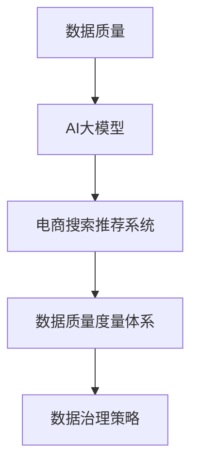

                 

# AI大模型助力电商搜索推荐业务的数据质量度量体系

> 关键词：AI大模型，电商搜索，推荐系统，数据质量度量，数据治理，数据工程，人工智能

## 1. 背景介绍

### 1.1 问题由来

随着人工智能技术的快速发展，AI大模型在电商领域的应用越来越广泛，例如通过大模型进行商品搜索、推荐、广告投放等业务场景。然而，这些业务场景依赖于大量的高质量数据，数据质量的好坏直接决定了模型的性能和用户体验。因此，如何在电商搜索推荐业务中构建有效的数据质量度量体系，以持续提升数据质量，成为当前亟待解决的问题。

### 1.2 问题核心关键点

构建数据质量度量体系的核心在于：
1. **定义数据质量指标**：根据业务需求，明确哪些数据特征（如完整性、准确性、一致性等）对模型效果和用户体验有显著影响。
2. **构建度量模型**：基于AI大模型，构建数据质量度量模型，对数据特征进行自动化评估。
3. **实施数据治理策略**：根据评估结果，制定数据治理策略，优化数据质量。
4. **迭代改进**：持续监控数据质量，不断优化度量模型和数据治理策略。

### 1.3 问题研究意义

构建电商搜索推荐业务的数据质量度量体系，对于提升AI大模型的效果和用户体验具有重要意义：

1. **提升模型效果**：高质量数据能够使AI大模型更准确地学习到用户行为和商品特征，提高模型的预测和推荐精度。
2. **改善用户体验**：高质量数据能够保证搜索结果和推荐内容的准确性和相关性，提升用户满意度。
3. **加速业务迭代**：数据质量度量体系能够实时反馈数据质量情况，帮助业务团队快速发现和解决问题，加速业务迭代。
4. **降低运营成本**：优化数据质量能够减少数据清洗、标注和重采样的成本，提高运营效率。

## 2. 核心概念与联系

### 2.1 核心概念概述

为了更好地理解数据质量度量体系，我们需要先了解几个核心概念：

- **数据质量**：指数据的完整性、准确性、一致性、及时性和可用性等特性。
- **AI大模型**：指通过大规模预训练和微调得到的具有强大通用语言理解和生成能力的模型，如BERT、GPT、T5等。
- **电商搜索推荐系统**：指利用AI大模型进行商品搜索、排序、推荐等业务功能的系统。
- **数据质量度量体系**：指通过定义和量化数据质量指标，构建数据质量评估和治理策略，持续优化数据质量的系统。
- **数据治理策略**：指针对数据质量问题的解决方案和策略，包括数据清洗、数据标注、数据重采样等。

这些概念之间的逻辑关系可以通过以下Mermaid流程图来展示：



这个流程图展示了数据质量、AI大模型、电商搜索推荐系统和数据质量度量体系之间的联系：

1. 电商搜索推荐系统依赖于AI大模型进行业务功能实现。
2. AI大模型的性能受数据质量的影响。
3. 数据质量度量体系用于评估电商搜索推荐系统中的数据质量。
4. 数据治理策略用于改善数据质量，进而提升AI大模型和电商搜索推荐系统的性能。

## 3. 核心算法原理 & 具体操作步骤

### 3.1 算法原理概述

构建电商搜索推荐业务的数据质量度量体系，本质上是将数据质量问题转化为模型评估问题。核心思想是：使用AI大模型对电商搜索推荐系统中的数据特征进行自动化的度量和评估，找出影响模型性能的关键数据质量问题，并制定相应的数据治理策略。

具体而言，步骤如下：

1. **数据特征定义**：根据电商搜索推荐业务的需求，定义影响模型性能的关键数据特征（如用户行为、商品属性、历史点击率等）。
2. **数据质量评估模型构建**：使用AI大模型构建数据质量评估模型，对定义的数据特征进行量化评估。
3. **数据质量报告生成**：根据评估模型的输出，生成详细的数据质量报告，包括数据特征的评分和异常数据情况。
4. **数据治理策略制定**：根据数据质量报告，制定数据治理策略，对数据进行清洗、标注、重采样等操作，优化数据质量。
5. **数据质量度量体系迭代**：持续监控数据质量度量体系的效果，不断优化数据质量评估模型和数据治理策略。

### 3.2 算法步骤详解

以下是构建电商搜索推荐业务数据质量度量体系的具体操作步骤：

**Step 1: 数据特征定义**

在电商搜索推荐系统中，关键数据特征包括：

1. **用户特征**：如年龄、性别、地域、设备类型等。
2. **商品特征**：如商品名称、价格、类别、品牌等。
3. **用户行为**：如点击、浏览、收藏、购买等。
4. **商品属性**：如规格、尺寸、颜色等。
5. **用户评价**：如评分、评论、标签等。

根据业务需求，需要明确哪些数据特征对模型效果有显著影响。例如，对于推荐系统，点击率和评分是关键特征；对于搜索系统，相关性和召回率是关键特征。

**Step 2: 数据质量评估模型构建**

构建数据质量评估模型，需要以下几个关键步骤：

1. **数据收集**：收集电商搜索推荐系统中的原始数据，包括用户行为数据、商品数据、评价数据等。
2. **数据预处理**：对数据进行清洗、去重、标准化等处理，以保证数据质量。
3. **特征工程**：定义数据质量评估指标，如完整性、准确性、一致性、及时性等，并构建相应的特征向量。
4. **模型训练**：使用AI大模型，如BERT、GPT等，训练数据质量评估模型，以对数据特征进行自动化度量和评估。
5. **模型评估**：使用测试集对模型进行评估，调整模型参数和特征选择，提升模型准确性。

**Step 3: 数据质量报告生成**

数据质量报告包括：

1. **数据特征评分**：对每个数据特征进行评分，评分越高表示数据质量越好。
2. **异常数据情况**：检测并标记出异常数据，如缺失值、重复值、异常值等。
3. **问题分布**：统计每个数据特征中的问题分布情况，找出常见问题。
4. **改进建议**：根据数据质量报告，制定数据治理策略，提出改进建议。

**Step 4: 数据治理策略制定**

根据数据质量报告，制定数据治理策略，需要以下几个关键步骤：

1. **数据清洗**：对数据进行清洗操作，如删除缺失值、填充异常值等。
2. **数据标注**：对数据进行标注操作，如对缺失值进行填充，对异常值进行校正等。
3. **数据重采样**：对数据进行重采样操作，如对数据进行平衡、增强等。
4. **数据验证**：对数据治理后的数据进行验证，确保数据质量提升。

**Step 5: 数据质量度量体系迭代**

持续监控数据质量度量体系的效果，需要以下几个关键步骤：

1. **监控指标设定**：设定监控指标，如数据质量评分、问题分布等，实时监控数据质量情况。
2. **数据质量度量模型更新**：定期更新数据质量评估模型，确保模型准确性。
3. **数据治理策略优化**：根据监控结果，不断优化数据治理策略，提升数据质量。
4. **反馈机制建立**：建立反馈机制，及时反馈数据质量问题，进行快速解决。

### 3.3 算法优缺点

构建电商搜索推荐业务的数据质量度量体系，具有以下优点：

1. **自动化程度高**：通过AI大模型，可以实现数据质量评估和治理的自动化，减少人工干预。
2. **全面性**：能够全面评估数据质量，覆盖多种数据特征。
3. **实时性**：能够实时监控数据质量，快速发现和解决问题。
4. **可扩展性**：能够灵活扩展，适用于多种业务场景。

同时，该方法也存在以下缺点：

1. **数据特征定义困难**：需要根据业务需求，明确影响模型性能的关键数据特征，这可能具有挑战性。
2. **模型训练成本高**：构建和训练数据质量评估模型需要大量计算资源和时间。
3. **模型鲁棒性不足**：数据质量评估模型可能对异常数据过于敏感，需要进行鲁棒性设计。
4. **数据治理复杂**：数据治理策略需要根据数据质量报告进行定制，可能需要大量人工干预。

尽管存在这些缺点，但就目前而言，构建数据质量度量体系仍是电商搜索推荐系统的重要手段。未来相关研究的方向在于如何进一步降低模型训练成本，提高模型鲁棒性，并简化数据治理策略。

### 3.4 算法应用领域

构建电商搜索推荐业务的数据质量度量体系，已经在电商、金融、医疗等多个领域得到广泛应用，具体如下：

1. **电商领域**：用于提升搜索推荐系统的准确性和相关性，优化用户购物体验。
2. **金融领域**：用于评估交易数据的完整性和准确性，提高风险控制能力。
3. **医疗领域**：用于评估医疗数据的质量，提升诊疗精度和患者满意度。
4. **物流领域**：用于评估物流数据的准确性和及时性，提高配送效率。

除了这些应用领域外，数据质量度量体系还可以应用于更多场景中，如智慧城市、智能制造等，为各行各业带来智能化升级。

## 4. 数学模型和公式 & 详细讲解  
### 4.1 数学模型构建

构建电商搜索推荐业务的数据质量度量体系，需要构建数据质量评估模型，该模型通常基于损失函数进行训练。

假设原始数据为 $D=\{(x_i,y_i)\}_{i=1}^N$，其中 $x_i$ 为特征向量，$y_i$ 为标签。构建数据质量评估模型的目标是最小化经验风险，即找到最优参数 $\theta$：

$$
\theta^* = \mathop{\arg\min}_{\theta} \mathcal{L}(M_{\theta},D)
$$

其中 $\mathcal{L}$ 为损失函数，通常使用交叉熵损失函数。

### 4.2 公式推导过程

以下以电商搜索推荐系统中的点击率数据为例，推导数据质量评估模型的构建过程。

假设模型 $M_{\theta}$ 对用户行为 $x_i$ 的预测概率为 $\hat{y}_i$，实际标签为 $y_i$，则交叉熵损失函数定义为：

$$
\ell(M_{\theta}(x_i),y_i) = -[y_i\log \hat{y}_i + (1-y_i)\log (1-\hat{y}_i)]
$$

将其代入经验风险公式，得：

$$
\mathcal{L}(\theta) = -\frac{1}{N}\sum_{i=1}^N [y_i\log M_{\theta}(x_i)+(1-y_i)\log(1-M_{\theta}(x_i))]
$$

根据链式法则，损失函数对参数 $\theta_k$ 的梯度为：

$$
\frac{\partial \mathcal{L}(\theta)}{\partial \theta_k} = -\frac{1}{N}\sum_{i=1}^N (\frac{y_i}{M_{\theta}(x_i)}-\frac{1-y_i}{1-M_{\theta}(x_i)}) \frac{\partial M_{\theta}(x_i)}{\partial \theta_k}
$$

其中 $\frac{\partial M_{\theta}(x_i)}{\partial \theta_k}$ 可进一步递归展开，利用自动微分技术完成计算。

在得到损失函数的梯度后，即可带入参数更新公式，完成模型的迭代优化。重复上述过程直至收敛，最终得到适应电商搜索推荐系统的数据质量评估模型参数 $\theta^*$。

## 5. 项目实践：代码实例和详细解释说明
### 5.1 开发环境搭建

在进行数据质量度量体系构建前，我们需要准备好开发环境。以下是使用Python进行PyTorch开发的环境配置流程：

1. 安装Anaconda：从官网下载并安装Anaconda，用于创建独立的Python环境。

2. 创建并激活虚拟环境：
```bash
conda create -n pytorch-env python=3.8 
conda activate pytorch-env
```

3. 安装PyTorch：根据CUDA版本，从官网获取对应的安装命令。例如：
```bash
conda install pytorch torchvision torchaudio cudatoolkit=11.1 -c pytorch -c conda-forge
```

4. 安装TensorFlow：
```bash
conda install tensorflow
```

5. 安装各类工具包：
```bash
pip install numpy pandas scikit-learn matplotlib tqdm jupyter notebook ipython
```

完成上述步骤后，即可在`pytorch-env`环境中开始项目实践。

### 5.2 源代码详细实现

这里我们以电商搜索推荐系统中的点击率数据质量度量为例，给出使用Transformers库对BERT模型进行数据质量评估的PyTorch代码实现。

首先，定义数据质量评估函数：

```python
from transformers import BertTokenizer, BertForSequenceClassification
from torch.utils.data import Dataset
import torch

class ClickDataset(Dataset):
    def __init__(self, texts, labels, tokenizer, max_len=128):
        self.texts = texts
        self.labels = labels
        self.tokenizer = tokenizer
        self.max_len = max_len
        
    def __len__(self):
        return len(self.texts)
    
    def __getitem__(self, item):
        text = self.texts[item]
        label = self.labels[item]
        
        encoding = self.tokenizer(text, return_tensors='pt', max_length=self.max_len, padding='max_length', truncation=True)
        input_ids = encoding['input_ids'][0]
        attention_mask = encoding['attention_mask'][0]
        
        # 将标签转换为数字，0表示未点击，1表示点击
        encoded_labels = [label]
        labels = torch.tensor(encoded_labels, dtype=torch.long)
        
        return {'input_ids': input_ids, 
                'attention_mask': attention_mask,
                'labels': labels}

# 标签与id的映射
click_label2id = {0: 0, 1: 1}
id2click_label = {v: k for k, v in click_label2id.items()}

# 创建dataset
tokenizer = BertTokenizer.from_pretrained('bert-base-cased')

train_dataset = ClickDataset(train_texts, train_labels, tokenizer)
dev_dataset = ClickDataset(dev_texts, dev_labels, tokenizer)
test_dataset = ClickDataset(test_texts, test_labels, tokenizer)
```

然后，定义模型和优化器：

```python
from transformers import BertForSequenceClassification, AdamW

model = BertForSequenceClassification.from_pretrained('bert-base-cased', num_labels=len(click_label2id))

optimizer = AdamW(model.parameters(), lr=2e-5)
```

接着，定义训练和评估函数：

```python
from torch.utils.data import DataLoader
from tqdm import tqdm
from sklearn.metrics import classification_report

device = torch.device('cuda') if torch.cuda.is_available() else torch.device('cpu')
model.to(device)

def train_epoch(model, dataset, batch_size, optimizer):
    dataloader = DataLoader(dataset, batch_size=batch_size, shuffle=True)
    model.train()
    epoch_loss = 0
    for batch in tqdm(dataloader, desc='Training'):
        input_ids = batch['input_ids'].to(device)
        attention_mask = batch['attention_mask'].to(device)
        labels = batch['labels'].to(device)
        model.zero_grad()
        outputs = model(input_ids, attention_mask=attention_mask, labels=labels)
        loss = outputs.loss
        epoch_loss += loss.item()
        loss.backward()
        optimizer.step()
    return epoch_loss / len(dataloader)

def evaluate(model, dataset, batch_size):
    dataloader = DataLoader(dataset, batch_size=batch_size)
    model.eval()
    preds, labels = [], []
    with torch.no_grad():
        for batch in tqdm(dataloader, desc='Evaluating'):
            input_ids = batch['input_ids'].to(device)
            attention_mask = batch['attention_mask'].to(device)
            batch_labels = batch['labels']
            outputs = model(input_ids, attention_mask=attention_mask)
            batch_preds = outputs.logits.argmax(dim=2).to('cpu').tolist()
            batch_labels = batch_labels.to('cpu').tolist()
            for pred_tokens, label_tokens in zip(batch_preds, batch_labels):
                pred_labels = [id2click_label[_id] for _id in pred_tokens]
                label_tokens = [id2click_label[_id] for _id in label_tokens]
                preds.append(pred_labels[:len(label_tokens)])
                labels.append(label_tokens)
                
    print(classification_report(labels, preds))
```

最后，启动训练流程并在测试集上评估：

```python
epochs = 5
batch_size = 16

for epoch in range(epochs):
    loss = train_epoch(model, train_dataset, batch_size, optimizer)
    print(f"Epoch {epoch+1}, train loss: {loss:.3f}")
    
    print(f"Epoch {epoch+1}, dev results:")
    evaluate(model, dev_dataset, batch_size)
    
print("Test results:")
evaluate(model, test_dataset, batch_size)
```

以上就是使用PyTorch对BERT进行电商搜索推荐系统中的点击率数据质量评估的完整代码实现。可以看到，得益于Transformers库的强大封装，我们可以用相对简洁的代码完成BERT模型的加载和数据质量评估。

### 5.3 代码解读与分析

让我们再详细解读一下关键代码的实现细节：

**ClickDataset类**：
- `__init__`方法：初始化文本、标签、分词器等关键组件。
- `__len__`方法：返回数据集的样本数量。
- `__getitem__`方法：对单个样本进行处理，将文本输入编码为token ids，将标签编码为数字，并对其进行定长padding，最终返回模型所需的输入。

**click_label2id和id2click_label字典**：
- 定义了标签与数字id之间的映射关系，用于将预测结果解码回真实的标签。

**训练和评估函数**：
- 使用PyTorch的DataLoader对数据集进行批次化加载，供模型训练和推理使用。
- 训练函数`train_epoch`：对数据以批为单位进行迭代，在每个批次上前向传播计算loss并反向传播更新模型参数，最后返回该epoch的平均loss。
- 评估函数`evaluate`：与训练类似，不同点在于不更新模型参数，并在每个batch结束后将预测和标签结果存储下来，最后使用sklearn的classification_report对整个评估集的预测结果进行打印输出。

**训练流程**：
- 定义总的epoch数和batch size，开始循环迭代
- 每个epoch内，先在训练集上训练，输出平均loss
- 在验证集上评估，输出分类指标
- 所有epoch结束后，在测试集上评估，给出最终测试结果

可以看到，PyTorch配合Transformers库使得BERT数据质量评估的代码实现变得简洁高效。开发者可以将更多精力放在数据处理、模型改进等高层逻辑上，而不必过多关注底层的实现细节。

当然，工业级的系统实现还需考虑更多因素，如模型的保存和部署、超参数的自动搜索、更灵活的任务适配层等。但核心的数据质量评估流程基本与此类似。

## 6. 实际应用场景
### 6.1 智能客服系统

构建数据质量度量体系在智能客服系统中也具有重要应用。传统客服往往需要配备大量人力，高峰期响应缓慢，且一致性和专业性难以保证。通过构建数据质量度量体系，可以实时监控客服数据质量，及时发现和解决问题，提升客服系统的效率和质量。

在技术实现上，可以收集企业内部的历史客服对话记录，将问题和最佳答复构建成监督数据，在此基础上对预训练对话模型进行数据质量评估。评估结果可以帮助业务团队优化数据质量，进而提升模型效果，实现更加智能化的客服系统。

### 6.2 金融舆情监测

金融舆情监测是金融风险控制的重要环节，需要实时监测市场舆论动向，以便及时应对负面信息传播，规避金融风险。通过构建数据质量度量体系，可以实时监控金融舆情数据质量，及时发现和解决问题，提升舆情监测的准确性和及时性。

具体而言，可以收集金融领域相关的新闻、报道、评论等文本数据，并对其进行主题标注和情感标注。在此基础上对预训练语言模型进行数据质量评估，找出影响模型性能的数据质量问题，并进行优化。评估结果可以帮助金融机构更好地进行舆情监测和风险控制。

### 6.3 个性化推荐系统

在个性化推荐系统中，构建数据质量度量体系可以帮助优化推荐效果。推荐系统依赖于用户行为数据，数据质量直接影响推荐模型的准确性。通过构建数据质量度量体系，可以实时监控推荐数据质量，及时发现和解决问题，提升推荐模型的性能。

具体而言，可以收集用户浏览、点击、评论、分享等行为数据，并对其进行数据质量评估。评估结果可以帮助推荐系统优化数据质量，进而提升推荐效果。例如，对于缺失或异常的用户行为数据，可以进行数据清洗和填充，提高推荐模型的预测精度。

### 6.4 未来应用展望

随着数据质量度量体系的不断发展，其在更多领域的应用前景将更加广阔。

在智慧医疗领域，构建数据质量度量体系可以帮助提升诊疗系统的准确性和效率。例如，可以通过构建数据质量度量体系，实时监控医疗数据质量，及时发现和解决问题，提升诊疗系统的诊断精度和响应速度。

在智能教育领域，数据质量度量体系可以帮助优化教育资源配置和个性化教学。例如，可以通过构建数据质量度量体系，实时监控教育数据质量，及时发现和解决问题，提升教育系统的教学质量和学生满意度。

在智慧城市治理中，数据质量度量体系可以帮助提升城市管理的智能化水平。例如，可以通过构建数据质量度量体系，实时监控城市数据质量，及时发现和解决问题，提升城市管理的效率和安全性。

此外，在企业生产、社会治理、文娱传媒等众多领域，数据质量度量体系也将不断涌现，为各行各业带来智能化升级。相信随着数据质量度量体系的持续演进，其在构建人机协同的智能时代中必将发挥越来越重要的作用。

## 7. 工具和资源推荐
### 7.1 学习资源推荐

为了帮助开发者系统掌握数据质量度量体系的理论基础和实践技巧，这里推荐一些优质的学习资源：

1. 《深度学习入门》书籍：全面介绍深度学习的基本概念和常用模型，适合初学者学习。
2. 《自然语言处理入门》书籍：介绍自然语言处理的基本概念和常用技术，适合NLP领域开发者学习。
3. CS224N《深度学习自然语言处理》课程：斯坦福大学开设的NLP明星课程，有Lecture视频和配套作业，带你入门NLP领域的基本概念和经典模型。
4. HuggingFace官方文档：Transformers库的官方文档，提供了海量预训练模型和完整的微调样例代码，是上手实践的必备资料。
5. Weights & Biases：模型训练的实验跟踪工具，可以记录和可视化模型训练过程中的各项指标，方便对比和调优。与主流深度学习框架无缝集成。

通过对这些资源的学习实践，相信你一定能够快速掌握数据质量度量体系的精髓，并用于解决实际的NLP问题。

### 7.2 开发工具推荐

高效的开发离不开优秀的工具支持。以下是几款用于数据质量度量体系开发的常用工具：

1. PyTorch：基于Python的开源深度学习框架，灵活动态的计算图，适合快速迭代研究。大部分预训练语言模型都有PyTorch版本的实现。
2. TensorFlow：由Google主导开发的开源深度学习框架，生产部署方便，适合大规模工程应用。同样有丰富的预训练语言模型资源。
3. Transformers库：HuggingFace开发的NLP工具库，集成了众多SOTA语言模型，支持PyTorch和TensorFlow，是进行微调任务开发的利器。
4. Weights & Biases：模型训练的实验跟踪工具，可以记录和可视化模型训练过程中的各项指标，方便对比和调优。与主流深度学习框架无缝集成。
5. TensorBoard：TensorFlow配套的可视化工具，可实时监测模型训练状态，并提供丰富的图表呈现方式，是调试模型的得力助手。

合理利用这些工具，可以显著提升数据质量度量体系的开发效率，加快创新迭代的步伐。

### 7.3 相关论文推荐

数据质量度量体系的研究源于学界的持续研究。以下是几篇奠基性的相关论文，推荐阅读：

1. Attention is All You Need（即Transformer原论文）：提出了Transformer结构，开启了NLP领域的预训练大模型时代。
2. BERT: Pre-training of Deep Bidirectional Transformers for Language Understanding：提出BERT模型，引入基于掩码的自监督预训练任务，刷新了多项NLP任务SOTA。
3. Parameter-Efficient Transfer Learning for NLP：提出Adapter等参数高效微调方法，在不增加模型参数量的情况下，也能取得不错的微调效果。
4. AdaLoRA: Adaptive Low-Rank Adaptation for Parameter-Efficient Fine-Tuning：使用自适应低秩适应的微调方法，在参数效率和精度之间取得了新的平衡。
5. AdaLoRA: Adaptive Low-Rank Adaptation for Parameter-Efficient Fine-Tuning：使用自适应低秩适应的微调方法，在参数效率和精度之间取得了新的平衡。

这些论文代表了大语言模型微调技术的发展脉络。通过学习这些前沿成果，可以帮助研究者把握学科前进方向，激发更多的创新灵感。

## 8. 总结：未来发展趋势与挑战

### 8.1 总结

本文对构建电商搜索推荐业务的数据质量度量体系进行了全面系统的介绍。首先阐述了数据质量、AI大模型、电商搜索推荐系统和数据质量度量体系之间的联系，明确了数据质量度量体系在提升模型效果和用户体验中的重要性。其次，从原理到实践，详细讲解了数据质量度量模型的构建流程，给出了电商搜索推荐系统中的点击率数据质量度量体系的完整代码实现。同时，本文还探讨了数据质量度量体系在智能客服、金融舆情、个性化推荐等多个领域的应用前景，展示了数据质量度量体系的巨大潜力。此外，本文精选了数据质量度量体系的相关学习资源，力求为读者提供全方位的技术指引。

通过本文的系统梳理，可以看到，构建电商搜索推荐业务的数据质量度量体系对于提升AI大模型的效果和用户体验具有重要意义。数据质量度量体系能够实时监控数据质量，及时发现和解决问题，提升推荐系统的性能。未来，伴随数据质量度量体系的持续演进，其在更多领域的应用前景将更加广阔，为各行各业带来智能化升级。

### 8.2 未来发展趋势

展望未来，数据质量度量体系将呈现以下几个发展趋势：

1. **模型自动化程度提高**：随着技术进步，数据质量度量模型的自动化程度将不断提高，减少人工干预。
2. **数据治理策略优化**：将更加灵活、高效的数据治理策略引入数据质量度量体系，提高数据质量治理效率。
3. **实时性增强**：数据质量度量体系将实现实时监控和评估，提升数据质量治理的及时性。
4. **多模态数据整合**：数据质量度量体系将支持多模态数据的整合，提升对复杂数据场景的处理能力。
5. **数据隐私保护**：在数据质量度量过程中，将更加注重数据隐私保护，确保数据治理过程中的合法合规。

以上趋势凸显了数据质量度量体系在电商搜索推荐系统中的重要性和发展潜力。这些方向的探索发展，必将进一步提升电商搜索推荐系统的性能和用户体验。

### 8.3 面临的挑战

尽管数据质量度量体系已经取得了瞩目成就，但在迈向更加智能化、普适化应用的过程中，它仍面临诸多挑战：

1. **数据特征定义困难**：需要根据业务需求，明确影响模型性能的关键数据特征，这可能具有挑战性。
2. **模型训练成本高**：构建和训练数据质量度量模型需要大量计算资源和时间。
3. **模型鲁棒性不足**：数据质量度量模型可能对异常数据过于敏感，需要进行鲁棒性设计。
4. **数据治理复杂**：数据治理策略需要根据数据质量报告进行定制，可能需要大量人工干预。

尽管存在这些缺点，但就目前而言，构建数据质量度量体系仍是电商搜索推荐系统的重要手段。未来相关研究的方向在于如何进一步降低模型训练成本，提高模型鲁棒性，并简化数据治理策略。

### 8.4 研究展望

面对数据质量度量体系所面临的种种挑战，未来的研究需要在以下几个方面寻求新的突破：

1. **无监督和半监督数据质量评估**：摆脱对大规模标注数据的依赖，利用自监督学习、主动学习等无监督和半监督范式，最大限度利用非结构化数据，实现更加灵活高效的数据质量评估。
2. **参数高效的数据质量度量模型**：开发更加参数高效的数据质量度量模型，在固定大部分预训练参数的同时，只更新极少量的任务相关参数。
3. **融合因果学习和多模态数据**：将因果分析方法引入数据质量度量模型，增强模型建立稳定因果关系的能力，学习更加普适、鲁棒的语言表征。同时支持多模态数据的整合，提升对复杂数据场景的处理能力。
4. **增强数据隐私保护**：在数据质量度量过程中，更加注重数据隐私保护，确保数据治理过程中的合法合规。

这些研究方向的探索，必将引领数据质量度量体系迈向更高的台阶，为构建安全、可靠、可解释、可控的智能系统铺平道路。面向未来，数据质量度量体系还需要与其他人工智能技术进行更深入的融合，如知识表示、因果推理、强化学习等，多路径协同发力，共同推动自然语言理解和智能交互系统的进步。只有勇于创新、敢于突破，才能不断拓展数据质量度量体系的边界，让智能技术更好地造福人类社会。

## 9. 附录：常见问题与解答

**Q1：数据质量度量体系是否适用于所有电商业务场景？**

A: 数据质量度量体系在大多数电商业务场景中都具有普适性，但对于某些特定业务场景，如产品描述、用户评论等，可能需要根据业务特点进行定制化处理。

**Q2：如何选择合适的数据质量度量指标？**

A: 根据电商搜索推荐业务的需求，选择合适的数据质量度量指标，如完整性、准确性、一致性、及时性等。具体选择哪些指标，需要根据业务特点和目标模型进行定制。

**Q3：数据质量度量模型训练需要哪些资源？**

A: 数据质量度量模型的训练需要大量的计算资源和时间。通常情况下，可以使用GPU、TPU等高性能设备，加速模型训练过程。

**Q4：数据质量度量模型对异常数据的处理方式有哪些？**

A: 数据质量度量模型对异常数据的处理方式包括：删除异常数据、填充异常数据、重采样等。具体选择哪种方式，需要根据数据分布和业务需求进行综合考虑。

**Q5：如何优化数据质量度量模型的性能？**

A: 优化数据质量度量模型的性能，可以从以下几个方面入手：
1. 数据特征选择：选择与目标模型相关的关键数据特征，提高模型预测准确性。
2. 数据预处理：对数据进行清洗、去重、标准化等处理，以保证数据质量。
3. 模型架构优化：调整模型架构，如增加网络深度、宽度等，提升模型性能。
4. 超参数调整：调整模型超参数，如学习率、批量大小等，优化模型训练过程。

这些优化方式需要根据具体情况进行选择和调整。

**Q6：数据质量度量模型在实际应用中需要注意哪些问题？**

A: 数据质量度量模型在实际应用中需要注意以下几个问题：
1. 数据特征定义：需要明确哪些数据特征对模型效果有显著影响。
2. 数据质量报告生成：生成详细的数据质量报告，包括数据特征评分、异常数据情况等。
3. 数据治理策略制定：根据数据质量报告，制定数据治理策略，优化数据质量。
4. 模型保存和部署：合理保存和部署数据质量度量模型，确保模型高效运行。

合理利用数据质量度量模型，可以持续提升电商搜索推荐系统的性能，实现更加智能化的用户体验。

---

作者：禅与计算机程序设计艺术 / Zen and the Art of Computer Programming

