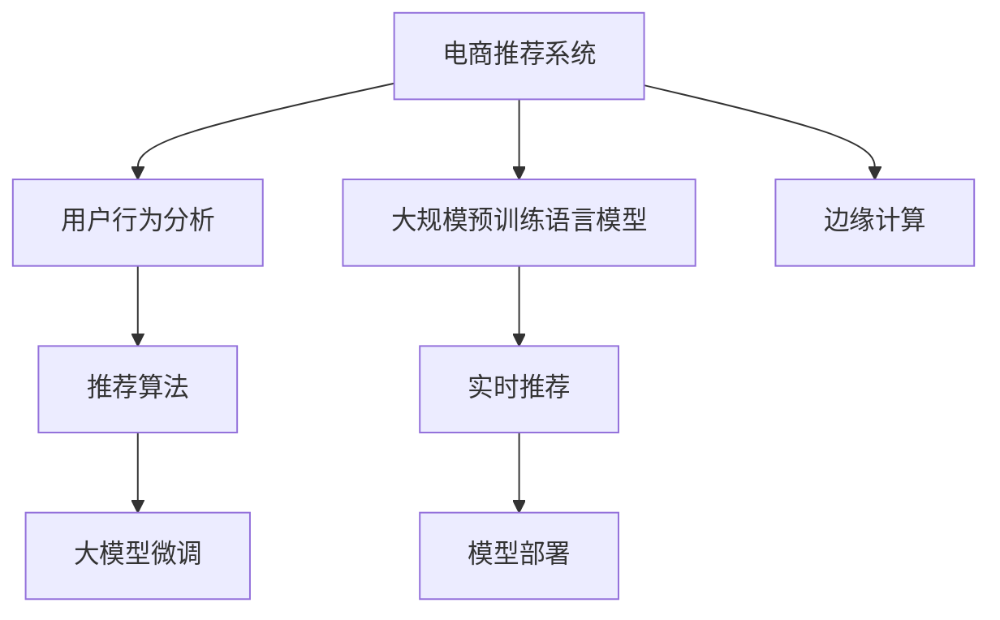

                 

# AI大模型在电商实时个性化推荐中的边缘计算应用

> 关键词：电商推荐系统, 大模型, 边缘计算, 实时推荐, 用户行为分析

## 1. 背景介绍

### 1.1 问题由来

随着互联网零售业务的迅猛发展，电商平台面临愈发复杂的运营挑战。个性化推荐作为电商业务的重要组成部分，能有效提升用户购物体验和平台转化率。目前，主流推荐系统主要基于协同过滤、基于内容的推荐、基于矩阵分解等算法构建。但这些方法往往难以应对海量数据和高维稀疏性的问题，导致推荐效果难以满足实际需求。

近年来，大规模预训练语言模型在NLP领域取得了突破性进展，成为构建推荐系统的有力工具。基于语言模型的推荐方法，能够挖掘用户的历史行为和语义信息，提升推荐的相关性和多样性。以BERT、GPT、XLNet等为代表的大模型，通过在文本语料上进行自监督预训练，具备强大的语言表示能力，能够进一步提升个性化推荐的精度。

然而，电商推荐系统需要实时响应，且对推荐准确度和延迟要求极高。现有的大模型推荐系统，往往依赖云服务进行计算，存在响应延迟大、计算成本高的问题，难以满足实际应用需求。为了实现高性能、低延迟的推荐服务，边缘计算技术应运而生。

### 1.2 问题核心关键点

边缘计算是近年来新兴的技术范式，指在网络边缘设备上直接处理和存储数据，以减少数据传输和云服务器负担，加速应用响应。将大模型推荐系统部署于边缘节点，利用其低延迟和高效计算能力，能够显著提升推荐系统的性能，满足电商实时推荐的需求。

具体而言，边缘计算在电商推荐系统中的核心关键点包括：

- 如何有效部署和调优大模型，利用边缘计算的计算能力和存储能力，提升推荐精度和响应速度。
- 如何在边缘计算中实现高效的推荐算法和用户行为分析，保持模型的实时性。
- 如何优化数据流动和系统架构，保障数据隐私和安全性，避免数据泄露风险。

本文将深入探索这些核心问题，介绍AI大模型在电商实时个性化推荐中的应用，探讨边缘计算技术的潜力与挑战。

## 2. 核心概念与联系

### 2.1 核心概念概述

为更好地理解大模型在电商实时推荐中的边缘计算应用，本节将介绍几个密切相关的核心概念：

- **电商推荐系统**：基于用户历史行为数据和产品特征信息，为用户推荐符合其兴趣的商品。常见的推荐方法包括协同过滤、内容推荐、矩阵分解等。
- **大规模预训练语言模型**：如BERT、GPT等，通过在大规模文本语料上进行自监督预训练，获得强大的语言表示能力。能够挖掘用户语义信息，提升推荐的相关性和多样性。
- **边缘计算**：指在网络边缘设备上直接处理和存储数据，以减少数据传输和云服务器负担，加速应用响应。
- **实时推荐系统**：指能够快速响应用户操作，提供个性化商品推荐的系统，对计算效率和延迟要求极高。
- **用户行为分析**：指通过分析用户浏览、点击、购买等行为数据，挖掘用户兴趣和偏好，供推荐系统使用。

这些核心概念之间的逻辑关系可以通过以下Mermaid流程图来展示：



这个流程图展示了大模型在电商推荐系统中的核心概念及其之间的关系：

1. 电商推荐系统基于用户行为数据，利用大模型进行推荐算法优化。
2. 大规模预训练语言模型用于提取用户语义信息，增强推荐效果。
3. 边缘计算技术用于部署和优化大模型，提升实时推荐性能。
4. 实时推荐系统通过高效计算和快速响应，满足电商业务对推荐延迟的高要求。

这些概念共同构成了电商推荐系统的工作框架，使其能够高效、准确地为用户推荐商品。

## 3. 核心算法原理 & 具体操作步骤

### 3.1 算法原理概述

电商推荐系统中的实时推荐，可以通过在大模型基础上进行微调，构建高效推荐算法。具体流程包括：

1. **数据预处理**：收集用户的历史行为数据，构建特征向量。
2. **大模型微调**：在电商推荐任务上对大模型进行微调，学习用户和商品的语义关系。
3. **实时推荐**：将新的用户行为数据输入微调后的大模型，计算推荐结果。

大模型推荐系统在大规模预训练的基础上，能够迅速适应电商推荐任务的特征，提升推荐精度。同时，通过边缘计算技术，可以在本地设备上高效计算和存储数据，避免云服务器的延迟和成本，满足电商实时推荐的需求。

### 3.2 算法步骤详解

#### 步骤1: 数据预处理

电商推荐系统需要对用户的历史行为数据进行预处理，构建特征向量。具体步骤包括：

1. **数据收集**：收集用户的历史浏览记录、点击记录、购买记录等行为数据。
2. **特征提取**：提取用户的兴趣特征和商品的属性特征，如标签、价格、评分等。
3. **归一化处理**：对特征向量进行归一化处理，避免因不同特征尺度不一导致的计算偏差。

#### 步骤2: 大模型微调

电商推荐系统中的推荐算法，可以通过在大模型基础上进行微调来构建。具体步骤包括：

1. **模型选择**：选择适合电商推荐任务的大模型，如BERT、GPT等。
2. **微调目标**：根据电商推荐任务的特点，设计合适的微调目标。例如，对于生成式任务，可以使用负对数似然损失函数。
3. **微调策略**：选择适当的微调策略，如固定底层参数，仅微调顶层；设置合适的学习率、批大小等超参数。

#### 步骤3: 实时推荐

电商推荐系统需要实时响应用户操作，提供推荐结果。具体步骤包括：

1. **数据输入**：将新的用户行为数据输入微调后的大模型。
2. **计算推荐**：通过模型输出推荐结果，如商品ID、评分等。
3. **结果展示**：将推荐结果展示给用户，如通过推荐系统界面显示推荐商品。

#### 步骤4: 优化与部署

电商推荐系统中的推荐算法，需要通过优化与部署，提升性能。具体步骤包括：

1. **优化算法**：对推荐算法进行优化，如引入对抗训练、正则化等技术，提升模型的鲁棒性和泛化能力。
2. **模型压缩**：对微调后的大模型进行压缩和剪枝，减少内存占用和计算开销。
3. **边缘计算部署**：将优化后的模型部署到边缘节点，如服务器、终端设备等，以实现本地计算和存储。

### 3.3 算法优缺点

#### 优点

1. **高效推荐**：大模型通过预训练，能够高效地适应电商推荐任务，提升推荐精度。
2. **实时响应**：边缘计算技术能够显著降低数据传输延迟，加速推荐系统响应速度。
3. **自适应性强**：大模型具备强大的自适应能力，能够实时更新推荐模型，适应用户兴趣变化。
4. **应用场景广**：电商推荐系统中的实时推荐，能够广泛应用在商品推荐、搜索、个性化定制等领域。

#### 缺点

1. **计算资源消耗大**：大模型的计算资源消耗较大，需要较高的硬件设备支持。
2. **隐私风险**：边缘计算设备存在隐私泄露风险，需要严格的数据保护措施。
3. **部署复杂**：边缘计算环境的多样性，增加了模型部署和维护的复杂度。
4. **数据质量要求高**：电商推荐系统对数据质量要求较高，数据缺失、噪声等问题影响推荐效果。

尽管存在这些局限性，但就目前而言，基于大模型的电商推荐系统依然是大数据时代的重要应用范式，具有广泛的应用前景。

### 3.4 算法应用领域

大模型在电商实时推荐中的应用领域极为广泛，具体包括：

1. **商品推荐**：根据用户的历史浏览和购买记录，推荐相关商品。
2. **搜索排序**：对用户搜索关键词进行语义分析，提供精准的商品排序。
3. **个性化定制**：根据用户行为数据，提供个性化定制商品和推荐内容。
4. **广告投放**：基于用户行为数据，优化广告投放策略，提升广告转化率。
5. **价格优化**：分析市场趋势和用户偏好，调整商品价格和促销策略。

以上应用领域，展示了大模型在电商推荐系统中的强大潜力，进一步拓展了电商业务的发展空间。

## 4. 数学模型和公式 & 详细讲解 & 举例说明

### 4.1 数学模型构建

电商推荐系统中的实时推荐，可以通过在大模型基础上进行微调，构建高效推荐算法。假设电商推荐任务为$T$，大模型为$M_\theta$，用户行为数据为$D$。推荐算法可以表示为：

$$
y = M_\theta(x)
$$

其中，$x \in D$为输入数据，$y$为推荐结果。推荐模型的损失函数为：

$$
\mathcal{L}(y, \hat{y}) = \ell(y, \hat{y})
$$

其中，$\ell$为推荐任务的损失函数，如均方误差、交叉熵等。

### 4.2 公式推导过程

以基于序列数据的推荐算法为例，假设用户的历史行为数据为$(x_1, x_2, ..., x_n)$，推荐模型为$M_\theta$。推荐算法的计算过程如下：

1. **特征提取**：将用户的历史行为数据输入大模型$M_\theta$，输出用户兴趣向量$u$。
2. **计算相似度**：计算用户兴趣向量$u$与每个商品的特征向量$v_i$的相似度，得到推荐候选集$V$。
3. **排序推荐**：对候选集$V$进行排序，输出推荐结果。

具体推导过程如下：

- **特征提取**：
$$
u = M_\theta(x)
$$

- **相似度计算**：
$$
\text{similarity}(u, v_i) = \text{cos}(u, v_i)
$$

- **排序推荐**：
$$
V = \text{sort}(\{(v_i, \text{similarity}(u, v_i))\}_{i=1}^{|V|})
$$

其中，$\text{cos}(\cdot)$为余弦相似度计算函数，$\text{sort}(\cdot)$为排序函数。

### 4.3 案例分析与讲解

以电商推荐系统中的用户行为分析为例，假设用户的历史行为数据为$(x_1, x_2, ..., x_n)$，其中$x_i = \{b_1, b_2, ..., b_m\}$，$b_j$为行为事件类型，如浏览、点击、购买等。推荐模型为$M_\theta$，其中$\theta$为模型参数。

1. **特征提取**：
   - 对用户行为数据进行向量化，得到特征向量$x_i$。
   - 将特征向量$x_i$输入大模型$M_\theta$，得到用户兴趣向量$u_i$。

2. **计算相似度**：
   - 对每个商品特征向量$v_j$，计算与用户兴趣向量$u_i$的余弦相似度$\text{similarity}(u_i, v_j)$。
   - 选择相似度最高的商品作为推荐结果。

3. **优化推荐模型**：
   - 在电商推荐任务上对大模型$M_\theta$进行微调，优化损失函数$\mathcal{L}(y, \hat{y})$。
   - 根据电商推荐任务的特点，选择适当的优化器（如AdamW、SGD等）和超参数。

具体推导过程如下：

- **特征提取**：
$$
u_i = M_\theta(x_i)
$$

- **相似度计算**：
$$
\text{similarity}(u_i, v_j) = \text{cos}(u_i, v_j)
$$

- **排序推荐**：
$$
V = \text{sort}(\{(v_j, \text{similarity}(u_i, v_j))\}_{j=1}^{|V|})
$$

通过上述推导，可以看出，大模型在电商推荐系统中的实时推荐，具有高效、自适应强的特点，能够实时响应用户操作，提升推荐效果。

## 5. 项目实践：代码实例和详细解释说明

### 5.1 开发环境搭建

在进行电商推荐系统项目实践前，我们需要准备好开发环境。以下是使用Python进行PyTorch开发的环境配置流程：

1. 安装Anaconda：从官网下载并安装Anaconda，用于创建独立的Python环境。

2. 创建并激活虚拟环境：
```bash
conda create -n pytorch-env python=3.8 
conda activate pytorch-env
```

3. 安装PyTorch：根据CUDA版本，从官网获取对应的安装命令。例如：
```bash
conda install pytorch torchvision torchaudio cudatoolkit=11.1 -c pytorch -c conda-forge
```

4. 安装Transformer库：
```bash
pip install transformers
```

5. 安装各类工具包：
```bash
pip install numpy pandas scikit-learn matplotlib tqdm jupyter notebook ipython
```

完成上述步骤后，即可在`pytorch-env`环境中开始项目实践。

### 5.2 源代码详细实现

以下是使用PyTorch实现电商推荐系统的代码实现：

```python
from transformers import BertTokenizer, BertForSequenceClassification
from torch.utils.data import Dataset, DataLoader
import torch

class EcommerceDataset(Dataset):
    def __init__(self, texts, labels):
        self.texts = texts
        self.labels = labels
        
    def __len__(self):
        return len(self.texts)
    
    def __getitem__(self, item):
        text = self.texts[item]
        label = self.labels[item]
        
        tokenizer = BertTokenizer.from_pretrained('bert-base-cased')
        encoding = tokenizer(text, return_tensors='pt', padding='max_length', truncation=True)
        input_ids = encoding['input_ids'][0]
        attention_mask = encoding['attention_mask'][0]
        label = torch.tensor(label, dtype=torch.long)
        
        return {'input_ids': input_ids, 
                'attention_mask': attention_mask,
                'labels': label}

# 加载数据集
train_dataset = EcommerceDataset(train_texts, train_labels)
dev_dataset = EcommerceDataset(dev_texts, dev_labels)
test_dataset = EcommerceDataset(test_texts, test_labels)

# 模型选择与微调
model = BertForSequenceClassification.from_pretrained('bert-base-cased', num_labels=2)
optimizer = AdamW(model.parameters(), lr=2e-5)

# 训练与评估
def train_epoch(model, dataset, batch_size, optimizer):
    dataloader = DataLoader(dataset, batch_size=batch_size, shuffle=True)
    model.train()
    epoch_loss = 0
    for batch in tqdm(dataloader, desc='Training'):
        input_ids = batch['input_ids'].to(device)
        attention_mask = batch['attention_mask'].to(device)
        labels = batch['labels'].to(device)
        model.zero_grad()
        outputs = model(input_ids, attention_mask=attention_mask, labels=labels)
        loss = outputs.loss
        epoch_loss += loss.item()
        loss.backward()
        optimizer.step()
    return epoch_loss / len(dataloader)

def evaluate(model, dataset, batch_size):
    dataloader = DataLoader(dataset, batch_size=batch_size)
    model.eval()
    preds, labels = [], []
    with torch.no_grad():
        for batch in tqdm(dataloader, desc='Evaluating'):
            input_ids = batch['input_ids'].to(device)
            attention_mask = batch['attention_mask'].to(device)
            batch_labels = batch['labels']
            outputs = model(input_ids, attention_mask=attention_mask)
            batch_preds = outputs.logits.argmax(dim=2).to('cpu').tolist()
            batch_labels = batch_labels.to('cpu').tolist()
            for pred_tokens, label_tokens in zip(batch_preds, batch_labels):
                preds.append(pred_tokens)
                labels.append(label_tokens)
                
    print(classification_report(labels, preds))

# 训练流程
device = torch.device('cuda') if torch.cuda.is_available() else torch.device('cpu')
model.to(device)

epochs = 5
batch_size = 16

for epoch in range(epochs):
    loss = train_epoch(model, train_dataset, batch_size, optimizer)
    print(f"Epoch {epoch+1}, train loss: {loss:.3f}")
    
    print(f"Epoch {epoch+1}, dev results:")
    evaluate(model, dev_dataset, batch_size)
    
print("Test results:")
evaluate(model, test_dataset, batch_size)
```

### 5.3 代码解读与分析

让我们再详细解读一下关键代码的实现细节：

**EcommerceDataset类**：
- `__init__`方法：初始化文本、标签等关键组件。
- `__len__`方法：返回数据集的样本数量。
- `__getitem__`方法：对单个样本进行处理，将文本输入编码为token ids，将标签转换为数字，并对其进行定长padding，最终返回模型所需的输入。

**模型选择与微调**：
- 选择适合电商推荐任务的大模型，如BERT。
- 设计合适的微调目标，如分类任务使用交叉熵损失函数。
- 设置微调超参数，如学习率、批大小等。

**训练与评估函数**：
- 使用PyTorch的DataLoader对数据集进行批次化加载，供模型训练和推理使用。
- 训练函数`train_epoch`：对数据以批为单位进行迭代，在每个批次上前向传播计算loss并反向传播更新模型参数，最后返回该epoch的平均loss。
- 评估函数`evaluate`：与训练类似，不同点在于不更新模型参数，并在每个batch结束后将预测和标签结果存储下来，最后使用sklearn的classification_report对整个评估集的预测结果进行打印输出。

**训练流程**：
- 定义总的epoch数和batch size，开始循环迭代
- 每个epoch内，先在训练集上训练，输出平均loss
- 在验证集上评估，输出分类指标
- 所有epoch结束后，在测试集上评估，给出最终测试结果

可以看到，PyTorch配合Transformer库使得BERT微调的代码实现变得简洁高效。开发者可以将更多精力放在数据处理、模型改进等高层逻辑上，而不必过多关注底层的实现细节。

当然，工业级的系统实现还需考虑更多因素，如模型的保存和部署、超参数的自动搜索、更灵活的任务适配层等。但核心的微调范式基本与此类似。

## 6. 实际应用场景

### 6.1 智能客服系统

智能客服系统通过实时推荐技术，能够高效响应用户咨询，提供个性化客服服务。电商推荐系统的用户行为分析，能够帮助客服系统更好地理解用户需求，提供更准确的应答。

在技术实现上，电商推荐系统可以通过微调大模型，学习用户和商品的语义关系，提供推荐结果。智能客服系统则将推荐结果作为客户历史行为的一部分，输入大模型进行推理，生成个性化客服回复。

### 6.2 金融舆情监测

金融舆情监测系统需要实时监控网络舆情，预测市场趋势。电商推荐系统中的用户行为分析，能够帮助舆情监测系统更好地理解用户情绪和行为变化，提供准确的预警和预测。

具体而言，电商推荐系统可以通过微调大模型，学习用户的历史行为数据和商品特征，预测用户未来的购买意向和市场趋势。舆情监测系统则将电商推荐系统的预测结果作为输入，进行进一步分析和预警。

### 6.3 个性化推荐系统

个性化推荐系统通过实时推荐技术，能够根据用户行为数据，动态调整推荐策略，提升推荐效果。电商推荐系统中的实时推荐，能够帮助个性化推荐系统更准确地预测用户兴趣，提供个性化推荐内容。

在技术实现上，电商推荐系统可以通过微调大模型，学习用户的历史行为数据和商品特征，提供推荐结果。个性化推荐系统则将电商推荐系统的推荐结果作为输入，进行进一步分析和推荐优化。

### 6.4 未来应用展望

随着电商推荐系统和大模型技术的不断发展，基于边缘计算的实时推荐系统将迎来更多应用场景：

1. **智能家居**：实时推荐系统能够根据用户行为数据，动态调整家居设备的使用策略，提升生活便捷性和舒适度。
2. **智慧医疗**：实时推荐系统能够根据患者的历史行为数据，推荐合适的医疗方案和治疗方案，提升诊疗效果。
3. **智能交通**：实时推荐系统能够根据驾驶员的历史行为数据，推荐最佳驾驶路线和交通方案，提升行车安全和效率。
4. **智能制造**：实时推荐系统能够根据设备的历史使用数据，推荐最优的生产方案和维护策略，提升生产效率和设备寿命。

未来，基于边缘计算的实时推荐系统将拓展到更多领域，为各行各业带来更智能、更高效、更便捷的服务体验。

## 7. 工具和资源推荐

### 7.1 学习资源推荐

为了帮助开发者系统掌握电商推荐系统和大模型技术，这里推荐一些优质的学习资源：

1. **《深度学习与推荐系统》**：由知名专家撰写的推荐系统教材，涵盖协同过滤、基于内容的推荐、大模型推荐等多种算法。
2. **《自然语言处理》课程**：斯坦福大学开设的NLP明星课程，介绍语言模型、自监督学习、微调技术等内容。
3. **《边缘计算》课程**：介绍边缘计算的原理、架构、应用场景等内容，帮助开发者了解边缘计算技术。
4. **《边缘计算实战》书籍**：实战项目案例，讲解边缘计算在智能家居、智慧医疗、智能交通等领域的应用。
5. **《Transformer论文集》**：收集了Transformer、BERT等大模型的最新研究成果，方便开发者阅读学习。

通过对这些资源的学习实践，相信你一定能够快速掌握电商推荐系统和大模型技术的精髓，并用于解决实际的推荐问题。

### 7.2 开发工具推荐

高效的开发离不开优秀的工具支持。以下是几款用于电商推荐系统和大模型微调开发的常用工具：

1. **PyTorch**：基于Python的开源深度学习框架，灵活动态的计算图，适合快速迭代研究。大部分预训练语言模型都有PyTorch版本的实现。
2. **TensorFlow**：由Google主导开发的开源深度学习框架，生产部署方便，适合大规模工程应用。同样有丰富的预训练语言模型资源。
3. **Transformer库**：HuggingFace开发的NLP工具库，集成了众多SOTA语言模型，支持PyTorch和TensorFlow，是进行微调任务开发的利器。
4. **AWS SageMaker**：亚马逊推出的云端机器学习平台，提供丰富的算法和模型库，支持边缘计算和实时推荐。
5. **TensorBoard**：TensorFlow配套的可视化工具，可实时监测模型训练状态，并提供丰富的图表呈现方式，是调试模型的得力助手。

合理利用这些工具，可以显著提升电商推荐系统和大模型微调的开发效率，加快创新迭代的步伐。

### 7.3 相关论文推荐

电商推荐系统和大模型技术的发展源于学界的持续研究。以下是几篇奠基性的相关论文，推荐阅读：

1. **《Attention is All You Need》**：提出Transformer结构，开启了NLP领域的预训练大模型时代。
2. **《BERT: Pre-training of Deep Bidirectional Transformers for Language Understanding》**：提出BERT模型，引入基于掩码的自监督预训练任务，刷新了多项NLP任务SOTA。
3. **《LightGBM: A Highly Efficient Gradient Boosting Decision Tree》**：介绍LightGBM算法，结合特征交叉和深度学习技术，提升推荐系统的精度和效率。
4. **《Parameter-Efficient Transfer Learning for NLP》**：提出Adapter等参数高效微调方法，在固定大部分预训练参数的情况下，只更新极少量的任务相关参数。
5. **《AdaLoRA: Adaptive Low-Rank Adaptation for Parameter-Efficient Fine-Tuning》**：使用自适应低秩适应的微调方法，在保证性能的同时，减少计算开销。

这些论文代表了大模型推荐系统和大模型微调技术的发展脉络。通过学习这些前沿成果，可以帮助研究者把握学科前进方向，激发更多的创新灵感。

## 8. 总结：未来发展趋势与挑战

### 8.1 总结

本文对基于大模型的电商实时推荐系统进行了全面系统的介绍。首先阐述了电商推荐系统和大模型技术的背景和意义，明确了实时推荐系统在电商业务中的重要性和应用场景。其次，从原理到实践，详细讲解了大模型在电商推荐系统中的应用，探讨了边缘计算技术的潜力与挑战。最后，介绍了电商推荐系统在智能客服、金融舆情监测、个性化推荐等领域的广泛应用，展示了大模型推荐系统的强大潜力。

通过本文的系统梳理，可以看到，基于大模型的电商实时推荐系统，在用户行为分析、个性化推荐、实时响应等方面具有独特优势，能够有效提升电商推荐系统的性能。未来，随着边缘计算技术和大模型技术的不断进步，实时推荐系统必将在更多领域得到应用，为各行各业带来变革性影响。

### 8.2 未来发展趋势

展望未来，电商推荐系统中的实时推荐，将呈现以下几个发展趋势：

1. **算法多样化**：引入更多先进的推荐算法，如因果推断、深度强化学习等，提升推荐效果。
2. **模型自适应**：利用强化学习、在线学习等技术，提升模型自适应性和实时性。
3. **多模态融合**：结合视觉、音频等多模态数据，提升推荐系统的精度和多样性。
4. **个性化推荐**：根据用户行为数据和环境因素，动态调整推荐策略，提升个性化推荐效果。
5. **数据高效利用**：利用大数据分析技术，挖掘用户潜在需求，提升推荐系统效果。

这些趋势展示了电商推荐系统的发展方向，未来将借助更多先进技术，提升推荐精度和实时性，满足电商业务的需求。

### 8.3 面临的挑战

尽管电商推荐系统中的实时推荐系统已经取得了一定进展，但在迈向更加智能化、普适化应用的过程中，仍面临诸多挑战：

1. **数据质量问题**：电商推荐系统对数据质量要求较高，数据缺失、噪声等问题影响推荐效果。如何提升数据质量，确保数据可靠性，将是重要课题。
2. **计算资源消耗**：大模型的计算资源消耗较大，需要较高的硬件设备支持。如何在有限的计算资源下，优化推荐系统性能，是重要的研究方向。
3. **模型鲁棒性不足**：电商推荐系统中的实时推荐，面临用户行为数据变化、市场环境波动等问题，模型的鲁棒性需要进一步提升。
4. **隐私保护**：电商推荐系统涉及大量用户隐私数据，如何保护用户隐私，防止数据泄露，是重要的研究方向。
5. **跨平台兼容性**：电商推荐系统需要在多个平台和设备上实现，如何确保跨平台兼容性，是重要的挑战。

尽管存在这些挑战，但通过不断的技术创新和工程实践，电商推荐系统中的实时推荐系统有望在数据质量、计算资源、模型鲁棒性等方面取得突破，满足电商业务的需求。

### 8.4 研究展望

未来，电商推荐系统中的实时推荐系统将在以下几个方面进行研究：

1. **大数据分析**：利用大数据分析技术，挖掘用户潜在需求，提升推荐系统效果。
2. **深度强化学习**：引入深度强化学习技术，提升模型自适应性和实时性。
3. **因果推断**：结合因果推断技术，提升推荐系统的可解释性和决策逻辑。
4. **跨领域迁移**：将电商推荐系统中的推荐技术迁移到其他领域，如智能家居、智慧医疗等，提升跨领域迁移能力。
5. **多模态融合**：结合视觉、音频等多模态数据，提升推荐系统的精度和多样性。

这些研究方向将进一步推动电商推荐系统的发展，使其在更多领域实现应用，提升用户体验和平台转化率。

## 9. 附录：常见问题与解答

**Q1：电商推荐系统中的实时推荐如何确保数据隐私保护？**

A: 电商推荐系统中的实时推荐，涉及大量用户行为数据和隐私信息，如何确保数据隐私保护是重要课题。常见的数据隐私保护技术包括：

1. **差分隐私**：通过在数据中引入噪声，保护用户隐私信息。差分隐私技术可以在推荐系统微调过程中，保护用户数据隐私，避免数据泄露风险。
2. **数据脱敏**：对用户数据进行匿名化处理，保护用户隐私。数据脱敏技术可以在电商推荐系统微调过程中，确保用户数据安全。
3. **联邦学习**：在分布式环境下，对用户数据进行本地处理，避免数据集中存储。联邦学习技术可以在电商推荐系统微调过程中，保护用户数据隐私，同时提升模型精度。

这些技术可以结合使用，提升电商推荐系统中的实时推荐，确保数据隐私保护。

**Q2：如何在有限的计算资源下优化电商推荐系统？**

A: 电商推荐系统中的实时推荐，面临计算资源消耗大的问题，如何优化推荐系统性能是重要研究方向。常见的优化方法包括：

1. **模型压缩**：通过剪枝、量化等技术，减小模型参数量和计算开销。模型压缩技术可以在电商推荐系统微调过程中，优化模型大小，提升推理速度。
2. **模型并行**：通过模型并行和分布式训练，提升模型计算能力。模型并行技术可以在电商推荐系统微调过程中，提升计算效率，加速模型训练。
3. **数据增量训练**：通过在线学习和增量训练，提升模型自适应性。数据增量训练技术可以在电商推荐系统微调过程中，利用新数据进行实时更新，提升推荐效果。

这些优化方法可以结合使用，提升电商推荐系统中的实时推荐性能，满足实际应用需求。

**Q3：电商推荐系统中的实时推荐如何处理数据缺失和噪声问题？**

A: 电商推荐系统中的实时推荐，面临数据缺失和噪声问题，如何处理这些问题将是重要研究方向。常见的数据处理方法包括：

1. **数据补全**：通过插值、回归等方法，填补数据缺失值。数据补全技术可以在电商推荐系统微调过程中，提升数据完整性，避免因数据缺失影响推荐效果。
2. **数据清洗**：通过去除异常值、纠正错误数据等方法，提升数据质量。数据清洗技术可以在电商推荐系统微调过程中，提升数据可靠性，避免因噪声数据影响推荐效果。
3. **数据重采样**：通过重采样等方法，提升数据平衡性。数据重采样技术可以在电商推荐系统微调过程中，提升数据平衡性，避免因数据不平衡影响推荐效果。

这些处理方法可以结合使用，提升电商推荐系统中的实时推荐，处理数据缺失和噪声问题。

**Q4：电商推荐系统中的实时推荐如何确保模型鲁棒性？**

A: 电商推荐系统中的实时推荐，面临模型鲁棒性不足的问题，如何确保模型鲁棒性是重要研究方向。常见的模型鲁棒性提升方法包括：

1. **对抗训练**：通过引入对抗样本，提升模型鲁棒性。对抗训练技术可以在电商推荐系统微调过程中，提升模型鲁棒性，避免因对抗样本影响推荐效果。
2. **正则化**：通过引入L2正则、Dropout等技术，提升模型鲁棒性。正则化技术可以在电商推荐系统微调过程中，提升模型鲁棒性，避免过拟合。
3. **多模型集成**：通过集成多个模型，提升模型鲁棒性。多模型集成技术可以在电商推荐系统微调过程中，提升模型鲁棒性，避免因单一模型故障影响推荐效果。

这些方法可以结合使用，提升电商推荐系统中的实时推荐，确保模型鲁棒性。

**Q5：电商推荐系统中的实时推荐如何提升个性化推荐效果？**

A: 电商推荐系统中的实时推荐，面临个性化推荐效果不足的问题，如何提升个性化推荐效果是重要研究方向。常见的个性化推荐方法包括：

1. **用户行为分析**：通过分析用户历史行为数据，挖掘用户兴趣和偏好，供推荐系统使用。用户行为分析技术可以在电商推荐系统微调过程中，提升个性化推荐效果，避免因模型泛化不足影响推荐效果。
2. **推荐算法优化**：通过优化推荐算法，提升个性化推荐效果。推荐算法优化技术可以在电商推荐系统微调过程中，提升个性化推荐效果，避免因算法不优影响推荐效果。
3. **多任务学习**：通过多任务学习技术，提升个性化推荐效果。多任务学习技术可以在电商推荐系统微调过程中，提升个性化推荐效果，避免因单一任务影响推荐效果。

这些方法可以结合使用，提升电商推荐系统中的实时推荐，确保个性化推荐效果。

---

作者：禅与计算机程序设计艺术 / Zen and the Art of Computer Programming

