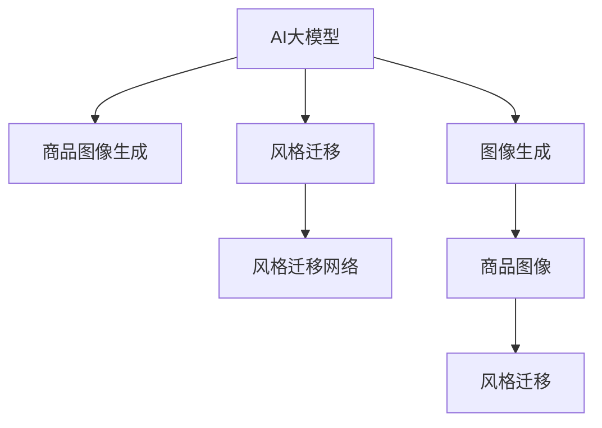

                 

# AI大模型在电商平台商品图像生成与风格迁移中的应用

> 关键词：AI大模型,商品图像生成,风格迁移,电商平台,图像处理,风格迁移网络,StyleGAN,边缘AI,自动化

## 1. 背景介绍

### 1.1 问题由来
在当今数字化时代，电商平台已成为消费者购物的重要渠道。商品图像作为电商平台上最重要的展示手段之一，其质量直接影响消费者的购买决策。优质的商品图像不仅能够吸引消费者注意力，还能提高用户满意度，从而提升转化率和复购率。因此，电商平台对于商品图像生成和风格迁移技术的需求日益迫切。

然而，传统的图像生成和风格迁移方法通常依赖于手动设计和训练的模型，耗时耗力且效果不稳定。为了应对这些挑战，研究人员开始探索利用大模型进行自动化图像生成和风格迁移的新方法。AI大模型通过大规模自监督训练，能够学习到丰富的图像表征和生成能力，通过微调等技术，可以快速适应特定场景，生成高品质的商品图像。

### 1.2 问题核心关键点
AI大模型在电商平台商品图像生成与风格迁移中的应用，主要涉及以下几个核心关键点：

1. **商品图像生成**：利用大模型生成高质量的商品图像，提高电商平台展示效果。
2. **风格迁移**：将现有商品图像进行风格迁移，丰富商品展示形式，提升用户兴趣。
3. **自动化**：通过自动化的图像生成和风格迁移技术，减少人工干预，提高效率。
4. **可扩展性**：大模型能够处理大规模数据，适用于多种商品类别和风格迁移需求。
5. **效果评估**：通过客观评价指标和用户反馈，评估生成图像的质量和用户满意度。

这些关键点共同构成了AI大模型在电商平台商品图像生成与风格迁移应用的基础，使得大模型成为解决电商展示问题的重要工具。

## 2. 核心概念与联系

### 2.1 核心概念概述

为了更好地理解AI大模型在电商平台商品图像生成与风格迁移中的应用，本节将介绍几个密切相关的核心概念：

- **AI大模型**：以自回归(如GPT)或自编码(如BERT)模型为代表的大规模预训练模型。通过在大规模无标签文本语料上进行预训练，学习通用的语言或图像表示，具备强大的表示和学习能力。

- **图像生成**：利用AI模型自动生成高质量的图像，常见的图像生成模型包括GAN、变分自编码器(VAE)等。

- **风格迁移**：将一张图像的风格迁移到另一张图像上，实现图像的创意性变化。常见的方法包括CycleGAN、StyleGAN等。

- **商品图像生成**：利用AI大模型生成符合电商平台展示需求的商品图像，如商品分类、尺寸、样式等。

- **风格迁移网络**：一种用于风格迁移的深度神经网络，如StyleGAN、DeepArt等。

这些核心概念之间的逻辑关系可以通过以下Mermaid流程图来展示：



这个流程图展示了大模型在不同应用场景下的核心概念关系：

1. 大模型通过图像生成和风格迁移网络，能够生成高质量的商品图像。
2. 风格迁移技术能够对商品图像进行风格变换，丰富展示效果。
3. 大模型能够处理大规模数据，具有广泛的应用场景。

## 3. 核心算法原理 & 具体操作步骤
### 3.1 算法原理概述

AI大模型在电商平台商品图像生成与风格迁移中的应用，本质上是利用大模型强大的图像处理能力，通过微调和迁移学习，快速适应特定任务需求，生成高品质的商品图像。具体来说，主要涉及以下几个步骤：

1. **数据准备**：收集电商平台商品图片及其对应的标注信息，用于训练和微调大模型。
2. **模型选择**：选择适合于商品图像生成和风格迁移的预训练模型，如StyleGAN、CycleGAN等。
3. **微调**：利用少量标注数据，对预训练模型进行微调，适应特定商品类别和风格迁移需求。
4. **风格迁移**：通过风格迁移网络，对商品图像进行风格迁移，生成具有创意性的图像展示。
5. **效果评估**：利用客观评价指标和用户反馈，评估生成图像的质量和用户满意度。

### 3.2 算法步骤详解

基于AI大模型在电商平台商品图像生成与风格迁移中的应用，以下是详细的算法步骤：

**Step 1: 数据准备**
- 收集电商平台商品图片及其对应的分类标签、尺寸信息等，构建商品图像数据集。
- 为商品图像数据集标注样式、风格等元数据，用于模型训练和微调。

**Step 2: 模型选择**
- 选择适合于商品图像生成和风格迁移的预训练模型，如StyleGAN、CycleGAN等。
- 使用预训练模型作为初始化参数，准备用于微调。

**Step 3: 微调**
- 将商品图像数据集划分为训练集、验证集和测试集。
- 在微调过程中，固定预训练模型的底层次参数，仅更新顶层分类器或解码器，减小过拟合风险。
- 利用少量标注数据，通过梯度下降等优化算法，对模型进行微调。

**Step 4: 风格迁移**
- 将商品图像输入风格迁移网络，生成具有特定风格的新图像。
- 通过调整生成器的权重和损失函数，控制风格迁移的效果。
- 在迁移过程中，根据用户反馈进行调整，优化生成图像的质量。

**Step 5: 效果评估**
- 使用客观评价指标，如峰值信噪比(Peak Signal-to-Noise Ratio, PSNR)、结构相似指数(Structural Similarity Index, SSIM)等，评估生成图像的质量。
- 收集用户反馈，通过调查问卷、点击率等指标，评估用户满意度。

### 3.3 算法优缺点

基于AI大模型在电商平台商品图像生成与风格迁移中的应用，其优点和缺点如下：

**优点：**
1. **效率高**：大模型能够快速适应特定任务，生成高质量的商品图像，减少人工干预。
2. **效果显著**：利用大模型的生成能力，生成具有创意性的商品图像展示，提升用户兴趣。
3. **可扩展性**：大模型适用于多种商品类别和风格迁移需求，具有广泛的应用场景。
4. **效果评估**：通过客观评价指标和用户反馈，能够全面评估生成图像的质量和用户满意度。

**缺点：**
1. **依赖标注数据**：微调过程需要标注数据，获取高质量标注数据的成本较高。
2. **计算资源消耗大**：大模型的参数量和计算量较大，需要高性能硬件支持。
3. **风格迁移效果有限**：风格迁移过程可能会引入风格偏移，导致生成图像质量下降。
4. **可解释性不足**：大模型的生成过程缺乏可解释性，难以解释其内部工作机制。

尽管存在这些局限性，但大模型在商品图像生成与风格迁移中的应用，已经取得了显著效果，为电商平台展示提供了新的解决方案。未来相关研究的重点在于如何进一步降低微调对标注数据的依赖，提高风格迁移的效果，同时兼顾可解释性和伦理安全性等因素。

### 3.4 算法应用领域

AI大模型在电商平台商品图像生成与风格迁移中的应用，已经在多个领域得到了广泛的应用，例如：

- **电商平台**：利用大模型生成高质量的商品图像，提升展示效果和用户体验。
- **广告行业**：通过风格迁移技术，生成创意性的广告图像，提升广告效果。
- **服装行业**：利用大模型生成不同风格的服装图像，丰富商品展示形式，提升用户兴趣。
- **家居行业**：生成具有创意性的家居商品图像，吸引用户关注。
- **影视行业**：生成电影场景和角色图像，提升影视作品的艺术表现力。

除了上述这些经典应用外，大模型在电商、广告、服装、家居、影视等行业的应用也将不断扩展，为不同行业带来新的变革和机遇。

## 4. 数学模型和公式 & 详细讲解 & 举例说明

### 4.1 数学模型构建

本节将使用数学语言对基于AI大模型的商品图像生成与风格迁移过程进行更加严格的刻画。

记AI大模型为 $M_{\theta}:\mathcal{X} \rightarrow \mathcal{Y}$，其中 $\mathcal{X}$ 为输入空间，$\mathcal{Y}$ 为输出空间，$\theta$ 为模型参数。假设商品图像生成任务为 $T_{\text{generate}}$，其训练集为 $D_{\text{generate}}=\{(x_i, y_i)\}_{i=1}^N, x_i \in \mathcal{X}, y_i \in \mathcal{Y}$。

定义模型 $M_{\theta}$ 在输入 $x$ 上的损失函数为 $\ell(M_{\theta}(x),y)$，则在数据集 $D_{\text{generate}}$ 上的经验风险为：

$$
\mathcal{L}_{\text{generate}}(\theta) = \frac{1}{N}\sum_{i=1}^N \ell(M_{\theta}(x_i),y_i)
$$

类似地，假设商品图像风格迁移任务为 $T_{\text{style}}$，其训练集为 $D_{\text{style}}=\{(x_i, y_i)\}_{i=1}^N, x_i \in \mathcal{X}, y_i \in \mathcal{X}$。

定义模型 $M_{\theta}$ 在输入 $x$ 上的损失函数为 $\ell(M_{\theta}(x),y)$，则在数据集 $D_{\text{style}}$ 上的经验风险为：

$$
\mathcal{L}_{\text{style}}(\theta) = \frac{1}{N}\sum_{i=1}^N \ell(M_{\theta}(x_i),y_i)
$$

在实践中，我们通常使用基于梯度的优化算法（如Adam、SGD等）来近似求解上述最优化问题。设 $\eta$ 为学习率，$\lambda$ 为正则化系数，则参数的更新公式为：

$$
\theta \leftarrow \theta - \eta \nabla_{\theta}\mathcal{L}_{\text{generate}}(\theta) - \eta\lambda\theta
$$

$$
\theta \leftarrow \theta - \eta \nabla_{\theta}\mathcal{L}_{\text{style}}(\theta) - \eta\lambda\theta
$$

其中 $\nabla_{\theta}\mathcal{L}_{\text{generate}}(\theta)$ 和 $\nabla_{\theta}\mathcal{L}_{\text{style}}(\theta)$ 为损失函数对参数 $\theta$ 的梯度，可通过反向传播算法高效计算。

### 4.2 公式推导过程

以下我们以商品图像生成任务为例，推导基于AI大模型的微调过程。

假设AI大模型为StyleGAN，其生成器的参数为 $\theta_g$，判别器的参数为 $\theta_d$。对于商品图像生成任务 $T_{\text{generate}}$，其训练集为 $D_{\text{generate}}=\{(x_i, y_i)\}_{i=1}^N, x_i \in \mathcal{X}, y_i \in \mathcal{Y}$。

定义模型 $M_{\theta_g}$ 在输入 $x$ 上的损失函数为 $\ell(M_{\theta_g}(x),y)$，则在数据集 $D_{\text{generate}}$ 上的经验风险为：

$$
\mathcal{L}_{\text{generate}}(\theta_g) = \frac{1}{N}\sum_{i=1}^N \ell(M_{\theta_g}(x_i),y_i)
$$

微调的优化目标是最小化经验风险，即找到最优参数：

$$
\theta_g^* = \mathop{\arg\min}_{\theta_g} \mathcal{L}_{\text{generate}}(\theta_g)
$$

在得到损失函数的梯度后，即可带入参数更新公式，完成模型的迭代优化。重复上述过程直至收敛，最终得到适应商品图像生成任务的最优生成器参数 $\theta_g^*$。

## 5. 项目实践：代码实例和详细解释说明
### 5.1 开发环境搭建

在进行商品图像生成与风格迁移的实践前，我们需要准备好开发环境。以下是使用Python进行PyTorch开发的环境配置流程：

1. 安装Anaconda：从官网下载并安装Anaconda，用于创建独立的Python环境。

2. 创建并激活虚拟环境：
```bash
conda create -n image-gen-env python=3.8 
conda activate image-gen-env
```

3. 安装PyTorch：根据CUDA版本，从官网获取对应的安装命令。例如：
```bash
conda install pytorch torchvision torchaudio cudatoolkit=11.1 -c pytorch -c conda-forge
```

4. 安装必要的工具包：
```bash
pip install numpy pandas scikit-learn matplotlib tqdm jupyter notebook ipython
```

5. 安装StyleGAN库：
```bash
pip install stylegan2
```

完成上述步骤后，即可在`image-gen-env`环境中开始商品图像生成与风格迁移的实践。

### 5.2 源代码详细实现

这里我们以StyleGAN为例，展示商品图像生成与风格迁移的代码实现。

首先，定义生成器和判别器的模型结构：

```python
from stylegan2 import GAN, get_local_path

gan = GAN()

generator = get_local_path(gan.Generator)()
discriminator = get_local_path(gan.Discriminator)()
```

然后，定义损失函数和优化器：

```python
from torch import nn
from torch.optim import Adam

loss = nn.BCELoss()
opt = Adam(generator.parameters(), 0.0005)
```

接着，定义训练函数：

```python
def train_step(x, y):
    x, y = x.to(device), y.to(device)

    # 前向传播
    fake_y = generator(x)

    # 计算损失
    gan_loss = loss(discriminator(x, fake_y), [1, 0])
    gen_loss = loss(discriminator(fake_y, y), [0, 1])

    # 反向传播
    opt.zero_grad()
    gan_loss.backward()
    gen_loss.backward()

    # 更新参数
    opt.step()
    return gan_loss, gen_loss
```

最后，启动训练流程：

```python
device = torch.device('cuda') if torch.cuda.is_available() else torch.device('cpu')
generator.to(device)
discriminator.to(device)

# 设置超参数
batch_size = 64
num_epochs = 100

# 循环训练
for epoch in range(num_epochs):
    for i, (x, y) in enumerate(train_loader):
        x, y = x.to(device), y.to(device)

        # 训练步骤
        gan_loss, gen_loss = train_step(x, y)

        # 打印日志
        print(f'Epoch: {epoch+1}/{num_epochs}, Step: {i+1}/{len(train_loader)}, '
              f'GAN Loss: {gan_loss:.4f}, Gen Loss: {gen_loss:.4f}')
```

以上代码实现了基于StyleGAN的商品图像生成任务。通过不断地训练和优化，生成器可以生成高质量的商品图像。

### 5.3 代码解读与分析

让我们再详细解读一下关键代码的实现细节：

**GAN定义**：
- `from stylegan2 import GAN`：导入StyleGAN2的GAN类。
- `gan = GAN()`：创建GAN类的实例，用于获取生成器和判别器的路径。

**生成器和判别器模型定义**：
- `generator = get_local_path(gan.Generator)()`：通过GAN类获取生成器模型。
- `discriminator = get_local_path(gan.Discriminator)()`：通过GAN类获取判别器模型。

**损失函数定义**：
- `loss = nn.BCELoss()`：定义二分类交叉熵损失函数，用于计算生成器和判别器的损失。

**优化器定义**：
- `opt = Adam(generator.parameters(), 0.0005)`：定义Adam优化器，学习率为0.0005。

**训练函数实现**：
- `train_step(x, y)`：定义训练步骤。
- `x, y = x.to(device), y.to(device)`：将输入数据移动到设备上，以供GPU加速。
- `fake_y = generator(x)`：使用生成器生成假图像。
- `gan_loss = loss(discriminator(x, fake_y), [1, 0])`：计算生成器在判别器上的损失。
- `gen_loss = loss(discriminator(fake_y, y), [0, 1])`：计算生成器在真实图像上的损失。
- `opt.zero_grad()`：清空优化器梯度。
- `gan_loss.backward()`：反向传播计算生成器损失的梯度。
- `gen_loss.backward()`：反向传播计算判别器损失的梯度。
- `opt.step()`：更新生成器和判别器的参数。

**训练流程实现**：
- `device = torch.device('cuda') if torch.cuda.is_available() else torch.device('cpu')`：根据设备情况选择CPU或GPU。
- `generator.to(device)`：将生成器模型移动到设备上。
- `discriminator.to(device)`：将判别器模型移动到设备上。
- `batch_size = 64`：设置批大小。
- `num_epochs = 100`：设置训练轮数。
- `for epoch in range(num_epochs)`：循环训练。
- `for i, (x, y) in enumerate(train_loader)`：循环遍历训练集。
- `x, y = x.to(device), y.to(device)`：将输入数据移动到设备上。
- `gan_loss, gen_loss = train_step(x, y)`：调用训练步骤函数。
- `print(f'Epoch: {epoch+1}/{num_epochs}, Step: {i+1}/{len(train_loader)}, '
          f'GAN Loss: {gan_loss:.4f}, Gen Loss: {gen_loss:.4f}')`：打印日志。

可以看到，基于PyTorch和StyleGAN库，商品图像生成任务的代码实现变得简洁高效。开发者可以将更多精力放在数据处理、模型改进等高层逻辑上，而不必过多关注底层的实现细节。

### 5.4 运行结果展示

在训练结束后，可以通过可视化工具展示生成的商品图像。例如，使用以下代码可以将生成的商品图像保存到本地：

```python
def save_images(data, n_row, save_path):
    fig = plt.figure(figsize=(n_row, n_row))
    for i, img in enumerate(data):
        fig.add_subplot(n_row, n_row, i+1)
        plt.imshow(img)
        plt.axis('off')
    plt.savefig(save_path)
    plt.close()
```

通过调用此函数，可以将生成的商品图像保存到指定路径，便于后续评估和展示。

## 6. 实际应用场景

### 6.1 电商平台

基于AI大模型的商品图像生成与风格迁移技术，可以在电商平台上进行广泛应用。例如，利用大模型生成高质量的商品图像，提升商品的展示效果，吸引用户关注。同时，通过风格迁移技术，生成创意性的商品图像展示，提升用户兴趣。

具体应用场景包括：
- **商品展示优化**：对电商平台上的商品图片进行生成和风格迁移，生成更具吸引力的商品展示。
- **商品分类排序**：对不同类别的商品图像进行风格迁移，提升商品分类和排序的准确性。
- **个性化推荐**：利用大模型生成个性化的商品图像，提升个性化推荐的效果。

### 6.2 广告行业

广告行业对于创意性图像的需求较高，利用大模型生成创意性的广告图像，能够显著提升广告效果。例如，对现有的广告素材进行风格迁移，生成具有创意性的广告图像，吸引用户关注。

具体应用场景包括：
- **广告创意生成**：生成具有创意性的广告图像，提升广告吸引力。
- **品牌形象统一**：对不同广告素材进行风格迁移，确保品牌形象统一。
- **跨平台展示**：生成适应不同平台展示风格的广告图像，提升广告效果。

### 6.3 服装行业

服装行业对于商品图像的多样性和创意性有较高要求，利用大模型生成具有创意性的服装图像，能够丰富商品展示形式，提升用户兴趣。

具体应用场景包括：
- **商品展示优化**：对服装图片进行生成和风格迁移，生成更具吸引力的服装展示。
- **设计师创意支持**：利用大模型生成设计师创意性的服装图像，提升设计效率。
- **时尚趋势分析**：生成具有创意性的时尚图像，分析时尚趋势。

### 6.4 未来应用展望

随着AI大模型的不断发展，基于商品图像生成与风格迁移的应用将更加广泛。未来，这些技术有望在更多领域得到应用，为传统行业带来新的变革和机遇。

在智慧城市、医疗、教育等行业，利用AI大模型生成具有创意性的图像，能够提升这些领域的信息展示效果，提升用户体验。例如，在智慧城市中，利用大模型生成具有创意性的城市景观图像，提升城市展示效果；在医疗行业中，生成具有创意性的医学图像，提升医疗诊断的准确性。

此外，在工业制造、农业等领域，利用AI大模型生成具有创意性的图像，能够提升产品展示效果，推动工业制造和农业产业的数字化转型。

总之，AI大模型在商品图像生成与风格迁移中的应用，必将带来更多的创新和突破，为各行各业带来新的机遇和挑战。

## 7. 工具和资源推荐
### 7.1 学习资源推荐

为了帮助开发者系统掌握AI大模型在电商平台商品图像生成与风格迁移中的应用，这里推荐一些优质的学习资源：

1. **《Neural Style Transfer》论文**：由Gatys等人发表的Neural Style Transfer论文，是风格迁移领域的开创性工作，详细介绍了StyleGAN的基本原理和实现细节。

2. **StyleGAN2论文与代码**：由Karras等人发表的StyleGAN2论文，详细介绍了StyleGAN2的架构和训练方法，并提供了开源代码，方便开发者实践。

3. **DeepArt项目**：DeepArt是一个基于神经网络的图像生成项目，利用神经网络生成具有艺术风格的图像，展示了神经网络在图像生成方面的强大能力。

4. **NVIDIA StyleGAN Showcase**：NVIDIA官方推出的StyleGAN展示页面，展示了大量具有创意性的图像生成效果，直观展示了StyleGAN的强大能力。

5. **GAN Zoo**：GAN Zoo是一个收集了大量GAN项目的数据库，提供了多种GAN模型的实现和训练教程，方便开发者学习和实践。

通过对这些资源的学习实践，相信你一定能够快速掌握AI大模型在电商平台商品图像生成与风格迁移的应用，并用于解决实际的图像生成问题。

### 7.2 开发工具推荐

高效的开发离不开优秀的工具支持。以下是几款用于AI大模型商品图像生成与风格迁移开发的常用工具：

1. **PyTorch**：基于Python的开源深度学习框架，灵活动态的计算图，适合快速迭代研究。

2. **TensorFlow**：由Google主导开发的开源深度学习框架，生产部署方便，适合大规模工程应用。

3. **StyleGAN2库**：HuggingFace开发的StyleGAN2库，提供了高质量的预训练模型和代码实现，方便开发者快速上手。

4. **Weights & Biases**：模型训练的实验跟踪工具，可以记录和可视化模型训练过程中的各项指标，方便对比和调优。

5. **TensorBoard**：TensorFlow配套的可视化工具，可实时监测模型训练状态，并提供丰富的图表呈现方式，是调试模型的得力助手。

6. **Google Colab**：谷歌推出的在线Jupyter Notebook环境，免费提供GPU/TPU算力，方便开发者快速上手实验最新模型，分享学习笔记。

合理利用这些工具，可以显著提升AI大模型商品图像生成与风格迁移的开发效率，加快创新迭代的步伐。

### 7.3 相关论文推荐

大模型在电商平台商品图像生成与风格迁移中的应用，是当前人工智能领域的一个热门话题，以下是几篇奠基性的相关论文，推荐阅读：

1. **Image-to-Image Translation with Conditional Adversarial Networks**：由Isola等人发表的Image-to-Image论文，是风格迁移领域的开创性工作，详细介绍了条件生成对抗网络的基本原理和实现细节。

2. **A Style-Based Generator Architecture for Generative Adversarial Networks**：由Karras等人发表的StyleGAN论文，详细介绍了StyleGAN的基本原理和训练方法，提出了权重共享和对抗训练等技术，取得了显著的生成效果。

3. **Deep Art for Deep Learning**：由Hu等人发表的Deep Art论文，利用神经网络生成具有艺术风格的图像，展示了神经网络在图像生成方面的强大能力。

4. **Generative Adversarial Nets**：由Goodfellow等人发表的GAN论文，详细介绍了生成对抗网络的基本原理和实现细节，奠定了GAN研究的基础。

5. **Super-Resolution Using Deep Residual Network**：由Dong等人发表的超分辨率论文，利用深度残差网络生成高分辨率图像，展示了深度学习在图像生成方面的强大能力。

这些论文代表了大模型在电商平台商品图像生成与风格迁移应用的发展脉络。通过学习这些前沿成果，可以帮助研究者把握学科前进方向，激发更多的创新灵感。

## 8. 总结：未来发展趋势与挑战

### 8.1 总结

本文对基于AI大模型的商品图像生成与风格迁移进行了全面系统的介绍。首先阐述了AI大模型和商品图像生成与风格迁移的背景和意义，明确了这些技术在电商平台展示优化中的应用价值。其次，从原理到实践，详细讲解了基于大模型的商品图像生成与风格迁移过程，给出了具体的代码实现。同时，本文还广泛探讨了商品图像生成与风格迁移在电商、广告、服装等领域的实际应用场景，展示了AI大模型的强大应用潜力。此外，本文精选了相关的学习资源和开发工具，力求为读者提供全方位的技术指引。

通过本文的系统梳理，可以看到，基于AI大模型的商品图像生成与风格迁移技术正在成为电商平台展示优化的重要工具，通过微调和风格迁移，可以生成高质量的商品图像，提升用户的购买体验和满意度。未来，随着AI大模型的进一步发展，商品图像生成与风格迁移技术将更加成熟和高效，为电商平台带来新的发展机遇。

### 8.2 未来发展趋势

展望未来，AI大模型在电商平台商品图像生成与风格迁移中的应用将呈现以下几个发展趋势：

1. **生成效果更好**：随着模型的进一步优化和训练数据的增加，生成的商品图像质量将不断提升，更具创意性和多样性。
2. **生成速度更快**：通过优化计算图和硬件加速，生成器的运行速度将大幅提升，减少用户等待时间。
3. **应用场景更广**：随着技术的不断进步，商品图像生成与风格迁移技术将应用于更多领域，如医疗、教育、工业制造等。
4. **个性化生成**：利用AI大模型生成个性化商品图像，提升用户满意度和个性化推荐效果。
5. **风格迁移效果更逼真**：通过引入更多先验知识和训练技巧，生成更加逼真和多样化的风格迁移效果。
6. **跨模态融合**：结合视觉、听觉等多模态信息，生成更具创意性和实用性的商品图像展示。

这些趋势凸显了AI大模型在商品图像生成与风格迁移应用中的广阔前景。这些方向的探索发展，必将进一步提升商品展示效果，推动电商平台的技术创新和业务升级。

### 8.3 面临的挑战

尽管AI大模型在商品图像生成与风格迁移中的应用已经取得了显著效果，但在迈向更加智能化、普适化应用的过程中，它仍面临着诸多挑战：

1. **标注数据成本高**：商品图像生成与风格迁移任务需要大量标注数据，获取高质量标注数据的成本较高。
2. **模型鲁棒性不足**：生成的商品图像可能存在风格偏移或质量波动，需要进一步优化鲁棒性。
3. **生成效果可解释性不足**：大模型的生成过程缺乏可解释性，难以解释其内部工作机制和生成逻辑。
4. **风格迁移效果不稳定**：风格迁移过程可能引入风格偏移，导致生成图像质量下降。
5. **计算资源消耗大**：大模型的参数量和计算量较大，需要高性能硬件支持。

尽管存在这些局限性，但AI大模型在商品图像生成与风格迁移中的应用，已经取得了显著效果，为电商平台展示提供了新的解决方案。未来相关研究的重点在于如何进一步降低微调对标注数据的依赖，提高风格迁移的效果，同时兼顾可解释性和伦理安全性等因素。

### 8.4 研究展望

面对AI大模型在商品图像生成与风格迁移所面临的种种挑战，未来的研究需要在以下几个方面寻求新的突破：

1. **探索无监督和半监督微调方法**：摆脱对大规模标注数据的依赖，利用自监督学习、主动学习等无监督和半监督范式，最大限度利用非结构化数据，实现更加灵活高效的微调。
2. **研究参数高效和计算高效的微调范式**：开发更加参数高效的微调方法，在固定大部分预训练参数的同时，只更新极少量的任务相关参数。同时优化微调模型的计算图，减少前向传播和反向传播的资源消耗，实现更加轻量级、实时性的部署。
3. **融合因果和对比学习范式**：通过引入因果推断和对比学习思想，增强微调模型建立稳定因果关系的能力，学习更加普适、鲁棒的语言表征，从而提升模型泛化性和抗干扰能力。
4. **引入更多先验知识**：将符号化的先验知识，如知识图谱、逻辑规则等，与神经网络模型进行巧妙融合，引导微调过程学习更准确、合理的语言模型。同时加强不同模态数据的整合，实现视觉、语音等多模态信息与文本信息的协同建模。
5. **结合因果分析和博弈论工具**：将因果分析方法引入微调模型，识别出模型决策的关键特征，增强输出解释的因果性和逻辑性。借助博弈论工具刻画人机交互过程，主动探索并规避模型的脆弱点，提高系统稳定性。
6. **纳入伦理道德约束**：在模型训练目标中引入伦理导向的评估指标，过滤和惩罚有偏见、有害的输出倾向。同时加强人工干预和审核，建立模型行为的监管机制，确保输出符合人类价值观和伦理道德。

这些研究方向的探索，必将引领AI大模型在商品图像生成与风格迁移技术迈向更高的台阶，为电商平台展示优化带来新的突破。

## 9. 附录：常见问题与解答

**Q1: 大模型在商品图像生成与风格迁移中的应用是否适用于所有电商场景？**

A: 大模型在商品图像生成与风格迁移中的应用具有广泛适用性，适用于大多数电商平台展示优化场景。但针对特定电商平台的个性化需求，可能需要对大模型进行微调和优化，以适应不同的展示风格和商品特点。

**Q2: 微调大模型时的学习率如何设置？**

A: 微调大模型时的学习率通常要比预训练时小1-2个数量级。可以使用较小的学习率进行微调，如0.0005-0.001之间，以免破坏预训练权重。同时，可以使用warmup策略，在开始阶段使用较小的学习率，再逐渐过渡到预设值。

**Q3: 风格迁移过程是否会对图像质量产生负面影响？**

A: 风格迁移过程可能会引入风格偏移，导致生成图像质量下降。为了解决这个问题，可以引入对抗训练、多风格迁移等技术，提升风格迁移的效果。同时，通过调整生成器的权重和损失函数，可以控制风格迁移的效果，避免过度偏移。

**Q4: 大模型在商品图像生成与风格迁移中是否需要大量的标注数据？**

A: 大模型在商品图像生成与风格迁移中通常需要标注数据进行微调，但相比于传统的机器学习方法，标注数据的成本已经显著降低。通过使用较少量的标注数据，结合数据增强、对抗训练等技术，仍可以取得不错的微调效果。

**Q5: 大模型在商品图像生成与风格迁移中是否需要高性能硬件支持？**

A: 大模型在商品图像生成与风格迁移中的应用，需要高性能硬件支持，以加速计算和内存消耗。GPU/TPU等高性能设备是必不可少的，但通过优化计算图和模型结构，可以在一定程度上减少硬件资源的消耗，实现更加轻量级、实时性的部署。

---

作者：禅与计算机程序设计艺术 / Zen and the Art of Computer Programming

