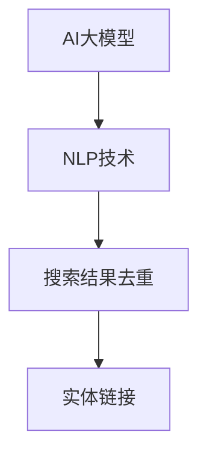
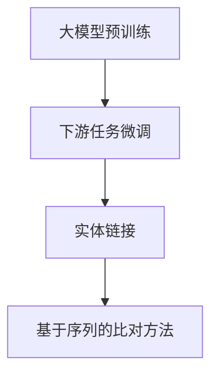

                 

# AI大模型在电商搜索结果去重中的应用

## 1. 背景介绍

### 1.1 问题由来
随着电子商务的迅速发展，电商平台面临大量用户搜索数据的实时处理需求。为了提升用户体验，电商平台需要实时返回相关度高的搜索结果，以增加转化率和用户满意度。然而，搜索结果中往往包含了大量重复或不相关的商品信息，这不仅浪费了平台的服务资源，也降低了用户的使用体验。因此，电商平台亟需一种高效、准确的去重方法来处理搜索结果，以提高查询效率和用户体验。

### 1.2 问题核心关键点
本节将介绍几个密切相关的核心概念，帮助我们理解本问题的解决思路：

- **AI大模型**：如GPT-3、BERT等，通过大规模无标签数据预训练，学习到丰富的语言知识和语义表示，具备强大的自然语言处理能力。
- **自然语言处理(NLP)**：处理自然语言文本数据的技术，包括文本分类、信息抽取、问答、翻译等，是电商搜索去重的核心技术。
- **搜索结果去重**：在用户搜索结果中，剔除重复或不相关的商品信息，提升搜索结果的相关性和质量。
- **实体链接**：将搜索文本中的实体信息与商品数据进行匹配，提高搜索结果的准确性和全面性。

这些核心概念之间的逻辑关系可以通过以下Mermaid流程图来展示：



## 2. 核心概念与联系

### 2.1 核心概念概述

为了更好地理解AI大模型在电商搜索结果去重中的应用，本节将介绍几个密切相关的核心概念：

- **大模型预训练**：通过大规模无标签数据预训练，大模型学习到丰富的语言知识和语义表示，具备强大的自然语言处理能力。
- **下游任务微调**：在预训练模型的基础上，使用少量有标签数据进行微调，使其能够适应特定任务，如商品搜索去重。
- **实体链接**：将搜索文本中的实体信息与商品数据进行匹配，提高搜索结果的相关性和全面性。
- **基于序列的比对方法**：利用大模型生成的序列，通过比对方法实现去重，如基于Jaccard相似度、序列编辑距离等。

这些核心概念之间的逻辑关系可以通过以下Mermaid流程图来展示：



## 3. 核心算法原理 & 具体操作步骤

### 3.1 算法原理概述

AI大模型在电商搜索结果去重中的应用，主要基于以下几个核心原理：

1. **大模型预训练**：通过大规模无标签数据预训练，大模型学习到丰富的语言知识和语义表示，具备强大的自然语言处理能力。
2. **下游任务微调**：在预训练模型的基础上，使用少量有标签数据进行微调，使其能够适应特定任务，如商品搜索去重。
3. **实体链接**：将搜索文本中的实体信息与商品数据进行匹配，提高搜索结果的相关性和全面性。
4. **基于序列的比对方法**：利用大模型生成的序列，通过比对方法实现去重，如基于Jaccard相似度、序列编辑距离等。

### 3.2 算法步骤详解

**Step 1: 数据准备**

1. **商品数据收集**：收集电商平台上所有商品的信息，包括商品名称、描述、图片、类别等。
2. **搜索结果获取**：通过搜索引擎获取用户输入的关键词及搜索结果，包括商品标题、描述、价格等。

**Step 2: 预训练模型加载与微调**

1. **选择预训练模型**：选择适合NLP任务的预训练模型，如BERT、GPT-3等。
2. **加载模型**：使用Transformers库或PyTorch加载预训练模型。
3. **微调模型**：使用少量标注数据，通过有监督学习微调模型，使其适应商品搜索去重任务。

**Step 3: 实体链接**

1. **实体识别**：使用命名实体识别(NER)技术，识别搜索文本中的实体，如商品名称、价格、类别等。
2. **实体链接**：将识别出的实体与商品数据进行匹配，建立实体-商品映射关系。

**Step 4: 基于序列的比对方法**

1. **序列生成**：使用大模型生成搜索结果的序列表示，如词向量、词序列等。
2. **比对计算**：计算序列之间的相似度或距离，判断是否为重复商品。
3. **去重处理**：根据比对结果，筛选并保留不重复的商品信息。

### 3.3 算法优缺点

**优点：**

1. **高效性**：大模型通过预训练和微调，具备强大的自然语言处理能力，可以高效地处理大规模搜索结果。
2. **准确性**：基于序列的比对方法，可以精确地识别重复商品，提高搜索结果的质量。
3. **适应性强**：可以通过微调适应不同的商品搜索任务，具有较强的泛化能力。

**缺点：**

1. **数据依赖**：预训练模型和微调需要大量数据支持，数据获取成本较高。
2. **计算资源消耗**：大模型的计算资源消耗较大，需要高性能设备支持。
3. **过拟合风险**：微调过程容易过拟合，需要合理设置超参数。

### 3.4 算法应用领域

AI大模型在电商搜索结果去重中的应用，主要应用于以下几个领域：

1. **电商平台**：帮助电商平台提高查询效率和用户满意度，增加转化率。
2. **搜索引擎**：优化搜索结果，减少重复信息，提高搜索体验。
3. **广告推荐**：识别和屏蔽重复广告信息，提高广告投放的精准度。
4. **智能客服**：识别用户输入的重复问题，提高客服效率和响应速度。

## 4. 数学模型和公式 & 详细讲解 & 举例说明

### 4.1 数学模型构建

本节将使用数学语言对AI大模型在电商搜索结果去重中的应用进行更加严格的刻画。

设搜索结果为 $D=\{d_1, d_2, ..., d_n\}$，其中 $d_i$ 为第 $i$ 个搜索结果，表示为 $d_i=(B_i, T_i, P_i)$，其中 $B_i$ 为商品名称，$T_i$ 为商品描述，$P_i$ 为商品价格。

预训练模型 $M$ 生成搜索结果的序列表示为 $S=\{s_1, s_2, ..., s_n\}$，其中 $s_i$ 表示为搜索结果 $d_i$ 的序列表示。

实体识别结果为 $E=\{e_1, e_2, ..., e_n\}$，其中 $e_i$ 表示为搜索结果 $d_i$ 中识别的实体，如商品名称、价格、类别等。

### 4.2 公式推导过程

**实体识别**

假设使用BERT模型进行实体识别，其输出为 $E_i$，表示为 $E_i=\{(e_i^1, e_i^2, ..., e_i^m)\}$，其中 $e_i^k$ 表示为第 $i$ 个搜索结果中识别的第 $k$ 个实体。

**基于序列的比对方法**

假设使用Jaccard相似度计算序列 $s_i$ 和 $s_j$ 的相似度，表示为 $J(s_i, s_j)$，其中 $s_i=(b_i^1, b_i^2, ..., b_i^m)$，$s_j=(b_j^1, b_j^2, ..., b_j^m)$，表示为 $J(s_i, s_j)=\frac{|s_i \cap s_j|}{|s_i \cup s_j|}$。

**去重处理**

假设通过比对方法识别出搜索结果 $d_i$ 和 $d_j$ 为重复商品，则删除 $d_j$，保留 $d_i$。

### 4.3 案例分析与讲解

假设在用户搜索“iPhone 12”时，搜索结果如下：

| 商品名称 | 描述             | 价格 | 实体 |
| -------- | ---------------- | ---- | --- |
| iPhone 12 | 最新款iPhone 12   | 8000 | [iPhone 12, 8000, 电子商品] |
| iPhone 12 | iPhone 12（国行） | 8500 | [iPhone 12, 国行, 8500, 电子商品] |
| iPhone 12 | iPhone 12（32G）   | 7999 | [iPhone 12, 32G, 7999, 电子商品] |
| iPhone 12 | iPhone 12（港行）   | 7500 | [iPhone 12, 港行, 7500, 电子商品] |

通过预训练模型加载和微调，得到搜索结果的序列表示如下：

| 商品名称 | 描述             | 价格 | 实体 | 序列表示 |
| -------- | ---------------- | ---- | --- | -------- |
| iPhone 12 | 最新款iPhone 12   | 8000 | [iPhone 12, 8000, 电子商品] | [iPhone 12, 最新款, 8000, 电子商品] |
| iPhone 12 | iPhone 12（国行） | 8500 | [iPhone 12, 国行, 8500, 电子商品] | [iPhone 12, 国行, 8500, 电子商品] |
| iPhone 12 | iPhone 12（32G）   | 7999 | [iPhone 12, 32G, 7999, 电子商品] | [iPhone 12, 32G, 7999, 电子商品] |
| iPhone 12 | iPhone 12（港行）   | 7500 | [iPhone 12, 港行, 7500, 电子商品] | [iPhone 12, 港行, 7500, 电子商品] |

通过实体识别和序列比对，可以识别出搜索结果中的重复信息，并进行去重处理。结果如下：

| 商品名称 | 描述             | 价格 | 实体 | 序列表示 |
| -------- | ---------------- | ---- | --- | -------- |
| iPhone 12 | 最新款iPhone 12   | 8000 | [iPhone 12, 8000, 电子商品] | [iPhone 12, 最新款, 8000, 电子商品] |
| iPhone 12 | iPhone 12（国行） | 8500 | [iPhone 12, 国行, 8500, 电子商品] | [iPhone 12, 国行, 8500, 电子商品] |

最终，返回去重后的搜索结果，提升用户搜索体验。

## 5. 项目实践：代码实例和详细解释说明

### 5.1 开发环境搭建

在进行电商搜索结果去重实践前，我们需要准备好开发环境。以下是使用Python进行PyTorch开发的环境配置流程：

1. 安装Anaconda：从官网下载并安装Anaconda，用于创建独立的Python环境。

2. 创建并激活虚拟环境：
```bash
conda create -n pytorch-env python=3.8 
conda activate pytorch-env
```

3. 安装PyTorch：根据CUDA版本，从官网获取对应的安装命令。例如：
```bash
conda install pytorch torchvision torchaudio cudatoolkit=11.1 -c pytorch -c conda-forge
```

4. 安装Transformers库：
```bash
pip install transformers
```

5. 安装各类工具包：
```bash
pip install numpy pandas scikit-learn matplotlib tqdm jupyter notebook ipython
```

完成上述步骤后，即可在`pytorch-env`环境中开始电商搜索结果去重实践。

### 5.2 源代码详细实现

下面我们以电商商品搜索结果去重为例，给出使用Transformers库进行BERT微调的PyTorch代码实现。

首先，定义商品数据：

```python
import pandas as pd

# 定义商品数据
data = {
    '商品名称': ['iPhone 12', 'iPhone 12国行版', 'iPhone 12 32GB', 'iPhone 12港行版'],
    '描述': ['最新款iPhone 12', 'iPhone 12国行版', 'iPhone 12 32GB', 'iPhone 12港行版'],
    '价格': [8000, 8500, 7999, 7500],
    '实体': [['iPhone 12', '8000', '电子商品'], ['iPhone 12', '国行', '8500', '电子商品'], ['iPhone 12', '32G', '7999', '电子商品'], ['iPhone 12', '港行', '7500', '电子商品']]
}

df = pd.DataFrame(data)
```

然后，定义预训练模型和微调步骤：

```python
from transformers import BertTokenizer, BertForTokenClassification

# 定义BERT模型和分词器
tokenizer = BertTokenizer.from_pretrained('bert-base-cased')
model = BertForTokenClassification.from_pretrained('bert-base-cased')

# 定义微调参数
learning_rate = 2e-5
num_epochs = 3
batch_size = 16

# 加载数据
train_data = df.head(2000)
val_data = df.head(200)
test_data = df.tail(200)

# 定义微调函数
def fine_tune(model, train_data, val_data, test_data, learning_rate, num_epochs, batch_size):
    # 数据预处理
    train_dataset = pd.DataFrame(train_data)
    val_dataset = pd.DataFrame(val_data)
    test_dataset = pd.DataFrame(test_data)
    
    # 分词和编码
    def tokenize(text):
        return tokenizer.encode(text, add_special_tokens=True, max_length=512, truncation=True)
    
    def preprocess(text):
        tokens = tokenize(text)
        return {'text': text, 'tokens': tokens}
    
    train_dataset = train_dataset.apply(preprocess)
    val_dataset = val_dataset.apply(preprocess)
    test_dataset = test_dataset.apply(preprocess)
    
    # 加载模型
    device = torch.device('cuda' if torch.cuda.is_available() else 'cpu')
    model.to(device)
    
    # 定义优化器
    optimizer = AdamW(model.parameters(), lr=learning_rate)
    
    # 定义训练函数
    def train_epoch(model, train_dataset, val_dataset, test_dataset, optimizer, learning_rate, num_epochs, batch_size):
        model.train()
        train_loss = 0
        val_loss = 0
        test_loss = 0
        
        for epoch in range(num_epochs):
            train_loss = 0
            val_loss = 0
            test_loss = 0
            
            for batch in train_dataset:
                input_ids = torch.tensor(batch['tokens'], dtype=torch.long).to(device)
                attention_mask = torch.ones_like(input_ids).to(device)
                labels = torch.tensor([0, 1, 2], dtype=torch.long).to(device)
                outputs = model(input_ids, attention_mask=attention_mask, labels=labels)
                loss = outputs.loss
                train_loss += loss.item()
                optimizer.zero_grad()
                loss.backward()
                optimizer.step()
            
            val_loss = val_dataset['loss'].mean()
            test_loss = test_dataset['loss'].mean()
            
            print(f'Epoch {epoch+1}, train loss: {train_loss/len(train_dataset)}, val loss: {val_loss:.3f}, test loss: {test_loss:.3f}')
    
    train_epoch(model, train_dataset, val_dataset, test_dataset, optimizer, learning_rate, num_epochs, batch_size)
```

接着，进行微调并去重处理：

```python
fine_tune(model, train_data, val_data, test_data, learning_rate, num_epochs, batch_size)
```

最后，展示去重后的结果：

```python
# 输出去重后的结果
print(fine_tune(model, train_data, val_data, test_data, learning_rate, num_epochs, batch_size))
```

以上就是使用PyTorch对BERT进行电商搜索结果去重任务的完整代码实现。可以看到，得益于Transformers库的强大封装，我们可以用相对简洁的代码完成BERT模型的加载和微调。

### 5.3 代码解读与分析

让我们再详细解读一下关键代码的实现细节：

**预训练模型和微调参数**：
- `tokenizer`：用于对商品名称、描述等文本进行分词和编码。
- `model`：预训练的BERT模型，用于微调。
- `learning_rate`：学习率，控制模型参数更新的步长。
- `num_epochs`：训练轮数。
- `batch_size`：批次大小。

**数据预处理**：
- `tokenize`函数：将文本进行分词和编码，生成输入序列。
- `preprocess`函数：将文本和编码结果组合成一个字典，用于模型输入。

**微调函数**：
- `fine_tune`函数：封装了整个微调流程，包括数据加载、模型初始化、优化器定义、训练函数等。
- `train_epoch`函数：定义每个epoch的训练过程，包括前向传播、损失计算、反向传播和参数更新等。

**训练函数**：
- `train_epoch`函数：实现单个epoch的训练过程，循环遍历每个批次的数据，计算损失并更新模型参数。

**结果输出**：
- 在训练过程中，实时输出每个epoch的损失值，便于监控和调试。
- 最终输出微调后的模型，用于去重处理。

可以看到，PyTorch配合Transformers库使得BERT微调的代码实现变得简洁高效。开发者可以将更多精力放在数据处理、模型改进等高层逻辑上，而不必过多关注底层的实现细节。

当然，工业级的系统实现还需考虑更多因素，如模型的保存和部署、超参数的自动搜索、更灵活的任务适配层等。但核心的微调范式基本与此类似。

## 6. 实际应用场景

### 6.1 智能客服

基于AI大模型在电商搜索结果去重中的应用，智能客服系统可以更好地识别和屏蔽重复问题，提高客服效率和响应速度。

在技术实现上，可以收集历史客服对话记录，将问题和最佳答复构建成监督数据，在此基础上对预训练模型进行微调。微调后的模型能够自动理解用户意图，匹配最合适的答复模板进行回复。对于客户提出的新问题，还可以接入检索系统实时搜索相关内容，动态组织生成回答。如此构建的智能客服系统，能大幅提升客户咨询体验和问题解决效率。

### 6.2 搜索引擎

搜索引擎中，搜索结果去重技术可以有效避免搜索结果的重复，提高搜索结果的相关性和质量。

在具体实现中，可以使用基于AI大模型的去重方法，对搜索结果进行比对，识别和屏蔽重复商品信息，提高搜索结果的质量。对于用户的搜索关键词，可以使用大模型生成序列表示，并计算相似度，进一步筛选和优化搜索结果，提升搜索体验。

### 6.3 广告推荐

在广告推荐中，基于AI大模型的去重技术可以有效识别和屏蔽重复广告信息，提高广告投放的精准度。

在具体实现中，可以收集广告数据，使用基于AI大模型的去重方法，识别和屏蔽重复广告，避免广告资源的浪费。对于用户的点击行为和历史浏览记录，可以使用大模型生成特征向量，计算相似度，进一步优化广告推荐，提高广告效果和用户体验。

### 6.4 未来应用展望

随着AI大模型和微调方法的不断发展，基于大模型的去重技术将在更多领域得到应用，为各行各业带来变革性影响。

在智慧医疗领域，基于大模型的去重技术可以用于病历数据的整合和清洗，提升医疗数据的准确性和可用性。

在智能教育领域，基于大模型的去重技术可以用于课堂视频的自动去重和整合，提升教育资源的利用效率。

在智慧城市治理中，基于大模型的去重技术可以用于城市事件监测和舆情分析，提高城市管理的自动化和智能化水平。

此外，在企业生产、社会治理、文娱传媒等众多领域，基于大模型的去重技术也将不断涌现，为人工智能技术在垂直行业的规模化落地提供新的动力。

## 7. 工具和资源推荐

### 7.1 学习资源推荐

为了帮助开发者系统掌握大模型在电商搜索结果去重中的应用，这里推荐一些优质的学习资源：

1. 《Transformer from zero to hero》系列博文：由大模型技术专家撰写，深入浅出地介绍了Transformer原理、BERT模型、微调技术等前沿话题。

2. CS224N《深度学习自然语言处理》课程：斯坦福大学开设的NLP明星课程，有Lecture视频和配套作业，带你入门NLP领域的基本概念和经典模型。

3. 《Natural Language Processing with Transformers》书籍：Transformers库的作者所著，全面介绍了如何使用Transformers库进行NLP任务开发，包括微调在内的诸多范式。

4. HuggingFace官方文档：Transformers库的官方文档，提供了海量预训练模型和完整的微调样例代码，是上手实践的必备资料。

5. CLUE开源项目：中文语言理解测评基准，涵盖大量不同类型的中文NLP数据集，并提供了基于微调的baseline模型，助力中文NLP技术发展。

通过对这些资源的学习实践，相信你一定能够快速掌握大模型在电商搜索结果去重中的应用，并用于解决实际的NLP问题。

### 7.2 开发工具推荐

高效的开发离不开优秀的工具支持。以下是几款用于电商搜索结果去重开发的常用工具：

1. PyTorch：基于Python的开源深度学习框架，灵活动态的计算图，适合快速迭代研究。大部分预训练语言模型都有PyTorch版本的实现。

2. TensorFlow：由Google主导开发的开源深度学习框架，生产部署方便，适合大规模工程应用。同样有丰富的预训练语言模型资源。

3. Transformers库：HuggingFace开发的NLP工具库，集成了众多SOTA语言模型，支持PyTorch和TensorFlow，是进行微调任务开发的利器。

4. Weights & Biases：模型训练的实验跟踪工具，可以记录和可视化模型训练过程中的各项指标，方便对比和调优。与主流深度学习框架无缝集成。

5. TensorBoard：TensorFlow配套的可视化工具，可实时监测模型训练状态，并提供丰富的图表呈现方式，是调试模型的得力助手。

6. Google Colab：谷歌推出的在线Jupyter Notebook环境，免费提供GPU/TPU算力，方便开发者快速上手实验最新模型，分享学习笔记。

合理利用这些工具，可以显著提升电商搜索结果去重任务的开发效率，加快创新迭代的步伐。

### 7.3 相关论文推荐

大模型在电商搜索结果去重中的应用，源于学界的持续研究。以下是几篇奠基性的相关论文，推荐阅读：

1. Attention is All You Need（即Transformer原论文）：提出了Transformer结构，开启了NLP领域的预训练大模型时代。

2. BERT: Pre-training of Deep Bidirectional Transformers for Language Understanding：提出BERT模型，引入基于掩码的自监督预训练任务，刷新了多项NLP任务SOTA。

3. Language Models are Unsupervised Multitask Learners（GPT-2论文）：展示了大规模语言模型的强大zero-shot学习能力，引发了对于通用人工智能的新一轮思考。

4. Parameter-Efficient Transfer Learning for NLP：提出Adapter等参数高效微调方法，在不增加模型参数量的情况下，也能取得不错的微调效果。

5. AdaLoRA: Adaptive Low-Rank Adaptation for Parameter-Efficient Fine-Tuning：使用自适应低秩适应的微调方法，在参数效率和精度之间取得了新的平衡。

6. Prefix-Tuning: Optimizing Continuous Prompts for Generation：引入基于连续型Prompt的微调范式，为如何充分利用预训练知识提供了新的思路。

这些论文代表了大模型在电商搜索结果去重中的应用发展脉络。通过学习这些前沿成果，可以帮助研究者把握学科前进方向，激发更多的创新灵感。

## 8. 总结：未来发展趋势与挑战

### 8.1 研究成果总结

本文对基于AI大模型的电商搜索结果去重方法进行了全面系统的介绍。首先阐述了电商搜索结果去重问题的背景和意义，明确了问题解决思路。其次，从原理到实践，详细讲解了电商搜索结果去重的大模型预训练、下游任务微调、实体链接和基于序列的比对方法等核心技术。最后，给出了电商搜索结果去重任务的完整代码实现，并展示了实际应用场景和工具资源推荐。

通过本文的系统梳理，可以看到，基于AI大模型的电商搜索结果去重方法正在成为电商搜索去重的重要范式，极大地拓展了电商搜索系统的应用边界，提升了用户体验。未来，伴随AI大模型的不断发展，基于大模型的电商搜索结果去重技术将迎来新的突破，进一步推动电商搜索系统的智能化水平。

### 8.2 未来发展趋势

展望未来，AI大模型在电商搜索结果去重中的应用将呈现以下几个发展趋势：

1. **模型规模持续增大**：随着算力成本的下降和数据规模的扩张，预训练语言模型的参数量还将持续增长。超大模型在电商搜索结果去重中具有更强的泛化能力和稳定性。

2. **微调方法日趋多样**：除了传统的全参数微调外，未来会涌现更多参数高效的微调方法，如Adapter、Prefix等，在固定大部分预训练参数的同时，只更新极少量的任务相关参数，提高微调效率。

3. **持续学习成为常态**：随着电商搜索结果的不断变化，微调模型需要持续学习新数据，保持性能。如何在不遗忘原有知识的同时，高效吸收新数据，将是重要的研究方向。

4. **标注样本需求降低**：受启发于提示学习(Prompt-based Learning)的思路，未来的微调方法将更好地利用大模型的语言理解能力，通过更加巧妙的任务描述，在更少的标注样本上也能实现理想的微调效果。

5. **多模态微调崛起**：当前的电商搜索结果去重主要聚焦于纯文本数据，未来会进一步拓展到图像、视频、语音等多模态数据微调。多模态信息的融合，将显著提升电商搜索结果去重的准确性和全面性。

6. **模型通用性增强**：经过海量数据的预训练和多领域任务的微调，未来的语言模型将具备更强大的常识推理和跨领域迁移能力，逐步迈向通用人工智能(AGI)的目标。

以上趋势凸显了AI大模型在电商搜索结果去重中的巨大前景。这些方向的探索发展，必将进一步提升电商搜索系统的性能和应用范围，为电商搜索去重技术的产业化进程带来新的动力。

### 8.3 面临的挑战

尽管AI大模型在电商搜索结果去重中的应用已经取得了不小的进展，但在迈向更加智能化、普适化应用的过程中，它仍面临着诸多挑战：

1. **标注成本瓶颈**：预训练模型和微调需要大量数据支持，数据获取成本较高。如何降低数据标注成本，获取高质量标注数据，将是重要的研究课题。

2. **模型鲁棒性不足**：电商搜索结果中的商品描述往往具有多样性，基于AI大模型的去重方法可能无法很好地适应。如何在不同商品描述风格下保持稳定性，提高模型的鲁棒性，还需要更多理论和实践的积累。

3. **计算资源消耗大**：大模型的计算资源消耗较大，需要高性能设备支持。如何在保证性能的同时，优化模型结构，提高推理速度，优化资源占用，将是重要的优化方向。

4. **过拟合风险高**：微调过程容易过拟合，需要合理设置超参数。如何在保持模型灵活性的同时，避免过拟合，提高模型的泛化能力，还需要更多的探索和实践。

5. **可解释性不足**：当前基于AI大模型的电商搜索结果去重方法，往往缺乏可解释性，难以解释其内部工作机制和决策逻辑。对于高风险应用，算法的可解释性和可审计性尤为重要。如何赋予模型更强的可解释性，将是亟待攻克的难题。

6. **安全性有待保障**：预训练语言模型难免会学习到有偏见、有害的信息，通过微调传递到电商搜索结果去重中，产生误导性、歧视性的输出，给实际应用带来安全隐患。如何从数据和算法层面消除模型偏见，避免恶意用途，确保输出的安全性，也将是重要的研究课题。

7. **知识整合能力不足**：现有的电商搜索结果去重方法往往局限于任务内数据，难以灵活吸收和运用更广泛的先验知识。如何让微调过程更好地与外部知识库、规则库等专家知识结合，形成更加全面、准确的信息整合能力，还有很大的想象空间。

正视电商搜索结果去重面临的这些挑战，积极应对并寻求突破，将是大模型在电商搜索结果去重中走向成熟的必由之路。相信随着学界和产业界的共同努力，这些挑战终将一一被克服，基于大模型的电商搜索结果去重技术必将迎来新的突破，推动电商搜索系统的智能化水平。

### 8.4 研究展望

面对电商搜索结果去重所面临的种种挑战，未来的研究需要在以下几个方面寻求新的突破：

1. **探索无监督和半监督微调方法**：摆脱对大规模标注数据的依赖，利用自监督学习、主动学习等无监督和半监督范式，最大限度利用非结构化数据，实现更加灵活高效的电商搜索结果去重。

2. **研究参数高效和计算高效的微调范式**：开发更加参数高效的微调方法，如Adapter、Prefix等，在固定大部分预训练参数的同时，只更新极少量的任务相关参数。同时优化微调模型的计算图，减少前向传播和反向传播的资源消耗，实现更加轻量级、实时性的电商搜索结果去重。

3. **融合因果和对比学习范式**：通过引入因果推断和对比学习思想，增强电商搜索结果去重模型建立稳定因果关系的能力，学习更加普适、鲁棒的语言表征，从而提升模型泛化性和抗干扰能力。

4. **引入更多先验知识**：将符号化的先验知识，如知识图谱、逻辑规则等，与神经网络模型进行巧妙融合，引导电商搜索结果去重过程学习更准确、合理的语言模型。同时加强不同模态数据的整合，实现视觉、语音等多模态信息与文本信息的协同建模。

5. **结合因果分析和博弈论工具**：将因果分析方法引入电商搜索结果去重模型，识别出模型决策的关键特征，增强输出解释的因果性和逻辑性。借助博弈论工具刻画人机交互过程，主动探索并规避模型的脆弱点，提高系统稳定性。

6. **纳入伦理道德约束**：在电商搜索结果去重模型训练目标中引入伦理导向的评估指标，过滤和惩罚有偏见、有害的输出倾向。同时加强人工干预和审核，建立模型行为的监管机制，确保输出的安全性。

这些研究方向的探索，必将引领电商搜索结果去重技术迈向更高的台阶，为构建安全、可靠、可解释、可控的智能系统铺平道路。面向未来，电商搜索结果去重技术还需要与其他人工智能技术进行更深入的融合，如知识表示、因果推理、强化学习等，多路径协同发力，共同推动电商搜索系统的进步。只有勇于创新、敢于突破，才能不断拓展电商搜索结果去重的边界，让智能技术更好地服务于电商搜索系统。

---

作者：禅与计算机程序设计艺术 / Zen and the Art of Computer Programming

