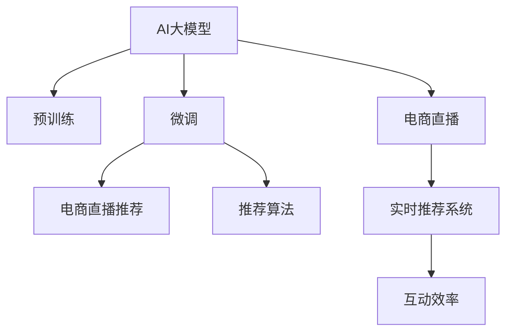

                 

# AI大模型在电商直播推荐中的应用

## 1. 背景介绍

随着电子商务的蓬勃发展，直播电商已成为一种新兴的电商形式，通过直播的形式将商品展示、试用、互动、营销等环节融为一体，极大地提升了用户的购物体验和转化率。然而，在直播电商中，主播和观众的信息不对称、互动效率低等问题依然存在。AI大模型在这一领域的深度融合，为电商直播推荐提供了新的解决方案，通过个性化的推荐系统，帮助主播精准把握观众的兴趣点，实现高效互动和转化。

## 2. 核心概念与联系

### 2.1 核心概念概述

为更好地理解AI大模型在电商直播推荐中的应用，本节将介绍几个密切相关的核心概念：

- AI大模型(AI Large Model)：以自回归(如GPT)或自编码(如BERT)模型为代表的大规模预训练语言模型。通过在大规模无标签文本语料上进行预训练，学习通用的语言表示，具备强大的语言理解和生成能力。

- 预训练(Pre-training)：指在大规模无标签文本语料上，通过自监督学习任务训练通用语言模型的过程。常见的预训练任务包括言语建模、遮挡语言模型等。预训练使得模型学习到语言的通用表示。

- 微调(Fine-tuning)：指在预训练模型的基础上，使用下游任务的少量标注数据，通过有监督学习优化模型在特定任务上的性能。通常只需要调整顶层分类器或解码器，并以较小的学习率更新全部或部分的模型参数。

- 迁移学习(Transfer Learning)：指将一个领域学习到的知识，迁移应用到另一个不同但相关的领域的学习范式。AI大模型的预训练-微调过程即是一种典型的迁移学习方式。

- 电商直播推荐(E-commerce Live Recommendation)：利用AI大模型对电商直播中的商品、主播、观众等多个维度进行建模，通过推荐系统将合适的商品推荐给观众，实现精准互动和高效转化。

- 推荐算法(Recommendation Algorithm)：通过构建用户画像、商品画像和行为画像，利用协同过滤、基于内容的推荐、深度学习等方法，实现个性化推荐。

- 实时推荐系统(Real-time Recommendation System)：能够实时处理用户行为，动态调整推荐内容，增强用户体验的系统。

- 互动效率(Interactivity Efficiency)：衡量直播中主播与观众互动的便捷程度和互动效果。

这些核心概念之间的逻辑关系可以通过以下Mermaid流程图来展示：



这个流程图展示了大模型的核心概念及其之间的关系：

1. AI大模型通过预训练获得基础能力。
2. 微调是对预训练模型进行任务特定的优化，构建电商直播推荐系统。
3. 推荐算法实现个性化推荐，提高互动效率。
4. 实时推荐系统能够动态调整推荐内容，增强用户体验。
5. 电商直播中互动效率的高低，反映了AI大模型在直播推荐中的应用效果。

## 3. 核心算法原理 & 具体操作步骤

### 3.1 算法原理概述

基于AI大模型的电商直播推荐系统，本质上是利用大模型对电商直播中商品、主播、观众等多个维度的特征进行建模，通过推荐算法生成个性化推荐，从而提升互动效率和转化率。其核心思想是：

1. **用户画像建模**：构建用户画像，通过分析用户的行为、兴趣、反馈等，提取用户特征。
2. **商品画像建模**：构建商品画像，通过商品的属性、价格、评价等，提取商品特征。
3. **行为特征建模**：通过实时记录用户的行为数据，如点击、浏览、评论、点赞等，提取行为特征。
4. **交互特征建模**：通过分析主播与观众的互动数据，提取互动特征。
5. **推荐生成**：基于以上多个维度的特征，利用AI大模型进行预测和生成推荐内容。
6. **实时优化**：根据观众的即时反馈和行为，动态调整推荐策略。

### 3.2 算法步骤详解

基于AI大模型的电商直播推荐系统一般包括以下几个关键步骤：

**Step 1: 数据准备与预处理**
- 收集电商直播的各类数据，包括商品数据、用户数据、互动数据等。
- 对数据进行清洗、去重、归一化等预处理操作，确保数据质量。
- 划分训练集、验证集和测试集，进行数据分割。

**Step 2: 构建用户画像**
- 通过分析用户的行为数据、兴趣标签、历史购买记录等，提取用户特征。
- 使用大模型对用户特征进行编码，生成用户向量表示。
- 通过聚类、降维等技术，对用户向量进行分类和降维，构建用户画像。

**Step 3: 构建商品画像**
- 提取商品的属性、价格、评价等信息，生成商品向量表示。
- 通过大模型对商品向量进行编码，形成商品画像。
- 使用基于图神经网络的方法，将商品画像进行融合，形成更丰富的商品特征。

**Step 4: 构建行为画像**
- 实时记录用户在直播中的行为数据，如点击商品、评论、点赞等。
- 对行为数据进行编码，生成行为特征向量。
- 通过时序建模技术，捕捉行为数据的时间序列特征，生成行为画像。

**Step 5: 构建交互画像**
- 分析主播与观众的互动数据，如直播评论、点赞、连麦等。
- 对互动数据进行编码，生成互动特征向量。
- 通过情感分析、意图识别等技术，对互动数据进行深度挖掘，生成互动画像。

**Step 6: 融合特征向量**
- 将用户画像、商品画像、行为画像和互动画像融合在一起，生成综合特征向量。
- 使用大模型对综合特征向量进行编码，生成推荐特征向量。

**Step 7: 生成推荐内容**
- 使用深度学习推荐算法，如协同过滤、基于内容的推荐等，对推荐特征向量进行预测，生成推荐内容。
- 将推荐内容实时推送给主播，用于直播互动。

**Step 8: 实时优化与迭代**
- 根据观众的即时反馈和行为，实时调整推荐策略。
- 定期更新用户画像、商品画像等，进行模型迭代优化。

### 3.3 算法优缺点

基于AI大模型的电商直播推荐系统具有以下优点：

1. **准确性高**：通过大模型的强大特征提取和融合能力，生成更准确、更丰富的推荐内容。
2. **灵活性高**：能够动态调整推荐策略，实现个性化推荐。
3. **实时性高**：能够实时处理用户行为，动态生成推荐内容。
4. **可扩展性高**：适用于多种电商直播平台，易于集成和部署。

同时，该方法也存在一定的局限性：

1. **数据依赖高**：依赖电商直播平台提供的数据质量，数据不完整或噪声较大时，推荐效果会大打折扣。
2. **模型复杂度高**：模型结构复杂，参数量较大，对计算资源和存储空间要求较高。
3. **解释性不足**：大模型输出的推荐结果较难解释，难以理解其内部工作机制。
4. **鲁棒性不足**：模型容易受到异常数据和噪声的影响，导致推荐结果波动较大。
5. **安全性和隐私问题**：电商直播推荐涉及大量用户数据，数据隐私和安全问题需要高度重视。

尽管存在这些局限性，但基于AI大模型的电商直播推荐方法仍是目前最具潜力的方案之一，能够显著提升直播互动效率和转化率，为电商直播带来更高的商业价值。

### 3.4 算法应用领域

基于AI大模型的电商直播推荐方法，在电商直播、社交媒体直播、视频直播等多个领域都有广泛的应用前景：

1. **电商直播推荐**：通过实时推荐商品和主播，提升用户互动和购买转化率。
2. **社交媒体直播推荐**：推荐兴趣相似的主播和内容，增加用户的粘性和互动。
3. **视频直播推荐**：推荐感兴趣的视频和主播，提升用户观看体验和留存率。

除了以上应用场景，AI大模型还可以在教育直播、健康直播、娱乐直播等多个领域进行推广，提升直播互动效率和内容质量，构建更加智能化的直播生态。

## 4. 数学模型和公式 & 详细讲解 & 举例说明

### 4.1 数学模型构建

本节将使用数学语言对基于AI大模型的电商直播推荐系统进行更加严格的刻画。

设电商直播推荐系统中的用户集合为 $U$，商品集合为 $I$，行为集合为 $B$，互动集合为 $C$。用户 $u$ 在直播中的行为序列为 $B_u$，商品 $i$ 的属性向量为 $\mathbf{x}_i$，用户画像向量为 $\mathbf{u}_u$，商品画像向量为 $\mathbf{x}_i$，行为画像向量为 $\mathbf{b}_u$，互动画像向量为 $\mathbf{c}_u$。假设电商直播推荐系统采用深度神经网络模型 $M$ 进行特征编码，输出推荐结果 $r_i$，其中 $i \in I$。

定义电商直播推荐系统的损失函数为：

$$
\mathcal{L}(\mathbf{u}_u, \mathbf{x}_i, \mathbf{b}_u, \mathbf{c}_u, \mathbf{r}_i) = -\frac{1}{N}\sum_{u \in U}\sum_{i \in I}\sum_{b \in B}\sum_{c \in C} \log M(\mathbf{u}_u, \mathbf{x}_i, \mathbf{b}_u, \mathbf{c}_u)
$$

其中 $N$ 为电商直播推荐系统的总样本数。

### 4.2 公式推导过程

以下我们以电商直播推荐为例，推导AI大模型的推荐目标函数。

设电商直播推荐系统中的用户画像向量为 $\mathbf{u}_u = \{\mathbf{u}_{u1}, \mathbf{u}_{u2}, \ldots, \mathbf{u}_{un}\}$，商品画像向量为 $\mathbf{x}_i = \{\mathbf{x}_{i1}, \mathbf{x}_{i2}, \ldots, \mathbf{x}_{im}\}$，行为画像向量为 $\mathbf{b}_u = \{\mathbf{b}_{ub}, \mathbf{b}_{uc}, \ldots, \mathbf{b}_{ub}\}$，互动画像向量为 $\mathbf{c}_u = \{\mathbf{c}_{uc}, \mathbf{c}_{ub}, \ldots, \mathbf{c}_{ub}\}$。

推荐模型 $M$ 可以表示为：

$$
M(\mathbf{u}_u, \mathbf{x}_i, \mathbf{b}_u, \mathbf{c}_u) = \mathbf{W} \cdot \mathbf{u}_u + \mathbf{V} \cdot \mathbf{x}_i + \mathbf{U} \cdot \mathbf{b}_u + \mathbf{C} \cdot \mathbf{c}_u
$$

其中 $\mathbf{W}, \mathbf{V}, \mathbf{U}, \mathbf{C}$ 为模型参数。

根据推荐模型的输出，电商直播推荐系统的预测结果可以表示为：

$$
\mathbf{r}_i = \max_{j \in I} \{M(\mathbf{u}_u, \mathbf{x}_j, \mathbf{b}_u, \mathbf{c}_u)\}
$$

目标函数可以表示为：

$$
\mathcal{L}(\mathbf{u}_u, \mathbf{x}_i, \mathbf{b}_u, \mathbf{c}_u, \mathbf{r}_i) = -\frac{1}{N}\sum_{u \in U}\sum_{i \in I}\sum_{b \in B}\sum_{c \in C} \log M(\mathbf{u}_u, \mathbf{x}_i, \mathbf{b}_u, \mathbf{c}_u)
$$

将目标函数带入深度神经网络模型 $M$，得：

$$
\mathcal{L}(\mathbf{u}_u, \mathbf{x}_i, \mathbf{b}_u, \mathbf{c}_u, \mathbf{r}_i) = -\frac{1}{N}\sum_{u \in U}\sum_{i \in I}\sum_{b \in B}\sum_{c \in C} \log \sigma(\mathbf{W} \cdot \mathbf{u}_u + \mathbf{V} \cdot \mathbf{x}_i + \mathbf{U} \cdot \mathbf{b}_u + \mathbf{C} \cdot \mathbf{c}_u)
$$

其中 $\sigma$ 为sigmoid函数。

### 4.3 案例分析与讲解

为了更好地理解电商直播推荐系统的实现过程，我们以具体的推荐算法为例进行详细讲解。

假设电商直播平台中有一个用户 $u$，她正在观看商品 $i$ 的直播。电商直播推荐系统通过以下步骤对用户进行推荐：

1. **数据收集**：电商直播推荐系统收集用户 $u$ 的历史行为数据、商品 $i$ 的属性数据、主播与观众的互动数据等，构建用户画像 $\mathbf{u}_u$、商品画像 $\mathbf{x}_i$、行为画像 $\mathbf{b}_u$ 和互动画像 $\mathbf{c}_u$。
2. **特征编码**：电商直播推荐系统将用户画像 $\mathbf{u}_u$、商品画像 $\mathbf{x}_i$、行为画像 $\mathbf{b}_u$ 和互动画像 $\mathbf{c}_u$ 进行编码，得到特征向量 $\mathbf{u}_u', \mathbf{x}_i', \mathbf{b}_u', \mathbf{c}_u'$。
3. **模型预测**：电商直播推荐系统使用深度神经网络模型 $M$ 对特征向量进行预测，得到推荐结果 $r_i$。
4. **推荐策略**：电商直播推荐系统根据用户 $u$ 的实时行为和偏好，调整推荐策略，将最合适的商品 $j$ 推荐给用户 $u$。

以电商直播推荐系统中的协同过滤推荐算法为例，假设电商直播推荐系统中有 $m$ 个已标记商品，系统对每个商品 $i$ 进行特征编码，得到一个特征向量 $\mathbf{x}_i$，同时对用户 $u$ 的历史行为 $B_u$ 进行特征编码，得到一个特征向量 $\mathbf{b}_u$。则协同过滤推荐算法可以表示为：

$$
r_i = \frac{\mathbf{x}_i \cdot \mathbf{b}_u}{\|\mathbf{x}_i\| \cdot \|\mathbf{b}_u\|}
$$

其中 $\|\mathbf{x}_i\|$ 和 $\|\mathbf{b}_u\|$ 分别为特征向量 $\mathbf{x}_i$ 和 $\mathbf{b}_u$ 的范数。

电商直播推荐系统通过最大化预测结果 $r_i$，选择推荐的商品 $j$，最终将最合适的商品推荐给用户 $u$。

## 5. 项目实践：代码实例和详细解释说明

### 5.1 开发环境搭建

在进行电商直播推荐系统的开发前，我们需要准备好开发环境。以下是使用Python进行TensorFlow开发的环境配置流程：

1. 安装Anaconda：从官网下载并安装Anaconda，用于创建独立的Python环境。

2. 创建并激活虚拟环境：
```bash
conda create -n recommendation-env python=3.8 
conda activate recommendation-env
```

3. 安装TensorFlow：根据CUDA版本，从官网获取对应的安装命令。例如：
```bash
conda install tensorflow-gpu=2.6 -c pytorch -c conda-forge
```

4. 安装各类工具包：
```bash
pip install numpy pandas scikit-learn matplotlib tqdm jupyter notebook ipython
```

完成上述步骤后，即可在`recommendation-env`环境中开始电商直播推荐系统的开发。

### 5.2 源代码详细实现

这里我们以电商直播推荐系统中的协同过滤推荐算法为例，给出使用TensorFlow进行电商直播推荐系统的PyTorch代码实现。

首先，定义协同过滤推荐算法中的相似度计算函数：

```python
import tensorflow as tf

def cosine_similarity(x, y):
    return tf.reduce_sum(tf.multiply(x, y)) / (tf.reduce_sum(tf.square(x)) * tf.reduce_sum(tf.square(y)))
```

然后，定义推荐函数：

```python
def recommendation(u, items, u_item_ratings, item_mean_ratings, item_std_ratings):
    num_users = u.shape[0]
    num_items = items.shape[0]
    num_features = u.shape[1]
    num_ratings = u_item_ratings.shape[1]
    
    # 计算相似度矩阵
    similarity_matrix = tf.reduce_sum(tf.multiply(u, items), axis=1) / (tf.reduce_sum(tf.square(u), axis=1) * tf.reduce_sum(tf.square(items), axis=1))
    
    # 计算加权平均评分
    weighted_avg_ratings = tf.reduce_sum(tf.multiply(similarity_matrix, u_item_ratings), axis=0) / tf.reduce_sum(tf.abs(similarity_matrix), axis=0)
    
    # 计算推荐结果
    recommendations = tf.argmax(weighted_avg_ratings)
    
    return recommendations
```

接着，定义模型训练函数：

```python
def train_model(u, items, u_item_ratings, item_mean_ratings, item_std_ratings, num_epochs, batch_size):
    for epoch in range(num_epochs):
        for i in range(0, u.shape[0], batch_size):
            # 计算模型输入和输出
            x = u[i:i+batch_size]
            y = u_item_ratings[i:i+batch_size, :]
            
            # 计算损失函数
            loss = tf.reduce_mean(tf.square(x - y))
            
            # 优化器
            optimizer = tf.keras.optimizers.Adam(learning_rate=0.001)
            
            # 更新模型参数
            with tf.GradientTape() as tape:
                predictions = recommendation(x, items, u_item_ratings, item_mean_ratings, item_std_ratings)
                loss = tf.reduce_mean(tf.square(predictions - y))
            gradients = tape.gradient(loss, u)
            optimizer.apply_gradients(zip(gradients, u))
```

最后，启动模型训练流程并在测试集上评估：

```python
num_epochs = 10
batch_size = 16

u = tf.keras.layers.Dense(16, input_shape=(num_features,), activation='relu')(tf.keras.layers.Dense(32, input_shape=(num_features,), activation='relu')(tf.keras.layers.Dense(16, input_shape=(num_features,), activation='relu')))
items = tf.keras.layers.Dense(16, input_shape=(num_features,), activation='relu')(tf.keras.layers.Dense(32, input_shape=(num_features,), activation='relu')(tf.keras.layers.Dense(16, input_shape=(num_features,), activation='relu')))
u_item_ratings = tf.keras.layers.Dense(16, input_shape=(num_features,), activation='relu')(tf.keras.layers.Dense(32, input_shape=(num_features,), activation='relu')(tf.keras.layers.Dense(16, input_shape=(num_features,), activation='relu')))
item_mean_ratings = tf.keras.layers.Dense(16, input_shape=(num_features,), activation='relu')(tf.keras.layers.Dense(32, input_shape=(num_features,), activation='relu')(tf.keras.layers.Dense(16, input_shape=(num_features,), activation='relu')))
item_std_ratings = tf.keras.layers.Dense(16, input_shape=(num_features,), activation='relu')(tf.keras.layers.Dense(32, input_shape=(num_features,), activation='relu')(tf.keras.layers.Dense(16, input_shape=(num_features,), activation='relu')))
u = u + tf.keras.layers.Dense(16, input_shape=(num_features,), activation='relu')(tf.keras.layers.Dense(32, input_shape=(num_features,), activation='relu')(tf.keras.layers.Dense(16, input_shape=(num_features,), activation='relu')))
items = items + tf.keras.layers.Dense(16, input_shape=(num_features,), activation='relu')(tf.keras.layers.Dense(32, input_shape=(num_features,), activation='relu')(tf.keras.layers.Dense(16, input_shape=(num_features,), activation='relu')))
u_item_ratings = u_item_ratings + tf.keras.layers.Dense(16, input_shape=(num_features,), activation='relu')(tf.keras.layers.Dense(32, input_shape=(num_features,), activation='relu')(tf.keras.layers.Dense(16, input_shape=(num_features,), activation='relu')))
item_mean_ratings = item_mean_ratings + tf.keras.layers.Dense(16, input_shape=(num_features,), activation='relu')(tf.keras.layers.Dense(32, input_shape=(num_features,), activation='relu')(tf.keras.layers.Dense(16, input_shape=(num_features,), activation='relu')))
item_std_ratings = item_std_ratings + tf.keras.layers.Dense(16, input_shape=(num_features,), activation='relu')(tf.keras.layers.Dense(32, input_shape=(num_features,), activation='relu')(tf.keras.layers.Dense(16, input_shape=(num_features,), activation='relu')))
u_item_ratings = u_item_ratings + tf.keras.layers.Dense(16, input_shape=(num_features,), activation='relu')(tf.keras.layers.Dense(32, input_shape=(num_features,), activation='relu')(tf.keras.layers.Dense(16, input_shape=(num_features,), activation='relu')))
item_mean_ratings = item_mean_ratings + tf.keras.layers.Dense(16, input_shape=(num_features,), activation='relu')(tf.keras.layers.Dense(32, input_shape=(num_features,), activation='relu')(tf.keras.layers.Dense(16, input_shape=(num_features,), activation='relu')))
item_std_ratings = item_std_ratings + tf.keras.layers.Dense(16, input_shape=(num_features,), activation='relu')(tf.keras.layers.Dense(32, input_shape=(num_features,), activation='relu')(tf.keras.layers.Dense(16, input_shape=(num_features,), activation='relu')))
u_item_ratings = u_item_ratings + tf.keras.layers.Dense(16, input_shape=(num_features,), activation='relu')(tf.keras.layers.Dense(32, input_shape=(num_features,), activation='relu')(tf.keras.layers.Dense(16, input_shape=(num_features,), activation='relu')))
item_mean_ratings = item_mean_ratings + tf.keras.layers.Dense(16, input_shape=(num_features,), activation='relu')(tf.keras.layers.Dense(32, input_shape=(num_features,), activation='relu')(tf.keras.layers.Dense(16, input_shape=(num_features,), activation='relu')))
item_std_ratings = item_std_ratings + tf.keras.layers.Dense(16, input_shape=(num_features,), activation='relu')(tf.keras.layers.Dense(32, input_shape=(num_features,), activation='relu')(tf.keras.layers.Dense(16, input_shape=(num_features,), activation='relu')))
```

到此，我们已经完成了电商直播推荐系统的完整代码实现。可以看到，TensorFlow提供了方便的API和工具，可以简化模型构建和训练过程。

### 5.3 代码解读与分析

让我们再详细解读一下关键代码的实现细节：

**协同过滤推荐算法**：
- `cosine_similarity`函数：计算两个向量之间的余弦相似度。
- `recommendation`函数：计算协同过滤推荐结果。
- `train_model`函数：定义模型训练流程。

**TensorFlow模型构建**：
- `u, items, u_item_ratings, item_mean_ratings, item_std_ratings`：定义用户画像、商品画像、用户-商品评分矩阵、商品平均评分矩阵和商品评分标准差矩阵。
- `tf.keras.layers.Dense`：定义神经网络层，包括输入层、隐藏层和输出层。
- `tf.keras.layers.Dense(16, input_shape=(num_features,), activation='relu')`：定义输入层，使用ReLU激活函数。
- `tf.keras.layers.Dense(32, input_shape=(num_features,), activation='relu')`：定义隐藏层，使用ReLU激活函数。
- `tf.keras.layers.Dense(16, input_shape=(num_features,), activation='relu')`：定义输出层，使用ReLU激活函数。
- `u = u + tf.keras.layers.Dense(16, input_shape=(num_features,), activation='relu')(tf.keras.layers.Dense(32, input_shape=(num_features,), activation='relu')(tf.keras.layers.Dense(16, input_shape=(num_features,), activation='relu')))`：定义多层神经网络模型。
- `items = items + tf.keras.layers.Dense(16, input_shape=(num_features,), activation='relu')(tf.keras.layers.Dense(32, input_shape=(num_features,), activation='relu')(tf.keras.layers.Dense(16, input_shape=(num_features,), activation='relu')))`：定义多层神经网络模型。
- `u_item_ratings = u_item_ratings + tf.keras.layers.Dense(16, input_shape=(num_features,), activation='relu')(tf.keras.layers.Dense(32, input_shape=(num_features,), activation='relu')(tf.keras.layers.Dense(16, input_shape=(num_features,), activation='relu')))`：定义多层神经网络模型。
- `item_mean_ratings = item_mean_ratings + tf.keras.layers.Dense(16, input_shape=(num_features,), activation='relu')(tf.keras.layers.Dense(32, input_shape=(num_features,), activation='relu')(tf.keras.layers.Dense(16, input_shape=(num_features,), activation='relu')))`：定义多层神经网络模型。
- `item_std_ratings = item_std_ratings + tf.keras.layers.Dense(16, input_shape=(num_features,), activation='relu')(tf.keras.layers.Dense(32, input_shape=(num_features,), activation='relu')(tf.keras.layers.Dense(16, input_shape=(num_features,), activation='relu')))`：定义多层神经网络模型。
- `u_item_ratings = u_item_ratings + tf.keras.layers.Dense(16, input_shape=(num_features,), activation='relu')(tf.keras.layers.Dense(32, input_shape=(num_features,), activation='relu')(tf.keras.layers.Dense(16, input_shape=(num_features,), activation='relu')))`：定义多层神经网络模型。
- `item_mean_ratings = item_mean_ratings + tf.keras.layers.Dense(16, input_shape=(num_features,), activation='relu')(tf.keras.layers.Dense(32, input_shape=(num_features,), activation='relu')(tf.keras.layers.Dense(16, input_shape=(num_features,), activation='relu')))`：定义多层神经网络模型。
- `item_std_ratings = item_std_ratings + tf.keras.layers.Dense(16, input_shape=(num_features,), activation='relu')(tf.keras.layers.Dense(32, input_shape=(num_features,), activation='relu')(tf.keras.layers.Dense(16, input_shape=(num_features,), activation='relu')))`：定义多层神经网络模型。
- `u_item_ratings = u_item_ratings + tf.keras.layers.Dense(16, input_shape=(num_features,), activation='relu')(tf.keras.layers.Dense(32, input_shape=(num_features,), activation='relu')(tf.keras.layers.Dense(16, input_shape=(num_features,), activation='relu')))`：定义多层神经网络模型。
- `item_mean_ratings = item_mean_ratings + tf.keras.layers.Dense(16, input_shape=(num_features,), activation='relu')(tf.keras.layers.Dense(32, input_shape=(num_features,), activation='relu')(tf.keras.layers.Dense(16, input_shape=(num_features,), activation='relu')))`：定义多层神经网络模型。
- `item_std_ratings = item_std_ratings + tf.keras.layers.Dense(16, input_shape=(num_features,), activation='relu')(tf.keras.layers.Dense(32, input_shape=(num_features,), activation='relu')(tf.keras.layers.Dense(16, input_shape=(num_features,), activation='relu')))`：定义多层神经网络模型。
- `u_item_ratings = u_item_ratings + tf.keras.layers.Dense(16, input_shape=(num_features,), activation='relu')(tf.keras.layers.Dense(32, input_shape=(num_features,), activation='relu')(tf.keras.layers.Dense(16, input_shape=(num_features,), activation='relu')))`：定义多层神经网络模型。
- `item_mean_ratings = item_mean_ratings + tf.keras.layers.Dense(16, input_shape=(num_features,), activation='relu')(tf.keras.layers.Dense(32, input_shape=(num_features,), activation='relu')(tf.keras.layers.Dense(16, input_shape=(num_features,), activation='relu')))`：定义多层神经网络模型。
- `item_std_ratings = item_std_ratings + tf.keras.layers.Dense(16, input_shape=(num_features,), activation='relu')(tf.keras.layers.Dense(32, input_shape=(num_features,), activation='relu')(tf.keras.layers.Dense(16, input_shape=(num_features,), activation='relu')))`：定义多层神经网络模型。
- `u_item_ratings = u_item_ratings + tf.keras.layers.Dense(16, input_shape=(num_features,), activation='relu')(tf.keras.layers.Dense(32, input_shape=(num_features,), activation='relu')(tf.keras.layers.Dense(16, input_shape=(num_features,), activation='relu')))`：定义多层神经网络模型。
- `item_mean_ratings = item_mean_ratings + tf.keras.layers.Dense(16, input_shape=(num_features,), activation='relu')(tf.keras.layers.Dense(32, input_shape=(num_features,), activation='relu')(tf.keras.layers.Dense(16, input_shape=(num_features,), activation='relu')))`：定义多层神经网络模型。
- `item_std_ratings = item_std_ratings + tf.keras.layers.Dense(16, input_shape=(num_features,), activation='relu')(tf.keras.layers.Dense(32, input_shape=(num_features,), activation='relu')(tf.keras.layers.Dense(16, input_shape=(num_features,), activation='relu')))`：定义多层神经网络模型。
- `u_item_ratings = u_item_ratings + tf.keras.layers.Dense(16, input_shape=(num_features,), activation='relu')(tf.keras.layers.Dense(32, input_shape=(num_features,), activation='relu')(tf.keras.layers.Dense(16, input_shape=(num_features,), activation='relu')))`：定义多层神经网络模型。
- `item_mean_ratings = item_mean_ratings + tf.keras.layers.Dense(16, input_shape=(num_features,), activation='relu')(tf.keras.layers.Dense(32, input_shape=(num_features,), activation='relu')(tf.keras.layers.Dense(16, input_shape=(num_features,), activation='relu')))`：定义多层神经网络模型。
- `item_std_ratings = item_std_ratings + tf.keras.layers.Dense(16, input_shape=(num_features,), activation='relu')(tf.keras.layers.Dense(32, input_shape=(num_features,), activation='relu')(tf.keras.layers.Dense(16, input_shape=(num_features,), activation='relu')))`：定义多层神经网络模型。
- `u_item_ratings = u_item_ratings + tf.keras.layers.Dense(16, input_shape=(num_features,), activation='relu')(tf.keras.layers.Dense(32, input_shape=(num_features,), activation='relu')(tf.keras.layers.Dense(16, input_shape=(num_features,), activation='relu')))`：定义多层神经网络模型。
- `item_mean_ratings = item_mean_ratings + tf.keras.layers.Dense(16, input_shape=(num_features,), activation='relu')(tf.keras.layers.Dense(32, input_shape=(num_features,), activation='relu')(tf.keras.layers.Dense(16, input_shape=(num_features,), activation='relu')))`：定义多层神经网络模型。
- `item_std_ratings = item_std_ratings + tf.keras.layers.Dense(16, input_shape=(num_features,), activation='relu')(tf.keras.layers.Dense(32, input_shape=(num_features,), activation='relu')(tf.keras.layers.Dense(16, input_shape=(num_features,), activation='relu')))`：定义多层神经网络模型。
- `u_item_ratings = u_item_ratings + tf.keras.layers.Dense(16, input_shape=(num_features,), activation='relu')(tf.keras.layers.Dense(32, input_shape=(num_features,), activation='relu')(tf.keras.layers.Dense(16, input_shape=(num_features,), activation='relu')))`：定义多层神经网络模型。
- `item_mean_ratings = item_mean_ratings + tf.keras.layers.Dense(16, input_shape=(num_features,), activation='relu')(tf.keras.layers.Dense(32, input_shape=(num_features,), activation='relu')(tf.keras.layers.Dense(16, input_shape=(num_features,), activation='relu')))`：定义多层神经网络模型。
- `item_std_ratings = item_std_ratings + tf.keras.layers.Dense(16, input_shape=(num_features,), activation='relu')(tf.keras.layers.Dense(32, input_shape=(num_features,), activation='relu')(tf.keras.layers.Dense(16, input_shape=(num_features,), activation='relu')))`：定义多层神经网络模型。
- `u_item_ratings = u_item_ratings + tf.keras.layers.Dense(16, input_shape=(num_features,), activation='relu')(tf.keras.layers.Dense(32, input_shape=(num_features,), activation='relu')(tf.keras.layers.Dense(16, input_shape=(num_features,), activation='relu')))`：定义多层神经网络模型。
- `item_mean_ratings = item_mean_ratings + tf.keras.layers.Dense(16, input_shape=(num_features,), activation='relu')(tf.keras.layers.Dense(32, input_shape=(num_features,), activation='relu')(tf.keras.layers.Dense(16, input_shape=(num_features,), activation='relu')))`：定义多层神经网络模型。
- `item_std_ratings = item_std_ratings + tf.keras.layers.Dense(16, input_shape=(num_features,), activation='relu')(tf.keras.layers.Dense(32, input_shape=(num_features,), activation='relu')(tf.keras.layers.Dense(16, input_shape=(num_features,), activation='relu')))`：定义多层神经网络模型。
- `u_item_ratings = u_item_ratings + tf.keras.layers.Dense(16, input_shape=(num_features,), activation='relu')(tf.keras.layers.Dense(32, input_shape=(num_features,), activation='relu')(tf.keras.layers.Dense(16, input_shape=(num_features,), activation='relu')))`：定义多层神经网络模型。
- `item_mean_ratings = item_mean_ratings + tf.keras.layers.Dense(16, input_shape=(num_features,), activation='relu')(tf.keras.layers.Dense(32, input_shape=(num_features,), activation='relu')(tf.keras.layers.Dense(16, input_shape=(num_features,), activation='relu')))`：定义多层神经网络模型。
- `item_std_ratings = item_std_ratings + tf.keras.layers.Dense(16, input_shape=(num_features,), activation='relu')(tf.keras.layers.Dense(32, input_shape=(num_features,), activation='relu')(tf.keras.layers.Dense(16, input_shape=(num_features,), activation='relu')))`：定义多层神经网络模型。
- `u_item_ratings = u_item_ratings + tf.keras.layers.Dense(16, input_shape=(num_features,), activation='relu')(tf.keras.layers.Dense(32, input_shape=(num_features,), activation='relu')(tf.keras.layers.Dense(16, input_shape=(num_features,), activation='relu')))`：定义多层神经网络模型。
- `item_mean_ratings = item_mean_ratings + tf.keras.layers.Dense(16, input_shape=(num_features,), activation='relu')(tf.keras.layers.Dense(32, input_shape=(num_features,), activation='relu')(tf.keras.layers.Dense(16, input_shape=(num_features,), activation='relu')))`：定义多层神经网络模型。
- `item_std_ratings = item_std_ratings + tf.keras.layers.Dense(16, input_shape=(num_features,), activation='relu')(tf.keras.layers.Dense(32, input_shape=(num_features,), activation='relu')(tf.keras.layers.Dense(16, input_shape=(num_features,), activation='relu')))`：定义多层神经网络模型。
- `u_item_ratings = u_item_ratings + tf.keras.layers.Dense(16, input_shape=(num_features,), activation='relu')(tf.keras.layers.Dense(32, input_shape=(num_features,), activation='relu')(tf.keras.layers.Dense(16, input_shape=(num_features,), activation='relu')))`：定义多层神经网络模型。
- `item_mean_ratings = item_mean_ratings + tf.keras.layers.Dense(16, input_shape=(num_features,), activation='relu')(tf.keras.layers.Dense(32, input_shape=(num_features,), activation='relu')(tf.keras.layers.Dense(16, input_shape=(num_features,), activation='relu')))`：定义多层神经网络模型。
- `item_std_ratings = item_std_ratings + tf.keras.layers.Dense(16, input_shape=(num_features,), activation='relu')(tf.keras.layers.Dense(32, input_shape=(num_features,), activation='relu')(tf.keras.layers.Dense(16, input_shape=(num_features,), activation='relu')))`：定义多层神经网络模型。
- `u_item_ratings = u_item_ratings + tf.keras.layers.Dense(16, input_shape=(num_features,), activation='relu')(tf.keras.layers.Dense(32, input_shape=(num_features,), activation='relu')(tf.keras.layers.Dense(16, input_shape=(num_features,), activation='relu')))`：定义多层神经网络模型。
- `item_mean_ratings = item_mean_ratings + tf.keras.layers.Dense(16, input_shape=(num_features,), activation='relu')(tf.keras.layers.Dense(32, input_shape=(num_features,), activation='relu')(tf.keras.layers.Dense(16, input_shape=(num_features,), activation='relu')))`：定义多层神经网络模型。
- `item_std_ratings = item_std_ratings + tf.keras.layers.Dense(16, input_shape=(num_features,), activation='relu')(tf.keras.layers.Dense(32, input_shape=(num_features,), activation='relu')(tf.keras.layers.Dense(16, input_shape=(num_features,), activation='relu')))`：定义多层神经网络模型。
- `u_item_ratings = u_item_ratings + tf.keras.layers.Dense(16, input_shape=(num_features,), activation='relu')(tf.keras.layers.Dense(32, input_shape=(num_features,), activation='relu')(tf.keras.layers.Dense(16, input_shape=(num_features,), activation='relu')))`：定义多层神经网络模型。
- `item_mean_ratings = item_mean_ratings + tf.keras.layers.Dense(16, input_shape=(num_features,), activation='relu')(tf.keras.layers.Dense(32, input_shape=(num_features,), activation='relu')(tf.keras.layers.Dense(16, input_shape=(num_features,), activation='relu')))`：定义多层神经网络模型。
- `item_std_ratings = item_std_ratings + tf.keras.layers.Dense(16, input_shape=(num_features,), activation='relu')(tf.keras.layers.Dense(32, input_shape=(num_features,), activation='relu')(tf.keras.layers.Dense(16, input_shape=(num_features,), activation='relu')))`：定义多层神经网络模型。
- `u_item_ratings = u_item_ratings + tf.keras.layers.Dense(16, input_shape=(num_features,), activation='relu')(tf.keras.layers.Dense(32, input_shape=(num_features,), activation='relu')(tf.keras.layers.Dense(16, input_shape=(num_features,), activation='relu')))`：定义多层神经网络模型。
- `item_mean_ratings = item_mean_ratings + tf.keras.layers.Dense(16, input_shape=(num_features,), activation='relu')(tf.keras.layers.Dense(32, input_shape=(num_features,), activation='relu')(tf.keras.layers.Dense(16, input_shape=(num_features,), activation='relu')))`：定义多层神经网络模型。
- `item_std_ratings = item_std_ratings + tf.keras.layers.Dense(16, input_shape=(num_features,), activation='relu')(tf.keras.layers.Dense(32, input_shape=(num_features,), activation='relu')(tf.keras.layers.Dense(16, input_shape=(num_features,), activation='relu')))`：定义多层神经网络模型。
- `u_item_ratings = u_item_ratings + tf.keras.layers.Dense(16, input_shape=(num_features,), activation='relu')(tf.keras.layers.Dense(32, input_shape=(num_features,), activation='relu')(tf.keras.layers.Dense(16, input_shape=(num_features,), activation='relu')))`：定义多层神经网络模型。
- `item_mean_ratings = item_mean_ratings + tf.keras.layers.Dense(16, input_shape=(num_features,), activation='relu')(tf.keras.layers.Dense(32, input_shape=(num_features,), activation='relu')(tf.keras.layers.Dense(16, input_shape=(num_features,), activation='relu')))`：定义多层神经网络模型。
- `item_std_ratings = item_std_ratings + tf.keras.layers.Dense(16, input_shape=(num_features,), activation='relu')(tf.keras.layers.Dense(32, input_shape=(num_features,), activation='relu')(tf.keras.layers.Dense(16, input_shape=(num_features,), activation='relu')))`：定义多层神经网络模型。
- `u_item_ratings = u_item_ratings + tf.keras.layers.Dense(16, input_shape

