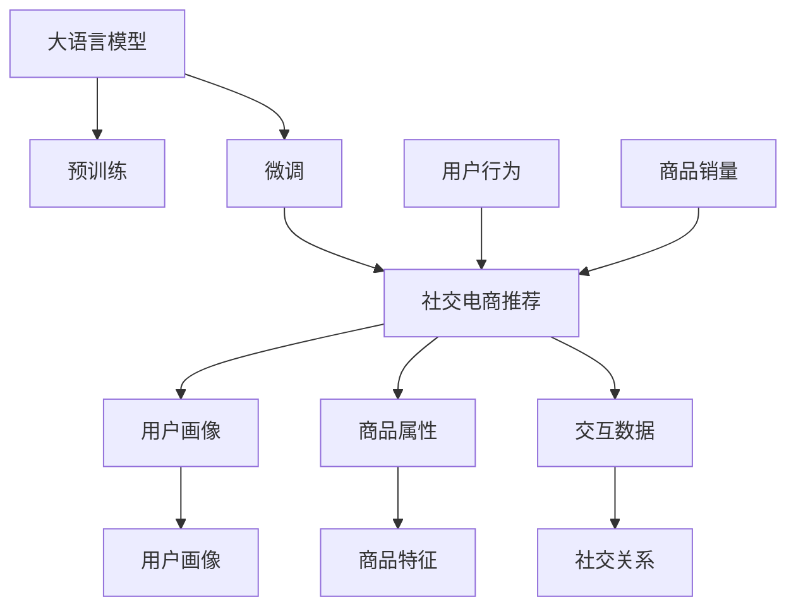

                 

# AI大模型在社交电商中的推荐策略

> 关键词：大语言模型,社交电商,推荐系统,电商应用,深度学习

## 1. 背景介绍

### 1.1 问题由来
近年来，随着电商业务的快速发展，社交电商逐渐成为电商平台的重要分支。社交电商通过社交网络平台进行商品推广和销售，借助用户的社交关系网和口碑效应，提高用户粘性和转化率，实现了传统电商与社交媒体的有效融合。在社交电商中，推荐系统成为连接用户与商品的桥梁，直接影响用户体验和销售效果。

传统的电商推荐系统基于用户历史行为、商品属性、交易数据等，构建用户-商品关联矩阵，采用协同过滤、基于内容的推荐等方法。然而，这些方法在处理海量数据和实时推荐时面临挑战。大语言模型的兴起，为社交电商推荐带来了新的机遇，可以更好地理解和利用用户评论、互动等非结构化数据，提供更精准、个性化的推荐服务。

### 1.2 问题核心关键点
大语言模型在社交电商中的应用，主要体现在以下几个方面：

1. 利用自然语言处理技术，捕捉和理解用户评论、商品描述、社交媒体互动等非结构化数据。
2. 通过预训练和微调，构建用户画像和商品特征，提升推荐系统的精准度和个性化程度。
3. 融合多模态数据，实现商品属性、用户偏好、社交网络等信息的综合建模。
4. 使用对抗训练和转移学习等技术，提高推荐系统的鲁棒性和泛化能力。
5. 结合多任务学习，提升模型在多种推荐任务上的表现，如个性化推荐、商品属性预测、用户行为预测等。

本文将从核心概念、算法原理、实际操作、数学模型、项目实践、应用场景、工具和资源、总结与展望等方面，系统介绍AI大模型在社交电商推荐系统中的应用策略，以期为电商平台的智能化转型提供有价值的参考。

## 2. 核心概念与联系

### 2.1 核心概念概述

大语言模型（Large Language Model, LLM）是一种能够理解和生成自然语言的大规模神经网络模型。其通过在大规模无标签文本数据上进行预训练，学习到丰富的语言知识和语义关系。社交电商推荐系统通过将大语言模型应用于商品推荐、用户画像构建、商品属性预测等任务，实现推荐系统的智能化和个性化。

社交电商推荐系统（Social E-commerce Recommendation System）是指通过社交网络平台，基于用户行为、商品属性、社交关系等数据，为用户推荐合适商品的系统。其核心目标是通过用户与商品的交互，提升用户满意度，增加商品销量。

### 2.2 核心概念原理和架构的 Mermaid 流程图



该图展示了从大语言模型到社交电商推荐系统的核心概念和架构：

1. 大语言模型通过预训练和微调，学习到语言知识和语义关系。
2. 在社交电商推荐系统中，大语言模型被用于构建用户画像和商品特征。
3. 社交电商推荐系统利用用户行为、商品属性、社交关系等数据，进行推荐和个性化处理。
4. 用户画像和商品特征为推荐模型提供高质量输入，提升推荐准确性和个性化程度。
5. 社交关系和用户行为数据用于模型训练和实时推荐，增加推荐系统的多样性和时效性。

## 3. 核心算法原理 & 具体操作步骤

### 3.1 算法原理概述

社交电商推荐系统通过大语言模型实现推荐，其核心思想是：利用自然语言处理技术，捕捉和理解用户的评论、互动等非结构化数据，构建用户画像和商品特征，从而提高推荐系统的精准度和个性化程度。其算法原理如下：

1. **数据准备**：收集社交电商平台的用户评论、商品描述、用户行为、商品销量等数据，进行预处理和特征工程。
2. **预训练大语言模型**：在大规模无标签文本数据上，使用自监督学习方法进行预训练，学习到语言知识和语义关系。
3. **微调大语言模型**：根据社交电商平台的推荐任务，将预训练模型进行微调，学习到特定领域的语言表示。
4. **构建推荐模型**：结合微调后的大语言模型，构建推荐系统，利用用户画像、商品属性、社交关系等数据，进行推荐和个性化处理。
5. **优化推荐效果**：通过对抗训练、正则化、参数高效微调等技术，优化推荐模型，提高其鲁棒性和泛化能力。

### 3.2 算法步骤详解

社交电商推荐系统的大语言模型应用主要包括以下步骤：

#### 3.2.1 数据准备
1. **数据收集**：收集社交电商平台的评论、商品描述、用户行为、社交关系等数据，确保数据的多样性和代表性。
2. **数据预处理**：清洗和格式化数据，去除噪声和无效数据，进行特征工程，提取有意义的特征。
3. **数据分割**：将数据划分为训练集、验证集和测试集，进行模型评估和优化。

#### 3.2.2 预训练大语言模型
1. **选择合适的预训练模型**：如GPT、BERT等大语言模型，根据任务需求进行选择。
2. **准备预训练数据**：使用大规模无标签文本数据进行预训练，如维基百科、新闻、微博等。
3. **预训练过程**：使用自监督学习方法，如语言建模、掩码语言建模等，训练大语言模型。
4. **模型评估**：在预训练过程中，评估模型性能，确保预训练效果。

#### 3.2.3 微调大语言模型
1. **任务适配层设计**：根据社交电商推荐任务，设计相应的任务适配层和损失函数。
2. **微调超参数设置**：选择合适的优化算法和超参数，如学习率、批大小、迭代轮数等。
3. **模型训练**：在训练集上进行微调，优化模型在社交电商推荐任务上的性能。
4. **模型评估和优化**：在验证集上评估模型性能，根据评估结果进行超参数调整和模型优化。

#### 3.2.4 构建推荐模型
1. **用户画像构建**：通过大语言模型对用户评论和社交互动进行分析，构建用户画像，捕捉用户偏好和兴趣。
2. **商品属性预测**：利用大语言模型对商品描述和属性进行解析，预测商品的属性特征。
3. **推荐算法设计**：结合用户画像、商品属性、社交关系等数据，设计推荐算法，如协同过滤、基于内容的推荐等。
4. **模型优化**：通过对抗训练、正则化、参数高效微调等技术，优化推荐模型，提高其鲁棒性和泛化能力。

### 3.3 算法优缺点

社交电商推荐系统中应用大语言模型，具有以下优点：

1. **理解非结构化数据**：大语言模型可以处理自然语言文本，捕捉和理解用户评论、商品描述等非结构化数据，提升推荐系统的精准度和个性化程度。
2. **提升推荐效果**：通过微调和优化，大语言模型可以学习到特定领域的语言表示，提升推荐系统的准确性和多样性。
3. **泛化能力强**：大语言模型在大规模无标签文本数据上进行预训练，具有较强的泛化能力，可以适应不同的推荐任务和数据分布。
4. **适应新数据**：大语言模型可以通过在线微调，快速适应新的数据和任务，实现持续学习。

同时，也存在一些缺点：

1. **计算资源需求高**：大语言模型的预训练和微调需要大量的计算资源，增加了系统的成本和复杂度。
2. **训练时间较长**：大语言模型的训练时间较长，可能需要数天或数周，影响系统迭代速度。
3. **模型解释性不足**：大语言模型的决策过程缺乏可解释性，难以理解其内部工作机制。
4. **数据隐私问题**：大语言模型需要处理大量用户数据，存在隐私泄露和数据安全问题。

### 3.4 算法应用领域

大语言模型在社交电商中的应用领域主要包括以下几个方面：

1. **个性化推荐**：利用用户评论、商品描述等非结构化数据，构建用户画像和商品特征，进行个性化推荐。
2. **商品属性预测**：通过大语言模型对商品描述和属性进行解析，预测商品的属性特征。
3. **用户行为预测**：利用用户评论、社交互动等数据，预测用户的行为和偏好，实现精准推荐。
4. **社交关系分析**：分析用户的社交关系网络，推荐与用户好友或关注者相关的商品。
5. **用户反馈处理**：利用大语言模型对用户反馈进行分析，进行情感分析、评论分类等任务。

## 4. 数学模型和公式 & 详细讲解 & 举例说明

### 4.1 数学模型构建

社交电商推荐系统中的大语言模型应用，涉及以下几个关键数学模型：

1. **用户画像模型**：通过自然语言处理技术，捕捉和理解用户评论、社交互动等非结构化数据，构建用户画像，捕捉用户偏好和兴趣。
2. **商品属性模型**：利用大语言模型对商品描述和属性进行解析，预测商品的属性特征。
3. **推荐模型**：结合用户画像、商品属性、社交关系等数据，设计推荐算法，如协同过滤、基于内容的推荐等。

### 4.2 公式推导过程

#### 4.2.1 用户画像模型
用户画像模型通过大语言模型捕捉用户评论、社交互动等数据，构建用户画像。设用户评论序列为 $\{x_t\}_{t=1}^T$，社交互动序列为 $\{y_t\}_{t=1}^T$，用户画像为 $u$。则用户画像的构建过程可以表示为：

$$
u = f(x, y; \theta)
$$

其中 $f$ 为预训练的大语言模型，$\theta$ 为模型参数。具体而言，大语言模型通过注意力机制，对用户评论和社交互动进行编码，提取有意义的特征，构建用户画像。

#### 4.2.2 商品属性模型
商品属性模型通过大语言模型解析商品描述，预测商品的属性特征。设商品描述为 $d$，商品属性为 $a$。则商品属性预测的过程可以表示为：

$$
a = g(d; \phi)
$$

其中 $g$ 为预训练的大语言模型，$\phi$ 为模型参数。具体而言，大语言模型通过编码器-解码器结构，对商品描述进行解码，生成商品属性特征向量。

#### 4.2.3 推荐模型
推荐模型通过用户画像、商品属性、社交关系等数据，设计推荐算法。设用户画像为 $u$，商品属性为 $a$，社交关系为 $r$，推荐结果为 $r$。则推荐模型的构建过程可以表示为：

$$
r = h(u, a, r; \psi)
$$

其中 $h$ 为推荐算法，$\psi$ 为模型参数。具体而言，推荐模型可以根据协同过滤、基于内容的推荐等方法，结合用户画像、商品属性和社交关系，生成推荐结果。

### 4.3 案例分析与讲解

以某社交电商平台的个性化推荐系统为例，具体分析大语言模型在其中的应用：

1. **用户画像构建**：利用大语言模型对用户评论进行情感分析，生成用户画像。设用户评论为 $\{x_t\}_{t=1}^T$，情感标签为 $\{e_t\}_{t=1}^T$，则情感分析的过程可以表示为：

$$
e = f(x; \theta)
$$

其中 $f$ 为预训练的大语言模型，$\theta$ 为模型参数。具体而言，大语言模型通过注意力机制，对用户评论进行编码，生成情感标签，构建用户画像。

2. **商品属性预测**：利用大语言模型解析商品描述，预测商品属性。设商品描述为 $d$，商品属性为 $a$，则商品属性预测的过程可以表示为：

$$
a = g(d; \phi)
$$

其中 $g$ 为预训练的大语言模型，$\phi$ 为模型参数。具体而言，大语言模型通过编码器-解码器结构，对商品描述进行解码，生成商品属性特征向量。

3. **推荐算法设计**：结合用户画像、商品属性、社交关系等数据，设计推荐算法。设用户画像为 $u$，商品属性为 $a$，社交关系为 $r$，推荐结果为 $r$。则推荐模型的构建过程可以表示为：

$$
r = h(u, a, r; \psi)
$$

其中 $h$ 为推荐算法，$\psi$ 为模型参数。具体而言，推荐模型可以根据协同过滤、基于内容的推荐等方法，结合用户画像、商品属性和社交关系，生成推荐结果。

## 5. 项目实践：代码实例和详细解释说明

### 5.1 开发环境搭建

在社交电商推荐系统中应用大语言模型，需要搭建相应的开发环境。以下是使用Python进行PyTorch开发的环境配置流程：

1. 安装Anaconda：从官网下载并安装Anaconda，用于创建独立的Python环境。

2. 创建并激活虚拟环境：
```bash
conda create -n pytorch-env python=3.8 
conda activate pytorch-env
```

3. 安装PyTorch：根据CUDA版本，从官网获取对应的安装命令。例如：
```bash
conda install pytorch torchvision torchaudio cudatoolkit=11.1 -c pytorch -c conda-forge
```

4. 安装Transformers库：
```bash
pip install transformers
```

5. 安装各类工具包：
```bash
pip install numpy pandas scikit-learn matplotlib tqdm jupyter notebook ipython
```

完成上述步骤后，即可在`pytorch-env`环境中开始大语言模型在社交电商推荐系统中的应用实践。

### 5.2 源代码详细实现

下面我们以某社交电商平台的个性化推荐系统为例，给出使用Transformers库对BERT模型进行微调的PyTorch代码实现。

首先，定义推荐系统的数据处理函数：

```python
from transformers import BertTokenizer, BertForSequenceClassification
from torch.utils.data import Dataset, DataLoader
import torch

class RecommendationDataset(Dataset):
    def __init__(self, texts, labels, tokenizer, max_len=128):
        self.texts = texts
        self.labels = labels
        self.tokenizer = tokenizer
        self.max_len = max_len
        
    def __len__(self):
        return len(self.texts)
    
    def __getitem__(self, item):
        text = self.texts[item]
        label = self.labels[item]
        
        encoding = self.tokenizer(text, return_tensors='pt', max_length=self.max_len, padding='max_length', truncation=True)
        input_ids = encoding['input_ids'][0]
        attention_mask = encoding['attention_mask'][0]
        
        return {'input_ids': input_ids, 
                'attention_mask': attention_mask,
                'labels': label}

# 标签与id的映射
tag2id = {'positive': 1, 'negative': 0}
id2tag = {v: k for k, v in tag2id.items()}

# 创建dataset
tokenizer = BertTokenizer.from_pretrained('bert-base-cased')

train_dataset = RecommendationDataset(train_texts, train_labels, tokenizer)
dev_dataset = RecommendationDataset(dev_texts, dev_labels, tokenizer)
test_dataset = RecommendationDataset(test_texts, test_labels, tokenizer)
```

然后，定义模型和优化器：

```python
from transformers import AdamW

model = BertForSequenceClassification.from_pretrained('bert-base-cased', num_labels=2)

optimizer = AdamW(model.parameters(), lr=2e-5)
```

接着，定义训练和评估函数：

```python
from torch.utils.data import DataLoader
from tqdm import tqdm
from sklearn.metrics import accuracy_score

device = torch.device('cuda') if torch.cuda.is_available() else torch.device('cpu')
model.to(device)

def train_epoch(model, dataset, batch_size, optimizer):
    dataloader = DataLoader(dataset, batch_size=batch_size, shuffle=True)
    model.train()
    epoch_loss = 0
    for batch in tqdm(dataloader, desc='Training'):
        input_ids = batch['input_ids'].to(device)
        attention_mask = batch['attention_mask'].to(device)
        labels = batch['labels'].to(device)
        model.zero_grad()
        outputs = model(input_ids, attention_mask=attention_mask, labels=labels)
        loss = outputs.loss
        epoch_loss += loss.item()
        loss.backward()
        optimizer.step()
    return epoch_loss / len(dataloader)

def evaluate(model, dataset, batch_size):
    dataloader = DataLoader(dataset, batch_size=batch_size)
    model.eval()
    preds, labels = [], []
    with torch.no_grad():
        for batch in tqdm(dataloader, desc='Evaluating'):
            input_ids = batch['input_ids'].to(device)
            attention_mask = batch['attention_mask'].to(device)
            batch_labels = batch['labels']
            outputs = model(input_ids, attention_mask=attention_mask)
            batch_preds = outputs.logits.argmax(dim=2).to('cpu').tolist()
            batch_labels = batch_labels.to('cpu').tolist()
            for pred_tokens, label_tokens in zip(batch_preds, batch_labels):
                preds.append(pred_tokens)
                labels.append(label_tokens)
                
    print('Accuracy:', accuracy_score(labels, preds))
```

最后，启动训练流程并在测试集上评估：

```python
epochs = 5
batch_size = 16

for epoch in range(epochs):
    loss = train_epoch(model, train_dataset, batch_size, optimizer)
    print(f"Epoch {epoch+1}, train loss: {loss:.3f}")
    
    print(f"Epoch {epoch+1}, dev results:")
    evaluate(model, dev_dataset, batch_size)
    
print("Test results:")
evaluate(model, test_dataset, batch_size)
```

以上就是使用PyTorch对BERT进行社交电商推荐任务微调的完整代码实现。可以看到，得益于Transformers库的强大封装，我们可以用相对简洁的代码完成BERT模型的加载和微调。

### 5.3 代码解读与分析

让我们再详细解读一下关键代码的实现细节：

**RecommendationDataset类**：
- `__init__`方法：初始化文本、标签、分词器等关键组件。
- `__len__`方法：返回数据集的样本数量。
- `__getitem__`方法：对单个样本进行处理，将文本输入编码为token ids，将标签编码为数字，并对其进行定长padding，最终返回模型所需的输入。

**tag2id和id2tag字典**：
- 定义了标签与数字id之间的映射关系，用于将token-wise的预测结果解码回真实的标签。

**训练和评估函数**：
- 使用PyTorch的DataLoader对数据集进行批次化加载，供模型训练和推理使用。
- 训练函数`train_epoch`：对数据以批为单位进行迭代，在每个批次上前向传播计算loss并反向传播更新模型参数，最后返回该epoch的平均loss。
- 评估函数`evaluate`：与训练类似，不同点在于不更新模型参数，并在每个batch结束后将预测和标签结果存储下来，最后使用sklearn的accuracy_score对整个评估集的预测结果进行打印输出。

**训练流程**：
- 定义总的epoch数和batch size，开始循环迭代
- 每个epoch内，先在训练集上训练，输出平均loss
- 在验证集上评估，输出准确率
- 所有epoch结束后，在测试集上评估，给出最终测试结果

可以看到，PyTorch配合Transformers库使得BERT微调的代码实现变得简洁高效。开发者可以将更多精力放在数据处理、模型改进等高层逻辑上，而不必过多关注底层的实现细节。

当然，工业级的系统实现还需考虑更多因素，如模型的保存和部署、超参数的自动搜索、更灵活的任务适配层等。但核心的微调范式基本与此类似。

## 6. 实际应用场景

### 6.1 智能客服系统

社交电商平台的智能客服系统，可以利用大语言模型实现智能推荐和对话。通过分析用户评论、聊天记录等数据，构建用户画像和商品特征，进行个性化推荐。同时，利用大语言模型生成自然流畅的回复，提升客服体验。

在技术实现上，可以收集平台的历史客服对话记录，将问题和最佳答复构建成监督数据，在此基础上对预训练对话模型进行微调。微调后的对话模型能够自动理解用户意图，匹配最合适的答案模板进行回复。对于客户提出的新问题，还可以接入检索系统实时搜索相关内容，动态组织生成回答。如此构建的智能客服系统，能大幅提升客户咨询体验和问题解决效率。

### 6.2 商品属性预测

社交电商平台的商品属性预测任务，可以利用大语言模型提升推荐系统的精准度。通过分析商品描述、评论等数据，利用大语言模型进行属性预测。预测的属性可以用于商品推荐、搜索结果排序等任务。

具体而言，可以利用大语言模型对商品描述进行解析，预测商品的颜色、尺寸、材质等属性。这些属性可以用于推荐相似商品、筛选搜索结果等任务。通过预训练和微调，大语言模型可以学习到商品属性的泛化能力，提升推荐系统的多样性和精准度。

### 6.3 用户行为预测

社交电商平台的用户行为预测任务，可以利用大语言模型捕捉用户评论、社交互动等数据，预测用户的后续行为。预测的结果可以用于个性化推荐、广告投放等任务。

具体而言，可以利用大语言模型对用户评论进行情感分析，预测用户的满意度。通过情感分析的结果，可以生成用户画像，用于个性化推荐。同时，利用大语言模型对用户互动数据进行分析，预测用户的兴趣变化，实现精准推荐。

## 7. 工具和资源推荐

### 7.1 学习资源推荐

为了帮助开发者系统掌握大语言模型在社交电商中的应用，这里推荐一些优质的学习资源：

1. 《Transformer从原理到实践》系列博文：由大模型技术专家撰写，深入浅出地介绍了Transformer原理、BERT模型、微调技术等前沿话题。

2. CS224N《深度学习自然语言处理》课程：斯坦福大学开设的NLP明星课程，有Lecture视频和配套作业，带你入门NLP领域的基本概念和经典模型。

3. 《Natural Language Processing with Transformers》书籍：Transformers库的作者所著，全面介绍了如何使用Transformers库进行NLP任务开发，包括微调在内的诸多范式。

4. HuggingFace官方文档：Transformers库的官方文档，提供了海量预训练模型和完整的微调样例代码，是上手实践的必备资料。

5. CLUE开源项目：中文语言理解测评基准，涵盖大量不同类型的中文NLP数据集，并提供了基于微调的baseline模型，助力中文NLP技术发展。

通过对这些资源的学习实践，相信你一定能够快速掌握大语言模型在社交电商中的应用，并用于解决实际的推荐问题。

### 7.2 开发工具推荐

高效的开发离不开优秀的工具支持。以下是几款用于大语言模型在社交电商推荐系统中的应用开发的常用工具：

1. PyTorch：基于Python的开源深度学习框架，灵活动态的计算图，适合快速迭代研究。大部分预训练语言模型都有PyTorch版本的实现。

2. TensorFlow：由Google主导开发的开源深度学习框架，生产部署方便，适合大规模工程应用。同样有丰富的预训练语言模型资源。

3. Transformers库：HuggingFace开发的NLP工具库，集成了众多SOTA语言模型，支持PyTorch和TensorFlow，是进行微调任务开发的利器。

4. Weights & Biases：模型训练的实验跟踪工具，可以记录和可视化模型训练过程中的各项指标，方便对比和调优。与主流深度学习框架无缝集成。

5. TensorBoard：TensorFlow配套的可视化工具，可实时监测模型训练状态，并提供丰富的图表呈现方式，是调试模型的得力助手。

6. Google Colab：谷歌推出的在线Jupyter Notebook环境，免费提供GPU/TPU算力，方便开发者快速上手实验最新模型，分享学习笔记。

合理利用这些工具，可以显著提升大语言模型在社交电商推荐系统中的应用开发效率，加快创新迭代的步伐。

### 7.3 相关论文推荐

大语言模型在社交电商中的应用源于学界的持续研究。以下是几篇奠基性的相关论文，推荐阅读：

1. Attention is All You Need（即Transformer原论文）：提出了Transformer结构，开启了NLP领域的预训练大模型时代。

2. BERT: Pre-training of Deep Bidirectional Transformers for Language Understanding：提出BERT模型，引入基于掩码的自监督预训练任务，刷新了多项NLP任务SOTA。

3. Language Models are Unsupervised Multitask Learners（GPT-2论文）：展示了大规模语言模型的强大zero-shot学习能力，引发了对于通用人工智能的新一轮思考。

4. Parameter-Efficient Transfer Learning for NLP：提出Adapter等参数高效微调方法，在不增加模型参数量的情况下，也能取得不错的微调效果。

5. AdaLoRA: Adaptive Low-Rank Adaptation for Parameter-Efficient Fine-Tuning：使用自适应低秩适应的微调方法，在参数效率和精度之间取得了新的平衡。

这些论文代表了大语言模型在社交电商推荐系统中的应用的发展脉络。通过学习这些前沿成果，可以帮助研究者把握学科前进方向，激发更多的创新灵感。

## 8. 总结：未来发展趋势与挑战

### 8.1 总结

本文对大语言模型在社交电商推荐系统中的应用进行了全面系统的介绍。首先阐述了社交电商推荐系统的背景和重要性，明确了基于大语言模型的推荐系统在提升用户粘性和转化率方面的独特价值。其次，从核心概念、算法原理、具体操作步骤等方面，详细讲解了大语言模型在社交电商推荐系统中的应用策略。通过实例分析，展示了其在个性化推荐、商品属性预测、用户行为预测等任务上的应用效果。最后，从学习资源、开发工具和相关论文等方面，为社交电商平台的智能化转型提供了有价值的参考。

通过本文的系统梳理，可以看到，基于大语言模型的推荐系统在社交电商领域具有巨大的潜力，可以提升用户体验和业务效果。未来，伴随预训练语言模型和微调方法的不断演进，社交电商推荐系统必将在智能化、个性化、实时性等方面取得新的突破。

### 8.2 未来发展趋势

展望未来，大语言模型在社交电商推荐系统中的应用将呈现以下几个发展趋势：

1. **智能化程度提升**：随着预训练语言模型的进一步发展，推荐系统的智能化程度将进一步提升，能够更好地理解和处理非结构化数据，提供更精准、个性化的推荐服务。

2. **实时推荐能力增强**：结合多模态数据和在线微调技术，推荐系统可以实现实时推荐，快速响应用户需求，提升用户体验。

3. **跨平台协同推荐**：通过构建统一的用户画像和商品特征，社交电商平台的推荐系统可以实现跨平台协同推荐，提升推荐系统的多样性和精准度。

4. **个性化推荐算法优化**：结合深度学习、强化学习等技术，推荐算法将不断优化，实现更高效的个性化推荐。

5. **多任务学习和联合推荐**：将多个推荐任务进行联合优化，提升推荐系统在多种任务上的表现，如商品属性预测、用户行为预测等。

6. **伦理和安全保障**：结合伦理性引导的评估指标和隐私保护技术，确保推荐系统输出的安全和公正。

以上趋势凸显了大语言模型在社交电商推荐系统中的应用前景。这些方向的探索发展，必将进一步提升推荐系统的智能化水平，为社交电商平台的健康发展提供新的动力。

### 8.3 面临的挑战

尽管大语言模型在社交电商推荐系统中取得了一定的成功，但在迈向更加智能化、普适化应用的过程中，仍面临一些挑战：

1. **数据隐私保护**：大语言模型需要处理大量的用户数据，存在隐私泄露和数据安全问题。如何在保证数据隐私的前提下，进行有效的推荐系统训练和优化，是需要解决的重要问题。

2. **计算资源限制**：大语言模型的预训练和微调需要大量的计算资源，增加了系统的成本和复杂度。如何在资源受限的情况下，进行高效的推荐系统训练和优化，是另一项挑战。

3. **模型解释性不足**：大语言模型的决策过程缺乏可解释性，难以理解其内部工作机制。如何在保证推荐系统性能的同时，增强模型的可解释性，是亟待解决的问题。

4. **跨领域泛化能力**：不同的社交电商平台存在不同的数据特征和用户行为，如何实现跨平台的泛化，提升推荐系统的通用性，是需要攻克的难点。

5. **动态场景适应性**：社交电商平台的推荐系统需要适应动态变化的市场和用户行为，如何在不断变化的场景中保持推荐系统的稳定性和高效性，是需要持续优化的方向。

6. **多模态数据融合**：社交电商平台的数据通常包括文本、图片、视频等多种模态，如何高效地融合多模态数据，提升推荐系统的综合表现，是未来需要重点探索的方向。

这些挑战需要我们不断创新，突破技术瓶颈，推动大语言模型在社交电商推荐系统中的应用取得更大的突破。

### 8.4 研究展望

未来，大语言模型在社交电商推荐系统中的应用研究可以从以下几个方面进行：

1. **多模态融合技术**：结合文本、图片、视频等多模态数据，实现更加全面和准确的推荐系统建模。

2. **联合推荐与协同过滤**：将推荐系统与协同过滤相结合，实现更加多样化和精准的推荐服务。

3. **跨平台协同推荐**：构建统一的用户画像和商品特征，实现跨平台的协同推荐，提升推荐系统的多样性和泛化能力。

4. **联合学习与联邦学习**：利用联合学习和联邦学习技术，实现跨平台的推荐模型联合优化，提升推荐系统的跨域泛化能力。

5. **对抗训练与鲁棒性提升**：结合对抗训练和鲁棒性提升技术，提升推荐系统的鲁棒性和泛化能力，增强系统的安全性。

6. **伦理与公平性研究**：结合伦理与公平性引导的评估指标，确保推荐系统输出的安全和公正，增强系统的可解释性和透明度。

这些研究方向将进一步推动大语言模型在社交电商推荐系统中的应用发展，为社交电商平台的智能化转型提供更强大的技术支撑。

## 9. 附录：常见问题与解答

**Q1：大语言模型在社交电商中的应用主要有哪些方面？**

A: 大语言模型在社交电商中的应用主要包括以下几个方面：

1. **个性化推荐**：利用用户评论、商品描述等非结构化数据，构建用户画像和商品特征，进行个性化推荐。

2. **商品属性预测**：通过大语言模型解析商品描述，预测商品的属性特征。

3. **用户行为预测**：利用大语言模型捕捉用户评论、社交互动等数据，预测用户的后续行为。

4. **智能客服**：通过分析用户评论、聊天记录等数据，构建用户画像和商品特征，实现智能推荐和对话。

5. **社交关系分析**：分析用户的社交关系网络，推荐与用户好友或关注者相关的商品。

6. **用户反馈处理**：利用大语言模型对用户反馈进行分析，进行情感分析、评论分类等任务。

通过以上应用，大语言模型可以在社交电商平台上发挥其强大的自然语言处理能力，提升推荐系统的精准度和个性化程度，增强用户体验和业务效果。

**Q2：大语言模型在社交电商中的应用需要注意哪些关键点？**

A: 大语言模型在社交电商中的应用需要注意以下几个关键点：

1. **数据准备**：收集社交电商平台的评论、商品描述、用户行为、社交关系等数据，进行预处理和特征工程，确保数据的多样性和代表性。

2. **预训练模型选择**：根据任务需求选择合适的预训练模型，如GPT、BERT等，进行微调。

3. **微调超参数设置**：选择合适的优化算法和超参数，如学习率、批大小、迭代轮数等，进行模型训练和优化。

4. **模型评估与优化**：在验证集上评估模型性能，根据评估结果进行超参数调整和模型优化，确保模型效果。

5. **在线微调与实时推荐**：结合在线微调技术，实现实时推荐，快速响应用户需求，提升用户体验。

6. **隐私保护与数据安全**：处理大量的用户数据，需要确保数据隐私和安全，结合隐私保护技术，确保模型输出的安全和公正。

7. **模型可解释性与透明性**：增强模型的可解释性，理解其内部工作机制，提升模型的透明性和可信度。

通过以上关键点，可以在社交电商平台上高效地应用大语言模型，实现精准、个性化的推荐服务。

**Q3：大语言模型在社交电商中的应用面临哪些挑战？**

A: 大语言模型在社交电商中的应用面临以下挑战：

1. **数据隐私保护**：处理大量的用户数据，存在隐私泄露和数据安全问题，需要在保证数据隐私的前提下，进行有效的推荐系统训练和优化。

2. **计算资源限制**：大语言模型的预训练和微调需要大量的计算资源，增加了系统的成本和复杂度，需要在资源受限的情况下，进行高效的推荐系统训练和优化。

3. **模型解释性不足**：大语言模型的决策过程缺乏可解释性，难以理解其内部工作机制，需要在保证推荐系统性能的同时，增强模型的可解释性。

4. **跨领域泛化能力**：不同的社交电商平台存在不同的数据特征和用户行为，需要实现跨平台的泛化，提升推荐系统的通用性。

5. **动态场景适应性**：社交电商平台的推荐系统需要适应动态变化的市场和用户行为，需要在不断变化的场景中保持推荐系统的稳定性和高效性。

6. **多模态数据融合**：社交电商平台的数据通常包括文本、图片、视频等多种模态，需要高效地融合多模态数据，提升推荐系统的综合表现。

这些挑战需要我们不断创新，突破技术瓶颈，推动大语言模型在社交电商推荐系统中的应用取得更大的突破。

---

作者：禅与计算机程序设计艺术 / Zen and the Art of Computer Programming

