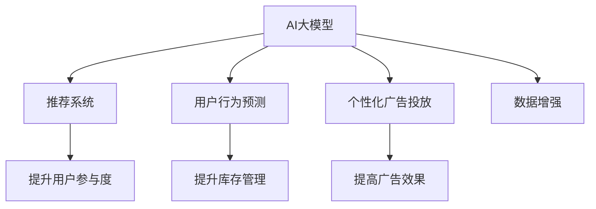

                 

# AI大模型如何提升电商平台的用户参与度

## 1. 背景介绍

### 1.1 问题由来
在当今数字化时代，电商平台正面临着前所未有的挑战和机遇。如何提升用户参与度，增加用户粘性，成为电商企业关注的重点。传统的网站优化、营销活动等手段虽然有效，但随着用户需求的日益个性化和复杂化，这些方法显得力不从心。人工智能，尤其是基于大模型的技术，为电商平台的个性化推荐、用户行为预测、个性化广告投放等场景提供了新的解决方案。

## 2. 核心概念与联系

### 2.1 核心概念概述

为更好地理解AI大模型如何提升电商平台的用户参与度，本节将介绍几个密切相关的核心概念：

- AI大模型：基于深度学习的大规模预训练模型，如BERT、GPT-3等，通过在大规模无标签数据上进行预训练，学习到丰富的语言知识和模式。
- 推荐系统：通过分析用户历史行为和兴趣，推荐系统能够预测用户可能感兴趣的商品，并提供个性化推荐，提升用户购物体验。
- 用户行为预测：利用大模型，预测用户未来的购物行为，如购买时间、金额等，帮助电商平台提前做好库存、促销等准备工作。
- 个性化广告投放：根据用户行为和兴趣，投放个性化的广告，提高广告的点击率和转化率。
- 数据增强：通过数据扩充技术，提升模型的泛化能力，如生成式对抗网络(GAN)等。

这些核心概念之间的逻辑关系可以通过以下Mermaid流程图来展示：



这个流程图展示了大模型技术在电商平台的几个关键应用场景，并通过这些场景的串联，实现了提升用户参与度的目的。

## 3. 核心算法原理 & 具体操作步骤
### 3.1 算法原理概述

基于AI大模型的电商推荐系统，通过在大规模用户行为数据上进行预训练，学习到用户兴趣和行为的潜在模式。在用户实际交互时，利用预训练模型对用户行为进行预测和建模，并根据预测结果推荐商品或广告，从而提升用户参与度。

具体来说，假设有N个用户，每个用户有M个历史行为数据，电商平台的推荐系统目标是通过训练一个大模型 $M_{\theta}$，使得：

$$
\theta^* = \mathop{\arg\min}_{\theta} \mathcal{L}(M_{\theta},D)
$$

其中 $\mathcal{L}$ 为损失函数，$D$ 为所有用户历史行为数据。模型 $M_{\theta}$ 可以是一个推荐模型、用户行为预测模型或个性化广告投放模型。目标是最小化模型输出与实际用户行为之间的差距，提升模型预测准确性和个性化推荐效果。

### 3.2 算法步骤详解

基于AI大模型的电商推荐系统一般包括以下几个关键步骤：

**Step 1: 数据准备**
- 收集电商平台的用户行为数据，包括浏览、点击、购买、评分等行为。
- 清洗和预处理数据，去除噪声和异常值，构建训练集 $D$。

**Step 2: 模型训练**
- 选择合适的预训练模型，如BERT、GPT-3等。
- 在训练集 $D$ 上，利用预训练模型进行fine-tuning，优化模型参数。

**Step 3: 用户行为预测**
- 在新的用户交互数据上，利用fine-tuned模型预测用户的行为，如购买概率、点击率等。

**Step 4: 个性化推荐**
- 根据用户行为预测结果，利用推荐模型生成个性化推荐列表。

**Step 5: 个性化广告投放**
- 在推荐列表的基础上，利用广告投放模型生成个性化的广告创意和投放策略。

**Step 6: 效果评估**
- 在实际用户数据上评估推荐和广告的效果，如点击率、转化率、满意度等。
- 根据评估结果调整模型参数，优化推荐和广告策略。

### 3.3 算法优缺点

基于AI大模型的电商推荐系统具有以下优点：
1. 精准推荐：利用大模型的语言理解和模式识别能力，生成高度个性化的推荐，提升用户满意度和粘性。
2. 实时预测：通过在线fine-tuning，实时预测用户行为，实现动态推荐和广告投放。
3. 泛化能力强：大模型能够处理复杂的非结构化数据，具有较强的泛化能力，适应多样化的电商场景。
4. 数据增强：通过数据增强技术，丰富训练数据，提升模型泛化能力和鲁棒性。

同时，该方法也存在一些局限性：
1. 数据隐私：电商平台需要收集大量用户行为数据，可能涉及用户隐私问题，需谨慎处理。
2. 数据质量：模型预测效果依赖于数据的质量和完整性，数据缺失或不准确会影响推荐效果。
3. 计算资源：大模型需要大量的计算资源进行训练和推理，需要高性能计算设备支持。
4. 模型复杂度：大模型通常包含数亿个参数，模型复杂度较高，难以进行在线实时推理。

尽管存在这些局限性，但就目前而言，基于AI大模型的电商推荐系统仍是电商领域最先进的技术手段。未来相关研究的重点在于如何进一步降低计算成本，提升模型实时性，同时保护用户隐私，优化推荐和广告效果。

### 3.4 算法应用领域

基于AI大模型的电商推荐系统已经在多个电商平台上得到应用，并取得了显著效果：

- 亚马逊：通过基于BERT的推荐系统，提升商品推荐准确率和用户体验。
- 京东：利用基于GPT-3的个性化广告投放模型，优化广告效果，提升转化率。
- 淘宝：使用基于Transformer的推荐模型，提升用户粘性和满意度。
- 拼多多：通过数据增强技术，提升模型的泛化能力，优化推荐和广告策略。

除了这些经典案例外，AI大模型在电商领域的创新应用也在不断涌现，如基于语义理解的智能客服、利用多模态信息提升购物体验等，为电商平台带来新的业务增长点。

## 4. 数学模型和公式 & 详细讲解  
### 4.1 数学模型构建

本节将使用数学语言对基于AI大模型的电商推荐系统进行更加严格的刻画。

假设有N个用户，每个用户有M个历史行为数据 $x_{i,j}$，对应的行为标签为 $y_{i,j}$。电商平台的推荐系统目标是通过训练一个大模型 $M_{\theta}$，使得：

$$
\theta^* = \mathop{\arg\min}_{\theta} \mathcal{L}(M_{\theta},D)
$$

其中 $\mathcal{L}$ 为损失函数，$D$ 为所有用户历史行为数据。目标是最小化模型输出与实际用户行为之间的差距，提升模型预测准确性和个性化推荐效果。

### 4.2 公式推导过程

以下我们以协同过滤推荐为例，推导基于AI大模型的推荐系统推荐公式。

协同过滤推荐系统通过用户行为矩阵 $U \in \mathbb{R}^{N \times M}$ 和物品属性矩阵 $V \in \mathbb{R}^{M \times K}$ 进行推荐，其中 $U_{i,j}$ 表示用户 $i$ 对物品 $j$ 的评分，$V_{j,k}$ 表示物品 $j$ 的第 $k$ 个属性。利用矩阵乘法和归一化操作，可以得到用户对物品的兴趣评分 $p_{i,j} = \frac{U_i V_j^T}{||U_i|| ||V_j||}$。

在基于AI大模型的推荐系统中，通过在预训练模型 $M_{\theta}$ 上做fine-tuning，可以调整模型的权重参数 $\theta$，使得预测评分 $p_{i,j}$ 更接近实际评分 $y_{i,j}$。即：

$$
\theta^* = \mathop{\arg\min}_{\theta} \sum_{i=1}^N \sum_{j=1}^M ||y_{i,j} - M_{\theta}(x_{i,j})||^2
$$

其中 $M_{\theta}(x_{i,j})$ 表示模型 $M_{\theta}$ 在输入 $x_{i,j}$ 上的输出，可以是预测评分、概率分布等。

### 4.3 案例分析与讲解

**案例1: 基于BERT的推荐系统**
- 在电商平台上，利用用户浏览、点击、购买等行为数据，对BERT模型进行fine-tuning。
- 在新的用户交互数据上，利用fine-tuned的BERT模型预测用户的行为评分，生成个性化推荐列表。

**案例2: 基于GPT-3的广告投放**
- 在电商平台上，收集用户的浏览历史、点击历史、购买历史等数据。
- 利用GPT-3模型生成个性化广告创意和投放策略，优化广告效果。

以上两个案例展示了AI大模型在电商推荐和广告投放中的实际应用，通过在预训练模型上进行fine-tuning，提升了模型的推荐和广告效果。

## 5. 项目实践：代码实例和详细解释说明
### 5.1 开发环境搭建

在进行推荐系统开发前，我们需要准备好开发环境。以下是使用Python进行PyTorch开发的环境配置流程：

1. 安装Anaconda：从官网下载并安装Anaconda，用于创建独立的Python环境。

2. 创建并激活虚拟环境：
```bash
conda create -n pytorch-env python=3.8 
conda activate pytorch-env
```

3. 安装PyTorch：根据CUDA版本，从官网获取对应的安装命令。例如：
```bash
conda install pytorch torchvision torchaudio cudatoolkit=11.1 -c pytorch -c conda-forge
```

4. 安装Transformer库：
```bash
pip install transformers
```

5. 安装各类工具包：
```bash
pip install numpy pandas scikit-learn matplotlib tqdm jupyter notebook ipython
```

完成上述步骤后，即可在`pytorch-env`环境中开始推荐系统开发。

### 5.2 源代码详细实现

这里我们以基于BERT的电商推荐系统为例，给出使用Transformers库进行开发的PyTorch代码实现。

首先，定义推荐系统的数据处理函数：

```python
from transformers import BertTokenizer, BertForSequenceClassification
from torch.utils.data import Dataset
import torch

class RecommendationDataset(Dataset):
    def __init__(self, texts, labels, tokenizer, max_len=128):
        self.texts = texts
        self.labels = labels
        self.tokenizer = tokenizer
        self.max_len = max_len
        
    def __len__(self):
        return len(self.texts)
    
    def __getitem__(self, item):
        text = self.texts[item]
        label = self.labels[item]
        
        encoding = self.tokenizer(text, return_tensors='pt', max_length=self.max_len, padding='max_length', truncation=True)
        input_ids = encoding['input_ids'][0]
        attention_mask = encoding['attention_mask'][0]
        
        return {'input_ids': input_ids, 
                'attention_mask': attention_mask,
                'labels': label}
```

然后，定义模型和优化器：

```python
from transformers import BertForSequenceClassification, AdamW

model = BertForSequenceClassification.from_pretrained('bert-base-cased', num_labels=2)  # 2代表二分类
optimizer = AdamW(model.parameters(), lr=2e-5)
```

接着，定义训练和评估函数：

```python
from torch.utils.data import DataLoader
from tqdm import tqdm
from sklearn.metrics import accuracy_score

device = torch.device('cuda') if torch.cuda.is_available() else torch.device('cpu')
model.to(device)

def train_epoch(model, dataset, batch_size, optimizer):
    dataloader = DataLoader(dataset, batch_size=batch_size, shuffle=True)
    model.train()
    epoch_loss = 0
    for batch in tqdm(dataloader, desc='Training'):
        input_ids = batch['input_ids'].to(device)
        attention_mask = batch['attention_mask'].to(device)
        labels = batch['labels'].to(device)
        model.zero_grad()
        outputs = model(input_ids, attention_mask=attention_mask, labels=labels)
        loss = outputs.loss
        epoch_loss += loss.item()
        loss.backward()
        optimizer.step()
    return epoch_loss / len(dataloader)

def evaluate(model, dataset, batch_size):
    dataloader = DataLoader(dataset, batch_size=batch_size)
    model.eval()
    preds, labels = [], []
    with torch.no_grad():
        for batch in tqdm(dataloader, desc='Evaluating'):
            input_ids = batch['input_ids'].to(device)
            attention_mask = batch['attention_mask'].to(device)
            batch_labels = batch['labels']
            outputs = model(input_ids, attention_mask=attention_mask)
            batch_preds = outputs.logits.argmax(dim=2).to('cpu').tolist()
            batch_labels = batch_labels.to('cpu').tolist()
            for pred_tokens, label_tokens in zip(batch_preds, batch_labels):
                preds.append(pred_tokens)
                labels.append(label_tokens)
                
    print(f"Accuracy: {accuracy_score(labels, preds)}")
```

最后，启动训练流程并在测试集上评估：

```python
epochs = 5
batch_size = 16

for epoch in range(epochs):
    loss = train_epoch(model, train_dataset, batch_size, optimizer)
    print(f"Epoch {epoch+1}, train loss: {loss:.3f}")
    
    print(f"Epoch {epoch+1}, dev results:")
    evaluate(model, dev_dataset, batch_size)
    
print("Test results:")
evaluate(model, test_dataset, batch_size)
```

以上就是使用PyTorch对BERT进行电商推荐系统开发的完整代码实现。可以看到，得益于Transformers库的强大封装，我们可以用相对简洁的代码完成BERT模型的加载和推荐系统构建。

### 5.3 代码解读与分析

让我们再详细解读一下关键代码的实现细节：

**RecommendationDataset类**：
- `__init__`方法：初始化文本、标签、分词器等关键组件。
- `__len__`方法：返回数据集的样本数量。
- `__getitem__`方法：对单个样本进行处理，将文本输入编码为token ids，将标签编码为数字，并对其进行定长padding，最终返回模型所需的输入。

**训练和评估函数**：
- 使用PyTorch的DataLoader对数据集进行批次化加载，供模型训练和推理使用。
- 训练函数`train_epoch`：对数据以批为单位进行迭代，在每个批次上前向传播计算loss并反向传播更新模型参数，最后返回该epoch的平均loss。
- 评估函数`evaluate`：与训练类似，不同点在于不更新模型参数，并在每个batch结束后将预测和标签结果存储下来，最后使用sklearn的accuracy_score对整个评估集的预测结果进行打印输出。

**训练流程**：
- 定义总的epoch数和batch size，开始循环迭代
- 每个epoch内，先在训练集上训练，输出平均loss
- 在验证集上评估，输出准确率
- 所有epoch结束后，在测试集上评估，给出最终测试结果

可以看到，PyTorch配合Transformers库使得BERT电商推荐系统的代码实现变得简洁高效。开发者可以将更多精力放在数据处理、模型改进等高层逻辑上，而不必过多关注底层的实现细节。

当然，工业级的系统实现还需考虑更多因素，如模型的保存和部署、超参数的自动搜索、更灵活的任务适配层等。但核心的推荐范式基本与此类似。

## 6. 实际应用场景
### 6.1 电商个性化推荐

基于AI大模型的电商推荐系统，已经在各大电商平台上得到了广泛应用，提升了用户的个性化购物体验。

在亚马逊上，通过基于BERT的推荐系统，用户能够收到高度个性化的商品推荐，提升购物体验和满意度。亚马逊的推荐系统不仅基于用户的浏览和购买历史，还结合了用户搜索和评论等多模态信息，提升了推荐模型的全面性和鲁棒性。

在京东上，利用基于GPT-3的个性化广告投放模型，优化广告效果，提高点击率和转化率。京东的广告系统能够根据用户的兴趣和行为，实时生成个性化的广告创意和投放策略，提升广告的点击率和转化率，从而增加销售额。

在拼多多上，通过数据增强技术，提升模型的泛化能力，优化推荐和广告策略。拼多多利用生成式对抗网络(GAN)等数据增强方法，丰富训练数据，提升模型的泛化能力和鲁棒性，从而实现更精准的推荐和广告投放。

### 6.2 电商用户行为预测

利用AI大模型，电商企业能够对用户未来的购物行为进行预测，提前做好库存、促销等准备工作，提升运营效率。

亚马逊通过基于深度学习的用户行为预测模型，预测用户的购买时间、金额等，提前做好库存管理和促销活动安排，提升用户购物体验和平台销售额。

京东利用基于LSTM的用户行为预测模型，预测用户的购买意向和行为，提前做好库存管理和促销活动安排，提升用户购物体验和平台销售额。

拼多多利用基于GAN的数据增强技术，提升模型的泛化能力和鲁棒性，从而实现更精准的用户行为预测。

### 6.3 电商个性化广告投放

在电商平台上，利用AI大模型，电商企业能够根据用户的兴趣和行为，生成个性化的广告创意和投放策略，提高广告的点击率和转化率。

亚马逊利用基于GPT-3的广告投放模型，生成个性化的广告创意和投放策略，提高广告的点击率和转化率，从而增加销售额。

京东利用基于BERT的广告投放模型，生成个性化的广告创意和投放策略，提高广告的点击率和转化率，从而增加销售额。

拼多多利用基于Transformer的广告投放模型，生成个性化的广告创意和投放策略，提高广告的点击率和转化率，从而增加销售额。

## 7. 工具和资源推荐
### 7.1 学习资源推荐

为了帮助开发者系统掌握AI大模型在电商平台上的应用，这里推荐一些优质的学习资源：

1. 《深度学习入门》系列博文：由大模型技术专家撰写，详细介绍了深度学习的基本概念和算法，适合初学者入门。

2. 《深度学习与Python》课程：斯坦福大学开设的深度学习课程，涵盖深度学习的基本理论和实践，适合系统学习。

3. 《深度学习理论与实践》书籍：TensorFlow的官方书籍，全面介绍了深度学习的基本理论和实践，适合深度学习进阶学习。

4. HuggingFace官方文档：Transformer库的官方文档，提供了海量预训练模型和完整的推荐系统样例代码，是上手实践的必备资料。

5. Google Cloud AI平台：提供基于AI大模型的推荐系统、用户行为预测、个性化广告投放等工具和资源，适合工业级的推荐系统开发。

通过对这些资源的学习实践，相信你一定能够快速掌握AI大模型在电商平台上的应用，并用于解决实际的电商推荐问题。

### 7.2 开发工具推荐

高效的开发离不开优秀的工具支持。以下是几款用于AI大模型推荐系统开发的常用工具：

1. PyTorch：基于Python的开源深度学习框架，灵活动态的计算图，适合快速迭代研究。大部分预训练语言模型都有PyTorch版本的实现。

2. TensorFlow：由Google主导开发的开源深度学习框架，生产部署方便，适合大规模工程应用。同样有丰富的预训练语言模型资源。

3. Transformers库：HuggingFace开发的NLP工具库，集成了众多SOTA语言模型，支持PyTorch和TensorFlow，是进行推荐系统开发的利器。

4. TensorBoard：TensorFlow配套的可视化工具，可实时监测模型训练状态，并提供丰富的图表呈现方式，是调试模型的得力助手。

5. Weights & Biases：模型训练的实验跟踪工具，可以记录和可视化模型训练过程中的各项指标，方便对比和调优。

6. Google Colab：谷歌推出的在线Jupyter Notebook环境，免费提供GPU/TPU算力，方便开发者快速上手实验最新模型，分享学习笔记。

合理利用这些工具，可以显著提升AI大模型推荐系统的开发效率，加快创新迭代的步伐。

### 7.3 相关论文推荐

AI大模型在电商平台上的推荐系统研究源于学界的持续研究。以下是几篇奠基性的相关论文，推荐阅读：

1. Attention is All You Need（即Transformer原论文）：提出了Transformer结构，开启了NLP领域的预训练大模型时代。

2. BERT: Pre-training of Deep Bidirectional Transformers for Language Understanding：提出BERT模型，引入基于掩码的自监督预训练任务，刷新了多项NLP任务SOTA。

3. Model-Based Reinforcement Learning: Tutorial and Review：介绍了基于模型的方法，如何通过深度学习模型预测用户行为，实现推荐系统。

4. SimCLR: A Simple Framework for Contrastive Learning：提出了自监督学习的方法，通过大规模无标签数据的自监督学习，提升模型的泛化能力和鲁棒性。

5. GANs Trained by a Two Time-Scale Update Rule Converge to a Local Nash Equilibrium：介绍了生成式对抗网络(GAN)，通过数据增强技术，提升模型的泛化能力和鲁棒性。

这些论文代表了大模型推荐系统的发展脉络。通过学习这些前沿成果，可以帮助研究者把握学科前进方向，激发更多的创新灵感。

## 8. 总结：未来发展趋势与挑战
### 8.1 总结

本文对基于AI大模型的电商推荐系统进行了全面系统的介绍。首先阐述了AI大模型在电商平台上的应用背景和意义，明确了推荐系统在提升用户参与度方面的独特价值。其次，从原理到实践，详细讲解了基于AI大模型的电商推荐系统的数学模型和核心算法，给出了推荐系统开发的完整代码实例。同时，本文还广泛探讨了推荐系统在电商领域的应用场景，展示了AI大模型在电商推荐和广告投放中的实际应用，提出了未来推荐系统的研究方向和挑战。

通过本文的系统梳理，可以看到，基于AI大模型的电商推荐系统正在成为电商领域的重要技术手段，极大地提升电商平台的个性化推荐和用户参与度。未来，伴随预训练语言模型和推荐系统的持续演进，相信电商平台的智能化水平将得到进一步提升，为消费者带来更加丰富、个性化的购物体验。

### 8.2 未来发展趋势

展望未来，基于AI大模型的电商推荐系统将呈现以下几个发展趋势：

1. 模型规模持续增大。随着算力成本的下降和数据规模的扩张，预训练语言模型的参数量还将持续增长。超大规模语言模型蕴含的丰富语言知识，有望支撑更加复杂多变的推荐场景。

2. 推荐算法多样性增强。除了传统的协同过滤、基于深度学习的推荐算法，未来会涌现更多新颖的推荐方法，如基于图的推荐、基于知识图谱的推荐等，提升推荐系统的全面性和准确性。

3. 推荐系统的实时性提升。通过在线fine-tuning和分布式计算，实现实时推荐和广告投放，提升用户购物体验。

4. 推荐系统的个性化和多样性增强。通过引入用户画像、行为轨迹等更多维度的信息，提升推荐系统的个性化和多样化。

5. 推荐系统的可解释性加强。通过可视化技术，增强推荐系统的可解释性，提升用户信任度和满意度。

6. 推荐系统的跨领域应用扩展。将推荐系统的技术应用于更多领域，如智能医疗、智能交通等，提升各领域的智能化水平。

以上趋势凸显了基于AI大模型的电商推荐系统的广阔前景。这些方向的探索发展，必将进一步提升电商平台的个性化推荐能力，为用户带来更加丰富、个性化的购物体验。

### 8.3 面临的挑战

尽管基于AI大模型的电商推荐系统已经取得了显著效果，但在迈向更加智能化、普适化应用的过程中，它仍面临着诸多挑战：

1. 数据隐私：电商平台需要收集大量用户行为数据，可能涉及用户隐私问题，需谨慎处理。如何在大数据环境下保护用户隐私，成为一个重要课题。

2. 数据质量：推荐系统依赖于高质量的用户行为数据，数据缺失或不准确会影响推荐效果。如何提高数据质量，保障数据真实性和完整性，是推荐系统的首要挑战。

3. 计算资源：AI大模型需要大量的计算资源进行训练和推理，需要高性能计算设备支持。如何优化计算资源，提升模型实时性，成为推荐系统优化的一个重要方向。

4. 模型复杂度：大模型通常包含数亿个参数，模型复杂度较高，难以进行在线实时推理。如何简化模型结构，提升推理速度，优化资源占用，将是重要的优化方向。

5. 用户反馈：如何收集和利用用户反馈，提升推荐系统的效果和可解释性，是推荐系统优化的关键。

6. 用户教育：如何通过推荐系统引导用户形成健康、积极的行为习惯，避免对用户的过度推荐和诱导消费，是推荐系统的社会责任。

这些挑战需要电商企业、AI研究者和开发者共同面对和解决，才能确保AI大模型推荐系统在电商领域的安全、可靠和高效。

### 8.4 研究展望

面向未来，基于AI大模型的电商推荐系统需要在以下几个方面寻求新的突破：

1. 探索无监督和半监督推荐方法。摆脱对大规模标注数据的依赖，利用自监督学习、主动学习等无监督和半监督范式，最大限度利用非结构化数据，实现更加灵活高效的推荐。

2. 研究参数高效和计算高效的推荐方法。开发更加参数高效的推荐方法，在固定大部分预训练参数的同时，只更新极少量的任务相关参数。同时优化推荐模型的计算图，减少前向传播和反向传播的资源消耗，实现更加轻量级、实时性的部署。

3. 融合因果和对比学习范式。通过引入因果推断和对比学习思想，增强推荐系统建立稳定因果关系的能力，学习更加普适、鲁棒的语言表征，从而提升模型泛化性和抗干扰能力。

4. 引入更多先验知识。将符号化的先验知识，如知识图谱、逻辑规则等，与神经网络模型进行巧妙融合，引导推荐系统学习更准确、合理的语言模型。同时加强不同模态数据的整合，实现视觉、语音等多模态信息与文本信息的协同建模。

5. 结合因果分析和博弈论工具。将因果分析方法引入推荐系统，识别出模型决策的关键特征，增强输出解释的因果性和逻辑性。借助博弈论工具刻画人机交互过程，主动探索并规避推荐系统的脆弱点，提高系统稳定性。

6. 纳入伦理道德约束。在推荐系统训练目标中引入伦理导向的评估指标，过滤和惩罚有偏见、有害的推荐结果，确保推荐系统符合人类价值观和伦理道德。

这些研究方向的探索，必将引领AI大模型推荐系统迈向更高的台阶，为构建安全、可靠、可解释、可控的智能推荐系统铺平道路。面向未来，AI大模型推荐系统还需要与其他AI技术进行更深入的融合，如知识表示、因果推理、强化学习等，多路径协同发力，共同推动电商平台的智能化进程。只有勇于创新、敢于突破，才能不断拓展AI大模型推荐系统的边界，让智能技术更好地造福电商平台的用户。

## 9. 附录：常见问题与解答

**Q1：AI大模型推荐系统的准确率如何提升？**

A: AI大模型推荐系统的准确率提升，主要依赖于以下几个方面：

1. 数据质量：确保收集到的用户行为数据真实、完整，减少数据缺失和异常值。

2. 数据增强：通过数据扩充技术，丰富训练数据，提升模型的泛化能力和鲁棒性。

3. 模型优化：选择合适的优化算法和超参数，提高模型收敛速度和精度。

4. 特征工程：设计合理的特征提取方法，提升模型的特征表达能力。

5. 算法优化：引入新颖的推荐算法，如基于图的推荐、基于知识图谱的推荐等，提升推荐系统的全面性和准确性。

6. 模型微调：通过在线fine-tuning，实时优化模型，提升推荐系统的实时性和效果。

**Q2：AI大模型推荐系统面临的主要挑战是什么？**

A: AI大模型推荐系统面临的主要挑战包括：

1. 数据隐私：收集大量用户行为数据，可能涉及用户隐私问题，需谨慎处理。

2. 数据质量：推荐系统依赖于高质量的用户行为数据，数据缺失或不准确会影响推荐效果。

3. 计算资源：AI大模型需要大量的计算资源进行训练和推理，需要高性能计算设备支持。

4. 模型复杂度：大模型通常包含数亿个参数，模型复杂度较高，难以进行在线实时推理。

5. 用户反馈：如何收集和利用用户反馈，提升推荐系统的效果和可解释性，是推荐系统优化的关键。

6. 用户教育：如何通过推荐系统引导用户形成健康、积极的行为习惯，避免对用户的过度推荐和诱导消费，是推荐系统的社会责任。

**Q3：AI大模型推荐系统在电商领域有哪些具体应用？**

A: AI大模型推荐系统在电商领域有以下具体应用：

1. 个性化推荐：通过用户行为数据，推荐用户可能感兴趣的商品，提升购物体验和满意度。

2. 用户行为预测：预测用户的购买意向和行为，提前做好库存管理和促销活动安排，提升用户购物体验和平台销售额。

3. 个性化广告投放：根据用户的兴趣和行为，生成个性化的广告创意和投放策略，提高广告的点击率和转化率。

4. 库存管理：通过用户行为数据，预测商品的销售情况，提前做好库存管理和物流安排。

5. 价格优化：通过用户行为数据，预测商品的需求量和价格弹性，制定合理的价格策略，提升销售额和利润率。

6. 客户服务：通过用户行为数据，分析用户需求和反馈，提升客户服务的效率和质量。

**Q4：AI大模型推荐系统有哪些代表性技术？**

A: AI大模型推荐系统的代表性技术包括：

1. 协同过滤推荐：通过用户行为数据，构建用户-商品矩阵，预测用户对商品的评分，生成个性化推荐列表。

2. 基于深度学习的推荐：利用深度学习模型，学习用户行为和商品特征之间的映射关系，生成个性化推荐列表。

3. 基于知识图谱的推荐：通过知识图谱，提升推荐系统的全面性和准确性，如DWP、HolisticRec等。

4. 基于生成模型的推荐：通过生成模型，生成个性化的商品描述和广告创意，提高推荐系统的可解释性和用户满意度，如GAN、VAE等。

5. 在线fine-tuning：通过在线fine-tuning，实时优化模型，提升推荐系统的实时性和效果。

6. 多模态推荐：通过融合视觉、语音等多模态信息，提升推荐系统的全面性和准确性。

**Q5：AI大模型推荐系统有哪些未来发展方向？**

A: AI大模型推荐系统的未来发展方向包括：

1. 探索无监督和半监督推荐方法。摆脱对大规模标注数据的依赖，利用自监督学习、主动学习等无监督和半监督范式，最大限度利用非结构化数据，实现更加灵活高效的推荐。

2. 研究参数高效和计算高效的推荐方法。开发更加参数高效的推荐方法，在固定大部分预训练参数的同时，只更新极少量的任务相关参数。同时优化推荐模型的计算图，减少前向传播和反向传播的资源消耗，实现更加轻量级、实时性的部署。

3. 融合因果和对比学习范式。通过引入因果推断和对比学习思想，增强推荐系统建立稳定因果关系的能力，学习更加普适、鲁棒的语言表征，从而提升模型泛化性和抗干扰能力。

4. 引入更多先验知识。将符号化的先验知识，如知识图谱、逻辑规则等，与神经网络模型进行巧妙融合，引导推荐系统学习更准确、合理的语言模型。同时加强不同模态数据的整合，实现视觉、语音等多模态信息与文本信息的协同建模。

5. 结合因果分析和博弈论工具。将因果分析方法引入推荐系统，识别出模型决策的关键特征，增强输出解释的因果性和逻辑性。借助博弈论工具刻画人机交互过程，主动探索并规避推荐系统的脆弱点，提高系统稳定性。

6. 纳入伦理道德约束。在推荐系统训练目标中引入伦理导向的评估指标，过滤和惩罚有偏见、有害的推荐结果，确保推荐系统符合人类价值观和伦理道德。

这些研究方向将引领AI大模型推荐系统迈向更高的台阶，为构建安全、可靠、可解释、可控的智能推荐系统铺平道路。面向未来，AI大模型推荐系统还需要与其他AI技术进行更深入的融合，如知识表示、因果推理、强化学习等，多路径协同发力，共同推动电商平台的智能化进程。只有勇于创新、敢于突破，才能不断拓展AI大模型推荐系统的边界，让智能技术更好地造福电商平台的用户。

---

作者：禅与计算机程序设计艺术 / Zen and the Art of Computer Programming

