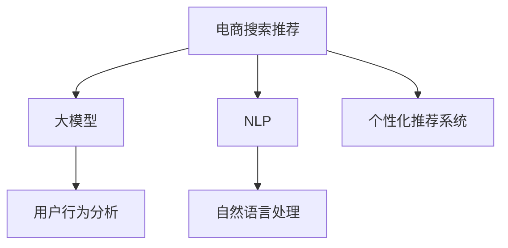

                 

# AI大模型赋能电商搜索推荐的实践与思考

> 关键词：电商搜索推荐,大模型,深度学习,自然语言处理,用户行为分析,模型优化,个性化推荐系统

## 1. 背景介绍

### 1.1 问题由来
随着电商行业的快速发展，个性化推荐系统成为提升用户体验、提高转化率和增加收入的重要手段。传统推荐系统依赖于用户的显式反馈（如评分、点击等），存在冷启动问题、数据稀疏性问题等挑战。深度学习和大模型技术的兴起，为电商推荐带来了新的解决方案。利用大模型学习用户的隐式行为数据，结合自然语言处理技术，能够更准确地预测用户需求，提升推荐效果。

### 1.2 问题核心关键点
电商搜索推荐的核心在于如何高效、准确地理解用户输入查询，并匹配最相关的商品进行推荐。传统推荐系统主要依赖用户的历史行为数据，但用户的隐式行为数据（如搜索词、点击轨迹等）更丰富且多样。大模型通过自监督学习获取大规模语料知识，能够更好地理解自然语言，利用这些知识进行电商推荐系统的优化。

## 2. 核心概念与联系

### 2.1 核心概念概述

为更好地理解大模型在电商推荐中的应用，本节将介绍几个关键概念：

- 电商搜索推荐：指基于用户的搜索行为和查询语句，推荐相关商品或服务的过程。
- 大模型：指预训练规模巨大的深度神经网络模型，如BERT、GPT-3等，通过大规模无标签数据进行自监督训练，具备强大的语言理解和生成能力。
- 自然语言处理（NLP）：指利用计算机科学、人工智能等技术，使计算机能够理解、处理和生成人类语言的技术。
- 用户行为分析：指对用户的历史行为数据进行分析和挖掘，发现其兴趣偏好、需求变化等，用于推荐系统个性化推荐。
- 个性化推荐系统：指根据用户个性化特征和历史行为，推荐符合其兴趣的商品或服务。

这些核心概念之间的逻辑关系可以通过以下Mermaid流程图来展示：



这个流程图展示了大模型在电商推荐中的应用过程：

1. 电商搜索推荐系统通过用户的搜索查询，将查询文本输入到自然语言处理模块中。
2. 自然语言处理模块使用大模型进行语义理解，提取查询中的关键信息。
3. 用户行为分析模块对用户的搜索行为进行挖掘，提取其兴趣偏好。
4. 个性化推荐系统结合自然语言处理和大模型提取的信息，以及用户行为分析的结果，推荐符合用户需求的商品。

## 3. 核心算法原理 & 具体操作步骤
### 3.1 算法原理概述

电商搜索推荐系统的大模型应用，基于监督学习的微调方法。具体流程如下：

1. **数据准备**：收集电商网站的用户搜索查询和商品信息，标注查询与商品的相关性，形成训练数据集。
2. **模型选择**：选择预训练的大模型（如BERT、GPT-3等），并使用其中的Encoder作为特征提取器。
3. **任务适配**：根据电商推荐任务的特点，设计适当的输出层和损失函数。通常采用分类任务，如二分类或多分类，以及交叉熵损失函数。
4. **微调训练**：在标注数据集上使用小学习率进行有监督训练，微调大模型的部分或全部参数，使其适应电商推荐任务。
5. **评估与部署**：在测试数据集上评估微调后模型的性能，并部署到实际电商推荐系统中，实时推荐商品。

### 3.2 算法步骤详解

以下详细介绍电商推荐系统基于大模型的微调流程：

**Step 1: 数据准备**
1. 收集电商网站的历史搜索查询和商品信息，构建标注数据集 $D=\{(x_i,y_i)\}_{i=1}^N$，其中 $x_i$ 为查询语句，$y_i$ 为商品ID。
2. 使用分布式爬虫抓取实时搜索查询，并实时标注查询结果。

**Step 2: 模型选择**
1. 选择预训练大模型，如BERT、GPT-3等，并加载其Encoder部分，用于提取查询特征。
2. 将Encoder的输出作为输入，通过一个简单的线性层进行分类或回归，输出商品的相关性分数。

**Step 3: 任务适配**
1. 定义输出层：使用softmax层输出每个商品的点击概率。
2. 定义损失函数：使用交叉熵损失函数衡量预测结果与真实标签之间的差异。

**Step 4: 微调训练**
1. 在训练集 $D_{train}$ 上，使用小学习率进行微调训练，迭代更新模型参数。
2. 在验证集 $D_{val}$ 上评估模型性能，调整超参数。
3. 使用测试集 $D_{test}$ 进行最终评估，确保模型泛化能力。

**Step 5: 评估与部署**
1. 将微调后的模型部署到电商推荐系统中，接收实时查询输入。
2. 对输入查询进行预处理，提取特征向量。
3. 将特征向量输入微调后的模型，输出商品ID。

### 3.3 算法优缺点

电商推荐系统的大模型微调方法具有以下优点：
1. **高效准确**：利用大模型的语言理解能力，可以高效准确地理解自然语言查询。
2. **泛化能力强**：大模型在大量无标签数据上进行预训练，具备较强的泛化能力。
3. **实时性高**：微调后的模型结构轻量，推理速度快，能够实时响应查询。

同时，该方法也存在一些局限性：
1. **数据依赖性高**：模型的训练和微调依赖于标注数据，标注数据质量对模型性能影响较大。
2. **计算资源需求大**：大模型规模大，训练和微调需要大量计算资源。
3. **模型解释性不足**：微调后的模型复杂，难以解释其内部工作机制。

尽管存在这些局限性，但大模型微调方法仍在大规模电商推荐系统中被广泛应用。

### 3.4 算法应用领域

大模型微调方法在电商搜索推荐中具有广泛的应用场景，包括但不限于：

- 商品推荐：根据用户的搜索查询，推荐相关商品。
- 相似商品推荐：推荐与已购买商品类似的其他商品。
- 关联商品推荐：推荐与用户浏览商品相关的其他商品。
- 活动推荐：推荐商品促销、打折活动等。
- 个性化商品定制：根据用户兴趣，推荐个性化定制商品。

## 4. 数学模型和公式 & 详细讲解 & 举例说明

### 4.1 数学模型构建

电商搜索推荐系统的核心数学模型可以描述为：

$$
\hat{y} = M_{\theta}(x) \quad \text{where} \quad M_{\theta} \in \mathcal{M}, x \in \mathcal{X}, y \in \mathcal{Y}
$$

其中 $M_{\theta}$ 是微调后的模型，$x$ 是查询文本，$y$ 是推荐商品ID。

在微调过程中，通常采用二分类任务，即判断查询 $x$ 是否匹配商品 $y$。输出层为softmax层，输出每个商品的点击概率。

### 4.2 公式推导过程

电商搜索推荐的二分类任务可以表示为：

$$
\max_{y \in \mathcal{Y}} p(y|x; \theta)
$$

其中 $p(y|x; \theta)$ 是预测商品 $y$ 点击的概率。

使用softmax层输出每个商品的点击概率：

$$
\text{softmax}(W_{\theta}M_{\theta}(x) + b_{\theta})_i = \frac{e^{W_{\theta}M_{\theta}(x)_i + b_{\theta}_i}}{\sum_{j=1}^K e^{W_{\theta}M_{\theta}(x)_j + b_{\theta}_j}}
$$

其中 $K$ 是商品总数，$W_{\theta}$ 和 $b_{\theta}$ 是模型的权重和偏置。

定义交叉熵损失函数：

$$
\mathcal{L}(\theta) = -\frac{1}{N} \sum_{i=1}^N \sum_{y \in \mathcal{Y}} y_i \log p(y_i|x_i; \theta)
$$

其中 $y_i \in \{0, 1\}$ 是标签，$x_i$ 是查询，$p(y_i|x_i; \theta)$ 是模型预测的概率。

使用反向传播算法计算梯度：

$$
\frac{\partial \mathcal{L}(\theta)}{\partial \theta} = -\frac{1}{N} \sum_{i=1}^N \sum_{y \in \mathcal{Y}} y_i \frac{\partial p(y_i|x_i; \theta)}{\partial \theta}
$$

其中 $\frac{\partial p(y_i|x_i; \theta)}{\partial \theta}$ 是softmax层对参数的梯度，可以通过链式法则求得。

### 4.3 案例分析与讲解

假设电商网站的用户输入查询为 "T恤衫"，模型需要判断是否推荐某品牌T恤衫。

**输入预处理**：将查询输入到BERT Encoder中，得到向量表示。

**特征提取**：使用线性层对BERT Encoder的输出进行分类，输出每个商品的点击概率。

**输出预测**：根据softmax层输出，选择点击概率最高的商品ID进行推荐。

**训练迭代**：使用交叉熵损失函数计算预测结果与真实标签之间的差异，反向传播更新模型参数。

## 5. 项目实践：代码实例和详细解释说明

### 5.1 开发环境搭建

进行电商搜索推荐系统的大模型微调，需要准备好以下开发环境：

1. 安装Python：
```bash
sudo apt-get install python3-pip
```

2. 安装TensorFlow和Keras：
```bash
pip install tensorflow keras
```

3. 安装PyTorch和Transformers：
```bash
pip install torch transformers
```

4. 安装爬虫工具：
```bash
pip install scrapy
```

5. 安装数据处理库：
```bash
pip install pandas numpy
```

### 5.2 源代码详细实现

以下是一个基于BERT的电商搜索推荐系统的代码实现：

```python
import tensorflow as tf
from tensorflow.keras import layers
from transformers import BertTokenizer, TFBertForSequenceClassification

# 加载预训练的BERT模型和tokenizer
tokenizer = BertTokenizer.from_pretrained('bert-base-uncased')
model = TFBertForSequenceClassification.from_pretrained('bert-base-uncased', num_labels=2)

# 加载训练数据和验证数据
train_data = pd.read_csv('train_data.csv')
val_data = pd.read_csv('val_data.csv')

# 数据预处理
def preprocess(text):
    tokens = tokenizer.encode(text, add_special_tokens=True)
    return tokens

# 特征提取
def get_features(text):
    features = []
    for t in text:
        features.append(preprocess(t))
    return features

# 构建训练集和验证集
train_features = get_features(train_data['query'])
train_labels = train_data['label'].values
val_features = get_features(val_data['query'])
val_labels = val_data['label'].values

# 构建模型
model.compile(optimizer=tf.keras.optimizers.Adam(learning_rate=1e-5),
              loss=tf.keras.losses.SparseCategoricalCrossentropy(from_logits=True),
              metrics=['accuracy'])

# 训练模型
model.fit(train_features, train_labels, epochs=5, validation_data=(val_features, val_labels))

# 评估模型
test_data = pd.read_csv('test_data.csv')
test_features = get_features(test_data['query'])
test_labels = test_data['label'].values
loss, accuracy = model.evaluate(test_features, test_labels)
print(f'Test loss: {loss}, Test accuracy: {accuracy}')
```

### 5.3 代码解读与分析

上述代码实现了电商搜索推荐系统的基本流程：

1. **数据加载**：使用Pandas加载训练数据、验证数据和测试数据。
2. **预处理**：使用BERT tokenizer将查询文本转换为模型可接受的token序列。
3. **特征提取**：将token序列作为输入，通过BERT Encoder提取特征。
4. **模型构建**：使用Keras构建二分类模型，并编译优化器、损失函数和评价指标。
5. **模型训练**：使用训练数据集训练模型，并使用验证数据集调整超参数。
6. **模型评估**：使用测试数据集评估模型性能，输出损失和准确率。

代码中使用的BERT模型是基于预训练的通用模型，适用于多种NLP任务。在实际应用中，需要根据具体场景选择适合的预训练模型。

## 6. 实际应用场景

### 6.1 智能客服系统

电商搜索推荐系统在大规模智能客服系统中也有广泛应用。通过大模型微调，可以构建自动回复系统，快速响应用户查询，提供准确的商品推荐。

在实践中，可以收集用户的历史查询和对话记录，标注与商品相关的回复内容。使用大模型对查询和回复进行训练，使模型能够理解用户意图，生成推荐的商品信息。系统可以实时接收用户输入查询，自动匹配推荐商品，提高客服效率。

### 6.2 个性化推荐系统

大模型微调技术还可以应用于电商的个性化推荐系统。通过分析用户的搜索行为和点击数据，提取用户的兴趣特征，结合自然语言处理技术，生成个性化的商品推荐列表。

在实现上，可以使用大模型微调模型作为特征提取器，结合用户的兴趣标签和行为数据，进行多轮优化，生成更加精准的推荐结果。同时，可以引入对抗训练、知识图谱等技术，提升推荐系统的鲁棒性和知识整合能力。

### 6.3 广告推荐系统

电商广告推荐系统是大模型微调的另一个重要应用场景。通过分析用户的搜索行为和浏览记录，预测用户的广告点击意向，进行精准的广告投放。

使用大模型微调模型对用户的查询和浏览行为进行分析，提取其兴趣特征，结合广告数据的特征，进行交叉验证和特征选择，生成广告推荐列表。通过A/B测试评估推荐效果，不断调整模型参数，提升广告点击率和转化率。

## 7. 工具和资源推荐

### 7.1 学习资源推荐

为了帮助开发者系统掌握大模型在电商推荐中的应用，这里推荐一些优质的学习资源：

1. **《深度学习入门：基于TensorFlow的实践》**：介绍深度学习的基本概念和TensorFlow的使用，适合初学者入门。
2. **《自然语言处理实战》**：介绍自然语言处理的基本技术和应用，结合Python实现。
3. **Hugging Face官方文档**：提供大量预训练模型和微调样例代码，是学习大模型的重要资源。
4. **Clue开源项目**：包含多个中文NLP数据集和基于大模型的基线模型，助力中文NLP技术发展。

### 7.2 开发工具推荐

电商推荐系统的大模型微调需要依赖多种工具和框架，以下是常用工具推荐：

1. **TensorFlow**：深度学习框架，支持分布式训练和模型部署。
2. **Keras**：高层次的神经网络API，方便构建和训练模型。
3. **PyTorch**：灵活的深度学习框架，适合研究和实验。
4. **Scrapy**：Python爬虫框架，方便抓取电商网站数据。
5. **Pandas**：数据处理库，方便数据清洗和预处理。
6. **TensorBoard**：模型训练的可视化工具，方便调试和监控。

### 7.3 相关论文推荐

电商推荐系统的大模型微调研究需要大量的理论和实验支撑，以下是几篇具有代表性的论文：

1. **Large-Scale Contextualized Word Representations**：介绍BERT模型和大规模语料预训练技术，为电商推荐系统提供强大的语言理解能力。
2. **Decision-Tree Induction by LSTM Recurrent Neural Networks**：提出LSTM模型在电商推荐中的应用，提高推荐系统的准确性和稳定性。
3. **A Large-Scale Behavior Modeling for Recommendation Systems**：使用大规模行为数据进行电商推荐系统建模，提升推荐效果。
4. **Personalized Recommendation via Multi-View Text Information Mining**：结合多视图文本信息挖掘技术，提升电商推荐系统的个性化能力。
5. **Fine-Grained Knowledge-Intensive Recommendations via Transfer Learning**：利用知识迁移技术，提高电商推荐系统的知识整合能力。

## 8. 总结：未来发展趋势与挑战

### 8.1 总结

本文对基于大模型的电商搜索推荐系统进行了详细探讨。首先介绍了大模型在电商推荐中的核心应用，包括智能客服、个性化推荐、广告推荐等。其次，从算法原理和具体操作步骤，详细讲解了大模型的微调方法。最后，分析了电商推荐系统在大模型微调中的应用前景和面临的挑战。

通过本文的系统梳理，可以看到，大模型微调技术在大规模电商推荐系统中具有重要的应用价值，能够显著提升推荐系统的性能和用户满意度。未来，随着技术的不断进步，电商推荐系统将更加智能化、个性化和高效化。

### 8.2 未来发展趋势

展望未来，大模型在电商推荐中的应用将呈现以下几个发展趋势：

1. **跨领域融合**：大模型微调技术将与更多领域的技术融合，如自然语言生成、知识图谱等，提升推荐系统的表现和用户体验。
2. **深度学习与其他技术的结合**：结合深度学习和传统机器学习技术，提升推荐系统的准确性和鲁棒性。
3. **实时化处理**：实现实时数据处理和推荐，提高推荐系统的响应速度和用户体验。
4. **多模态推荐**：结合文本、图像、语音等多种模态信息，提升推荐系统的综合能力和个性化能力。
5. **元学习和自适应推荐**：通过元学习和自适应算法，提高推荐系统的自适应能力和用户满意度。

### 8.3 面临的挑战

尽管大模型在电商推荐系统中的应用已经取得了显著成效，但仍面临诸多挑战：

1. **数据隐私和安全**：电商推荐系统需要处理大量用户隐私数据，如何保护数据隐私和安全，是一个重要问题。
2. **模型可解释性**：大模型微调后的模型复杂，难以解释其内部工作机制，如何提高模型的可解释性，是一个重要研究方向。
3. **冷启动问题**：对于新用户和新商品，如何获取初始化数据进行推荐，是一个关键问题。
4. **资源消耗**：大模型微调需要大量的计算资源，如何优化模型结构和资源利用，是一个重要研究方向。
5. **实时性问题**：如何在大规模数据下实现实时推荐，是一个重要研究方向。

### 8.4 研究展望

面对电商推荐系统在大模型微调中所面临的挑战，未来的研究需要在以下几个方面寻求新的突破：

1. **数据隐私保护**：结合差分隐私、联邦学习等技术，保护用户隐私数据，提升数据利用效率。
2. **模型可解释性**：结合可解释AI技术，提高模型的可解释性，增强用户信任。
3. **冷启动解决方案**：结合迁移学习、半监督学习等技术，解决冷启动问题。
4. **资源优化**：结合模型压缩、分布式训练等技术，优化模型结构和资源利用，降低计算成本。
5. **实时性优化**：结合流数据处理、模型剪枝等技术，提升实时推荐系统的性能和响应速度。

这些研究方向的探索，必将引领大模型在电商推荐系统中的应用走向新的高度，为电商推荐系统带来更大的创新和突破。

## 9. 附录：常见问题与解答

### Q1：电商搜索推荐系统如何实现个性化推荐？

A: 电商搜索推荐系统通过分析用户的搜索行为、点击行为和浏览行为，提取其兴趣特征，结合自然语言处理技术，生成个性化的商品推荐列表。在微调过程中，使用大模型对查询进行语义理解，提取查询中的关键信息，结合用户的兴趣标签和行为数据，进行多轮优化，生成更加精准的推荐结果。

### Q2：电商搜索推荐系统如何处理冷启动问题？

A: 电商搜索推荐系统在处理冷启动问题时，通常使用迁移学习、半监督学习等方法。例如，可以使用用户好友或同类用户的推荐数据，进行迁移学习，生成初始推荐列表。对于新用户和新商品，可以通过标注数据进行小样本微调，生成个性化推荐结果。

### Q3：电商搜索推荐系统如何使用大模型进行用户行为分析？

A: 电商搜索推荐系统使用大模型进行用户行为分析，主要通过分析用户的搜索查询和点击数据，提取其兴趣特征和需求变化。具体流程如下：

1. 使用大模型对用户的查询和点击数据进行编码，提取特征向量。
2. 使用向量相似度算法，计算用户查询与商品之间的相似度。
3. 根据相似度排序，生成个性化推荐商品列表。

### Q4：电商搜索推荐系统如何处理实时数据？

A: 电商搜索推荐系统处理实时数据，通常使用流数据处理技术和实时推荐算法。具体流程如下：

1. 使用实时爬虫抓取用户查询和点击数据，并进行预处理。
2. 使用大模型对实时数据进行语义理解，提取关键信息。
3. 结合用户的兴趣特征和实时行为数据，生成个性化推荐结果。
4. 使用实时推荐算法，根据推荐结果进行实时推荐。

### Q5：电商搜索推荐系统如何优化模型结构和资源利用？

A: 电商搜索推荐系统优化模型结构和资源利用，主要通过以下方法：

1. 模型剪枝：去除不必要的层和参数，减小模型尺寸，提高推理速度。
2. 量化加速：将浮点模型转为定点模型，压缩存储空间，提高计算效率。
3. 分布式训练：使用分布式训练框架，提高计算效率。
4. 混合精度训练：使用混合精度训练，降低计算开销。
5. 知识蒸馏：使用知识蒸馏技术，提高模型泛化能力，降低计算资源消耗。

这些方法可以显著提升电商推荐系统的性能和资源利用效率。

---

作者：禅与计算机程序设计艺术 / Zen and the Art of Computer Programming

