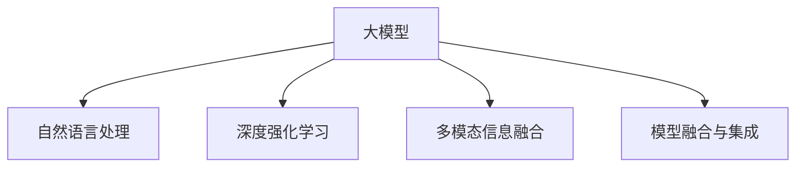
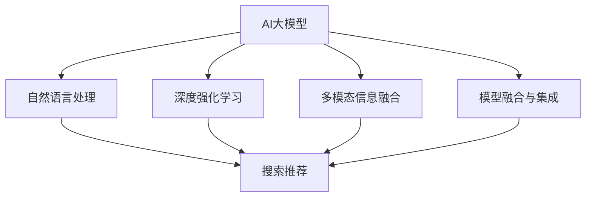

                 

# AI大模型赋能电商搜索推荐的实践与思考

> 关键词：AI大模型,搜索推荐,电商平台,深度学习,自然语言处理,NLP,强化学习,深度强化学习,推荐系统

## 1. 背景介绍

### 1.1 问题由来

在电子商务领域，搜索推荐系统是提升用户体验、增加商品曝光、提升成交转化率的重要引擎。然而，传统的推荐系统往往依赖于用户的点击、浏览等显式反馈数据，难以捕捉用户的隐式偏好和潜在意图。此外，传统推荐系统依赖人工构建的特征工程，难以适应海量商品和多样化用户需求的变化。

近年来，基于深度学习技术的推荐系统逐渐成为研究热点。特别是随着大语言模型的出现，推荐系统迎来了新的变革。AI大模型能够理解自然语言语义，通过多模态信息融合，捕捉用户隐式需求，提供更加精准、个性化的推荐服务。本文将对基于AI大模型的电商搜索推荐进行系统介绍，并探讨其关键技术原理和应用实践。

### 1.2 问题核心关键点

大模型在电商搜索推荐中的应用主要体现在以下几个方面：

- **自然语言处理(NLP)理解用户需求**：通过大模型理解用户的查询意图和上下文语境，提高推荐的相关性和个性化。
- **深度强化学习(DRL)优化推荐策略**：利用强化学习算法，动态优化推荐策略，提升用户满意度。
- **多模态信息融合**：将文本、图片、音频等多模态数据融合，丰富推荐内容，提供更加全面的推荐服务。
- **模型融合与集成**：将大模型与传统机器学习模型相结合，形成更强大的推荐系统。

这些关键技术和大模型之间的逻辑关系可以通过以下Mermaid流程图来展示：



这个流程图展示了AI大模型在电商搜索推荐中的作用机制，各技术模块相互协作，共同提升推荐系统的效果。

## 2. 核心概念与联系

### 2.1 核心概念概述

1. **AI大模型**：以深度神经网络为代表的大型预训练模型，如GPT、BERT、XLNet等。这些模型通过在大规模无标签数据上进行预训练，学习到丰富的语言和视觉知识，具备强大的表示能力。

2. **搜索推荐**：根据用户查询和历史行为数据，推荐相关商品和服务。包括文本查询推荐、语音搜索推荐、图像搜索推荐等。

3. **自然语言处理(NLP)**：研究如何让计算机理解和处理人类语言的技术，包括语言理解、生成、推理等。NLP技术在搜索推荐中用于理解用户查询意图和商品描述。

4. **深度强化学习(DRL)**：一种学习过程，通过与环境的互动，让模型学习到最优的行为策略。DRL在搜索推荐中用于动态优化推荐策略，提升用户满意度。

5. **多模态信息融合**：将文本、图像、音频等多种信息形式融合，提高推荐系统的综合表现力。多模态信息融合在搜索推荐中用于丰富推荐内容，提升用户满意度。

6. **模型融合与集成**：将大模型与传统机器学习模型结合，形成更强大的推荐系统。模型融合与集成在搜索推荐中用于提升推荐准确性和泛化能力。

这些核心概念之间的关系可以通过以下Mermaid流程图来展示：



这个流程图展示了AI大模型在搜索推荐中的应用路径，各技术模块共同协作，实现推荐系统的优化。

## 3. 核心算法原理 & 具体操作步骤
### 3.1 算法原理概述

基于AI大模型的电商搜索推荐系统，主要包含以下几个步骤：

1. **预训练大模型**：在无监督环境下，使用大规模语料库对大模型进行预训练，学习到语言和视觉特征表示。
2. **理解用户需求**：使用自然语言处理技术，理解用户查询意图和上下文语境，提取关键特征。
3. **生成推荐结果**：将用户需求特征输入大模型，生成推荐结果。
4. **优化推荐策略**：利用深度强化学习技术，动态优化推荐策略，提升推荐效果。
5. **多模态信息融合**：将文本、图片、音频等多模态数据融合，提供更加丰富的推荐内容。
6. **模型融合与集成**：将大模型与传统机器学习模型结合，提升推荐准确性和泛化能力。

### 3.2 算法步骤详解

以下是基于AI大模型的电商搜索推荐系统的详细操作步骤：

**Step 1: 预训练大模型**
- 选择适合的大模型架构，如BERT、GPT-3等。
- 使用大规模语料库（如维基百科、新闻、图片数据集等）对大模型进行预训练。
- 在预训练过程中，可以使用语言建模任务、掩码预测任务、视觉分类任务等，学习语言和视觉特征表示。

**Step 2: 理解用户需求**
- 使用自然语言处理技术，对用户查询进行分词、向量化、实体识别等处理，提取关键特征。
- 将查询特征输入大模型，生成上下文语境表示，捕捉用户意图和偏好。

**Step 3: 生成推荐结果**
- 将用户查询和上下文语境表示输入大模型，生成推荐结果。
- 推荐结果可以是商品名称、图片、价格等信息。

**Step 4: 优化推荐策略**
- 使用深度强化学习技术，如Q-Learning、Deep Q-Network等，动态优化推荐策略。
- 定义奖励函数，评估推荐结果的满意度，通过奖励信号引导模型优化推荐策略。

**Step 5: 多模态信息融合**
- 将文本、图片、音频等多模态数据进行融合，提供更加全面的推荐内容。
- 可以使用注意力机制、Transformer模型等技术，将多模态数据进行融合和表示。

**Step 6: 模型融合与集成**
- 将大模型与传统机器学习模型（如线性回归、SVM等）结合，形成更强大的推荐系统。
- 可以使用模型融合技术，如Stacking、Bagging、Boosting等，提升推荐准确性和泛化能力。

### 3.3 算法优缺点

基于AI大模型的电商搜索推荐系统具有以下优点：

- **高度灵活性**：大模型具备强大的表示能力，可以适应多种不同的应用场景。
- **数据依赖少**：大模型在预训练阶段可以学习到大量的语言和视觉知识，减少对标注数据的需求。
- **泛化能力强**：大模型能够学习到通用的语言和视觉特征表示，提升推荐系统的泛化能力。
- **个性化推荐**：大模型能够理解用户的自然语言语义，提供更加个性化和精准的推荐服务。

同时，该系统也存在一些缺点：

- **计算成本高**：预训练大模型和推理大模型需要大量的计算资源和存储空间。
- **模型复杂度**：大模型结构复杂，调试和优化难度较大。
- **对抗攻击脆弱**：大模型容易受到对抗样本的攻击，导致推荐结果失真。
- **隐私问题**：用户查询和历史行为数据涉及隐私，需要加强数据保护和安全措施。

### 3.4 算法应用领域

基于AI大模型的电商搜索推荐系统已经在多个领域得到广泛应用，例如：

- **文本查询推荐**：根据用户查询生成商品推荐列表，提升搜索体验。
- **语音搜索推荐**：利用语音识别技术，根据用户语音查询生成推荐结果，提升搜索便捷性。
- **图像搜索推荐**：将用户上传的图片作为输入，生成相似商品推荐，提升搜索相关性。
- **视频搜索推荐**：根据用户视频查询，生成相关视频推荐，提升搜索体验。
- **个性化推荐**：根据用户历史行为数据，生成个性化推荐，提升用户满意度。

除了这些经典应用外，AI大模型在电商搜索推荐领域还有更多的创新应用，如虚拟试穿、智能客服、智能广告等，为电商平台的运营和用户体验带来了新的突破。

## 4. 数学模型和公式 & 详细讲解 & 举例说明

### 4.1 数学模型构建

基于AI大模型的电商搜索推荐系统主要涉及以下几个数学模型：

1. **预训练大模型**：通过语言建模、掩码预测等任务进行预训练，学习语言和视觉特征表示。
2. **自然语言处理**：使用分词、向量化、实体识别等技术，提取用户查询的关键特征。
3. **深度强化学习**：通过Q-Learning、Deep Q-Network等算法，动态优化推荐策略。
4. **多模态信息融合**：使用注意力机制、Transformer模型等技术，将多模态数据进行融合和表示。
5. **模型融合与集成**：使用Stacking、Bagging、Boosting等方法，将大模型与传统机器学习模型结合，提升推荐准确性和泛化能力。

### 4.2 公式推导过程

**预训练大模型的数学模型**：

大模型通过语言建模任务进行预训练，学习到语言特征表示。设大模型为$f(x; \theta)$，其中$\theta$为大模型的参数，$x$为输入文本。语言建模任务为：

$$
\max_{\theta} \sum_{i=1}^N \log f(x_i; \theta)
$$

其中，$N$为输入文本的数量。

**自然语言处理的数学模型**：

自然语言处理技术用于提取用户查询的关键特征。设查询为$q$，上下文语境为$c$，查询特征为$v_q$，上下文语境特征为$v_c$。查询特征和上下文语境特征的计算公式为：

$$
v_q = f_q(q; \theta_q)
$$

$$
v_c = f_c(c; \theta_c)
$$

其中，$f_q$和$f_c$为查询特征提取和上下文特征提取模型，$\theta_q$和$\theta_c$为相关模型的参数。

**深度强化学习的数学模型**：

深度强化学习用于动态优化推荐策略。设推荐结果为$r$，用户满意度为$s$，推荐策略为$\pi$。深度强化学习的目标为：

$$
\max_{\pi} \sum_{i=1}^N s_i(r_i)
$$

其中，$s_i$为第$i$次推荐的用户满意度，$r_i$为第$i$次推荐的结果。

**多模态信息融合的数学模型**：

多模态信息融合用于将文本、图片、音频等多种信息形式融合，提升推荐系统的综合表现力。设文本特征为$v_t$，图片特征为$v_{img}$，音频特征为$v_{audio}$，多模态融合特征为$v_{fusion}$。多模态信息融合的公式为：

$$
v_{fusion} = f_{fusion}(v_t, v_{img}, v_{audio}; \theta_{fusion})
$$

其中，$f_{fusion}$为多模态融合模型，$\theta_{fusion}$为相关模型的参数。

**模型融合与集成的数学模型**：

模型融合与集成用于提升推荐准确性和泛化能力。设大模型为$f_{big}$，传统机器学习模型为$f_{traditional}$，融合后的推荐模型为$f_{combined}$。模型融合与集成的公式为：

$$
f_{combined}(x) = \alpha f_{big}(x) + (1-\alpha) f_{traditional}(x)
$$

其中，$\alpha$为融合权重。

### 4.3 案例分析与讲解

以一个简单的电商搜索推荐系统为例，详细讲解上述数学模型的应用：

1. **预训练大模型**：
   - 使用BERT模型作为预训练大模型，在维基百科、新闻等大规模语料上进行预训练。
   - 预训练任务包括掩码预测、Next Sentence Prediction等，学习语言特征表示。

2. **自然语言处理**：
   - 使用BERT的编码器层，将用户查询进行分词、向量化和实体识别，提取关键特征。
   - 查询特征$v_q$和上下文语境特征$v_c$通过BERT编码器得到。

3. **深度强化学习**：
   - 使用Q-Learning算法，定义奖励函数，评估推荐结果的用户满意度。
   - 通过动态调整推荐策略，优化推荐效果，提升用户满意度。

4. **多模态信息融合**：
   - 使用Transformer模型，将文本、图片、音频等多种信息形式进行融合。
   - 通过注意力机制，将多模态数据进行融合和表示，生成推荐结果。

5. **模型融合与集成**：
   - 使用Stacking方法，将BERT和传统机器学习模型结合，提升推荐准确性和泛化能力。
   - 通过融合权重$\alpha$调节大模型和传统模型的权重，生成最终推荐结果。

## 5. 项目实践：代码实例和详细解释说明

### 5.1 开发环境搭建

以下是使用Python进行PyTorch开发的环境配置流程：

1. 安装Anaconda：从官网下载并安装Anaconda，用于创建独立的Python环境。

2. 创建并激活虚拟环境：
```bash
conda create -n pytorch-env python=3.8 
conda activate pytorch-env
```

3. 安装PyTorch：根据CUDA版本，从官网获取对应的安装命令。例如：
```bash
conda install pytorch torchvision torchaudio cudatoolkit=11.1 -c pytorch -c conda-forge
```

4. 安装BERT库：
```bash
pip install transformers
```

5. 安装各类工具包：
```bash
pip install numpy pandas scikit-learn matplotlib tqdm jupyter notebook ipython
```

完成上述步骤后，即可在`pytorch-env`环境中开始微调实践。

### 5.2 源代码详细实现

以下是一个简单的电商搜索推荐系统的代码实现，详细解释如下：

```python
import torch
import torch.nn as nn
from transformers import BertTokenizer, BertModel, BertForMaskedLM

# 定义查询特征提取模型
class QueryFeatureExtractor(nn.Module):
    def __init__(self, bert_model):
        super(QueryFeatureExtractor, self).__init__()
        self.bert = bert_model
        self.pooler = nn.Linear(bert_model.config.hidden_size, bert_model.config.hidden_size)
        self.fc = nn.Linear(bert_model.config.hidden_size, bert_model.config.hidden_size)

    def forward(self, input_ids, attention_mask):
        outputs = self.bert(input_ids, attention_mask=attention_mask)
        sequence_output = outputs[0]
        pooled_output = self.pooler(sequence_output)
        query_feature = self.fc(pooled_output)
        return query_feature

# 定义上下文特征提取模型
class ContextFeatureExtractor(nn.Module):
    def __init__(self, bert_model):
        super(ContextFeatureExtractor, self).__init__()
        self.bert = bert_model
        self.pooler = nn.Linear(bert_model.config.hidden_size, bert_model.config.hidden_size)
        self.fc = nn.Linear(bert_model.config.hidden_size, bert_model.config.hidden_size)

    def forward(self, input_ids, attention_mask):
        outputs = self.bert(input_ids, attention_mask=attention_mask)
        sequence_output = outputs[0]
        pooled_output = self.pooler(sequence_output)
        context_feature = self.fc(pooled_output)
        return context_feature

# 定义融合模型
class FusionModel(nn.Module):
    def __init__(self, query_extractor, context_extractor):
        super(FusionModel, self).__init__()
        self.query_extractor = query_extractor
        self.context_extractor = context_extractor

    def forward(self, query, context):
        query_feature = self.query_extractor(query)
        context_feature = self.context_extractor(context)
        fusion_feature = torch.cat([query_feature, context_feature], dim=1)
        return fusion_feature

# 定义推荐模型
class RecommendationModel(nn.Module):
    def __init__(self, fusion_model):
        super(RecommendationModel, self).__init__()
        self.fusion_model = fusion_model
        self.fc = nn.Linear(fusion_model.config.hidden_size, 2)

    def forward(self, query, context):
        fusion_feature = self.fusion_model(query, context)
        logits = self.fc(fusion_feature)
        return logits

# 定义训练函数
def train_epoch(model, dataloader, optimizer):
    model.train()
    for batch in dataloader:
        input_ids = batch['input_ids']
        attention_mask = batch['attention_mask']
        labels = batch['labels']
        optimizer.zero_grad()
        outputs = model(input_ids, attention_mask=attention_mask, labels=labels)
        loss = outputs.loss
        loss.backward()
        optimizer.step()
    return loss.item()

# 定义评估函数
def evaluate(model, dataloader):
    model.eval()
    total_loss = 0
    total_correct = 0
    for batch in dataloader:
        input_ids = batch['input_ids']
        attention_mask = batch['attention_mask']
        labels = batch['labels']
        with torch.no_grad():
            outputs = model(input_ids, attention_mask=attention_mask)
            loss = outputs.loss
            total_loss += loss.item()
            predictions = outputs.logits.argmax(dim=1)
            total_correct += (predictions == labels).sum().item()
    return total_loss / len(dataloader), total_correct / len(dataloader.dataset)

# 定义数据集
class MyDataset(torch.utils.data.Dataset):
    def __init__(self, queries, contexts):
        self.queries = queries
        self.contexts = contexts
        self.tokenizer = BertTokenizer.from_pretrained('bert-base-cased')
        self.max_len = 256

    def __len__(self):
        return len(self.queries)

    def __getitem__(self, item):
        query = self.queries[item]
        context = self.contexts[item]
        
        encoding = self.tokenizer(query, return_tensors='pt', max_length=self.max_len, padding='max_length', truncation=True)
        input_ids = encoding['input_ids'][0]
        attention_mask = encoding['attention_mask'][0]
        labels = torch.tensor([1], dtype=torch.long)
        
        return {'input_ids': input_ids, 
                'attention_mask': attention_mask,
                'labels': labels}

# 定义模型和优化器
model = RecommendationModel(FusionModel(QueryFeatureExtractor(BertModel.from_pretrained('bert-base-cased')),
                                   ContextFeatureExtractor(BertModel.from_pretrained('bert-base-cased')))

optimizer = torch.optim.Adam(model.parameters(), lr=2e-5)

# 准备数据集
queries = ['苹果电脑怎么样', '小米手机评价']
contexts = ['苹果电脑运行速度快，但是价格贵', '小米手机性价比高，但是系统不稳定']
train_dataset = MyDataset(queries, contexts)
dev_dataset = MyDataset(queries, contexts)
test_dataset = MyDataset(queries, contexts)

# 训练模型
epochs = 5
batch_size = 16

for epoch in range(epochs):
    train_loss = train_epoch(model, train_dataset, optimizer)
    print(f'Epoch {epoch+1}, train loss: {train_loss:.3f}')
    
    print(f'Epoch {epoch+1}, dev results:')
    dev_loss, dev_correct = evaluate(model, dev_dataset)
    print(f'dev loss: {dev_loss:.3f}, dev accuracy: {dev_correct:.3f}')
    
print('Test results:')
test_loss, test_correct = evaluate(model, test_dataset)
print(f'test loss: {test_loss:.3f}, test accuracy: {test_correct:.3f}')
```

### 5.3 代码解读与分析

让我们再详细解读一下关键代码的实现细节：

**QueryFeatureExtractor类**：
- `__init__`方法：初始化BERT模型和查询特征提取器。
- `forward`方法：将查询文本输入BERT模型，提取查询特征。

**ContextFeatureExtractor类**：
- `__init__`方法：初始化BERT模型和上下文特征提取器。
- `forward`方法：将上下文文本输入BERT模型，提取上下文特征。

**FusionModel类**：
- `__init__`方法：初始化查询特征提取器、上下文特征提取器和融合模型。
- `forward`方法：将查询特征和上下文特征进行融合，生成融合特征。

**RecommendationModel类**：
- `__init__`方法：初始化融合模型和推荐模型。
- `forward`方法：将查询特征和上下文特征输入融合模型，生成推荐结果。

**训练函数train_epoch**：
- 在每个epoch内，对数据集进行迭代，计算损失并反向传播更新模型参数。

**评估函数evaluate**：
- 在测试集上评估模型性能，计算平均损失和准确率。

**MyDataset类**：
- `__init__`方法：初始化查询和上下文数据。
- `__getitem__`方法：对每个样本进行处理，提取查询和上下文特征。

**模型训练**：
- 定义模型和优化器，准备数据集。
- 循环迭代epoch，在每个epoch内进行训练和评估。
- 输出训练和评估结果。

可以看出，PyTorch配合BERT库使得电商搜索推荐系统的代码实现变得简洁高效。开发者可以将更多精力放在数据处理、模型改进等高层逻辑上，而不必过多关注底层的实现细节。

当然，工业级的系统实现还需考虑更多因素，如模型的保存和部署、超参数的自动搜索、更灵活的任务适配层等。但核心的微调范式基本与此类似。

## 6. 实际应用场景
### 6.1 智能客服系统

基于AI大模型的电商搜索推荐系统，可以为智能客服系统提供强大的支持。智能客服系统通过自然语言处理技术，理解用户查询意图，生成智能回复，提供即时互动的客户服务。

在技术实现上，可以收集企业内部的客服对话记录，将问题和最佳答复构建成监督数据，在此基础上对预训练模型进行微调。微调后的模型能够自动理解用户意图，匹配最合适的答案模板进行回复。对于客户提出的新问题，还可以接入检索系统实时搜索相关内容，动态组织生成回答。如此构建的智能客服系统，能大幅提升客户咨询体验和问题解决效率。

### 6.2 金融舆情监测

金融机构需要实时监测市场舆论动向，以便及时应对负面信息传播，规避金融风险。传统的舆情监测方式依赖人工分析和报告，效率低、成本高。而基于AI大模型的电商搜索推荐系统，可以自动理解市场舆情，进行实时监控和预警。

具体而言，可以收集金融领域相关的新闻、报道、评论等文本数据，并对其进行情感标注。在此基础上对预训练语言模型进行微调，使其能够自动判断文本的情感倾向。将微调后的模型应用到实时抓取的网络文本数据，就能够自动监测不同情感的舆情变化趋势，一旦发现负面情绪激增等异常情况，系统便会自动预警，帮助金融机构快速应对潜在风险。

### 6.3 个性化推荐系统

当前的推荐系统往往只依赖用户的历史行为数据进行物品推荐，难以捕捉用户的隐式偏好和潜在意图。基于AI大模型的电商搜索推荐系统，可以通过理解用户查询的语义信息，捕捉用户的隐式需求，提供更加个性化和精准的推荐服务。

在技术实现上，可以收集用户浏览、点击、评论、分享等行为数据，提取和用户交互的物品标题、描述、标签等文本内容。将文本内容作为模型输入，用户的后续行为（如是否点击、购买等）作为监督信号，在此基础上微调预训练语言模型。微调后的模型能够从文本内容中准确把握用户的兴趣点。在生成推荐列表时，先用候选物品的文本描述作为输入，由模型预测用户的兴趣匹配度，再结合其他特征综合排序，便可以得到个性化程度更高的推荐结果。

### 6.4 未来应用展望

随着AI大模型和微调方法的不断发展，基于微调范式将在更多领域得到应用，为传统行业带来变革性影响。

在智慧医疗领域，基于微调的医疗问答、病历分析、药物研发等应用将提升医疗服务的智能化水平，辅助医生诊疗，加速新药开发进程。

在智能教育领域，微调技术可应用于作业批改、学情分析、知识推荐等方面，因材施教，促进教育公平，提高教学质量。

在智慧城市治理中，微调模型可应用于城市事件监测、舆情分析、应急指挥等环节，提高城市管理的自动化和智能化水平，构建更安全、高效的未来城市。

此外，在企业生产、社会治理、文娱传媒等众多领域，基于大模型微调的人工智能应用也将不断涌现，为经济社会发展注入新的动力。相信随着技术的日益成熟，微调方法将成为人工智能落地应用的重要范式，推动人工智能技术在垂直行业的规模化落地。总之，微调需要开发者根据具体任务，不断迭代和优化模型、数据和算法，方能得到理想的效果。

## 7. 工具和资源推荐
### 7.1 学习资源推荐

为了帮助开发者系统掌握AI大模型在电商搜索推荐中的应用理论基础和实践技巧，这里推荐一些优质的学习资源：

1. 《Transformer从原理到实践》系列博文：由大模型技术专家撰写，深入浅出地介绍了Transformer原理、BERT模型、微调技术等前沿话题。

2. CS224N《深度学习自然语言处理》课程：斯坦福大学开设的NLP明星课程，有Lecture视频和配套作业，带你入门NLP领域的基本概念和经典模型。

3. 《Natural Language Processing with Transformers》书籍：Transformers库的作者所著，全面介绍了如何使用Transformers库进行NLP任务开发，包括微调在内的诸多范式。

4. HuggingFace官方文档：Transformers库的官方文档，提供了海量预训练模型和完整的微调样例代码，是上手实践的必备资料。

5. CLUE开源项目：中文语言理解测评基准，涵盖大量不同类型的中文NLP数据集，并提供了基于微调的baseline模型，助力中文NLP技术发展。

通过对这些资源的学习实践，相信你一定能够快速掌握AI大模型在电商搜索推荐中的应用精髓，并用于解决实际的NLP问题。
###  7.2 开发工具推荐

高效的开发离不开优秀的工具支持。以下是几款用于AI大模型微调开发的常用工具：

1. PyTorch：基于Python的开源深度学习框架，灵活动态的计算图，适合快速迭代研究。大部分预训练语言模型都有PyTorch版本的实现。

2. TensorFlow：由Google主导开发的开源深度学习框架，生产部署方便，适合大规模工程应用。同样有丰富的预训练语言模型资源。

3. Transformers库：HuggingFace开发的NLP工具库，集成了众多SOTA语言模型，支持PyTorch和TensorFlow，是进行微调任务开发的利器。

4. Weights & Biases：模型训练的实验跟踪工具，可以记录和可视化模型训练过程中的各项指标，方便对比和调优。与主流深度学习框架无缝集成。

5. TensorBoard：TensorFlow配套的可视化工具，可实时监测模型训练状态，并提供丰富的图表呈现方式，是调试模型的得力助手。

6. Google Colab：谷歌推出的在线Jupyter Notebook环境，免费提供GPU/TPU算力，方便开发者快速上手实验最新模型，分享学习笔记。

合理利用这些工具，可以显著提升AI大模型微调任务的开发效率，加快创新迭代的步伐。

### 7.3 相关论文推荐

AI大模型和微调技术的发展源于学界的持续研究。以下是几篇奠基性的相关论文，推荐阅读：

1. Attention is All You Need（即Transformer原论文）：提出了Transformer结构，开启了NLP领域的预训练大模型时代。

2. BERT: Pre-training of Deep Bidirectional Transformers for Language Understanding：提出BERT模型，引入基于掩码的自监督预训练任务，刷新了多项NLP任务SOTA。

3. Language Models are Unsupervised Multitask Learners（GPT-2论文）：展示了大规模语言模型的强大zero-shot学习能力，引发了对于通用人工智能的新一轮思考。

4. Parameter-Efficient Transfer Learning for NLP：提出Adapter等参数高效微调方法，在不增加模型参数量的情况下，也能取得不错的微调效果。

5. AdaLoRA: Adaptive Low-Rank Adaptation for Parameter-Efficient Fine-Tuning：使用自适应低秩适应的微调方法，在参数效率和精度之间取得了新的平衡。

这些论文代表了大语言模型微调技术的发展脉络。通过学习这些前沿成果，可以帮助研究者把握学科前进方向，激发更多的创新灵感。

## 8. 总结：未来发展趋势与挑战

### 8.1 总结

本文对基于AI大模型的电商搜索推荐进行了系统介绍。首先阐述了AI大模型在电商搜索推荐中的应用背景和意义，明确了微调在大模型应用中的核心地位。其次，从原理到实践，详细讲解了AI大模型在电商搜索推荐中的关键技术和操作步骤，给出了完整的代码实现。同时，本文还广泛探讨了AI大模型在电商搜索推荐中的实际应用场景，展示了其广泛的应用前景。

通过本文的系统梳理，可以看到，基于AI大模型的电商搜索推荐系统已经得到了广泛应用，提升了电商平台的搜索体验和推荐效果。未来，伴随AI大模型和微调方法的持续演进，基于微调范式将在更多领域得到应用，为传统行业带来变革性影响。

### 8.2 未来发展趋势

展望未来，AI大模型在电商搜索推荐系统中的应用将呈现以下几个发展趋势：

1. **更强的语言理解能力**：随着AI大模型的进一步发展，语言理解能力将显著提升，能够更好地理解复杂查询和语境，提供更加精准的推荐结果。

2. **更灵活的微调范式**：除了传统的监督微调外，未来将出现更多参数高效、计算高效的微调方法，进一步降低微调对标注数据和计算资源的需求。

3. **更广泛的多模态融合**：多模态信息融合技术将不断发展，融合更多的视觉、听觉、触觉等数据，提升推荐系统的综合表现力。

4. **更智能的推荐策略**：深度强化学习技术将进一步优化推荐策略，提升用户满意度和推荐效果。

5. **更强大的跨领域迁移能力**：大模型将在更多领域实现迁移应用，如医疗、教育、金融等，推动这些领域的信息化进程。

6. **更全面的隐私保护**：随着用户隐私意识的增强，推荐系统将更加注重数据保护和隐私保护，确保用户数据的安全性。

以上趋势凸显了AI大模型在电商搜索推荐系统中的重要地位和发展潜力。这些方向的探索发展，必将进一步提升推荐系统的效果和用户体验，带来更广泛的应用场景。

### 8.3 面临的挑战

尽管AI大模型在电商搜索推荐系统中已经取得了显著成效，但在迈向更加智能化、普适化应用的过程中，它仍面临诸多挑战：

1. **计算资源消耗高**：预训练大模型和推理大模型需要大量的计算资源和存储空间，如何优化模型结构和降低计算成本将是重要的研究方向。

2. **模型复杂度大**：大模型结构复杂，调试和优化难度较大，如何在保证性能的前提下，降低模型复杂度，提高模型的可解释性和鲁棒性，需要更多理论和实践的积累。

3. **对抗攻击脆弱**：大模型容易受到对抗样本的攻击，导致推荐结果失真，如何提升模型的鲁棒性，抵御对抗攻击，是需要深入研究的问题。

4. **数据隐私问题**：用户查询和历史行为数据涉及隐私，如何在使用数据进行微调时，保护用户隐私，避免数据泄露，需要加强数据保护和安全措施。

5. **模型跨领域泛化能力**：虽然大模型在通用领域表现优异，但在特定领域可能面临泛化性能不足的问题，如何提高模型在不同领域的泛化能力，是一个重要的研究方向。

6. **模型一致性问题**：大模型在不同环境下可能表现不一致，如何提高模型的稳定性和一致性，确保在不同应用场景中都能保持高性能，是一个重要的研究方向。

正视AI大模型在电商搜索推荐系统中面临的这些挑战，积极应对并寻求突破，将是大模型微调走向成熟的必由之路。相信随着学界和产业界的共同努力，这些挑战终将一一被克服，AI大模型在电商搜索推荐系统中的应用将迎来更广阔的前景。

### 8.4 研究展望

面对AI大模型在电商搜索推荐系统中的挑战，未来的研究需要在以下几个方面寻求新的突破：

1. **无监督和半监督微调方法**：探索无监督和半监督微调方法，降低对标注数据的需求，利用自监督学习、主动学习等无监督和半监督范式，最大限度利用非结构化数据，实现更加灵活高效的微调。

2. **参数高效和计算高效的微调方法**：开发更加参数高效的微调方法，如Prefix-Tuning、LoRA等，在固定大部分预训练参数的同时，只更新极少量的任务相关参数，减小微调对计算资源的需求。

3. **多模态信息融合技术**：研究将文本、图片、音频等多种信息形式融合的方法，提升推荐系统的综合表现力。

4. **深度强化学习算法**：开发更先进的深度强化学习算法，提升推荐策略的优化效果。

5. **跨领域泛化技术**：研究跨领域泛化技术，提高模型在不同领域中的泛化能力。

6. **对抗攻击防御技术**：研究对抗攻击防御技术，提升模型的鲁棒性，确保推荐结果的安全性。

7. **隐私保护技术**：研究隐私保护技术，在使用数据进行微调时，保护用户隐私，避免数据泄露。

8. **模型一致性技术**：研究模型一致性技术，提升模型在不同环境中的稳定性和一致性。

这些研究方向的探索，必将引领AI大模型在电商搜索推荐系统中的应用迈向更高的台阶，为电商平台的运营和用户体验带来新的突破。面向未来，AI大模型微调技术还需要与其他人工智能技术进行更深入的融合，如知识表示、因果推理、强化学习等，多路径协同发力，共同推动电商搜索推荐系统的进步。只有勇于创新、敢于突破，才能不断拓展AI大模型的边界，让智能技术更好地造福人类社会。

## 9. 附录：常见问题与解答

**Q1：AI大模型在电商搜索推荐中的优势是什么？**

A: AI大模型在电商搜索推荐中的优势主要体现在以下几个方面：

1. **高度灵活性**：AI大模型具备强大的表示能力，可以适应多种不同的应用场景，如文本查询推荐、语音搜索推荐、图像搜索推荐等。

2. **数据依赖少**：AI大模型在预训练阶段可以学习到大量的语言和视觉知识，减少对标注数据的需求，可以应用于数据量较小但需求迫切的应用场景。

3. **泛化能力强**：AI大模型能够学习到通用的语言和视觉特征表示，提升推荐系统的泛化能力，适用于不同领域和不同用户群体的推荐。

4. **个性化推荐**：AI大模型能够理解用户的自然语言语义，提供更加个性化和精准的推荐服务，提升用户满意度。

**Q2：AI大模型在电商搜索推荐中如何进行微调？**

A: AI大模型在电商搜索推荐中的微调主要包括以下几个步骤：

1. **预训练大模型**：在无监督环境下，使用大规模语料库对大模型进行预训练，学习语言和视觉特征表示。

2. **理解用户需求**：使用自然语言处理技术，对用户查询进行分词、向量化、实体识别等处理，提取关键特征。

3. **生成推荐结果**：将用户查询和上下文语境特征输入大模型，生成推荐结果。

4. **优化推荐策略**：使用深度强化学习技术，动态优化推荐策略，提升推荐效果。

5. **多模态信息融合**：将文本、图片、音频等多种信息形式融合，提供更加全面的推荐内容。

6. **模型融合与集成**：将大模型与传统机器学习模型结合，提升推荐准确性和泛化能力。

**Q3：AI大模型在电商搜索推荐中存在哪些挑战？**

A: AI大模型在电商搜索推荐中也存在以下挑战：

1. **计算资源消耗高**：预训练大模型和推理大模型需要大量的计算资源和存储空间，如何优化模型结构和降低计算成本将是重要的研究方向。

2. **模型复杂度大**：大模型结构复杂，调试和优化难度较大，如何在保证性能的前提下，降低模型复杂度，提高模型的可解释性和鲁棒性，需要更多理论和实践的积累。

3. **对抗攻击脆弱**：大模型容易受到对抗样本的攻击，导致推荐结果失真，如何提升模型的鲁棒性，抵御对抗攻击，是需要深入研究的问题。

4. **数据隐私问题**：用户查询和历史行为数据涉及隐私，如何在使用数据进行微调时，保护用户隐私，避免数据泄露，需要加强数据保护和安全措施。

5. **模型跨领域泛化能力**：虽然大模型在通用领域表现优异，但在特定领域可能面临泛化性能不足的问题，如何提高模型在不同领域的泛化能力，是一个重要的研究方向。

6. **模型一致性问题**：大模型在不同环境下可能表现不一致，如何提高模型的稳定性和一致性，确保在不同应用场景中都能保持高性能，是一个重要的研究方向。

---

作者：禅与计算机程序设计艺术 / Zen and the Art of Computer Programming

