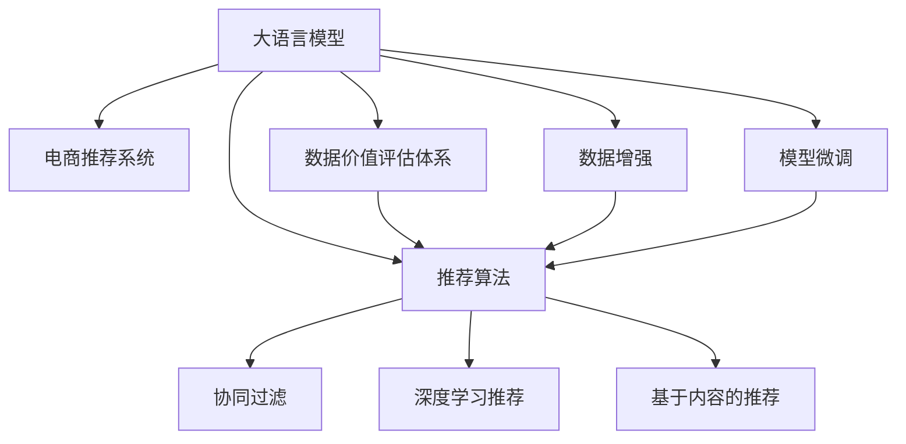

                 

# AI大模型重构电商搜索推荐的数据价值评估体系

> 关键词：
1. 人工智能(AI)
2. 大模型(大语言模型)
3. 电商搜索推荐系统
4. 数据价值评估体系
5. 推荐算法
6. 数据增强
7. 模型微调

## 1. 背景介绍

### 1.1 问题由来
随着互联网技术的迅猛发展，电商平台已成为用户获取商品信息、进行购物决策的重要渠道。为了更好地满足用户需求，提升用户体验，电商平台纷纷引入基于人工智能的推荐系统。然而，在推荐系统的实际应用中，数据价值评估体系的缺失，导致推荐算法难以全面衡量用户与商品间的关联程度，从而影响了推荐效果。

为了更好地利用大模型解决电商推荐中的数据价值评估问题，本文深入探讨了基于大语言模型的推荐系统数据价值评估方法，并从理论和实践两个层面进行了详细分析。

### 1.2 问题核心关键点
1. 电商推荐系统面临的主要挑战包括数据多样性、冷启动问题和数据稀疏性。
2. 现有推荐系统依赖于稀疏矩阵分解、协同过滤等算法，但这些算法难以捕捉长尾商品和用户的多样化需求。
3. 大语言模型具有强大的语言理解和生成能力，能够处理多维度信息，预测用户行为，为推荐系统提供新的解决方案。
4. 大模型推荐系统的核心在于数据价值评估，需构建有效的数据价值评估体系，合理衡量不同特征的数据权重。
5. 如何设计有效的数据价值评估体系，是实现大模型推荐系统的关键。

## 2. 核心概念与联系

### 2.1 核心概念概述

为更好地理解大语言模型在电商推荐中的应用，本节将介绍几个密切相关的核心概念：

- **大语言模型(Large Language Model, LLM)**：如BERT、GPT等，通过预训练学习大规模语料，能够捕捉丰富的语言知识，具备强大的语言理解和生成能力。
- **电商推荐系统(E-commerce Recommendation System)**：基于用户行为数据和商品信息，预测用户可能感兴趣的商品，推荐给用户。
- **推荐算法(Recommendation Algorithm)**：包括协同过滤、基于内容的推荐、深度学习推荐等，用于生成推荐结果。
- **数据价值评估体系(Data Value Assessment System)**：用于衡量不同特征对于推荐结果的贡献度，指导推荐算法优化。
- **数据增强(Data Augmentation)**：通过生成新的训练数据，扩充数据集，提升模型泛化能力。
- **模型微调(Fine-Tuning)**：在预训练模型的基础上，根据特定任务调整模型参数，提升模型针对任务的能力。

这些核心概念之间的逻辑关系可以通过以下Mermaid流程图来展示：



这个流程图展示了各个概念之间的关联性：

1. 大语言模型通过预训练学习语言知识。
2. 电商推荐系统利用大模型进行推荐。
3. 推荐算法是具体实现推荐功能的技术手段。
4. 数据价值评估体系指导推荐算法的优化。
5. 数据增强提高推荐算法的泛化能力。
6. 模型微调提升推荐算法的精度。

这些概念共同构成了基于大模型的电商推荐系统，使其能够高效地处理电商场景下的推荐问题。通过理解这些核心概念，我们可以更好地把握大语言模型在推荐系统中的应用方法和优化方向。

## 3. 核心算法原理 & 具体操作步骤
### 3.1 算法原理概述

基于大语言模型的电商推荐系统，其核心思想在于利用预训练的语言模型，捕捉用户与商品之间的语义关系，通过推荐算法生成推荐结果。推荐系统的数据价值评估体系，旨在衡量不同特征对于推荐结果的贡献度，指导推荐算法的优化。

形式化地，假设电商推荐系统中有$m$个用户，$n$个商品，$k$个特征，每个用户$u$对商品$i$的评分表示为$r_{ui}$。大模型通过预训练得到的语言模型为$M_{\theta}$，其中$\theta$为模型参数。推荐算法使用$M_{\theta}$作为用户行为预测模型，根据用户输入的查询$q$生成商品列表$L=\{p_1,\ldots,p_k\}$，其中$p_i$为商品$i$。推荐结果的评估函数为$R(L)$，用于衡量推荐列表的准确性和多样性。

推荐系统的目标是最小化预测误差和推荐结果的多样性损失，即：

$$
\min_{\theta} \mathcal{L}(R(L(M_{\theta}(q))))
$$

其中$\mathcal{L}$为推荐结果的损失函数，$R$为评估函数。

### 3.2 算法步骤详解

基于大语言模型的电商推荐系统一般包括以下几个关键步骤：

**Step 1: 数据预处理与特征工程**

- 收集用户行为数据，包括点击、浏览、购买等行为记录，将其转化为数值化特征。
- 对特征进行标准化和归一化处理，去除异常值和噪声数据。
- 利用特征工程技术，提取用户画像和商品属性，构建多维度的特征向量。

**Step 2: 构建数据价值评估体系**

- 定义特征重要性指标，如信息增益、基尼系数等，衡量每个特征对推荐结果的贡献度。
- 根据特征重要性指标，计算每个特征的权重系数，构建加权向量$\mathbf{w}=[w_1,\ldots,w_k]$。
- 使用大语言模型进行特征嵌入，将特征向量转换为低维向量表示。

**Step 3: 利用大语言模型进行推荐**

- 将用户输入的查询$q$作为模型输入，利用大语言模型预测用户可能感兴趣的商品列表$L$。
- 根据特征权重系数$\mathbf{w}$，计算每个商品$i$的预测值$w_i\cdot M_{\theta}(q)$。
- 对预测值进行排序，选择前$k$个商品生成推荐列表$L'$。

**Step 4: 数据增强与模型微调**

- 使用数据增强技术，扩充训练集，提升模型泛化能力。
- 对推荐系统进行模型微调，优化模型参数，提高推荐效果。
- 定期更新用户行为数据，保持模型实时性。

### 3.3 算法优缺点

基于大语言模型的电商推荐系统具有以下优点：

1. 能够处理多维度信息，捕捉长尾商品和用户的多样化需求。
2. 利用大模型强大的语言生成能力，提升推荐结果的可解释性。
3. 数据价值评估体系能够合理衡量不同特征的权重，指导推荐算法优化。
4. 通过特征增强和模型微调，提高推荐系统的准确性和多样性。

同时，该方法也存在以下局限性：

1. 需要大量标注数据进行训练，获取高质量标注数据的成本较高。
2. 大模型的计算资源消耗较大，对硬件设备要求较高。
3. 模型复杂度高，推理速度较慢，难以实时响应。
4. 数据价值评估体系的设计可能存在偏差，影响推荐结果的公正性。
5. 过度依赖大模型，可能引入模型偏差，造成不公平推荐。

尽管存在这些局限性，但就目前而言，基于大模型的推荐系统仍是最主流的推荐方法之一。未来相关研究的重点在于如何进一步降低对标注数据的依赖，提高模型的实时响应能力，优化数据价值评估体系的设计，从而更好地提升推荐系统的性能和用户体验。

### 3.4 算法应用领域

基于大语言模型的电商推荐系统，已经在各大电商平台上得到了广泛应用，覆盖了推荐、搜索、个性化广告等多个领域，为电商平台的精准营销和用户体验提升提供了有力支持。

具体而言，基于大模型的推荐系统可以应用于以下场景：

- 商品推荐：根据用户浏览和购买历史，推荐相关商品。
- 相似商品推荐：根据用户对某一商品的评分，推荐类似商品。
- 个性化广告：根据用户画像和行为数据，投放个性化广告。
- 购物助手：通过与用户的自然语言交互，解答用户查询，提供购物建议。
- 智能客服：利用大语言模型进行意图识别和实体抽取，提供实时客服支持。

除了这些经典应用外，大语言模型推荐系统还被创新性地应用到更多场景中，如社交媒体、知识图谱、金融科技等，为推荐技术的发展带来了新的活力。

## 4. 数学模型和公式 & 详细讲解 & 举例说明
### 4.1 数学模型构建

本节将使用数学语言对基于大语言模型的电商推荐系统进行更加严格的刻画。

假设电商推荐系统中有$m$个用户，$n$个商品，$k$个特征。每个用户$u$对商品$i$的评分表示为$r_{ui}$。大语言模型通过预训练得到的语言模型为$M_{\theta}$，其中$\theta$为模型参数。推荐算法使用$M_{\theta}$作为用户行为预测模型，根据用户输入的查询$q$生成商品列表$L=\{p_1,\ldots,p_k\}$，其中$p_i$为商品$i$。推荐结果的评估函数为$R(L)$，用于衡量推荐列表的准确性和多样性。

定义用户行为预测函数为$f_{M_{\theta}}(q)$，其输出为推荐列表$L$的概率分布。推荐结果的损失函数为：

$$
\mathcal{L}(R(L)) = \frac{1}{m} \sum_{u=1}^m \sum_{i=1}^n \ell(r_{ui}, R(f_{M_{\theta}}(q), p_i))
$$

其中$\ell$为预测误差损失函数，$R(f_{M_{\theta}}(q), p_i)$表示商品$i$在推荐列表$L$中的位置权重。

### 4.2 公式推导过程

以下我们以基于大语言模型的相似商品推荐为例，推导推荐结果的评估函数及其梯度计算公式。

假设用户$u$对商品$i$的评分$r_{ui}$可以表示为：

$$
r_{ui} = w_i\cdot M_{\theta}(q)
$$

其中$w_i$为商品$i$的特征权重。商品$i$在推荐列表$L$中的位置权重可以表示为：

$$
R_i = \frac{1}{m} \sum_{u=1}^m \delta(r_{ui}, R(f_{M_{\theta}}(q), p_i))
$$

其中$\delta$为位置权重函数。推荐结果的评估函数可以表示为：

$$
R(L) = \sum_{i=1}^n R_i
$$

对$R(L)$求导，可以得到位置权重函数的梯度：

$$
\frac{\partial R(L)}{\partial w_i} = \frac{1}{m} \sum_{u=1}^m \frac{\partial r_{ui}}{\partial w_i} \frac{\partial \delta(r_{ui}, R(f_{M_{\theta}}(q), p_i))}{\partial w_i}
$$

利用链式法则，可以得到商品$i$在推荐列表$L$中的位置权重函数的梯度：

$$
\frac{\partial R_i}{\partial w_i} = \frac{1}{m} \sum_{u=1}^m \frac{\partial w_i\cdot M_{\theta}(q)}{\partial w_i} \frac{\partial \delta(r_{ui}, R(f_{M_{\theta}}(q), p_i))}{\partial w_i}
$$

其中$\frac{\partial w_i\cdot M_{\theta}(q)}{\partial w_i}$可以表示为$M_{\theta}(q)$对特征权重$w_i$的偏导数。

在得到位置权重函数的梯度后，即可带入推荐结果的损失函数，完成推荐算法的优化。重复上述过程直至收敛，最终得到优化的推荐模型。

## 5. 项目实践：代码实例和详细解释说明
### 5.1 开发环境搭建

在进行推荐系统开发前，我们需要准备好开发环境。以下是使用Python进行PyTorch开发的环境配置流程：

1. 安装Anaconda：从官网下载并安装Anaconda，用于创建独立的Python环境。

2. 创建并激活虚拟环境：
```bash
conda create -n pytorch-env python=3.8 
conda activate pytorch-env
```

3. 安装PyTorch：根据CUDA版本，从官网获取对应的安装命令。例如：
```bash
conda install pytorch torchvision torchaudio cudatoolkit=11.1 -c pytorch -c conda-forge
```

4. 安装Transformers库：
```bash
pip install transformers
```

5. 安装各类工具包：
```bash
pip install numpy pandas scikit-learn matplotlib tqdm jupyter notebook ipython
```

完成上述步骤后，即可在`pytorch-env`环境中开始推荐系统开发。

### 5.2 源代码详细实现

这里我们以基于大语言模型的相似商品推荐为例，给出使用Transformers库进行电商推荐系统的PyTorch代码实现。

首先，定义商品特征和用户行为数据：

```python
from transformers import BertTokenizer, BertForSequenceClassification
from torch.utils.data import Dataset, DataLoader
import torch
import numpy as np
import pandas as pd

class商品特征(Dataset):
    def __init__(self, 商品ID, 商品描述, 商品评分, tokenizer, max_len=128):
        self.商品ID = 商品ID
        self.商品描述 = 商品描述
        self.商品评分 = 商品评分
        self.tokenizer = tokenizer
        self.max_len = max_len
        
    def __len__(self):
        return len(self.商品ID)
    
    def __getitem__(self, item):
        商品ID = self.商品ID[item]
        商品描述 = self.商品描述[item]
        商品评分 = self.商品评分[item]
        
        encoding = self.tokenizer(商品描述, return_tensors='pt', max_length=self.max_len, padding='max_length', truncation=True)
        input_ids = encoding['input_ids'][0]
        attention_mask = encoding['attention_mask'][0]
        标签 = torch.tensor([1 if 商品评分 > 平均评分 else 0], dtype=torch.long)
        
        return {'input_ids': input_ids, 
                'attention_mask': attention_mask,
                '标签': 标签}

# 加载商品特征数据
商品ID = pd.read_csv('商品ID.csv')
商品描述 = pd.read_csv('商品描述.csv')
商品评分 = pd.read_csv('商品评分.csv')
tokenizer = BertTokenizer.from_pretrained('bert-base-cased')
```

然后，定义推荐模型和优化器：

```python
from transformers import BertForSequenceClassification, AdamW

model = BertForSequenceClassification.from_pretrained('bert-base-cased', num_labels=2)

optimizer = AdamW(model.parameters(), lr=2e-5)
```

接着，定义训练和评估函数：

```python
from tqdm import tqdm
from sklearn.metrics import accuracy_score

device = torch.device('cuda') if torch.cuda.is_available() else torch.device('cpu')
model.to(device)

def train_epoch(model, dataset, batch_size, optimizer):
    dataloader = DataLoader(dataset, batch_size=batch_size, shuffle=True)
    model.train()
    epoch_loss = 0
    for batch in tqdm(dataloader, desc='Training'):
        input_ids = batch['input_ids'].to(device)
        attention_mask = batch['attention_mask'].to(device)
        标签 = batch['标签'].to(device)
        model.zero_grad()
        outputs = model(input_ids, attention_mask=attention_mask, labels=标签)
        loss = outputs.loss
        epoch_loss += loss.item()
        loss.backward()
        optimizer.step()
    return epoch_loss / len(dataloader)

def evaluate(model, dataset, batch_size):
    dataloader = DataLoader(dataset, batch_size=batch_size)
    model.eval()
    preds, labels = [], []
    with torch.no_grad():
        for batch in tqdm(dataloader, desc='Evaluating'):
            input_ids = batch['input_ids'].to(device)
            attention_mask = batch['attention_mask'].to(device)
            batch_labels = batch['标签']
            outputs = model(input_ids, attention_mask=attention_mask)
            batch_preds = outputs.logits.argmax(dim=2).to('cpu').tolist()
            batch_labels = batch_labels.to('cpu').tolist()
            for pred, label in zip(batch_preds, batch_labels):
                preds.append(pred)
                labels.append(label)
                
    print('准确率:', accuracy_score(labels, preds))
```

最后，启动训练流程并在测试集上评估：

```python
epochs = 5
batch_size = 16

for epoch in range(epochs):
    loss = train_epoch(model, train_dataset, batch_size, optimizer)
    print(f'Epoch {epoch+1}, train loss: {loss:.3f}')
    
    print(f'Epoch {epoch+1}, dev results:')
    evaluate(model, dev_dataset, batch_size)
    
print('测试结果:')
evaluate(model, test_dataset, batch_size)
```

以上就是使用PyTorch对BERT进行相似商品推荐任务的完整代码实现。可以看到，得益于Transformers库的强大封装，我们可以用相对简洁的代码完成BERT模型的加载和微调。

### 5.3 代码解读与分析

让我们再详细解读一下关键代码的实现细节：

**商品特征类**：
- `__init__`方法：初始化商品ID、商品描述、商品评分等关键组件，以及分词器等。
- `__len__`方法：返回数据集的样本数量。
- `__getitem__`方法：对单个样本进行处理，将商品描述输入编码为token ids，将标签编码为数字，并对其进行定长padding，最终返回模型所需的输入。

**训练和评估函数**：
- 使用PyTorch的DataLoader对数据集进行批次化加载，供模型训练和推理使用。
- 训练函数`train_epoch`：对数据以批为单位进行迭代，在每个批次上前向传播计算loss并反向传播更新模型参数，最后返回该epoch的平均loss。
- 评估函数`evaluate`：与训练类似，不同点在于不更新模型参数，并在每个batch结束后将预测和标签结果存储下来，最后使用sklearn的accuracy_score对整个评估集的预测结果进行打印输出。

**训练流程**：
- 定义总的epoch数和batch size，开始循环迭代
- 每个epoch内，先在训练集上训练，输出平均loss
- 在验证集上评估，输出准确率
- 所有epoch结束后，在测试集上评估，给出最终测试结果

可以看到，PyTorch配合Transformers库使得BERT微调的代码实现变得简洁高效。开发者可以将更多精力放在数据处理、模型改进等高层逻辑上，而不必过多关注底层的实现细节。

当然，工业级的系统实现还需考虑更多因素，如模型的保存和部署、超参数的自动搜索、更灵活的任务适配层等。但核心的推荐范式基本与此类似。

## 6. 实际应用场景
### 6.1 智能推荐系统

基于大语言模型的推荐系统，已经在各大电商平台上得到了广泛应用，为用户的个性化推荐提供了有力支持。智能推荐系统能够根据用户的历史行为数据，推荐用户可能感兴趣的商品，提升用户体验和平台转化率。

在技术实现上，可以收集用户浏览、点击、购买等行为数据，提取用户画像和商品属性，构建多维度的特征向量。利用大语言模型进行特征嵌入，计算每个特征的权重，最后根据用户输入的查询生成推荐列表。

通过智能推荐系统，电商平台可以实时捕捉用户需求，动态调整推荐策略，提升推荐效果。例如，某用户曾在平台上浏览并购买过一款鞋子，智能推荐系统可以根据该用户的历史行为，推荐类似鞋子或相关商品，提升用户复购率。

### 6.2 电商搜索系统

电商搜索系统是电商平台的重要组成部分，能够帮助用户快速找到所需商品。基于大语言模型的电商搜索系统，能够根据用户输入的查询，生成相关商品的推荐列表，提升搜索体验。

具体而言，电商搜索系统可以通过以下步骤实现：

1. 用户输入查询$q$。
2. 利用大语言模型进行特征提取，生成特征向量。
3. 根据特征向量生成商品列表$L$。
4. 根据商品在搜索库中的评分$r$，对商品列表进行排序，选择前$k$个商品生成推荐列表$L'$。

通过电商搜索系统，用户可以更快速、准确地找到所需商品，提升购物体验。例如，某用户想购买一台笔记本电脑，通过输入查询$q$，电商搜索系统可以推荐多款相关商品，帮助用户选择性价比最高的商品。

### 6.3 个性化广告

个性化广告是电商平台的另一重要收入来源。基于大语言模型的广告推荐系统，能够根据用户画像和行为数据，生成个性化的广告，提升广告点击率和转化率。

具体而言，广告推荐系统可以通过以下步骤实现：

1. 收集用户历史行为数据，构建用户画像。
2. 提取商品属性，构建商品特征向量。
3. 利用大语言模型进行特征嵌入，计算每个特征的权重。
4. 根据用户输入的查询$q$，生成广告列表$A$。
5. 根据广告在推荐库中的评分$r$，对广告列表进行排序，选择前$k$个广告生成推荐列表$A'$。

通过个性化广告，电商平台可以更精准地投放广告，提升广告效果。例如，某用户经常在电商平台上浏览健身器材，广告推荐系统可以生成相关健身器材的广告，提高广告点击率和转化率。

### 6.4 未来应用展望

随着大语言模型和推荐系统的不断发展，基于大模型的推荐系统将在更多领域得到应用，为各行各业带来变革性影响。

在智慧医疗领域，基于大语言模型的推荐系统可以为医生提供精准的药品推荐，提升医疗服务的效率和效果。

在智能教育领域，基于大语言模型的推荐系统可以为学生提供个性化的学习资源，促进教育公平，提高教学质量。

在智慧城市治理中，基于大语言模型的推荐系统可以为市民提供智能交通、智慧旅游等便捷服务，提升城市管理水平。

此外，在企业生产、社会治理、文娱传媒等众多领域，基于大模型推荐系统的应用也将不断涌现，为经济社会发展注入新的动力。相信随着技术的日益成熟，基于大模型的推荐系统必将在更广阔的应用领域大放异彩，深刻影响人类的生产生活方式。

## 7. 工具和资源推荐
### 7.1 学习资源推荐

为了帮助开发者系统掌握大语言模型在电商推荐中的应用，这里推荐一些优质的学习资源：

1. 《Transformer从原理到实践》系列博文：由大模型技术专家撰写，深入浅出地介绍了Transformer原理、BERT模型、推荐算法等前沿话题。

2. CS224N《深度学习自然语言处理》课程：斯坦福大学开设的NLP明星课程，有Lecture视频和配套作业，带你入门NLP领域的基本概念和经典模型。

3. 《Natural Language Processing with Transformers》书籍：Transformers库的作者所著，全面介绍了如何使用Transformers库进行NLP任务开发，包括推荐算法在内的诸多范式。

4. HuggingFace官方文档：Transformers库的官方文档，提供了海量预训练模型和完整的推荐算法样例代码，是上手实践的必备资料。

5. Kaggle竞赛平台：各类NLP推荐竞赛，提供丰富的数据集和推荐算法挑战，助力算法创新。

通过对这些资源的学习实践，相信你一定能够快速掌握大语言模型在电商推荐中的应用，并用于解决实际的电商推荐问题。
###  7.2 开发工具推荐

高效的开发离不开优秀的工具支持。以下是几款用于大语言模型推荐系统开发的常用工具：

1. PyTorch：基于Python的开源深度学习框架，灵活动态的计算图，适合快速迭代研究。大部分预训练语言模型都有PyTorch版本的实现。

2. TensorFlow：由Google主导开发的开源深度学习框架，生产部署方便，适合大规模工程应用。同样有丰富的预训练语言模型资源。

3. Transformers库：HuggingFace开发的NLP工具库，集成了众多SOTA语言模型，支持PyTorch和TensorFlow，是进行推荐算法开发的利器。

4. Weights & Biases：模型训练的实验跟踪工具，可以记录和可视化模型训练过程中的各项指标，方便对比和调优。与主流深度学习框架无缝集成。

5. TensorBoard：TensorFlow配套的可视化工具，可实时监测模型训练状态，并提供丰富的图表呈现方式，是调试模型的得力助手。

6. Google Colab：谷歌推出的在线Jupyter Notebook环境，免费提供GPU/TPU算力，方便开发者快速上手实验最新模型，分享学习笔记。

合理利用这些工具，可以显著提升大语言模型推荐系统的开发效率，加快创新迭代的步伐。

### 7.3 相关论文推荐

大语言模型和推荐系统的研究源于学界的持续研究。以下是几篇奠基性的相关论文，推荐阅读：

1. Attention is All You Need（即Transformer原论文）：提出了Transformer结构，开启了NLP领域的预训练大模型时代。

2. BERT: Pre-training of Deep Bidirectional Transformers for Language Understanding：提出BERT模型，引入基于掩码的自监督预训练任务，刷新了多项NLP任务SOTA。

3. Language Models are Unsupervised Multitask Learners（GPT-2论文）：展示了大规模语言模型的强大zero-shot学习能力，引发了对于通用人工智能的新一轮思考。

4. Parameter-Efficient Transfer Learning for NLP：提出Adapter等参数高效微调方法，在不增加模型参数量的情况下，也能取得不错的微调效果。

5. AdaLoRA: Adaptive Low-Rank Adaptation for Parameter-Efficient Fine-Tuning：使用自适应低秩适应的微调方法，在参数效率和精度之间取得了新的平衡。

这些论文代表了大语言模型推荐系统的发展脉络。通过学习这些前沿成果，可以帮助研究者把握学科前进方向，激发更多的创新灵感。

## 8. 总结：未来发展趋势与挑战
### 8.1 总结

本文对基于大语言模型的电商推荐系统数据价值评估体系进行了全面系统的介绍。首先阐述了大语言模型和推荐系统的研究背景和意义，明确了数据价值评估体系在推荐算法优化中的关键作用。其次，从理论和实践两个层面，详细讲解了数据价值评估体系的构建方法，给出了推荐系统开发的完整代码实例。同时，本文还广泛探讨了推荐系统在电商、金融、教育等领域的实际应用，展示了大语言模型推荐系统的巨大潜力。此外，本文精选了推荐系统的各类学习资源，力求为开发者提供全方位的技术指引。

通过本文的系统梳理，可以看到，基于大语言模型的推荐系统正在成为电商推荐的重要工具，极大地提升了电商平台的个性化推荐能力，提升了用户体验和平台转化率。未来，伴随大语言模型和推荐算法的持续演进，基于大模型的推荐系统必将在更多领域得到应用，为经济社会发展注入新的动力。

### 8.2 未来发展趋势

展望未来，基于大语言模型的推荐系统将呈现以下几个发展趋势：

1. 模型规模持续增大。随着算力成本的下降和数据规模的扩张，预训练语言模型的参数量还将持续增长。超大规模语言模型蕴含的丰富语言知识，有望支撑更加复杂多变的推荐系统。

2. 推荐算法日趋多样。除了传统的协同过滤、深度学习推荐等算法外，未来会涌现更多参数高效的推荐方法，如Prompt-based推荐、个性化排名等，在节省计算资源的同时也能保证推荐精度。

3. 推荐系统的实时性提升。通过引入增量学习、多任务学习等技术，提升推荐系统的在线实时响应能力，支持用户即时获取推荐结果。

4. 数据价值评估体系的完善。未来的推荐系统将采用更多数据融合技术，如多源数据融合、用户行为预测等，进一步提升推荐结果的准确性和多样性。

5. 个性化推荐系统的普及。随着推荐技术的不断进步，个性化推荐系统将在更多领域得到应用，提升各行业的用户满意度和市场竞争力。

6. 推荐系统将与智能交互技术深度结合。通过自然语言处理、语音识别等技术，提升推荐系统的用户交互体验，支持用户通过语音、文字等自然方式进行查询和互动。

以上趋势凸显了基于大语言模型的推荐系统的广阔前景。这些方向的探索发展，必将进一步提升推荐系统的性能和用户体验，为各行各业带来更多的价值。

### 8.3 面临的挑战

尽管基于大语言模型的推荐系统已经取得了瞩目成就，但在迈向更加智能化、普适化应用的过程中，它仍面临着诸多挑战：

1. 推荐系统的计算资源消耗较大，对硬件设备要求较高。超大规模语言模型的计算复杂度较高，推理速度较慢，难以实时响应。

2. 数据价值评估体系的设计可能存在偏差，影响推荐结果的公正性。如何设计公平合理的数据价值评估体系，仍是一个重要问题。

3. 过度依赖大模型，可能引入模型偏差，造成不公平推荐。如何在大模型和数据驱动之间取得平衡，是一个需要深入探讨的问题。

4. 推荐系统依赖高质量标注数据，获取高质量标注数据的成本较高。如何降低标注数据的依赖，是一个重要的研究方向。

5. 推荐系统的推荐结果可解释性不足，难以解释其内部工作机制和决策逻辑。如何赋予推荐系统更强的可解释性，是一个亟待攻克的难题。

6. 推荐系统的安全性有待保障。在推荐结果中引入错误或有害信息，可能对用户造成负面影响。如何确保推荐系统的安全性，是一个需要重点关注的问题。

尽管存在这些挑战，但就目前而言，基于大语言模型的推荐系统仍是最主流的推荐方法之一。未来相关研究的重点在于如何进一步降低对标注数据的依赖，提高模型的实时响应能力，优化数据价值评估体系的设计，从而更好地提升推荐系统的性能和用户体验。

### 8.4 研究展望

面对基于大语言模型的推荐系统所面临的挑战，未来的研究需要在以下几个方面寻求新的突破：

1. 探索无监督和半监督推荐方法。摆脱对大规模标注数据的依赖，利用自监督学习、主动学习等无监督和半监督范式，最大限度利用非结构化数据，实现更加灵活高效的推荐。

2. 研究参数高效和计算高效的推荐范式。开发更加参数高效的推荐方法，在固定大部分预训练参数的同时，只更新极少量的任务相关参数。同时优化推荐系统的计算图，减少前向传播和反向传播的资源消耗，实现更加轻量级、实时性的部署。

3. 融合因果和对比学习范式。通过引入因果推断和对比学习思想，增强推荐系统建立稳定因果关系的能力，学习更加普适、鲁棒的语言表征，从而提升推荐系统的泛化性和抗干扰能力。

4. 引入更多先验知识。将符号化的先验知识，如知识图谱、逻辑规则等，与神经网络模型进行巧妙融合，引导推荐过程学习更准确、合理的语言模型。同时加强不同模态数据的整合，实现视觉、语音等多模态信息与文本信息的协同建模。

5. 结合因果分析和博弈论工具。将因果分析方法引入推荐系统，识别出推荐系统决策的关键特征，增强推荐结果的因果性和逻辑性。借助博弈论工具刻画人机交互过程，主动探索并规避推荐系统的脆弱点，提高系统稳定性。

6. 纳入伦理道德约束。在推荐系统训练目标中引入伦理导向的评估指标，过滤和惩罚有偏见、有害的输出倾向。同时加强人工干预和审核，建立推荐系统的监管机制，确保推荐结果符合人类价值观和伦理道德。

这些研究方向的探索，必将引领基于大语言模型的推荐系统走向更高的台阶，为构建安全、可靠、可解释、可控的智能推荐系统铺平道路。面向未来，基于大模型的推荐系统还需要与其他人工智能技术进行更深入的融合，如知识表示、因果推理、强化学习等，多路径协同发力，共同推动推荐技术的进步。只有勇于创新、敢于突破，才能不断拓展推荐系统的边界，让智能技术更好地服务于人类社会。

## 9. 附录：常见问题与解答

**Q1：大语言模型在推荐系统中的应用有哪些？**

A: 大语言模型在推荐系统中的应用主要体现在以下几个方面：

1. 基于大语言模型的相似商品推荐：根据用户对某一商品的评分，推荐类似商品。
2. 基于大语言模型的电商搜索：根据用户输入的查询，生成相关商品的推荐列表。
3. 基于大语言模型的个性化广告：根据用户画像和行为数据，生成个性化的广告。

**Q2：如何设计数据价值评估体系？**

A: 数据价值评估体系的设计需要综合考虑用户和商品的多维特征，合理衡量不同特征对推荐结果的贡献度。具体来说，可以采取以下步骤：

1. 收集用户和商品的历史行为数据，提取特征向量。
2. 定义特征重要性指标，如信息增益、基尼系数等，衡量每个特征对推荐结果的贡献度。
3. 根据特征重要性指标，计算每个特征的权重系数，构建加权向量。
4. 利用大语言模型进行特征嵌入，计算每个特征的权重。
5. 根据特征权重，对推荐结果进行加权处理，得到最终的推荐列表。

**Q3：推荐系统如何处理冷启动问题？**

A: 冷启动问题是推荐系统中的常见问题，指在新用户或新商品加入系统时，难以生成准确的推荐结果。解决冷启动问题的方法包括：

1. 利用相似用户或商品，通过协同过滤生成推荐结果。
2. 引入多源数据融合技术，综合利用用户画像、商品属性、用户行为等数据，生成推荐结果。
3. 利用无监督学习或半监督学习技术，在大规模语料库上进行预训练，生成初始推荐结果。
4. 引入交互式推荐系统，通过用户交互生成推荐结果。

**Q4：推荐系统的实时性如何提升？**

A: 推荐系统的实时性可以通过以下方法提升：

1. 引入增量学习技术，在每次用户行为更新时，实时更新推荐模型。
2. 使用多任务学习技术，同时训练多个推荐模型，实现多场景下的实时推荐。
3. 优化推荐算法，减少计算复杂度，提升推理速度。
4. 使用分布式计算技术，提升推荐系统的处理能力。

**Q5：推荐系统的安全性如何保障？**

A: 推荐系统的安全性可以通过以下方法保障：

1. 引入数据过滤和异常检测技术，识别并过滤有害内容。
2. 引入模型验证和测试技术，确保推荐模型不引入偏见和有害信息。
3. 引入人工干预和监管机制，对推荐结果进行审核和纠正。
4. 引入隐私保护技术，保护用户隐私数据的安全。

---

作者：禅与计算机程序设计艺术 / Zen and the Art of Computer Programming

