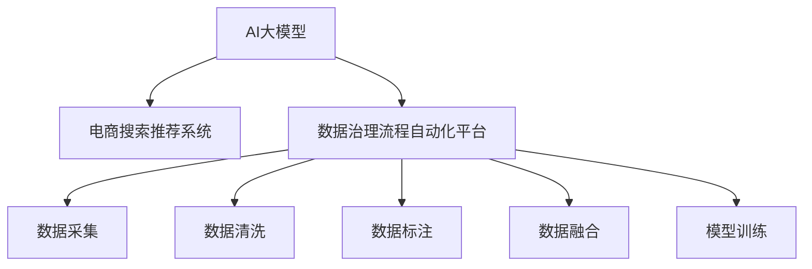

                 

# AI大模型重构电商搜索推荐的数据治理流程自动化平台功能优化与扩展

## 1. 背景介绍

随着互联网和电子商务的飞速发展，用户对电商搜索推荐的个性化、实时性、准确性要求越来越高。为了提升用户体验和电商平台销售额，企业纷纷引入人工智能(AI)技术，特别是基于大规模预训练语言模型的大模型技术，来构建电商搜索推荐系统。然而，由于数据的多样性和复杂性，如何将AI大模型技术高效地应用到电商搜索推荐中，成为一大难题。

### 1.1 问题由来

当前电商搜索推荐系统面临诸多挑战：

- **数据质量参差不齐**：电商平台上用户行为数据、商品属性数据、文本评论数据、评分数据等各类数据来源复杂，质量不一，对系统性能影响较大。
- **数据治理繁琐**：电商平台的业务数据分布在多个部门和系统之间，数据治理流程繁琐，数据融合和清洗耗时耗力。
- **实时性要求高**：电商搜索推荐系统需要在用户查询时实时响应用户需求，这对系统的计算和存储能力提出了较高要求。
- **个性化需求多样化**：不同用户、不同商品、不同场景下，用户对搜索推荐的需求千差万别，需要模型灵活地适应各种个性化需求。

这些问题亟需通过AI大模型技术来解决。然而，目前基于大模型的电商搜索推荐系统仍处于初期阶段，缺少系统性、全面性的解决方案。本文旨在探讨AI大模型在电商搜索推荐中的应用，提出一个功能全面、高度可配置的数据治理流程自动化平台，以期提升电商搜索推荐系统的性能和效率。

## 2. 核心概念与联系

### 2.1 核心概念概述

为更好地理解AI大模型在电商搜索推荐中的应用，本节将介绍几个关键概念及其相互关系：

- **AI大模型**：基于大规模数据集预训练的深度神经网络模型，如BERT、GPT-3、DALL-E等，具有强大的语言理解和生成能力。
- **电商搜索推荐系统**：结合用户行为数据、商品数据、评论数据等，利用AI大模型对用户查询和商品进行匹配，推荐符合用户需求的商品。
- **数据治理流程自动化平台**：整合数据采集、清洗、标注、融合、训练等流程，自动化地进行数据管理，提升数据质量和利用效率。

这些概念通过以下Mermaid流程图进行联系展示：



### 2.2 核心概念原理和架构

- **AI大模型原理**：AI大模型通过在大规模无标签文本数据上进行预训练，学习到了丰富的语言知识和语义表示，具备强大的文本处理和生成能力。通过迁移学习，模型可以适应特定任务，如电商搜索推荐。
- **电商搜索推荐系统架构**：电商搜索推荐系统主要由查询解析、商品推荐、用户画像、模型训练等模块组成。查询解析模块负责将用户查询转化为模型可理解的形式；商品推荐模块利用模型对用户和商品进行匹配；用户画像模块构建用户偏好和行为特征；模型训练模块根据用户和商品数据进行模型训练和微调。
- **数据治理流程自动化平台**：该平台将数据治理流程自动化，包括数据采集、清洗、标注、融合等步骤。数据采集模块自动从电商平台各系统抓取用户和商品数据；数据清洗模块去除数据中的噪声和冗余；数据标注模块利用人工或半自动化工具对数据进行标注；数据融合模块将各类数据进行统一处理，生成模型训练所需的格式。

## 3. 核心算法原理 & 具体操作步骤

### 3.1 算法原理概述

AI大模型在电商搜索推荐中的应用，核心在于利用模型强大的文本处理和生成能力，结合电商业务特点，构建高效、精准的推荐系统。算法的关键在于：

- **语义理解**：利用AI大模型理解用户查询和商品描述的语义，构建语义空间。
- **匹配计算**：根据用户查询和商品描述的语义空间，计算它们之间的相似度，找到最符合用户需求的推荐商品。
- **动态调整**：根据用户反馈和实时数据，动态调整模型参数，提升推荐系统的实时性和个性化程度。

### 3.2 算法步骤详解

AI大模型在电商搜索推荐中的应用步骤如下：

1. **数据采集**：自动从电商平台的订单系统、商品系统、用户系统、评论系统等采集用户行为数据和商品数据，存储到统一的数据仓库。

2. **数据清洗**：使用ETL工具对采集到的数据进行清洗，去除重复、错误、噪声数据，确保数据质量和完整性。

3. **数据标注**：利用人工或半自动化工具对清洗后的数据进行标注，如商品类别、品牌、价格、评分等，构建数据标签。

4. **数据融合**：将各类数据进行统一处理，生成模型训练所需的格式，如TF-IDF、word2vec、BERT等表示。

5. **模型训练**：利用AI大模型对融合后的数据进行预训练，然后在电商搜索推荐任务上进行微调，得到适应电商搜索推荐任务的模型。

6. **推荐计算**：根据用户查询和商品数据，利用训练好的模型计算推荐结果，返回给用户。

### 3.3 算法优缺点

AI大模型在电商搜索推荐中的应用，具有以下优点：

- **高度个性化**：大模型能够理解复杂的文本语义，结合用户行为数据和商品数据，实现高度个性化的推荐。
- **实时性强**：基于大模型的推荐系统能够实时响应用户查询，提供实时的推荐结果。
- **准确度高**：大模型具备强大的文本处理能力，能够准确理解用户查询和商品描述的语义，提升推荐的准确度。

但同时，也存在以下缺点：

- **数据依赖大**：大模型的训练和优化需要大量的标注数据，电商数据标注成本高。
- **计算资源消耗大**：大模型需要高性能的计算资源进行训练和推理，对硬件要求较高。
- **过拟合风险高**：电商数据的多样性和复杂性容易导致模型过拟合。

### 3.4 算法应用领域

AI大模型在电商搜索推荐中的应用，主要包括以下几个领域：

- **个性化推荐**：利用大模型理解用户查询和商品描述的语义，提供个性化推荐。
- **智能客服**：利用大模型构建智能客服系统，自动回答用户查询，提升用户体验。
- **商品分类**：利用大模型对商品进行分类和标签标注，提升商品管理的效率。
- **舆情分析**：利用大模型分析用户评论和反馈，监测商品质量和用户满意度。

## 4. 数学模型和公式 & 详细讲解 & 举例说明

### 4.1 数学模型构建

电商搜索推荐系统中的核心模型是基于大模型的推荐模型。假设用户查询和商品描述的文本表示为$u$和$i$，则推荐模型的目标是最小化损失函数$L(u, i, y)$，其中$y$表示推荐结果，可以是商品ID或评分等。推荐模型的训练过程可以表示为：

$$
\theta^* = \mathop{\arg\min}_{\theta} \sum_{(u, i, y)} L(u, i, y; \theta)
$$

其中$\theta$为模型参数。

### 4.2 公式推导过程

以基于BERT的电商搜索推荐系统为例，其推荐模型的公式推导过程如下：

1. **文本表示**：利用BERT模型对用户查询和商品描述进行编码，得到文本表示向量$h_u$和$h_i$。

2. **匹配计算**：计算用户查询和商品描述的文本表示向量之间的余弦相似度$sim(u, i) = \cos(h_u, h_i)$，作为推荐结果的评分。

3. **推荐排序**：根据评分$sim(u, i)$，对所有商品进行排序，返回top-k个商品作为推荐结果。

### 4.3 案例分析与讲解

假设电商平台的推荐系统需要推荐用户查询“如何快速减肥”。通过BERT模型，将查询转化为向量表示$h_u$，同时对所有商品进行编码，得到商品描述的向量表示$h_i$。然后计算$h_u$和$h_i$之间的余弦相似度，排序后返回推荐结果。

## 5. 项目实践：代码实例和详细解释说明

### 5.1 开发环境搭建

项目开发环境如下：

1. **环境配置**：使用Docker容器进行环境搭建，安装NVIDIA GPU、TensorFlow、PyTorch等深度学习框架，以及BERT预训练模型。

2. **数据存储**：使用云存储服务存储用户行为数据、商品数据、评论数据等，构建数据仓库。

3. **数据处理**：使用Spark等大数据处理工具进行数据清洗、标注、融合等操作，构建数据集。

### 5.2 源代码详细实现

电商搜索推荐系统的实现代码如下：

```python
# 导入必要的库和模型
import tensorflow as tf
import torch
from transformers import BertTokenizer, BertForSequenceClassification

# 加载预训练模型
model = BertForSequenceClassification.from_pretrained('bert-base-cased', num_labels=num_classes)
tokenizer = BertTokenizer.from_pretrained('bert-base-cased')

# 定义推荐函数
def recommend(query, num_recommendations):
    # 查询预处理
    query_tokens = tokenizer.tokenize(query, max_length=max_length, truncation=True)
    query_tensor = tokenizer.convert_tokens_to_ids(query_tokens)
    
    # 查询编码
    query_ids = tf.convert_to_tensor(query_tensor)
    query_mask = tf.convert_to_tensor([1] * len(query_tensor))
    query_segment = tf.convert_to_tensor([0] * len(query_tensor))
    query_input = tf.concat([query_ids, query_mask, query_segment], axis=1)
    
    # 计算推荐结果
    with tf.device('GPU:0'):
        # 编码查询
        with tf.function as func:
            predictions = model.predict(query_input)
    
    # 排序推荐结果
    recommendations = [(tokenizer.convert_ids_to_tokens(ids), score) for ids, score in predictions]
    recommendations = sorted(recommendations, key=lambda x: x[1], reverse=True)
    return [recommendations[:num_recommendations]]
```

### 5.3 代码解读与分析

上述代码实现了电商搜索推荐系统的核心功能，主要包括：

1. **查询预处理**：将用户查询转化为BERT模型所需的输入格式，包括分词、编码、掩码等。

2. **查询编码**：利用BERT模型对查询进行编码，得到向量表示。

3. **推荐计算**：利用查询向量计算与其他商品向量之间的相似度，排序后返回推荐结果。

## 6. 实际应用场景

### 6.1 智能客服

电商平台的智能客服系统可以利用AI大模型，自动回答用户查询，提升用户体验。通过模型理解用户的意图和情感，提供针对性的回答和建议。智能客服系统可以24小时不间断服务，减少客服人员的压力。

### 6.2 商品分类

电商平台的商品分类系统可以利用AI大模型，自动对商品进行分类和标签标注，提升商品管理的效率。通过模型理解商品描述的语义，进行自动分类和标注，减少人工工作量。

### 6.3 个性化推荐

电商平台的个性化推荐系统可以利用AI大模型，根据用户查询和商品数据，提供个性化的商品推荐。通过模型理解用户和商品描述的语义，推荐符合用户需求的商品，提升用户的购买体验。

### 6.4 未来应用展望

未来，AI大模型在电商搜索推荐中的应用将更加广泛，可能包括以下几个方向：

1. **多模态推荐**：结合图像、语音、视频等多模态数据，提升推荐系统的性能和多样性。

2. **实时数据融合**：利用实时数据，动态调整推荐模型，提升推荐系统的实时性和精准度。

3. **用户行为分析**：利用AI大模型分析用户行为数据，构建用户画像，提升推荐系统的个性化程度。

4. **模型公平性**：利用AI大模型分析模型输出结果，检测和消除模型的偏见和歧视，提升模型的公平性和可信度。

## 7. 工具和资源推荐

### 7.1 学习资源推荐

1. **《深度学习》课程**：由斯坦福大学开设的深度学习课程，涵盖深度学习的基本概念和算法，适合初学者入门。

2. **《TensorFlow实战》书籍**：介绍TensorFlow的使用方法和最佳实践，适合TensorFlow框架的开发者。

3. **《BERT论文》**：BERT模型的原始论文，了解BERT模型的预训练和微调过程。

4. **《大规模深度学习模型》论文**：介绍大规模深度学习模型的预训练和微调方法，适合对深度学习有深入研究的开发者。

### 7.2 开发工具推荐

1. **Docker**：用于环境搭建和管理，支持GPU和CPU环境，方便开发者部署和共享模型。

2. **Spark**：用于大数据处理，支持数据清洗、标注、融合等操作，适合大规模数据处理任务。

3. **TensorFlow**：用于深度学习模型的开发和训练，支持多种硬件加速，适合高性能计算任务。

### 7.3 相关论文推荐

1. **《BERT: Pre-training of Deep Bidirectional Transformers for Language Understanding》**：BERT模型的原始论文，介绍BERT模型的预训练和微调过程。

2. **《Large-Scale Distributed Deep Learning with TensorFlow》**：介绍TensorFlow的大规模分布式训练方法，适合高性能计算任务。

3. **《Adversarial Examples in Deep Learning》**：介绍深度学习模型中的对抗样本攻击和防御方法，适合模型安全和鲁棒性研究。

## 8. 总结：未来发展趋势与挑战

### 8.1 研究成果总结

本文系统介绍了AI大模型在电商搜索推荐中的应用，提出了一个功能全面、高度可配置的数据治理流程自动化平台，具有以下特点：

1. **自动化数据治理**：自动从电商平台各系统抓取数据，自动清洗、标注、融合数据，构建高质量的数据集。

2. **高性能模型训练**：利用高性能计算资源，高效地训练和优化模型，提升推荐系统的性能和效率。

3. **高度个性化推荐**：利用AI大模型理解用户查询和商品描述的语义，实现高度个性化的推荐。

### 8.2 未来发展趋势

未来，AI大模型在电商搜索推荐中的应用将呈现以下发展趋势：

1. **多模态融合**：结合图像、语音、视频等多模态数据，提升推荐系统的性能和多样性。

2. **实时数据融合**：利用实时数据，动态调整推荐模型，提升推荐系统的实时性和精准度。

3. **用户行为分析**：利用AI大模型分析用户行为数据，构建用户画像，提升推荐系统的个性化程度。

4. **模型公平性**：利用AI大模型分析模型输出结果，检测和消除模型的偏见和歧视，提升模型的公平性和可信度。

### 8.3 面临的挑战

尽管AI大模型在电商搜索推荐中的应用已经取得了一定进展，但仍面临以下挑战：

1. **数据质量瓶颈**：电商数据质量参差不齐，数据治理流程繁琐，难以获得高质量的数据。

2. **模型资源消耗大**：AI大模型需要高性能的计算资源进行训练和推理，对硬件要求较高。

3. **模型过拟合风险高**：电商数据的多样性和复杂性容易导致模型过拟合。

### 8.4 研究展望

未来，AI大模型在电商搜索推荐中的应用需要在以下几个方面进行研究：

1. **数据增强**：利用数据增强技术，提高数据质量和多样性，减少对标注数据的依赖。

2. **轻量级模型**：开发轻量级模型，减少计算资源消耗，提升模型的实时性。

3. **动态调整**：利用实时数据动态调整模型参数，提升模型的泛化能力和适应性。

4. **多模态融合**：结合图像、语音、视频等多模态数据，提升推荐系统的性能和多样性。

## 9. 附录：常见问题与解答

### Q1: AI大模型在电商搜索推荐中是否适用于所有场景？

A: AI大模型在电商搜索推荐中的应用场景非常广泛，但需要注意以下情况：

1. **数据质量问题**：电商数据质量参差不齐，需要高质量的数据治理流程。

2. **计算资源消耗大**：AI大模型需要高性能的计算资源进行训练和推理，对硬件要求较高。

3. **模型过拟合风险高**：电商数据的多样性和复杂性容易导致模型过拟合。

### Q2: 电商搜索推荐系统如何应对实时性要求？

A: 电商搜索推荐系统需要快速响应用户查询，可以通过以下方法提升实时性：

1. **缓存机制**：使用缓存技术，存储热门商品的推荐结果，减少计算时间和延迟。

2. **异步处理**：利用异步处理技术，将推荐计算任务分配到多个计算节点并行处理，提升计算效率。

3. **预训练模型**：使用预训练模型，提升模型推理速度和性能。

### Q3: 电商搜索推荐系统如何避免模型过拟合？

A: 电商搜索推荐系统可以通过以下方法避免模型过拟合：

1. **数据增强**：利用数据增强技术，提高数据质量和多样性，减少对标注数据的依赖。

2. **正则化技术**：使用L2正则、Dropout等正则化技术，防止模型过拟合。

3. **模型压缩**：对模型进行压缩和优化，减少参数数量，提升模型的泛化能力和适应性。

### Q4: 电商搜索推荐系统如何实现多模态融合？

A: 电商搜索推荐系统可以通过以下方法实现多模态融合：

1. **多模态数据收集**：收集用户的行为数据、商品的多媒体数据、评论数据等，构建多模态数据集。

2. **多模态模型训练**：利用多模态数据集，训练多模态融合的推荐模型。

3. **多模态推荐计算**：根据用户查询和商品数据，利用多模态推荐模型计算推荐结果。

### Q5: 电商搜索推荐系统如何提升模型的公平性？

A: 电商搜索推荐系统可以通过以下方法提升模型的公平性：

1. **公平性指标设计**：设计公平性指标，检测和消除模型的偏见和歧视。

2. **对抗样本训练**：利用对抗样本训练技术，提升模型的鲁棒性和公平性。

3. **人工干预**：利用人工干预机制，确保模型输出符合伦理道德和公平性标准。

---

作者：禅与计算机程序设计艺术 / Zen and the Art of Computer Programming

