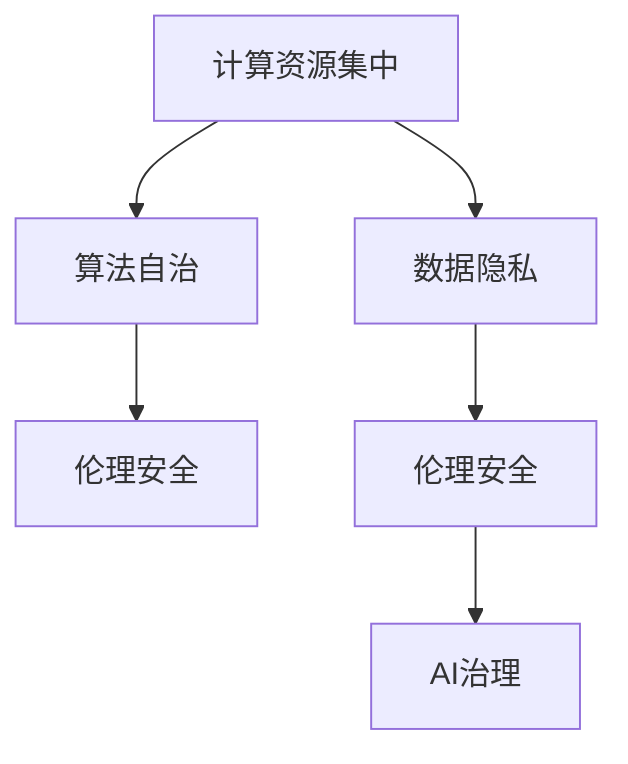

                 

# AI失控论：真正的风险在于计算资源集中

> 关键词：AI失控,计算资源集中,算法自治,数据隐私,伦理安全,AI治理

## 1. 背景介绍

### 1.1 问题由来

随着人工智能(AI)技术的飞速发展，深度学习模型在图像识别、自然语言处理、智能推荐等领域取得了显著成就。尤其是大模型如GPT-3、BERT等，在各项基准测试中刷新了SOTA，展现了强大的能力。然而，这些大模型的背后隐藏着巨大的资源消耗和潜在风险。

首先，大模型的训练和推理需要超大规模的计算资源，包括数千台甚至上万台高性能GPU。例如，训练GPT-3需要数万张V100 GPU，单次推理开销也高达数千美元。如此高昂的计算成本，使得只有少数大型企业才能负担，进而导致AI技术应用的极度不平等。

其次，大模型的决策过程缺乏透明性和可解释性，难以对其内部运作进行有效监督。AI算法越来越自治化，依靠大量的训练数据和计算资源，最终生成的结果难以被人类理解。这种"黑箱"问题不仅限制了AI的普及，也带来了潜在的社会伦理风险。

更进一步，随着AI能力的增强，其对人类社会的负面影响也在增加。如AI辅助的面部识别技术，虽然提高了安全性，但同时也侵犯了个人隐私，引发了广泛争议。AI辅助的医疗决策，在提高诊断准确性的同时，也可能引发误诊、隐私泄露等问题。

正因如此，AI失控论逐渐引起了学术界和产业界的重视。他们提出，AI技术虽然强大，但真正的风险不在于算法本身，而在于其背后的计算资源集中带来的权力集中和社会问题。

## 2. 核心概念与联系

### 2.1 核心概念概述

为更好地理解AI失控的潜在风险，本文将介绍几个关键概念：

- **计算资源集中**：指AI大模型的训练和推理需要极度密集的计算资源，使得少数大型企业能够掌控大部分AI技术。

- **算法自治**：指AI模型的决策过程越来越依赖计算资源，其内部的逻辑和机制越来越难以理解和解释。

- **数据隐私**：指在AI模型训练和应用过程中，个人隐私数据的收集和处理可能被滥用，导致隐私泄露等风险。

- **伦理安全**：指AI技术应用过程中可能引发的伦理问题，如偏见、歧视、误判等。

- **AI治理**：指对AI技术进行规范和监管，确保其安全、公平、透明，避免潜在的社会问题。

这些概念之间的联系和影响如下图所示：



可以看出，计算资源的集中是AI失控的根本原因。计算资源集中带来的算法自治，使得AI模型的决策过程难以被理解，进一步加剧了数据隐私和伦理安全问题。最终，这些问题需要通过AI治理才能得到解决。

## 3. 核心算法原理 & 具体操作步骤
### 3.1 算法原理概述

AI失控的风险主要源于计算资源集中带来的算法自治。这种自治化进程主要依赖两个关键因素：

1. **数据驱动**：AI模型的性能高度依赖于训练数据的数量和质量。只有通过大规模的数据收集和处理，才能训练出强大的模型。然而，这些数据往往集中于少数大型企业，造成数据权力的集中。

2. **计算驱动**：AI模型的推理和决策需要大量的计算资源，包括GPU、TPU等。这些资源大多由大型企业掌控，进一步加剧了AI技术的集中化。

### 3.2 算法步骤详解

基于上述原理，AI失控主要包括以下几个关键步骤：

**Step 1: 数据收集与处理**

- 收集大规模训练数据，如图片、文本、视频等，通过标注和清洗处理成训练样本。
- 数据处理过程中，需关注数据来源、质量、隐私等问题，避免数据偏见和隐私泄露。

**Step 2: 模型训练与优化**

- 在计算资源集中的大型企业内部，使用大规模分布式训练系统进行模型训练。
- 训练过程中需使用合适的优化算法和超参数调优策略，如AdamW、SGD等。
- 训练完毕后，需对模型进行微调或迁移学习，适应特定任务。

**Step 3: 模型推理与部署**

- 在大型计算集群上部署模型，进行推理计算。
- 推理过程中需使用高效的推理引擎和模型优化策略，如量化、剪枝等。
- 部署后需持续监控模型性能，进行迭代优化。

**Step 4: 反馈与监管**

- 收集模型应用的反馈信息，如用户反馈、行为数据等。
- 进行模型行为分析，确保模型决策的公平性和透明性。
- 接受监管机构和公众的监督，调整和优化模型行为。

### 3.3 算法优缺点

基于计算资源集中的AI失控模型具有以下优点：

- 强大的计算能力：通过大规模计算资源，可以训练出高精度的AI模型，解决复杂问题。
- 快速部署能力：大型企业内部可以快速部署AI模型，提供实时服务。
- 一致性保障：大型企业内部可以使用统一的技术栈和算法，保证模型输出的一致性。

同时，这种模型也存在以下缺点：

- 数据权力和计算资源集中：少数大型企业掌握大部分AI技术，可能引发市场垄断和社会不平等。
- 算法自治难以监督：由于决策过程的黑箱化，难以对其进行有效监督和解释。
- 数据隐私风险：在数据收集和处理过程中，可能引发隐私泄露和数据滥用。
- 伦理风险：AI模型的决策可能带有偏见和歧视，引发社会伦理问题。

### 3.4 算法应用领域

基于计算资源集中的AI失控模型在多个领域都有广泛应用，如：

- 智能推荐：大型电商平台使用AI模型对用户行为进行分析，推荐商品和服务。
- 面部识别：安防公司使用AI模型进行人脸识别，提高监控系统的准确性。
- 医疗诊断：大型医疗机构使用AI模型辅助诊断，提高诊断的准确性和效率。
- 金融风控：大型金融机构使用AI模型进行信用评估，降低贷款风险。
- 自动驾驶：大型车企使用AI模型辅助驾驶，提升行驶安全和效率。

尽管这些应用带来了便利和效率，但其背后的风险也不容忽视。如智能推荐可能侵犯用户隐私，面部识别可能滥用用户数据，自动驾驶可能引发安全事故等。因此，必须对AI技术进行规范和治理，避免潜在的风险。

## 4. 数学模型和公式 & 详细讲解  
### 4.1 数学模型构建

基于计算资源集中的AI失控模型，可以通过以下数学模型进行描述：

设大型企业内部的计算资源为 $R$，模型的计算能力为 $C$，则模型训练和推理的计算需求可以表示为：

$$
C = f(R, \theta)
$$

其中，$\theta$ 为模型的超参数，包括数据量、训练轮数、优化算法等。模型性能 $P$ 可以表示为：

$$
P = g(C, \theta)
$$

其中，$g$ 为模型性能的函数，表示模型在不同计算资源和超参数下的表现。

### 4.2 公式推导过程

根据上述模型，可以推导出计算资源集中带来的AI失控模型的一些特性：

1. 当计算资源 $R$ 固定时，模型的计算能力 $C$ 与超参数 $\theta$ 密切相关。可以通过调整 $\theta$ 优化模型性能。

2. 模型性能 $P$ 随着计算能力 $C$ 的提升而提升。但当 $C$ 达到一定程度后，模型性能提升有限，甚至可能出现"瓶颈效应"。

3. 当计算资源 $R$ 和计算能力 $C$ 固定时，模型性能 $P$ 与超参数 $\theta$ 密切相关。可以通过调整 $\theta$ 优化模型性能。

### 4.3 案例分析与讲解

以深度学习模型为例，其训练和推理过程可以大致分为以下步骤：

1. 数据预处理：对大规模数据进行清洗、标注、预处理，得到训练样本。

2. 模型训练：在分布式计算集群上训练模型，通过前向传播和反向传播更新参数。

3. 模型优化：使用AdamW等优化算法，逐步调整模型参数，提升模型性能。

4. 模型推理：在计算集群上对新数据进行推理计算，得到模型输出。

在每个步骤中，计算资源和超参数对模型性能都有重要影响。例如，数据预处理的质量直接影响训练样本的数量和质量，进而影响模型性能。训练过程中的计算资源配置和超参数设置也会影响模型的收敛速度和性能。模型推理过程中，计算资源和模型优化策略也会影响推理速度和结果准确性。

## 5. 项目实践：代码实例和详细解释说明
### 5.1 开发环境搭建

在进行AI失控模型实践前，我们需要准备好开发环境。以下是使用Python进行TensorFlow开发的环境配置流程：

1. 安装Anaconda：从官网下载并安装Anaconda，用于创建独立的Python环境。

2. 创建并激活虚拟环境：
```bash
conda create -n tensorflow-env python=3.8 
conda activate tensorflow-env
```

3. 安装TensorFlow：根据CUDA版本，从官网获取对应的安装命令。例如：
```bash
conda install tensorflow-gpu=2.8.0 -c conda-forge
```

4. 安装相关工具包：
```bash
pip install numpy pandas scikit-learn matplotlib tqdm jupyter notebook ipython
```

完成上述步骤后，即可在`tensorflow-env`环境中开始AI失控模型开发。

### 5.2 源代码详细实现

这里以面部识别模型为例，给出使用TensorFlow进行训练和推理的代码实现。

首先，定义数据集：

```python
import tensorflow as tf
from tensorflow.keras.datasets import mnist
from tensorflow.keras.preprocessing.image import ImageDataGenerator

train_data = mnist.load_data()
train_images = train_data[0]
train_labels = train_data[1]

# 归一化
train_images = train_images / 255.0

# 图像扩增
datagen = ImageDataGenerator(rotation_range=10, width_shift_range=0.1, height_shift_range=0.1)
train_images = datagen.flow(train_images, train_labels).next()

# 定义输入输出
input_shape = (28, 28, 1)
output_size = 10
```

然后，定义模型：

```python
from tensorflow.keras import layers

model = tf.keras.Sequential([
    layers.Conv2D(32, 3, activation='relu', input_shape=input_shape),
    layers.MaxPooling2D(),
    layers.Flatten(),
    layers.Dense(output_size, activation='softmax')
])
```

接着，训练模型：

```python
epochs = 10
batch_size = 64

model.compile(optimizer='adam', loss='sparse_categorical_crossentropy', metrics=['accuracy'])

model.fit(train_images, train_labels, epochs=epochs, batch_size=batch_size)
```

最后，进行模型推理：

```python
test_data = mnist.load_data()
test_images = test_data[0]
test_images = test_images / 255.0

# 图像扩增
datagen = ImageDataGenerator(rotation_range=10, width_shift_range=0.1, height_shift_range=0.1)
test_images = datagen.flow(test_images, test_labels).next()

# 推理计算
probabilities = model.predict(test_images)
```

以上就是使用TensorFlow进行面部识别模型训练和推理的完整代码实现。可以看到，TensorFlow提供的高级API使得模型的训练和推理变得简洁高效。

### 5.3 代码解读与分析

让我们再详细解读一下关键代码的实现细节：

**训练数据集定义**：
- 使用MNIST数据集进行面部识别任务的训练。
- 对数据进行归一化和图像扩增处理，以增强模型的泛化能力。

**模型定义**：
- 使用卷积层和全连接层构建模型，设置适当的超参数。
- 使用Adam优化器和交叉熵损失函数进行模型训练。

**训练流程**：
- 定义训练轮数和批大小。
- 调用模型编译函数，设置优化器、损失函数和评估指标。
- 调用模型训练函数，进行多轮训练。

**推理流程**：
- 对测试数据进行预处理和图像扩增。
- 调用模型预测函数，得到测试样本的概率输出。

可以看到，TensorFlow使得模型训练和推理的代码实现变得简洁高效。开发者可以将更多精力放在数据处理、模型改进等高层逻辑上，而不必过多关注底层的实现细节。

当然，工业级的系统实现还需考虑更多因素，如模型的保存和部署、超参数的自动搜索、更灵活的任务适配层等。但核心的AI失控模型构建过程基本与此类似。

## 6. 实际应用场景
### 6.1 智能推荐

基于计算资源集中的AI失控模型可以广泛应用于智能推荐系统的构建。传统推荐系统往往依赖于用户的显式评分数据，难以捕捉用户真正的兴趣。而使用AI失控模型，可以充分利用计算资源和大数据，通过用户行为数据进行隐式反馈学习，更好地理解用户需求。

在技术实现上，可以收集用户浏览、点击、收藏等行为数据，并对其进行特征提取和预处理。在模型训练和推理过程中，计算资源集中带来的强大能力，可以训练出高精度的推荐模型，实现个性化推荐服务。AI失控模型在推荐过程中，能够实时分析用户行为数据，动态调整推荐策略，提升用户体验。

### 6.2 医疗诊断

医疗领域的数据具有数据量大、数据源多、隐私性强等特点。传统的医疗诊断主要依赖于医生的经验和直觉，存在误诊、漏诊等问题。基于计算资源集中的AI失控模型，可以充分利用医疗数据，进行精准的诊断和预测。

具体而言，可以收集病历数据、实验室检查数据、影像数据等，对疾病进行多模态分析。AI失控模型可以结合图像识别、文本分析等技术，全面分析患者的病情，给出精准的诊断和预测。AI失控模型在医疗诊断过程中，可以辅助医生进行决策，提升诊断的准确性和效率。

### 6.3 金融风控

金融领域的风险评估和信贷审批需要大量的数据和复杂的模型。传统的手工模型难以应对数据量大、特征多的挑战，容易出现误判和偏见。基于计算资源集中的AI失控模型，可以充分利用金融数据，进行风险评估和信贷审批。

具体而言，可以收集用户的消费数据、信用记录、社交数据等，构建金融风险评估模型。AI失控模型可以结合深度学习、逻辑回归等技术，全面分析用户的风险情况，给出精准的风险评估结果。AI失控模型在金融风控过程中，可以辅助金融机构进行决策，降低贷款风险，提升金融服务质量。

### 6.4 未来应用展望

随着计算资源集中的AI失控模型不断发展，未来将在更多领域得到应用，为各行各业带来变革性影响。

在智慧城市治理中，AI失控模型可以应用于交通管理、公共安全、城市规划等领域，提高城市管理的智能化水平，构建更安全、高效的未来城市。

在智慧教育中，AI失控模型可以应用于作业批改、学情分析、知识推荐等环节，因材施教，促进教育公平，提高教学质量。

在智能交通中，AI失控模型可以应用于自动驾驶、智能调度、交通预测等领域，提高交通系统的效率和安全性。

在智慧农业中，AI失控模型可以应用于农情监测、灾害预警、智能灌溉等领域，提升农业生产效率和产量。

## 7. 工具和资源推荐
### 7.1 学习资源推荐

为了帮助开发者系统掌握计算资源集中带来的AI失控模型的理论基础和实践技巧，这里推荐一些优质的学习资源：

1. 《深度学习与计算机视觉》系列博文：由大模型技术专家撰写，深入浅出地介绍了深度学习模型的原理和应用。

2. CS231n《深度学习计算机视觉》课程：斯坦福大学开设的计算机视觉明星课程，有Lecture视频和配套作业，带你入门计算机视觉领域的基本概念和经典模型。

3. 《Deep Learning》书籍：深度学习领域的经典著作，涵盖了深度学习模型的理论和实践，是学习AI失控模型的必备资料。

4. TensorFlow官方文档：TensorFlow的官方文档，提供了大量预训练模型和完整的训练和推理样例代码，是学习AI失控模型的必备资料。

5. OpenAI博客：OpenAI的官方博客，定期发布深度学习模型的最新进展和应用案例，是了解AI失控模型的最新动态的好去处。

通过对这些资源的学习实践，相信你一定能够快速掌握计算资源集中带来的AI失控模型的精髓，并用于解决实际的NLP问题。

### 7.2 开发工具推荐

高效的开发离不开优秀的工具支持。以下是几款用于AI失控模型开发的常用工具：

1. TensorFlow：由Google主导开发的开源深度学习框架，生产部署方便，适合大规模工程应用。

2. PyTorch：基于Python的开源深度学习框架，灵活便捷，适合快速迭代研究。

3. Keras：高级API层，可以快速构建深度学习模型，适合初学者和快速原型开发。

4. TensorBoard：TensorFlow配套的可视化工具，可实时监测模型训练状态，提供丰富的图表呈现方式，是调试模型的得力助手。

5. Weights & Biases：模型训练的实验跟踪工具，可以记录和可视化模型训练过程中的各项指标，方便对比和调优。

6. Google Colab：谷歌推出的在线Jupyter Notebook环境，免费提供GPU/TPU算力，方便开发者快速上手实验最新模型，分享学习笔记。

合理利用这些工具，可以显著提升AI失控模型的开发效率，加快创新迭代的步伐。

### 7.3 相关论文推荐

计算资源集中带来的AI失控模型的发展源于学界的持续研究。以下是几篇奠基性的相关论文，推荐阅读：

1. Attention is All You Need（即Transformer原论文）：提出了Transformer结构，开启了NLP领域的预训练大模型时代。

2. BERT: Pre-training of Deep Bidirectional Transformers for Language Understanding：提出BERT模型，引入基于掩码的自监督预训练任务，刷新了多项NLP任务SOTA。

3. Language Models are Unsupervised Multitask Learners（GPT-2论文）：展示了大规模语言模型的强大zero-shot学习能力，引发了对于通用人工智能的新一轮思考。

4. Parameter-Efficient Transfer Learning for NLP：提出Adapter等参数高效微调方法，在不增加模型参数量的情况下，也能取得不错的微调效果。

5. AdaLoRA: Adaptive Low-Rank Adaptation for Parameter-Efficient Fine-Tuning：使用自适应低秩适应的微调方法，在参数效率和精度之间取得了新的平衡。

6. InfoNCE: Unsupervised Learning of Image Representations by Contrastive Predictive Coding：提出InfoNCE算法，利用对比预测编码方法进行无监督学习。

这些论文代表了大模型微调技术的发展脉络。通过学习这些前沿成果，可以帮助研究者把握学科前进方向，激发更多的创新灵感。

## 8. 总结：未来发展趋势与挑战

### 8.1 总结

本文对计算资源集中带来的AI失控模型进行了全面系统的介绍。首先阐述了计算资源集中带来的算法自治、数据隐私、伦理安全等问题，明确了其对AI技术的潜在风险。其次，从原理到实践，详细讲解了AI失控模型的数学原理和关键步骤，给出了完整的代码实例。同时，本文还广泛探讨了AI失控模型在智能推荐、医疗诊断、金融风控等领域的实际应用，展示了其巨大的潜力。此外，本文精选了AI失控模型的各类学习资源，力求为读者提供全方位的技术指引。

通过本文的系统梳理，可以看到，计算资源集中带来的AI失控模型正在成为AI技术的重要范式，极大地拓展了AI模型的应用边界，催生了更多的落地场景。尽管如此，其背后的风险也不容忽视。未来，伴随计算资源集中带来的AI失控模型的发展，如何平衡其带来的利益和风险，将是学界和产业界需要共同面对的重要课题。

### 8.2 未来发展趋势

展望未来，计算资源集中带来的AI失控模型将呈现以下几个发展趋势：

1. 模型规模持续增大。随着算力成本的下降和数据规模的扩张，AI失控模型的参数量还将持续增长。超大规模AI失控模型蕴含的丰富知识，有望支撑更加复杂多变的任务。

2. 数据驱动的自治化进程加速。在计算资源集中的驱动下，AI失控模型的自治化进程将进一步加速。其决策过程将更加依赖计算资源和大数据，难以被人类理解。

3. 数据隐私和伦理安全问题突出。在数据驱动的自治化进程中，数据隐私和伦理安全问题将更加凸显。如何保护用户隐私，防止数据滥用，是一个亟需解决的问题。

4. AI失控模型将更加普及。随着计算资源集中带来的AI失控模型在更多领域得到应用，其普及程度将大幅提升。AI失控模型的优势将逐渐显现，并带来新的技术突破。

5. AI失控模型治理机制完善。伴随AI失控模型的普及，其带来的风险和挑战将逐步显现。如何对AI失控模型进行规范和监管，保障其安全、公平、透明，是一个重要的课题。

以上趋势凸显了计算资源集中带来的AI失控模型的广阔前景。这些方向的探索发展，必将进一步提升AI失控模型的性能和应用范围，为人类认知智能的进化带来深远影响。

### 8.3 面临的挑战

尽管计算资源集中带来的AI失控模型已经取得了瞩目成就，但在迈向更加智能化、普适化应用的过程中，它仍面临着诸多挑战：

1. 计算成本瓶颈。尽管计算资源集中带来的AI失控模型能够训练出强大的模型，但其背后的高昂计算成本仍是一个巨大的问题。如何降低计算成本，使得更多的企业和个人能够负担，是一个亟需解决的问题。

2. 数据隐私问题。在数据驱动的自治化进程中，数据隐私问题将更加凸显。如何保护用户隐私，防止数据滥用，是一个亟需解决的问题。

3. 伦理安全问题。AI失控模型的决策过程可能带有偏见和歧视，引发社会伦理问题。如何确保模型的公平性、透明性，是一个亟需解决的问题。

4. 可解释性问题。AI失控模型的决策过程难以被理解，难以进行有效的监督和解释。如何提升模型的可解释性，确保模型的安全性和可靠性，是一个亟需解决的问题。

5. 模型治理问题。伴随AI失控模型的普及，其带来的风险和挑战将逐步显现。如何对AI失控模型进行规范和监管，保障其安全、公平、透明，是一个重要的课题。

6. 持续学习和自适应问题。计算资源集中带来的AI失控模型可能存在"过拟合"问题，难以适应新的数据分布。如何提高模型的自适应能力，是一个亟需解决的问题。

以上挑战凸显了计算资源集中带来的AI失控模型的复杂性和复杂性。这些问题的解决，需要多学科交叉合作，共同努力。

### 8.4 研究展望

面对计算资源集中带来的AI失控模型所面临的种种挑战，未来的研究需要在以下几个方面寻求新的突破：

1. 开发更加参数高效和计算高效的微调方法。开发更加参数高效的微调方法，在固定大部分预训练参数的同时，只更新极少量的任务相关参数。同时优化微调模型的计算图，减少前向传播和反向传播的资源消耗，实现更加轻量级、实时性的部署。

2. 融合因果和对比学习范式。通过引入因果推断和对比学习思想，增强AI失控模型的建立稳定因果关系的能力，学习更加普适、鲁棒的语言表征，从而提升模型泛化性和抗干扰能力。

3. 引入更多先验知识。将符号化的先验知识，如知识图谱、逻辑规则等，与神经网络模型进行巧妙融合，引导微调过程学习更准确、合理的语言模型。同时加强不同模态数据的整合，实现视觉、语音等多模态信息与文本信息的协同建模。

4. 结合因果分析和博弈论工具。将因果分析方法引入AI失控模型，识别出模型决策的关键特征，增强输出解释的因果性和逻辑性。借助博弈论工具刻画人机交互过程，主动探索并规避模型的脆弱点，提高系统稳定性。

5. 纳入伦理道德约束。在模型训练目标中引入伦理导向的评估指标，过滤和惩罚有偏见、有害的输出倾向。同时加强人工干预和审核，建立模型行为的监管机制，确保输出符合人类价值观和伦理道德。

这些研究方向的探索，必将引领计算资源集中带来的AI失控模型技术迈向更高的台阶，为构建安全、可靠、可解释、可控的智能系统铺平道路。面向未来，计算资源集中带来的AI失控模型还需要与其他人工智能技术进行更深入的融合，如知识表示、因果推理、强化学习等，多路径协同发力，共同推动自然语言理解和智能交互系统的进步。只有勇于创新、敢于突破，才能不断拓展语言模型的边界，让智能技术更好地造福人类社会。

## 9. 附录：常见问题与解答

**Q1：如何有效降低计算资源集中带来的AI失控模型的计算成本？**

A: 有效降低计算资源集中带来的AI失控模型的计算成本，可以从以下几个方面入手：

1. 优化算法：使用更高效的算法，如分布式优化算法、量化算法等，减少计算资源消耗。

2. 模型压缩：使用模型压缩技术，如剪枝、量化、蒸馏等，减小模型尺寸，降低计算资源需求。

3. 数据增强：使用数据增强技术，如图像扩增、标签平滑等，增加训练样本数量，提高模型的泛化能力。

4. 硬件优化：使用更高效的硬件设备，如FPGA、ASIC等，提升计算效率，降低计算资源成本。

5. 梯度优化：使用梯度优化技术，如梯度积累、混合精度训练等，减少计算资源消耗。

6. 模型并行：使用模型并行技术，如数据并行、模型并行等，提高模型的训练速度，降低计算资源需求。

通过以上技术手段，可以有效降低计算资源集中带来的AI失控模型的计算成本，使得更多的企业和个人能够负担。

**Q2：如何有效保护数据隐私，防止数据滥用？**

A: 有效保护数据隐私，防止数据滥用，可以从以下几个方面入手：

1. 数据匿名化：对数据进行匿名化处理，去除敏感信息，保护用户隐私。

2. 差分隐私：使用差分隐私技术，对数据进行扰动处理，防止数据泄露。

3. 访问控制：对数据进行严格的访问控制，限制数据的访问权限，防止数据滥用。

4. 数据加密：对数据进行加密处理，防止数据被非法获取和篡改。

5. 数据去重：对数据进行去重处理，防止数据重复使用，保护用户隐私。

6. 数据审计：对数据的使用进行审计，监控数据的使用情况，防止数据滥用。

通过以上技术手段，可以有效保护数据隐私，防止数据滥用，保障用户的数据安全和隐私权。

**Q3：如何有效提升AI失控模型的可解释性？**

A: 有效提升AI失控模型的可解释性，可以从以下几个方面入手：

1. 使用可解释模型：使用可解释性强的模型，如线性模型、规则模型等，提升模型的可解释性。

2. 解释模型输出：对模型的输出进行解释，如使用LIME、SHAP等工具，解释模型的决策过程。

3. 提供透明度：对模型的训练和推理过程进行透明化处理，提供模型的内部逻辑和机制。

4. 记录模型行为：记录模型的行为过程，如使用TensorBoard等工具，记录模型的训练和推理过程。

5. 进行人工审查：对模型的决策进行人工审查，确保模型的决策符合人类的价值观和伦理道德。

6. 建立模型监管机制：建立模型的监管机制，对模型的行为进行监督和控制，确保模型的公平性和透明性。

通过以上技术手段，可以有效提升AI失控模型的可解释性，确保模型的公平性和透明性，避免潜在的社会伦理风险。

**Q4：如何有效应对AI失控模型带来的伦理安全问题？**

A: 有效应对AI失控模型带来的伦理安全问题，可以从以下几个方面入手：

1. 引入伦理约束：在模型训练目标中引入伦理导向的评估指标，过滤和惩罚有偏见、有害的输出倾向。

2. 进行伦理审查：对模型的训练和应用过程进行伦理审查，确保模型的公平性和透明性。

3. 进行模型审查：对模型的决策进行伦理审查，确保模型的决策符合人类的价值观和伦理道德。

4. 建立伦理机制：建立伦理机制，对模型的行为进行监督和控制，确保模型的公平性和透明性。

5. 进行伦理教育：对模型开发者和使用者进行伦理教育，提高他们的伦理意识和责任感。

通过以上技术手段，可以有效应对AI失控模型带来的伦理安全问题，确保模型的公平性和透明性，避免潜在的社会伦理风险。

**Q5：如何有效提升AI失控模型的自适应能力？**

A: 有效提升AI失控模型的自适应能力，可以从以下几个方面入手：

1. 持续学习：对模型进行持续学习，使其能够不断适应新的数据分布，提高模型的自适应能力。

2. 数据增强：使用数据增强技术，如图像扩增、标签平滑等，增加训练样本数量，提高模型的泛化能力。

3. 对抗训练：使用对抗训练技术，提高模型的鲁棒性和自适应能力。

4. 模型迁移：将模型迁移应用到其他任务或领域，提高模型的泛化能力和自适应能力。

5. 模型压缩：使用模型压缩技术，如剪枝、量化等，减小模型尺寸，提高模型的自适应能力。

6. 模型优化：使用模型优化技术，如超参数调优、模型蒸馏等，提高模型的自适应能力。

通过以上技术手段，可以有效提升AI失控模型的自适应能力，使得模型能够不断适应新的数据分布，提高模型的泛化能力和自适应能力。

---

作者：禅与计算机程序设计艺术 / Zen and the Art of Computer Programming

