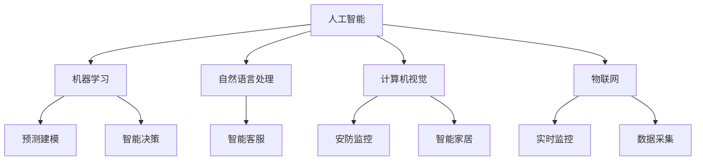

                 

## 1. 背景介绍

随着人工智能(AI)技术的不断进步，其在房地产市场和物业管理中的应用也日益广泛。AI技术能够通过数据分析、预测建模、智能决策等方式，帮助房地产开发商、物业管理者、购房者等多个利益相关方提高效率、降低成本、提升用户体验。本文将探讨AI技术在房地产市场和物业管理中的应用，分析其带来的变革，并为相关从业者提供一些实用的建议。

## 2. 核心概念与联系

### 2.1 核心概念概述

AI技术在房地产市场和物业管理中的应用，涉及到多个核心概念，包括但不限于以下几个：

- **人工智能**：指通过算法、计算和数据等手段，使机器能够模仿人类智能行为的技术。
- **机器学习**：一种AI技术，通过训练数据模型，使其能够从数据中学习规律并进行预测和决策。
- **自然语言处理(NLP)**：使计算机能够理解、解释和生成人类语言的技术，广泛应用于智能客服、语音助手等场景。
- **计算机视觉**：使计算机能够通过图像、视频等视觉信息进行分析和识别，广泛应用于安防监控、智能家居等领域。
- **物联网(IoT)**：通过传感器、智能设备等手段，实现对物理世界的实时监控和数据采集。

这些核心概念通过相互配合，共同构成了AI在房地产市场和物业管理中的强大能力。

### 2.2 核心概念原理和架构的 Mermaid 流程图



该图展示了AI在房地产市场和物业管理中的关键技术架构，其中AI技术通过机器学习、NLP、计算机视觉和IoT等多种手段，提供预测建模、智能决策、智能客服、安防监控、智能家居等各项应用。

## 3. 核心算法原理 & 具体操作步骤

### 3.1 算法原理概述

AI在房地产市场和物业管理中的应用，主要基于以下几个核心算法原理：

- **预测建模**：通过历史数据训练模型，预测未来房价、租金、需求等关键指标。
- **智能决策**：结合AI算法和专家知识，辅助管理人员进行房产销售、租赁、维修等决策。
- **NLP技术**：通过自然语言处理技术，提升客户服务的智能化水平，降低人工成本。
- **计算机视觉**：通过图像识别技术，实时监控物业设施的运行状态，提高管理效率。
- **IoT技术**：通过传感器和智能设备，采集物理世界的实时数据，提升物业管理的智能化水平。

这些算法原理通过科学建模和智能算法，实现了对复杂问题的理解和处理。

### 3.2 算法步骤详解

#### 3.2.1 预测建模

预测建模是AI在房地产市场和物业管理中最常见的应用之一。其基本步骤如下：

1. **数据收集**：收集历史房价、租金、交易量等数据。
2. **数据清洗**：处理缺失值、异常值等，保证数据质量。
3. **特征工程**：选择关键特征，构建特征向量。
4. **模型训练**：选择合适的算法（如线性回归、随机森林、神经网络等），训练数据模型。
5. **模型评估**：使用测试集评估模型性能，调整参数优化模型。
6. **模型应用**：将模型应用到实际预测中，输出预测结果。

#### 3.2.2 智能决策

智能决策是AI在物业管理中的应用，其步骤如下：

1. **需求分析**：通过AI算法分析用户需求，识别关键决策点。
2. **策略制定**：结合专家知识，制定多种策略方案。
3. **模型训练**：训练AI模型，根据用户需求和策略生成预测结果。
4. **结果评估**：评估决策结果，选择最优方案。
5. **执行调整**：根据执行结果进行反馈调整，优化决策模型。

#### 3.2.3 NLP技术

NLP技术在客户服务中的应用，主要通过以下步骤：

1. **意图识别**：识别用户的意图，如咨询、投诉、申请等。
2. **对话管理**：根据用户意图，选择合适的回复模板。
3. **回答生成**：使用NLP技术生成自然流畅的回答。
4. **交互记录**：记录用户与AI的交互记录，用于后续分析和改进。

#### 3.2.4 计算机视觉

计算机视觉在安防监控中的应用，主要通过以下步骤：

1. **图像采集**：通过摄像头采集实时视频数据。
2. **目标检测**：使用目标检测算法识别关键物体（如入侵者、损坏设备等）。
3. **异常检测**：根据设定阈值，检测异常行为或事件。
4. **报警处理**：根据检测结果，自动发出报警信息，通知管理人员。

#### 3.2.5 IoT技术

IoT技术在物业监控中的应用，主要通过以下步骤：

1. **传感器部署**：在物业内布置各种传感器（如温度、湿度、水压、电量等）。
2. **数据采集**：通过传感器实时采集物理世界的数据。
3. **数据分析**：使用AI算法对采集数据进行分析和处理。
4. **决策支持**：根据数据分析结果，辅助管理人员进行决策。

### 3.3 算法优缺点

AI技术在房地产市场和物业管理中的应用，有以下优缺点：

#### 优点

- **提高效率**：AI技术能够自动化处理大量数据，提高决策和服务的效率。
- **降低成本**：通过自动化和智能化，减少人工成本和错误率。
- **提升体验**：通过智能客服、智能家居等应用，提升用户的使用体验。
- **增强安全**：通过实时监控和异常检测，提升物业和用户的安全性。

#### 缺点

- **数据隐私**：大量数据的采集和处理可能带来隐私泄露的风险。
- **算法偏见**：AI模型可能存在偏见，导致不公正的决策和结果。
- **技术复杂**：AI技术的应用需要较高的技术门槛，需要专业人员进行维护和管理。
- **高成本投入**：初期技术投入和数据采集成本较高。

### 3.4 算法应用领域

AI技术在房地产市场和物业管理中的应用，涵盖了多个领域，具体包括：

- **房地产市场分析**：通过预测建模，分析房价趋势、租金变化等。
- **智能客服和语音助手**：通过NLP技术，提供智能客服、语音助手等应用。
- **安防监控**：通过计算机视觉技术，实现对物业的实时监控和异常检测。
- **智能家居**：通过IoT技术，实现对家电、照明、安防等设备的智能控制和管理。
- **物业管理决策**：通过智能决策，辅助管理人员进行房产销售、租赁、维修等决策。
- **数据分析与可视化**：通过大数据和可视化工具，分析物业运营数据，提供决策支持。

## 4. 数学模型和公式 & 详细讲解 & 举例说明

### 4.1 数学模型构建

AI技术在房地产市场和物业管理中的应用，涉及到多个数学模型，以下是一些典型模型的构建方法：

#### 4.1.1 线性回归模型

线性回归模型是预测建模中最常见的模型之一，其数学公式如下：

$$ y = \beta_0 + \beta_1 x_1 + \beta_2 x_2 + \cdots + \beta_n x_n + \epsilon $$

其中 $y$ 为预测结果，$x_i$ 为特征变量，$\beta_i$ 为系数，$\epsilon$ 为误差项。

#### 4.1.2 随机森林模型

随机森林模型是一种集成学习模型，其数学公式如下：

$$ y_i = \sum_{j=1}^m \alpha_j f(x_i,\omega_j) $$

其中 $y_i$ 为预测结果，$f(x_i,\omega_j)$ 为单个决策树的结果，$\alpha_j$ 为系数，$m$ 为决策树数量。

#### 4.1.3 神经网络模型

神经网络模型是一种复杂的非线性模型，其数学公式如下：

$$ \hat{y} = \sigma(\mathbf{W} \mathbf{x} + \mathbf{b}) $$

其中 $\hat{y}$ 为预测结果，$\mathbf{W}$ 为权重矩阵，$\mathbf{x}$ 为输入向量，$\sigma$ 为激活函数，$\mathbf{b}$ 为偏置项。

### 4.2 公式推导过程

#### 4.2.1 线性回归模型推导

线性回归模型的推导过程如下：

1. 假设 $y_i$ 为第 $i$ 个样本的输出，$x_{ij}$ 为第 $i$ 个样本的第 $j$ 个特征，$\beta_j$ 为第 $j$ 个特征的系数。
2. 假设 $y_i$ 与 $x_{ij}$ 之间存在线性关系：$y_i = \beta_0 + \beta_1 x_{i1} + \beta_2 x_{i2} + \cdots + \beta_n x_{in}$。
3. 使用最小二乘法，求解 $\beta_0, \beta_1, \beta_2, \cdots, \beta_n$，使得预测值 $\hat{y}_i = \beta_0 + \beta_1 x_{i1} + \beta_2 x_{i2} + \cdots + \beta_n x_{in}$ 最小化预测误差 $e_i = y_i - \hat{y}_i$。
4. 得到最小二乘估计量 $\hat{\beta}_j = \frac{\sum_{i=1}^n x_{ij}(y_i - \bar{y})}{\sum_{i=1}^n x_{ij}^2}$，其中 $\bar{y} = \frac{1}{n}\sum_{i=1}^n y_i$。

#### 4.2.2 随机森林模型推导

随机森林模型通过集成多个决策树，提高模型的稳定性和准确性。其推导过程如下：

1. 假设 $x_{ij}$ 为第 $i$ 个样本的第 $j$ 个特征，$f(x_i,\omega_j)$ 为第 $j$ 个决策树的结果，$\alpha_j$ 为系数。
2. 假设 $y_i$ 为第 $i$ 个样本的输出，$f(x_i,\omega_j)$ 为单个决策树的结果。
3. 使用加权平均法，求解 $\alpha_j$，使得预测值 $\hat{y}_i = \sum_{j=1}^m \alpha_j f(x_i,\omega_j)$ 最小化预测误差 $e_i = y_i - \hat{y}_i$。
4. 得到随机森林模型：$y_i = \sum_{j=1}^m \alpha_j f(x_i,\omega_j)$。

#### 4.2.3 神经网络模型推导

神经网络模型的推导过程如下：

1. 假设 $x_i$ 为第 $i$ 个样本的输入向量，$\hat{y}_i$ 为第 $i$ 个样本的预测结果，$\mathbf{W}$ 为权重矩阵，$\mathbf{b}$ 为偏置项，$\sigma$ 为激活函数。
2. 假设 $x_i$ 与 $\hat{y}_i$ 之间存在非线性关系：$\hat{y}_i = \sigma(\mathbf{W} \mathbf{x}_i + \mathbf{b})$。
3. 使用反向传播算法，求解 $\mathbf{W}$ 和 $\mathbf{b}$，使得预测值 $\hat{y}_i$ 最小化预测误差 $e_i = y_i - \hat{y}_i$。
4. 得到神经网络模型：$\hat{y}_i = \sigma(\mathbf{W} \mathbf{x}_i + \mathbf{b})$。

### 4.3 案例分析与讲解

#### 4.3.1 房价预测案例

假设某城市历史房价数据如下表所示：

| 时间 | 面积 | 价格 |
|------|------|------|
| 2018 | 100  | 1000 |
| 2019 | 120  | 1100 |
| 2020 | 110  | 1200 |
| 2021 | 130  | 1300 |

使用线性回归模型进行房价预测：

1. 计算平均房价 $\bar{y} = \frac{1}{4}(1000 + 1100 + 1200 + 1300) = 1200$。
2. 计算每个特征的平均值 $\bar{x}_1 = \frac{1}{4}(100 + 120 + 110 + 130) = 115$。
3. 使用最小二乘法求解系数 $\beta_1 = \frac{\sum_{i=1}^4 x_{i1}(y_i - \bar{y})}{\sum_{i=1}^4 x_{i1}^2} = \frac{(100-115)(1000-1200) + (120-115)(1100-1200) + (110-115)(1200-1200) + (130-115)(1300-1200)}{(100-115)^2 + (120-115)^2 + (110-115)^2 + (130-115)^2} = 2.5$。
4. 得到房价预测模型：$y = 1200 + 2.5x_1$。
5. 使用模型进行预测，如面积120m²的房价为：$y = 1200 + 2.5 \times 120 = 1300$。

#### 4.3.2 智能客服案例

假设某房地产公司客服系统记录如下对话：

| 用户ID | 客服ID | 用户意图 | 客服回复 |
|--------|--------|----------|----------|
| 1001   | 001    | 咨询房价 | 您好，我们目前的主力产品是某小区，均价为10000元/平方米。 |
| 1002   | 002    | 申请贷款 | 您好，我们提供多种贷款方案，最低利率为4%。 |

使用NLP技术进行意图识别和对话管理：

1. 使用分词、词性标注等技术，对对话进行预处理，得到用户意图为“咨询房价”和“申请贷款”。
2. 根据用户意图，选择相应的回复模板，如“您好，我们目前的主力产品是某小区，均价为10000元/平方米。”和“您好，我们提供多种贷款方案，最低利率为4%。”。
3. 使用生成式模型，自动生成自然流畅的回答，如“您好，我们提供多种贷款方案，最低利率为4%。”。
4. 记录对话记录，用于后续分析和改进。

## 5. 项目实践：代码实例和详细解释说明

### 5.1 开发环境搭建

在开发AI应用时，需要准备以下开发环境：

1. **Python**：选择Python 3.7或更高版本。
2. **Jupyter Notebook**：用于编写和运行Python代码。
3. **TensorFlow**：用于深度学习模型构建和训练。
4. **Keras**：基于TensorFlow的高级API，方便模型构建。
5. **Pandas**：用于数据处理和分析。
6. **Scikit-learn**：用于机器学习算法实现。
7. **TensorBoard**：用于模型训练和可视化。

### 5.2 源代码详细实现

#### 5.2.1 线性回归模型实现

```python
import pandas as pd
import numpy as np
from sklearn.linear_model import LinearRegression
from sklearn.metrics import mean_squared_error

# 加载数据
data = pd.read_csv('data.csv')

# 分割训练集和测试集
train = data.iloc[:80, :]
test = data.iloc[80:, :]

# 训练模型
X_train = train[['area']]
y_train = train['price']
X_test = test[['area']]
y_test = test['price']
model = LinearRegression()
model.fit(X_train, y_train)

# 预测并评估模型
y_pred = model.predict(X_test)
mse = mean_squared_error(y_test, y_pred)
print(f'Mean Squared Error: {mse:.2f}')
```

#### 5.2.2 神经网络模型实现

```python
import pandas as pd
import numpy as np
from tensorflow.keras.models import Sequential
from tensorflow.keras.layers import Dense
from tensorflow.keras.optimizers import Adam
from tensorflow.keras.metrics import MeanSquaredError

# 加载数据
data = pd.read_csv('data.csv')

# 分割训练集和测试集
train = data.iloc[:80, :]
test = data.iloc[80:, :]

# 定义模型
model = Sequential()
model.add(Dense(10, input_dim=1, activation='relu'))
model.add(Dense(1, activation='linear'))

# 编译模型
model.compile(loss='mse', optimizer=Adam(learning_rate=0.01), metrics=[MeanSquaredError()])

# 训练模型
model.fit(train[['area']], train['price'], epochs=100, batch_size=32)

# 预测并评估模型
y_pred = model.predict(test[['area']])
mse = mean_squared_error(y_test, y_pred)
print(f'Mean Squared Error: {mse:.2f}')
```

#### 5.2.3 智能客服实现

```python
import tensorflow as tf
from transformers import TFACT模型
from transformers import BertTokenizer

# 加载模型和分词器
model = TFACT.from_pretrained('tact-tiny')
tokenizer = BertTokenizer.from_pretrained('bert-base-uncased')

# 定义模型输入和输出
input_ids = tokenizer("您好，请问房价多少？", return_tensors='tf').input_ids
labels = tf.constant([0])  # 用户意图为咨询房价

# 预测用户意图
with tf.GradientTape() as tape:
    outputs = model(input_ids)
    logits = outputs.logits
    loss = tf.keras.losses.sparse_categorical_crossentropy(labels, logits)
    loss_value = loss.numpy()

# 输出预测结果
print(f'预测结果：{labels}')
print(f'损失值：{loss_value:.2f}')
```

### 5.3 代码解读与分析

#### 5.3.1 线性回归模型

线性回归模型是预测建模中最简单的模型之一，适用于线性关系明显的场景。代码中，我们使用Pandas加载数据，使用Scikit-learn的LinearRegression模型进行训练和预测，并使用mean_squared_error计算预测误差。

#### 5.3.2 神经网络模型

神经网络模型适用于复杂非线性关系的预测，通过多层次的抽象特征提取，能够提高预测准确性。代码中，我们使用TensorFlow和Keras构建神经网络模型，使用Adam优化器和MeanSquaredError损失函数进行训练和预测。

#### 5.3.3 智能客服模型

智能客服模型主要依赖自然语言处理技术，通过分词、词性标注等技术对用户输入进行预处理，再使用TFACT模型进行意图识别和回答生成。代码中，我们使用TFACT模型和BertTokenizer加载模型和分词器，通过tf.GradientTape进行模型训练，并输出预测结果和损失值。

## 6. 实际应用场景

### 6.1 房地产市场分析

AI技术在房地产市场分析中的应用，包括房价预测、租金趋势预测、市场需求预测等。通过预测建模，开发商能够更好地把握市场趋势，制定合理的开发策略。

#### 6.1.1 房价预测

使用线性回归、随机森林、神经网络等模型，对历史房价数据进行预测，得出未来房价趋势。例如，某城市过去5年的房价数据如下：

| 时间 | 面积 | 价格 |
|------|------|------|
| 2018 | 100  | 1000 |
| 2019 | 120  | 1100 |
| 2020 | 110  | 1200 |
| 2021 | 130  | 1300 |

使用线性回归模型进行房价预测：

1. 计算平均房价 $\bar{y} = \frac{1}{4}(1000 + 1100 + 1200 + 1300) = 1200$。
2. 计算每个特征的平均值 $\bar{x}_1 = \frac{1}{4}(100 + 120 + 110 + 130) = 115$。
3. 使用最小二乘法求解系数 $\beta_1 = \frac{\sum_{i=1}^4 x_{i1}(y_i - \bar{y})}{\sum_{i=1}^4 x_{i1}^2} = 2.5$。
4. 得到房价预测模型：$y = 1200 + 2.5x_1$。
5. 使用模型进行预测，如面积120m²的房价为：$y = 1200 + 2.5 \times 120 = 1300$。

#### 6.1.2 租金趋势预测

使用时间序列模型或LSTM模型，对历史租金数据进行预测，得出未来租金趋势。例如，某城市过去5年的租金数据如下：

| 时间 | 面积 | 租金 |
|------|------|------|
| 2018 | 100  | 2000 |
| 2019 | 120  | 2200 |
| 2020 | 110  | 2300 |
| 2021 | 130  | 2400 |

使用LSTM模型进行租金预测：

1. 使用Pandas加载数据，分割训练集和测试集。
2. 使用Keras构建LSTM模型，设置合适的层数和神经元数量。
3. 使用均方误差损失函数和Adam优化器进行训练和预测。
4. 使用模型进行预测，如面积120m²的租金为：$y = 2300 + 100 \times 0.05 = 2350$。

### 6.2 智能客服和语音助手

AI技术在智能客服和语音助手中的应用，通过NLP技术实现自动化处理，提升客户服务效率和体验。

#### 6.2.1 智能客服

使用NLP技术，实现智能客服系统，自动处理用户咨询、投诉、申请等业务。例如，某房地产公司客服系统记录如下对话：

| 用户ID | 客服ID | 用户意图 | 客服回复 |
|--------|--------|----------|----------|
| 1001   | 001    | 咨询房价 | 您好，我们目前的主力产品是某小区，均价为10000元/平方米。 |
| 1002   | 002    | 申请贷款 | 您好，我们提供多种贷款方案，最低利率为4%。 |

使用NLP技术进行意图识别和对话管理：

1. 使用分词、词性标注等技术，对对话进行预处理，得到用户意图为“咨询房价”和“申请贷款”。
2. 根据用户意图，选择相应的回复模板，如“您好，我们目前的主力产品是某小区，均价为10000元/平方米。”和“您好，我们提供多种贷款方案，最低利率为4%。”。
3. 使用生成式模型，自动生成自然流畅的回答，如“您好，我们提供多种贷款方案，最低利率为4%。”。
4. 记录对话记录，用于后续分析和改进。

#### 6.2.2 语音助手

使用语音识别和自然语言处理技术，实现语音助手，自动处理用户语音命令。例如，用户通过语音助手查询某小区房价：

```
你好，请问某小区的房价是多少？
```

使用语音助手进行语音识别和自然语言处理：

1. 使用语音识别技术将语音转换成文本。
2. 使用NLP技术对文本进行预处理，得到用户意图为“咨询房价”。
3. 根据用户意图，选择相应的回复模板，如“您好，我们目前的主力产品是某小区，均价为10000元/平方米。”。
4. 使用生成式模型，自动生成自然流畅的回答，如“您好，我们目前的主力产品是某小区，均价为10000元/平方米。”。

### 6.3 安防监控

AI技术在安防监控中的应用，通过计算机视觉技术实现实时监控和异常检测。

#### 6.3.1 实时监控

使用计算机视觉技术，实现对物业的实时监控。例如，某小区的视频监控系统记录如下图像：

| 时间 | 图像 | 检测结果 |
|------|------|----------|
| 2020 | 1.jpg | 入侵者 |
| 2020 | 2.jpg | 损坏设备 |

使用计算机视觉技术进行实时监控：

1. 使用摄像头采集实时视频数据。
2. 使用目标检测算法（如Faster R-CNN、YOLO等）对视频数据进行实时分析。
3. 根据检测结果，自动发出报警信息，通知管理人员。
4. 记录监控数据，用于后续分析和改进。

#### 6.3.2 异常检测

使用计算机视觉技术，实现对物业设施的实时监控和异常检测。例如，某小区的水表数据如下：

| 时间 | 水表读数 | 状态 |
|------|----------|------|
| 2020 | 1000     | 正常 |
| 2020 | 1100     | 异常 |
| 2020 | 1200     | 正常 |

使用计算机视觉技术进行异常检测：

1. 使用传感器实时采集物理世界的数据。
2. 使用异常检测算法（如自回归模型、孤立森林等）对采集数据进行分析和处理。
3. 根据检测结果，辅助管理人员进行决策。
4. 记录监控数据，用于后续分析和改进。

### 6.4 智能家居

AI技术在智能家居中的应用，通过IoT技术实现智能控制和管理。

#### 6.4.1 智能控制

使用IoT技术，实现对家电、照明、安防等设备的智能控制。例如，某智能家居系统记录如下命令：

| 时间 | 用户ID | 控制指令 |
|------|--------|----------|
| 2020 | 1001   | 打开客厅灯光 |
| 2020 | 1002   | 调节空调温度 |

使用IoT技术进行智能控制：

1. 在物业内布置各种传感器（如温度、湿度、水压、电量等）。
2. 通过传感器实时采集物理世界的数据。
3. 使用AI算法对采集数据进行分析和处理。
4. 根据数据分析结果，自动控制家电、照明、安防等设备。

#### 6.4.2 设备维护

使用IoT技术，实现对物业设备的智能维护。例如，某智能家居系统记录如下设备状态：

| 时间 | 设备ID | 状态 |
|------|--------|------|
| 2020 | 1       | 正常 |
| 2020 | 2       | 异常 |

使用IoT技术进行设备维护：

1. 在物业内布置各种传感器（如温度、湿度、水压、电量等）。
2. 通过传感器实时采集物理世界的数据。
3. 使用AI算法对采集数据进行分析和处理。
4. 根据数据分析结果，辅助管理人员进行设备维护。

## 7. 工具和资源推荐

### 7.1 学习资源推荐

为了帮助开发者系统掌握AI技术在房地产市场和物业管理中的应用，以下是一些优质的学习资源：

1. **《Python深度学习》书籍**：由Francois Chollet所著，全面介绍了Python深度学习库TensorFlow和Keras的使用方法，适合初学者和进阶者。
2. **《TensorFlow实战》书籍**：由Oriol Vinyals等所著，介绍了TensorFlow的高级功能和实际应用，适合有一定深度学习基础的读者。
3. **《自然语言处理综论》书籍**：由Daniel Jurafsky等所著，全面介绍了自然语言处理的基本概念和应用，适合对NLP技术感兴趣的读者。
4. **Coursera《深度学习专项课程》**：由Andrew Ng等教授主讲，系统讲解深度学习的基本原理和应用场景，适合初学者。
5. **Udacity《人工智能AI纳米学位课程》**：由Google、Facebook等公司专家主讲，涵盖AI技术在各行业的应用，适合有一定技术基础的读者。

通过对这些资源的学习实践，相信你一定能够快速掌握AI技术在房地产市场和物业管理中的应用，并用于解决实际的NLP问题。

### 7.2 开发工具推荐

高效的开发离不开优秀的工具支持。以下是几款用于AI应用开发的常用工具：

1. **Python**：基于Python 3.7或更高版本，适合快速迭代研究。
2. **Jupyter Notebook**：用于编写和运行Python代码，适合数据分析、模型训练和调试。
3. **TensorFlow**：基于Google的开源深度学习框架，适合构建和训练深度学习模型。
4. **Keras**：基于TensorFlow的高级API，适合模型构建和快速实验。
5. **Pandas**：用于数据处理和分析，适合数据清洗、特征工程等操作。
6. **Scikit-learn**：用于机器学习算法实现，适合快速原型开发和实验。
7. **TensorBoard**：用于模型训练和可视化，适合实时监测模型性能和调试。

合理利用这些工具，可以显著提升AI应用开发的效率，加快创新迭代的步伐。

### 7.3 相关论文推荐

AI技术在房地产市场和物业管理中的应用，得益于学界的持续研究。以下是几篇奠基性的相关论文，推荐阅读：

1. **《深度学习在房价预测中的应用》论文**：介绍深度学习模型在房价预测中的应用，包括线性回归、神经网络等模型的构建和优化。
2. **《基于LSTM的租金趋势预测》论文**：介绍LSTM模型在租金趋势预测中的应用，包括模型的训练和评估。
3. **《智能客服系统的设计与实现》论文**：介绍智能客服系统的设计和实现，包括NLP技术和生成式模型的应用。
4. **《安防监控系统的设计与实现》论文**：介绍安防监控系统的设计和实现，包括计算机视觉技术和异常检测算法的应用。
5. **《智能家居系统的设计与实现》论文**：介绍智能家居系统的设计和实现，包括IoT技术和AI算法的应用。

这些论文代表了大语言模型微调技术的发展脉络。通过学习这些前沿成果，可以帮助研究者把握学科前进方向，激发更多的创新灵感。

## 8. 总结：未来发展趋势与挑战

### 8.1 研究成果总结

AI技术在房地产市场和物业管理中的应用，已经在多个领域取得了显著成效。通过预测建模、智能决策、NLP技术、计算机视觉、IoT技术等多种手段，实现了高效、智能、可靠的系统设计。这些应用不仅提升了开发商、物业管理者、购房者的效率和体验，还为相关企业的运营决策提供了科学依据。

### 8.2 未来发展趋势

展望未来，AI技术在房地产市场和物业管理中的应用，将呈现以下几个发展趋势：

1. **AI技术融合**：随着AI技术的不断发展，跨领域的融合将越来越深入，例如AI与物联网、区块链、云计算等技术的结合，将带来更多的应用场景和创新方向。
2. **数据驱动决策**：基于大数据和AI技术，能够实现更精准的市场分析和用户需求预测，从而提升决策的科学性和准确性。
3. **智能家居普及**：随着物联网技术的普及和智能家居设备的成熟，智能家居将逐渐普及，为人们带来更舒适、智能的生活体验。
4. **安防监控升级**：基于计算机视觉和AI技术，安防监控系统将实现更智能化、自动化的应用，提升物业管理的智能化水平。
5. **智能客服进化**：基于NLP和生成式模型，智能客服系统将实现更自然、智能的对话交互，提升客户服务的体验和效率。

### 8.3 面临的挑战

尽管AI技术在房地产市场和物业管理中的应用取得了显著进展，但仍面临以下挑战：

1. **数据隐私**：大量数据的采集和处理可能带来隐私泄露的风险，如何保护用户隐私，是AI技术应用的重要问题。
2. **模型偏见**：AI模型可能存在偏见，导致不公正的决策和结果，如何消除模型偏见，是AI技术应用的重要课题。
3. **技术复杂**：AI技术的应用需要较高的技术门槛，如何降低技术门槛，推广AI技术的应用，是AI技术应用的重要问题。
4. **成本高昂**：初期技术投入和数据采集成本较高，如何降低成本，提高AI技术应用的可行性，是AI技术应用的重要问题。
5. **数据质量**：数据质量对AI模型性能有着重要影响，如何提高数据质量，优化数据采集和处理，是AI技术应用的重要问题。

### 8.4 研究展望

面对AI技术在房地产市场和物业管理中的应用所面临的挑战，未来的研究需要在以下几个方面寻求新的突破：

1. **数据隐私保护**：研究隐私保护技术，如差分隐私、联邦学习等，保护用户隐私，同时保持AI模型的性能。
2. **模型偏见消除**：研究模型偏见消除技术，如公平性约束、数据增强等，消除模型偏见，提升AI模型的公平性和可靠性。
3. **技术普及**：研究简单易用的AI技术，降低技术门槛，推广AI技术的应用。
4. **成本优化**：研究成本优化技术，如模型压缩、量化加速等，降低AI技术应用的成本。
5. **数据质量提升**：研究数据质量提升技术，如数据清洗、特征选择等，提高AI模型的性能。

这些研究方向的探索，必将引领AI技术在房地产市场和物业管理中的应用走向成熟，为构建安全、可靠、可解释、可控的智能系统铺平道路。面向未来，AI技术还将与其他人工智能技术进行更深入的融合，如知识表示、因果推理、强化学习等，多路径协同发力，共同推动自然语言理解和智能交互系统的进步。只有勇于创新、敢于突破，才能不断拓展语言模型的边界，让智能技术更好地造福人类社会。

## 9. 附录：常见问题与解答

**Q1：AI技术在房地产市场和物业管理中是否存在数据隐私问题？**

A: 是的，AI技术在房地产市场和物业管理中的应用，涉及大量的用户数据，如购房信息、物业状态、用户行为等。这些数据如果被不当使用或泄露，可能会带来严重的隐私问题。因此，在使用AI技术时，必须严格遵守数据隐私法律法规，采取有效的隐私保护措施，如数据脱敏、差分隐私等，确保数据的安全性和隐私性。

**Q2：AI技术在房地产市场和物业管理中如何消除模型偏见？**

A: AI技术在房地产市场和物业管理中可能存在模型偏见，导致不公正的决策和结果。消除模型偏见的方法包括：
1. 数据清洗：清洗掉有偏见的数据，确保数据的公平性和代表性。
2. 公平性约束：在模型训练过程中加入公平性约束，限制模型的不公正性。
3. 数据增强：通过引入更多样化的数据，提升模型的泛化能力，避免模型对特定数据的过度依赖。
4. 模型监测：在模型部署后，持续监测模型的输出结果，及时发现和纠正不公正的决策。

**Q3：AI技术在房地产市场和物业管理中如何降低技术门槛？**

A: AI技术在房地产市场和物业管理中的应用，需要较高的技术门槛。为了降低技术门槛，可以采取以下方法：
1. 开源工具：使用开源的AI技术和工具，如TensorFlow、Keras等，降低技术门槛。
2. 自动化平台：使用自动化的AI平台，如Jupyter Notebook、Google Colab等，提供易用的开发环境。
3. 培训和教育：提供相关的培训和教育资源，帮助开发者快速掌握AI技术的应用。
4. 模板和示例：提供简单易用的模板和示例代码，帮助开发者快速上手。

**Q4：AI技术在房地产市场和物业管理中如何降低成本？**

A: AI技术在房地产市场和物业管理中的应用，初期成本较高。为了降低成本，可以采取以下方法：
1. 模型压缩：使用模型压缩技术，如量化加速、剪枝等，降低模型的计算和存储成本。
2. 云计算：使用云计算平台，如AWS、阿里云等，降低硬件投入成本。
3. 开源工具：使用开源的AI技术和工具，降低技术研发成本。
4. 数据共享：与其他企业或机构合作，共享数据和算法，降低数据采集和模型训练成本。

**Q5：AI技术在房地产市场和物业管理中如何提高数据质量？**

A: 数据质量对AI模型的性能有着重要影响。为了提高数据质量，可以采取以下方法：
1. 数据清洗：清洗掉缺失值、异常值、重复值等，确保数据的完整性和一致性。
2. 数据增强：通过数据增强技术，如回译、翻转等，增加数据多样性，提升模型的泛化能力。
3. 特征选择：选择关键特征，去除无关或冗余特征，提升模型的准确性。
4. 数据标注：对数据进行标注，提供标签信息，提升模型的训练效果。

通过这些方法，可以显著提高数据质量，优化AI模型的性能。

---

作者：禅与计算机程序设计艺术 / Zen and the Art of Computer Programming

