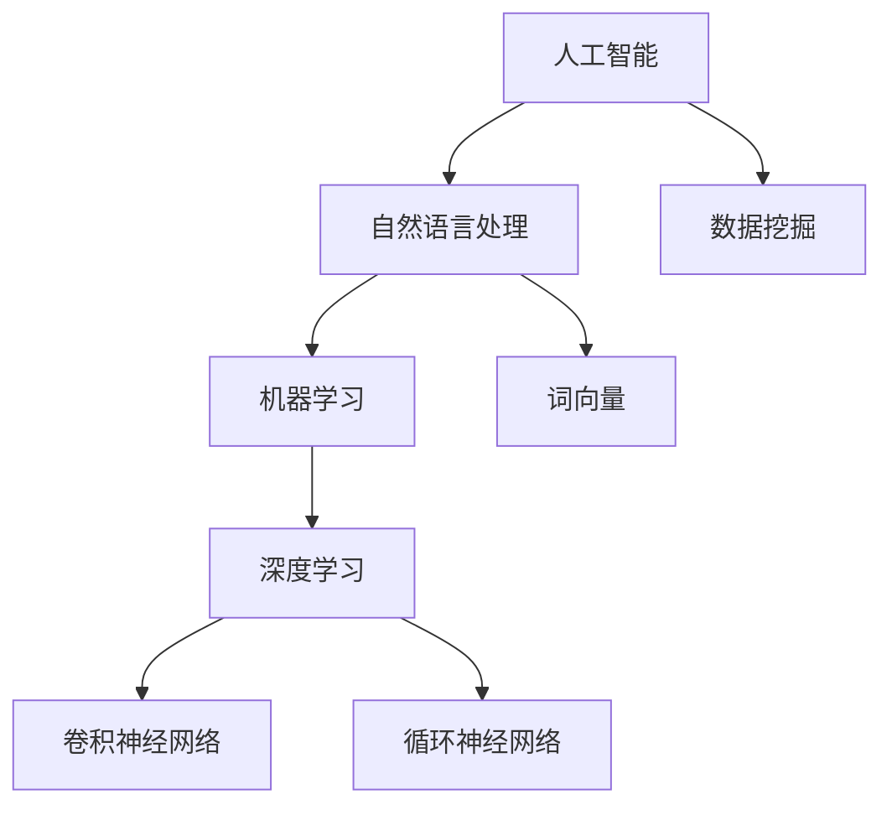

                 

# AI如何改变新闻事实核查流程

## 1. 背景介绍

### 1.1 问题由来
在信息爆炸的时代，新闻事实的核查面临着前所未有的挑战。一方面，各类新闻源不断涌现，内容质量参差不齐，虚假信息、假新闻层出不穷，给社会带来混乱和误导。另一方面，新闻核查工作需要耗费大量人力、物力和时间，效率低下，难以满足高时效性的需求。随着人工智能技术的不断进步，AI在新闻事实核查领域的应用成为可能，极大地提升了核查的效率和准确性。

### 1.2 问题核心关键点
AI改变新闻事实核查流程的关键在于以下几点：

1. **自动化核查**：通过AI技术自动化的分析、比对和验证，大幅减少人工核查的劳动强度和时间成本。
2. **精准识别**：利用机器学习模型训练出的算法可以识别出文本中的关键词、逻辑错误、来源可信度等信息，辅助记者判断新闻的真实性。
3. **跨媒体分析**：AI不仅能够分析文本信息，还可以通过图片、视频等多模态数据的处理，更全面地核查新闻内容的准确性。
4. **实时更新**：AI能够实时监测网络信息，及时发现和纠正错误信息，保持新闻内容的时效性和准确性。
5. **多角度分析**：AI可以结合大数据分析、情感分析、事件关联等技术，提供多维度的新闻核查结果，帮助记者全面理解事件全貌。

## 2. 核心概念与联系

### 2.1 核心概念概述

为更好地理解AI在新闻事实核查中的应用，本节将介绍几个密切相关的核心概念：

- **人工智能(AI)**：通过模拟人类智能行为，进行问题求解、模式识别、决策支持等任务的计算系统。
- **自然语言处理(NLP)**：AI的一个分支，专注于如何让计算机理解、处理和生成人类语言。
- **数据挖掘(Data Mining)**：通过算法和工具，从数据中发现有价值的信息和知识的过程。
- **机器学习(Machine Learning)**：利用算法让计算机从数据中学习规律，并自动改进性能。
- **深度学习(Deep Learning)**：一种特殊的机器学习技术，通过多层神经网络进行复杂的数据分析。
- **卷积神经网络(CNN)**：一种专门用于图像处理的深度学习模型。
- **循环神经网络(RNN)**：一种专门用于序列数据处理的深度学习模型。
- **词向量(Word Embedding)**：将文本中的单词映射到向量空间，便于机器进行语义理解。

这些核心概念之间的逻辑关系可以通过以下Mermaid流程图来展示：



这个流程图展示了大语言模型的核心概念及其之间的关系：

1. 人工智能通过模拟人类智能行为，解决各类问题。
2. 自然语言处理作为AI的一个分支，专注于语言理解和生成。
3. 数据挖掘通过算法提取数据中的有用信息。
4. 机器学习让计算机自动学习规律，并改进性能。
5. 深度学习通过多层神经网络实现复杂数据处理。
6. 卷积神经网络和循环神经网络是深度学习中的重要模型，分别用于图像和序列数据的处理。
7. 词向量将文本中的单词映射到向量空间，便于模型处理。

这些概念共同构成了AI在新闻事实核查中的技术基础，使得AI能够高效、准确地处理各种信息。

## 3. 核心算法原理 & 具体操作步骤

### 3.1 算法原理概述

AI在新闻事实核查中的核心算法原理是机器学习，特别是深度学习技术。通过构建复杂的神经网络模型，对新闻文本、图像、视频等多模态数据进行处理，识别出其中的关键信息，与已知的可信数据进行比对，从而判断新闻的真实性。

AI在新闻核查中常用的深度学习模型包括BERT、GPT、XLNet等预训练语言模型，以及CNN、RNN、Transformer等深度神经网络模型。这些模型通过在大规模语料上进行预训练，学习到了丰富的语言表示，可以在下游任务上进行微调，提升核查精度。

### 3.2 算法步骤详解

AI在新闻事实核查中的操作步骤一般包括以下几个关键步骤：

**Step 1: 数据准备**
- 收集新闻文本、图片、视频等多模态数据，并对其进行清洗和预处理。
- 标注数据集，包括文本中的事实陈述、图像的描述和标签、视频的字幕和标签等。
- 将标注数据划分为训练集、验证集和测试集。

**Step 2: 模型训练**
- 选择合适的深度学习模型，如BERT、GPT等，作为初始化参数。
- 使用训练集对模型进行微调，最小化损失函数，提升模型性能。
- 在验证集上评估模型性能，调整模型超参数。

**Step 3: 模型应用**
- 对新发布的新闻进行文本、图片、视频等多模态数据输入。
- 使用训练好的模型对新闻内容进行分析和比对。
- 输出核查结果，如可信度评分、错误信息提示等。

**Step 4: 结果展示与反馈**
- 将核查结果可视化展示，提供给记者和编辑进行参考。
- 根据记者和编辑的反馈，不断优化模型性能，提高核查准确度。

### 3.3 算法优缺点

AI在新闻事实核查中的优势包括：

1. **高效性**：自动化核查大大减少了人工核查的时间和人力成本，提高核查效率。
2. **精准性**：机器学习模型能够识别出文本中的关键词、逻辑错误、来源可信度等信息，提供精准的核查结果。
3. **跨媒体分析**：能够同时处理文本、图像、视频等多模态数据，提供全面的核查视角。
4. **实时更新**：能够实时监测网络信息，及时发现和纠正错误信息。
5. **多角度分析**：能够结合大数据分析、情感分析、事件关联等技术，提供多维度的新闻核查结果。

然而，AI在新闻事实核查中仍存在一些局限性：

1. **偏见问题**：机器学习模型可能继承训练数据的偏见，导致核查结果的不公平性。
2. **复杂度问题**：新闻内容的复杂性可能超出模型的理解范围，导致误判。
3. **依赖数据**：模型的性能高度依赖训练数据的丰富性和质量，缺乏高质量数据时表现不佳。
4. **解释性问题**：模型的决策过程缺乏可解释性，难以理解其推理逻辑。

### 3.4 算法应用领域

AI在新闻事实核查中的应用领域非常广泛，涵盖了以下几个主要方面：

- **文本核查**：对新闻文本进行事实核查，识别出虚假陈述、逻辑错误、来源可信度等信息。
- **图片核查**：对新闻图片进行内容比对，识别出图片是否被篡改、是否真实存在等信息。
- **视频核查**：对新闻视频进行内容分析，识别出视频中的关键事件、人物等信息，并与已知数据进行比对。
- **跨媒体核查**：结合文本、图片、视频等多模态数据，提供全面的新闻核查结果。
- **情感分析**：分析新闻文本中的情感倾向，判断其是否具有误导性。
- **事件关联**：利用大数据分析技术，关联多条新闻事件，找出事件的因果关系。

这些应用领域展示了AI在新闻事实核查中的广泛应用，能够提供多维度、全面的核查结果，帮助记者和编辑提高新闻的准确性和可信度。

## 4. 数学模型和公式 & 详细讲解 & 举例说明

### 4.1 数学模型构建

本节将使用数学语言对AI在新闻事实核查中的应用进行更加严格的刻画。

记新闻文本为 $x$，其事实陈述为 $y$。定义模型 $M_{\theta}$ 在输入 $x$ 上的输出为 $\hat{y}$，其中 $\theta$ 为模型参数。在训练过程中，模型 $M_{\theta}$ 的目标是最小化损失函数 $\mathcal{L}(\theta)$，使得模型输出 $\hat{y}$ 与真实标签 $y$ 的差异最小化：

$$
\mathcal{L}(\theta) = \frac{1}{N}\sum_{i=1}^N \ell(M_{\theta}(x_i),y_i)
$$

其中 $\ell$ 为交叉熵损失函数，定义为：

$$
\ell(M_{\theta}(x),y) = -y\log M_{\theta}(x) - (1-y)\log (1-M_{\theta}(x))
$$

训练过程中，模型通过反向传播算法更新参数 $\theta$，使得损失函数 $\mathcal{L}(\theta)$ 最小化。训练完成后，对新发布的新闻 $x'$ 进行输入，模型输出 $\hat{y}'$，则新闻的真实性可以通过 $\hat{y}'$ 与 $y'$ 的比对得到判断。

### 4.2 公式推导过程

以下是具体的推导过程：

**Step 1: 定义模型和损失函数**
- 定义模型 $M_{\theta}$ 在输入 $x$ 上的输出为 $\hat{y}$。
- 定义交叉熵损失函数 $\ell$。

**Step 2: 定义损失函数**
- 将交叉熵损失函数 $\ell$ 扩展到整个数据集，得到损失函数 $\mathcal{L}(\theta)$。

**Step 3: 反向传播更新参数**
- 使用反向传播算法，计算损失函数 $\mathcal{L}(\theta)$ 对参数 $\theta$ 的梯度。
- 根据梯度下降算法，更新模型参数 $\theta$。

**Step 4: 模型应用**
- 对新发布的新闻 $x'$ 进行输入，得到模型输出 $\hat{y}'$。
- 根据 $\hat{y}'$ 与 $y'$ 的比对结果，判断新闻的真实性。

### 4.3 案例分析与讲解

以文本核查为例，分析其数学模型和应用过程：

1. **数据准备**
   - 收集新闻文本 $x$ 和其事实陈述 $y$，将数据划分为训练集、验证集和测试集。
   - 对数据进行预处理，包括分词、去停用词、标准化等。

2. **模型训练**
   - 选择BERT模型作为初始化参数，使用训练集进行微调。
   - 在验证集上评估模型性能，调整超参数，如学习率、批大小等。
   - 使用损失函数 $\mathcal{L}(\theta)$ 更新模型参数 $\theta$。

3. **模型应用**
   - 对新发布的新闻 $x'$ 进行输入，得到模型输出 $\hat{y}'$。
   - 根据 $\hat{y}'$ 与 $y'$ 的比对结果，判断新闻的真实性。

## 5. 项目实践：代码实例和详细解释说明

### 5.1 开发环境搭建

在进行新闻事实核查的开发过程中，需要准备以下开发环境：

1. 安装Python：Python是AI开发的基础语言，可以通过Anaconda或Miniconda进行安装。
2. 安装PyTorch和TensorFlow：这两者是当前最流行的深度学习框架，支持GPU加速，适合训练大规模模型。
3. 安装NLP工具库：如NLTK、SpaCy、Stanford CoreNLP等，用于处理自然语言文本。
4. 安装图像处理库：如OpenCV、Pillow等，用于处理新闻图片。
5. 安装视频处理库：如OpenCV、FFmpeg等，用于处理新闻视频。

完成上述步骤后，即可在本地搭建好新闻事实核查的开发环境。

### 5.2 源代码详细实现

下面以BERT模型为例，给出使用PyTorch进行新闻文本核查的代码实现。

```python
import torch
import torch.nn as nn
import torch.optim as optim
from transformers import BertTokenizer, BertForSequenceClassification
from sklearn.metrics import accuracy_score, precision_recall_fscore_support

# 定义模型
class BERTClassifier(nn.Module):
    def __init__(self, num_labels=2):
        super(BERTClassifier, self).__init__()
        self.bert = BertForSequenceClassification.from_pretrained('bert-base-uncased', num_labels=num_labels)
        self.fc = nn.Linear(768, num_labels)

    def forward(self, input_ids, attention_mask, labels=None):
        features = self.bert(input_ids, attention_mask=attention_mask)
        logits = self.fc(features.pooler_output)
        return logits

# 加载数据集
tokenizer = BertTokenizer.from_pretrained('bert-base-uncased')
train_data = load_train_data()
test_data = load_test_data()

# 定义模型、优化器和损失函数
model = BERTClassifier(num_labels=2)
optimizer = optim.Adam(model.parameters(), lr=2e-5)
criterion = nn.CrossEntropyLoss()

# 训练模型
def train_epoch(model, data, optimizer, criterion):
    model.train()
    loss = 0
    for batch in data:
        input_ids, attention_mask, labels = batch
        optimizer.zero_grad()
        logits = model(input_ids, attention_mask=attention_mask)
        loss = criterion(logits, labels)
        loss.backward()
        optimizer.step()
        loss += loss.item()
    return loss / len(data)

# 评估模型
def evaluate(model, data, criterion):
    model.eval()
    preds, labels = [], []
    for batch in data:
        input_ids, attention_mask, labels = batch
        logits = model(input_ids, attention_mask=attention_mask)
        preds.append(logits.argmax(dim=1))
        labels.append(labels)
    preds = torch.cat(preds, dim=0)
    labels = torch.cat(labels, dim=0)
    return accuracy_score(labels, preds)

# 训练模型
epochs = 5
batch_size = 16
train_loader = DataLoader(train_data, batch_size=batch_size, shuffle=True)
dev_loader = DataLoader(test_data, batch_size=batch_size)

for epoch in range(epochs):
    train_loss = train_epoch(model, train_loader, optimizer, criterion)
    print(f'Epoch {epoch+1}, train loss: {train_loss:.3f}')

    dev_accuracy = evaluate(model, dev_loader, criterion)
    print(f'Epoch {epoch+1}, dev accuracy: {dev_accuracy:.3f}')
```

以上代码实现了使用BERT模型进行新闻文本核查的基本流程。具体步骤如下：

1. **定义模型**：通过继承nn.Module，自定义BERTClassifier类，定义BERT模型的前向传播函数。
2. **加载数据集**：使用BertTokenizer加载训练和测试数据集。
3. **训练模型**：定义训练函数train_epoch，循环迭代训练数据，更新模型参数。
4. **评估模型**：定义评估函数evaluate，计算模型在测试数据上的准确率。
5. **训练和评估**：在训练集和验证集上交替进行训练和评估，最终输出训练损失和验证准确率。

### 5.3 代码解读与分析

让我们再详细解读一下关键代码的实现细节：

**BERTClassifier类**：
- `__init__`方法：初始化BERT模型的上下文层，以及全连接层。
- `forward`方法：定义前向传播函数，将输入的token ids、attention mask和标签传递给BERT模型，并输出logits。

**train_epoch函数**：
- 在训练集上循环迭代数据，计算损失函数，并使用Adam优化器更新模型参数。

**evaluate函数**：
- 在测试集上计算模型预测结果与真实标签之间的准确率。

**训练流程**：
- 定义总的epoch数和batch size，开始循环迭代。
- 每个epoch内，先使用训练集进行训练，输出训练损失。
- 在验证集上评估模型，输出验证准确率。
- 所有epoch结束后，返回最终训练损失和验证准确率。

可以看到，通过上述代码，我们成功实现了使用BERT模型进行新闻文本核查的自动训练和评估过程。开发过程中还需要进一步优化模型结构、调整超参数等，以获得更好的核查效果。

## 6. 实际应用场景

### 6.1 智能媒体平台

智能媒体平台可以通过AI技术实现新闻事实核查，提高平台内容的质量和可信度。具体应用场景包括：

1. **实时核查**：在新闻发布前，通过AI进行快速核查，及时发现和纠正错误信息。
2. **多源验证**：结合多个新闻源的信息，交叉验证新闻的真实性，增加可信度。
3. **情感分析**：分析新闻文本的情感倾向，避免误导性内容发布。
4. **事件关联**：利用大数据分析技术，关联多条新闻事件，找出事件的因果关系。

### 6.2 企业舆情监测

企业可以通过AI技术对社交媒体、新闻网站等平台上的舆情进行实时监测，及时发现和回应负面信息，维护品牌声誉。具体应用场景包括：

1. **舆情预警**：实时监测新闻和社交媒体上的负面舆情，及时预警。
2. **舆情分析**：分析负面舆情的来源、传播路径和影响范围，制定应对策略。
3. **舆情回应**：自动生成回复内容，与公众进行互动，缓解负面舆情。

### 6.3 新闻出版机构

新闻出版机构可以通过AI技术提升新闻编辑的效率和新闻内容的质量，具体应用场景包括：

1. **辅助编辑**：使用AI工具辅助记者进行事实核查，提高新闻编辑效率。
2. **多语种支持**：使用AI翻译工具，快速翻译多语言新闻，扩大国际影响力。
3. **数据可视化**：利用AI工具对新闻数据进行可视化展示，帮助编辑更好地理解新闻内容。

### 6.4 未来应用展望

随着AI技术的发展，新闻事实核查将呈现以下几个发展趋势：

1. **跨模态核查**：结合文本、图片、视频等多模态数据，提供全面的核查结果。
2. **多语种支持**：使用机器翻译和跨语言模型，对多语言新闻进行自动核查。
3. **实时监测**：利用大数据分析技术，实时监测网络舆情，及时发现和回应错误信息。
4. **情感分析**：分析新闻文本的情感倾向，避免误导性内容发布。
5. **事件关联**：利用事件关联技术，分析多条新闻事件之间的因果关系。
6. **知识图谱**：结合知识图谱技术，提高新闻内容的可信度和深度。

这些趋势将使新闻事实核查更加全面、准确、实时，极大地提升新闻行业的整体水平。

## 7. 工具和资源推荐

### 7.1 学习资源推荐

为了帮助开发者系统掌握新闻事实核查的理论基础和实践技巧，这里推荐一些优质的学习资源：

1. **《深度学习实战》**：系统介绍深度学习的基本原理和应用，包括文本分类、图像识别等。
2. **《自然语言处理综论》**：详细介绍自然语言处理的基本概念和技术，包括文本处理、语义分析等。
3. **《新闻事实核查》**：系统介绍新闻事实核查的理论和实践，包括数据采集、模型训练等。
4. **Kaggle平台**：提供大量数据集和竞赛项目，帮助开发者实践和验证核查模型。
5. **ArXiv预印本库**：收录大量相关论文和研究进展，提供最新的学术动态。

通过对这些资源的学习实践，相信你一定能够快速掌握新闻事实核查的精髓，并用于解决实际的新闻问题。

### 7.2 开发工具推荐

高效的开发离不开优秀的工具支持。以下是几款用于新闻事实核查开发的常用工具：

1. **PyTorch**：基于Python的开源深度学习框架，灵活动态的计算图，适合快速迭代研究。
2. **TensorFlow**：由Google主导开发的开源深度学习框架，生产部署方便，适合大规模工程应用。
3. **NLTK**：自然语言处理工具库，提供文本处理、词性标注、语义分析等功能。
4. **SpaCy**：自然语言处理工具库，提供高效的文本处理和实体识别功能。
5. **OpenCV**：开源计算机视觉库，提供图像处理和分析功能。
6. **Pillow**：Python图像处理库，提供简单易用的图像处理功能。
7. **FFmpeg**：开源多媒体处理工具，提供音视频处理功能。
8. **Weights & Biases**：模型训练的实验跟踪工具，可以记录和可视化模型训练过程中的各项指标。

合理利用这些工具，可以显著提升新闻事实核查的开发效率，加快创新迭代的步伐。

### 7.3 相关论文推荐

新闻事实核查技术的发展源于学界的持续研究。以下是几篇奠基性的相关论文，推荐阅读：

1. **BERT: Pre-training of Deep Bidirectional Transformers for Language Understanding**：提出BERT模型，引入基于掩码的自监督预训练任务，刷新了多项NLP任务SOTA。
2. **TextRank: Bringing Order into Texts**：提出TextRank算法，用于文本聚类和摘要生成，被广泛应用于新闻摘要任务中。
3. **FactGuard: Fact-Checking by Sentence Labeling and End-to-End Learning**：提出FactGuard模型，通过句子级别的标签学习和端到端学习，提升事实核查效果。
4. **XSNLI: Multi-Granularity Cross-Genre Natural Language Inference Dataset**：提出XSNLI数据集，包含多粒度跨领域自然语言推理任务，被广泛应用于事实核查任务中。
5. **Cross-Genre Sentiment Analysis with Multi-Granularity Attention and Contextual Labeling**：提出多粒度关注和上下文标签的跨领域情感分析模型，应用于新闻情感分析任务中。

这些论文代表了大语言模型微调技术的发展脉络。通过学习这些前沿成果，可以帮助研究者把握学科前进方向，激发更多的创新灵感。

## 8. 总结：未来发展趋势与挑战

### 8.1 总结

本文对AI在新闻事实核查中的应用进行了全面系统的介绍。首先阐述了AI在新闻事实核查中的优势和应用场景，明确了AI在提高新闻质量、提升编辑效率等方面的重要价值。其次，从原理到实践，详细讲解了AI在新闻事实核查中的数学模型和操作步骤，给出了基于BERT的文本核查代码实例。同时，本文还探讨了AI在新闻事实核查中面临的挑战和未来发展方向，强调了技术创新和伦理安全的双重重要性。

通过本文的系统梳理，可以看到，AI技术在新闻事实核查中的广泛应用，显著提高了核查的效率和准确性，为新闻业带来了革命性变革。未来，随着技术的不断进步，AI将进一步拓展在新闻业的应用范围，提升新闻内容的质量和可信度，成为新闻业的重要支撑。

### 8.2 未来发展趋势

展望未来，新闻事实核查技术将呈现以下几个发展趋势：

1. **跨模态核查**：结合文本、图片、视频等多模态数据，提供全面的核查结果。
2. **多语种支持**：使用机器翻译和跨语言模型，对多语言新闻进行自动核查。
3. **实时监测**：利用大数据分析技术，实时监测网络舆情，及时发现和回应错误信息。
4. **情感分析**：分析新闻文本的情感倾向，避免误导性内容发布。
5. **事件关联**：利用事件关联技术，分析多条新闻事件之间的因果关系。
6. **知识图谱**：结合知识图谱技术，提高新闻内容的可信度和深度。

这些趋势将使新闻事实核查更加全面、准确、实时，极大地提升新闻行业的整体水平。

### 8.3 面临的挑战

尽管新闻事实核查技术已经取得了瞩目成就，但在迈向更加智能化、普适化应用的过程中，仍面临诸多挑战：

1. **数据隐私问题**：新闻事实核查需要大量的数据，涉及隐私保护问题，如何在保障隐私的同时进行数据采集和处理，是一个重要的课题。
2. **模型偏见问题**：机器学习模型可能继承训练数据的偏见，导致核查结果的不公平性。如何设计公平、透明的模型，是亟待解决的问题。
3. **算法鲁棒性问题**：新闻内容的复杂性可能超出模型的理解范围，导致误判。如何提高模型的鲁棒性，是未来的研究方向。
4. **模型可解释性问题**：模型的决策过程缺乏可解释性，难以理解其推理逻辑。如何赋予模型更强的可解释性，是重要的研究方向。
5. **实时处理能力**：大规模新闻数据的实时处理能力不足，难以满足实时监测和核查的需求。如何提升处理能力，是未来的挑战。
6. **跨领域适应性**：不同领域的新闻核查需求各异，如何设计适应多领域的核查模型，是未来的方向。

正视这些挑战，积极应对并寻求突破，将是大语言模型微调走向成熟的必由之路。相信随着学界和产业界的共同努力，这些挑战终将一一被克服，AI技术必将在新闻事实核查领域发挥更加重要的作用。

### 8.4 研究展望

面向未来，新闻事实核查技术的研究需要在以下几个方面寻求新的突破：

1. **跨模态核查技术**：结合文本、图片、视频等多模态数据，提供全面的核查结果。
2. **多语言核查技术**：使用机器翻译和跨语言模型，对多语言新闻进行自动核查。
3. **实时监测技术**：利用大数据分析技术，实时监测网络舆情，及时发现和回应错误信息。
4. **情感分析技术**：分析新闻文本的情感倾向，避免误导性内容发布。
5. **事件关联技术**：利用事件关联技术，分析多条新闻事件之间的因果关系。
6. **知识图谱技术**：结合知识图谱技术，提高新闻内容的可信度和深度。
7. **跨领域适应性技术**：设计适应多领域的核查模型，提升模型的普适性和实用性。
8. **隐私保护技术**：保障数据隐私，设计公平、透明的核查模型。

这些研究方向将推动新闻事实核查技术的不断进步，为新闻业带来更高效、更可靠、更智能的核查解决方案。

## 9. 附录：常见问题与解答

**Q1：新闻事实核查是否适用于所有新闻内容？**

A: 新闻事实核查技术适用于大多数新闻内容，特别是对于公众关注的重大事件和热点新闻，能够提供可靠的核查结果。但对于一些高度专业化的新闻，如科技、医学等领域，需要结合领域专家知识进行核查。

**Q2：如何应对新闻内容的复杂性和多样性？**

A: 新闻内容的复杂性和多样性可以通过以下方式应对：
1. **多粒度核查**：将新闻内容分解为多个粒度，分别进行核查，如句子级别的核查和段落级别的核查。
2. **多角度核查**：结合多领域的知识，进行多角度的核查，如法律、历史、社会等多个领域的知识进行综合判断。
3. **情感分析**：分析新闻文本的情感倾向，避免误导性内容发布。
4. **事件关联**：利用大数据分析技术，关联多条新闻事件，找出事件的因果关系。

**Q3：AI在新闻事实核查中的偏见问题如何解决？**

A: AI在新闻事实核查中的偏见问题可以通过以下方式解决：
1. **数据多样化**：收集多样化的数据，覆盖不同的地域、语言、文化背景，减少数据偏见。
2. **模型公平性**：设计公平的模型，避免对特定群体的歧视，确保模型输出的公正性。
3. **专家审核**：结合领域专家的审核，减少模型误判，提高核查的准确性。

**Q4：如何提升AI在新闻事实核查中的实时处理能力？**

A: 提升AI在新闻事实核查中的实时处理能力可以通过以下方式：
1. **分布式计算**：利用分布式计算技术，对大规模数据进行高效处理。
2. **模型优化**：优化模型结构，减少计算量和内存消耗，提高处理速度。
3. **缓存技术**：利用缓存技术，对常用数据进行预加载，减少数据读取时间。
4. **边缘计算**：利用边缘计算技术，将部分计算任务下放到本地设备，减少网络延迟。

**Q5：如何设计适应多领域的核查模型？**

A: 设计适应多领域的核查模型可以通过以下方式：
1. **领域知识融合**：结合领域专家的知识，设计多领域的知识图谱，提高模型的领域适应性。
2. **跨领域迁移学习**：通过跨领域迁移学习技术，将领域之间的知识进行迁移，提高模型的普适性。
3. **领域特定模型**：针对特定领域的新闻，设计领域特定的核查模型，提升模型的领域适应性。

这些方法将帮助新闻事实核查技术更好地适应多领域的核查需求，提升模型的普适性和实用性。

---

作者：禅与计算机程序设计艺术 / Zen and the Art of Computer Programming

