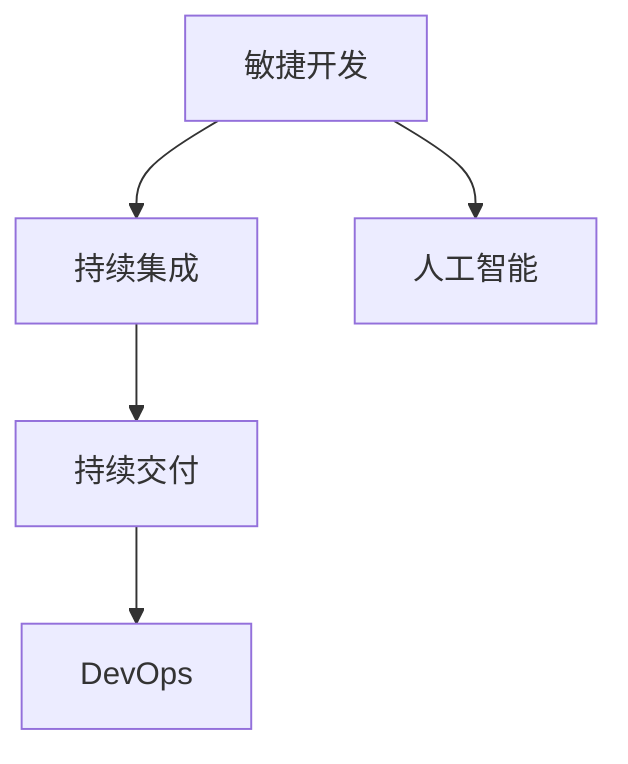

                 

# AI开发的敏捷方法论：Lepton AI的项目管理

## 1. 背景介绍

### 1.1 问题由来

在当今信息爆炸、需求快速变化的时代，如何高效、灵活地开发和交付AI项目，成为企业AI开发团队面临的重要挑战。传统软件开发中的敏捷方法论，虽然已广泛应用于IT行业，但在AI项目开发中的应用仍存在许多局限。

### 1.2 问题核心关键点

敏捷方法论的核心在于快速迭代、持续交付、高度灵活性，以适应快速变化的市场需求。AI项目开发中，数据和模型的复杂性、可解释性、安全性的问题，使得敏捷方法论的应用存在许多障碍。因此，如何针对AI项目的特点，优化敏捷开发流程，是当前AI开发领域的重要研究课题。

### 1.3 问题研究意义

通过敏捷方法论的优化，AI项目可以更加快速响应市场需求，快速迭代优化，缩短开发周期，提升交付速度和质量。敏捷方法论的引入，也将使AI开发团队能够更好地与业务团队协作，提升整体工作效率。

## 2. 核心概念与联系

### 2.1 核心概念概述

为更好地理解敏捷方法论在AI项目开发中的应用，本节将介绍几个密切相关的核心概念：

- 敏捷开发(Agile Development)：一种快速、灵活的软件开发方法论，以迭代、增量、用户反馈为基本原则，适应快速变化的市场需求。
- 持续集成(Continuous Integration, CI)：在软件开发过程中，频繁地将代码集成到中央仓库，通过自动化的测试和部署流程，确保软件的稳定性和质量。
- 持续交付(Continuous Delivery, CD)：在软件开发过程中，自动部署代码到生产环境，快速迭代交付软件产品。
- DevOps：一种融合了软件开发和运维的实践，强调自动化、协作、监控和持续反馈，提升整体交付效率和系统稳定性。
- 人工智能(Artificial Intelligence, AI)：一种通过算法、模型、数据处理等技术，模拟、延伸人类智能活动的科学。

这些核心概念之间的逻辑关系可以通过以下Mermaid流程图来展示：



这个流程图展示了许多敏捷方法论中的关键实践和AI项目开发中的核心技术。

## 3. 核心算法原理 & 具体操作步骤

### 3.1 算法原理概述

基于敏捷方法论的AI项目开发，本质上是一种通过快速迭代、持续交付，优化模型开发和应用的流程。其核心思想是：将大模型的训练和优化过程，分成多个小周期，每个周期集中解决一个具体问题，通过反复迭代，逐步逼近最优解。

形式化地，假设AI项目分为 $n$ 个迭代周期，每个周期内需解决的问题为 $m_i$，$1 \leq i \leq n$。在每个周期内，开发团队需对模型进行训练和优化，以解决当前迭代周期内的任务。

具体步骤如下：

1. **需求收集**：从业务团队收集需求，定义每个迭代周期的具体任务。
2. **计划编制**：根据需求，制定每个迭代周期的开发计划和里程碑。
3. **任务分解**：将每个迭代周期的任务进一步分解为具体的开发任务和数据准备任务。
4. **迭代开发**：对模型进行迭代训练和优化，并评估模型性能。
5. **持续交付**：将模型部署到生产环境，并进行监控和反馈。
6. **迭代调整**：根据业务反馈和监控结果，调整后续迭代周期内的任务和计划。

### 3.2 算法步骤详解

基于敏捷方法论的AI项目开发主要包括以下几个关键步骤：

**Step 1: 需求收集与定义**

- 与业务团队紧密沟通，理解业务需求和目标。
- 根据业务需求，定义每个迭代周期的具体任务和目标。

**Step 2: 计划编制与任务分解**

- 根据任务需求，制定详细的开发计划，包括任务分解、里程碑、资源分配等。
- 对每个任务进行细化，定义具体的开发步骤和时间节点。

**Step 3: 迭代开发与模型优化**

- 在每个迭代周期内，使用敏捷开发工具如JIRA、Confluence等，进行任务跟踪和进度管理。
- 对模型进行训练和优化，并在每个迭代周期结束时评估模型性能。

**Step 4: 持续交付与监控**

- 将训练好的模型部署到生产环境，并通过持续集成和持续交付工具（如Jenkins、GitLab CI）自动化部署。
- 在生产环境中部署监控工具，如Grafana、Prometheus等，实时监控模型性能和系统运行状况。

**Step 5: 迭代调整与反馈**

- 根据监控结果和业务反馈，调整后续迭代周期的任务和计划。
- 不断优化模型和开发流程，提升整体性能和交付效率。

### 3.3 算法优缺点

基于敏捷方法论的AI项目开发，具有以下优点：

1. 快速响应：通过快速迭代、持续交付，能够快速适应市场需求的变化。
2. 灵活性高：每个迭代周期相对独立，便于灵活调整开发方向和优化策略。
3. 团队协作：敏捷开发强调团队协作和沟通，提升整体工作效率。
4. 持续改进：通过持续监控和反馈，不断优化模型和系统，提升整体性能。

同时，该方法也存在一些局限性：

1. 数据和模型复杂：AI项目的数据和模型复杂性较高，每个迭代周期需要较多的数据准备和模型优化工作。
2. 资源消耗大：大规模模型的训练和优化需要大量的计算资源，每个迭代周期可能面临资源瓶颈。
3. 可解释性不足：AI模型的复杂性和黑盒特性，使得其推理过程难以解释，需要借助其他工具和手段。
4. 安全性挑战：AI模型可能存在潜在的偏见和安全性问题，需要通过严格的监控和审核来保障系统安全。

尽管存在这些局限性，但基于敏捷方法论的AI项目开发仍然是目前的主流范式，能够显著提升AI项目开发的效率和质量。未来相关研究将继续关注如何进一步优化敏捷开发流程，降低资源消耗，提升模型可解释性和安全性。

### 3.4 算法应用领域

基于敏捷方法论的AI项目开发，在诸多应用领域已经得到了广泛的应用，例如：

- 自动驾驶：通过敏捷迭代，不断优化模型性能和系统稳定性，提升自动驾驶车辆的安全性和可靠性。
- 医疗影像诊断：通过持续交付和监控，快速迭代优化诊断模型，提高诊断的准确性和效率。
- 智能客服：通过快速迭代和持续反馈，不断优化客服系统，提升客户满意度和问题解决效率。
- 金融风险评估：通过敏捷方法论，快速迭代优化风险评估模型，提高金融风险的识别和预测能力。
- 智能推荐系统：通过敏捷开发和持续交付，快速迭代优化推荐算法，提升推荐效果和用户体验。

## 4. 数学模型和公式 & 详细讲解 & 举例说明

### 4.1 数学模型构建

本节将使用数学语言对基于敏捷方法论的AI项目开发过程进行更加严格的刻画。

记AI项目分为 $n$ 个迭代周期，每个周期内需解决的问题为 $m_i$，$1 \leq i \leq n$。假设每个迭代周期内的任务可以表示为一个二元组 $(T_i, S_i)$，其中 $T_i$ 为任务描述，$S_i$ 为任务所需的数据集。令 $D_i$ 为第 $i$ 个迭代周期的训练数据集，$M_i$ 为第 $i$ 个迭代周期内的模型参数。

定义任务 $T_i$ 的评分函数 $f_i(T_i, M_i, D_i)$，用于衡量模型 $M_i$ 在任务 $T_i$ 上的性能。同时定义任务完成度 $g_i(T_i, M_i, D_i)$，用于衡量任务 $T_i$ 的完成程度。

任务完成度的评分函数可以定义为：

$$
g_i(T_i, M_i, D_i) = \frac{f_i(T_i, M_i, D_i)}{\max_{M_i} f_i(T_i, M_i, D_i)}
$$

表示模型 $M_i$ 在任务 $T_i$ 上的性能与最优性能的比值。任务完成度的目标函数可以定义为：

$$
\max_{M_i, D_i} \sum_{i=1}^n g_i(T_i, M_i, D_i)
$$

表示通过多个迭代周期，最大化整体任务完成度。

### 4.2 公式推导过程

以下我们以智能推荐系统为例，推导评分函数的计算公式。

假设任务 $T_i$ 为智能推荐系统，目标是通过模型 $M_i$ 推荐符合用户兴趣的候选人。模型的评分函数可以定义为：

$$
f_i(T_i, M_i, D_i) = \sum_{u=1}^U \sum_{i=1}^N r_{ui} \log p_{ui}
$$

其中 $U$ 为用户数量，$N$ 为推荐候选数量，$r_{ui}$ 为用户 $u$ 对候选人 $i$ 的评分，$p_{ui}$ 为模型 $M_i$ 预测用户 $u$ 点击候选人 $i$ 的概率。

通过上述评分函数，可以计算出模型在任务 $T_i$ 上的平均点击率，即任务完成度：

$$
g_i(T_i, M_i, D_i) = \frac{f_i(T_i, M_i, D_i)}{\max_{M_i} f_i(T_i, M_i, D_i)}
$$

假设每个迭代周期需要训练的模型参数 $M_i$ 为 $k$ 个，则任务完成度的目标函数可以进一步扩展为：

$$
\max_{M_1, M_2, ..., M_n} \sum_{i=1}^n \frac{\sum_{u=1}^U \sum_{i=1}^N r_{ui} \log p_{ui}}{\max_{M_i} \sum_{u=1}^U \sum_{i=1}^N r_{ui} \log p_{ui}}
$$

将目标函数具体化后，可以进行多次迭代，逐步优化模型参数和数据集，最终得到最优的智能推荐系统。

### 4.3 案例分析与讲解

在实际应用中，我们可以使用上述数学模型对推荐系统进行敏捷开发。具体步骤如下：

1. **需求收集**：与业务团队沟通，明确推荐系统的目标和需求。
2. **计划编制**：定义每个迭代周期的具体任务，如推荐算法优化、模型训练、A/B测试等。
3. **任务分解**：将每个迭代周期的任务进一步细化为具体的开发任务，如特征工程、模型训练、数据处理等。
4. **迭代开发**：在每个迭代周期内，使用敏捷开发工具进行任务跟踪和进度管理，并优化推荐算法。
5. **持续交付**：通过持续集成和持续交付工具，自动化部署模型到生产环境。
6. **迭代调整**：根据监控结果和业务反馈，调整后续迭代周期内的任务和计划，逐步优化模型和系统。

通过这种方法，推荐系统能够快速迭代优化，提升推荐效果和用户体验。

## 5. 项目实践：代码实例和详细解释说明

### 5.1 开发环境搭建

在进行敏捷方法论的AI项目开发前，我们需要准备好开发环境。以下是使用Python进行PyTorch开发的环境配置流程：

1. 安装Anaconda：从官网下载并安装Anaconda，用于创建独立的Python环境。

2. 创建并激活虚拟环境：
```bash
conda create -n pytorch-env python=3.8 
conda activate pytorch-env
```

3. 安装PyTorch：根据CUDA版本，从官网获取对应的安装命令。例如：
```bash
conda install pytorch torchvision torchaudio cudatoolkit=11.1 -c pytorch -c conda-forge
```

4. 安装Transformers库：
```bash
pip install transformers
```

5. 安装各类工具包：
```bash
pip install numpy pandas scikit-learn matplotlib tqdm jupyter notebook ipython
```

完成上述步骤后，即可在`pytorch-env`环境中开始敏捷开发实践。

### 5.2 源代码详细实现

下面我们以智能推荐系统为例，给出使用Transformers库对模型进行敏捷开发的PyTorch代码实现。

首先，定义推荐任务的数据处理函数：

```python
from transformers import BertTokenizer
from torch.utils.data import Dataset
import torch

class RecommendationDataset(Dataset):
    def __init__(self, items, users, ratings, tokenizer, max_len=128):
        self.items = items
        self.users = users
        self.ratings = ratings
        self.tokenizer = tokenizer
        self.max_len = max_len
        
    def __len__(self):
        return len(self.items)
    
    def __getitem__(self, item):
        item_id = self.items[item]
        user_id = self.users[item]
        rating = self.ratings[item]
        
        encoding = self.tokenizer(item_id, user_id, return_tensors='pt', max_length=self.max_len, padding='max_length', truncation=True)
        input_ids = encoding['input_ids'][0]
        user_ids = encoding['user_ids'][0]
        item_ids = encoding['item_ids'][0]
        label = torch.tensor(rating, dtype=torch.float32)
        
        return {'input_ids': input_ids,
                'user_ids': user_ids,
                'item_ids': item_ids,
                'label': label}

# 数据集生成器
def generate_dataset(items, users, ratings, tokenizer):
    dataset = RecommendationDataset(items, users, ratings, tokenizer)
    return dataset
```

然后，定义模型和优化器：

```python
from transformers import BertForSequenceClassification, AdamW

model = BertForSequenceClassification.from_pretrained('bert-base-cased', num_labels=1)

optimizer = AdamW(model.parameters(), lr=2e-5)
```

接着，定义训练和评估函数：

```python
from torch.utils.data import DataLoader
from tqdm import tqdm
from sklearn.metrics import mean_squared_error

device = torch.device('cuda') if torch.cuda.is_available() else torch.device('cpu')
model.to(device)

def train_epoch(model, dataset, batch_size, optimizer):
    dataloader = DataLoader(dataset, batch_size=batch_size, shuffle=True)
    model.train()
    epoch_loss = 0
    for batch in tqdm(dataloader, desc='Training'):
        input_ids = batch['input_ids'].to(device)
        user_ids = batch['user_ids'].to(device)
        item_ids = batch['item_ids'].to(device)
        label = batch['label'].to(device)
        model.zero_grad()
        outputs = model(input_ids, user_ids=item_ids)
        loss = outputs.loss
        epoch_loss += loss.item()
        loss.backward()
        optimizer.step()
    return epoch_loss / len(dataloader)

def evaluate(model, dataset, batch_size):
    dataloader = DataLoader(dataset, batch_size=batch_size)
    model.eval()
    preds, labels = [], []
    with torch.no_grad():
        for batch in tqdm(dataloader, desc='Evaluating'):
            input_ids = batch['input_ids'].to(device)
            user_ids = batch['user_ids'].to(device)
            item_ids = batch['item_ids'].to(device)
            batch_labels = batch['label']
            outputs = model(input_ids, user_ids=item_ids)
            batch_preds = outputs.logits.mean(dim=1).to('cpu').tolist()
            batch_labels = batch_labels.to('cpu').tolist()
            for pred, label in zip(batch_preds, batch_labels):
                preds.append(pred)
                labels.append(label)
                
    return mean_squared_error(labels, preds)
```

最后，启动训练流程并在测试集上评估：

```python
epochs = 5
batch_size = 16

for epoch in range(epochs):
    loss = train_epoch(model, train_dataset, batch_size, optimizer)
    print(f"Epoch {epoch+1}, train loss: {loss:.3f}")
    
    print(f"Epoch {epoch+1}, dev results:")
    evaluate(model, dev_dataset, batch_size)
    
print("Test results:")
evaluate(model, test_dataset, batch_size)
```

以上就是使用PyTorch对模型进行敏捷开发的完整代码实现。可以看到，得益于Transformers库的强大封装，我们可以用相对简洁的代码完成模型训练和评估。

### 5.3 代码解读与分析

让我们再详细解读一下关键代码的实现细节：

**RecommendationDataset类**：
- `__init__`方法：初始化推荐任务所需的数据、标签、分词器等关键组件。
- `__len__`方法：返回数据集的样本数量。
- `__getitem__`方法：对单个样本进行处理，将推荐任务的数据编码成模型所需的输入。

**数据集生成器**：
- 将推荐任务的数据、标签进行编码，生成符合模型要求的DataLoader对象。

**模型和优化器**：
- 定义推荐模型的结构，选择AdamW优化器进行模型参数的优化。

**训练和评估函数**：
- 使用PyTorch的DataLoader对数据集进行批次化加载，供模型训练和推理使用。
- 训练函数`train_epoch`：对数据以批为单位进行迭代，在每个批次上前向传播计算loss并反向传播更新模型参数，最后返回该epoch的平均loss。
- 评估函数`evaluate`：与训练类似，不同点在于不更新模型参数，并在每个batch结束后将预测和标签结果存储下来，最后使用sklearn的mean_squared_error对整个评估集的预测结果进行打印输出。

**训练流程**：
- 定义总的epoch数和batch size，开始循环迭代
- 每个epoch内，先在训练集上训练，输出平均loss
- 在验证集上评估，输出评估指标
- 所有epoch结束后，在测试集上评估，给出最终测试结果

可以看到，PyTorch配合Transformers库使得模型训练和评估的代码实现变得简洁高效。开发者可以将更多精力放在数据处理、模型改进等高层逻辑上，而不必过多关注底层的实现细节。

当然，工业级的系统实现还需考虑更多因素，如模型的保存和部署、超参数的自动搜索、更灵活的任务适配层等。但核心的敏捷开发范式基本与此类似。

## 6. 实际应用场景
### 6.1 智能客服系统

基于敏捷方法论的智能客服系统，可以广泛应用于企业客户服务部门。传统的客服部门往往需要配备大量人力，高峰期响应缓慢，且一致性和专业性难以保证。使用敏捷方法论构建的智能客服系统，能够7x24小时不间断服务，快速响应客户咨询，用自然流畅的语言解答各类常见问题。

在技术实现上，可以收集企业内部的历史客服对话记录，将问题和最佳答复构建成监督数据，在此基础上对预训练模型进行敏捷微调。敏捷微调过程中，团队能够快速迭代优化模型，并实时获取业务反馈，逐步提升客服系统的响应速度和质量。

### 6.2 金融舆情监测

金融机构需要实时监测市场舆论动向，以便及时应对负面信息传播，规避金融风险。传统的舆情监测方式成本高、效率低，难以应对网络时代海量信息爆发的挑战。基于敏捷方法论的舆情监测系统，能够快速迭代优化模型，适应市场舆情变化。

具体而言，可以收集金融领域相关的新闻、报道、评论等文本数据，并对其进行主题标注和情感标注。在此基础上对预训练语言模型进行敏捷微调，使其能够自动判断文本属于何种主题，情感倾向是正面、中性还是负面。将敏捷微调后的模型应用到实时抓取的网络文本数据，就能够自动监测不同主题下的情感变化趋势，一旦发现负面信息激增等异常情况，系统便会自动预警，帮助金融机构快速应对潜在风险。

### 6.3 个性化推荐系统

当前的推荐系统往往只依赖用户的历史行为数据进行物品推荐，无法深入理解用户的真实兴趣偏好。基于敏捷方法论的个性化推荐系统，能够更好地挖掘用户行为背后的语义信息，从而提供更精准、多样的推荐内容。

在实践中，可以收集用户浏览、点击、评论、分享等行为数据，提取和用户交互的物品标题、描述、标签等文本内容。将文本内容作为模型输入，用户的后续行为（如是否点击、购买等）作为监督信号，在此基础上敏捷微调预训练语言模型。敏捷微调过程中，团队能够快速迭代优化模型，并实时获取用户反馈，逐步提升推荐系统的精准度和用户体验。

### 6.4 未来应用展望

随着敏捷方法论和AI项目开发方法的不断发展，基于敏捷方法论的AI项目开发将在更多领域得到应用，为传统行业数字化转型升级提供新的技术路径。

在智慧医疗领域，基于敏捷方法论的医疗问答、病历分析、药物研发等应用将提升医疗服务的智能化水平，辅助医生诊疗，加速新药开发进程。

在智能教育领域，敏捷方法论可应用于作业批改、学情分析、知识推荐等方面，因材施教，促进教育公平，提高教学质量。

在智慧城市治理中，敏捷方法论可应用于城市事件监测、舆情分析、应急指挥等环节，提高城市管理的自动化和智能化水平，构建更安全、高效的未来城市。

此外，在企业生产、社会治理、文娱传媒等众多领域，基于敏捷方法论的人工智能应用也将不断涌现，为经济社会发展注入新的动力。相信随着技术的日益成熟，敏捷方法论必将成为AI项目开发的重要范式，推动人工智能技术在各个垂直行业的落地应用。

## 7. 工具和资源推荐
### 7.1 学习资源推荐

为了帮助开发者系统掌握敏捷方法论在AI项目开发中的应用，这里推荐一些优质的学习资源：

1. Scrum指南：Scrum官方文档，详细介绍了Scrum框架的基本概念、实践和案例。
2. DevOps最佳实践：DevOps community提供的最佳实践指南，涵盖DevOps的核心概念、工具和实践。
3. Continuous Delivery Excellence：Eric Ferreira和Pavel Rodionov合著的书籍，介绍了持续交付的理论基础和实践技巧。
4. Lean Analytics：Avinash Kaushik著，介绍了数据分析和产品管理中的精益思想。
5. Agile Development with Scrum：Scrum权威指南，由Ken Schwaber和Mike Beedle合著，详细介绍了Scrum框架的应用和实践。

通过对这些资源的学习实践，相信你一定能够快速掌握敏捷方法论在AI项目开发中的应用，并用于解决实际的AI问题。
###  7.2 开发工具推荐

高效的开发离不开优秀的工具支持。以下是几款用于AI项目敏捷开发开发的常用工具：

1. JIRA：敏捷项目管理工具，提供任务跟踪、进度管理、协作等功能。
2. Confluence：文档协作工具，提供知识分享、文档管理、会议记录等功能。
3. Jenkins：持续集成工具，支持自动化构建、测试和部署。
4. GitLab CI：基于GitLab的持续集成和持续交付工具，支持快速迭代开发。
5. Grafana：监控和数据可视化工具，支持多数据源的实时监控。
6. Prometheus：开源监控系统，提供强大的指标收集和查询能力。

合理利用这些工具，可以显著提升AI项目开发和管理的效率，加速创新迭代的步伐。

### 7.3 相关论文推荐

敏捷方法论和AI项目开发方法的发展源于学界的持续研究。以下是几篇奠基性的相关论文，推荐阅读：

1. Agile Software Development: Principles, Patterns, and Practices：Bob大叔的Agile圣经，详细介绍了敏捷开发的基本概念和实践。
2. Agile Estimating and Planning：Rita Zimmermann和James Highsmith合著的书籍，介绍了敏捷估算和计划的理论和实践。
3. The Lean Startup：Eric Ries著，介绍了精益创业的理论和实践。
4. Continuous Integration: Automating the Build and Test Processes of Software Development：Martin Fowler著，详细介绍了持续集成的理论基础和实践技巧。
5. Continuous Delivery: Reliable Software Releases through Build, Test, and Deploy Automation：Jez Humble和David Farley合著的书籍，介绍了持续交付的理论和实践。

这些论文代表了大语言模型微调技术的发展脉络。通过学习这些前沿成果，可以帮助研究者把握学科前进方向，激发更多的创新灵感。

## 8. 总结：未来发展趋势与挑战

### 8.1 总结

本文对基于敏捷方法论的AI项目开发方法进行了全面系统的介绍。首先阐述了敏捷开发在AI项目中的应用背景和重要性，明确了敏捷开发在提升AI项目开发效率和质量方面的独特价值。其次，从原理到实践，详细讲解了敏捷开发的步骤和关键技术，给出了敏捷微调的具体代码实例。同时，本文还广泛探讨了敏捷方法论在智能客服、金融舆情、个性化推荐等多个领域的应用前景，展示了敏捷开发范式的巨大潜力。最后，本文精选了敏捷开发的相关学习资源，力求为读者提供全方位的技术指引。

通过本文的系统梳理，可以看到，敏捷方法论在AI项目开发中具有广阔的应用前景，能够显著提升AI项目开发的效率和质量。未来研究将继续关注如何进一步优化敏捷开发流程，提升团队协作效率，降低资源消耗，提升模型可解释性和安全性。

### 8.2 未来发展趋势

展望未来，基于敏捷方法论的AI项目开发技术将呈现以下几个发展趋势：

1. 自动化和智能化：未来的敏捷开发将进一步引入自动化工具，提高开发效率和质量。同时，也将借助人工智能技术，实现更智能化的任务规划和资源调度。
2. 微服务架构：敏捷开发将更广泛地采用微服务架构，将大系统拆分为多个独立的服务模块，提高系统的可维护性和扩展性。
3. 持续集成和持续交付：持续集成和持续交付(CI/CD)技术将进一步成熟，通过自动化流程和工具，实现更加高效、可靠的软件交付。
4. 弹性计算资源：未来的敏捷开发将更多地利用弹性计算资源，如云平台资源，提高系统的弹性和可扩展性。
5. 数据驱动决策：未来的敏捷开发将更重视数据驱动的决策，通过实时监控和数据分析，优化任务规划和资源调度。

这些趋势将进一步推动敏捷开发技术的演进，提升AI项目开发和管理的效果和效率。

### 8.3 面临的挑战

尽管敏捷方法论在AI项目开发中已经取得了显著成效，但在实际应用中仍面临诸多挑战：

1. 数据和模型复杂性：AI项目的数据和模型复杂性较高，敏捷开发团队需要具备深厚的技术背景和领域知识。
2. 团队协作困难：敏捷开发需要团队紧密协作，但在跨部门、跨领域团队中，沟通和协作可能存在障碍。
3. 资源瓶颈问题：大规模模型的训练和优化需要大量的计算资源，敏捷开发过程中可能面临资源瓶颈。
4. 质量控制困难：敏捷开发中，质量控制依赖于持续集成和持续交付工具，但在数据量和模型复杂性增加的情况下，质量控制难度加大。
5. 安全性和可解释性问题：AI模型可能存在潜在的偏见和安全性问题，敏捷开发需要重视这些问题，加强监控和审核。

尽管存在这些挑战，但通过不断优化敏捷开发流程、引入先进的工具和技术，这些问题有望得到有效解决。未来敏捷开发技术将继续不断发展，为AI项目开发提供更高效、更可靠的保障。

### 8.4 研究展望

面向未来，敏捷开发技术的研究将继续关注以下几个方向：

1. 自动化工具和框架：开发更智能、更强大的自动化工具和框架，提高敏捷开发的效率和质量。
2. 数据驱动决策：通过实时监控和数据分析，实现更智能化的任务规划和资源调度。
3. 跨领域团队协作：探索更高效、更灵活的跨领域团队协作模式，提升团队协作效率。
4. 资源优化和共享：通过弹性计算资源和共享资源池，提高系统的弹性和可扩展性。
5. 安全和可解释性保障：研究更安全、更可解释的AI模型，保障系统安全和用户信任。

这些研究方向将推动敏捷开发技术的发展，使AI项目开发更加高效、可靠、安全，为经济社会发展注入新的动力。

## 9. 附录：常见问题与解答

**Q1：敏捷方法论在AI项目开发中的应用是否适合所有项目？**

A: 敏捷方法论在AI项目开发中的应用有其适用范围和限制。对于数据量较小、模型结构相对简单、需求变化不大的项目，敏捷方法论能够显著提升开发效率和质量。但对于数据量庞大、模型复杂、需求变化频繁的项目，敏捷方法论的实施需要更多的资源和经验。因此，需要根据具体情况灵活选择敏捷开发方法，以提升项目成功率和质量。

**Q2：敏捷方法论在AI项目开发中如何处理数据和模型复杂性？**

A: 数据和模型复杂性是AI项目开发中的重要挑战。为应对这一挑战，敏捷开发团队需要在数据处理、模型优化、资源调度等方面进行充分准备：
1. 数据处理：引入数据清洗、数据增强、数据预处理等技术，优化数据质量。
2. 模型优化：采用模型压缩、模型剪枝等技术，减小模型尺寸，提高模型效率。
3. 资源调度：利用云平台资源和弹性计算，提高系统弹性和可扩展性。
4. 团队协作：跨领域团队协作，通过沟通和协作，提升团队能力和效率。

这些措施能够帮助团队应对数据和模型复杂性，提高敏捷开发的效果。

**Q3：敏捷方法论在AI项目开发中如何处理团队协作困难？**

A: 团队协作是敏捷开发的重要环节，但跨领域团队协作可能存在沟通和协作障碍。为解决这一问题，敏捷开发团队可以采取以下措施：
1. 定期沟通：通过定期的团队会议和协作工具，促进团队沟通和信息共享。
2. 跨领域培训：为不同领域成员提供交叉领域的培训和交流机会，提升团队协作能力。
3. 敏捷工具：使用敏捷开发工具，如JIRA、Confluence等，促进任务跟踪和协作。
4. 团队建设：通过团队建设活动，提升团队凝聚力和协作效率。

通过这些措施，团队协作困难可以得到有效缓解，提高敏捷开发的效果。

**Q4：敏捷方法论在AI项目开发中如何处理资源瓶颈问题？**

A: 敏捷开发过程中，资源瓶颈问题需要引起重视。为应对这一问题，敏捷开发团队可以采取以下措施：
1. 资源优化：通过资源共享、资源池等技术，提高资源利用率。
2. 自动化工具：引入自动化工具和框架，提高开发效率和质量。
3. 弹性计算：利用弹性计算资源，提高系统的弹性和可扩展性。
4. 持续交付：通过持续集成和持续交付工具，快速迭代优化模型和系统。

这些措施能够帮助团队应对资源瓶颈问题，提升敏捷开发的效果。

**Q5：敏捷方法论在AI项目开发中如何处理质量控制困难？**

A: 质量控制是敏捷开发中的重要环节，但在数据量和模型复杂性增加的情况下，质量控制难度加大。为应对这一问题，敏捷开发团队可以采取以下措施：
1. 自动化测试：引入自动化测试工具和框架，提升测试效率和覆盖率。
2. 持续集成和持续交付：通过持续集成和持续交付工具，实现快速迭代优化。
3. 持续监控：通过持续监控和数据分析，及时发现和解决问题。
4. 质量评估：引入质量评估工具和框架，提升质量控制能力。

这些措施能够帮助团队应对质量控制困难，提升敏捷开发的效果。

**Q6：敏捷方法论在AI项目开发中如何处理安全和可解释性问题？**

A: 安全和可解释性是AI项目开发中的重要挑战。为应对这一问题，敏捷开发团队可以采取以下措施：
1. 数据安全和隐私保护：引入数据安全和隐私保护技术，保障数据安全和用户隐私。
2. 模型可解释性：引入可解释性技术，提升模型的可解释性和透明性。
3. 安全审计：通过安全审计和评估，发现和修复模型漏洞。
4. 合规监管：遵守相关法律法规，保障系统合规性和安全性。

这些措施能够帮助团队应对安全和可解释性问题，保障系统安全和用户信任。

---

作者：禅与计算机程序设计艺术 / Zen and the Art of Computer Programming

