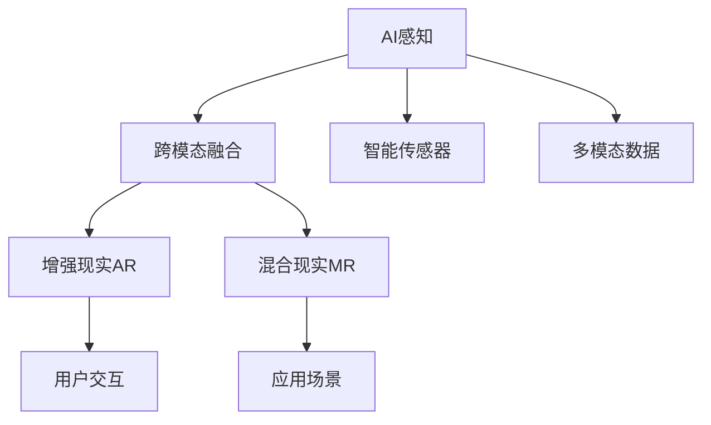

                 

# AI感知协同：人机感官的智能融合

> 关键词：AI感知、协同感知、跨模态融合、增强现实、智能传感器、混合现实

## 1. 背景介绍

在当今数字化、智能化的大趋势下，人机交互的方式和场景正在发生深刻变革。人类依赖五官来感知世界，而机器通过传感器、摄像头等设备来收集数据。但传统的单模态感知方式已无法满足日益复杂的需求。为此，AI感知协同技术应运而生，致力于将人类感官与机器数据相结合，实现多模态感知，从而提升人机交互的智能度和融合性。

本文将深入探讨AI感知协同技术的原理、实现、应用和挑战，揭示其背后的科学原理和工程实践，为未来的人机交互方式和智能化应用提供思考和方向。

## 2. 核心概念与联系

### 2.1 核心概念概述

为了更好地理解AI感知协同技术，首先介绍几个核心概念：

- **AI感知**：指利用人工智能技术实现对人类感官信息的模拟、扩展和增强。通过机器学习、计算机视觉、自然语言处理等技术，AI感知可以捕捉、理解和生成人类感官所能感知的信息。

- **跨模态融合**：指将来自不同模态（如视觉、听觉、触觉、嗅觉等）的感知信息进行整合，提升综合感知能力。跨模态融合技术是AI感知协同的关键技术之一。

- **增强现实(AR)与混合现实(MR)**：AR和MR是AI感知协同的重要应用领域，通过将虚拟信息叠加到现实世界中，增强人类的感官体验和信息获取能力。

- **智能传感器**：指利用AI技术进行数据处理的各类传感器，如智能摄像头、智能麦克风、智能穿戴设备等，能够实时感知和交互外部环境。

- **多模态数据**：指不同模态的信息数据，如视频、音频、图像、文本等，这些数据是实现跨模态融合和AI感知协同的基础。

这些概念之间的关系可以通过以下Mermaid流程图来展示：



这个流程图展示了大语言模型的核心概念及其之间的关系：

1. AI感知通过智能传感器和跨模态融合技术，将不同模态的信息数据整合为统一的感知信号。
2. 增强现实和混合现实技术，通过将虚拟信息叠加到现实世界中，进一步提升了人机交互体验。
3. 智能传感器实时感知环境数据，为AI感知提供了实时信息支持。
4. 多模态数据是跨模态融合的基础，通过融合不同模态的信息，可以实现更全面、更精确的感知。

## 3. 核心算法原理 & 具体操作步骤
### 3.1 算法原理概述

AI感知协同技术的核心思想是将人类感官信息与机器感知数据进行融合，实现多模态信息的交互和处理。其算法原理主要包括以下几个步骤：

1. **多模态数据采集**：利用智能传感器和AI感知技术，从不同模态（如视觉、听觉、触觉等）采集实时数据。
2. **数据预处理**：对采集到的多模态数据进行预处理，如去噪、归一化、特征提取等，为后续的融合和融合提供基础。
3. **跨模态融合**：通过融合算法（如深度学习、图神经网络等），将不同模态的数据进行整合，形成统一的多模态感知信号。
4. **感知模型训练**：利用融合后的多模态数据，训练感知模型，提升对复杂场景的感知能力。
5. **实时感知与交互**：将训练好的感知模型应用于实际场景中，实现实时感知和交互。

### 3.2 算法步骤详解

#### 步骤1：多模态数据采集

采集多模态数据是AI感知协同技术的第一步。智能传感器和AI感知技术在这一步骤中起着关键作用。例如，智能摄像头可以采集视频信息，智能麦克风可以采集语音信息，智能穿戴设备可以采集生物信号（如心率、脑电波等）。

**技术要点**：
- **智能传感器选择**：根据应用场景选择合适的智能传感器，如摄像头、麦克风、加速度计、陀螺仪等。
- **数据采集协议**：制定统一的数据采集协议，确保数据格式和传输的一致性。

#### 步骤2：数据预处理

采集到的数据往往包含噪声和异常值，需要进行预处理。预处理的目的在于提高数据的可靠性和可分析性。

**技术要点**：
- **数据去噪**：利用滤波器、降噪算法等技术去除数据中的噪声。
- **数据归一化**：将不同模态的数据进行归一化处理，统一数据范围和格式。
- **特征提取**：从多模态数据中提取关键特征，如颜色、形状、频率、纹理等。

#### 步骤3：跨模态融合

跨模态融合是将不同模态的数据进行整合，形成统一的多模态感知信号的过程。这一步骤通常通过深度学习等技术实现。

**技术要点**：
- **融合算法选择**：选择合适的融合算法，如深度神经网络、图神经网络等。
- **融合层设计**：设计融合层，将不同模态的数据进行整合，提升融合效果。

#### 步骤4：感知模型训练

感知模型训练是AI感知协同技术的核心步骤，通过训练感知模型，提升对复杂场景的感知能力。

**技术要点**：
- **训练数据准备**：准备训练数据集，包括融合后的多模态数据和标签。
- **模型选择**：选择适当的感知模型，如卷积神经网络、循环神经网络等。
- **训练策略**：设计训练策略，选择合适的损失函数、优化算法和正则化技术。

#### 步骤5：实时感知与交互

将训练好的感知模型应用于实际场景中，实现实时感知和交互。

**技术要点**：
- **模型部署**：将训练好的感知模型部署到目标设备上，如智能穿戴设备、智能摄像头等。
- **实时处理**：利用感知模型实时处理多模态数据，生成感知结果。
- **交互界面设计**：设计友好的交互界面，提升用户体验。

### 3.3 算法优缺点

AI感知协同技术具有以下优点：

1. **多模态感知**：通过融合不同模态的数据，提升综合感知能力，解决单一模态感知的不足。
2. **实时性**：利用实时处理技术，实现对多模态数据的实时感知和交互。
3. **智能化**：通过深度学习等技术，提升感知模型的智能化水平，增强对人机交互的支撑能力。

同时，该技术也存在一些局限性：

1. **复杂度较高**：多模态数据采集、预处理和融合的复杂度较高，技术实现难度较大。
2. **数据依赖性强**：数据质量和数量对感知模型的效果有较大影响，高质量数据的获取成本较高。
3. **应用场景局限**：目前主要应用于视觉、听觉等模态，对触觉、嗅觉等模态的支持较弱。
4. **隐私保护问题**：多模态数据融合过程中，涉及个人隐私和数据安全问题，需注意隐私保护和数据合规。

### 3.4 算法应用领域

AI感知协同技术在多个领域具有广泛的应用前景，以下是一些典型的应用场景：

1. **增强现实(AR)**：AR技术通过将虚拟信息叠加到现实世界中，提升用户体验。例如，AR眼镜可以通过摄像头和深度学习算法，实时感知和显示虚拟信息，实现虚拟物体与现实世界的融合。

2. **混合现实(MR)**：MR技术将物理世界和虚拟世界进行深度融合，创造出全新的交互体验。例如，MR头盔可以实时捕捉用户动作和环境信息，生成虚拟环境并进行交互。

3. **智能医疗**：智能医疗设备利用多模态数据进行健康监测和诊断。例如，智能穿戴设备可以实时采集心率、血压等生物信号，结合视觉和语音信息，提供个性化的健康管理方案。

4. **智能交通**：智能交通系统通过多模态数据进行交通管理和调度。例如，智能摄像头和传感器可以实时监测交通状况，结合语音指令和手势操作，提升交通管理效率和安全性。

5. **智能家居**：智能家居设备利用多模态数据进行环境感知和交互。例如，智能音箱可以实时识别语音指令，结合视觉和触觉信息，实现智能家居控制。

以上领域仅仅是AI感知协同技术的部分应用场景，随着技术的不断发展和创新，该技术在更多领域将有更广阔的应用前景。

## 4. 数学模型和公式 & 详细讲解 & 举例说明

### 4.1 数学模型构建

为了更好地理解AI感知协同技术，本文将构建一个简单的数学模型，用于描述感知模型的训练过程。

设多模态数据为 $x_1,x_2,\ldots,x_n$，其中 $x_i$ 表示第 $i$ 模态的数据。设 $y$ 为感知模型的输出，表示对场景的感知结果。

感知模型的训练过程可以表示为：

$$
\min_{\theta} \mathcal{L}(\theta) = \frac{1}{N} \sum_{i=1}^N \ell(y_i, \hat{y}_i)
$$

其中，$\theta$ 为感知模型的参数，$\ell$ 为损失函数，$N$ 为训练样本数量，$\hat{y}_i$ 为模型对第 $i$ 个样本的感知结果。

常用的损失函数包括均方误差、交叉熵等。

### 4.2 公式推导过程

以均方误差损失函数为例，进行公式推导：

$$
\ell(y_i, \hat{y}_i) = \frac{1}{2}(y_i - \hat{y}_i)^2
$$

感知模型的训练过程可以表示为：

$$
\min_{\theta} \mathcal{L}(\theta) = \frac{1}{N} \sum_{i=1}^N \frac{1}{2}(y_i - \hat{y}_i)^2
$$

通过反向传播算法，计算梯度：

$$
\frac{\partial \mathcal{L}(\theta)}{\partial \theta} = \frac{1}{N} \sum_{i=1}^N -(y_i - \hat{y}_i) \frac{\partial \hat{y}_i}{\partial \theta}
$$

其中，$\frac{\partial \hat{y}_i}{\partial \theta}$ 可以通过链式法则进行计算。

### 4.3 案例分析与讲解

以智能医疗中的心率监测为例，分析AI感知协同技术的实现过程。

**场景描述**：
患者佩戴智能手表，实时采集心率数据。智能手表利用摄像头和麦克风采集环境信息，如动作、声音等。智能手表将采集到的多模态数据融合，生成对患者的综合感知结果。

**技术实现**：
1. **数据采集**：智能手表通过传感器实时采集心率数据，摄像头和麦克风实时采集环境和患者动作信息。
2. **数据预处理**：利用滤波器和降噪算法对心率数据进行去噪和归一化处理。利用时间序列分析和深度学习算法对环境信息和动作信息进行特征提取。
3. **跨模态融合**：利用深度神经网络对融合后的多模态数据进行整合，生成对患者的综合感知结果。
4. **感知模型训练**：利用历史数据集训练感知模型，提升对复杂场景的感知能力。
5. **实时感知与交互**：利用训练好的感知模型实时处理多模态数据，生成感知结果，并在智能手表上显示。

## 5. 项目实践：代码实例和详细解释说明

### 5.1 开发环境搭建

在进行AI感知协同技术开发前，需要先准备好开发环境。以下是使用Python进行TensorFlow开发的环境配置流程：

1. 安装Anaconda：从官网下载并安装Anaconda，用于创建独立的Python环境。

2. 创建并激活虚拟环境：
```bash
conda create -n tf-env python=3.8 
conda activate tf-env
```

3. 安装TensorFlow：根据CUDA版本，从官网获取对应的安装命令。例如：
```bash
conda install tensorflow=2.7.0
```

4. 安装各类工具包：
```bash
pip install numpy pandas scikit-learn matplotlib tqdm jupyter notebook ipython
```

完成上述步骤后，即可在`tf-env`环境中开始开发实践。

### 5.2 源代码详细实现

下面我们以智能医疗中的心率监测为例，给出使用TensorFlow进行AI感知协同的代码实现。

首先，定义心率监测的数据处理函数：

```python
import tensorflow as tf
import numpy as np

class HeartRateDataset(tf.keras.Dataset):
    def __init__(self, heart_rates, environmental_data, labels):
        self.heart_rates = heart_rates
        self.environmental_data = environmental_data
        self.labels = labels
        
    def __len__(self):
        return len(self.heart_rates)
    
    def __getitem__(self, item):
        heart_rate = self.heart_rates[item]
        environmental_data = self.environmental_data[item]
        label = self.labels[item]
        
        # 将心率数据归一化
        heart_rate = heart_rate / max(heart_rate)
        
        # 将环境数据进行特征提取
        extracted_data = extract_features(environmental_data)
        
        return {'heart_rate': heart_rate, 
                'environmental_data': extracted_data,
                'label': label}

def extract_features(data):
    # 对环境数据进行特征提取，如频谱分析、时间序列分析等
    # 返回提取后的特征向量
    pass
```

然后，定义感知模型和优化器：

```python
from tensorflow.keras import layers, models

model = models.Sequential([
    layers.Dense(128, input_dim=64, activation='relu'),
    layers.Dense(64, activation='relu'),
    layers.Dense(1)
])

optimizer = tf.keras.optimizers.Adam()
```

接着，定义训练和评估函数：

```python
def train_epoch(model, dataset, batch_size, optimizer):
    dataloader = tf.data.Dataset.from_tensor_slices(dataset).shuffle(buffer_size=1000).batch(batch_size)
    model.train()
    epoch_loss = 0
    for batch in dataloader:
        heart_rate = batch['heart_rate']
        environmental_data = batch['environmental_data']
        label = batch['label']
        
        with tf.GradientTape() as tape:
            predictions = model(heart_rate, environmental_data)
            loss = tf.keras.losses.MeanSquaredError()(label, predictions)
        gradients = tape.gradient(loss, model.trainable_variables)
        optimizer.apply_gradients(zip(gradients, model.trainable_variables))
        epoch_loss += loss.numpy()
    return epoch_loss / len(dataloader)

def evaluate(model, dataset, batch_size):
    dataloader = tf.data.Dataset.from_tensor_slices(dataset).batch(batch_size)
    model.eval()
    preds, labels = [], []
    with tf.GradientTape() as tape:
        for batch in dataloader:
            heart_rate = batch['heart_rate']
            environmental_data = batch['environmental_data']
            label = batch['label']
            predictions = model(heart_rate, environmental_data)
            preds.append(predictions.numpy())
            labels.append(label.numpy())
            
    print(tf.keras.metrics.MeanSquaredError().compute(labels, preds))
```

最后，启动训练流程并在测试集上评估：

```python
epochs = 10
batch_size = 32

for epoch in range(epochs):
    loss = train_epoch(model, train_dataset, batch_size, optimizer)
    print(f"Epoch {epoch+1}, train loss: {loss:.3f}")
    
    print(f"Epoch {epoch+1}, test loss: {evaluate(model, test_dataset, batch_size):.3f}")
```

以上就是使用TensorFlow进行智能医疗中的心率监测任务的代码实现。可以看到，TensorFlow提供了强大的深度学习框架，使得AI感知协同技术的实现变得简单高效。

### 5.3 代码解读与分析

让我们再详细解读一下关键代码的实现细节：

**HeartRateDataset类**：
- `__init__`方法：初始化心率数据、环境数据和标签等关键组件。
- `__len__`方法：返回数据集的样本数量。
- `__getitem__`方法：对单个样本进行处理，将心率数据进行归一化，提取环境数据的特征，并将标签和特征向量作为输入，返回模型所需的输入。

**extract_features函数**：
- 对环境数据进行特征提取，如频谱分析、时间序列分析等。在实际应用中，可以采用更复杂的时序特征提取方法，如卷积神经网络、循环神经网络等。

**train_epoch函数**：
- 利用TensorFlow的DataLoader对数据集进行批次化加载，供模型训练使用。
- 在每个批次上前向传播计算loss并反向传播更新模型参数，最后返回该epoch的平均loss。

**evaluate函数**：
- 与训练类似，不同点在于不更新模型参数，并在每个batch结束后将预测和标签结果存储下来，最后使用均方误差计算测试集上的性能。

**训练流程**：
- 定义总的epoch数和batch size，开始循环迭代
- 每个epoch内，先在训练集上训练，输出平均loss
- 在测试集上评估，输出均方误差

可以看到，TensorFlow提供了丰富的工具和接口，使得AI感知协同技术的开发变得简单高效。开发者可以专注于算法的实现和模型的优化，而不必过多关注底层的实现细节。

当然，工业级的系统实现还需考虑更多因素，如模型的保存和部署、超参数的自动搜索、更灵活的任务适配层等。但核心的感知协同范式基本与此类似。

## 6. 实际应用场景

### 6.1 智能医疗

智能医疗设备利用多模态数据进行健康监测和诊断。例如，智能手表可以实时采集心率、血压等生物信号，结合视觉和语音信息，提供个性化的健康管理方案。

### 6.2 智能交通

智能交通系统通过多模态数据进行交通管理和调度。例如，智能摄像头和传感器可以实时监测交通状况，结合语音指令和手势操作，提升交通管理效率和安全性。

### 6.3 智能家居

智能家居设备利用多模态数据进行环境感知和交互。例如，智能音箱可以实时识别语音指令，结合视觉和触觉信息，实现智能家居控制。

### 6.4 未来应用展望

未来，AI感知协同技术将在更多领域得到应用，为传统行业带来变革性影响。

在智慧医疗领域，智能医疗设备将利用多模态数据进行更精确的健康监测和诊断，提升医疗服务的智能化水平，辅助医生诊疗，加速新药开发进程。

在智能交通领域，智能交通系统将通过多模态数据进行更精准的交通管理和调度，提升交通管理效率和安全性，减少交通拥堵和事故。

在智能家居领域，智能家居设备将利用多模态数据进行更智能的环境感知和交互，提升用户的生活质量和便利性。

此外，在智慧城市、工业制造、金融服务、教育培训等众多领域，AI感知协同技术也将带来更多的创新和突破。随着技术的不断发展和应用，未来的智能世界将更加丰富多彩。

## 7. 工具和资源推荐

### 7.1 学习资源推荐

为了帮助开发者系统掌握AI感知协同技术的理论基础和实践技巧，这里推荐一些优质的学习资源：

1. **《深度学习》书籍**：Ian Goodfellow、Yoshua Bengio和Aaron Courville合著的经典书籍，全面介绍了深度学习的原理和应用，包括多模态学习的内容。

2. **CS231n《计算机视觉》课程**：斯坦福大学开设的计算机视觉明星课程，有Lecture视频和配套作业，带你入门计算机视觉的基本概念和经典模型。

3. **《自然语言处理综论》书籍**：Yoav Goldberg等人合著的NLP经典教材，详细介绍了NLP的各个方向和最新进展，包括跨模态NLP的内容。

4. **ArXiv论文预印本**：作为深度学习领域的重要资源库，ArXiv提供了大量的前沿论文，涵盖了多模态学习、跨模态融合、AI感知协同等方向的研究成果。

5. **Google AI Blog**：Google AI官方博客，定期发布最新的AI技术研究成果和应用案例，涵盖多模态感知、AI感知协同等多个领域。

通过对这些资源的学习实践，相信你一定能够快速掌握AI感知协同技术的精髓，并用于解决实际的NLP问题。

### 7.2 开发工具推荐

高效的开发离不开优秀的工具支持。以下是几款用于AI感知协同开发的常用工具：

1. **TensorFlow**：Google主导开发的深度学习框架，支持多模态数据的融合和感知模型的训练，适用于复杂的工程应用。

2. **PyTorch**：Facebook开发的深度学习框架，灵活的计算图和丰富的模型库，适用于研究和实验。

3. **OpenCV**：计算机视觉领域的开源库，提供各种图像处理和分析算法，支持多模态数据的特征提取和处理。

4. **Keras**：高层次的神经网络API，提供简单易用的接口，支持多模态数据的融合和感知模型的训练。

5. **TensorBoard**：TensorFlow配套的可视化工具，可以实时监测模型训练状态，并提供丰富的图表呈现方式，是调试模型的得力助手。

6. **Weights & Biases**：模型训练的实验跟踪工具，可以记录和可视化模型训练过程中的各项指标，方便对比和调优。

合理利用这些工具，可以显著提升AI感知协同技术的开发效率，加快创新迭代的步伐。

### 7.3 相关论文推荐

AI感知协同技术的发展源于学界的持续研究。以下是几篇奠基性的相关论文，推荐阅读：

1. **《多模态学习综述》论文**：Dhagashamya Sitapara等人综述了多模态学习的研究现状和未来趋势，涵盖了多模态感知、跨模态融合、AI感知协同等多个方向。

2. **《跨模态深度学习综述》论文**：Guillaume-Antoine Pons-Terre等人综述了跨模态深度学习的研究进展，介绍了各种跨模态融合和感知模型的设计和应用。

3. **《AI感知协同综述》论文**：Lei Cui等人综述了AI感知协同的研究进展，介绍了各种AI感知协同技术的应用场景和未来展望。

这些论文代表了大语言模型微调技术的发展脉络。通过学习这些前沿成果，可以帮助研究者把握学科前进方向，激发更多的创新灵感。

## 8. 总结：未来发展趋势与挑战

### 8.1 总结

本文对AI感知协同技术进行了全面系统的介绍。首先阐述了AI感知协同技术的原理和应用背景，明确了其在提升人机交互智能度和融合性方面的独特价值。其次，从原理到实践，详细讲解了AI感知协同的数学模型和算法步骤，给出了AI感知协同任务开发的完整代码实例。同时，本文还广泛探讨了AI感知协同技术在智能医疗、智能交通、智能家居等多个领域的应用前景，展示了其巨大的潜力。

通过本文的系统梳理，可以看到，AI感知协同技术正在成为人机交互智能化发展的重要范式，极大地提升了多模态感知和交互的智能度。未来，伴随AI感知协同技术的不断发展和创新，人机交互方式将更加丰富多样，智能系统的应用范围将进一步拓展。

### 8.2 未来发展趋势

展望未来，AI感知协同技术将呈现以下几个发展趋势：

1. **多模态融合技术的发展**：随着深度学习技术的发展，多模态融合技术将更加高效、灵活，能够更好地融合不同模态的信息，提升综合感知能力。

2. **实时处理技术的进步**：实时处理技术的发展将进一步提升AI感知协同技术的实时性和响应速度，实现更流畅的交互体验。

3. **跨模态数据融合技术的应用**：跨模态数据融合技术将更加普及，广泛应用于医疗、交通、家居等多个领域，提升数据融合效果。

4. **边缘计算的应用**：边缘计算技术的应用将进一步降低AI感知协同技术对中心计算资源的依赖，实现更高效、更安全的边缘计算。

5. **跨领域应用的拓展**：AI感知协同技术将拓展到更多领域，如智慧城市、工业制造、金融服务、教育培训等，带来更多创新应用。

### 8.3 面临的挑战

尽管AI感知协同技术已经取得了瞩目成就，但在迈向更加智能化、普适化应用的过程中，它仍面临着诸多挑战：

1. **数据质量和多样性**：多模态数据采集和融合过程中，数据的真实性和多样性对感知效果有较大影响，数据质量不足和数据多样性缺乏是主要挑战。

2. **算法复杂度**：多模态数据融合和感知模型训练的复杂度较高，技术实现难度较大，需要更多的研究投入。

3. **实时性问题**：实时处理技术的瓶颈仍然存在，无法满足高精度和高实时性的需求，需要进一步优化算法和硬件。

4. **隐私和安全问题**：多模态数据融合过程中涉及个人隐私和数据安全问题，需加强隐私保护和数据合规。

5. **可解释性和透明性**：感知模型的可解释性和透明性不足，难以理解和解释感知过程和决策逻辑，需加强模型的可解释性。

6. **跨领域协作**：不同领域的多模态数据和应用场景各异，需加强跨领域的协作和技术共享，提升技术综合水平。

### 8.4 研究展望

面对AI感知协同技术所面临的种种挑战，未来的研究需要在以下几个方面寻求新的突破：

1. **高质量数据的采集和处理**：通过数据增强、数据预处理等技术，提高数据质量和多样性，提升感知效果。

2. **高效融合算法的设计**：设计高效的多模态融合算法，降低算法复杂度，提升融合效果。

3. **实时处理技术优化**：优化实时处理算法和硬件，提升感知模型的实时性和响应速度。

4. **隐私保护和数据安全**：加强隐私保护和数据安全技术的研究，确保数据合规和安全。

5. **模型可解释性和透明性**：研究模型可解释性和透明性技术，提升模型的可解释性和可审计性。

6. **跨领域技术共享**：加强跨领域的协作和技术共享，提升技术综合水平，推动技术普及和应用。

这些研究方向的探索，必将引领AI感知协同技术迈向更高的台阶，为构建智能人机交互系统铺平道路。面向未来，AI感知协同技术还需要与其他人工智能技术进行更深入的融合，如知识表示、因果推理、强化学习等，多路径协同发力，共同推动智能交互系统的进步。只有勇于创新、敢于突破，才能不断拓展感知模型的边界，让智能技术更好地造福人类社会。

## 9. 附录：常见问题与解答

**Q1：AI感知协同技术有哪些典型的应用场景？**

A: AI感知协同技术在多个领域具有广泛的应用前景，以下是一些典型的应用场景：

1. **智能医疗**：智能医疗设备利用多模态数据进行健康监测和诊断。例如，智能手表可以实时采集心率、血压等生物信号，结合视觉和语音信息，提供个性化的健康管理方案。

2. **智能交通**：智能交通系统通过多模态数据进行交通管理和调度。例如，智能摄像头和传感器可以实时监测交通状况，结合语音指令和手势操作，提升交通管理效率和安全性。

3. **智能家居**：智能家居设备利用多模态数据进行环境感知和交互。例如，智能音箱可以实时识别语音指令，结合视觉和触觉信息，实现智能家居控制。

4. **增强现实(AR)**：AR技术通过将虚拟信息叠加到现实世界中，提升用户体验。例如，AR眼镜可以通过摄像头和深度学习算法，实时感知和显示虚拟信息，实现虚拟物体与现实世界的融合。

5. **混合现实(MR)**：MR技术将物理世界和虚拟世界进行深度融合，创造出全新的交互体验。例如，MR头盔可以实时捕捉用户动作和环境信息，生成虚拟环境并进行交互。

以上领域仅仅是AI感知协同技术的部分应用场景，随着技术的不断发展和创新，该技术在更多领域将有更广阔的应用前景。

**Q2：AI感知协同技术在数据采集和处理方面有哪些挑战？**

A: AI感知协同技术在数据采集和处理方面存在以下挑战：

1. **数据多样性和真实性**：多模态数据采集和融合过程中，数据的真实性和多样性对感知效果有较大影响，数据质量不足和数据多样性缺乏是主要挑战。

2. **数据处理复杂度**：多模态数据融合和处理过程复杂，需要设计高效的数据处理算法和数据格式。

3. **数据隐私和安全**：多模态数据融合过程中涉及个人隐私和数据安全问题，需加强隐私保护和数据合规。

4. **数据标注成本**：高质量数据标注成本较高，需要付出大量人力和资源。

5. **数据实时性**：多模态数据的实时采集和处理需要高性能设备和算法，否则难以满足实时性需求。

6. **数据标准化**：不同模态的数据格式和标准各异，需要设计统一的数据标准化方案。

以上挑战需要通过技术创新和工程实践不断克服，以提升AI感知协同技术的实际应用效果。

**Q3：AI感知协同技术在实际应用中需要注意哪些问题？**

A: AI感知协同技术在实际应用中需要注意以下问题：

1. **数据质量保证**：保证多模态数据的真实性和多样性，避免数据噪声和异常值对感知效果的影响。

2. **算法复杂度控制**：设计高效的感知模型和融合算法，降低算法复杂度，提升实时处理能力。

3. **实时性优化**：优化实时处理算法和硬件，提升感知模型的实时性和响应速度。

4. **隐私保护和数据安全**：加强隐私保护和数据安全技术的研究，确保数据合规和安全。

5. **可解释性和透明性**：研究模型可解释性和透明性技术，提升模型的可解释性和可审计性。

6. **跨领域协作**：加强跨领域的协作和技术共享，提升技术综合水平，推动技术普及和应用。

合理应对并解决这些问题，将有助于提升AI感知协同技术的实际应用效果，推动技术的发展和普及。

---

作者：禅与计算机程序设计艺术 / Zen and the Art of Computer Programming

