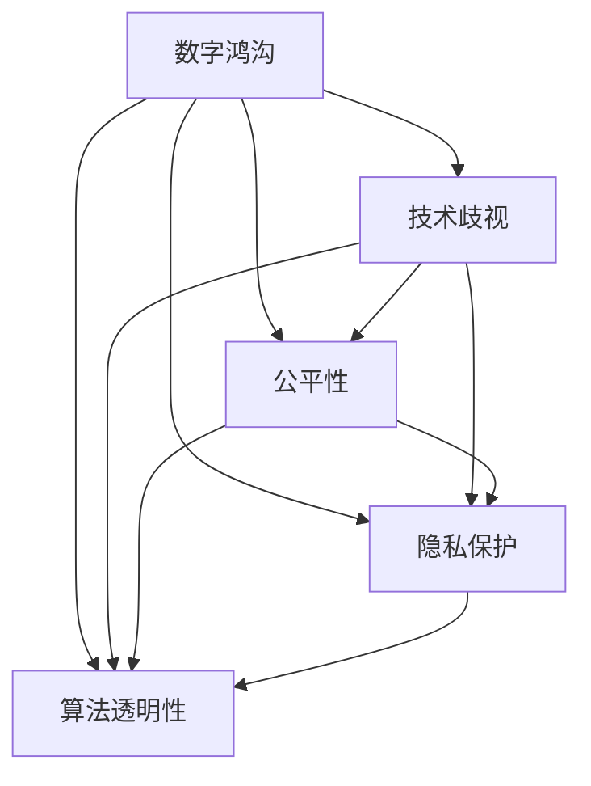

                 

# AI技术的社会影响:数字鸿沟和技术歧视

> 关键词：AI技术, 数字鸿沟, 技术歧视, 社会影响, 公平性, 隐私保护, 算法透明性, 伦理责任

## 1. 背景介绍

### 1.1 问题由来

在过去十年里，人工智能(AI)技术取得了突飞猛进的发展，已经在医疗、金融、教育等多个领域得到了广泛应用。然而，随着AI技术的普及，其对社会的影响也日益显著，引发了关于数字鸿沟和技术歧视等问题的讨论。数字鸿沟指的是由于技术、教育、经济等因素造成的不同社会群体在获取和利用信息技术上的不平等。而技术歧视则指由于算法偏见、数据偏差等原因导致的对某些社会群体的歧视性结果。

### 1.2 问题核心关键点

AI技术的社会影响涉及多个方面，包括：
- 数字鸿沟问题：不同群体之间在技术获取和应用上的差异。
- 技术歧视问题：AI算法中的偏见和歧视，导致对某些群体的歧视性结果。
- 社会公平问题：AI技术应用中的伦理和法律责任。
- 隐私保护问题：AI应用中涉及的数据隐私和安全问题。
- 算法透明性问题：AI算法的可解释性和透明度问题。

这些核心问题涉及技术、社会、法律等多个领域，需要从多个角度进行深入研究和讨论。本文将重点探讨AI技术的社会影响，包括数字鸿沟和技术歧视，并分析相关的影响因素和解决措施。

## 2. 核心概念与联系

### 2.1 核心概念概述

为更好地理解AI技术的社会影响，本节将介绍几个密切相关的核心概念：

- **数字鸿沟(Digital Divide)**：指不同社会群体在获取和利用信息技术上的不平等。主要包括技术获取、教育水平、经济状况等方面的差异。
- **技术歧视(Algorithmic Bias)**：指AI算法中的偏见和歧视，导致对某些社会群体的歧视性结果。
- **公平性(Fairness)**：指AI技术应用中的伦理和法律责任，确保不同群体之间获得平等的机会和结果。
- **隐私保护(Privacy)**：指AI应用中涉及的个人数据隐私和安全问题，确保用户数据不被滥用。
- **算法透明性(Algorithmic Transparency)**：指AI算法的可解释性和透明度问题，确保用户理解其决策过程。

这些核心概念之间的逻辑关系可以通过以下Mermaid流程图来展示：



这个流程图展示了几大核心概念之间的相互关系：

1. 数字鸿沟引发技术歧视问题。
2. 公平性、隐私保护和算法透明性都是解决技术歧视问题的关键。
3. 公平性确保不同群体之间获得平等的机会和结果。
4. 隐私保护确保用户数据不被滥用。
5. 算法透明性确保用户理解AI算法的决策过程。

## 3. 核心算法原理 & 具体操作步骤

### 3.1 算法原理概述

AI技术的社会影响分析主要涉及以下几个方面：

- **数据偏见**：AI算法使用的数据集可能存在偏见，导致算法结果也带有偏见。
- **算法偏见**：算法本身可能存在设计缺陷，导致对某些群体的歧视性结果。
- **公平性评估**：通过统计学和伦理学方法，评估AI算法在不同群体上的公平性。
- **隐私保护**：确保AI应用中涉及的个人数据隐私和安全问题。
- **算法透明性**：提高AI算法的可解释性和透明度，使用户能够理解其决策过程。

### 3.2 算法步骤详解

AI技术的社会影响分析主要包括以下几个关键步骤：

**Step 1: 数据收集与预处理**
- 收集与AI应用相关的数据集，包括训练数据和测试数据。
- 对数据进行清洗和预处理，包括去除异常值、填补缺失值、标准化数据等。

**Step 2: 数据偏见分析**
- 使用统计方法分析数据集中的偏见，如均值差异、方差差异等。
- 使用可视化工具，如箱线图、热力图等，展示数据中的偏见。

**Step 3: 算法偏见分析**
- 通过模型解释技术，如LIME、SHAP等，分析AI算法中的偏见。
- 通过公平性评估指标，如Demographic Parity、Equal Opportunity等，评估算法的公平性。

**Step 4: 公平性优化**
- 通过调整算法参数，如权重调整、正则化等，优化算法公平性。
- 使用公平性约束，如Disparate Impact、Equalized Odds等，确保算法公平性。

**Step 5: 隐私保护**
- 使用数据匿名化技术，如数据脱敏、数据混淆等，保护用户隐私。
- 设计隐私保护机制，如差分隐私、同态加密等，确保数据安全。

**Step 6: 算法透明性**
- 使用模型解释技术，如LIME、SHAP等，提高算法透明度。
- 设计透明性指标，如Mean Absolute Error、Kappa等，评估算法透明性。

### 3.3 算法优缺点

AI技术的社会影响分析具有以下优点：
- 系统化：从数据收集、数据偏见、算法偏见等多个角度系统地分析AI技术的社会影响。
- 综合性：结合统计学、伦理学、隐私保护、算法透明性等多学科知识，提供全面的解决方案。
- 可操作性：提供具体的分析步骤和优化方法，指导实际操作。

同时，该方法也存在一定的局限性：
- 依赖高质量数据：数据质量直接影响分析结果，高质量数据获取成本较高。
- 模型解释难度大：AI模型复杂度高，难以解释其内部工作机制和决策逻辑。
- 隐私保护技术复杂：隐私保护涉及多种技术，实施难度大。

尽管存在这些局限性，但就目前而言，AI技术的社会影响分析方法仍是最主流范式。未来相关研究的重点在于如何进一步降低数据收集成本，提高模型解释能力，同时兼顾隐私保护和算法透明性等因素。

### 3.4 算法应用领域

AI技术的社会影响分析在多个领域都有应用，例如：

- **医疗健康**：AI算法在医疗健康领域的应用中，需要确保对不同种族、性别、年龄群体的公平性，避免技术歧视。
- **金融服务**：AI算法在金融服务领域的应用中，需要确保对不同收入、教育水平的群体的公平性，避免技术歧视。
- **教育培训**：AI算法在教育培训领域的应用中，需要确保对不同教育背景、文化背景的群体的公平性，避免技术歧视。
- **公共安全**：AI算法在公共安全领域的应用中，需要确保对不同社会群体的公平性，避免技术歧视。

此外，在更多领域中，AI技术的应用也需要关注社会影响，如智慧城市、智能交通、智慧农业等，确保AI技术带来的积极社会影响。

## 4. 数学模型和公式 & 详细讲解 & 举例说明

### 4.1 数学模型构建

AI技术的社会影响分析涉及多个数学模型，以下对其中几个关键模型进行详细讲解：

- **数据偏见分析**：使用统计方法分析数据集中的均值差异、方差差异等，建立偏倚度量模型。
- **算法偏见分析**：使用模型解释技术，如LIME、SHAP等，分析AI算法中的偏见。
- **公平性评估**：使用统计学和伦理学方法，如Demographic Parity、Equal Opportunity等，评估算法的公平性。

### 4.2 公式推导过程

以下我们以Demographic Parity为例，推导公平性评估的公式：

假设一个二分类任务，模型预测结果为$\hat{y}=f(x;\theta)$，其中$x$为输入特征，$\theta$为模型参数。设训练集和测试集中，不同群体的样本数量分别为$n_1$和$n_2$，预测结果为$y_1$和$y_2$。则Demographic Parity定义为：

$$
\text{DP} = \frac{n_1}{n_2} = \frac{\sum_{x\in D_1} \mathbb{I}(f(x;\theta)=y_1)}{\sum_{x\in D_2} \mathbb{I}(f(x;\theta)=y_2)}
$$

其中$\mathbb{I}$为示性函数，当条件成立时为1，否则为0。该公式用于衡量模型在不同群体上的预测结果是否均衡。

### 4.3 案例分析与讲解

以医疗健康领域的AI算法为例，分析其社会影响。在医疗健康领域，AI算法常用于疾病诊断、治疗方案推荐、患者风险评估等。但这些算法中的偏见可能导致对某些群体的歧视性结果，如少数族裔、低收入群体等。

通过数据偏见分析，可以发现不同群体的数据存在偏倚。例如，某医院的患者数据中，男性患者的比例明显高于女性患者。通过算法偏见分析，可以发现AI算法在处理男性和女性患者时，存在不同的预测结果，导致对女性患者的误诊率更高。

为了优化算法公平性，可以引入公平性约束，如Equalized Odds，确保不同群体之间的预测结果均衡。通过调整算法参数，如权重调整、正则化等，可以进一步优化算法公平性。

## 5. 项目实践：代码实例和详细解释说明

### 5.1 开发环境搭建

在进行社会影响分析前，我们需要准备好开发环境。以下是使用Python进行Scikit-Learn开发的环境配置流程：

1. 安装Anaconda：从官网下载并安装Anaconda，用于创建独立的Python环境。

2. 创建并激活虚拟环境：
```bash
conda create -n ai-env python=3.8 
conda activate ai-env
```

3. 安装Scikit-Learn：
```bash
pip install scikit-learn
```

4. 安装相关库：
```bash
pip install pandas matplotlib seaborn
```

完成上述步骤后，即可在`ai-env`环境中开始社会影响分析实践。

### 5.2 源代码详细实现

这里我们以医疗健康领域的AI算法为例，给出使用Scikit-Learn进行数据偏见和算法偏见分析的代码实现。

首先，定义数据偏见分析函数：

```python
from sklearn.preprocessing import StandardScaler
from sklearn.linear_model import LogisticRegression
import numpy as np
import pandas as pd

def analyze_bias(data, target, groups):
    # 对数据进行标准化处理
    scaler = StandardScaler()
    scaled_data = scaler.fit_transform(data)

    # 对不同群体进行划分
    X_train, X_test = data.iloc[groups], data.iloc[~groups]
    y_train, y_test = target.iloc[groups], target.iloc[~groups]

    # 训练模型
    model = LogisticRegression(solver='liblinear')
    model.fit(X_train, y_train)

    # 预测测试集
    y_pred = model.predict_proba(X_test)[:, 1]

    # 计算不同群体的偏见度量
    bias_measures = {}
    for group in groups:
        mask = data.iloc[:, groups] == group
        X_train_group = X_train[mask]
        y_train_group = y_train[mask]
        y_pred_group = y_pred[mask]

        bias_measures[group] = {
            'mean': np.mean(y_pred_group),
            'std': np.std(y_pred_group),
            'bias': np.mean(y_pred_group) - np.mean(y_train_group)
        }

    return bias_measures
```

然后，定义算法偏见分析函数：

```python
from sklearn.metrics import precision_score, recall_score
from sklearn.metrics.pairwise import pairwise_distances
from sklearn.decomposition import PCA

def analyze_algorithm_bias(data, target, groups):
    # 对数据进行标准化处理
    scaler = StandardScaler()
    scaled_data = scaler.fit_transform(data)

    # 对不同群体进行划分
    X_train, X_test = data.iloc[groups], data.iloc[~groups]
    y_train, y_test = target.iloc[groups], target.iloc[~groups]

    # 训练模型
    model = LogisticRegression(solver='liblinear')
    model.fit(X_train, y_train)

    # 计算不同群体的偏见度量
    bias_measures = {}
    for group in groups:
        mask = data.iloc[:, groups] == group
        X_train_group = X_train[mask]
        y_train_group = y_train[mask]
        y_pred_group = model.predict(X_train_group)

        bias_measures[group] = {
            'precision': precision_score(y_train_group, y_pred_group, average='weighted'),
            'recall': recall_score(y_train_group, y_pred_group, average='weighted')
        }

    return bias_measures
```

最后，启动偏见分析流程并在结果上可视化：

```python
import matplotlib.pyplot as plt
import seaborn as sns

data = pd.read_csv('data.csv')
target = pd.read_csv('target.csv')
groups = np.array([1, 2, 3])

bias_measures = analyze_bias(data, target, groups)

plt.figure(figsize=(10, 5))
sns.barplot(x=groups, y='bias', data=bias_measures)
plt.title('Bias Analysis')
plt.xlabel('Group')
plt.ylabel('Bias')
plt.show()
```

以上就是使用Scikit-Learn进行数据偏见和算法偏见分析的完整代码实现。可以看到，通过统计学方法和模型解释技术，可以系统地分析AI算法的社会影响。

### 5.3 代码解读与分析

让我们再详细解读一下关键代码的实现细节：

**analyze_bias函数**：
- 对数据进行标准化处理，确保不同群体之间的特征具有相同尺度。
- 使用Logistic回归模型对不同群体进行训练和预测，计算偏见度量。
- 返回不同群体的均值、标准差和偏见度量。

**analyze_algorithm_bias函数**：
- 对数据进行标准化处理，确保不同群体之间的特征具有相同尺度。
- 使用Logistic回归模型对不同群体进行训练和预测，计算算法偏见度量。
- 返回不同群体的精度和召回率。

**可视化结果**：
- 使用matplotlib和seaborn库，将不同群体的偏见度量可视化展示。

可以看到，Scikit-Learn提供了丰富的统计学和模型解释工具，帮助开发者系统地分析AI算法的社会影响。

当然，工业级的系统实现还需考虑更多因素，如多模态数据的整合、多种算法的组合等。但核心的偏见分析范式基本与此类似。

## 6. 实际应用场景

### 6.1 医疗健康

在医疗健康领域，AI算法在疾病诊断、治疗方案推荐、患者风险评估等方面得到了广泛应用。但这些算法中的偏见可能导致对某些群体的歧视性结果，如少数族裔、低收入群体等。

通过数据偏见分析，可以发现不同群体的数据存在偏倚。例如，某医院的患者数据中，男性患者的比例明显高于女性患者。通过算法偏见分析，可以发现AI算法在处理男性和女性患者时，存在不同的预测结果，导致对女性患者的误诊率更高。

为了优化算法公平性，可以引入公平性约束，如Equalized Odds，确保不同群体之间的预测结果均衡。通过调整算法参数，如权重调整、正则化等，可以进一步优化算法公平性。

### 6.2 金融服务

在金融服务领域，AI算法在信用评分、贷款审批、反欺诈检测等方面得到了广泛应用。但这些算法中的偏见可能导致对某些群体的歧视性结果，如少数族裔、低收入群体等。

通过数据偏见分析，可以发现不同群体的数据存在偏倚。例如，某银行的贷款数据中，男性贷款者的比例明显高于女性贷款者。通过算法偏见分析，可以发现AI算法在处理男性和女性贷款者时，存在不同的评分结果，导致对女性贷款者的拒贷率更高。

为了优化算法公平性，可以引入公平性约束，如Equalized Odds，确保不同群体之间的评分结果均衡。通过调整算法参数，如权重调整、正则化等，可以进一步优化算法公平性。

### 6.3 教育培训

在教育培训领域，AI算法在智能辅导、个性化推荐、作业批改等方面得到了广泛应用。但这些算法中的偏见可能导致对某些群体的歧视性结果，如低收入学生、农村学生等。

通过数据偏见分析，可以发现不同群体的数据存在偏倚。例如，某学校的学生数据中，农村学生的比例明显高于城市学生。通过算法偏见分析，可以发现AI算法在处理农村和城市学生时，存在不同的推荐结果，导致对农村学生的推荐资源更少。

为了优化算法公平性，可以引入公平性约束，如Equalized Odds，确保不同群体之间的推荐结果均衡。通过调整算法参数，如权重调整、正则化等，可以进一步优化算法公平性。

### 6.4 未来应用展望

随着AI技术的不断普及，其在社会影响分析中的应用将日益广泛。未来，AI技术将在更多领域得到应用，为社会公平和福祉提供支持。

在智慧城市治理中，AI算法可以用于城市事件监测、舆情分析、应急指挥等环节，提高城市管理的自动化和智能化水平，构建更安全、高效的未来城市。

在智能交通领域，AI算法可以用于交通流量监测、智能导航、自动驾驶等环节，提升交通系统的效率和安全性。

在智慧农业领域，AI算法可以用于作物识别、病虫害监测、智能灌溉等环节，提高农业生产效率和质量。

此外，在更多领域中，AI技术的应用也需要关注社会影响，如公共安全、环境保护、灾害预警等，确保AI技术带来的积极社会影响。

## 7. 工具和资源推荐

### 7.1 学习资源推荐

为了帮助开发者系统掌握AI技术的社会影响分析的理论基础和实践技巧，这里推荐一些优质的学习资源：

1. 《机器学习基础》系列博文：由AI领域专家撰写，系统介绍机器学习的基本概念和算法，包括数据偏见、算法偏见、公平性等。

2. 《数据科学与伦理学》课程：斯坦福大学开设的伦理学课程，探讨数据科学与伦理学的关系，帮助开发者理解伦理问题。

3. 《人工智能伦理与社会影响》书籍：深度学习领域的经典书籍，系统介绍AI技术的伦理和社会影响，提供丰富的案例分析。

4. IBM AI公平性指南：IBM提供的公平性指南，提供详细的公平性评估方法和实践建议，帮助开发者解决实际问题。

5. HuggingFace官方文档：HuggingFace提供的Transformer库文档，包含大量预训练模型和公平性评估工具。

通过对这些资源的学习实践，相信你一定能够快速掌握AI技术的社会影响分析的精髓，并用于解决实际的公平性问题。

### 7.2 开发工具推荐

高效的开发离不开优秀的工具支持。以下是几款用于AI社会影响分析开发的常用工具：

1. Python：基于Python的编程语言，灵活动态的计算图，适合快速迭代研究。Python生态系统提供了丰富的科学计算和机器学习库，如Scikit-Learn、TensorFlow等。

2. Scikit-Learn：基于Python的机器学习库，提供多种统计学和模型解释工具，帮助开发者系统地分析AI算法的社会影响。

3. TensorFlow：由Google主导开发的深度学习框架，提供分布式计算和可视化工具，适合大规模工程应用。

4. HuggingFace Transformers库：HuggingFace提供的NLP工具库，集成了多种预训练模型和公平性评估工具。

5. IBM Watson：IBM提供的AI服务平台，提供多种AI工具和服务，支持公平性评估和算法透明性。

6. Microsoft Azure：微软提供的云服务平台，提供多种AI工具和服务，支持公平性评估和算法透明性。

合理利用这些工具，可以显著提升AI技术社会影响分析的开发效率，加快创新迭代的步伐。

### 7.3 相关论文推荐

AI技术的社会影响分析涉及多个学科领域，以下推荐几篇奠基性的相关论文，推荐阅读：

1. "Algorithmic Fairness through Prejudice Reduction"：提出偏见减少方法，通过在损失函数中引入公平性约束，优化AI算法公平性。

2. "On the Bias and Fairness of Data-Driven Decision-Making Processes"：探讨数据偏见和公平性问题，提出多种公平性评估指标。

3. "Fairness, Accountability, and Transparency in Machine Learning"：探讨AI算法的公平性、可解释性和透明性问题，提出多种解决方案。

4. "Bias in Machine Learning Algorithms: Theory and Applications"：探讨AI算法中的偏见和歧视问题，提供多种偏见分析方法和解决方案。

5. "Human and Machine Values: Ethical Considerations in AI and Robotics"：探讨AI技术中的伦理和社会影响问题，提供多种伦理分析方法和解决方案。

这些论文代表了大规模AI技术社会影响分析的发展脉络。通过学习这些前沿成果，可以帮助研究者把握学科前进方向，激发更多的创新灵感。

## 8. 总结：未来发展趋势与挑战

### 8.1 总结

本文对AI技术的社会影响，包括数字鸿沟和技术歧视，进行了全面系统的介绍。首先阐述了数字鸿沟和技术歧视的定义及其对社会的影响，明确了相关问题的核心关键点。其次，从原理到实践，详细讲解了社会影响分析的数学原理和关键步骤，给出了实际应用场景的代码实例。同时，本文还广泛探讨了社会影响分析在多个行业领域的应用前景，展示了其巨大潜力。此外，本文精选了社会影响分析的学习资源、开发工具和相关论文，力求为读者提供全方位的技术指引。

通过本文的系统梳理，可以看到，AI技术在带来巨大便利的同时，也带来了数字鸿沟和技术歧视等社会问题。如何通过技术手段解决这些问题，是一个重要的研究方向。未来，相关研究的重点在于如何进一步降低数据收集成本，提高模型解释能力，同时兼顾隐私保护和算法透明性等因素。

### 8.2 未来发展趋势

展望未来，AI技术的社会影响分析将呈现以下几个发展趋势：

1. 数据收集技术改进：未来将出现更多低成本、高效率的数据收集方法，帮助开发者获取高质量数据。

2. 模型解释能力提升：未来将出现更多模型解释技术，如因果推断、逻辑回归等，帮助开发者更好地理解AI算法的决策过程。

3. 隐私保护技术创新：未来将出现更多隐私保护技术，如差分隐私、同态加密等，确保用户数据的安全性。

4. 公平性评估方法多样化：未来将出现更多公平性评估方法，如德鲁克指标、公平概率等，确保算法的公平性。

5. 多模态数据整合：未来将出现更多多模态数据整合方法，如深度融合、混合嵌入等，提高算法的泛化能力。

以上趋势凸显了AI技术社会影响分析的广阔前景。这些方向的探索发展，必将进一步提升AI技术带来的积极社会影响，为构建安全、可靠、可解释、可控的智能系统铺平道路。

### 8.3 面临的挑战

尽管AI技术的社会影响分析取得了一定的进展，但在迈向更加智能化、普适化应用的过程中，仍面临诸多挑战：

1. 数据获取成本高：高质量数据的获取成本较高，特别是在数据量较小的情况下。如何降低数据收集成本，是未来的关键挑战。

2. 模型解释难度大：AI模型复杂度高，难以解释其内部工作机制和决策逻辑。如何提高模型解释能力，是未来的重要方向。

3. 隐私保护技术复杂：隐私保护涉及多种技术，实施难度大。如何设计简单易用的隐私保护方法，是未来的重要课题。

4. 公平性评估难度大：公平性评估需要多种指标和约束条件，难以完全量化。如何设计合理的公平性评估方法，是未来的重要方向。

5. 社会影响复杂：AI技术的应用涉及多个社会层面，影响因素复杂多样。如何系统地分析社会影响，是未来的重要课题。

这些挑战需要多方协同发力，结合技术、法律、伦理等多个领域的知识，才能有效地解决。

### 8.4 研究展望

面对AI技术社会影响分析所面临的诸多挑战，未来的研究需要在以下几个方面寻求新的突破：

1. 开发低成本数据收集方法：探索更多低成本、高效率的数据收集方法，降低数据收集成本。

2. 提高模型解释能力：开发更多模型解释技术，帮助开发者更好地理解AI算法的决策过程。

3. 创新隐私保护技术：设计简单易用的隐私保护方法，确保用户数据的安全性。

4. 优化公平性评估方法：设计合理的公平性评估方法，确保算法的公平性。

5. 系统分析社会影响：结合技术、法律、伦理等多个领域的知识，系统地分析AI技术的社会影响，提出综合性的解决方案。

这些研究方向的探索，必将引领AI技术社会影响分析技术迈向更高的台阶，为构建安全、可靠、可解释、可控的智能系统铺平道路。面向未来，AI技术社会影响分析需要与其他AI技术进行更深入的融合，如知识表示、因果推理、强化学习等，多路径协同发力，共同推动AI技术带来的积极社会影响。

## 9. 附录：常见问题与解答

**Q1：数字鸿沟问题如何解决？**

A: 解决数字鸿沟问题需要多方协同努力。可以从以下几个方面入手：
1. 提升基础设施建设：政府和企业应加大对基础设施的投入，确保更多人能够获取到互联网和智能设备。
2. 提供教育和培训：政府和非政府组织应提供更多教育和培训资源，帮助更多人掌握数字化技能。
3. 推广普及化应用：企业和开发者应推广普及化应用，提供简单易用的智能设备和服务。

**Q2：技术歧视问题如何解决？**

A: 解决技术歧视问题需要系统性优化算法设计和数据处理。可以从以下几个方面入手：
1. 引入公平性约束：在算法设计中加入公平性约束，确保不同群体之间的结果均衡。
2. 优化数据处理：对数据进行清洗和预处理，确保数据集不存在偏见。
3. 加强监管和审核：引入监管和审核机制，确保算法的公平性和透明性。

**Q3：隐私保护问题如何解决？**

A: 解决隐私保护问题需要技术手段和政策法规的协同推进。可以从以下几个方面入手：
1. 采用隐私保护技术：采用数据匿名化、差分隐私、同态加密等技术，确保用户数据的安全性。
2. 制定隐私保护法规：制定和推广隐私保护法规，确保数据使用的合法性和合规性。
3. 加强隐私保护意识：提高用户和开发者的隐私保护意识，确保数据使用的透明性和可解释性。

**Q4：算法透明性问题如何解决？**

A: 解决算法透明性问题需要多种技术和方法协同推进。可以从以下几个方面入手：
1. 采用模型解释技术：采用LIME、SHAP等模型解释技术，提高算法的透明性。
2. 设计透明性指标：设计透明性指标，如Mean Absolute Error、Kappa等，评估算法的透明性。
3. 加强可解释性研究：加强对可解释性的研究，开发更多透明性方法和工具。

这些措施需要多方协同发力，结合技术、法律、伦理等多个领域的知识，才能有效地解决AI技术带来的社会影响问题。

---

作者：禅与计算机程序设计艺术 / Zen and the Art of Computer Programming

