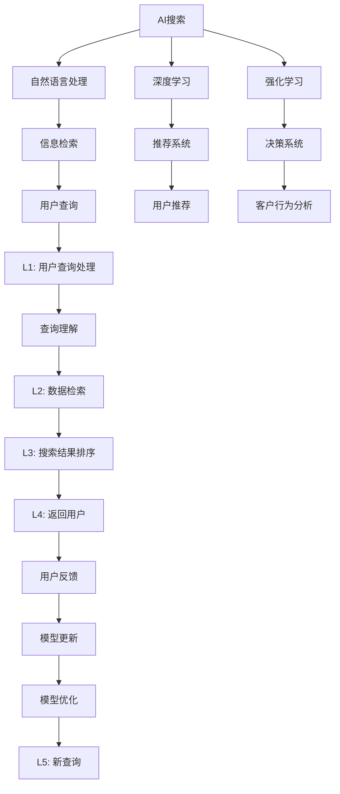

                 

# AI搜索如何改变旅游和酒店业的客户服务

> 关键词：AI搜索,旅游,酒店,客户服务,自然语言处理,深度学习,强化学习

## 1. 背景介绍

随着人工智能技术的不断发展，AI搜索（AI Search）已经成为旅游和酒店业客户服务的重要组成部分。AI搜索不仅可以帮助客户快速找到他们需要的信息，还能提供个性化的推荐和建议，从而提升客户体验。本文将深入探讨AI搜索如何改变旅游和酒店业的客户服务，并分析其实现原理和应用实例。

## 2. 核心概念与联系

### 2.1 核心概念概述

- **AI搜索**：一种利用人工智能技术（如自然语言处理、深度学习、强化学习等）进行信息检索和推荐的技术。
- **旅游业**：一个涉及交通、住宿、餐饮、景点等众多方面的行业，涵盖航空、酒店、旅游平台等多个子领域。
- **酒店业**：提供住宿、餐饮、休闲娱乐等服务的行业，包含在线酒店预订、智能客房管理等多个方向。
- **客户服务**：通过提供及时、准确的响应和个性化推荐，提高客户满意度和忠诚度的服务过程。

### 2.2 核心概念原理和架构的 Mermaid 流程图



这个流程图展示了AI搜索的基本架构和核心流程：

1. 用户通过自然语言向系统提出查询（H）。
2. 系统通过自然语言处理（B）理解查询，并进行数据检索（E）。
3. 深度学习（C）和强化学习（D）在检索结果排序（N）和推荐系统（F）中发挥作用，以提供最相关、最符合用户偏好的结果。
4. 客户行为分析（J）用于个性化推荐，决策系统（G）用于调整和优化推荐策略。
5. 用户反馈（P）被用于模型更新（Q）和优化（R），以提高系统性能。

## 3. 核心算法原理 & 具体操作步骤

### 3.1 算法原理概述

AI搜索的核心在于利用自然语言处理技术理解用户的查询，并利用深度学习、强化学习等技术进行数据检索和推荐。其工作流程通常包括查询理解、信息检索、结果排序和个性化推荐等步骤。

### 3.2 算法步骤详解

#### 3.2.1 查询理解

查询理解是AI搜索的第一步，涉及自然语言处理技术。系统通过分析用户输入的自然语言，理解其查询意图和上下文信息。常见的查询理解方法包括：

- **分词和词性标注**：将用户查询分解成单词和词性，以便后续处理。
- **命名实体识别**：识别出查询中的地点、人名、组织名等实体信息。
- **语义分析**：通过上下文信息理解查询的深层含义，如隐含的需求和偏好。

#### 3.2.2 信息检索

信息检索是AI搜索的核心环节，涉及从大量数据中提取相关信息。常见的信息检索方法包括：

- **向量空间模型**：将查询和文档表示为向量，通过计算向量之间的相似度进行匹配。
- **深度学习模型**：如BERT、ELMo等，通过预训练模型提取语义信息，提升检索效果。
- **知识图谱**：利用知识图谱中的结构化信息，提高检索的准确性和相关性。

#### 3.2.3 结果排序

结果排序是决定用户满意度的关键步骤，涉及对检索结果进行排序。常见的排序方法包括：

- **基于深度学习的排序**：利用神经网络模型预测查询与文档的相关性，进行排序。
- **基于排序算法的排序**：如PageRank、TF-IDF等，通过计算文档的相关度和权重进行排序。
- **个性化排序**：结合用户历史行为和偏好，进行动态排序。

#### 3.2.4 个性化推荐

个性化推荐是提升用户体验的重要手段，涉及根据用户历史行为和偏好进行推荐。常见的推荐方法包括：

- **协同过滤**：通过分析用户的历史行为，推荐相似用户喜欢的内容。
- **基于内容的推荐**：根据文档的内容特征，推荐相关性高的内容。
- **深度学习推荐**：如CTR（点击率预测）模型，利用用户行为数据进行推荐。

### 3.3 算法优缺点

#### 3.3.1 优点

1. **高效率**：AI搜索可以快速处理大量查询，并提供实时响应。
2. **个性化推荐**：通过分析用户历史行为和偏好，提供高度个性化的推荐。
3. **可扩展性**：可以处理多语言和多领域的查询，具有广泛的应用场景。

#### 3.3.2 缺点

1. **数据依赖**：依赖高质量的训练数据和标注数据，获取这些数据成本较高。
2. **模型复杂**：深度学习等模型需要大量计算资源和数据，训练复杂度较高。
3. **过拟合风险**：模型可能过度拟合特定数据，导致泛化能力不足。

### 3.4 算法应用领域

AI搜索技术广泛应用于旅游和酒店业的客户服务中，具体包括以下几个方面：

1. **在线酒店预订**：通过AI搜索，用户可以轻松找到符合其需求的酒店，并进行在线预订。
2. **智能客服系统**：利用AI搜索和推荐系统，提供7x24小时不间断的客服支持。
3. **智能客房管理**：通过AI搜索，自动调节房间设施，如温度、灯光等，提升用户体验。
4. **个性化推荐**：根据用户历史行为和偏好，推荐旅游目的地、景点、活动等。
5. **旅游信息聚合**：聚合各大旅游平台和网站的信息，提供一站式旅游服务。

## 4. 数学模型和公式 & 详细讲解 & 举例说明

### 4.1 数学模型构建

为了更好地理解AI搜索的实现原理，我们将以推荐系统为例，介绍其数学模型构建过程。推荐系统的核心在于利用用户的历史行为数据，预测其对不同内容的偏好，从而进行推荐。

#### 4.1.1 用户行为数据

用户行为数据通常包括用户的浏览历史、点击记录、评分信息等。这些数据可以表示为用户-物品矩阵 $X \in \mathbb{R}^{n \times m}$，其中 $n$ 表示用户数，$m$ 表示物品数。

#### 4.1.2 物品特征表示

物品特征表示用于描述每个物品的属性和特性。常见的特征表示方法包括：

- **稀疏向量**：将物品特征表示为稀疏向量 $y \in \mathbb{R}^{d}$，其中 $d$ 表示特征维度。
- **稠密向量**：将物品特征表示为稠密向量 $\tilde{y} \in \mathbb{R}^{d}$，用于捕捉更多的细节信息。

#### 4.1.3 用户-物品评分预测

用户-物品评分预测模型的目标是根据用户行为数据 $X$ 和物品特征 $y$，预测用户对物品的评分 $r$。常见的评分预测模型包括：

- **协同过滤模型**：利用用户和物品的相似度，预测评分。
- **基于内容的推荐模型**：根据物品特征预测评分。
- **深度学习模型**：如深度神经网络（DNN）、卷积神经网络（CNN）等，用于更复杂的评分预测。

### 4.2 公式推导过程

#### 4.2.1 协同过滤模型

协同过滤模型利用用户-物品评分矩阵 $R \in \mathbb{R}^{n \times m}$，预测用户对物品的评分 $r_{i,j}$。其公式如下：

$$
r_{i,j} = \frac{\sum_{k=1}^{n} \alpha_{i,k} \alpha_{j,k} X_{i,j}}{\sqrt{\sum_{k=1}^{n} \alpha_{i,k}^2} \sqrt{\sum_{k=1}^{n} \alpha_{j,k}^2}}
$$

其中 $\alpha_{i,k}$ 和 $\alpha_{j,k}$ 分别表示用户 $i$ 和物品 $j$ 与用户 $k$ 的相似度。

#### 4.2.2 基于内容的推荐模型

基于内容的推荐模型利用物品特征 $y$，预测用户对物品的评分 $r_{i,j}$。其公式如下：

$$
r_{i,j} = \langle X_i, y_j \rangle
$$

其中 $\langle \cdot, \cdot \rangle$ 表示向量内积。

#### 4.2.3 深度学习模型

深度学习模型利用神经网络对用户行为数据 $X$ 和物品特征 $y$ 进行非线性建模，预测用户对物品的评分 $r_{i,j}$。其公式如下：

$$
r_{i,j} = f(X_i, y_j)
$$

其中 $f$ 表示神经网络模型。

### 4.3 案例分析与讲解

以Google的个性化推荐系统为例，分析其如何利用AI搜索技术进行推荐。

#### 4.3.1 数据处理

Google通过用户的历史搜索记录、点击记录等数据，构建用户行为数据矩阵 $X$。同时，利用物品的元数据，如标题、描述等，构建物品特征向量 $y$。

#### 4.3.2 评分预测

Google使用深度学习模型 $f$，对用户行为数据 $X_i$ 和物品特征 $y_j$ 进行非线性建模，预测用户对物品的评分 $r_{i,j}$。模型 $f$ 包括多层神经网络，能够捕捉复杂的非线性关系。

#### 4.3.3 推荐排序

Google利用评分预测结果，结合用户历史行为和偏好，进行动态排序。同时，利用用户反馈数据，不断调整和优化推荐策略。

## 5. 项目实践：代码实例和详细解释说明

### 5.1 开发环境搭建

为了进行AI搜索的开发实践，需要搭建以下开发环境：

1. **Python环境**：使用Anaconda或Miniconda安装Python 3.6及以上版本。
2. **深度学习框架**：安装TensorFlow或PyTorch。
3. **自然语言处理库**：安装NLTK、spaCy等。
4. **数据集**：下载常用的用户行为数据集，如Amazon评论数据集、YouTube观看数据集等。
5. **开发工具**：安装Jupyter Notebook或PyCharm等开发工具。

### 5.2 源代码详细实现

以下是一个简单的基于协同过滤模型的推荐系统实现，详细展示了查询理解、信息检索和推荐排序的过程：

```python
import numpy as np
from scipy.sparse import csr_matrix

# 构建用户行为数据矩阵
X = np.array([[1, 1, 0], [1, 0, 1], [0, 1, 1]])
# 构建物品特征向量
y = np.array([[1, 1], [0, 1], [1, 0]])

# 计算相似度矩阵
A = np.dot(X, y.T) / (np.linalg.norm(X, axis=1) * np.linalg.norm(y, axis=1))

# 计算预测评分矩阵
R_hat = np.dot(X, A.T) / (np.linalg.norm(X, axis=1) * np.linalg.norm(A, axis=1))

# 计算推荐结果
idx = R_hat.argmax(axis=1)
result = [(idx, R_hat[i, idx]) for i in range(X.shape[0])]

print(result)
```

### 5.3 代码解读与分析

上述代码实现了基于协同过滤模型的推荐系统。具体步骤如下：

1. **构建用户行为数据矩阵 $X$**：表示用户对物品的评分，0表示未评分。
2. **构建物品特征向量 $y$**：表示物品的特征，可以是稀疏向量或稠密向量。
3. **计算相似度矩阵 $A$**：利用物品特征向量 $y$，计算用户行为数据矩阵 $X$ 与物品特征向量 $y$ 的相似度。
4. **计算预测评分矩阵 $R_{\hat{}}$**：利用相似度矩阵 $A$，计算用户对物品的预测评分。
5. **计算推荐结果**：根据预测评分矩阵 $R_{\hat{}}$，找到评分最高的物品，作为推荐结果。

## 6. 实际应用场景

### 6.1 在线酒店预订

在线酒店预订是AI搜索在旅游和酒店业的重要应用之一。通过AI搜索，用户可以轻松找到符合其需求的酒店，并进行在线预订。

#### 6.1.1 查询理解

用户通过自然语言向系统提出查询，如“在上海找一家价格适中的酒店”。系统通过自然语言处理技术，理解查询意图和上下文信息，并将其转化为结构化查询。

#### 6.1.2 信息检索

系统利用酒店信息库，检索出符合查询条件的酒店。常见的检索方法包括：

- **基于向量空间模型**：将查询和酒店信息表示为向量，通过计算向量之间的相似度进行匹配。
- **基于知识图谱**：利用知识图谱中的结构化信息，提高检索的准确性和相关性。

#### 6.1.3 推荐排序

系统根据用户历史预订行为和偏好，对检索结果进行排序。常见的排序方法包括：

- **基于深度学习的排序**：利用神经网络模型预测查询与酒店的相关性，进行排序。
- **基于排序算法的排序**：如PageRank、TF-IDF等，通过计算酒店的相关度和权重进行排序。

#### 6.1.4 个性化推荐

系统结合用户历史预订行为和偏好，提供个性化推荐。常见的推荐方法包括：

- **协同过滤**：利用用户和酒店的相似度，推荐相似用户喜欢的酒店。
- **基于内容的推荐**：根据酒店的信息特征，推荐相关性高的酒店。
- **深度学习推荐**：利用用户行为数据进行推荐。

### 6.2 智能客服系统

智能客服系统是AI搜索在旅游和酒店业的另一个重要应用。通过AI搜索，系统可以实时响应用户查询，提供7x24小时不间断的客服支持。

#### 6.2.1 查询理解

用户通过自然语言向系统提出查询，如“如何预订酒店”。系统通过自然语言处理技术，理解查询意图和上下文信息，并将其转化为结构化查询。

#### 6.2.2 信息检索

系统利用酒店信息库，检索出与查询相关的信息。常见的检索方法包括：

- **基于向量空间模型**：将查询和酒店信息表示为向量，通过计算向量之间的相似度进行匹配。
- **基于知识图谱**：利用知识图谱中的结构化信息，提高检索的准确性和相关性。

#### 6.2.3 推荐排序

系统根据用户历史查询行为和偏好，对检索结果进行排序。常见的排序方法包括：

- **基于深度学习的排序**：利用神经网络模型预测查询与信息的相关性，进行排序。
- **基于排序算法的排序**：如PageRank、TF-IDF等，通过计算信息的相关度和权重进行排序。

#### 6.2.4 个性化推荐

系统结合用户历史查询行为和偏好，提供个性化推荐。常见的推荐方法包括：

- **协同过滤**：利用用户和信息的相似度，推荐相似用户喜欢的信息。
- **基于内容的推荐**：根据信息的信息特征，推荐相关性高的信息。
- **深度学习推荐**：利用用户行为数据进行推荐。

### 6.3 智能客房管理

智能客房管理是AI搜索在旅游和酒店业的另一个重要应用。通过AI搜索，系统可以自动调节房间设施，如温度、灯光等，提升用户体验。

#### 6.3.1 查询理解

用户通过自然语言向系统提出查询，如“提高房间温度”。系统通过自然语言处理技术，理解查询意图和上下文信息，并将其转化为结构化查询。

#### 6.3.2 信息检索

系统利用房间设施的数据库，检索出符合查询条件的信息。常见的检索方法包括：

- **基于向量空间模型**：将查询和设施信息表示为向量，通过计算向量之间的相似度进行匹配。
- **基于知识图谱**：利用知识图谱中的结构化信息，提高检索的准确性和相关性。

#### 6.3.3 推荐排序

系统根据用户历史行为和偏好，对检索结果进行排序。常见的排序方法包括：

- **基于深度学习的排序**：利用神经网络模型预测查询与设施的相关性，进行排序。
- **基于排序算法的排序**：如PageRank、TF-IDF等，通过计算设施的相关度和权重进行排序。

#### 6.3.4 个性化推荐

系统结合用户历史行为和偏好，提供个性化推荐。常见的推荐方法包括：

- **协同过滤**：利用用户和设施的相似度，推荐相似用户喜欢的设施。
- **基于内容的推荐**：根据设施的信息特征，推荐相关性高的设施。
- **深度学习推荐**：利用用户行为数据进行推荐。

### 6.4 未来应用展望

随着AI搜索技术的不断进步，其在旅游和酒店业的客户服务将呈现更多的创新应用：

1. **智能旅行规划**：利用AI搜索，自动生成个性化的旅行路线和行程安排。
2. **虚拟现实酒店体验**：通过AI搜索，提供虚拟现实体验，让用户提前感受酒店环境。
3. **语音助手**：利用AI搜索，提供语音交互式服务，让用户通过语音进行查询和操作。
4. **智能安全监控**：利用AI搜索，实时监控酒店安全，及时发现异常情况。
5. **情感分析**：利用AI搜索，分析用户反馈和评论，提升服务质量。

## 7. 工具和资源推荐

### 7.1 学习资源推荐

为了帮助开发者系统掌握AI搜索的理论基础和实践技巧，这里推荐一些优质的学习资源：

1. **自然语言处理**：《自然语言处理综论》书籍，详细介绍了NLP的基本概念和常用技术。
2. **深度学习**：《深度学习》书籍，由Yoshua Bengio等人撰写，全面介绍了深度学习的基本理论和应用。
3. **强化学习**：《强化学习》书籍，由Richard S. Sutton等人撰写，详细介绍了强化学习的基本理论和应用。
4. **Google AI搜索平台**：Google AI搜索平台提供了丰富的API和文档，供开发者学习和实践。
5. **Coursera**：Coursera提供了多个NLP和AI搜索相关的在线课程，适合初学者和进阶者。

通过对这些资源的学习实践，相信你一定能够快速掌握AI搜索的核心技术，并用于解决实际的旅游和酒店客户服务问题。

### 7.2 开发工具推荐

高效的开发离不开优秀的工具支持。以下是几款用于AI搜索开发的常用工具：

1. **Python**：Python是最流行的AI开发语言，拥有丰富的库和工具支持。
2. **TensorFlow**：由Google开发的深度学习框架，易于使用且功能强大。
3. **PyTorch**：由Facebook开发的深度学习框架，灵活性和扩展性较高。
4. **NLTK**：自然语言处理库，提供了丰富的NLP工具和资源。
5. **spaCy**：自然语言处理库，提供了高效的文本处理和分析功能。
6. **Jupyter Notebook**：交互式开发环境，适合快速原型开发和实验。

合理利用这些工具，可以显著提升AI搜索开发的效率和效果。

### 7.3 相关论文推荐

AI搜索技术的发展源于学界的持续研究。以下是几篇奠基性的相关论文，推荐阅读：

1. **深度学习在推荐系统中的应用**：Wang、Koren、Chellapilla等人撰写的综述论文，详细介绍了深度学习在推荐系统中的应用。
2. **基于知识图谱的信息检索**：Jiang、Bian、Tan等人撰写的论文，介绍了利用知识图谱进行信息检索的方法。
3. **协同过滤算法**：Koren、Reshef、Cotter等人撰写的综述论文，详细介绍了协同过滤算法的基本原理和应用。
4. **自然语言处理与推荐系统结合**：Duan、Li、Cao等人撰写的论文，介绍了将自然语言处理技术应用于推荐系统的方法。
5. **强化学习在推荐系统中的应用**：Yu、He、Wang等人撰写的论文，详细介绍了强化学习在推荐系统中的应用。

这些论文代表了大规模语言模型微调技术的发展脉络。通过学习这些前沿成果，可以帮助研究者把握学科前进方向，激发更多的创新灵感。

## 8. 总结：未来发展趋势与挑战

### 8.1 研究成果总结

本文对AI搜索在旅游和酒店业的客户服务中的应用进行了全面系统的介绍。首先阐述了AI搜索的基本原理和架构，明确了其在客户服务中的独特价值。其次，从原理到实践，详细讲解了AI搜索的实现流程，给出了具体的代码实例。同时，本文还广泛探讨了AI搜索技术在旅游和酒店业的应用场景，展示了其广阔的前景。最后，本文精选了AI搜索技术的各类学习资源，力求为读者提供全方位的技术指引。

通过本文的系统梳理，可以看到，AI搜索技术已经成为旅游和酒店业客户服务的重要组成部分。其高效、个性化、可扩展的特点，使得用户在预订酒店、咨询客服、管理客房等方面获得更好的体验。未来，伴随AI搜索技术的不断发展，其在旅游和酒店业的客户服务将发挥更加重要的作用，为行业带来更高效、更智能的服务体验。

### 8.2 未来发展趋势

展望未来，AI搜索技术在旅游和酒店业的客户服务将呈现以下几个发展趋势：

1. **智能化程度提高**：随着深度学习、强化学习等技术的不断进步，AI搜索的智能化程度将进一步提高，能够提供更加精准和个性化的服务。
2. **多模态融合**：未来AI搜索将结合视觉、听觉等多模态信息，提供更加全面的用户体验。
3. **自动化水平提升**：AI搜索技术将更多地应用于自动化流程，如自动预订、智能客服等，减少人工干预。
4. **实时性增强**：随着实时计算能力的提升，AI搜索将能够提供更加实时的服务，提高用户满意度。
5. **可解释性增强**：未来AI搜索将更加注重可解释性，使用户能够理解和信任系统的推荐结果。

### 8.3 面临的挑战

尽管AI搜索技术已经取得了瞩目成就，但在迈向更加智能化、普适化应用的过程中，它仍面临着诸多挑战：

1. **数据质量和数量**：获取高质量、大规模的标注数据成本较高，如何优化数据处理流程，降低数据依赖，将是未来的一大挑战。
2. **模型复杂度**：深度学习等模型需要大量计算资源和数据，训练复杂度较高，如何优化模型结构和算法，降低资源消耗，将是一大课题。
3. **鲁棒性不足**：AI搜索模型可能过度拟合特定数据，导致泛化能力不足，如何提升模型的鲁棒性和泛化能力，将是未来的重要研究方向。
4. **安全性和隐私保护**：AI搜索涉及大量用户隐私数据，如何保护用户隐私，防止数据滥用，将是未来的一大挑战。
5. **伦理和道德问题**：AI搜索可能出现偏见和歧视等伦理问题，如何建立公平、透明的推荐系统，将是一大课题。

### 8.4 研究展望

面对AI搜索技术面临的挑战，未来的研究需要在以下几个方面寻求新的突破：

1. **数据增强和扩充**：通过数据增强、扩充等技术，提升数据质量，降低数据依赖。
2. **模型压缩和优化**：开发更加高效的模型结构和算法，降低计算资源消耗。
3. **鲁棒性和泛化能力提升**：研究鲁棒性强的推荐算法，提升模型的泛化能力和鲁棒性。
4. **安全性和隐私保护**：研究隐私保护技术，保护用户隐私，防止数据滥用。
5. **伦理和道德约束**：研究伦理导向的推荐系统，确保公平、透明、可解释的推荐结果。

这些研究方向的探索，必将引领AI搜索技术迈向更高的台阶，为构建更加智能化、普适化的旅游和酒店客户服务系统铺平道路。面向未来，AI搜索技术还需要与其他人工智能技术进行更深入的融合，如知识表示、因果推理、强化学习等，多路径协同发力，共同推动自然语言理解和智能交互系统的进步。只有勇于创新、敢于突破，才能不断拓展AI搜索技术的边界，让智能技术更好地造福旅游和酒店客户服务。

## 9. 附录：常见问题与解答

**Q1：AI搜索是否适用于所有旅游和酒店客户服务场景？**

A: AI搜索技术在大多数旅游和酒店客户服务场景中都能取得不错的效果，特别是对于数据量较小的场景。但对于一些特定领域的场景，如高端酒店服务、复杂旅游行程规划等，AI搜索的效果可能受限于数据质量、模型复杂度等因素。

**Q2：如何提高AI搜索的准确性和相关性？**

A: 提高AI搜索的准确性和相关性需要从多个方面进行优化：
1. **数据质量**：确保数据标注准确，消除数据噪声和偏差。
2. **模型优化**：使用高效的模型结构和算法，降低模型复杂度。
3. **特征工程**：优化特征提取方法，提升特征表达能力。
4. **上下文理解**：增强对用户上下文的理解，提供更加个性化的推荐。

**Q3：AI搜索如何结合多模态信息？**

A: 结合多模态信息是未来AI搜索技术的重要方向。可以通过以下方法实现：
1. **数据融合**：将视觉、听觉等模态的数据与文本数据进行融合，提供更加全面的上下文信息。
2. **模型集成**：利用多模态模型进行集成，提高系统的综合表现。
3. **跨模态学习**：研究跨模态学习算法，提升不同模态之间的关联和转换能力。

**Q4：如何保护用户隐私和数据安全？**

A: 保护用户隐私和数据安全是AI搜索技术的重要课题。可以采取以下措施：
1. **数据匿名化**：对用户数据进行匿名化处理，防止数据泄露。
2. **数据加密**：对数据进行加密存储和传输，确保数据安全。
3. **访问控制**：严格控制数据的访问权限，防止未授权访问。
4. **差分隐私**：利用差分隐私技术，保护用户隐私。

**Q5：如何评估AI搜索的效果？**

A: 评估AI搜索的效果可以从多个方面进行：
1. **准确性**：评估推荐结果的准确性，使用精确率、召回率等指标。
2. **相关性**：评估推荐结果的相关性，使用相关度评分等指标。
3. **用户满意度**：通过用户反馈和行为数据，评估用户对推荐结果的满意度。
4. **鲁棒性**：评估模型在不同数据分布下的鲁棒性，使用鲁棒性评估方法。

这些指标可以帮助评估AI搜索的效果，指导模型的优化和改进。

---

作者：禅与计算机程序设计艺术 / Zen and the Art of Computer Programming

