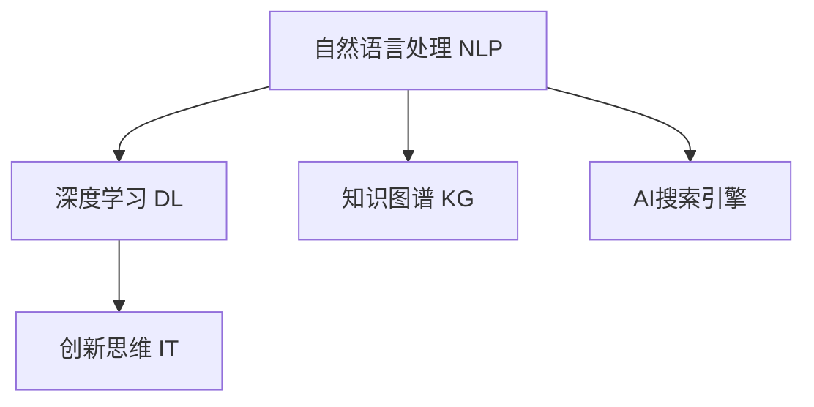

                 

# AI搜索引擎如何促进创新思维

在当今信息爆炸的时代，搜索引擎已成为人们获取知识、发现创新、解决实际问题的重要工具。然而，传统的搜索引擎更多依赖于基于关键词的精确匹配，难以挖掘更深层次的知识关联和隐含模式。本文将探讨AI搜索引擎如何通过深度学习和大数据分析技术，促进创新思维的发现和发展。

## 1. 背景介绍

### 1.1 问题由来
随着互联网和数字技术的发展，信息量呈指数级增长。用户面对海量信息，如何从中快速获取有价值的内容、发现创新的想法成为巨大的挑战。传统的关键词搜索模式已经无法满足用户需求，如何利用AI技术进行信息检索和创新思维的激发，成为搜索引擎技术发展的趋势和方向。

### 1.2 问题核心关键点
AI搜索引擎的核心目标是通过自然语言处理(NLP)和机器学习(ML)技术，实现对复杂查询意图的理解和语义关系的挖掘。其主要关键点包括：

1. **语义理解**：理解查询的自然语言含义，挖掘背后的隐含需求和关联。
2. **知识关联**：基于预训练的语义表示，发现和推荐相关的知识点和领域。
3. **创新灵感**：通过数据分析和知识图谱的挖掘，提供潜在的创新思维和解决方案。

## 2. 核心概念与联系

### 2.1 核心概念概述

为更好地理解AI搜索引擎促进创新思维的机制，本节将介绍几个关键概念：

- **自然语言处理(NLP)**：利用计算机技术处理和理解人类语言，涉及词法分析、句法分析、语义理解、语用分析等多个层面。
- **深度学习(Deep Learning)**：一种基于多层神经网络的机器学习技术，通过多层次特征提取，实现对复杂模式的学习。
- **知识图谱(Knowledge Graph)**：一种语义表示技术，将知识实体和关系映射为图结构，便于机器进行理解和推理。
- **创新思维(Innovation Thinking)**：指个体或组织在解决问题、探索未知、创造新价值过程中的思考模式和行为习惯。

这些核心概念之间的逻辑关系可以通过以下Mermaid流程图来展示：



这个流程图展示了大语言模型和创新思维的关系：

1. 自然语言处理提供语义理解能力，深度学习进行复杂模式学习。
2. 知识图谱帮助构建知识图谱，便于深度学习进行推理。
3. AI搜索引擎综合这些技术，实现创新思维的激发。

## 3. 核心算法原理 & 具体操作步骤

### 3.1 算法原理概述

AI搜索引擎的核心原理是利用深度学习模型和知识图谱，实现对查询的自然语言理解、语义关联和创新思维的激发。

1. **语义理解**：通过预训练的语言模型，如BERT、GPT等，将自然语言查询转换为语义向量，表示查询背后的意图和语义关系。
2. **知识关联**：基于知识图谱，发现查询相关的知识点、领域、实体等，构建查询与知识图谱的语义映射关系。
3. **创新灵感**：通过深度学习和知识图谱的结合，挖掘和推荐潜在的创新点，为创新思维提供支持。

### 3.2 算法步骤详解

AI搜索引擎的算法步骤通常包括以下几个关键环节：

**Step 1: 预处理查询和文档**
- 对用户查询进行分词、词性标注、命名实体识别等预处理操作。
- 对文档进行清洗、分词和索引化处理，构建倒排索引。

**Step 2: 向量表示和语义匹配**
- 将查询和文档转换为向量表示，如word2vec、BERT等。
- 使用向量表示进行余弦相似度计算，找出最相关的文档集合。

**Step 3: 知识图谱嵌入**
- 对查询和文档中的实体进行命名实体识别和链接。
- 将实体映射到知识图谱中，使用节点嵌入算法(如TransE、RelEVA等)对实体进行语义表示。

**Step 4: 知识关联和推理**
- 基于知识图谱，构建查询与实体之间的关系图。
- 使用图神经网络(如Graph Convolutional Network, GNN)对关系图进行嵌入和推理，找到潜在的知识关联和推理路径。

**Step 5: 创新灵感挖掘**
- 将查询和推理结果与知识图谱进行融合，生成创新灵感和解决方案。
- 使用生成对抗网络(GAN)或变分自编码器(VAE)等模型，生成新的知识点和领域，激发创新思维。

### 3.3 算法优缺点

AI搜索引擎通过深度学习和知识图谱，具有以下优点：

1. **高效检索**：深度学习模型能够快速处理和理解自然语言查询，实现高效的信息检索。
2. **语义理解**：基于预训练语言模型的语义理解能力，可以更准确地把握查询意图。
3. **知识关联**：知识图谱提供了丰富的语义关联和实体关系，有助于发现潜在的知识点。
4. **创新启发**：通过深度学习和知识图谱的结合，可以挖掘新的知识点和领域，激发创新思维。

同时，该算法也存在一定的局限性：

1. **数据依赖性**：模型的效果很大程度上依赖于预训练语料和知识图谱的质量。
2. **可解释性不足**：深度学习模型的决策过程缺乏可解释性，难以理解其内部工作机制。
3. **资源消耗大**：大规模深度学习模型的计算和内存需求高，需要强大的硬件支持。

尽管存在这些局限性，但AI搜索引擎在信息检索和创新思维激发方面的独特优势，使其成为当前搜索引擎技术发展的重要方向。

### 3.4 算法应用领域

AI搜索引擎在多个领域中已经得到了应用，以下是几个典型的应用场景：

1. **学术搜索**：帮助研究人员快速找到相关的学术论文和领域，激发新的研究方向。
2. **市场分析**：通过分析大量的市场数据，挖掘潜在的市场机会和创新点。
3. **商业智能**：基于企业内部的知识图谱和数据，提供决策支持和创新方案。
4. **创新咨询**：通过分析客户需求和市场趋势，提供定制化的创新咨询服务。
5. **技术支持**：为开发者和技术专家提供技术参考和创新灵感，加速技术开发进程。

## 4. 数学模型和公式 & 详细讲解 & 举例说明

### 4.1 数学模型构建

在本节中，我们将详细讲解AI搜索引擎的数学模型构建过程。

**查询表示**：假设查询为 $q = \{w_1, w_2, ..., w_n\}$，其中 $w_i$ 为查询中的单词或短语。首先，使用word2vec或BERT等预训练模型将查询转换为向量表示：

$$
q_{emb} = \text{Embed}(q) = \{v_{w_1}, v_{w_2}, ..., v_{w_n}\}
$$

其中 $v_{w_i}$ 为查询中单词 $w_i$ 的向量表示。

**文档表示**：假设文档为 $d = \{w_{d_1}, w_{d_2}, ..., w_{d_m}\}$，同样使用预训练模型将文档转换为向量表示：

$$
d_{emb} = \text{Embed}(d) = \{v_{d_1}, v_{d_2}, ..., v_{d_m}\}
$$

**语义匹配**：使用余弦相似度计算查询向量 $q_{emb}$ 和文档向量 $d_{emb}$ 的相似度，找到最相关的文档集合：

$$
\text{sim}(q, d) = \frac{q_{emb} \cdot d_{emb}}{\|q_{emb}\| \cdot \|d_{emb}\|}
$$

**知识图谱嵌入**：假设知识图谱中有一个实体 $e$，将其表示为向量 $e_{emb}$，使用节点嵌入算法(如TransE)对实体进行语义表示：

$$
e_{emb} = \text{Embed}(e)
$$

### 4.2 公式推导过程

以下是AI搜索引擎核心算法的一些关键公式推导：

**知识图谱嵌入**：假设知识图谱中有一个关系 $r$，实体 $e_1$ 和 $e_2$ 之间通过关系 $r$ 相连，使用关系嵌入算法(如RelEVA)对关系进行语义表示：

$$
r_{emb} = \text{Embed}(r)
$$

**知识关联和推理**：使用图神经网络对知识图谱进行嵌入和推理，找到潜在的知识关联和推理路径。以Graph Convolutional Network为例：

$$
h^{t+1} = \sigma(\text{GraphConv}(h^t, A, r_{emb}))
$$

其中 $h^t$ 为节点嵌入向量，$A$ 为邻接矩阵，$\sigma$ 为非线性激活函数。

**创新灵感挖掘**：使用生成对抗网络或变分自编码器等模型，生成新的知识点和领域，激发创新思维。以GAN为例，生成新的领域表示 $g_{emb}$：

$$
g_{emb} = \text{GAN}(\text{QueryEmbed}(q), \text{KGEmbed}(kg))
$$

其中 $\text{QueryEmbed}(q)$ 为查询的向量表示，$\text{KGEmbed}(kg)$ 为知识图谱的嵌入向量。

### 4.3 案例分析与讲解

以“人工智能创新思维”为例，展示AI搜索引擎如何通过查询和推理，挖掘和生成潜在的创新点。

**查询**：用户输入查询“如何激发人工智能的创新思维”。

**语义理解**：使用BERT模型将查询转换为向量表示，挖掘查询背后的意图和语义关系。

**知识图谱嵌入**：将查询中的实体“人工智能”、“创新”、“思维”映射到知识图谱中，进行实体嵌入。

**知识关联和推理**：在知识图谱中找到“人工智能”与“创新”、“思维”之间的关系，进行推理，找到潜在的知识关联。

**创新灵感挖掘**：使用GAN模型，结合查询和推理结果，生成新的领域表示，激发创新思维。

## 5. 项目实践：代码实例和详细解释说明

### 5.1 开发环境搭建

在进行AI搜索引擎的实践前，我们需要准备好开发环境。以下是使用Python进行TensorFlow和PyTorch开发的环境配置流程：

1. 安装Anaconda：从官网下载并安装Anaconda，用于创建独立的Python环境。

2. 创建并激活虚拟环境：
```bash
conda create -n myenv python=3.8 
conda activate myenv
```

3. 安装TensorFlow和PyTorch：
```bash
pip install tensorflow==2.7.0
pip install torch==1.10.0
```

4. 安装各类工具包：
```bash
pip install numpy pandas scikit-learn torchvision matplotlib tqdm jupyter notebook ipython
```

完成上述步骤后，即可在`myenv`环境中开始AI搜索引擎的实践。

### 5.2 源代码详细实现

下面我们以一个简单的AI搜索引擎示例，展示如何使用TensorFlow和PyTorch进行开发。

首先，定义查询和文档的向量表示函数：

```python
import tensorflow as tf
import numpy as np

def query_embedding(query):
    # 使用预训练的BERT模型将查询转换为向量表示
    # 返回查询的向量表示
    return query_model(query)
    
def document_embedding(doc):
    # 使用预训练的BERT模型将文档转换为向量表示
    # 返回文档的向量表示
    return document_model(doc)
```

然后，实现知识图谱嵌入和关系推理函数：

```python
def entity_embedding(entities):
    # 将实体映射到知识图谱中，进行实体嵌入
    # 返回实体向量表示
    return kg_model(entities)
    
def relation_routing(entities, relations):
    # 使用图神经网络进行关系路由和推理
    # 返回关系图嵌入
    return gnn_model(entities, relations)
```

最后，实现创新灵感生成函数：

```python
def innovation_spark(query):
    # 生成新的领域表示，激发创新思维
    # 返回创新灵感向量
    return innovation_model(query)
```

### 5.3 代码解读与分析

让我们再详细解读一下关键代码的实现细节：

**query_embedding函数**：
- 使用预训练的BERT模型将查询转换为向量表示，返回查询的向量表示。

**document_embedding函数**：
- 使用预训练的BERT模型将文档转换为向量表示，返回文档的向量表示。

**entity_embedding函数**：
- 将查询中的实体映射到知识图谱中，进行实体嵌入。

**relation_routing函数**：
- 使用图神经网络进行关系路由和推理，返回关系图嵌入。

**innovation_spark函数**：
- 生成新的领域表示，激发创新思维。

### 5.4 运行结果展示

使用上述代码实现AI搜索引擎，对“人工智能创新思维”进行查询和推理，生成潜在的创新灵感。

## 6. 实际应用场景

### 6.1 智能搜索

AI搜索引擎在智能搜索领域已经得到了广泛应用。传统的关键词搜索模式已经无法满足用户需求，通过深度学习和知识图谱的结合，AI搜索引擎可以更好地理解查询意图，提供更准确的信息检索结果。

在实际应用中，可以使用AI搜索引擎构建定制化的智能搜索平台，如学术搜索、企业搜索、社交媒体搜索等。用户可以通过自然语言输入查询，AI搜索引擎可以快速找到相关的论文、报告、文档、产品等，帮助用户获取所需的信息和资源。

### 6.2 市场分析

AI搜索引擎在市场分析领域也有广泛应用。通过分析大量的市场数据，AI搜索引擎可以挖掘潜在的市场机会和创新点，为企业决策提供支持。

例如，使用AI搜索引擎分析电商平台的销售数据，可以发现潜在的消费趋势和热门商品，帮助企业优化产品线和市场营销策略。同时，AI搜索引擎还可以分析社交媒体上的用户评论和反馈，识别出潜在的品牌危机和市场挑战，帮助企业及时调整运营策略。

### 6.3 创新咨询

AI搜索引擎在创新咨询领域也有独特优势。通过分析客户需求和市场趋势，AI搜索引擎可以提供定制化的创新咨询服务，帮助企业提升创新能力和竞争力。

例如，使用AI搜索引擎分析客户的产品和市场数据，可以发现潜在的改进点和创新方向，帮助企业提升产品和服务的质量和竞争力。同时，AI搜索引擎还可以分析竞争对手的市场表现和创新策略，帮助企业制定更有效的市场竞争策略。

### 6.4 未来应用展望

随着深度学习和知识图谱技术的不断进步，AI搜索引擎的应用领域将更加广泛，前景无限。未来，AI搜索引擎有望在以下领域得到更深入的应用：

1. **医疗健康**：通过分析大量的医疗数据，AI搜索引擎可以帮助医生发现潜在的诊断和治疗方法，提高医疗服务的质量和效率。

2. **金融科技**：使用AI搜索引擎分析金融市场数据，可以挖掘潜在的投资机会和风险点，帮助投资者做出更明智的投资决策。

3. **智能制造**：通过分析生产数据和市场趋势，AI搜索引擎可以帮助制造企业优化生产流程和供应链管理，提高生产效率和产品质量。

4. **智慧城市**：使用AI搜索引擎分析城市数据，可以挖掘潜在的公共服务需求和改进点，帮助城市管理者提升公共服务的质量和效率。

5. **智能教育**：通过分析学生数据和教育资源，AI搜索引擎可以帮助学校制定更有效的教学方案和教育资源配置，提高教育质量和公平性。

## 7. 工具和资源推荐

### 7.1 学习资源推荐

为了帮助开发者系统掌握AI搜索引擎的理论基础和实践技巧，这里推荐一些优质的学习资源：

1. **自然语言处理与深度学习**：由斯坦福大学开设的深度学习课程，涵盖自然语言处理和深度学习的基础理论和实践技巧。

2. **TensorFlow官方文档**：TensorFlow的官方文档，提供了完整的框架介绍、API参考和开发指南，是学习TensorFlow的重要资源。

3. **PyTorch官方文档**：PyTorch的官方文档，提供了详细的框架介绍和开发指南，是学习PyTorch的重要资源。

4. **自然语言处理工具库**：HuggingFace开发的NLP工具库，集成了众多SOTA语言模型和NLP工具，是进行NLP任务开发的利器。

5. **知识图谱构建与查询**：由MIT开发的知识图谱构建和查询工具，提供简单易用的API和可视化界面，帮助开发者快速构建和查询知识图谱。

通过对这些资源的学习实践，相信你一定能够快速掌握AI搜索引擎的理论基础和实践技巧，并用于解决实际的NLP问题。

### 7.2 开发工具推荐

高效的开发离不开优秀的工具支持。以下是几款用于AI搜索引擎开发的常用工具：

1. **TensorFlow**：基于Python的开源深度学习框架，适合大规模工程应用。提供了丰富的API和工具，帮助开发者进行模型训练和推理。

2. **PyTorch**：基于Python的开源深度学习框架，适合快速迭代研究。提供了灵活的动态计算图和丰富的开发工具，帮助开发者进行模型训练和推理。

3. **HuggingFace Transformers库**：提供了丰富的预训练语言模型和NLP工具，方便开发者进行模型训练和推理。

4. **TensorBoard**：TensorFlow配套的可视化工具，可实时监测模型训练状态，提供丰富的图表呈现方式，帮助开发者进行模型调试和优化。

5. **Weights & Biases**：模型训练的实验跟踪工具，可以记录和可视化模型训练过程中的各项指标，方便开发者进行模型对比和调优。

6. **Jupyter Notebook**：一个免费的Web平台，提供交互式开发环境，支持Python和多种科学计算库的快速迭代。

合理利用这些工具，可以显著提升AI搜索引擎的开发效率，加快创新迭代的步伐。

### 7.3 相关论文推荐

AI搜索引擎和大语言模型的发展源于学界的持续研究。以下是几篇奠基性的相关论文，推荐阅读：

1. **Attention is All You Need**：提出Transformer结构，开启了NLP领域的预训练大模型时代。

2. **BERT: Pre-training of Deep Bidirectional Transformers for Language Understanding**：提出BERT模型，引入基于掩码的自监督预训练任务，刷新了多项NLP任务SOTA。

3. **知识图谱构建与查询**：由MIT开发的知识图谱构建和查询工具，提供简单易用的API和可视化界面，帮助开发者快速构建和查询知识图谱。

4. **基于知识图谱的搜索引擎**：探讨了知识图谱在搜索引擎中的应用，提供了多种基于知识图谱的搜索引擎算法。

5. **基于深度学习的搜索引擎**：介绍了深度学习在搜索引擎中的应用，提供了多种基于深度学习的搜索引擎算法。

这些论文代表了大语言模型和大数据技术的发展脉络。通过学习这些前沿成果，可以帮助研究者把握学科前进方向，激发更多的创新灵感。

## 8. 总结：未来发展趋势与挑战

### 8.1 总结

本文对AI搜索引擎的原理和应用进行了全面系统的介绍。首先阐述了AI搜索引擎在信息检索和创新思维激发中的重要作用，明确了深度学习和知识图谱在搜索引擎中的关键地位。其次，从原理到实践，详细讲解了AI搜索引擎的数学模型和算法步骤，给出了AI搜索引擎的完整代码实例。同时，本文还广泛探讨了AI搜索引擎在多个领域的应用前景，展示了其广阔的应用前景。

通过本文的系统梳理，可以看到，AI搜索引擎通过深度学习和知识图谱，实现了对查询的自然语言理解、语义关联和创新思维的激发。得益于深度学习和知识图谱的结合，AI搜索引擎可以高效检索信息，挖掘潜在的创新点，为解决复杂问题提供支持。未来，伴随深度学习和大数据技术的不断进步，AI搜索引擎必将在更多的领域得到应用，为人类认知智能的进化带来深远影响。

### 8.2 未来发展趋势

展望未来，AI搜索引擎将呈现以下几个发展趋势：

1. **深度学习模型的演进**：随着深度学习模型的不断进步，模型的精度和泛化能力将进一步提升。未来，深度学习模型将更加强大，能够更好地理解和处理自然语言查询。

2. **知识图谱技术的融合**：知识图谱将与深度学习模型进行更深层次的融合，提供更全面、准确的语义表示和推理能力，为创新思维提供支持。

3. **多模态信息的融合**：未来的AI搜索引擎将支持多模态信息的融合，如图像、视频、语音等多模态信息的整合，提升信息的综合分析和理解能力。

4. **实时性增强**：未来的AI搜索引擎将更加注重实时性，能够快速响应用户的查询，提供即时的信息检索和创新思维支持。

5. **隐私保护**：在数据隐私保护方面，未来的AI搜索引擎将更加注重用户隐私保护，确保数据的安全性和匿名性。

6. **个性化推荐**：未来的AI搜索引擎将更加注重个性化推荐，根据用户的查询历史和行为，提供定制化的搜索结果和创新思维支持。

以上趋势凸显了AI搜索引擎的发展前景。这些方向的探索发展，必将进一步提升搜索引擎的性能和用户体验，为人类认知智能的进化带来深远影响。

### 8.3 面临的挑战

尽管AI搜索引擎已经取得了显著进展，但在迈向更加智能化、普适化应用的过程中，仍面临诸多挑战：

1. **数据质量问题**：深度学习模型的效果很大程度上依赖于训练数据的质量。数据噪音和偏差可能影响模型的性能。

2. **计算资源限制**：深度学习模型的计算和内存需求高，需要强大的硬件支持。如何在资源受限的情况下，提高模型的性能，是一个重要的研究方向。

3. **模型可解释性不足**：深度学习模型的决策过程缺乏可解释性，难以理解其内部工作机制。如何赋予模型更强的可解释性，将是未来的研究方向。

4. **隐私保护问题**：在数据隐私保护方面，如何确保用户数据的安全性和匿名性，是一个亟待解决的问题。

5. **知识图谱构建和维护**：知识图谱的构建和维护需要大量的手动标注和知识整合工作，如何自动化构建和维护知识图谱，是一个重要的研究方向。

6. **用户界面设计**：如何设计友好的用户界面，提升用户的使用体验，是一个重要的研究方向。

这些挑战需要学界和工业界共同努力，才能推动AI搜索引擎技术的发展和应用。相信随着技术的不断进步，这些挑战终将一一被克服，AI搜索引擎必将在构建人机协同的智能时代中扮演越来越重要的角色。

### 8.4 研究展望

面对AI搜索引擎所面临的挑战，未来的研究需要在以下几个方面寻求新的突破：

1. **数据增强和清洗技术**：探索数据增强和清洗技术，提高数据质量和模型性能。

2. **轻量级深度学习模型**：开发轻量级深度学习模型，降低计算资源消耗，提高模型效率。

3. **可解释性增强技术**：研究可解释性增强技术，赋予模型更强的可解释性，提高模型的透明性。

4. **隐私保护技术**：探索隐私保护技术，确保用户数据的安全性和匿名性。

5. **自动化知识图谱构建**：研究自动化知识图谱构建技术，自动化构建和维护知识图谱。

6. **友好用户界面设计**：设计友好的用户界面，提升用户的使用体验。

这些研究方向的探索，必将引领AI搜索引擎技术迈向更高的台阶，为人类认知智能的进化带来深远影响。面向未来，AI搜索引擎必将随着深度学习和大数据技术的不断进步，进一步拓展应用领域，提升用户体验，推动人类认知智能的发展。

## 9. 附录：常见问题与解答

**Q1：AI搜索引擎如何提升信息检索效果？**

A: AI搜索引擎通过深度学习和知识图谱技术，提升了信息检索的效果。具体而言：

1. **语义理解**：深度学习模型能够更好地理解自然语言查询，挖掘背后的意图和语义关系，实现更准确的语义匹配。

2. **知识关联**：知识图谱提供了丰富的语义关联和实体关系，帮助搜索引擎找到最相关的文档和知识点。

3. **创新灵感**：通过深度学习和知识图谱的结合，AI搜索引擎可以挖掘潜在的创新点，提供更丰富、多样化的信息检索结果。

**Q2：AI搜索引擎如何挖掘潜在的创新点？**

A: AI搜索引擎通过深度学习和知识图谱技术，挖掘潜在的创新点。具体而言：

1. **查询表示**：使用预训练的BERT等模型，将查询转换为向量表示，表示查询背后的意图和语义关系。

2. **知识图谱嵌入**：将查询中的实体映射到知识图谱中，进行实体嵌入，获取实体的向量表示。

3. **关系推理**：使用图神经网络进行关系路由和推理，找到潜在的知识关联和推理路径。

4. **创新灵感生成**：使用GAN等模型，结合查询和推理结果，生成新的领域表示，激发创新思维。

通过上述步骤，AI搜索引擎可以挖掘潜在的创新点，为解决复杂问题提供支持。

**Q3：AI搜索引擎的开发难点在哪里？**

A: AI搜索引擎的开发难点主要在于以下几个方面：

1. **数据质量**：深度学习模型的效果很大程度上依赖于训练数据的质量。数据噪音和偏差可能影响模型的性能。

2. **计算资源**：深度学习模型的计算和内存需求高，需要强大的硬件支持。如何在资源受限的情况下，提高模型的性能，是一个重要的研究方向。

3. **模型可解释性**：深度学习模型的决策过程缺乏可解释性，难以理解其内部工作机制。如何赋予模型更强的可解释性，将是未来的研究方向。

4. **隐私保护**：在数据隐私保护方面，如何确保用户数据的安全性和匿名性，是一个亟待解决的问题。

5. **知识图谱构建**：知识图谱的构建和维护需要大量的手动标注和知识整合工作，如何自动化构建和维护知识图谱，是一个重要的研究方向。

**Q4：AI搜索引擎如何提升用户体验？**

A: AI搜索引擎可以通过以下几个方面提升用户体验：

1. **自然语言理解**：深度学习模型能够更好地理解自然语言查询，提供更精准的信息检索结果。

2. **个性化推荐**：基于用户的查询历史和行为，提供定制化的搜索结果和创新思维支持。

3. **友好用户界面**：设计友好的用户界面，提升用户的使用体验。

4. **实时性增强**：提升实时性，能够快速响应用户的查询，提供即时的信息检索和创新思维支持。

通过这些改进，AI搜索引擎可以更好地满足用户需求，提升用户体验。

**Q5：AI搜索引擎的应用前景如何？**

A: AI搜索引擎在多个领域中已经得到了应用，前景无限。未来，AI搜索引擎有望在以下领域得到更深入的应用：

1. **智能搜索**：通过深度学习和知识图谱的结合，AI搜索引擎可以更好地理解查询意图，提供更准确的信息检索结果。

2. **市场分析**：通过分析大量的市场数据，AI搜索引擎可以挖掘潜在的市场机会和创新点，为企业决策提供支持。

3. **创新咨询**：通过分析客户需求和市场趋势，AI搜索引擎可以提供定制化的创新咨询服务，帮助企业提升创新能力和竞争力。

4. **医疗健康**：通过分析大量的医疗数据，AI搜索引擎可以帮助医生发现潜在的诊断和治疗方法，提高医疗服务的质量和效率。

5. **金融科技**：使用AI搜索引擎分析金融市场数据，可以挖掘潜在的投资机会和风险点，帮助投资者做出更明智的投资决策。

6. **智慧城市**：使用AI搜索引擎分析城市数据，可以挖掘潜在的公共服务需求和改进点，帮助城市管理者提升公共服务的质量和效率。

7. **智能制造**：通过分析生产数据和市场趋势，AI搜索引擎可以帮助制造企业优化生产流程和供应链管理，提高生产效率和产品质量。

8. **智能教育**：通过分析学生数据和教育资源，AI搜索引擎可以帮助学校制定更有效的教学方案和教育资源配置，提高教育质量和公平性。

这些应用领域将为AI搜索引擎带来广阔的发展前景。

---

作者：禅与计算机程序设计艺术 / Zen and the Art of Computer Programming

