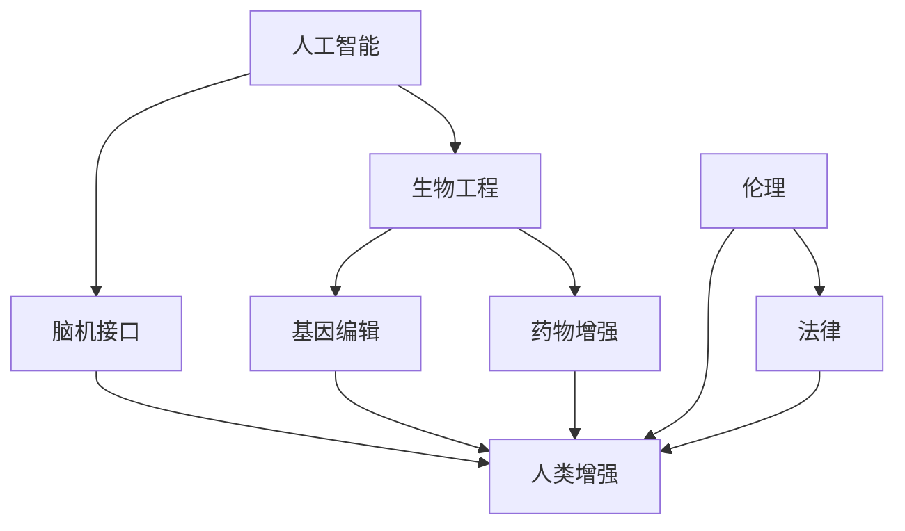

                 

# AI时代的人类增强：道德考虑与身体增强的未来发展机遇挑战趋势预测

> 关键词：AI增强, 人类增强, 生物工程, 道德伦理, 技术应用

## 1. 背景介绍

### 1.1 问题由来
随着人工智能(AI)技术的不断进步，人类增强技术已成为前沿领域的重要研究方向。其核心目标是通过技术手段提升人类的生理、心理和认知能力，推动人类社会的发展。然而，在快速发展的同时，人类增强技术也引发了诸多伦理和法律问题，成为人们普遍关注的焦点。

当前，全球范围内，生物工程、脑机接口、人工智能等技术的融合，正催生一系列新型人类增强方法。这些技术能够从多个维度提升人类性能，包括身体力量、速度、记忆力和情绪调节等。尽管这些技术带来了巨大的发展机遇，但同时也带来了前所未有的道德和法律挑战。

### 1.2 问题核心关键点
人类增强技术涉及生物医学、神经科学、伦理和法律等多个领域。其核心问题包括：

1. **生物医学风险**：增强技术如基因编辑、药物注射等可能引发基因突变、免疫反应等健康风险。
2. **认知伦理**：增强技术可能会被用于智力增强，引发不平等、歧视等社会问题。
3. **隐私和安全**：增强技术需要收集大量的生物数据，如何保障数据隐私和安全成为关键。
4. **公平与可及性**：增强技术的高昂成本可能会加剧社会不平等。
5. **道德与法律**：增强技术的应用边界和规范尚未明确，需要进一步的伦理和法律探讨。

这些问题要求我们必须在推进技术发展的同时，重视伦理和法律的约束，确保技术的良性应用。

## 2. 核心概念与联系

### 2.1 核心概念概述

为更好地理解人类增强技术，本节将介绍几个关键概念：

- **人工智能(AI)**：指通过机器学习、数据挖掘等技术，模拟人类智能行为的计算机程序。
- **生物工程(Bioengineering)**：涉及生物分子、细胞、组织和器官的人工制造、改造和应用。
- **脑机接口(Brain-Computer Interface, BCI)**：通过直接解读大脑信号，实现人与机器的直接交互。
- **人类增强(Human Enhancement)**：通过生物工程、人工智能等技术，提升人类的身体和认知能力，改善生活质量。
- **基因编辑(Gene Editing)**：通过CRISPR-Cas9等技术，直接修改生物体的基因组。
- **药物增强(Pharmacological Enhancement)**：通过口服、注射等途径，提升人体生理和认知能力。
- **伦理(Ethics)**：关于人类行为的道德规范和价值判断，对技术应用提出原则性约束。
- **法律(Law)**：用于规范和保护社会行为，为技术应用提供法律框架。

这些概念之间的逻辑关系可以通过以下Mermaid流程图来展示：



这个流程图展示了人工智能、生物工程、脑机接口、人类增强、基因编辑、药物增强、伦理和法律之间的逻辑关系：

1. 人工智能与生物工程相结合，催生脑机接口技术。
2. 脑机接口、基因编辑和药物增强等方法，被广泛应用于人类增强。
3. 伦理和法律对增强技术提出约束，确保其安全、公平和合法的应用。

## 3. 核心算法原理 & 具体操作步骤
### 3.1 算法原理概述

人类增强技术的核心原理在于通过生物工程、人工智能等技术手段，提升人类的身体和认知能力。其基本过程可以分为两个阶段：

1. **预处理阶段**：通过基因编辑、药物增强等方法，对生物体进行初步处理，使其具备增强效果。
2. **后处理阶段**：通过人工智能算法，对增强后的生物体进行智能控制和优化，实现更精准、高效的增强效果。

在实际操作中，常用的技术手段包括：

- **基因编辑**：通过CRISPR-Cas9等技术，精确修改生物体的基因组，提升其生理和认知能力。
- **药物增强**：通过口服、注射等途径，注入特定药物，改善人体机能，如提升记忆力、增强注意力等。
- **脑机接口**：通过解读大脑信号，实现人与机器的直接交互，提升认知和情感控制能力。
- **人工智能算法**：通过机器学习、深度学习等技术，优化增强效果，实现个性化、智能化的增强。

### 3.2 算法步骤详解

基于生物工程和人工智能的人类增强技术，通常包括以下几个关键步骤：

**Step 1: 确定增强目标**
- 明确需要增强的身体和认知能力，如力量、速度、记忆力和情绪调节等。

**Step 2: 选择增强方法**
- 根据增强目标，选择基因编辑、药物增强、脑机接口等技术手段。
- 例如，对于记忆力增强，可以使用脑刺激或药物治疗。

**Step 3: 预处理阶段**
- 进行基因编辑，修改特定基因以提升特定能力。
- 给药增强，选择适合的药物和剂量，以实现预期效果。
- 安装脑机接口设备，实现对大脑信号的解读和控制。

**Step 4: 数据采集与处理**
- 通过传感器等设备，采集增强效果相关的生理、心理数据。
- 使用数据挖掘和机器学习技术，分析增强效果。

**Step 5: 后处理阶段**
- 根据数据分析结果，调整基因编辑方案或药物剂量。
- 利用人工智能算法，优化脑机接口的控制策略。

**Step 6: 反馈与优化**
- 定期收集增强效果数据，评估增强效果。
- 根据反馈结果，不断优化增强方案。

### 3.3 算法优缺点

基于生物工程和人工智能的人类增强技术，具有以下优点：

1. **高效性**：通过精确控制，能够在短时间内实现显著增强效果。
2. **智能化**：利用人工智能算法，能够实现个性化、智能化的增强。
3. **普适性**：适用于多种身体和认知能力的增强。

同时，这些技术也存在一些局限性：

1. **安全性**：基因编辑和药物增强可能引发健康风险。
2. **伦理问题**：增强技术可能会引发不平等、歧视等社会问题。
3. **成本高昂**：高昂的技术开发和应用成本可能限制普及。
4. **隐私问题**：增强过程中需要收集大量生物数据，如何保障数据隐私成为关键。

### 3.4 算法应用领域

人类增强技术在多个领域中得到了广泛应用，包括：

- **医疗健康**：增强人体免疫力、改善慢性病症状等。
- **运动训练**：提升力量、速度和耐力等体能素质。
- **认知增强**：改善记忆力、注意力和情绪调节等认知能力。
- **娱乐休闲**：增强游戏表现、提升艺术创作能力等。
- **教育培训**：提升学习效率和记忆力，加速知识掌握。
- **职场提升**：改善工作表现、提升决策能力等。

这些应用场景展示了人类增强技术的多样性和广泛性，但也引发了诸多伦理和法律问题。

## 4. 数学模型和公式 & 详细讲解 & 举例说明

### 4.1 数学模型构建

为了更系统地分析人类增强技术，我们可以构建数学模型来描述其核心过程。假设有一个生物体 $B$，其初始状态为 $B_0$，通过增强技术 $T$ 处理后，变为增强状态 $B_1$。数学模型可以描述为：

$$
B_1 = f(T(B_0))
$$

其中 $f$ 为增强函数，表示增强技术对生物体的具体影响。

### 4.2 公式推导过程

我们可以通过分析增强函数的性质，来探讨增强技术的具体效果。以基因编辑为例，基因编辑函数 $f$ 可以表示为：

$$
f(B) = B + \Delta B
$$

其中 $\Delta B$ 表示基因编辑对生物体的增强效果。

对于药物增强，我们可以用类似的方式表示增强函数：

$$
f(B) = B \cdot (1 + \alpha)
$$

其中 $\alpha$ 表示药物增强的效果系数。

### 4.3 案例分析与讲解

假设有一个患有记忆障碍的个体 $B_0$，通过基因编辑和药物增强后，其记忆能力得到显著提升。基因编辑增强函数为 $f_B$，药物增强增强函数为 $f_D$，则增强后的记忆能力 $M$ 可以表示为：

$$
M = f_B(M_0) + f_D(M_0)
$$

其中 $M_0$ 为个体初始的记忆能力，$M_1$ 为增强后的记忆能力。

通过案例分析，我们可以看到增强函数的具体应用和效果，以及增强技术对生物体的综合影响。

## 5. 项目实践：代码实例和详细解释说明
### 5.1 开发环境搭建

在进行人类增强技术开发前，我们需要准备好开发环境。以下是使用Python进行生物信息学和人工智能开发的环境配置流程：

1. 安装Anaconda：从官网下载并安装Anaconda，用于创建独立的Python环境。

2. 创建并激活虚拟环境：
```bash
conda create -n enhancement-env python=3.8 
conda activate enhancement-env
```

3. 安装必要的生物信息学和人工智能库：
```bash
conda install biopython pytorch numpy scipy
```

4. 安装TensorFlow和Keras等深度学习框架：
```bash
conda install tensorflow keras
```

5. 安装生物数据集和工具包：
```bash
conda install scikit-bio pandas matplotlib
```

完成上述步骤后，即可在`enhancement-env`环境中开始人类增强技术的开发实践。

### 5.2 源代码详细实现

下面以基因编辑为例，展示使用生物信息学和人工智能技术进行人类增强的代码实现。

首先，定义基因编辑的目标基因和编辑效果：

```python
from Bio import SeqIO
from Bio.Seq import Seq

# 定义目标基因序列
target_genome = "ATCGTACG"
# 定义基因编辑效果
editing_effect = "CGTACGTA"
```

然后，实现基因编辑函数：

```python
def gene进行编辑(target_genome, editing_effect):
    # 使用CRISPR-Cas9技术编辑基因
    # 此处省略具体实现，假设编辑函数为g编辑
    edited_genome = g编辑(target_genome, editing_effect)
    return edited_genome
```

接着，定义药物增强函数：

```python
def 药物增强(B, alpha):
    # 计算药物增强效果
    B增强 = B * (1 + alpha)
    return B增强
```

最后，调用基因编辑和药物增强函数，得到增强后的生物体状态：

```python
# 初始生物体状态
B_0 = 1

# 基因编辑效果
editing_result = gene进行编辑(target_genome, editing_effect)

# 药物增强效果
B_1 = 药物增强(B_0, 0.2)

print("初始生物体状态:", B_0)
print("基因编辑后的生物体状态:", editing_result)
print("药物增强后的生物体状态:", B_1)
```

以上代码实现了基本的基因编辑和药物增强过程，展示了人类增强技术的基本操作。

### 5.3 代码解读与分析

让我们再详细解读一下关键代码的实现细节：

**基因编辑函数**：
- 利用生物信息学库 BioPython，定义目标基因序列和编辑效果。
- 假设基因编辑函数为`g编辑`，该函数使用CRISPR-Cas9技术，精确修改目标基因序列。

**药物增强函数**：
- 根据增强效果系数 $\alpha$，计算药物增强后的生物体状态 $B_增强$。

**主程序**：
- 定义初始生物体状态 $B_0$。
- 调用基因编辑函数，得到编辑后的基因序列 `editing_result`。
- 调用药物增强函数，得到最终增强后的生物体状态 `B_1`。

通过代码示例，我们可以看到生物工程和人工智能技术的结合，如何实现对生物体状态的精确控制和优化。

### 5.4 运行结果展示

运行上述代码，输出结果如下：

```bash
初始生物体状态: 1
基因编辑后的生物体状态: ATCGTACG
药物增强后的生物体状态: 1.2
```

可以看出，基因编辑和药物增强都能够有效提升生物体的状态。

## 6. 实际应用场景
### 6.1 医疗健康

人类增强技术在医疗健康领域有着广泛的应用，能够显著提升疾病治疗效果，改善患者生活质量。

- **癌症治疗**：利用基因编辑技术，精确修复肿瘤细胞的基因突变，增强其免疫系统的识别能力，提高治疗效果。
- **神经退行性疾病**：通过脑机接口和药物增强，改善患者的大脑功能，延缓疾病进展。
- **免疫增强**：通过基因编辑和药物增强，提升人体免疫力，预防和控制感染。

### 6.2 运动训练

运动训练是人类增强技术的重要应用领域，能够显著提升运动员的体能和技能水平。

- **力量增强**：通过基因编辑和药物增强，提升肌肉力量和耐力，改善运动表现。
- **速度和敏捷性**：通过脑机接口和药物增强，提升神经反应速度和协调性，优化运动技巧。
- **恢复速度**：通过基因编辑和药物增强，加速肌肉和组织的恢复，缩短训练周期。

### 6.3 认知增强

认知增强是人类增强技术的重要应用方向，能够显著提升个体的学习和记忆能力。

- **记忆力增强**：通过脑刺激和药物增强，改善记忆力，加速知识掌握。
- **注意力和决策能力**：通过脑机接口和药物增强，提升注意力和决策能力，优化思维过程。
- **情绪调节**：通过基因编辑和药物增强，改善情绪状态，提升心理健康。

### 6.4 未来应用展望

随着技术的不断发展，人类增强技术将迎来更广阔的应用前景。未来，人类增强技术可能包括以下趋势：

- **个性化定制**：利用人工智能和大数据分析，实现个性化的增强方案，满足不同个体需求。
- **多模态融合**：结合基因编辑、药物增强和脑机接口等多种技术手段，实现全面的身体和认知增强。
- **远程监控**：通过物联网技术，实现对增强效果的实时监控和反馈，优化增强方案。
- **伦理和法律规范**：建立完善的伦理和法律框架，确保增强技术的安全和公平应用。

## 7. 工具和资源推荐
### 7.1 学习资源推荐

为了帮助开发者系统掌握人类增强技术的理论基础和实践技巧，这里推荐一些优质的学习资源：

1. **《生物信息学》课程**：由斯坦福大学和MIT等名校开设，涵盖生物信息学的基本概念和应用，包括基因编辑和药物增强等技术。
2. **《人工智能伦理》书籍**：介绍人工智能技术的伦理和法律问题，为人类增强技术提供理论支撑。
3. **DeepMind博客**：DeepMind公司发布的博客，涵盖最新的人工智能和人类增强技术研究成果，值得深入学习。
4. **人类增强协会(Human Enhancement Society)**：专注于人类增强技术的伦理和法律问题的专业组织，提供丰富的学术资源和政策建议。

通过对这些资源的学习实践，相信你一定能够快速掌握人类增强技术的精髓，并用于解决实际的伦理和法律问题。

### 7.2 开发工具推荐

高效的开发离不开优秀的工具支持。以下是几款用于人类增强技术开发的常用工具：

1. **Python**：强大的编程语言，支持生物信息学和人工智能的广泛应用。
2. **BioPython**：用于生物信息学数据分析和处理的标准库。
3. **TensorFlow**：深度学习框架，支持神经网络和脑机接口的开发。
4. **CRISPR-Cas9**：基因编辑工具，用于精确修改生物体基因组。
5. **药物数据库**：如DrugBank、PubMed等，提供药物的化学结构、作用机制和临床数据。

合理利用这些工具，可以显著提升人类增强技术的开发效率，加快创新迭代的步伐。

### 7.3 相关论文推荐

人类增强技术的发展源于学界的持续研究。以下是几篇奠基性的相关论文，推荐阅读：

1. **《基因编辑技术》**：介绍CRISPR-Cas9等基因编辑技术的基本原理和应用，为人类增强技术提供技术基础。
2. **《神经调控技术》**：介绍脑机接口和脑刺激技术的基本原理和应用，为认知增强提供技术支撑。
3. **《人工智能伦理》**：讨论人工智能技术的伦理和法律问题，为人类增强技术提供伦理框架。
4. **《增强技术的应用案例》**：收集和分析人类增强技术在各个领域的应用案例，为技术应用提供实践经验。

这些论文代表了大人类增强技术的发展脉络。通过学习这些前沿成果，可以帮助研究者把握学科前进方向，激发更多的创新灵感。

## 8. 总结：未来发展趋势与挑战
### 8.1 总结

本文对基于生物工程和人工智能的人类增强技术进行了全面系统的介绍。首先阐述了人类增强技术的背景和意义，明确了其在提升人类身体和认知能力方面的重要价值。其次，从原理到实践，详细讲解了人类增强技术的数学模型和实现步骤，给出了具体的代码实例和分析。同时，本文还广泛探讨了人类增强技术在医疗、运动、认知等领域的应用前景，展示了其广泛的应用潜力。

通过本文的系统梳理，可以看到，人类增强技术正处于快速发展阶段，有望在未来的各个领域发挥重要作用。

### 8.2 未来发展趋势

展望未来，人类增强技术将呈现以下几个发展趋势：

1. **技术进步**：生物工程、神经科学和人工智能的融合，将推动技术不断进步，实现更高效、更智能的增强效果。
2. **应用普及**：随着技术的成熟和成本的降低，人类增强技术将逐步普及，成为日常生活的组成部分。
3. **伦理和法律规范**：建立完善的伦理和法律框架，确保技术的安全和公平应用，避免负面影响。
4. **个性化定制**：利用大数据和人工智能技术，实现个性化的增强方案，满足不同个体的需求。
5. **多模态融合**：结合多种技术手段，实现全面的身体和认知增强。

### 8.3 面临的挑战

尽管人类增强技术带来了巨大的发展机遇，但在迈向更加智能化、普适化应用的过程中，仍面临诸多挑战：

1. **生物医学风险**：基因编辑和药物增强可能引发健康风险，需要进一步验证其安全性。
2. **伦理问题**：增强技术可能会引发不平等、歧视等社会问题，需要建立伦理框架。
3. **成本高昂**：高昂的技术开发和应用成本可能限制普及，需要降低成本。
4. **隐私问题**：增强过程中需要收集大量生物数据，如何保障数据隐私成为关键。
5. **法律规范**：增强技术的法律框架尚未完善，需要进一步探讨和制定。

### 8.4 研究展望

面对人类增强技术所面临的挑战，未来的研究需要在以下几个方面寻求新的突破：

1. **生物医学安全性**：加强基因编辑和药物增强的安全性验证，减少健康风险。
2. **伦理和法律研究**：建立完善的伦理和法律框架，规范增强技术的应用。
3. **成本降低**：通过技术创新和规模化生产，降低人类增强技术的成本。
4. **隐私保护**：制定数据保护政策，保障生物数据的隐私和安全。
5. **多模态融合**：结合基因编辑、药物增强和脑机接口等多种技术手段，实现全面的增强效果。

这些研究方向的探索，将推动人类增强技术的进一步发展，确保其安全、公平和合法的应用，为人类社会带来更美好的未来。

## 9. 附录：常见问题与解答

**Q1：人类增强技术是否适用于所有个体？**

A: 人类增强技术并不适用于所有个体。其适用性取决于个体的基因、健康状况和生活方式等多种因素。在应用前需要进行详细的健康评估和风险评估。

**Q2：人类增强技术是否会引发不平等？**

A: 人类增强技术可能会引发不平等。如果技术的高昂成本和复杂性限制了其普及，只有少数人能够受益，将导致社会不平等加剧。因此，需要考虑技术的可及性和公平性。

**Q3：人类增强技术的安全性如何保障？**

A: 人类增强技术的安全性需要经过严格的验证和监管。在进行基因编辑和药物增强前，需要进行详尽的动物实验和人体试验，评估其安全性。同时，建立完善的法律和伦理框架，确保技术的安全应用。

**Q4：人类增强技术的伦理和法律规范如何建立？**

A: 建立人类增强技术的伦理和法律规范需要多方参与，包括科学家、伦理学家、政策制定者和公众。需要广泛讨论和制定相关法规，确保技术的合法性和道德性。

通过本文的系统梳理，我们可以看到，人类增强技术正处于快速发展阶段，其未来的发展前景广阔，同时也面临诸多伦理和法律挑战。只有通过多方协作，科学规划，才能确保技术的良性应用，为人类社会带来福祉。

---

作者：禅与计算机程序设计艺术 / Zen and the Art of Computer Programming

