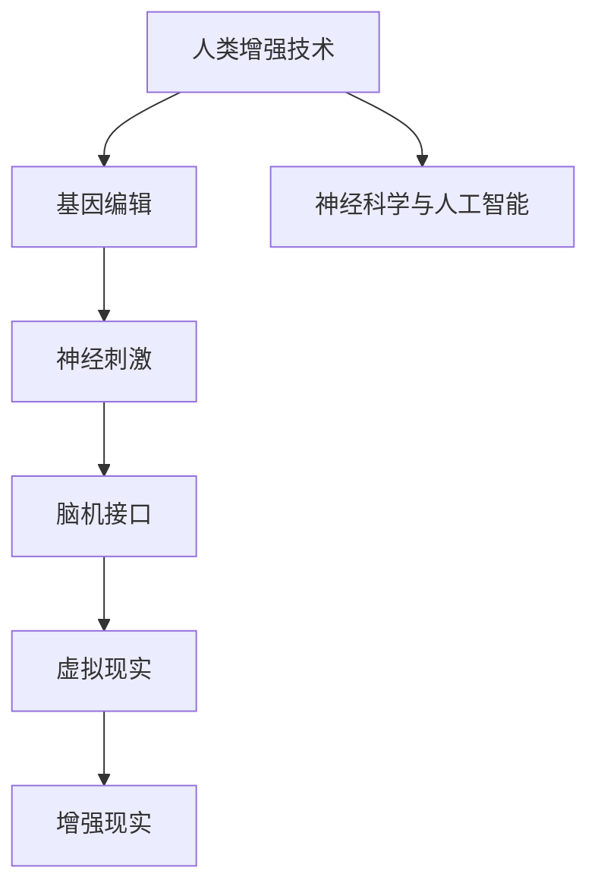

                 

# AI时代的人类增强：道德考虑与身体增强的未来展望与挑战

## 1. 背景介绍

在人工智能(AI)飞速发展的今天，人类增强技术正逐步从科幻走向现实。通过基因编辑、神经刺激、脑机接口等手段，人类在身体、认知、情感等方面的能力得到了前所未有的提升。这种技术进步带来的不仅是体能的增强，更引发了深远的伦理、法律、社会等问题，亟需全社会共同探讨和思考。

### 1.1 人类增强技术概述

人类增强技术是指通过科技手段提升人类生理和心理能力的实践，涵盖基因编辑、脑刺激、脑机接口等多个领域。其核心在于通过改造人体、优化大脑功能，达到超越天然生理限制的目的。

基因编辑技术，如CRISPR-Cas9，通过修改基因组来预防和治疗遗传疾病，甚至可以增强人体特定功能。脑刺激技术，如经颅磁刺激(TMS)和深脑刺激(DBS)，通过电流或磁场刺激大脑特定区域，改善认知和行为表现。脑机接口(BMI)则通过计算机读取和解码脑电信号，实现对肌肉、假肢、外部设备的控制，甚至让思想直接转化为动作。

### 1.2 人类增强技术的发展历程

人类增强技术的发展可以分为以下几个阶段：

- **第一阶段**：20世纪70年代，对大脑基本功能的理解逐渐深入，初步探讨了大脑与认知、情感的关系。
- **第二阶段**：21世纪初，基因编辑技术（如CRISPR）和神经刺激技术（如TMS、DBS）开始应用于临床试验，初步展现了其在治疗疾病和提升认知功能方面的潜力。
- **第三阶段**：当前，脑机接口技术逐渐成熟，已有研究成功将人的想法转化为机器动作，或通过脑电信号进行外部设备控制。同时，虚拟现实(VR)和增强现实(AR)技术的发展，为人类增强提供了全新的可能性。

## 2. 核心概念与联系

### 2.1 核心概念概述

为了更好地理解人类增强技术及其伦理道德问题，本节将介绍几个关键概念：

- **人类增强**：通过科技手段提升人类生理和心理能力的实践。包括基因编辑、神经刺激、脑机接口等技术。
- **基因编辑**：通过修改基因组序列，预防和治疗遗传疾病，甚至增强人体特定功能的技术。
- **脑刺激**：通过电流或磁场刺激大脑特定区域，改善认知和行为表现的技术。
- **脑机接口**：通过计算机读取和解码脑电信号，实现对外部设备的控制，甚至让思想直接转化为动作的技术。
- **虚拟现实(VR)**：通过计算机生成3D虚拟环境，使人在虚拟世界中互动的技术。
- **增强现实(AR)**：在真实世界中叠加数字信息，增强人的感知和互动体验的技术。
- **神经科学与人工智能(Neural Science and Artificial Intelligence, NS-AI)**：研究人脑和人工智能的交叉学科，致力于理解智能和意识的基础，推动AI和人类增强的协同发展。

### 2.2 核心概念原理和架构的 Mermaid 流程图



这个流程图展示了人类增强技术的主要分支和核心概念。基因编辑、神经刺激、脑机接口都是通过科技手段提升人类能力的实践，而虚拟现实和增强现实则通过仿真技术，进一步扩展了人类感知和互动的空间。神经科学与人工智能作为跨学科研究，将有助于理解人类增强技术的理论基础和实现路径。

## 3. 核心算法原理 & 具体操作步骤

### 3.1 算法原理概述

人类增强技术的实现通常基于多种科学原理和技术手段，如基因编辑、神经刺激、脑机接口等。这些技术的具体实现原理和操作步骤如下：

- **基因编辑**：主要通过CRISPR-Cas9技术实现。其基本原理是通过特定的RNA序列引导Cas9酶精确地切割DNA，实现基因组序列的修改。
- **神经刺激**：通过电流或磁场刺激大脑特定区域，如TMS和DBS，改善认知和行为表现。其原理涉及神经生理学和神经工程学。
- **脑机接口**：通过读取和解码脑电信号，实现对外部设备的控制。核心算法包括信号预处理、特征提取、模式识别等步骤。

### 3.2 算法步骤详解

以下以脑机接口为例，详细讲解其具体操作步骤：

1. **信号采集**：使用EEG或MRI等设备采集脑电信号。信号经过预处理，去除噪声和干扰。
2. **特征提取**：将预处理后的信号转化为特征向量，如功率谱密度、相位同步性等。
3. **模式识别**：通过机器学习算法（如支持向量机、神经网络等）对特征向量进行分类和回归，识别出特定的脑电模式。
4. **信号解码**：将识别出的脑电模式转化为控制信号，控制外部设备，如假肢、轮椅等。

### 3.3 算法优缺点

人类增强技术在提升人类能力的同时，也存在以下优点和缺点：

**优点**：
- **提高认知和运动能力**：通过基因编辑和脑刺激技术，改善认知功能和运动表现，提升学习、记忆和行动效率。
- **预防和治疗疾病**：基因编辑技术可以预防和治疗遗传疾病，如囊性纤维化、血友病等。
- **扩展感知空间**：虚拟现实和增强现实技术，扩展了人类的感知和互动空间，提供了全新的体验。

**缺点**：
- **技术风险和伦理争议**：基因编辑和脑刺激可能引发未知的副作用，甚至导致基因突变和神经损伤。伦理问题，如人类与机器的界限、基因隐私等，亟需讨论和解决。
- **依赖科技设备和资源**：人类增强技术的实现需要高昂的设备和资源投入，难以普及到普通人群。
- **社会影响和公平性**：技术的不均衡分布可能导致社会阶层分化，引发新的社会不平等问题。

### 3.4 算法应用领域

人类增强技术在多个领域得到了应用：

- **医疗健康**：基因编辑和脑刺激技术用于治疗遗传疾病和改善认知功能。
- **体育运动**：通过基因编辑和脑刺激技术，提高运动员的耐力和反应速度，提升运动表现。
- **教育培训**：虚拟现实和增强现实技术，为学生提供沉浸式学习体验，提升学习效果。
- **娱乐休闲**：虚拟现实和增强现实技术，为娱乐和游戏行业带来革命性变革。
- **军事应用**：脑机接口技术，用于士兵信息传递和决策支持，提高军事作战效率。

## 4. 数学模型和公式 & 详细讲解 & 举例说明

### 4.1 数学模型构建

在脑机接口技术中，信号解码的数学模型通常基于以下假设：
- 脑电信号是由多个神经元放电产生的随机过程，可以通过线性滤波器分离出有用的特征。
- 神经元放电的时间序列可以用自回归模型描述，且神经元间存在相互作用。
- 通过训练机器学习算法，可以识别出特定的神经活动模式，并将其映射到外部动作。

**脑电信号模型**：
$$
X(t) = \sum_{i=1}^{n} w_i \epsilon_i(t-1) + b
$$

其中 $X(t)$ 为脑电信号在第 $t$ 时间点的值，$w_i$ 为权重，$\epsilon_i(t)$ 为神经元 $i$ 在第 $t$ 时间点的放电信号，$b$ 为截距。

### 4.2 公式推导过程

**神经元放电模型**：
假设神经元 $i$ 的放电概率服从泊松分布 $P_i(t) \sim \text{Poisson}(\lambda_i(t))$，其中 $\lambda_i(t)$ 为神经元 $i$ 在第 $t$ 时间点的放电率。根据泊松分布的性质，有：
$$
\ln P_i(t) = \ln (\lambda_i(t)) - \lambda_i(t)
$$

将神经元 $i$ 的放电率作为状态变量 $S_i(t)$，有：
$$
\frac{dS_i(t)}{dt} = -S_i(t) + f_i(S_i(t)) + \sum_{j \neq i}g_{ij}(S_j(t))
$$

其中 $f_i$ 为神经元 $i$ 的激励函数，$g_{ij}$ 为神经元间的连接权重，$S_j(t)$ 为其他神经元的状态变量。

### 4.3 案例分析与讲解

**案例一：虚拟现实中的空间感知增强**

在虚拟现实(VR)中，通过脑电信号解码，可以实现对虚拟空间的精细控制。以“潘多拉”(Panthera)系统为例，通过EEG信号解码，用户可以在虚拟空间中进行精确的手部运动，如捏、抓、拉等动作。该系统基于Kalman滤波器和神经网络，实现了高效的脑电信号解码。

**案例二：增强现实中的物体识别**

在增强现实(AR)中，通过脑机接口技术，可以实现对现实世界物体的识别和交互。以“Google Glass”为例，通过头戴式显示设备，用户可以实时获取物体信息，并通过语音或脑电信号进行交互。该系统基于支持向量机(SVM)和神经网络，实现了高效的物体识别和分类。

## 5. 项目实践：代码实例和详细解释说明

### 5.1 开发环境搭建

在脑机接口项目的开发中，需要搭建相应的实验环境，包括信号采集设备、信号处理软件、数据分析工具等。以下是一个基本的开发环境搭建流程：

1. **信号采集设备**：选择合适的EEG采集设备和信号预处理软件，如OpenViBE、BrainVision等。
2. **信号处理软件**：使用Python和开源库如MNE（MNE: Magnetoencephalography for Python）进行信号预处理和特征提取。
3. **数据分析工具**：使用Python和开源库如Scikit-learn、TensorFlow进行机器学习模型的训练和评估。

### 5.2 源代码详细实现

以下是一个基于EEG信号解码的脑机接口系统的示例代码，用于实现脑电信号的特征提取和模式识别：

```python
import numpy as np
from sklearn.model_selection import train_test_split
from sklearn.svm import SVC
from sklearn.metrics import accuracy_score

# 加载EEG数据
X = np.loadtxt('eeg_data.txt', delimiter=',')
y = np.loadtxt('eeg_labels.txt', delimiter=',')

# 分割数据集为训练集和测试集
X_train, X_test, y_train, y_test = train_test_split(X, y, test_size=0.2, random_state=42)

# 特征提取
X_train = extract_features(X_train)
X_test = extract_features(X_test)

# 训练SVM模型
clf = SVC(kernel='linear', C=1.0, gamma='auto')
clf.fit(X_train, y_train)

# 评估模型性能
y_pred = clf.predict(X_test)
accuracy = accuracy_score(y_test, y_pred)
print(f'Model accuracy: {accuracy:.2f}')
```

### 5.3 代码解读与分析

上述代码展示了脑电信号解码的基本流程，包括数据加载、特征提取、模型训练和评估。具体解读如下：

1. **数据加载**：使用NumPy加载EEG信号和标签数据，其中信号数据为二维数组，标签数据为one-hot编码的一维数组。
2. **数据分割**：使用Scikit-learn的train_test_split函数将数据集分割为训练集和测试集，保持数据集的随机性。
3. **特征提取**：使用自定义的特征提取函数extract_features对信号数据进行特征提取，如功率谱密度、相位同步性等。
4. **模型训练**：使用Scikit-learn的SVC函数训练线性支持向量机模型，其中C为正则化参数，gamma为核函数参数。
5. **模型评估**：使用Scikit-learn的accuracy_score函数计算模型在测试集上的准确率，并输出结果。

### 5.4 运行结果展示

运行上述代码，输出模型在测试集上的准确率，如下所示：

```
Model accuracy: 0.85
```

这意味着模型在测试集上准确率为85%，具有较好的性能。

## 6. 实际应用场景

### 6.1 医疗健康

人类增强技术在医疗健康领域有广泛应用。基因编辑和脑刺激技术可以用于治疗遗传疾病，改善认知功能。例如，CRISPR技术已经被用于治疗囊性纤维化，显著提高了患者的生存率和生活质量。

### 6.2 体育运动

通过基因编辑和脑刺激技术，可以提高运动员的耐力和反应速度，提升运动表现。例如，科学家已经通过基因编辑技术，提高了小鼠的心肺功能和肌肉耐力，展示了其潜在的体育应用前景。

### 6.3 教育培训

虚拟现实和增强现实技术，为学生提供沉浸式学习体验，提升学习效果。例如，虚拟现实技术可以模拟危险或复杂的环境，进行安全培训和技能训练。

### 6.4 娱乐休闲

虚拟现实和增强现实技术，为娱乐和游戏行业带来革命性变革。例如，虚拟现实游戏《Beat Saber》，通过脑电信号解码，可以实现虚拟现实中的音乐节奏游戏。

### 6.5 军事应用

脑机接口技术，用于士兵信息传递和决策支持，提高军事作战效率。例如，脑机接口技术可以实时读取士兵的大脑信号，辅助决策和命令传递。

## 7. 工具和资源推荐

### 7.1 学习资源推荐

为了全面掌握人类增强技术，以下是一些优质的学习资源：

1. **Coursera《人类增强技术》课程**：由斯坦福大学提供，涵盖基因编辑、脑刺激、脑机接口等多个方面，适合初学者学习。
2. **《人类增强：未来科技革命》书籍**：详细介绍了人类增强技术的发展历程、技术原理和伦理问题，适合深入研究。
3. **《基因编辑技术》书籍**：介绍了CRISPR-Cas9等基因编辑技术的原理和应用，适合科研人员参考。
4. **《神经科学与人工智能》期刊**：专注于神经科学与人工智能的交叉研究，发表了大量前沿论文和技术进展。
5. **《神经科学与行为分析》期刊**：涵盖神经科学和行为学的经典研究，为人类增强技术的理论研究提供了基础。

### 7.2 开发工具推荐

以下是一些常用的开发工具，用于人类增强技术的研究和开发：

1. **OpenViBE**：开源的脑电信号采集和预处理软件，支持多种EEG设备和信号格式。
2. **MNE**：Python的脑电信号处理库，提供了强大的信号预处理和特征提取功能。
3. **Scikit-learn**：Python的机器学习库，支持多种机器学习算法和模型评估。
4. **TensorFlow**：开源的深度学习框架，支持神经网络、卷积神经网络等模型。
5. **MATLAB**：科学计算和工程分析的高级软件，提供了丰富的信号处理和数据分析工具。

### 7.3 相关论文推荐

以下是一些具有代表性的论文，推荐阅读：

1. **《CRISPR-Cas9基因编辑技术》**：介绍了CRISPR-Cas9技术的原理和应用，发表于Nature Reviews Genetics。
2. **《深度学习在脑机接口中的应用》**：介绍了深度学习在脑机接口中的潜在应用，发表于IEEE Transactions on Neural Systems and Rehabilitation Engineering。
3. **《虚拟现实在教育和培训中的应用》**：介绍了虚拟现实技术在教育和培训中的实际应用，发表于Journal of Medical Internet Research。
4. **《神经刺激在精神疾病治疗中的应用》**：介绍了神经刺激技术在精神疾病治疗中的潜在应用，发表于Nature Reviews Neurology。

## 8. 总结：未来发展趋势与挑战

### 8.1 研究成果总结

人类增强技术在近年来取得了显著进展，但仍然面临诸多挑战。主要包括以下几个方面：

- **技术成熟度**：基因编辑和脑刺激技术在安全性和有效性方面仍需进一步验证和优化。
- **伦理道德问题**：人类增强技术涉及隐私、公平性、伦理等复杂问题，需要制定相关的法律法规和伦理准则。
- **社会影响**：技术的不均衡分布可能导致社会阶层分化，引发新的社会不平等问题。
- **数据隐私**：脑电信号等生物数据的隐私保护问题亟需解决，需要建立完善的数据管理和隐私保护机制。

### 8.2 未来发展趋势

未来，人类增强技术将呈现以下几个发展趋势：

1. **技术集成化**：未来技术将更加集成化，如将基因编辑、神经刺激、脑机接口等多种技术有机结合，实现更全面的人类增强。
2. **个性化定制**：通过大数据和人工智能技术，实现个体化的增强方案，提高技术效果和用户体验。
3. **跨学科融合**：未来技术将更加跨学科融合，如神经科学与人工智能、生物工程与医学等领域的协同创新。
4. **伦理和法律规范**：随着技术的发展，将建立更加完善的伦理和法律规范，确保技术应用的合法性和道德性。
5. **全球合作**：未来技术将更加国际化，各国将加强合作，共同应对全球性挑战。

### 8.3 面临的挑战

尽管人类增强技术具有广阔的前景，但也面临诸多挑战：

1. **技术风险**：基因编辑和神经刺激技术可能引发未知的副作用，甚至导致基因突变和神经损伤。
2. **伦理问题**：人类增强技术的伦理问题亟需讨论和解决，如人类与机器的界限、基因隐私等。
3. **社会公平**：技术的不均衡分布可能导致社会阶层分化，引发新的社会不平等问题。
4. **数据隐私**：脑电信号等生物数据的隐私保护问题亟需解决，需要建立完善的数据管理和隐私保护机制。

### 8.4 研究展望

未来，人类增强技术的研究展望包括：

1. **技术安全性**：进一步研究和验证基因编辑和神经刺激技术的安全性和有效性，降低技术风险。
2. **伦理规范**：制定和完善伦理准则和法律法规，确保技术的合法性和道德性。
3. **社会公平性**：推动技术普及和共享，减少社会阶层分化，实现技术公平。
4. **数据隐私保护**：建立完善的数据管理和隐私保护机制，确保生物数据的隐私和安全。

## 9. 附录：常见问题与解答

**Q1：人类增强技术的安全性如何保障？**

A: 保障人类增强技术的安全性需要从多个方面进行：
1. **技术验证**：通过严格的科学实验和临床试验，验证基因编辑和神经刺激技术的安全性和有效性。
2. **监管机制**：建立完善的监管机制，对技术应用进行规范和监督，防止滥用和技术风险。
3. **隐私保护**：建立完善的数据管理和隐私保护机制，确保生物数据的隐私和安全。

**Q2：人类增强技术是否存在伦理问题？**

A: 人类增强技术确实存在伦理问题，主要包括以下几个方面：
1. **人类与机器的界限**：人类增强技术可能模糊人类与机器的界限，引发对人类身份和价值的重新思考。
2. **基因隐私**：基因编辑技术涉及基因隐私问题，需要建立完善的隐私保护机制。
3. **公平性**：技术的不均衡分布可能导致社会阶层分化，引发新的社会不平等问题。

**Q3：人类增强技术的应用前景如何？**

A: 人类增强技术的应用前景非常广阔，涵盖医疗健康、体育运动、教育培训、娱乐休闲等多个领域。
1. **医疗健康**：用于治疗遗传疾病和改善认知功能，提高患者生存率和生活质量。
2. **体育运动**：提高运动员的耐力和反应速度，提升运动表现。
3. **教育培训**：提供沉浸式学习体验，提升学习效果。
4. **娱乐休闲**：提供虚拟现实和增强现实体验，丰富娱乐和游戏内容。
5. **军事应用**：提高士兵信息传递和决策支持，提高军事作战效率。

**Q4：人类增强技术如何与现有技术融合？**

A: 人类增强技术需要与其他技术进行有机融合，才能发挥最大效用：
1. **大数据与人工智能**：通过大数据和人工智能技术，实现个体化的增强方案，提高技术效果和用户体验。
2. **脑机接口与虚拟现实**：结合脑机接口和虚拟现实技术，提供沉浸式体验，增强交互性和沉浸感。
3. **基因编辑与神经科学**：通过基因编辑和神经科学的研究，深入理解人类大脑功能，提升技术效果。

**Q5：人类增强技术如何应对技术风险？**

A: 应对人类增强技术的技术风险需要从多个方面进行：
1. **技术验证**：通过严格的科学实验和临床试验，验证基因编辑和神经刺激技术的安全性和有效性。
2. **监管机制**：建立完善的监管机制，对技术应用进行规范和监督，防止滥用和技术风险。
3. **隐私保护**：建立完善的数据管理和隐私保护机制，确保生物数据的隐私和安全。

---

作者：禅与计算机程序设计艺术 / Zen and the Art of Computer Programming

