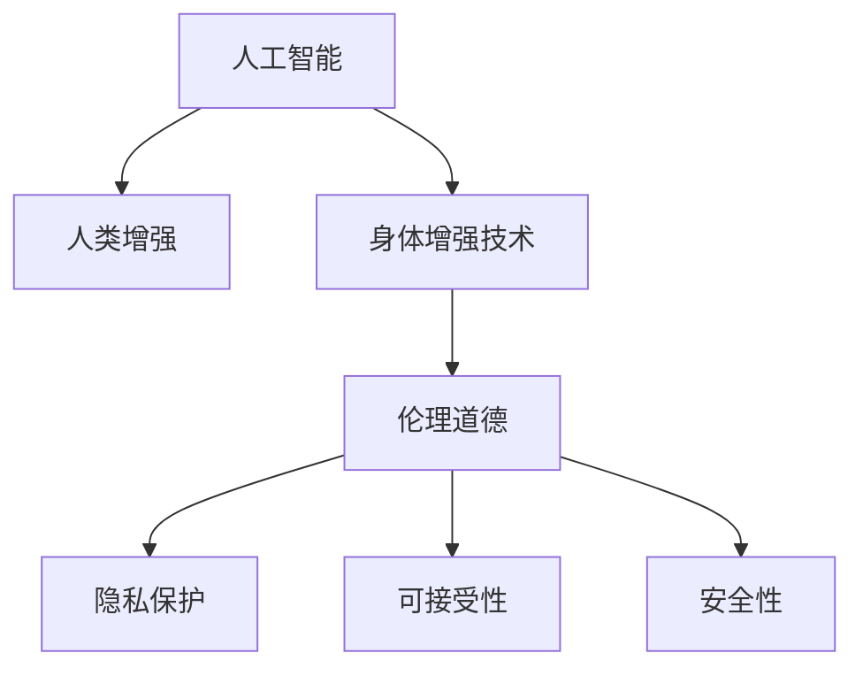

                 

# AI时代的人类增强：道德考虑和身体增强技术的限制

> 关键词：人工智能,人类增强,身体增强技术,道德伦理,科技与社会,应用场景,安全与隐私,未来展望

## 1. 背景介绍

随着人工智能(AI)技术的迅猛发展，人类增强技术，尤其是身体增强技术，已经成为当前科技前沿的一个热门话题。这种技术的潜在应用范围涵盖了从医学治疗、运动训练到娱乐健身等多个领域。然而，在享受这些技术带来的便利和优势的同时，我们也必须警惕其可能带来的伦理道德问题，尤其是在算法和数据隐私方面的风险。本文旨在探讨人类增强技术的道德考量，以及其应用限制，以期在技术进步和社会福祉之间找到平衡点。

## 2. 核心概念与联系

### 2.1 核心概念概述

为更好地理解人工智能在人类增强领域的应用和限制，本节将介绍几个关键概念：

- **人工智能(AI)**：指通过模拟人类智能行为，使计算机能够执行各种复杂任务的技术，包括机器学习、自然语言处理、计算机视觉等。

- **人类增强(Human Augmentation)**：通过技术手段，提升人类的能力、增强生活质量的过程。这些技术可以包括机器人辅助、基因编辑、脑机接口等。

- **身体增强技术(Bodily Enhancement Technologies)**：特指通过技术手段，直接或间接地改善人类身体的功能或外观，如基因编辑、假肢、增强现实(AR)等。

- **伦理道德(Ethics)**：探讨人类行为和技术的正当性、正义性、责任性的学科，在AI时代尤其关注数据隐私、算法偏见、技术滥用等问题。

- **隐私保护(Privacy Protection)**：在收集和使用个人数据时，保障数据主体的隐私权利，防止数据滥用和泄露。

- **可接受性(Acceptability)**：指社会公众对新兴技术的接受程度，涉及科技普及、文化差异、公众认知等多个方面。

- **安全性(Security)**：确保技术应用的安全性，防止技术被恶意利用或导致不可预期的后果。

这些核心概念之间的逻辑关系可以通过以下Mermaid流程图来展示：



这个流程图展示了一系列核心概念的关联关系：

1. 人工智能技术为人类增强提供了技术基础。
2. 身体增强技术是AI在人类增强领域的具体应用之一。
3. 伦理道德是评估和指导AI技术应用的重要框架。
4. 隐私保护和安全性是保障伦理道德的两个关键因素。
5. 可接受性反映了社会对新兴技术的认可度。

这些概念共同构成了AI时代人类增强技术发展的框架，使我们能够更好地把握其潜力和风险。

## 3. 核心算法原理 & 具体操作步骤

### 3.1 算法原理概述

基于人工智能的身体增强技术，通常涉及机器学习、深度学习等算法原理。其核心思想是通过算法模型，对输入数据进行学习和推理，输出相应的增强效果。

以深度学习为例，其基本流程包括：

1. **数据收集**：收集与增强技术相关的数据，如生理数据、图像数据、行为数据等。
2. **数据预处理**：对收集的数据进行清洗、标注和标准化，使其适合模型的输入要求。
3. **模型训练**：使用深度学习模型，如卷积神经网络(CNN)、循环神经网络(RNN)、生成对抗网络(GAN)等，对数据进行训练，学习数据特征和规律。
4. **模型评估与优化**：在验证集上评估模型性能，根据评估结果进行模型优化，如调整超参数、改进模型结构等。
5. **模型部署**：将训练好的模型部署到实际应用中，如运动训练、假肢控制、基因编辑等场景。

### 3.2 算法步骤详解

以深度学习算法为例，具体算法步骤如下：

**Step 1: 数据准备**
- 收集相关数据，包括生理参数、行为数据、影像数据等。
- 对数据进行预处理，如归一化、标准化、标签标注等。

**Step 2: 模型选择与设计**
- 根据应用场景选择合适的深度学习模型。
- 设计模型架构，包括输入层、隐藏层、输出层等。

**Step 3: 模型训练**
- 使用训练集对模型进行训练，调整模型参数。
- 使用验证集评估模型性能，选择最优模型。

**Step 4: 模型评估与优化**
- 在测试集上评估模型性能，计算准确率、召回率、F1值等指标。
- 根据评估结果进行模型优化，如调整超参数、改进模型结构等。

**Step 5: 模型部署**
- 将训练好的模型部署到实际应用场景中。
- 持续监控模型表现，根据反馈进行调整和优化。

### 3.3 算法优缺点

基于人工智能的身体增强技术具有以下优点：
1. 自动化程度高。通过算法模型，可以实现高效的自动化增强过程。
2. 数据驱动。利用大量的数据进行模型训练，提升模型的预测能力和鲁棒性。
3. 适用性强。可以应用于多个领域的增强需求，如运动训练、医疗治疗、娱乐健身等。
4. 效果显著。通过深度学习等先进算法，可以获得显著的增强效果。

然而，这些技术也存在一些缺点：
1. 数据需求高。需要大量高质量的数据进行模型训练，获取数据的成本较高。
2. 算法复杂。深度学习等算法模型的训练和优化过程较为复杂，需要专业知识。
3. 结果不确定。模型预测结果可能存在误差，增强效果可能不理想。
4. 伦理风险。数据隐私和算法偏见可能带来伦理道德问题。
5. 技术滥用。模型可能被恶意利用，导致不可预期的后果。

### 3.4 算法应用领域

基于人工智能的身体增强技术已经广泛应用于多个领域，例如：

- **运动训练**：通过机器学习算法，分析运动员的生理数据和行为数据，提供个性化的训练计划和反馈。
- **医疗治疗**：使用深度学习模型，分析医学影像数据，辅助医生进行疾病诊断和治疗方案制定。
- **娱乐健身**：通过增强现实(AR)技术，提供虚拟健身体验和游戏互动。
- **假肢控制**：利用脑机接口技术，实时采集大脑信号，控制假肢的运动。
- **基因编辑**：使用基因编辑技术，增强特定基因的功能，预防疾病。

除了上述这些经典应用外，身体增强技术还在更多场景中得到了创新性地应用，如智能家居、虚拟现实(VR)等，为人类生活带来了更多便利。

## 4. 数学模型和公式 & 详细讲解 & 举例说明

### 4.1 数学模型构建

以深度学习为例，我们以假肢控制的脑机接口为例，展示其数学模型构建过程。

设输入为大脑信号$x \in \mathbb{R}^n$，输出为假肢运动指令$y \in \mathbb{R}^m$，模型为神经网络$f: \mathbb{R}^n \rightarrow \mathbb{R}^m$。模型的目标是最小化损失函数$\mathcal{L}(f)$，以使模型预测的输出尽可能接近真实标签。

### 4.2 公式推导过程

以均方误差损失函数为例，推导过程如下：

$$
\mathcal{L}(f) = \frac{1}{2N} \sum_{i=1}^N \|f(x_i) - y_i\|^2
$$

其中$N$为样本数量，$\| \cdot \|$为范数运算符。

### 4.3 案例分析与讲解

以深度学习模型在运动训练中的应用为例，展示其具体实现过程。

假设我们有一个运动训练的数据集，包含运动员的生理数据和行为数据。数据集分为训练集和测试集，其中训练集用于模型训练，测试集用于模型评估。使用深度学习模型，对数据进行特征提取和分类，以预测运动员的训练效果和最佳训练计划。

## 5. 项目实践：代码实例和详细解释说明

### 5.1 开发环境搭建

在进行项目实践前，我们需要准备好开发环境。以下是使用Python进行PyTorch开发的环境配置流程：

1. 安装Anaconda：从官网下载并安装Anaconda，用于创建独立的Python环境。

2. 创建并激活虚拟环境：
```bash
conda create -n pytorch-env python=3.8 
conda activate pytorch-env
```

3. 安装PyTorch：根据CUDA版本，从官网获取对应的安装命令。例如：
```bash
conda install pytorch torchvision torchaudio cudatoolkit=11.1 -c pytorch -c conda-forge
```

4. 安装Transformers库：
```bash
pip install transformers
```

5. 安装各类工具包：
```bash
pip install numpy pandas scikit-learn matplotlib tqdm jupyter notebook ipython
```

完成上述步骤后，即可在`pytorch-env`环境中开始项目实践。

### 5.2 源代码详细实现

这里以假肢控制的脑机接口为例，展示使用PyTorch进行深度学习模型训练的代码实现。

```python
import torch
import torch.nn as nn
import torch.optim as optim

# 定义模型架构
class BrainComputerInterface(nn.Module):
    def __init__(self, input_size, hidden_size, output_size):
        super(BrainComputerInterface, self).__init__()
        self.fc1 = nn.Linear(input_size, hidden_size)
        self.fc2 = nn.Linear(hidden_size, output_size)
        self.activation = nn.Sigmoid()
        
    def forward(self, x):
        x = self.fc1(x)
        x = self.activation(x)
        x = self.fc2(x)
        return x

# 准备数据集
train_data = # 训练数据
test_data = # 测试数据

# 定义模型、损失函数和优化器
model = BrainComputerInterface(input_size, hidden_size, output_size)
criterion = nn.MSELoss()
optimizer = optim.Adam(model.parameters(), lr=0.001)

# 训练模型
for epoch in range(num_epochs):
    for i, (inputs, targets) in enumerate(train_loader):
        # 前向传播
        outputs = model(inputs)
        # 计算损失
        loss = criterion(outputs, targets)
        # 反向传播和优化
        optimizer.zero_grad()
        loss.backward()
        optimizer.step()
        
    # 评估模型
    losses = []
    for inputs, targets in test_loader:
        outputs = model(inputs)
        loss = criterion(outputs, targets)
        losses.append(loss.item())
        
    print(f"Epoch {epoch+1}, test loss: {sum(losses) / len(losses):.3f}")
```

### 5.3 代码解读与分析

让我们再详细解读一下关键代码的实现细节：

**BrainComputerInterface类**：
- `__init__`方法：初始化模型架构，包括全连接层和激活函数。
- `forward`方法：实现模型前向传播，包括输入层、隐藏层和输出层的计算。

**数据集准备**：
- 使用PyTorch的DataLoader对数据集进行批次化加载，方便模型训练和推理。

**模型训练**：
- 在每个epoch中，遍历训练数据集，前向传播计算输出，计算损失，反向传播更新模型参数。
- 在每个epoch结束后，计算测试集的损失，评估模型性能。

## 6. 实际应用场景

### 6.1 医疗领域

在医疗领域，基于人工智能的身体增强技术可以广泛应用于疾病诊断、手术辅助、康复治疗等多个方面。通过深度学习等先进算法，医生可以更准确地诊断疾病，提供个性化的治疗方案，提高患者康复效果。

### 6.2 运动训练

在运动训练领域，基于人工智能的增强技术可以提供个性化的训练计划和反馈，帮助运动员提升训练效果。通过分析生理数据和行为数据，系统可以生成最优的训练方案，并提供实时反馈，辅助运动员进行调整和优化。

### 6.3 娱乐健身

在娱乐健身领域，基于增强现实(AR)等技术的身体增强技术，可以提供虚拟健身体验和游戏互动，增强用户的运动乐趣。通过AR技术，用户可以在虚拟环境中进行各种运动，享受沉浸式的健身体验。

### 6.4 未来应用展望

随着人工智能技术的发展，基于身体增强技术的应用场景将进一步拓展。未来，这些技术有望在更多领域得到应用，如教育、工业制造、城市管理等。

## 7. 工具和资源推荐

### 7.1 学习资源推荐

为了帮助开发者系统掌握人工智能在人类增强领域的应用，这里推荐一些优质的学习资源：

1. 《Deep Learning》书籍：由Ian Goodfellow、Yoshua Bengio和Aaron Courville合著，全面介绍了深度学习的理论和应用，包括各种算法和模型。

2. CS231n《Convolutional Neural Networks for Visual Recognition》课程：斯坦福大学开设的深度学习课程，重点介绍卷积神经网络在计算机视觉中的应用。

3. Coursera《AI for Everyone》课程：由Andrew Ng教授主讲，介绍AI的基本概念、应用场景和伦理道德问题。

4. arXiv：学术文章共享平台，提供大量前沿的AI研究论文，涵盖各种应用场景和技术细节。

5. Kaggle：数据科学竞赛平台，提供大量的数据集和模型评估工具，适合实践和交流。

通过对这些资源的学习实践，相信你一定能够快速掌握人工智能在人类增强领域的应用技巧，并用于解决实际的AI问题。

### 7.2 开发工具推荐

高效的开发离不开优秀的工具支持。以下是几款用于人工智能开发的常用工具：

1. PyTorch：基于Python的开源深度学习框架，灵活的计算图和动态模型定义，适合快速迭代研究。

2. TensorFlow：由Google主导开发的开源深度学习框架，生产部署方便，适合大规模工程应用。

3. Jupyter Notebook：交互式编程环境，支持Python、R等多种语言，方便编写和调试代码。

4. TensorBoard：TensorFlow配套的可视化工具，可实时监测模型训练状态，提供丰富的图表呈现方式。

5. Git和GitHub：版本控制工具，支持代码管理、协作和版本跟踪，方便团队开发和开源分享。

合理利用这些工具，可以显著提升人工智能项目开发的效率，加快创新迭代的步伐。

### 7.3 相关论文推荐

人工智能在人类增强领域的发展源于学界的持续研究。以下是几篇奠基性的相关论文，推荐阅读：

1. Human augmentation: Challenges and opportunities in personalized healthcare（《人类增强：个性化医疗中的挑战与机遇》）：探讨了人工智能在医疗领域的应用潜力，以及面临的挑战。

2. Brain-computer interfaces and their clinical applications（《脑机接口及其临床应用》）：综述了脑机接口技术的发展现状和应用前景，包括深度学习在脑机接口中的应用。

3. Ethical, legal, and social considerations for robotics（《机器人技术的伦理、法律和社会考虑》）：探讨了人工智能在机器人领域的应用，以及需要考虑的伦理道德问题。

4. Privacy-preserving deep learning（《隐私保护深度学习》）：研究了深度学习在数据隐私保护方面的技术和方法，提出多种隐私保护策略。

5. A survey of AI in sports（《AI在体育中的应用综述》）：介绍了AI技术在体育领域的应用，包括运动训练、赛事预测、观众互动等。

这些论文代表了大规模人工智能技术在人类增强领域的发展脉络。通过学习这些前沿成果，可以帮助研究者把握学科前进方向，激发更多的创新灵感。

## 8. 总结：未来发展趋势与挑战

### 8.1 总结

本文对人工智能在人类增强领域的应用进行了全面系统的介绍。首先阐述了人工智能技术在增强技术中的基础作用，明确了其在多个领域的潜在应用。其次，从原理到实践，详细讲解了深度学习算法的核心步骤，给出了具体的代码实例。同时，本文还广泛探讨了增强技术在医疗、运动、娱乐等多个场景中的应用前景，展示了其广阔的想象空间。最后，本文精选了增强技术的各类学习资源，力求为读者提供全方位的技术指引。

通过本文的系统梳理，可以看到，基于人工智能的身体增强技术正在成为医疗、运动、娱乐等多个领域的重要工具，极大地提升了这些领域的技术水平和用户体验。未来，伴随AI技术的不断演进，基于增强技术的更多创新应用将陆续涌现，为人类生活的各个方面带来革命性变革。

### 8.2 未来发展趋势

展望未来，人工智能在人类增强领域的发展趋势将呈现以下几个方面：

1. **多模态融合**：未来的人工智能系统将不仅仅局限于单模态数据，而是能够融合多模态数据，如生理信号、行为数据、影像数据等，实现更全面、更精准的增强效果。

2. **个性化增强**：基于深度学习等算法，未来的人工智能系统将能够实现更加个性化的增强，根据用户的独特需求提供定制化的服务。

3. **实时性增强**：通过优化算法和硬件配置，未来的人工智能系统将具备更高的实时性，能够实时响应用户的需求，提供即时的增强效果。

4. **智能互动**：未来的增强技术将具备更强的智能互动能力，通过自然语言处理、语音识别等技术，实现人机无缝交互，提升用户体验。

5. **跨领域应用**：人工智能在人类增强领域的应用将进一步拓展到更多领域，如教育、工业制造、城市管理等，为各行各业带来创新变革。

这些趋势凸显了人工智能在人类增强领域的前景广阔，必将带来更多科技红利和应用可能性。

### 8.3 面临的挑战

尽管人工智能在人类增强领域已经取得了显著成果，但在技术应用过程中，仍面临着诸多挑战：

1. **数据隐私**：在收集和处理用户数据时，如何保护用户隐私，防止数据滥用和泄露，是一个重要的问题。

2. **伦理道德**：增强技术的应用可能涉及伦理道德问题，如技术滥用、隐私泄露、偏见问题等，需要多方共同讨论和规范。

3. **技术可行性**：增强技术的实现需要高水平的算法和硬件支持，如何降低技术门槛，普及应用，也是一个挑战。

4. **用户接受度**：增强技术的应用需要用户接受和信任，如何提升用户的接受度和使用体验，也是一个重要课题。

5. **安全性**：增强技术的应用可能面临安全问题，如系统崩溃、数据篡改等，需要建立可靠的安全机制。

6. **可持续发展**：增强技术的应用需要考虑其可持续性，避免对环境和社会造成不良影响。

这些挑战凸显了人工智能在人类增强领域的应用需要谨慎和规范，需要多方协同努力，才能实现技术进步和社会福祉的共同发展。

### 8.4 研究展望

面对人工智能在人类增强领域面临的挑战，未来的研究需要在以下几个方面寻求新的突破：

1. **隐私保护技术**：研发更加高效的隐私保护技术，如差分隐私、联邦学习等，保障数据安全和用户隐私。

2. **伦理道德框架**：建立人工智能伦理道德的国际标准和规范，明确技术应用的边界和责任。

3. **跨学科研究**：加强人工智能与医学、心理学、社会学等多个学科的交叉研究，推动技术创新和应用。

4. **用户接受度研究**：通过社会心理学、人类工效学等方法，深入理解用户需求和接受度，设计更加人性化的增强系统。

5. **安全性保障**：研发更加健壮和可靠的安全技术，确保增强系统的稳定性和鲁棒性。

6. **可持续发展研究**：研究增强技术的可持续性问题，提出环境友好和资源高效的应用方案。

这些研究方向的探索，将引领人工智能在人类增强领域的持续进步，为构建安全、可靠、可接受、可持续的增强系统铺平道路。面向未来，人工智能在人类增强领域的研究和发展需要更多科学精神和人文关怀，才能真正造福人类社会。

## 9. 附录：常见问题与解答

**Q1：人工智能在人类增强中的应用前景如何？**

A: 人工智能在人类增强领域的应用前景非常广阔。其可以应用于医疗、运动、娱乐、工业制造等多个领域，提供个性化的增强方案，提升用户体验和生活质量。随着技术的不断发展，人工智能在人类增强领域的应用将更加深入和广泛。

**Q2：在应用人工智能技术时，如何保护用户隐私？**

A: 保护用户隐私是人工智能应用中的重要问题。主要措施包括：
1. 数据匿名化：去除或加密用户数据中的敏感信息，防止隐私泄露。
2. 数据最小化：仅收集必要的用户数据，避免过度收集。
3. 数据加密：采用加密技术，保护数据在传输和存储过程中的安全。
4. 数据去标识化：通过数据去标识化技术，去除数据中的个人身份信息。

**Q3：人工智能技术在人类增强应用中存在哪些伦理道德问题？**

A: 人工智能技术在人类增强应用中可能涉及以下伦理道德问题：
1. 技术滥用：技术可能被恶意利用，导致不良后果。
2. 偏见问题：算法可能存在偏见，导致不公正的增强效果。
3. 隐私泄露：用户数据可能被滥用，导致隐私泄露。
4. 透明度问题：算法决策过程缺乏透明度，用户难以理解和信任。
5. 人机关系：增强技术可能导致人机关系失衡，削弱人类自主性。

**Q4：人工智能在人类增强技术中面临哪些技术挑战？**

A: 人工智能在人类增强技术中面临以下技术挑战：
1. 数据隐私：保护用户隐私，防止数据滥用和泄露。
2. 伦理道德：确保技术应用的道德边界，避免技术滥用。
3. 用户接受度：提升用户的接受度和使用体验，确保技术的普及和应用。
4. 技术可行性：降低技术门槛，普及应用，确保技术的可持续性。
5. 安全性：确保系统的稳定性和鲁棒性，防止系统崩溃和安全问题。
6. 可持续发展：考虑增强技术的可持续性，避免对环境和社会造成不良影响。

**Q5：如何提升人工智能在人类增强领域的应用效果？**

A: 提升人工智能在人类增强领域的应用效果，可以从以下几个方面入手：
1. 数据质量：提高数据质量和多样性，提升模型的训练效果。
2. 算法优化：优化算法模型，提升模型的预测准确性和鲁棒性。
3. 用户参与：引入用户反馈，优化增强系统的设计和使用体验。
4. 跨学科研究：加强多学科交叉研究，推动技术的创新和应用。
5. 伦理道德：建立伦理道德规范，确保技术应用的合法性和合理性。
6. 安全性保障：研发可靠的安全技术，确保系统的稳定性和鲁棒性。

通过综合考虑以上因素，可以提升人工智能在人类增强领域的应用效果，推动技术进步和社会福祉。

---

作者：禅与计算机程序设计艺术 / Zen and the Art of Computer Programming

