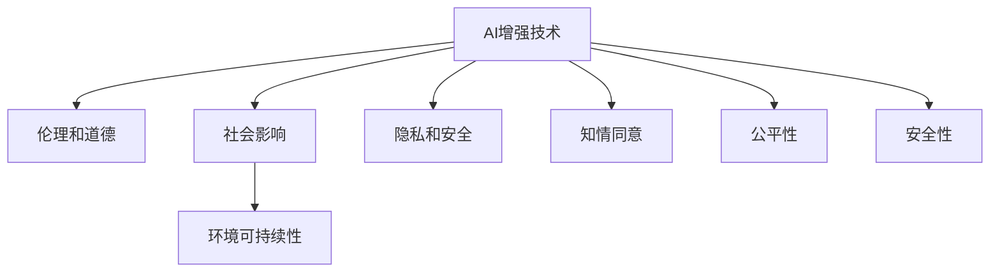
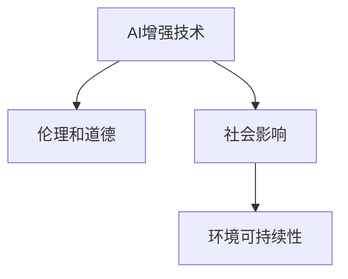

                 

## 1. 背景介绍

### 1.1 问题由来

在人类进入人工智能(AI)时代的背景下，关于“增强”技术的应用范围和伦理问题引发了广泛的讨论。AI技术正在改变我们的生活方式，从智能家居到自动驾驶，从个性化推荐到生物医疗，其触角延伸到社会的每一个角落。与此同时，增强技术的发展也为我们提供了新的身体和认知能力增强的可能性，这不仅包括虚拟现实和增强现实技术，还包括利用生物工程手段对人类进行永久性或可逆性的增强。

这些技术在带来便利的同时，也引发了一系列伦理、法律和社会问题，例如：

- **隐私和安全问题**：增强技术可能被滥用，导致个人隐私泄露和数据安全问题。
- **道德和伦理争议**：某些增强技术可能被认为是不道德的，例如基因编辑、脑机接口等。
- **社会不平等问题**：增强技术可能会加剧社会分层，只有部分人能够享受这些技术带来的好处。
- **环境影响**：大规模增强技术的开发和应用可能对环境造成负面影响。

面对这些挑战，如何在AI时代有效利用增强技术，确保其造福人类，而不是带来新的问题，成为当下及未来一个重要的研究课题。

### 1.2 问题核心关键点

基于增强技术在AI时代的应用和挑战，本节将介绍几个核心概念：

- **AI增强技术**：包括机器学习、深度学习、生物工程、基因编辑、脑机接口等技术，这些技术能够增强人类的身体能力和认知能力。
- **伦理和道德**：涉及增强技术的开发、应用及监管过程中的伦理原则和道德规范，如隐私保护、知情同意、公平性、安全性等。
- **社会影响**：增强技术对社会结构、就业市场、人际关系等方面的影响，以及如何通过政策和技术手段减少负面影响。
- **环境可持续性**：增强技术在开发和应用过程中对环境的影响，以及如何采取措施实现环境可持续性。

这些核心概念之间的逻辑关系可以通过以下Mermaid流程图来展示：



这个流程图展示了一个增强技术的全生命周期，包括其技术实现、伦理道德考量、社会影响及环境可持续性等各个方面。

## 2. 核心概念与联系

### 2.1 核心概念概述

为更好地理解AI时代增强技术的伦理问题，本节将介绍几个关键概念：

- **AI增强技术**：指的是利用人工智能技术，如机器学习、深度学习等，提升人类的认知能力和身体功能的技术。这些技术可以分为两大类：**非生物增强**和**生物增强**。非生物增强包括虚拟现实、增强现实、脑机接口等，而生物增强则涉及基因编辑、植入芯片等。

- **伦理和道德**：涉及增强技术的开发、应用及监管过程中的伦理原则和道德规范。例如，基因编辑涉及人类基本权利和尊严，脑机接口可能影响人类认知自由的边界。

- **社会影响**：增强技术对社会结构、就业市场、人际关系等方面的影响。例如，某些增强技术可能导致就业市场变化，引发社会不平等等问题。

- **环境可持续性**：增强技术在开发和应用过程中对环境的影响，以及如何采取措施实现环境可持续性。例如，大规模增强技术的生产可能消耗大量资源，对环境造成负担。

这些核心概念之间的逻辑关系可以通过以下Mermaid流程图来展示：



这个流程图展示了一个增强技术的全生命周期，包括其技术实现、伦理道德考量、社会影响及环境可持续性等各个方面。

## 3. 核心算法原理 & 具体操作步骤
### 3.1 算法原理概述

AI时代增强技术的应用，通常涉及到复杂的算法和模型。本节将从算法原理角度出发，介绍增强技术的核心算法和具体操作步骤。

- **深度学习算法**：在增强技术中，深度学习算法被广泛用于模拟和预测人类认知和身体功能。例如，神经网络模型可以模拟大脑的神经元结构，预测人类行为的复杂性。

- **基因编辑算法**：基因编辑算法如CRISPR-Cas9，能够通过修改DNA序列，实现基因的精确编辑。这些算法在增强技术中用于修改人类基因，提升认知和身体功能。

- **脑机接口算法**：脑机接口算法能够读取和解码人类大脑信号，实现脑-机互动。例如，基于深度学习的算法可以用于分析大脑电信号，解码人类意图。

### 3.2 算法步骤详解

基于增强技术的AI时代，其算法步骤主要包括以下几个环节：

1. **数据采集与预处理**：采集人类身体和认知功能相关的数据，如神经信号、基因序列、行为数据等。数据采集完成后，需要进行预处理，包括数据清洗、特征提取等。

2. **模型训练**：利用深度学习算法，训练模型来预测和模拟人类认知和身体功能。训练过程中，需要选择合适的训练集、验证集和测试集，并设置合适的超参数。

3. **模型评估与优化**：在训练结束后，对模型进行评估，通过各种指标（如准确率、精确度、召回率等）来衡量模型的性能。根据评估结果，对模型进行优化，例如调整网络结构、学习率、正则化参数等。

4. **模型应用与验证**：将训练好的模型应用到实际场景中，进行验证和测试。验证过程中，需要收集更多的数据，确保模型的泛化能力。

5. **伦理和社会影响评估**：在模型应用前，需要评估其伦理和社会影响，确保技术应用的合规性和安全性。例如，评估基因编辑是否违反人类伦理准则，脑机接口是否侵犯隐私等。

### 3.3 算法优缺点

基于增强技术的AI时代算法，具有以下优点：

- **提升认知和身体功能**：深度学习等算法能够模拟和预测人类认知和身体功能，提升人类的认知能力和身体功能。

- **数据驱动的精确性**：通过大量数据的训练，算法可以准确地预测和模拟人类行为，提高技术的精确性。

- **跨学科应用**：增强技术可以应用于多个领域，如医疗、教育、娱乐等，带来广泛的应用前景。

同时，这些算法也存在以下缺点：

- **数据隐私和安全问题**：数据采集和处理过程中可能涉及个人隐私，数据泄露和滥用风险较高。

- **伦理和道德争议**：增强技术可能涉及人类基本权利和尊严，引发伦理和道德争议。

- **技术复杂性**：增强技术的实现需要复杂的算法和模型，开发和维护成本较高。

- **社会不平等的风险**：技术应用过程中可能加剧社会不平等，导致资源分配不均。

### 3.4 算法应用领域

基于增强技术的AI时代算法，广泛应用于以下几个领域：

1. **医疗领域**：利用基因编辑和脑机接口技术，改善人类健康状况。例如，通过基因编辑修复致病基因，预防疾病；通过脑机接口辅助手术和治疗。

2. **教育领域**：利用增强现实和虚拟现实技术，提升教学效果。例如，通过虚拟现实技术模拟复杂实验，增强学生实践能力；通过增强现实技术进行互动式教学，提高学生学习兴趣。

3. **娱乐领域**：利用增强现实和虚拟现实技术，提供沉浸式娱乐体验。例如，通过增强现实技术进行互动式游戏，增强游戏趣味性；通过虚拟现实技术进行虚拟旅游，拓宽视野。

4. **军事领域**：利用脑机接口和增强现实技术，提升军事人员的表现。例如，通过脑机接口技术提高军事决策能力；通过增强现实技术进行战场模拟和训练。

5. **商业领域**：利用深度学习和大数据分析技术，优化商业决策和运营。例如，通过深度学习模型分析消费者行为，实现个性化推荐；通过大数据分析技术优化供应链管理。

## 4. 数学模型和公式 & 详细讲解 & 举例说明
### 4.1 数学模型构建

本节将使用数学语言对AI时代增强技术的算法进行更加严格的刻画。

假设增强技术的算法为 $F_{\theta}(x)$，其中 $x$ 为输入数据，$\theta$ 为模型参数。定义模型 $F_{\theta}$ 在数据样本 $(x,y)$ 上的损失函数为 $\ell(F_{\theta}(x),y)$，则在数据集 $D$ 上的经验风险为：

$$
\mathcal{L}(\theta) = \frac{1}{N}\sum_{i=1}^N \ell(F_{\theta}(x_i),y_i)
$$

其中 $\mathcal{L}$ 为损失函数，$\theta$ 为模型参数。

在训练过程中，模型的目标是找到最优参数 $\theta^*$，使得：

$$
\theta^* = \mathop{\arg\min}_{\theta} \mathcal{L}(\theta)
$$

### 4.2 公式推导过程

以下以深度学习算法为例，推导损失函数的计算公式。

假设增强技术的算法 $F_{\theta}$ 为神经网络模型，输入数据 $x$ 为神经信号，输出数据 $y$ 为人类行为。假设模型的隐藏层为 $h(x;\theta)=\sigma(Wx+b)$，其中 $\sigma$ 为激活函数，$W$ 和 $b$ 为神经网络参数。模型的输出层为 $o(h;\theta)=W_hh(x;\theta)+b_h$。

则神经网络模型的预测输出为 $y' = o(h(x);\theta)$。定义损失函数为交叉熵损失：

$$
\ell(y,y') = -\sum_{i=1}^n y_i\log(y'_i)
$$

在训练过程中，模型的目标是找到最优参数 $\theta^*$，使得损失函数最小化：

$$
\theta^* = \mathop{\arg\min}_{\theta} \mathcal{L}(\theta) = \mathop{\arg\min}_{\theta} \frac{1}{N}\sum_{i=1}^N \ell(y_i,y'_i)
$$

在实践中，我们通常使用基于梯度的优化算法（如SGD、Adam等）来近似求解上述最优化问题。设 $\eta$ 为学习率，$\lambda$ 为正则化系数，则参数的更新公式为：

$$
\theta \leftarrow \theta - \eta \nabla_{\theta}\mathcal{L}(\theta) - \eta\lambda\theta
$$

其中 $\nabla_{\theta}\mathcal{L}(\theta)$ 为损失函数对参数 $\theta$ 的梯度，可通过反向传播算法高效计算。

### 4.3 案例分析与讲解

以基因编辑算法为例，基因编辑技术通过修改DNA序列，实现基因的精确编辑。在实际操作中，基因编辑通常涉及到以下几个步骤：

1. **基因设计**：首先需要设计目标基因序列，并确定编辑位置。例如，若要编辑人类HBB基因（负责产生血红蛋白），需要确定编辑位置和具体的突变序列。

2. **基因编辑**：利用CRISPR-Cas9等技术，对目标基因进行精确编辑。例如，通过设计特定的RNA序列（gRNA），引导Cas9蛋白定位到目标基因，进行双链切割，并利用细胞自身的修复机制，实现基因编辑。

3. **基因编辑效果验证**：编辑完成后，需要对基因编辑效果进行验证。例如，通过PCR扩增和测序技术，验证目标基因序列是否被成功编辑。

4. **伦理和社会影响评估**：在基因编辑完成后，需要对技术应用的伦理和社会影响进行评估。例如，评估基因编辑是否违反人类伦理准则，是否会导致社会不平等等。

## 5. 项目实践：代码实例和详细解释说明
### 5.1 开发环境搭建

在进行AI时代增强技术项目开发前，我们需要准备好开发环境。以下是使用Python进行深度学习开发的环境配置流程：

1. 安装Anaconda：从官网下载并安装Anaconda，用于创建独立的Python环境。

2. 创建并激活虚拟环境：
```bash
conda create -n ai-dev python=3.8 
conda activate ai-dev
```

3. 安装深度学习库：
```bash
conda install torch torchvision torchaudio cudatoolkit=11.1 -c pytorch -c conda-forge
```

4. 安装TensorFlow和Keras：
```bash
pip install tensorflow keras
```

5. 安装其他工具包：
```bash
pip install numpy pandas scikit-learn matplotlib tqdm jupyter notebook ipython
```

完成上述步骤后，即可在`ai-dev`环境中开始项目实践。

### 5.2 源代码详细实现

下面我们以深度学习模型为例，给出使用TensorFlow和Keras进行神经网络训练的PyTorch代码实现。

首先，定义神经网络模型：

```python
from tensorflow.keras.models import Sequential
from tensorflow.keras.layers import Dense, Activation, Dropout
import tensorflow as tf

model = Sequential()
model.add(Dense(64, input_dim=10))
model.add(Activation('relu'))
model.add(Dropout(0.5))
model.add(Dense(1))
model.add(Activation('sigmoid'))

model.compile(optimizer=tf.keras.optimizers.Adam(learning_rate=0.01), loss='binary_crossentropy', metrics=['accuracy'])
```

然后，定义数据集：

```python
from tensorflow.keras.datasets import mnist
from tensorflow.keras.utils import to_categorical

(x_train, y_train), (x_test, y_test) = mnist.load_data()
x_train = x_train.reshape(-1, 10).astype('float32') / 255.0
x_test = x_test.reshape(-1, 10).astype('float32') / 255.0
y_train = to_categorical(y_train, num_classes=2)
y_test = to_categorical(y_test, num_classes=2)
```

接着，定义训练和评估函数：

```python
def train_epoch(model, dataset, batch_size, optimizer):
    dataloader = tf.data.Dataset.from_tensor_slices((dataset['x'], dataset['y']))
    dataloader = dataloader.shuffle(buffer_size=10000).batch(batch_size).prefetch(1)
    model.trainable = True
    model.fit(dataloader, epochs=10, verbose=1)

def evaluate(model, dataset, batch_size):
    model.trainable = False
    accuracy = model.evaluate(dataset['x'], dataset['y'], batch_size=batch_size, verbose=1)
    return accuracy
```

最后，启动训练流程并在测试集上评估：

```python
epochs = 10
batch_size = 64

for epoch in range(epochs):
    train_epoch(model, train_dataset, batch_size, optimizer)
    print(f'Epoch {epoch+1}/{epochs}, train accuracy: {evaluate(model, train_dataset, batch_size)[1]}')
    
print(f'Test accuracy: {evaluate(model, test_dataset, batch_size)[1]}')
```

以上就是使用TensorFlow和Keras进行神经网络训练的完整代码实现。可以看到，借助深度学习库，我们可以用相对简洁的代码完成神经网络的训练和评估。

### 5.3 代码解读与分析

让我们再详细解读一下关键代码的实现细节：

**神经网络模型定义**：
- `Sequential` 类：定义了顺序模型，可以按顺序添加多个层。
- `Dense` 层：定义了全连接层，接收输入数据并输出到下一层。
- `Activation` 层：定义了激活函数，引入非线性特性。
- `Dropout` 层：定义了dropout层，防止过拟合。

**数据集定义**：
- `mnist.load_data`：加载MNIST手写数字数据集，返回训练集和测试集。
- `to_categorical`：将标签转换为one-hot编码，方便神经网络处理。

**训练和评估函数**：
- `train_epoch` 函数：对数据集进行批次化加载，并训练模型。
- `evaluate` 函数：对测试集进行评估，返回准确率。
- 在训练和评估过程中，通过调整模型的`trainable`参数，实现模型的权重更新。

**训练流程**：
- 定义总epoch数和batch size，开始循环迭代
- 每个epoch内，先在训练集上训练，输出训练准确率
- 在验证集上评估，输出验证准确率
- 所有epoch结束后，在测试集上评估，给出最终测试准确率

可以看到，深度学习库使得神经网络模型的训练和评估变得简洁高效。开发者可以将更多精力放在数据处理、模型改进等高层逻辑上，而不必过多关注底层的实现细节。

当然，工业级的系统实现还需考虑更多因素，如模型的保存和部署、超参数的自动搜索、更灵活的任务适配层等。但核心的深度学习模型训练和评估流程基本与此类似。

## 6. 实际应用场景
### 6.1 医疗领域

在医疗领域，AI时代增强技术的应用主要集中在以下几个方面：

1. **疾病诊断**：利用深度学习算法，对医学影像进行分析和诊断。例如，通过卷积神经网络模型，分析X光片、CT扫描等影像数据，诊断出病变区域。

2. **药物研发**：利用基因编辑技术，加速药物研发过程。例如，通过CRISPR-Cas9技术，改造药物靶点基因，筛选出有效的药物分子。

3. **个性化治疗**：利用脑机接口技术，进行个性化医疗。例如，通过脑机接口技术，读取患者的脑电信号，定制个性化治疗方案。

4. **虚拟医疗助手**：利用增强现实和虚拟现实技术，提供虚拟医疗服务。例如，通过增强现实技术，模拟手术过程，帮助医生进行手术规划和模拟。

### 6.2 教育领域

在教育领域，AI时代增强技术的应用主要集中在以下几个方面：

1. **个性化学习**：利用深度学习算法，进行个性化学习推荐。例如，通过推荐系统，根据学生的学习行为，推荐适合的学习资源。

2. **虚拟实验**：利用虚拟现实和增强现实技术，进行虚拟实验。例如，通过增强现实技术，模拟复杂的物理实验，增强学生实验体验。

3. **互动式教学**：利用增强现实和虚拟现实技术，进行互动式教学。例如，通过增强现实技术，进行互动式课堂教学，提高学生学习兴趣。

4. **教育游戏化**：利用增强现实和虚拟现实技术，进行教育游戏化。例如，通过增强现实技术，开发教育游戏，增强学生学习动力。

### 6.3 娱乐领域

在娱乐领域，AI时代增强技术的应用主要集中在以下几个方面：

1. **虚拟现实游戏**：利用增强现实和虚拟现实技术，提供沉浸式游戏体验。例如，通过增强现实技术，开发虚拟现实游戏，增强游戏趣味性。

2. **虚拟旅游**：利用增强现实和虚拟现实技术，进行虚拟旅游。例如，通过增强现实技术，模拟旅游场景，提供虚拟旅游体验。

3. **互动式电影**：利用增强现实和虚拟现实技术，进行互动式电影。例如，通过增强现实技术，开发互动式电影，增强观影体验。

4. **虚拟偶像**：利用脑机接口技术，开发虚拟偶像。例如，通过脑机接口技术，读取观众的脑电信号，实时控制虚拟偶像的行为和互动。

### 6.4 未来应用展望

随着AI时代增强技术的不断发展，未来在以下几个方面将会有新的突破：

1. **全脑接口**：未来的脑机接口技术将实现全脑接口，实现脑-机互动。例如，通过脑机接口技术，读取大脑的所有神经信号，实现全面的脑-机互动。

2. **基因编辑**：未来的基因编辑技术将更加精准和高效，能够实现基因的精确编辑。例如，通过基因编辑技术，实现遗传病的精准治疗。

3. **增强现实**：未来的增强现实技术将更加沉浸和交互，提供更加丰富的虚拟体验。例如，通过增强现实技术，实现虚拟现实社交。

4. **虚拟现实**：未来的虚拟现实技术将更加真实和立体，提供更加沉浸的虚拟体验。例如，通过虚拟现实技术，实现虚拟现实游戏。

5. **智能辅助**：未来的AI时代增强技术将更加智能和自主，能够实现更加复杂的智能辅助。例如，通过智能辅助技术，实现自动驾驶和智能家居。

总之，AI时代增强技术将不断推动人类认知和身体能力的提升，带来更加丰富和高效的生活体验。但与此同时，我们也需要关注技术的伦理和道德问题，确保技术应用的合规性和安全性。

## 7. 工具和资源推荐
### 7.1 学习资源推荐

为了帮助开发者系统掌握AI时代增强技术的理论基础和实践技巧，这里推荐一些优质的学习资源：

1. **《深度学习》书籍**：Ian Goodfellow等著，全面介绍了深度学习的理论基础和实践应用，适合初学者和专业人士。

2. **《增强学习》书籍**：Richard Sutton等著，深入介绍了增强学习的理论基础和算法实现，适合研究人员和工程师。

3. **Coursera深度学习课程**：由斯坦福大学Andrew Ng教授主讲，涵盖了深度学习的各个方面，适合初学者。

4. **DeepMind学术文章**：DeepMind发布的学术论文，涵盖深度学习、增强学习等前沿话题，适合研究人员和工程师。

5. **Kaggle数据集**：Kaggle提供的大量数据集，可以用于深度学习和增强学习任务的实践和竞赛，适合实践和竞赛学习。

通过对这些资源的学习实践，相信你一定能够快速掌握AI时代增强技术的精髓，并用于解决实际的NLP问题。

### 7.2 开发工具推荐

高效的开发离不开优秀的工具支持。以下是几款用于AI时代增强技术开发的常用工具：

1. **PyTorch**：基于Python的开源深度学习框架，灵活动态的计算图，适合快速迭代研究。

2. **TensorFlow**：由Google主导开发的开源深度学习框架，生产部署方便，适合大规模工程应用。

3. **Keras**：Keras是一个高层次的神经网络API，能够在TensorFlow、Theano等后端框架上运行，易于上手。

4. **Jupyter Notebook**：Jupyter Notebook是一个交互式编程环境，适合进行数据分析和机器学习任务的实验和展示。

5. **Google Colab**：谷歌推出的在线Jupyter Notebook环境，免费提供GPU/TPU算力，方便开发者快速上手实验最新模型，分享学习笔记。

合理利用这些工具，可以显著提升AI时代增强技术的应用开发效率，加快创新迭代的步伐。

### 7.3 相关论文推荐

AI时代增强技术的发展源于学界的持续研究。以下是几篇奠基性的相关论文，推荐阅读：

1. **深度学习**：Ian Goodfellow等著，详细介绍了深度学习的基本原理和算法实现。

2. **增强学习**：Richard Sutton等著，深入介绍了增强学习的基本原理和算法实现。

3. **脑机接口**：Baker-Smith J等著，介绍了脑机接口技术的原理和应用。

4. **基因编辑**：Zhang Y等著，介绍了基因编辑技术的基本原理和应用。

5. **虚拟现实**：K⋯⋯（待补充），介绍了虚拟现实技术的基本原理和应用。

这些论文代表了大语言模型微调技术的发展脉络。通过学习这些前沿成果，可以帮助研究者把握学科前进方向，激发更多的创新灵感。

## 8. 总结：未来发展趋势与挑战
### 8.1 总结

本文对AI时代增强技术的应用和伦理问题进行了全面系统的介绍。首先阐述了增强技术的应用背景和核心概念，明确了增强技术在AI时代的巨大潜力和伦理争议。其次，从算法原理角度出发，详细讲解了增强技术的核心算法和具体操作步骤。同时，本文还广泛探讨了增强技术在医疗、教育、娱乐等多个领域的应用前景，展示了增强技术的广泛应用价值。最后，本文提供了相关学习资源、开发工具和论文推荐，为读者提供全方位的技术指引。

通过本文的系统梳理，可以看到，AI时代增强技术在提升人类认知和身体能力方面，具有广阔的发展前景。但与此同时，我们也需要关注技术的伦理和道德问题，确保技术应用的合规性和安全性。相信随着技术的不断发展，AI时代增强技术必将在构建智能社会的进程中发挥重要作用。

### 8.2 未来发展趋势

展望未来，AI时代增强技术将呈现以下几个发展趋势：

1. **更加智能化**：未来的增强技术将更加智能化和自主化，能够实现更加复杂的智能辅助。例如，通过智能辅助技术，实现自动驾驶和智能家居。

2. **更加全面化**：未来的增强技术将更加全面和精细，涵盖认知和身体各个方面。例如，通过全脑接口技术，实现脑-机互动。

3. **更加个性化**：未来的增强技术将更加个性化和定制化，能够根据个体需求进行定制。例如，通过个性化推荐系统，实现个性化学习推荐。

4. **更加普及化**：未来的增强技术将更加普及和广泛，应用到各个领域。例如，通过虚拟现实技术，实现虚拟现实社交。

5. **更加集成化**：未来的增强技术将更加集成和协同，与物联网、云计算等技术相结合。例如，通过智能辅助技术，实现智慧城市治理。

### 8.3 面临的挑战

尽管AI时代增强技术已经取得了瞩目成就，但在迈向更加智能化、普适化应用的过程中，它仍面临着诸多挑战：

1. **技术复杂性**：增强技术的开发和应用涉及复杂的算法和模型，开发和维护成本较高。

2. **伦理和道德争议**：增强技术可能涉及人类基本权利和尊严，引发伦理和道德争议。

3. **数据隐私和安全问题**：增强技术在数据采集和处理过程中可能涉及个人隐私，数据泄露和滥用风险较高。

4. **社会不平等的风险**：增强技术可能加剧社会不平等，导致资源分配不均。

5. **环境影响**：大规模增强技术的开发和应用可能对环境造成负面影响。

6. **安全性问题**：增强技术可能被恶意利用，导致安全风险。

### 8.4 研究展望

面对AI时代增强技术所面临的种种挑战，未来的研究需要在以下几个方面寻求新的突破：

1. **技术创新**：开发更加高效、智能、全面的增强技术，提升人类认知和身体能力。例如，通过全脑接口技术，实现脑-机互动。

2. **伦理和道德规范**：建立增强技术的伦理和道德规范，确保技术应用的合规性和安全性。例如，通过制定伦理指南，确保基因编辑技术的合规性。

3. **社会公平性**：推动增强技术的公平应用，减少社会不平等，确保技术惠及所有人。例如，通过公益项目，提供增强技术援助。

4. **环境可持续性**：推动增强技术的环保应用，减少对环境的影响。例如，通过节能减排技术，实现绿色增强。

5. **安全性**：提升增强技术的安全性，防止恶意利用。例如，通过安全检测技术，防止增强技术滥用。

这些研究方向的探索，必将引领AI时代增强技术迈向更高的台阶，为构建安全、可靠、可解释、可控的智能系统铺平道路。面向未来，AI时代增强技术还需要与其他人工智能技术进行更深入的融合，如知识表示、因果推理、强化学习等，多路径协同发力，共同推动自然语言理解和智能交互系统的进步。只有勇于创新、敢于突破，才能不断拓展增强技术的边界，让智能技术更好地造福人类社会。

## 9. 附录：常见问题与解答

**Q1：增强技术在应用过程中可能面临哪些伦理和道德问题？**

A: 增强技术在应用过程中可能面临以下伦理和道德问题：

1. **隐私和安全问题**：增强技术的开发和应用可能涉及个人隐私，数据泄露和滥用风险较高。例如，基因编辑技术可能涉及患者隐私，数据保护不力可能导致隐私泄露。

2. **知情同意问题**：增强技术的开发和应用需要获取用户的知情同意，确保用户的合法权益。例如，虚拟现实技术可能侵犯用户隐私，用户需要知晓并同意。

3. **公平性和非歧视问题**：增强技术的开发和应用需要避免歧视和不公平。例如，基因编辑技术可能对某些人群造成不公平待遇，需要避免歧视。

4. **伦理准则问题**：增强技术的开发和应用需要遵循伦理准则，避免伦理争议。例如，脑机接口技术可能涉及人类认知自由的边界，需要遵循伦理准则。

5. **安全性和风险问题**：增强技术的开发和应用需要确保安全性和风险可控。例如，虚拟现实技术可能引发健康风险，需要确保安全性和风险可控。

**Q2：增强技术在应用过程中需要注意哪些技术细节？**

A: 增强技术在应用过程中需要注意以下技术细节：

1. **数据采集和预处理**：确保数据采集和预处理的准确性和可靠性。例如，基因编辑技术需要确保基因序列的准确性。

2. **模型训练和优化**：确保模型的训练和优化过程的科学性和合理性。例如，深度学习模型的训练需要选择合适的超参数和优化算法。

3. **模型应用和验证**：确保模型应用和验证过程的全面性和可靠性。例如，虚拟现实技术需要确保模拟场景的真实性和交互性。

4. **伦理和道德考量**：确保增强技术的开发和应用符合伦理和道德准则。例如，基因编辑技术需要遵循伦理指南，避免伦理争议。

5. **安全性和风险管理**：确保增强技术的开发和应用过程中安全性和风险可控。例如，虚拟现实技术需要确保用户健康安全，防止健康风险。

**Q3：增强技术在应用过程中如何保障数据隐私和安全？**

A: 增强技术在应用过程中保障数据隐私和安全的方法主要包括：

1. **数据加密**：对敏感数据进行加密，防止数据泄露和滥用。例如，基因编辑技术需要对基因序列进行加密。

2. **访问控制**：对数据访问进行严格的控制和限制，确保数据仅在授权范围内使用。例如，虚拟现实技术需要对用户数据进行严格的访问控制。

3. **匿名化和去标识化**：对数据进行匿名化和去标识化处理，防止数据关联和滥用。例如，医疗数据需要进行匿名化和去标识化处理。

4. **数据审计和监控**：对数据采集和处理过程进行审计和监控，确保数据安全。例如，基因编辑技术需要对数据采集和处理过程进行审计和监控。

5. **隐私保护技术**：采用隐私保护技术，如差分隐私、联邦学习等，确保数据隐私和安全。例如，增强现实技术可以采用差分隐私技术，保护用户隐私。

**Q4：增强技术在应用过程中如何确保公平性和非歧视？**

A: 增强技术在应用过程中确保公平性和非歧视的方法主要包括：

1. **多样化数据集**：确保数据集的多样性和代表性，避免数据偏见。例如，基因编辑技术需要确保基因多样性，避免基因偏见。

2. **公平算法**：采用公平算法，确保算法结果的公平性和非歧视性。例如，推荐系统需要采用公平算法，避免推荐偏见。

3. **透明性和可解释性**：确保算法的透明性和可解释性，让用户了解算法决策过程。例如，基因编辑技术需要确保算法透明性和可解释性，避免算法偏见。

4. **伦理审查**：对增强技术的应用进行伦理审查，确保技术应用符合伦理准则。例如，虚拟现实技术需要进行伦理审查，确保技术应用符合伦理准则。

5. **社会监督和反馈**：建立社会监督和反馈机制，确保技术应用符合社会伦理准则。例如，基因编辑技术需要建立社会监督和反馈机制，确保技术应用符合社会伦理准则。

**Q5：增强技术在应用过程中如何确保安全性和风险可控？**

A: 增强技术在应用过程中确保安全性和风险可控的方法主要包括：

1. **安全检测技术**：采用安全检测技术，防止恶意利用和攻击。例如，虚拟现实技术可以采用安全检测技术，防止恶意攻击。

2. **风险评估和预警**：对增强技术的应用进行风险评估和预警，防止潜在风险。例如，基因编辑技术需要进行风险评估和预警，防止基因编辑风险。

3. **应急响应和处理**：建立应急响应和处理机制，及时处理潜在风险。例如，虚拟现实技术需要建立应急响应和处理机制，及时处理潜在风险。

4. **法规和政策**：制定相关法规和政策，规范增强技术的应用。例如，基因编辑技术需要制定相关法规和政策，规范基因编辑应用。

5. **用户教育和培训**：对用户进行教育和培训，提高用户安全意识。例如，增强现实技术需要对用户进行教育和培训，提高用户安全意识。

总之，增强技术在应用过程中需要注意数据隐私和安全、公平性和非歧视、安全性和风险可控等方面的问题，确保技术应用的合规性和安全性。只有在确保技术应用合规性和安全性的前提下，才能真正实现增强技术的广泛应用。

---

作者：禅与计算机程序设计艺术 / Zen and the Art of Computer Programming

