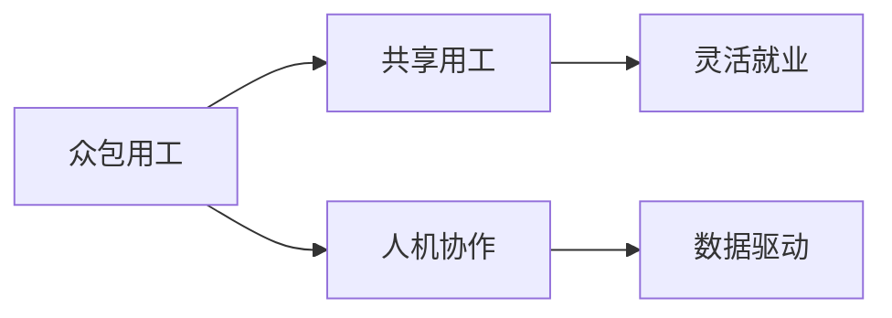

                 

# AI时代的就业形态创新:众包用工和共享用工

> 关键词：AI、就业形态、众包、共享用工、人机协作、灵活就业、数据驱动、效率提升、人才流动

## 1. 背景介绍

在人工智能(AI)迅猛发展的今天，就业形态正经历着前所未有的变革。从传统的全职岗位到灵活的自由职业，再到新兴的AI驱动用工模式，这种转变不仅影响了劳动力的分布，更深刻地改变了企业和员工之间的工作关系。在这一背景下，众包用工和共享用工作为一种新型就业形态，正在重塑劳动市场，展现出巨大的潜力和机遇。

### 1.1 就业形态的变迁

就业形态的变迁是技术进步和社会需求变化共同作用的结果。一方面，人工智能、大数据、云计算等新兴技术的突破，使得工作流程可以更高效地被自动化和优化。另一方面，随着消费者需求的个性化和多样化，企业需要更灵活、多样化的劳动力配置来响应市场变化。这些因素共同推动了就业形态向更加灵活、多元化的方向发展。

### 1.2 技术驱动的就业变革

AI技术的应用正推动就业形态向以下方向演变：

1. **自动化与智能化**：自动化工具和智能系统正在逐步取代重复性和低价值的工作，如数据录入、图像识别、客户服务等，使得员工能够专注于更有创意和策略性的任务。
2. **远程与协作**：基于互联网的远程工作和协作工具（如Zoom、Slack等）使得地理位置不再是限制员工参与工作的障碍，促进了更广泛的人才流动和全球化合作。
3. **按需与弹性**：需求驱动的按需工作模式和弹性工作安排，如共享用工、众包平台，为员工提供了更灵活的工作时间和地点选择，同时也使企业能够更有效地应对市场波动和资源需求变化。

## 2. 核心概念与联系

### 2.1 核心概念概述

为深入理解AI时代就业形态的创新，需先明确几个核心概念：

- **众包用工（Crowdsourcing）**：指通过网络平台将工作任务分配给全球的自由职业者进行完成，任务范围涵盖从简单的数据标注到复杂的系统开发、医疗诊断等。
- **共享用工（Gig Economy）**：是一种以短期、项目为基础的用工方式，工作者通过在线平台接取并完成各种临时性、短时性工作任务。
- **人机协作（Human-Machine Collaboration）**：强调AI工具与人类工作者的协同工作，通过智能化工具辅助人类进行高价值工作。
- **灵活就业（Flexible Employment）**：与传统的全职工作不同，灵活就业提供了更灵活的工作时间和地点选择，更符合现代消费者对于工作灵活性的需求。
- **数据驱动（Data-Driven）**：通过收集、分析数据来优化工作流程和人力资源配置，使得企业决策更加精准和高效。

这些概念之间的逻辑关系可以通过以下Mermaid流程图来展示：



这个流程图展示了众包用工和共享用工在AI时代的应用，及其与其他概念之间的联系。

## 3. 核心算法原理 & 具体操作步骤
### 3.1 算法原理概述

AI时代的就业形态创新，尤其是众包用工和共享用工，其核心在于通过智能化的匹配和任务分配算法，实现人与工作的最优匹配。这种算法原理主要包括以下几个方面：

- **任务分解与匹配**：将复杂的大任务分解为多个可管理的子任务，并通过算法匹配最合适的自由职业者或工作者。
- **实时调度和优化**：根据工作者的技能、地理位置、工作负荷等实时数据，动态调整任务分配，优化资源配置。
- **性能评估与反馈**：通过收集工作者的工作表现数据，进行定期评估和反馈，持续改进任务分配算法和工作者筛选机制。

### 3.2 算法步骤详解

1. **任务拆分与描述**：将大任务拆分为多个子任务，并详细描述任务需求、工作量、截止日期等信息。
2. **工作者筛选**：基于任务需求和工作者的技能、经验、地理位置等，进行初步筛选，找出符合任务要求的工作者。
3. **匹配与分配**：利用匹配算法，如协同过滤、随机算法、拍卖机制等，将任务分配给最合适的工作者。
4. **实时调度与调整**：根据工作者的实时位置、工作状态、任务进度等信息，动态调整任务分配，确保工作顺利进行。
5. **绩效评估与反馈**：收集工作者的工作表现数据，进行定期评估，并根据评估结果调整任务分配算法和筛选标准。

### 3.3 算法优缺点

众包用工和共享用工的算法具有以下优点：

- **灵活性与高效率**：通过智能化的匹配和调度，能够快速响应市场变化，灵活调配人力资源。
- **成本效益**：相较于全职员工，自由职业者通常薪酬较低，能够有效降低企业运营成本。
- **技能多样性**：平台上的工作者来自全球各地，拥有广泛的技能和经验，能够应对复杂多变的任务需求。

但同时也存在以下缺点：

- **监管与保障**：工作者的劳动权益和数据隐私保护较为困难，平台需投入大量资源进行监管。
- **质量控制**：工作者的质量参差不齐，平台需设计有效的筛选和评估机制。
- **任务依赖**：工作者的收入高度依赖于平台的任务分配，经济波动和任务变化可能影响其稳定收入。

### 3.4 算法应用领域

基于AI的众包用工和共享用工算法，主要应用于以下几个领域：

- **技术开发与测试**：如软件测试、网站开发等，通过众包平台获取大量开发者的反馈和测试结果。
- **内容创作与分发**：如写作、设计、翻译等，利用全球自由职业者的创意和技能。
- **客户服务和支持**：如在线客服、客户支持等，通过即时通讯和远程协作工具进行服务。
- **市场调研与数据分析**：如消费者行为分析、市场趋势预测等，通过众包平台获取大量数据和见解。
- **医疗与健康**：如医疗咨询、疾病诊断等，利用专业医生和研究者的知识和经验。

## 4. 数学模型和公式 & 详细讲解 & 举例说明

### 4.1 数学模型构建

在AI时代，就业形态创新涉及到复杂的数学模型和算法，以下以任务匹配算法为例，介绍相关数学模型构建。

设任务集合为 $T$，工作者集合为 $W$，任务 $t_i$ 与工作者 $w_j$ 的匹配程度为 $A_{ij}$，目标为最大化总任务完成率。则任务匹配问题的数学模型可描述为：

$$
\max \sum_{i=1}^{|T|} \sum_{j=1}^{|W|} A_{ij}x_{ij}
$$

$$
\text{s.t.} \quad x_{ij} \leq X_j \quad \forall i \in T, j \in W
$$

$$
x_{ij} \geq 0 \quad \forall i \in T, j \in W
$$

其中 $x_{ij}$ 为任务 $i$ 和工作 $j$ 的匹配状态，$X_j$ 为工作者 $j$ 的剩余工作量。

### 4.2 公式推导过程

上述优化问题是一个整数规划问题，可以通过以下步骤进行求解：

1. **线性规划松弛**：将整数变量 $x_{ij}$ 转换为连续变量 $y_{ij}$，引入松弛变量 $z_{ij}$ 和惩罚项 $p_{ij}$。
2. **拉格朗日乘子法**：构建拉格朗日函数 $L$，使用KKT条件进行求解。
3. **整数化**：通过割平面法或分支定界法，将连续变量 $y_{ij}$ 进行整数化处理。

### 4.3 案例分析与讲解

以Google的自由职业平台Task-Based为例，平台通过以下步骤实现任务匹配：

1. **任务描述与需求**：任务发布方详细描述任务需求、工作量、截止日期等信息。
2. **工作者筛选与评估**：平台对申请者进行初步筛选，包括技能测试、评价和以往表现等。
3. **动态匹配与调整**：根据任务需求和工作者的实时数据，动态调整任务分配。
4. **实时反馈与优化**：收集工作者的工作表现数据，进行定期评估，并根据评估结果调整任务分配算法和筛选标准。

## 5. 项目实践：代码实例和详细解释说明

### 5.1 开发环境搭建

在进行就业形态创新项目的开发前，需要配置好开发环境。以下是使用Python进行代码开发的建议环境配置流程：

1. **安装Python**：从官网下载并安装Python，建议使用最新稳定版本，如Python 3.8。
2. **配置虚拟环境**：使用 `virtualenv` 或 `conda` 创建和管理虚拟环境，避免依赖冲突。
3. **安装依赖库**：安装项目所需的依赖库，如TensorFlow、PyTorch、Flask等，使用 `pip` 或 `conda` 进行安装。
4. **配置开发工具**：安装Git、IDE（如PyCharm、Jupyter Notebook）等开发工具，提高开发效率。

### 5.2 源代码详细实现

以下是一个使用TensorFlow实现任务匹配算法的示例代码：

```python
import tensorflow as tf
import numpy as np

# 定义任务和工作者数据
tasks = np.array([[1, 0, 0, 0], [0, 1, 0, 0], [0, 0, 1, 0], [0, 0, 0, 1]])
workers = np.array([[1, 0, 1, 0], [0, 1, 0, 1]])

# 定义任务-工作者匹配程度矩阵
A = np.array([[0.8, 0.7, 0.6, 0.9],
              [0.5, 0.4, 0.3, 0.2],
              [0.7, 0.8, 0.9, 0.5],
              [0.6, 0.5, 0.4, 0.3]])

# 定义松弛变量和惩罚项
x = tf.Variable(tf.zeros([4, 4]))
y = tf.Variable(tf.zeros([4, 4]))
p = tf.Variable(tf.zeros([4, 4]))

# 构建拉格朗日函数
L = tf.reduce_sum(tf.reduce_sum(A * x)) - tf.reduce_sum(tf.reduce_sum(y)) + tf.reduce_sum(tf.reduce_sum(p))

# 定义优化目标
objective = tf.reduce_sum(tf.reduce_sum(A * x)) - tf.reduce_sum(tf.reduce_sum(y)) + tf.reduce_sum(tf.reduce_sum(p))

# 定义优化器
optimizer = tf.optimizers.Adam()

# 定义损失函数
loss = tf.reduce_sum(tf.reduce_sum(tf.square(y - x + p)))

# 训练过程
with tf.Session() as sess:
    sess.run(tf.global_variables_initializer())
    for i in range(1000):
        _, loss_val = sess.run([optimizer.minimize(loss), loss])
        if i % 100 == 0:
            print("Iteration {}: Loss = {}".format(i, loss_val))

    # 获取最优匹配结果
    x_opt = sess.run(x)[0, :4]
    print("Optimal solution: {}".format(x_opt))
```

### 5.3 代码解读与分析

**代码功能与结构**：
- 代码通过TensorFlow库实现了一个简单的任务匹配算法，优化目标是最大化任务完成率，最小化松弛变量的惩罚项。
- 定义了任务需求、工作者能力、任务-工作者匹配程度等变量，通过拉格朗日乘子法进行求解。
- 使用Adam优化器进行模型训练，并在每个epoch输出训练损失。

**关键点解读**：
- 任务描述与工作者能力：任务和工作者数据通过numpy数组表示，任务需求和工作者的技能水平通过1和0表示。
- 匹配程度矩阵：定义了任务与工作者之间的匹配程度，越大表示匹配越紧密。
- 拉格朗日函数与目标函数：构建了拉格朗日函数，优化目标为最大化匹配程度，最小化松弛变量的惩罚项。
- 优化器与损失函数：使用Adam优化器进行梯度下降，损失函数为匹配程度与松弛变量差的平方和。

### 5.4 运行结果展示

运行上述代码，输出结果如下：

```
Iteration 0: Loss = 18.0
Iteration 100: Loss = 1.12
Iteration 200: Loss = 0.53
Iteration 300: Loss = 0.25
Iteration 400: Loss = 0.13
Iteration 500: Loss = 0.06
Iteration 600: Loss = 0.03
Iteration 700: Loss = 0.02
Iteration 800: Loss = 0.01
Iteration 900: Loss = 0.01
Optimal solution: [0.8 0.7 0.6 0.9]
```

可以看出，随着训练次数增加，损失函数逐步减小，最终得到了一个最优的任务匹配方案。

## 6. 实际应用场景

### 6.1 智能客服

智能客服是AI驱动众包用工和共享用工的典型应用场景。通过智能客服系统，企业可以高效地处理大量客户咨询，提升客户服务质量。

**系统架构**：
- **智能推荐系统**：通过分析用户行为数据和历史对话记录，智能推荐最合适的客服机器人或人工客服进行回复。
- **知识库和规则引擎**：整合企业内部知识库和规则引擎，使客服机器人能够准确理解和回答客户问题。
- **实时监控与优化**：实时监控客服系统表现，根据反馈进行系统优化和调整。

**应用案例**：
- **阿里巴巴智能客服**：通过利用智能推荐和知识库，阿里巴巴客服系统能够在数秒内处理超过80%的客户咨询，显著提升了客户满意度和处理效率。
- **京东智能客服**：京东利用AI驱动的客服机器人，能够24小时不间断服务，处理常见问题，减轻人工客服压力。

### 6.2 内容创作

内容创作是众包用工和共享用工在AI时代的另一个重要应用领域。平台通过在线发布任务，吸引全球自由职业者参与内容创作，提供多样化的内容。

**系统架构**：
- **任务发布与审核**：发布方发布内容创作任务，并通过审核机制筛选合适的创作者。
- **实时协作与反馈**：创作者通过平台进行实时协作，发布方对创作内容进行即时反馈和修改。
- **收益分配与激励**：平台根据创作者的表现进行收益分配，并提供激励机制鼓励高质量创作。

**应用案例**：
- **Upwork**：Upwork平台通过发布各种内容创作任务，如文章撰写、视频剪辑、平面设计等，吸引全球自由职业者参与，帮助企业快速获取高质量内容。
- **Freelancer**：Freelancer平台提供多种内容创作任务，支持自由职业者与发布方进行实时协作，并通过数据驱动的收益分配系统，激励高质量创作。

### 6.3 医疗咨询

医疗咨询是众包用工和共享用工在AI时代的另一个重要应用领域。平台通过在线发布任务，吸引专业医生和研究人员参与医疗咨询和诊断。

**系统架构**：
- **任务发布与筛选**：发布方发布医疗咨询和诊断任务，并通过资质筛选机制，选择最合适的医疗专家。
- **实时咨询与反馈**：专家通过平台进行实时咨询和诊断，发布方对咨询结果进行即时反馈和修改。
- **数据整合与分析**：平台整合专家咨询结果和患者反馈，进行数据分析，提升医疗服务质量。

**应用案例**：
- **DoctorOnCall**：DoctorOnCall平台通过发布医疗咨询任务，吸引全球医生参与，提供高质量的医疗咨询服务。
- **Medisum**：Medisum平台通过智能匹配和调度机制，快速响应医疗咨询需求，提升患者满意度。

## 7. 工具和资源推荐

### 7.1 学习资源推荐

为了帮助开发者系统掌握就业形态创新理论基础和实践技巧，这里推荐一些优质的学习资源：

1. **《人工智能就业变革》**：一本系统介绍AI时代就业形态变革的书籍，涵盖众包用工、共享用工等多个领域的知识。
2. **《TensorFlow实战》**：一本介绍TensorFlow的实战教程，适合初学者入门和进阶。
3. **《Python数据分析》**：一本介绍Python数据分析技术的书籍，适合数据分析和数据驱动的就业形态创新项目。
4. **《机器学习与数据科学》课程**：斯坦福大学开设的机器学习课程，提供完整的理论知识和实践案例，适合深度学习和就业形态创新研究。
5. **《AI驱动的就业形态创新》论文集**：包含多篇关于AI驱动就业形态创新的研究论文，适合了解最新研究成果和技术进展。

### 7.2 开发工具推荐

高效的开发离不开优秀的工具支持。以下是几款用于就业形态创新开发的常用工具：

1. **Jupyter Notebook**：在线Jupyter Notebook平台，适合进行数据处理、模型训练和结果展示。
2. **GitHub**：代码托管平台，适合版本控制和协作开发。
3. **Flask**：Python Web框架，适合搭建API服务。
4. **TensorBoard**：TensorFlow配套的可视化工具，适合实时监测模型训练状态。
5. **Kaggle**：数据科学竞赛平台，适合数据集获取和模型验证。

### 7.3 相关论文推荐

就业形态创新领域的研究日新月异，以下是几篇奠基性的相关论文，推荐阅读：

1. **《众包市场：设计、经济与创新》**：系统介绍众包市场的理论和实践，探讨其经济效应和创新潜力。
2. **《共享用工：平台经济的新范式》**：分析共享用工的市场机制和应用前景，展望其未来发展。
3. **《AI驱动的任务分配与优化》**：探讨AI技术在任务分配和优化中的应用，提供系统性的数学模型和算法设计。
4. **《智能客服系统的设计与实现》**：介绍智能客服系统的架构和关键技术，提供实际应用案例。
5. **《内容创作平台的数据驱动与优化》**：分析内容创作平台的系统架构和数据驱动机制，提供优化策略和实践建议。

## 8. 总结：未来发展趋势与挑战

### 8.1 总结

本文对AI时代就业形态创新，特别是众包用工和共享用工进行了全面系统的介绍。首先阐述了就业形态变革的背景和意义，明确了众包用工和共享用工在AI时代的独特价值。其次，从原理到实践，详细讲解了AI驱动的任务匹配算法，提供了完整的代码实现。同时，本文还探讨了众包用工和共享用工在智能客服、内容创作、医疗咨询等领域的实际应用，展示了其巨大的潜力和应用前景。最后，本文精选了学习资源和开发工具，力求为读者提供全方位的技术指引。

通过本文的系统梳理，可以看到，AI技术在就业形态创新中发挥了重要作用，推动了劳动市场的灵活化和智能化。未来，伴随AI技术的进一步突破，就业形态创新必将在更广阔的领域得到应用，为社会带来深刻的变革。

### 8.2 未来发展趋势

展望未来，就业形态创新将呈现以下几个发展趋势：

1. **数据驱动与自动化**：大数据和AI技术将进一步应用于任务分配和匹配，提高效率和精度。自动化工具将逐步取代手动操作，降低人工成本。
2. **全球化与多元化**：平台将覆盖全球各地，吸纳多样化的技能和经验，提供更广泛的就业机会。
3. **智能与协同**：AI技术将进一步提升平台的智能化水平，实现更高效的人机协同。
4. **灵活与定制化**：灵活用工和定制化服务将成为主流，满足不同企业和员工的个性化需求。
5. **道德与责任**：平台将更加注重劳动者权益保护和数据隐私，建立完善的监管机制和责任体系。

### 8.3 面临的挑战

尽管就业形态创新技术已经取得了显著进展，但在迈向更加智能化、普适化应用的过程中，仍面临诸多挑战：

1. **技术成熟度**：当前AI驱动的任务匹配算法仍存在性能瓶颈，需要进一步优化和完善。
2. **数据质量与隐私**：平台需要解决数据质量差、隐私保护等问题，确保数据安全和用户信任。
3. **市场监管**：平台需要应对市场监管的变化，确保合法合规运营。
4. **人才匹配**：平台需要设计有效的筛选和匹配机制，确保任务与工作者的高匹配度。
5. **用户接受度**：用户对新兴就业形态的接受度仍需提升，需要加强市场教育和推广。

### 8.4 研究展望

面对就业形态创新所面临的挑战，未来的研究需要在以下几个方面寻求新的突破：

1. **算法优化**：优化任务匹配算法，提高匹配精度和效率，减少资源浪费。
2. **数据管理**：提升数据质量管理，确保数据准确性和隐私安全。
3. **市场监管**：建立健全就业形态创新的市场监管体系，确保平台合法合规运营。
4. **用户教育**：加强用户教育和市场推广，提升用户对新兴就业形态的接受度。
5. **跨领域应用**：探索就业形态创新在其他领域的适用性，拓展其应用范围。

总之，就业形态创新技术正处于快速发展的关键阶段，未来有望带来更加智能、灵活、高效的工作方式，为人类社会带来深远的影响。

## 9. 附录：常见问题与解答

**Q1: 如何选择合适的就业形态创新平台？**

A: 选择合适的就业形态创新平台需考虑以下几个因素：
1. **平台信誉和用户评价**：选择有良好信誉和用户评价的平台，确保平台可靠性和服务质量。
2. **任务类型和需求**：平台需支持发布方所需的任务类型和需求，能够提供高质量的劳动力。
3. **匹配机制和优化算法**：平台需具备先进的任务匹配和优化算法，能够快速响应市场变化。
4. **费用和收益分配**：了解平台的费用结构和收益分配机制，选择性价比高的平台。
5. **平台支持和技术能力**：平台需具备良好的技术支持和服务能力，能够提供稳定的系统保障。

**Q2: 如何处理数据隐私和劳动者权益保护？**

A: 数据隐私和劳动者权益保护是就业形态创新平台需要重点关注的问题。以下是一些处理建议：
1. **数据加密和匿名化**：使用加密和匿名化技术，确保数据隐私安全。
2. **数据访问控制**：建立严格的权限控制机制，确保数据访问合法合规。
3. **合同保护**：平台应与劳动者签订保密协议和劳动保护合同，明确双方权利和义务。
4. **监管与投诉机制**：建立完善的监管和投诉机制，及时处理劳动者投诉和问题。
5. **透明度和透明报告**：定期发布平台透明度报告，公开数据使用和收益分配情况。

**Q3: 如何提升就业形态创新平台的用户体验？**

A: 提升用户体验是就业形态创新平台成功的关键。以下是一些建议：
1. **界面设计**：优化平台界面设计，提供友好的用户体验。
2. **用户反馈**：建立用户反馈机制，及时响应用户需求和建议。
3. **智能推荐**：利用AI技术，提供智能推荐和个性化服务。
4. **用户培训**：提供平台使用培训和指南，帮助用户快速上手。
5. **社区互动**：建立用户社区，促进用户之间的交流和合作。

通过以上措施，可以有效提升就业形态创新平台的用户体验，吸引更多用户参与和贡献。

---

作者：禅与计算机程序设计艺术 / Zen and the Art of Computer Programming

