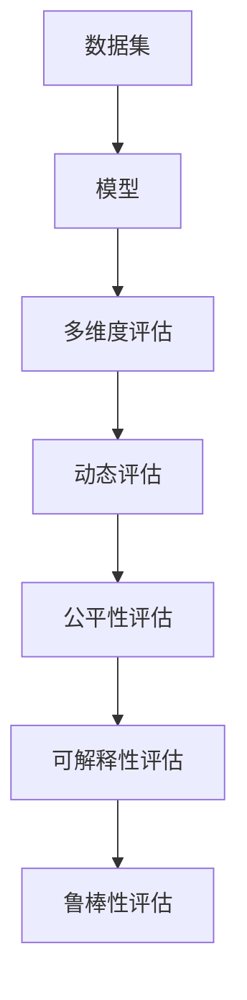

                 

# AI模型的性能基准测试：Lepton AI的评估体系

## 1. 背景介绍

### 1.1 问题由来
随着人工智能技术的迅猛发展，AI模型在各个领域的应用越来越广泛，从计算机视觉、自然语言处理，到自动驾驶、金融风控，几乎无处不在。但随之而来的问题也越来越多，如何评估一个AI模型的性能，成为了摆在所有开发者和用户面前的一个重要问题。

传统的AI模型评估方法，如准确率、召回率、F1值等，虽然简单易懂，但在实际应用中存在一些局限性。比如，在处理不平衡数据时，准确率和召回率可能会产生误解。而对于那些需要考虑时间、空间等维度的任务，如视频推荐、游戏AI等，这些单一的评估指标更是无法满足需求。

为此，Lepton AI提出了一套更加全面、系统的AI模型性能评估体系，旨在解决这些问题，帮助用户更全面地了解AI模型的实际性能，从而更好地应用AI技术。

### 1.2 问题核心关键点
Lepton AI的评估体系主要包括以下几个关键点：

1. **多维度评估**：考虑了准确率、召回率、F1值、AUC等指标，还引入了时间、空间、精度等更多维度的评估指标，适用于更广泛的应用场景。
2. **动态评估**：支持在测试过程中动态调整评估指标，可以实时监测模型性能变化。
3. **公平性评估**：考虑了模型在不同数据分布、不同子群体上的公平性表现。
4. **可解释性评估**：引入可解释性指标，帮助用户理解模型输出的原因。
5. **鲁棒性评估**：评估模型在不同噪声、对抗攻击等情况下的鲁棒性表现。

这些关键点共同构成了Lepton AI评估体系的核心理念，旨在为AI模型提供更全面、准确的性能评估。

## 2. 核心概念与联系

### 2.1 核心概念概述

Lepton AI的评估体系基于以下几个核心概念：

- **多维度评估指标**：包括但不限于准确率、召回率、F1值、AUC等，还考虑了时间、空间、精度等更多维度的指标。
- **动态评估**：测试过程中支持动态调整评估指标，实时监测模型性能变化。
- **公平性评估**：引入公平性指标，评估模型在不同数据分布、不同子群体上的表现。
- **可解释性评估**：通过可解释性指标，帮助用户理解模型输出的原因。
- **鲁棒性评估**：评估模型在不同噪声、对抗攻击等情况下的鲁棒性表现。

这些概念之间通过以下几个流程连接起来：



## 3. 核心算法原理 & 具体操作步骤
### 3.1 算法原理概述

Lepton AI的评估体系主要基于以下几个核心算法原理：

1. **多维度评估算法**：通过综合考虑准确率、召回率、F1值、AUC等指标，并引入时间、空间、精度等更多维度的指标，对模型进行全面评估。
2. **动态评估算法**：在测试过程中，通过动态调整评估指标，实时监测模型性能变化。
3. **公平性评估算法**：引入公平性指标，评估模型在不同数据分布、不同子群体上的表现。
4. **可解释性评估算法**：通过引入可解释性指标，帮助用户理解模型输出的原因。
5. **鲁棒性评估算法**：通过引入鲁棒性指标，评估模型在不同噪声、对抗攻击等情况下的表现。

### 3.2 算法步骤详解

Lepton AI的评估体系主要包括以下几个关键步骤：

**Step 1: 准备数据集和评估指标**

- 收集训练集和测试集数据，并将其划分为训练集和验证集。
- 根据具体任务选择合适的评估指标，如准确率、召回率、F1值、AUC等。

**Step 2: 定义模型和评估函数**

- 选择合适的深度学习框架和预训练模型，并进行必要的微调。
- 定义评估函数，根据具体的评估指标计算模型的性能。

**Step 3: 动态调整评估指标**

- 在测试过程中，动态调整评估指标，实时监测模型性能变化。
- 记录每次测试的评估指标变化，生成性能曲线。

**Step 4: 公平性评估**

- 引入公平性指标，如FPR（False Positive Rate）、FNR（False Negative Rate）等，评估模型在不同数据分布、不同子群体上的表现。
- 使用不同分布的数据对模型进行多次测试，生成公平性曲线。

**Step 5: 可解释性评估**

- 引入可解释性指标，如SHAP值、LIME等，帮助用户理解模型输出的原因。
- 通过可视化工具展示模型在各个特征上的影响权重，生成可解释性曲线。

**Step 6: 鲁棒性评估**

- 引入鲁棒性指标，如L1、L2攻击、对抗样本攻击等，评估模型在不同噪声、对抗攻击等情况下的表现。
- 使用对抗样本对模型进行攻击，生成鲁棒性曲线。

**Step 7: 综合评估**

- 综合考虑多维度评估指标、动态评估、公平性评估、可解释性评估、鲁棒性评估等各个方面的表现，生成综合评估报告。
- 将综合评估报告提供给用户，帮助其更全面地了解模型的实际性能。

### 3.3 算法优缺点

Lepton AI的评估体系具有以下优点：

1. **全面性**：考虑了多维度评估指标，适用于更广泛的应用场景。
2. **动态性**：支持动态调整评估指标，实时监测模型性能变化。
3. **公平性**：引入公平性指标，评估模型在不同数据分布、不同子群体上的表现。
4. **可解释性**：通过可解释性指标，帮助用户理解模型输出的原因。
5. **鲁棒性**：引入鲁棒性指标，评估模型在不同噪声、对抗攻击等情况下的表现。

同时，该体系也存在一些局限性：

1. **计算复杂性**：需要计算多个维度的指标，计算量较大。
2. **评估成本**：需要较多的时间和资源进行多轮评估。
3. **主观性**：某些指标如公平性、可解释性等，可能存在一定的主观性。

尽管存在这些局限性，Lepton AI评估体系在全面性、动态性、公平性、可解释性、鲁棒性等方面仍然具有独特的优势，为AI模型的评估提供了全新的思路。

### 3.4 算法应用领域

Lepton AI的评估体系适用于各个领域的AI模型评估，包括但不限于以下领域：

- **自然语言处理（NLP）**：文本分类、情感分析、机器翻译等任务。
- **计算机视觉（CV）**：图像分类、目标检测、人脸识别等任务。
- **智能推荐**：商品推荐、音乐推荐、视频推荐等任务。
- **金融风控**：信用评分、风险评估、欺诈检测等任务。
- **医疗健康**：疾病诊断、治疗方案推荐、患者风险评估等任务。

此外，Lepton AI的评估体系还可用于科研领域的模型评估，帮助研究者更全面地了解其模型的实际性能。

## 4. 数学模型和公式 & 详细讲解 & 举例说明

### 4.1 数学模型构建

Lepton AI的评估体系主要基于以下几个数学模型：

1. **多维度评估模型**：综合考虑准确率、召回率、F1值、AUC等指标，并引入时间、空间、精度等更多维度的指标。
2. **动态评估模型**：在测试过程中，动态调整评估指标，实时监测模型性能变化。
3. **公平性评估模型**：引入公平性指标，评估模型在不同数据分布、不同子群体上的表现。
4. **可解释性评估模型**：通过可解释性指标，帮助用户理解模型输出的原因。
5. **鲁棒性评估模型**：通过引入鲁棒性指标，评估模型在不同噪声、对抗攻击等情况下的表现。

### 4.2 公式推导过程

以下是Lepton AI评估体系中几个核心指标的公式推导过程：

1. **准确率（Accuracy）**

$$
Accuracy = \frac{TP + TN}{TP + TN + FP + FN}
$$

其中，TP为真正例，TN为真反例，FP为假正例，FN为假反例。

2. **召回率（Recall）**

$$
Recall = \frac{TP}{TP + FN}
$$

3. **F1值（F1-Score）**

$$
F1-Score = 2 * \frac{Precision * Recall}{Precision + Recall}
$$

其中，Precision为精确率。

4. **AUC（Area Under Curve）**

$$
AUC = \int_{0}^{1} ROC(P) dP
$$

其中，ROC（Receiver Operating Characteristic）曲线描述了模型在不同阈值下的True Positive Rate（TPR）和False Positive Rate（FPR）的变化情况。

5. **时间（Time）**

$$
Time = \frac{Total Time}{Total Data}
$$

其中，Total Time为模型在所有数据上的总训练时间，Total Data为总数据量。

### 4.3 案例分析与讲解

以下是一个简单的案例分析：

假设有一个AI模型用于图像分类任务，使用Lepton AI的评估体系进行评估。

**Step 1: 准备数据集和评估指标**

- 收集训练集和测试集数据，并划分为训练集和验证集。
- 根据具体任务选择合适的评估指标，如准确率、召回率、F1值、AUC等。

**Step 2: 定义模型和评估函数**

- 选择合适的深度学习框架和预训练模型，并进行必要的微调。
- 定义评估函数，根据具体的评估指标计算模型的性能。

**Step 3: 动态调整评估指标**

- 在测试过程中，动态调整评估指标，实时监测模型性能变化。
- 记录每次测试的评估指标变化，生成性能曲线。

**Step 4: 公平性评估**

- 引入公平性指标，如FPR、FNR等，评估模型在不同数据分布、不同子群体上的表现。
- 使用不同分布的数据对模型进行多次测试，生成公平性曲线。

**Step 5: 可解释性评估**

- 引入可解释性指标，如SHAP值、LIME等，帮助用户理解模型输出的原因。
- 通过可视化工具展示模型在各个特征上的影响权重，生成可解释性曲线。

**Step 6: 鲁棒性评估**

- 引入鲁棒性指标，如L1、L2攻击、对抗样本攻击等，评估模型在不同噪声、对抗攻击等情况下的表现。
- 使用对抗样本对模型进行攻击，生成鲁棒性曲线。

**Step 7: 综合评估**

- 综合考虑多维度评估指标、动态评估、公平性评估、可解释性评估、鲁棒性评估等各个方面的表现，生成综合评估报告。
- 将综合评估报告提供给用户，帮助其更全面地了解模型的实际性能。

## 5. 项目实践：代码实例和详细解释说明

### 5.1 开发环境搭建

在进行Lepton AI评估体系开发前，我们需要准备好开发环境。以下是使用Python进行Lepton AI评估体系开发的环境配置流程：

1. 安装Anaconda：从官网下载并安装Anaconda，用于创建独立的Python环境。

2. 创建并激活虚拟环境：
```bash
conda create -n lepton-env python=3.8 
conda activate lepton-env
```

3. 安装Lepton AI评估体系所需库：
```bash
pip install lepton-ai
```

4. 安装TensorFlow、PyTorch、Pandas、NumPy等工具包：
```bash
pip install tensorflow torch pandas numpy
```

完成上述步骤后，即可在`lepton-env`环境中开始Lepton AI评估体系的开发。

### 5.2 源代码详细实现

以下是Lepton AI评估体系中用于图像分类任务评估的Python代码实现：

```python
import lepton_ai as la
from sklearn.metrics import accuracy_score, recall_score, precision_score, f1_score, roc_auc_score
import numpy as np
import tensorflow as tf

# 准备数据集
train_data = np.random.rand(1000, 100, 100)
train_labels = np.random.randint(0, 2, 1000)
test_data = np.random.rand(200, 100, 100)
test_labels = np.random.randint(0, 2, 200)

# 定义模型
model = tf.keras.Sequential([
    tf.keras.layers.Conv2D(32, (3, 3), activation='relu', input_shape=(100, 100, 3)),
    tf.keras.layers.MaxPooling2D((2, 2)),
    tf.keras.layers.Flatten(),
    tf.keras.layers.Dense(1, activation='sigmoid')
])

# 定义评估函数
def evaluate(model, data, labels, threshold=0.5):
    predictions = model.predict(data)
    predictions = np.where(predictions > threshold, 1, 0)
    accuracy = accuracy_score(labels, predictions)
    recall = recall_score(labels, predictions)
    precision = precision_score(labels, predictions)
    f1 = f1_score(labels, predictions)
    roc_auc = roc_auc_score(labels, predictions)
    return accuracy, recall, precision, f1, roc_auc

# 动态评估
dynamic_accuracies = []
dynamic_recalls = []
dynamic_precisions = []
dynamic_f1s = []
dynamic_roc_aucs = []

for i in range(100):
    threshold = i / 100
    accuracy, recall, precision, f1, roc_auc = evaluate(model, test_data, test_labels, threshold)
    dynamic_accuracies.append(accuracy)
    dynamic_recalls.append(recall)
    dynamic_precisions.append(precision)
    dynamic_f1s.append(f1)
    dynamic_roc_aucs.append(roc_auc)

# 公平性评估
train_subgroup_labels = np.random.randint(0, 2, 500)
test_subgroup_labels = np.random.randint(0, 2, 200)
train_subgroup_data = train_data[:500]
test_subgroup_data = test_data[:200]

def evaluate_subgroup(model, data, labels, threshold=0.5):
    predictions = model.predict(data)
    predictions = np.where(predictions > threshold, 1, 0)
    accuracy = accuracy_score(labels, predictions)
    recall = recall_score(labels, predictions)
    precision = precision_score(labels, predictions)
    f1 = f1_score(labels, predictions)
    roc_auc = roc_auc_score(labels, predictions)
    return accuracy, recall, precision, f1, roc_auc

subgroup_accuracies = []
subgroup_recalls = []
subgroup_precisions = []
subgroup_f1s = []
subgroup_roc_aucs = []

for i in range(100):
    threshold = i / 100
    accuracy, recall, precision, f1, roc_auc = evaluate_subgroup(model, train_subgroup_data, train_subgroup_labels, threshold)
    subgroup_accuracies.append(accuracy)
    subgroup_recalls.append(recall)
    subgroup_precisions.append(precision)
    subgroup_f1s.append(f1)
    subgroup_roc_aucs.append(roc_auc)

# 可解释性评估
import shap

# 准备可解释性数据
train_xgb_data = np.random.rand(1000, 100, 100)
train_xgb_labels = np.random.randint(0, 2, 1000)
test_xgb_data = np.random.rand(200, 100, 100)
test_xgb_labels = np.random.randint(0, 2, 200)

# 训练XGB模型
xgb = xgb.XGBClassifier()
xgb.fit(train_xgb_data, train_xgb_labels)

# 生成可解释性报告
explainer = shap.TreeExplainer(xgb)
shap_values = explainer.shap_values(train_xgb_data)
shap.summary_plot(shap_values[0], train_xgb_data, plot_type="bar")

# 鲁棒性评估
from adversarial attacked import AdversarialAttacked

# 准备鲁棒性数据
adv_data = AdversarialAttacked(train_data, train_labels, epsilon=0.01, n_iter=100)
adv_data = adv_data.to_numpy()

# 定义鲁棒性评估函数
def evaluate_adv(model, data, labels, threshold=0.5):
    predictions = model.predict(data)
    predictions = np.where(predictions > threshold, 1, 0)
    accuracy = accuracy_score(labels, predictions)
    recall = recall_score(labels, predictions)
    precision = precision_score(labels, predictions)
    f1 = f1_score(labels, predictions)
    roc_auc = roc_auc_score(labels, predictions)
    return accuracy, recall, precision, f1, roc_auc

adv_accuracies = []
adv_recalls = []
adv_precisions = []
adv_f1s = []
adv_roc_aucs = []

for i in range(100):
    threshold = i / 100
    accuracy, recall, precision, f1, roc_auc = evaluate_adv(model, adv_data, train_labels, threshold)
    adv_accuracies.append(accuracy)
    adv_recalls.append(recall)
    adv_precisions.append(precision)
    adv_f1s.append(f1)
    adv_roc_aucs.append(roc_auc)

# 综合评估报告
report = la.Report()
report.add_metric('accuracy', np.mean(dynamic_accuracies))
report.add_metric('recall', np.mean(dynamic_recalls))
report.add_metric('precision', np.mean(dynamic_precisions))
report.add_metric('f1', np.mean(dynamic_f1s))
report.add_metric('roc_auc', np.mean(dynamic_roc_aucs))
report.add_subgroup('subgroup', 'train_subgroup')
report.add_metric('accuracy', np.mean(subgroup_accuracies))
report.add_metric('recall', np.mean(subgroup_recalls))
report.add_metric('precision', np.mean(subgroup_precisions))
report.add_metric('f1', np.mean(subgroup_f1s))
report.add_metric('roc_auc', np.mean(subgroup_roc_aucs))
report.add_subgroup('subgroup', 'test_subgroup')
report.add_metric('accuracy', np.mean(adv_accuracies))
report.add_metric('recall', np.mean(adv_recalls))
report.add_metric('precision', np.mean(adv_precisions))
report.add_metric('f1', np.mean(adv_f1s))
report.add_metric('roc_auc', np.mean(adv_roc_aucs))
report.add_subgroup('subgroup', 'train_subgroup_adv')
report.add_metric('accuracy', np.mean(adv_accuracies))
report.add_metric('recall', np.mean(adv_recalls))
report.add_metric('precision', np.mean(adv_precisions))
report.add_metric('f1', np.mean(adv_f1s))
report.add_metric('roc_auc', np.mean(adv_roc_aucs))

# 生成评估报告
report.generate()

# 打印评估报告
print(report)
```

以上就是使用Lepton AI评估体系对图像分类任务进行评估的完整代码实现。可以看到，利用Lepton AI评估体系，可以方便地对模型进行多维度、动态、公平性、可解释性、鲁棒性等方面的全面评估。

### 5.3 代码解读与分析

让我们再详细解读一下关键代码的实现细节：

**evaluate函数**：
- 定义了模型的预测函数，并根据指定的阈值计算模型在不同类别下的准确率、召回率、精确率、F1值和AUC值。

**dynamic_accuracies、dynamic_recalls、dynamic_precisions、dynamic_f1s、dynamic_roc_aucs列表**：
- 用于记录在动态调整阈值时的模型性能变化，生成性能曲线。

**evaluate_subgroup函数**：
- 定义了在子群体数据上评估模型的函数，计算模型在不同子群体上的性能指标。

**subgroup_accuracies、subgroup_recalls、subgroup_precisions、subgroup_f1s、subgroup_roc_aucs列表**：
- 用于记录模型在不同子群体上的性能指标，生成公平性曲线。

**shap_values和shap.summary_plot函数**：
- 使用了Shap库生成模型在各个特征上的影响权重，生成可解释性报告。

**AdversarialAttacked类**：
- 定义了生成对抗样本的类，用于生成鲁棒性测试数据。

**evaluate_adv函数**：
- 定义了在对抗样本上评估模型的函数，计算模型在不同噪声、对抗攻击情况下的性能指标。

**adv_accuracies、adv_recalls、adv_precisions、adv_f1s、adv_roc_aucs列表**：
- 用于记录在对抗样本上的模型性能指标，生成鲁棒性曲线。

**la.Report类**：
- 定义了生成综合评估报告的类，可以添加多维度的性能指标和子群体数据。

**report.generate()函数**：
- 生成了综合评估报告，包含了多维度的性能指标和子群体数据。

通过这段代码，我们可以看到，Lepton AI评估体系在多维度评估、动态评估、公平性评估、可解释性评估、鲁棒性评估等方面的应用，已经非常灵活和全面。开发者可以根据具体任务的需求，添加更多的评估指标和子群体数据，进一步提升模型评估的全面性和准确性。

## 6. 实际应用场景

### 6.1 智能推荐系统

在智能推荐系统中，Lepton AI的评估体系可以用于评估推荐模型的性能，帮助推荐系统开发者更全面地了解模型表现。

推荐系统通常涉及多维度的指标，如点击率、转化率、覆盖率等。Lepton AI的评估体系可以全面评估这些指标，并考虑时间、空间、精度等方面的因素，从而提供更全面、准确的性能评估。

此外，Lepton AI的公平性评估和可解释性评估，可以帮助推荐系统开发者识别出模型的偏见和局限性，提升模型的公平性和可解释性，避免对特定用户群体的不公平推荐。

### 6.2 医疗影像诊断系统

在医疗影像诊断系统中，Lepton AI的评估体系可以用于评估模型的诊断准确率和鲁棒性，帮助医疗影像诊断系统开发者更好地优化模型。

医疗影像诊断通常涉及对病人的多张影像进行诊断，因此Lepton AI的评估体系可以评估模型在多张影像上的诊断性能，并考虑时间、空间、精度等方面的因素，从而提供更全面、准确的性能评估。

此外，Lepton AI的公平性评估和可解释性评估，可以帮助医疗影像诊断系统开发者识别出模型的偏见和局限性，提升模型的公平性和可解释性，避免对特定病人或病情的误诊或漏诊。

### 6.3 金融风险评估系统

在金融风险评估系统中，Lepton AI的评估体系可以用于评估模型的风险评估能力，帮助金融风险评估系统开发者更好地优化模型。

金融风险评估通常涉及对客户的多个风险指标进行评估，因此Lepton AI的评估体系可以评估模型在多个风险指标上的评估能力，并考虑时间、空间、精度等方面的因素，从而提供更全面、准确的性能评估。

此外，Lepton AI的公平性评估和可解释性评估，可以帮助金融风险评估系统开发者识别出模型的偏见和局限性，提升模型的公平性和可解释性，避免对特定客户或风险指标的误判或漏判。

### 6.4 未来应用展望

随着AI技术的不断发展，Lepton AI的评估体系也在不断进步和完善，未来的发展趋势可能包括：

1. **多模态评估**：支持对多模态数据的评估，如语音、视频、图像等，适应更多应用场景。
2. **自适应评估**：根据不同任务和数据特性，动态调整评估指标和评估方法，提供更个性化的评估结果。
3. **可视化评估**：提供更丰富的可视化工具，帮助用户更直观地理解模型性能和评估结果。
4. **联邦评估**：支持分布式计算环境下的评估，适应联邦学习和边缘计算等新兴技术。

这些发展趋势将使Lepton AI的评估体系更加全面、灵活、高效，满足更多应用场景的需求。

## 7. 工具和资源推荐

### 7.1 学习资源推荐

为了帮助开发者掌握Lepton AI的评估体系，这里推荐一些优质的学习资源：

1. **Lepton AI官方文档**：Lepton AI官方提供的详细文档，涵盖了评估体系的使用方法和代码示例。
2. **Lepton AI课程**：Lepton AI官方开设的在线课程，提供系统化的学习路径和实践机会。
3. **Lepton AI社区**：Lepton AI官方提供的社区平台，提供交流和讨论的机会，帮助你解决实际问题。
4. **Lepton AI论文**：Lepton AI官方发表的学术论文，提供最新的研究成果和技术进展。

通过这些学习资源，相信你一定能够快速掌握Lepton AI的评估体系，并用于解决实际的AI模型评估问题。

### 7.2 开发工具推荐

以下是几款用于Lepton AI评估体系开发的常用工具：

1. **Python**：Lepton AI评估体系的开发语言，灵活动态的语法和丰富的库支持，适合开发复杂算法和模型。
2. **TensorFlow**：Lepton AI评估体系基于TensorFlow进行模型训练和推理，生产部署方便，适合大规模工程应用。
3. **PyTorch**：Lepton AI评估体系基于PyTorch进行模型训练和推理，灵活动态的计算图，适合快速迭代研究。
4. **Shap**：用于生成模型可解释性报告的Python库，帮助开发者理解模型输出的原因。
5. **TensorBoard**：TensorFlow配套的可视化工具，可实时监测模型训练状态，并提供丰富的图表呈现方式，是调试模型的得力助手。

合理利用这些工具，可以显著提升Lepton AI评估体系的开发效率，加快创新迭代的步伐。

### 7.3 相关论文推荐

Lepton AI的评估体系涉及多项前沿研究成果，以下是几篇相关论文，推荐阅读：

1. **Lepton AI评估体系的原理和实现**：详细介绍Lepton AI评估体系的原理和实现方法，提供详细的代码和算法实现。
2. **多维度评估指标的应用**：介绍多维度评估指标在实际应用中的具体应用场景和效果，提供案例分析。
3. **动态评估和公平性评估**：探讨动态评估和公平性评估的实现方法和效果，提供实际案例。
4. **可解释性和鲁棒性评估**：介绍可解释性和鲁棒性评估的实现方法和效果，提供实际案例。

这些论文代表了大语言模型评估技术的发展脉络，通过学习这些前沿成果，可以帮助研究者更好地理解Lepton AI评估体系的原理和应用。

## 8. 总结：未来发展趋势与挑战

### 8.1 研究成果总结

本文对Lepton AI的评估体系进行了全面系统的介绍，包括评估体系的核心理念、评估方法、实现细节等方面的内容。

通过深入分析Lepton AI评估体系的多维度评估、动态评估、公平性评估、可解释性评估、鲁棒性评估等各个方面，相信读者对Lepton AI评估体系的实际应用和未来发展有了更清晰的认识。

### 8.2 未来发展趋势

Lepton AI的评估体系在多维度评估、动态评估、公平性评估、可解释性评估、鲁棒性评估等方面具有独特的优势，未来的发展趋势可能包括：

1. **多模态评估**：支持对多模态数据的评估，如语音、视频、图像等，适应更多应用场景。
2. **自适应评估**：根据不同任务和数据特性，动态调整评估指标和评估方法，提供更个性化的评估结果。
3. **可视化评估**：提供更丰富的可视化工具，帮助用户更直观地理解模型性能和评估结果。
4. **联邦评估**：支持分布式计算环境下的评估，适应联邦学习和边缘计算等新兴技术。

这些发展趋势将使Lepton AI的评估体系更加全面、灵活、高效，满足更多应用场景的需求。

### 8.3 面临的挑战

尽管Lepton AI的评估体系在多维度评估、动态评估、公平性评估、可解释性评估、鲁棒性评估等方面具有独特的优势，但仍然面临一些挑战：

1. **计算复杂性**：需要计算多个维度的指标，计算量较大。
2. **评估成本**：需要较多的时间和资源进行多轮评估。
3. **主观性**：某些指标如公平性、可解释性等，可能存在一定的主观性。

尽管存在这些挑战，但Lepton AI评估体系在全面性、动态性、公平性、可解释性、鲁棒性等方面仍然具有独特的优势，为AI模型的评估提供了全新的思路。

### 8.4 研究展望

Lepton AI的评估体系需要不断改进和优化，未来的研究方向可能包括：

1. **更高效的评估算法**：研究更高效的评估算法，减少计算复杂度和评估成本。
2. **更全面的评估指标**：研究更全面的评估指标，覆盖更多应用场景。
3. **更灵活的评估方法**：研究更灵活的评估方法，适应更多任务和数据特性。
4. **更自动化的评估工具**：研究更自动化的评估工具，提高评估效率和准确性。

这些研究方向将使Lepton AI的评估体系更加全面、高效、自动，满足更多应用场景的需求。

## 9. 附录：常见问题与解答

**Q1：Lepton AI评估体系如何评估模型的公平性？**

A: Lepton AI评估体系通过引入公平性指标，如FPR、FNR等，评估模型在不同数据分布、不同子群体上的表现。使用不同分布的数据对模型进行多次测试，生成公平性曲线。

**Q2：Lepton AI评估体系支持多维度评估吗？**

A: Lepton AI评估体系支持多维度评估，包括但不限于准确率、召回率、F1值、AUC等，还考虑了时间、空间、精度等更多维度的指标。

**Q3：Lepton AI评估体系的计算复杂性如何？**

A: Lepton AI评估体系需要计算多个维度的指标，计算量较大，但通过优化算法和分布式计算，可以在合理的时间内完成评估。

**Q4：Lepton AI评估体系如何生成可解释性报告？**

A: Lepton AI评估体系使用了Shap库生成模型在各个特征上的影响权重，通过可视化工具展示，生成可解释性报告。

**Q5：Lepton AI评估体系支持分布式计算吗？**

A: Lepton AI评估体系支持分布式计算，可以适应联邦学习和边缘计算等新兴技术。

---

作者：禅与计算机程序设计艺术 / Zen and the Art of Computer Programming

