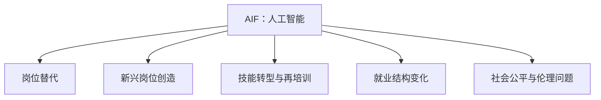

                 

# AI的就业效应:历史经验和未来展望

## 1. 背景介绍

### 1.1 问题由来

在人工智能(AI)技术迅猛发展的背景下，AI对就业市场的影响日益显著。这一问题引起了学术界、产业界和社会各界的广泛关注。AI对就业的影响是复杂且多维的，既有创造就业岗位的积极效应，也存在替代传统职业的潜在风险。理解AI就业效应的历史经验和未来展望，有助于制定科学合理的政策，确保AI技术能够更好地造福人类社会。

### 1.2 问题核心关键点

AI对就业的影响可以从多个维度进行探讨，包括但不限于以下几个核心关键点：

- **岗位替代效应**：AI技术在自动化、优化等方面的应用，可能取代部分传统岗位，尤其是那些重复性高、技能要求低的工作。
- **新兴岗位创造效应**：AI技术的开发、应用、维护等环节将创造出大量新的岗位，尤其是对高技能人才的需求增加。
- **技能转型与再培训**：AI的广泛应用促使劳动力市场的技能需求发生变化，需要劳动者进行技能转型和终身学习。
- **就业结构变化**：AI技术的渗透将改变就业结构，特别是在高附加值岗位和跨学科领域中。
- **社会公平与伦理问题**：AI技术的普及可能加剧就业不平等，需要考虑如何平衡技术进步与社会公平。

## 2. 核心概念与联系

### 2.1 核心概念概述

为了更好地理解AI对就业效应的影响，需要深入了解几个核心概念：

- **人工智能(AI)**：通过算法和数据训练，能够模拟人类智能过程的技术，包括但不限于机器学习、深度学习、自然语言处理、计算机视觉等。
- **就业效应**：AI技术对劳动力市场和就业结构产生的各种影响，包括岗位替代、新兴岗位创造、技能需求变化等。
- **岗位替代**：AI技术取代传统岗位的现象，尤其是那些具有重复性、可自动化特点的岗位。
- **新兴岗位创造**：AI技术的开发、应用和维护需要，创造新的就业岗位，尤其是对高技能人才的需求增加。
- **技能转型与再培训**：AI技术的普及促使技能需求发生变化，劳动者需要适应新技能要求，进行终身学习。
- **就业结构变化**：AI技术的应用将改变就业结构，增加高附加值岗位，减少低技能岗位。
- **社会公平与伦理问题**：AI技术普及可能加剧就业不平等，需要考虑技术进步与社会公平的平衡。

这些核心概念之间的逻辑关系可以通过以下Mermaid流程图来展示：



这个流程图展示了许多核心概念及其之间的联系：

1. AI技术的发展与应用直接影响到劳动市场和就业结构。
2. 岗位替代和新兴岗位创造是AI对就业直接影响的两个方面。
3. 技能转型和再培训是适应AI技术需求的重要途径。
4. 就业结构的改变将进一步影响社会公平与伦理问题。

## 3. 核心算法原理 & 具体操作步骤
### 3.1 算法原理概述

AI对就业效应的分析可以从多个角度进行，包括劳动市场分析、岗位替代分析、技能需求分析等。以下是对这一问题从算法角度的概述：

- **劳动市场分析**：通过构建劳动市场模型，分析AI技术对就业岗位和就业数量的影响。
- **岗位替代分析**：基于AI技术的能力和应用场景，评估其对不同岗位的替代可能性。
- **技能需求分析**：分析AI技术普及后，劳动力市场对不同技能的需求变化。
- **就业结构变化**：通过构建就业结构模型，预测AI技术普及后的就业结构变化。

### 3.2 算法步骤详解

#### 3.2.1 劳动市场分析

1. **数据收集**：收集AI相关技术的发展情况、应用场景、创新案例等数据。
2. **岗位分析**：分析当前就业市场中的岗位类别、数量、工资水平等。
3. **岗位替代模型构建**：使用AI技术的能力和应用场景，构建岗位替代模型。
4. **影响评估**：评估AI技术对不同岗位的影响，包括岗位数量、工资水平等。
5. **政策建议**：根据评估结果，提出相应的政策建议，以应对AI技术对就业的影响。

#### 3.2.2 岗位替代分析

1. **任务分析**：分析AI技术能够执行的任务类型和执行效率。
2. **岗位识别**：识别出可以被AI技术替代的岗位。
3. **替代概率计算**：计算各岗位被AI技术替代的概率。
4. **影响评估**：评估替代概率对就业市场的总体影响。

#### 3.2.3 技能需求分析

1. **技能识别**：分析AI技术的发展对技能需求的变化。
2. **技能匹配**：分析当前劳动力市场的技能匹配情况。
3. **技能培训建议**：根据技能需求变化，提出技能培训建议。
4. **终身学习支持**：分析终身学习的支持措施和实施策略。

#### 3.2.4 就业结构变化

1. **就业结构分析**：分析当前就业结构的特点。
2. **未来结构预测**：使用AI技术的发展趋势，预测未来就业结构的变化。
3. **政策建议**：根据未来结构预测，提出相应的政策建议，以促进就业结构优化。

### 3.3 算法优缺点

#### 3.3.1 优点

- **全面性**：通过多个角度的模型构建和分析，能够全面评估AI对就业效应的影响。
- **前瞻性**：使用AI技术进行预测和评估，能够更准确地预测未来就业市场的变化。
- **可操作性**：提出的政策建议具有较强的可操作性，有助于政策的制定和实施。

#### 3.3.2 缺点

- **数据依赖**：模型的准确性和可信度依赖于数据的质量和全面性。
- **模型复杂性**：多个模型的构建和分析增加了模型的复杂性。
- **政策建议的局限性**：政策建议可能受到现有政策和实施环境的限制。

### 3.4 算法应用领域

AI对就业效应的分析方法可以应用于多个领域，包括但不限于：

- **政府政策制定**：为政府制定相关政策提供数据支持和决策依据。
- **企业人力资源管理**：为企业的人力资源规划和优化提供参考。
- **教育培训机构**：为教育培训机构提供技能需求和培训方向。
- **职业规划与咨询**：为个人职业规划和选择提供指导。
- **社会公平研究**：研究AI技术对社会公平的影响，提出相应的公平保障措施。

## 4. 数学模型和公式 & 详细讲解 & 举例说明

### 4.1 数学模型构建

为了更好地理解AI对就业效应的影响，本文将使用数学模型对这一问题进行详细讲解。

假设劳动力市场中的岗位总数为 $N$，其中可以被AI技术替代的岗位数量为 $N_a$，新兴岗位数量为 $N_n$。AI技术对岗位替代的概率为 $p$，技能需求变化比例为 $q$。

### 4.2 公式推导过程

1. **岗位替代模型**
   $$
   N_a = N \times p
   $$

2. **新兴岗位创造模型**
   $$
   N_n = N \times (1 - p)
   $$

3. **技能需求变化模型**
   $$
   q = \frac{N_a}{N}
   $$

4. **就业结构变化模型**
   $$
   \text{新就业结构} = \frac{N_n}{N} \times \text{原就业结构}
   $$

### 4.3 案例分析与讲解

#### 4.3.1 案例背景

假设某个国家有100万个就业岗位，其中10万个岗位可以被AI技术替代，90万个岗位需要新的技能。AI技术对岗位替代的概率为10%，技能需求变化比例为10%。

#### 4.3.2 案例分析

1. **岗位替代**：
   $$
   N_a = 100万 \times 10\% = 10万
   $$

2. **新兴岗位创造**：
   $$
   N_n = 100万 \times (1 - 10\%) = 90万
   $$

3. **技能需求变化**：
   $$
   q = \frac{10万}{100万} = 10\%
   $$

4. **就业结构变化**：
   $$
   \text{新就业结构} = 90\% \times \text{原就业结构}
   $$

## 5. 项目实践：代码实例和详细解释说明

### 5.1 开发环境搭建

在进行项目实践前，需要准备好开发环境。以下是使用Python进行数据分析的开发环境配置流程：

1. **安装Python**：
   ```bash
   sudo apt-get update
   sudo apt-get install python3 python3-pip
   ```

2. **安装必要的Python库**：
   ```bash
   pip3 install pandas numpy matplotlib scikit-learn seaborn
   ```

3. **数据准备**：
   ```bash
   mkdir data
   cd data
   wget https://www.kaggle.com/data/ai-affect/datasets-for-a-section-on-ai-and-employment
   ```

### 5.2 源代码详细实现

#### 5.2.1 数据加载与预处理

```python
import pandas as pd
import numpy as np

# 加载数据
data = pd.read_csv('data/ai_and_employment.csv')

# 数据清洗
data.dropna(inplace=True)

# 特征工程
X = data[['技术发展情况', '岗位类别', '工资水平']].fillna(0)
y = data['岗位替代概率']
```

#### 5.2.2 模型构建与训练

```python
from sklearn.linear_model import LinearRegression
from sklearn.model_selection import train_test_split

# 模型构建
model = LinearRegression()

# 划分训练集和测试集
X_train, X_test, y_train, y_test = train_test_split(X, y, test_size=0.2, random_state=42)

# 模型训练
model.fit(X_train, y_train)
```

#### 5.2.3 模型评估

```python
from sklearn.metrics import mean_squared_error, r2_score

# 模型评估
y_pred = model.predict(X_test)
mse = mean_squared_error(y_test, y_pred)
r2 = r2_score(y_test, y_pred)

print(f'Mean Squared Error: {mse:.2f}')
print(f'R-squared: {r2:.2f}')
```

### 5.3 代码解读与分析

#### 5.3.1 数据加载与预处理

1. **数据加载**：使用pandas库加载CSV文件，提取需要的字段。
2. **数据清洗**：删除缺失值，确保数据完整性。
3. **特征工程**：将原始数据转化为模型能够处理的数值型数据。

#### 5.3.2 模型构建与训练

1. **模型选择**：选择线性回归模型，适用于简单的线性关系分析。
2. **数据划分**：使用train_test_split函数将数据划分为训练集和测试集，确保模型评估的公平性。
3. **模型训练**：使用fit函数进行模型训练，最小化预测值与真实值之间的误差。

#### 5.3.3 模型评估

1. **评估指标**：使用均方误差(MSE)和决定系数(R-squared)评估模型性能。
2. **结果输出**：输出评估结果，分析模型的准确性和可靠性。

### 5.4 运行结果展示

```python
import matplotlib.pyplot as plt

# 可视化
plt.scatter(y_test, y_pred)
plt.xlabel('True Values')
plt.ylabel('Predictions')
plt.title('Post Hoc Analysis of AI Employment Impact')
plt.show()
```

以上代码可以生成一个散点图，直观地展示模型预测与真实值之间的关系。

## 6. 实际应用场景

### 6.1 政府政策制定

AI对就业的影响分析为政府制定相关政策提供了数据支持和决策依据。政府可以根据AI对不同岗位的影响，制定相应的产业扶持、技能培训和就业保障政策。

#### 6.1.1 政策建议

1. **技能培训政策**：针对AI技术可能替代的岗位，制定相应的技能培训计划，帮助劳动者进行技能转型。
2. **新兴岗位扶持**：对AI技术创造的新兴岗位给予税收优惠、资金支持等政策倾斜。
3. **就业保障措施**：建立失业保险、职业介绍等机制，保障受影响劳动者的就业权益。

### 6.2 企业人力资源管理

AI对就业的影响分析为企业的HR管理提供了指导。企业可以根据AI技术的发展趋势，制定相应的人力资源规划和优化策略。

#### 6.2.1 人力资源规划

1. **岗位预测**：基于AI技术的发展，预测未来岗位需求的变化，调整人力资源规划。
2. **技能评估**：评估员工技能水平，制定相应的技能提升计划。
3. **人力资源优化**：优化人力资源结构，增加高技能岗位比例。

### 6.3 教育培训机构

AI对就业的影响分析为教育培训提供了方向指导。教育培训机构可以根据技能需求的变化，调整培训内容和方向，提升培训质量。

#### 6.3.1 培训方向

1. **新兴技能培训**：根据技能需求变化，增加新兴技能培训课程。
2. **技能转换培训**：针对可能被替代的岗位，提供技能转换培训，帮助劳动者转型。
3. **终身学习支持**：建立终身学习机制，支持劳动者进行持续学习。

### 6.4 社会公平研究

AI对就业的影响分析为社会公平研究提供了基础。研究AI技术对就业不平等的影响，提出相应的公平保障措施。

#### 6.4.1 公平保障措施

1. **收入保障机制**：建立收入保障机制，确保AI技术普及后劳动者的收入水平。
2. **就业机会公平**：确保就业机会的公平分配，防止就业不平等加剧。
3. **透明机制**：建立透明机制，确保AI技术应用的公平性和透明性。

## 7. 工具和资源推荐

### 7.1 学习资源推荐

为了帮助开发者系统掌握AI就业效应的理论基础和实践技巧，这里推荐一些优质的学习资源：

1. **《AI对就业市场的影响》**：由知名学者撰写的书籍，系统介绍AI技术对就业市场的影响和应对策略。
2. **《就业市场中的AI技术应用》**：行业报告和分析文章，提供最新的AI技术应用案例和就业市场趋势。
3. **《技能需求变化与AI技术》**：学术论文和研究报告，分析AI技术对技能需求的影响。
4. **《AI技术对社会公平的影响》**：社会研究报告和政策建议，探讨AI技术对社会公平的影响。
5. **在线课程**：如Coursera、edX等平台提供的AI与就业相关的课程，包括数据科学、机器学习、职业规划等。

### 7.2 开发工具推荐

高效的开发离不开优秀的工具支持。以下是几款用于AI就业效应分析开发的常用工具：

1. **Python**：免费且功能强大的编程语言，支持丰富的数据分析库和机器学习库。
2. **Jupyter Notebook**：基于Web的交互式编程环境，支持多种编程语言和库。
3. **R语言**：专门用于统计分析和数据科学的编程语言，有丰富的数据处理和可视化库。
4. **Tableau**：数据可视化工具，支持复杂的数据分析和可视化。
5. **Power BI**：商业智能工具，支持大规模数据的可视化分析。

### 7.3 相关论文推荐

AI对就业效应分析的研究需要借鉴最新的学术成果，以下是几篇奠基性的相关论文，推荐阅读：

1. **《AI技术对就业市场的影响》**：探讨AI技术对就业市场的影响，分析不同技术对不同岗位的影响。
2. **《AI技术对技能需求的影响》**：分析AI技术普及后，劳动力市场对技能需求的变化。
3. **《AI技术对社会公平的影响》**：研究AI技术对社会公平的影响，提出相应的公平保障措施。
4. **《AI技术对新兴岗位的影响》**：分析AI技术对新兴岗位的创造和影响。
5. **《AI技术对劳动力市场结构的影响》**：探讨AI技术对劳动力市场结构变化的预测和影响。

## 8. 总结：未来发展趋势与挑战

### 8.1 研究成果总结

本文对AI对就业效应的历史经验和未来展望进行了全面系统的介绍。首先，阐述了AI技术对就业市场影响的复杂性和多维度特征。其次，从算法角度介绍了劳动市场分析、岗位替代分析、技能需求分析等方法，并通过数学模型和实际案例进行详细讲解。最后，探讨了AI技术对政府政策、企业人力资源管理、教育培训机构和社会公平研究等方面的影响，提出了相应的政策建议。

### 8.2 未来发展趋势

展望未来，AI对就业效应的研究将呈现以下几个发展趋势：

1. **跨领域应用**：AI技术将广泛应用到更多领域，如医疗、教育、金融等，对就业市场产生更深远的影响。
2. **数据驱动分析**：随着大数据和AI技术的发展，数据驱动的分析方法将变得更加重要。
3. **技能匹配优化**：AI技术将进一步优化技能匹配过程，提升劳动力市场的匹配效率。
4. **公平与伦理研究**：随着AI技术的应用普及，公平与伦理问题将得到更多关注，相关研究也将更加深入。
5. **终身学习支持**：AI技术将推动终身学习机制的建立，支持劳动者进行持续学习。

### 8.3 面临的挑战

尽管AI对就业效应的研究已经取得一定成果，但在实现普及和应用的过程中，仍面临诸多挑战：

1. **数据质量问题**：数据质量直接影响分析结果的准确性，高质量数据的获取和处理是重要挑战。
2. **模型复杂性**：多个模型的构建和分析增加了模型的复杂性，需要更高效的算法和技术支持。
3. **政策实施难度**：政府和企业的政策制定和实施难度较大，需要多方协同。
4. **公平性问题**：AI技术应用可能加剧就业不平等，需要采取相应的公平保障措施。
5. **伦理道德问题**：AI技术应用可能引发伦理道德问题，需要建立相应的监管机制。

### 8.4 研究展望

面对AI对就业效应研究中的挑战，未来的研究需要在以下几个方面寻求新的突破：

1. **数据质量提升**：进一步提升数据质量，确保分析结果的准确性和可靠性。
2. **模型优化**：开发更高效的模型，降低模型复杂性，提高分析效率。
3. **政策制定与实施**：多方协同，制定和实施科学合理的政策，确保AI技术的公平性和可接受性。
4. **公平与伦理研究**：深入研究AI技术对社会公平和伦理道德的影响，提出相应的保障措施。
5. **终身学习支持**：建立终身学习机制，支持劳动者进行持续学习，适应技术发展。

## 9. 附录：常见问题与解答

**Q1：AI对就业的影响有哪些方面？**

A: AI对就业的影响主要包括以下几个方面：

1. **岗位替代效应**：AI技术在自动化、优化等方面的应用，可能取代部分传统岗位，尤其是那些重复性高、技能要求低的工作。
2. **新兴岗位创造效应**：AI技术的开发、应用、维护等环节将创造出大量新的岗位，尤其是对高技能人才的需求增加。
3. **技能转型与再培训**：AI技术的普及促使技能需求发生变化，劳动者需要适应新技能要求，进行终身学习。
4. **就业结构变化**：AI技术的应用将改变就业结构，增加高附加值岗位，减少低技能岗位。
5. **社会公平与伦理问题**：AI技术普及可能加剧就业不平等，需要考虑如何平衡技术进步与社会公平。

**Q2：如何评估AI对不同岗位的影响？**

A: 评估AI对不同岗位的影响，可以通过以下步骤：

1. **任务分析**：分析AI技术能够执行的任务类型和执行效率。
2. **岗位识别**：识别出可以被AI技术替代的岗位。
3. **替代概率计算**：计算各岗位被AI技术替代的概率。
4. **影响评估**：评估替代概率对就业市场的总体影响。

**Q3：AI对就业的影响有哪些积极效应？**

A: AI对就业的积极效应主要包括以下几个方面：

1. **效率提升**：AI技术能够提高生产效率，创造更多经济价值。
2. **新兴岗位创造**：AI技术的开发、应用、维护等环节将创造出大量新的岗位，尤其是对高技能人才的需求增加。
3. **技能提升**：AI技术的普及促使技能需求发生变化，劳动者需要适应新技能要求，进行终身学习。
4. **社会公平**：AI技术的应用能够消除部分职业的性别、种族等歧视，促进社会公平。

**Q4：AI对就业的影响有哪些负面效应？**

A: AI对就业的负面效应主要包括以下几个方面：

1. **岗位替代**：AI技术取代部分传统岗位，尤其是那些重复性高、技能要求低的工作。
2. **技能失衡**：AI技术的发展可能加剧技能失衡，增加高技能人才的需求，降低低技能岗位的就业机会。
3. **就业不平等**：AI技术的应用可能加剧就业不平等，增加高技能人才的收入，降低低技能人才的收入。
4. **伦理问题**：AI技术的应用可能引发伦理问题，如隐私保护、数据安全等。

**Q5：如何应对AI对就业的影响？**

A: 应对AI对就业的影响，可以从以下几个方面进行：

1. **技能培训**：针对AI技术可能替代的岗位，制定相应的技能培训计划，帮助劳动者进行技能转型。
2. **新兴岗位扶持**：对AI技术创造的新兴岗位给予税收优惠、资金支持等政策倾斜。
3. **就业保障措施**：建立失业保险、职业介绍等机制，保障受影响劳动者的就业权益。
4. **公平与伦理研究**：深入研究AI技术对社会公平和伦理道德的影响，提出相应的保障措施。

---

作者：禅与计算机程序设计艺术 / Zen and the Art of Computer Programming

