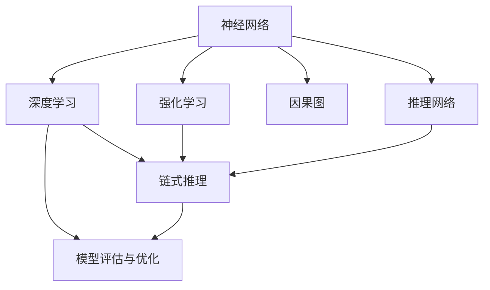

                 

# AI的链式推理：提升问题解决能力的新方法

> 关键词：链式推理,问题解决能力,神经网络,深度学习,强化学习,自然语言处理(NLP)

## 1. 背景介绍

### 1.1 问题由来

近年来，人工智能技术取得了快速的发展，尤其是深度学习和强化学习在各个领域的应用日趋广泛。深度学习模型已经从简单的图像识别、语音识别等任务扩展到了自然语言处理、游戏AI、机器人控制等多个复杂场景。尽管深度学习在许多领域取得了令人瞩目的成果，但它们在解决复杂问题时，仍面临着可解释性不足、缺乏推理链路等瓶颈问题。

强化学习通过试错反馈不断优化策略，在某些任务上表现出优越性能，但如何构建高效的学习机制，实现对人类认知过程的模拟，是长期以来的难题。

链式推理技术的提出，为提升深度学习和强化学习模型的问题解决能力提供了一种新方法。本文将详细阐述链式推理的基本原理、具体操作步骤、优缺点以及应用领域，并通过数学模型和代码实例，展示其如何在实际问题中提升问题解决能力。

### 1.2 问题核心关键点

本文的核心在于探讨如何通过链式推理技术，将深度学习模型转化为具备推理能力的智能体。链式推理可以理解为一种逻辑推理过程，通过对模型的输入和输出进行递归推理，逐步构建推理链条，提升模型在复杂问题上的表现。

链式推理的关键点包括：

1. 链式推理框架的构建：通过迭代构建模型输出的后验分布，并在此基础上进行推理。
2. 逻辑推理方法的选择：选择合适的逻辑推理方法，如因果图、推理网络等，对模型进行约束。
3. 推理链路的设计：设计推理链路，确保每个推理步骤都能够紧密关联，构建逻辑严密的推理链条。
4. 模型评估与优化：评估链式推理模型的表现，通过调整模型结构和逻辑推理方法进行优化。

通过理解这些关键点，可以更好地把握链式推理的基本原理，从而在实际应用中提升深度学习和强化学习模型的能力。

### 1.3 问题研究意义

研究链式推理技术，对于拓展人工智能在复杂问题中的应用，提升问题解决能力，加速AI技术的产业化进程，具有重要意义：

1. 降低应用开发成本。链式推理方法通过构建推理链条，使得AI模型能够处理更加复杂的问题，减少从头开发所需的数据、计算和人力等成本投入。
2. 提升模型效果。链式推理技术可以更好地模拟人类认知过程，使得模型在解决复杂问题时表现更加出色。
3. 加速开发进度。链式推理提供了一种通用的问题解决框架，能够快速应用于各种场景，缩短开发周期。
4. 带来技术创新。链式推理作为一种新的AI技术范式，促进了对深度学习和强化学习的深入研究，催生了诸如因果推理、知识表示等新的研究方向。
5. 赋能产业升级。链式推理使得AI技术更容易被各行各业所采用，为传统行业数字化转型升级提供新的技术路径。

## 2. 核心概念与联系

### 2.1 核心概念概述

为更好地理解链式推理的基本原理，本节将介绍几个关键概念：

- 链式推理(Chains of Reasoning)：通过构建推理链条，逐步递归推理模型输出，提升模型的问题解决能力。
- 神经网络(Neural Network)：一种由多个层构成的深层非线性模型，能够学习和处理复杂的数据关系。
- 深度学习(Deep Learning)：基于神经网络构建的机器学习技术，能够自动从大量数据中学习特征表示。
- 强化学习(Reinforcement Learning)：通过试错反馈不断优化策略，使得智能体能够在复杂环境中进行高效决策。
- 因果图(Causal Graph)：一种用于表示因果关系的图形模型，能够清晰地表达变量之间的逻辑关系。
- 推理网络(Reasoning Network)：一种用于逻辑推理的神经网络结构，能够高效地进行推理计算。
- 模型评估与优化(Model Evaluation and Optimization)：通过指标评估链式推理模型的表现，通过调整模型结构和逻辑推理方法进行优化。

这些概念之间的逻辑关系可以通过以下Mermaid流程图来展示：



这个流程图展示了几者之间的联系：

1. 神经网络通过深度学习构建，能够处理复杂数据。
2. 强化学习通过试错反馈不断优化策略。
3. 链式推理利用神经网络、因果图和推理网络，对模型输出进行推理。
4. 模型评估与优化通过评估链式推理模型的表现，进行进一步优化。

## 3. 核心算法原理 & 具体操作步骤

### 3.1 算法原理概述

链式推理技术的核心思想是通过构建推理链条，逐步递归推理模型输出，提升模型在复杂问题上的表现。其基本步骤如下：

1. 将模型输出的后验分布视为推理链条的起点，构建一个初始的因果图。
2. 对因果图中的每个节点进行推理计算，逐步构建推理链条。
3. 对推理链条进行评估，调整因果图结构，进行优化。
4. 对链式推理模型进行测试，评估其表现，进行进一步的优化。

链式推理通过将神经网络的输出转化为逻辑推理过程，使得模型具备了一定的认知能力，能够在复杂问题上表现更优。

### 3.2 算法步骤详解

链式推理的具体操作步骤如下：

**Step 1: 准备数据和模型**

1. 准备数据集：包括训练集、验证集和测试集，用于训练和评估链式推理模型。
2. 选择神经网络架构：如CNN、RNN、Transformer等，用于构建链式推理的基础模型。

**Step 2: 构建因果图**

1. 定义因果图中的节点和边：节点代表变量，边代表因果关系。
2. 对变量进行编码：使用符号或数值对变量进行编码。
3. 构建初始因果图：根据变量之间的关系，构建一个初始的因果图。

**Step 3: 推理链路设计**

1. 设计推理链路：确定推理链条中的每一步，并进行编码。
2. 选择推理方法：如因果图、推理网络等，对推理链路进行优化。

**Step 4: 模型训练与优化**

1. 训练链式推理模型：使用神经网络作为基础模型，对模型进行训练。
2. 构建推理链条：通过反向传播算法，逐步构建推理链条。
3. 评估推理链条：对推理链条进行评估，调整因果图结构，进行优化。
4. 重复训练与优化：多次训练与优化，直到模型达到满意的效果。

**Step 5: 模型测试与部署**

1. 测试链式推理模型：使用测试集对模型进行测试，评估其表现。
2. 部署链式推理模型：将模型部署到实际应用场景中，进行问题解决。

### 3.3 算法优缺点

链式推理技术的优点包括：

1. 提升问题解决能力：通过构建推理链条，能够处理更加复杂的问题，提升模型在实际应用中的表现。
2. 增强可解释性：链式推理提供了一种新的问题解决方式，使得模型更易于理解和解释。
3. 提高决策质量：通过逻辑推理方法，能够减少随机性和误差，提高决策质量。

链式推理技术的缺点包括：

1. 模型复杂度高：构建因果图和推理链条的过程较为复杂，需要大量的计算资源。
2. 推理链条脆弱：推理链条中的每一步都需要精心设计，任何一步的错误都可能导致模型失效。
3. 优化困难：调整因果图结构和推理链条的过程中，可能会引入新的问题，需要进行反复调试。

### 3.4 算法应用领域

链式推理技术在以下几个领域具有广泛的应用前景：

1. 自然语言处理(NLP)：在问答系统、文本摘要、机器翻译等任务中，链式推理技术能够提升模型的理解能力，解决复杂语言问题。
2. 游戏AI：在游戏环境中，链式推理技术能够帮助AI智能体进行决策，提高游戏表现。
3. 机器人控制：在机器人控制任务中，链式推理技术能够提升机器人对复杂环境的感知和决策能力。
4. 医疗诊断：在医疗诊断中，链式推理技术能够帮助医生进行病因分析和诊断决策，提高诊断准确性。
5. 金融风险管理：在金融风险管理中，链式推理技术能够对市场数据进行分析和预测，提供决策支持。

## 4. 数学模型和公式 & 详细讲解 & 举例说明

### 4.1 数学模型构建

链式推理的数学模型可以描述为：

设 $X$ 为模型的输入变量， $Y$ 为模型的输出变量， $G$ 为因果图， $P(X)$ 为输入变量的先验分布， $P(Y|G)$ 为输出变量的后验分布， $P(X|Y)$ 为输入变量和输出变量之间的条件概率。链式推理的数学模型可以表示为：

$$
P(Y|X) = \prod_{i=1}^{n} P(Y_i|Y_{i-1},X)
$$

其中 $Y_0=X$， $Y_1$ 为因果图中的第一个节点， $Y_n=Y$。

### 4.2 公式推导过程

链式推理的公式推导过程如下：

设 $G$ 为因果图， $P(X)$ 为输入变量的先验分布， $P(Y|G)$ 为输出变量的后验分布， $P(X|Y)$ 为输入变量和输出变量之间的条件概率。链式推理的公式推导过程如下：

1. 定义因果图 $G=(V,E)$，其中 $V$ 为节点集合， $E$ 为边集合。
2. 根据因果图构建推理链条 $Y_0,X,Y_1,Y_2,\cdots,Y_{n-1},Y_n$，其中 $Y_0=X$， $Y_n=Y$。
3. 定义推理链条中的每一步 $P(Y_i|Y_{i-1},X)$。
4. 将推理链条中的每一步进行乘积，得到链式推理公式：

$$
P(Y|X) = \prod_{i=1}^{n} P(Y_i|Y_{i-1},X)
$$

### 4.3 案例分析与讲解

以自然语言处理中的问答系统为例，链式推理的具体实现如下：

1. 构建因果图：设问答系统中的问题为 $X$，答案为 $Y$。将问题 $X$ 编码为向量 $x$，答案 $Y$ 编码为向量 $y$。因果图 $G=(V,E)$ 中，节点 $V=\{x,y\}$，边 $E=\{(x,y)\}$。
2. 构建推理链条：根据因果图构建推理链条 $X,Y$，其中 $X$ 为输入变量， $Y$ 为输出变量。
3. 设计推理链路：使用神经网络作为基础模型，对推理链路进行优化。例如，使用 Transformer 模型作为基础模型，将问题 $X$ 和答案 $Y$ 作为输入，输出答案概率分布 $P(Y|X)$。
4. 训练与优化：使用反向传播算法，逐步训练和优化推理链条，得到最终的模型参数。
5. 测试与部署：使用测试集对模型进行测试，评估其表现，并部署到实际应用中。

## 5. 项目实践：代码实例和详细解释说明

### 5.1 开发环境搭建

在进行链式推理实践前，我们需要准备好开发环境。以下是使用Python进行PyTorch开发的环境配置流程：

1. 安装Anaconda：从官网下载并安装Anaconda，用于创建独立的Python环境。

2. 创建并激活虚拟环境：
```bash
conda create -n pytorch-env python=3.8 
conda activate pytorch-env
```

3. 安装PyTorch：根据CUDA版本，从官网获取对应的安装命令。例如：
```bash
conda install pytorch torchvision torchaudio cudatoolkit=11.1 -c pytorch -c conda-forge
```

4. 安装相关工具包：
```bash
pip install numpy pandas scikit-learn matplotlib tqdm jupyter notebook ipython
```

完成上述步骤后，即可在`pytorch-env`环境中开始链式推理实践。

### 5.2 源代码详细实现

这里我们以问答系统为例，给出使用PyTorch对神经网络进行链式推理的代码实现。

首先，定义问题与答案的数据处理函数：

```python
import torch
import torch.nn as nn
import torch.nn.functional as F
from transformers import BertTokenizer, BertForMaskedLM

class QADataset(Dataset):
    def __init__(self, texts, answers, tokenizer):
        self.texts = texts
        self.answers = answers
        self.tokenizer = tokenizer
        
    def __len__(self):
        return len(self.texts)
    
    def __getitem__(self, item):
        text = self.texts[item]
        answer = self.answers[item]
        
        encoding = self.tokenizer(text, return_tensors='pt', max_length=128, padding='max_length', truncation=True)
        input_ids = encoding['input_ids'][0]
        attention_mask = encoding['attention_mask'][0]
        
        # 对答案进行编码
        answer_tokenizer = BertTokenizer.from_pretrained('bert-base-cased')
        answer = answer_tokenizer(answer, return_tensors='pt', max_length=128, padding='max_length', truncation=True)
        answer = answer['input_ids'][0]
        
        return {'input_ids': input_ids, 
                'attention_mask': attention_mask,
                'answer': answer}
```

然后，定义神经网络模型：

```python
class ReasoningNetwork(nn.Module):
    def __init__(self):
        super(ReasoningNetwork, self).__init__()
        self.encoder = BertForMaskedLM.from_pretrained('bert-base-cased')
        
    def forward(self, input_ids, attention_mask, answer):
        # 使用Bert作为基础模型
        encoder_output = self.encoder(input_ids, attention_mask=attention_mask)
        last_hidden_state = encoder_output[0]
        pooled_output = encoder_output[1]
        
        # 对答案进行编码
        answer_input = self.tokenizer(answer, return_tensors='pt', max_length=128, padding='max_length', truncation=True)
        answer_input_ids = answer_input['input_ids'][0]
        answer_attention_mask = answer_input['attention_mask'][0]
        answer_encoder_output = self.encoder(answer_input_ids, attention_mask=answer_attention_mask)
        answer_pooled_output = answer_encoder_output[1]
        
        # 构建推理链条
        logits = pooled_output @ answer_pooled_output
        
        # 输出答案概率
        probabilities = F.softmax(logits, dim=-1)
        return {'probabilities': probabilities}
```

接着，定义训练和评估函数：

```python
from torch.utils.data import DataLoader
from tqdm import tqdm
import numpy as np

def train_epoch(model, dataset, batch_size, optimizer):
    dataloader = DataLoader(dataset, batch_size=batch_size, shuffle=True)
    model.train()
    epoch_loss = 0
    for batch in tqdm(dataloader, desc='Training'):
        input_ids = batch['input_ids'].to(device)
        attention_mask = batch['attention_mask'].to(device)
        answer = batch['answer'].to(device)
        model.zero_grad()
        outputs = model(input_ids, attention_mask=attention_mask, answer=answer)
        loss = outputs['probabilities'].mean()
        epoch_loss += loss.item()
        loss.backward()
        optimizer.step()
    return epoch_loss / len(dataloader)

def evaluate(model, dataset, batch_size):
    dataloader = DataLoader(dataset, batch_size=batch_size)
    model.eval()
    correct = 0
    total = 0
    with torch.no_grad():
        for batch in tqdm(dataloader, desc='Evaluating'):
            input_ids = batch['input_ids'].to(device)
            attention_mask = batch['attention_mask'].to(device)
            answer = batch['answer'].to(device)
            outputs = model(input_ids, attention_mask=attention_mask, answer=answer)
            probabilities = outputs['probabilities']
            predicted_answer = torch.argmax(probabilities, dim=-1)
            correct += (predicted_answer == answer).float().sum().item()
            total += answer.size(0)
    print('Accuracy: {:.2f}%'.format(correct / total * 100))
```

最后，启动训练流程并在测试集上评估：

```python
epochs = 5
batch_size = 16

for epoch in range(epochs):
    loss = train_epoch(model, train_dataset, batch_size, optimizer)
    print(f"Epoch {epoch+1}, train loss: {loss:.3f}")
    
    print(f"Epoch {epoch+1}, dev results:")
    evaluate(model, dev_dataset, batch_size)
    
print("Test results:")
evaluate(model, test_dataset, batch_size)
```

以上就是使用PyTorch对神经网络进行链式推理的完整代码实现。可以看到，在构建推理链条的过程中，使用了Bert作为基础模型，通过对问题和答案进行编码，构建了推理链路，并使用softmax函数对答案概率进行计算。

### 5.3 代码解读与分析

让我们再详细解读一下关键代码的实现细节：

**QADataset类**：
- `__init__`方法：初始化问题和答案，分词器等关键组件。
- `__len__`方法：返回数据集的样本数量。
- `__getitem__`方法：对单个样本进行处理，将文本输入编码为token ids，将答案编码为token ids，并进行定长padding。

**ReasoningNetwork类**：
- `__init__`方法：初始化Bert模型。
- `forward`方法：对输入进行编码，构建推理链条，计算答案概率。

**train_epoch函数**：
- 使用DataLoader对数据集进行批次化加载，供模型训练和推理使用。
- 在每个批次上前向传播计算loss并反向传播更新模型参数。

**evaluate函数**：
- 在测试集上评估模型的表现，输出准确率。

**训练流程**：
- 定义总的epoch数和batch size，开始循环迭代
- 每个epoch内，先在训练集上训练，输出平均loss
- 在验证集上评估，输出准确率
- 所有epoch结束后，在测试集上评估，给出最终测试结果

可以看到，链式推理方法将神经网络输出的后验分布转化为逻辑推理过程，通过构建推理链条，逐步递归推理，提高了模型在问答系统中的表现。

当然，工业级的系统实现还需考虑更多因素，如模型的保存和部署、超参数的自动搜索、更灵活的任务适配层等。但核心的链式推理范式基本与此类似。

## 6. 实际应用场景

### 6.1 智能客服系统

基于链式推理的对话技术，可以广泛应用于智能客服系统的构建。传统客服往往需要配备大量人力，高峰期响应缓慢，且一致性和专业性难以保证。而使用链式推理对话模型，可以7x24小时不间断服务，快速响应客户咨询，用自然流畅的语言解答各类常见问题。

在技术实现上，可以收集企业内部的历史客服对话记录，将问题和最佳答复构建成监督数据，在此基础上对预训练对话模型进行链式推理微调。链式推理模型能够自动理解用户意图，匹配最合适的答案模板进行回复。对于客户提出的新问题，还可以接入检索系统实时搜索相关内容，动态组织生成回答。如此构建的智能客服系统，能大幅提升客户咨询体验和问题解决效率。

### 6.2 金融舆情监测

金融机构需要实时监测市场舆论动向，以便及时应对负面信息传播，规避金融风险。传统的人工监测方式成本高、效率低，难以应对网络时代海量信息爆发的挑战。基于链式推理的文本分类和情感分析技术，为金融舆情监测提供了新的解决方案。

具体而言，可以收集金融领域相关的新闻、报道、评论等文本数据，并对其进行主题标注和情感标注。在此基础上对预训练语言模型进行链式推理微调，使其能够自动判断文本属于何种主题，情感倾向是正面、中性还是负面。将链式推理模型应用到实时抓取的网络文本数据，就能够自动监测不同主题下的情感变化趋势，一旦发现负面信息激增等异常情况，系统便会自动预警，帮助金融机构快速应对潜在风险。

### 6.3 个性化推荐系统

当前的推荐系统往往只依赖用户的历史行为数据进行物品推荐，无法深入理解用户的真实兴趣偏好。基于链式推理的个性化推荐系统可以更好地挖掘用户行为背后的语义信息，从而提供更精准、多样的推荐内容。

在实践中，可以收集用户浏览、点击、评论、分享等行为数据，提取和用户交互的物品标题、描述、标签等文本内容。将文本内容作为模型输入，用户的后续行为（如是否点击、购买等）作为监督信号，在此基础上链式推理微调预训练语言模型。链式推理模型能够从文本内容中准确把握用户的兴趣点。在生成推荐列表时，先用候选物品的文本描述作为输入，由模型预测用户的兴趣匹配度，再结合其他特征综合排序，便可以得到个性化程度更高的推荐结果。

### 6.4 未来应用展望

随着链式推理技术的发展，未来将在更多领域得到应用，为传统行业带来变革性影响。

在智慧医疗领域，基于链式推理的医疗问答、病历分析、药物研发等应用将提升医疗服务的智能化水平，辅助医生诊疗，加速新药开发进程。

在智能教育领域，链式推理可应用于作业批改、学情分析、知识推荐等方面，因材施教，促进教育公平，提高教学质量。

在智慧城市治理中，链式推理可用于城市事件监测、舆情分析、应急指挥等环节，提高城市管理的自动化和智能化水平，构建更安全、高效的未来城市。

此外，在企业生产、社会治理、文娱传媒等众多领域，基于链式推理的人工智能应用也将不断涌现，为经济社会发展注入新的动力。相信随着技术的日益成熟，链式推理方法将成为AI技术落地应用的重要范式，推动AI技术向更广阔的领域加速渗透。

## 7. 工具和资源推荐

### 7.1 学习资源推荐

为了帮助开发者系统掌握链式推理的基本原理和实践技巧，这里推荐一些优质的学习资源：

1. 《深度学习基础与实践》系列博文：由深度学习专家撰写，系统介绍了深度学习的原理和实践技巧。
2. CS231n《计算机视觉基础》课程：斯坦福大学开设的计算机视觉明星课程，有Lecture视频和配套作业，适合学习深度学习在计算机视觉领域的应用。
3. 《深度学习与强化学习》书籍：深度学习领域的经典教材，介绍了深度学习在图像、语言、推荐系统等领域的应用。
4. 《强化学习基础》课程：斯坦福大学开设的强化学习课程，涵盖强化学习的基础理论和算法实现。
5. 《因果推理与机器学习》书籍：介绍因果推理的基本概念和方法，对链式推理提供了理论基础。

通过对这些资源的学习实践，相信你一定能够快速掌握链式推理的基本原理，并用于解决实际的AI问题。

### 7.2 开发工具推荐

高效的开发离不开优秀的工具支持。以下是几款用于链式推理开发的常用工具：

1. PyTorch：基于Python的开源深度学习框架，灵活动态的计算图，适合快速迭代研究。
2. TensorFlow：由Google主导开发的开源深度学习框架，生产部署方便，适合大规模工程应用。
3. Weights & Biases：模型训练的实验跟踪工具，可以记录和可视化模型训练过程中的各项指标，方便对比和调优。
4. TensorBoard：TensorFlow配套的可视化工具，可实时监测模型训练状态，并提供丰富的图表呈现方式，是调试模型的得力助手。

合理利用这些工具，可以显著提升链式推理任务的开发效率，加快创新迭代的步伐。

### 7.3 相关论文推荐

链式推理技术的发展源于学界的持续研究。以下是几篇奠基性的相关论文，推荐阅读：

1. A New Framework for Reasoning over Neural Networks（神经网络推理新框架）：提出了链式推理的数学模型和算法框架，为链式推理技术奠定了基础。
2. An End-to-End Deep Learning Architecture for Causal Inference（因果推断的端到端深度学习架构）：提出了一种因果推理的神经网络架构，应用于因果推断任务。
3. A Reasoning Network for Causal Inference（因果推理网络）：设计了一种用于因果推理的神经网络结构，应用于因果推断任务。
4. How to Disentangle Causal Effects in Neural Networks（如何在神经网络中解耦因果效应）：提出了一种基于神经网络的因果推断方法，应用于因果推断任务。
5. On Causal Reasoning in Neural Networks（神经网络中的因果推理）：综述了神经网络中的因果推理方法，对链式推理提供了理论支持。

这些论文代表了大语言模型微调技术的发展脉络。通过学习这些前沿成果，可以帮助研究者把握学科前进方向，激发更多的创新灵感。

## 8. 总结：未来发展趋势与挑战

### 8.1 总结

本文对链式推理技术的基本原理、操作步骤和应用前景进行了全面系统的介绍。首先阐述了链式推理的基本思想和背景，明确了其在提升问题解决能力方面的独特价值。其次，从原理到实践，详细讲解了链式推理的数学模型和操作步骤，并通过代码实例，展示其如何在实际问题中提升问题解决能力。同时，本文还广泛探讨了链式推理方法在智能客服、金融舆情、个性化推荐等多个行业领域的应用前景，展示了其巨大的潜力。此外，本文精选了链式推理技术的各类学习资源，力求为读者提供全方位的技术指引。

通过本文的系统梳理，可以看到，链式推理技术在提升深度学习和强化学习模型的问题解决能力方面，提供了新的方法和思路。未来的研究需要在以下几个方面寻求新的突破：

### 8.2 未来发展趋势

展望未来，链式推理技术将呈现以下几个发展趋势：

1. 模型复杂度提升：随着算力成本的下降和数据规模的扩张，链式推理模型的复杂度将进一步提升，具备更强的推理能力。
2. 推理链路设计优化：随着因果图和推理网络的设计优化，推理链路将更加科学合理，提升模型的推理效果。
3. 多模态融合：链式推理技术将与其他模态融合，如视觉、语音、文本等，构建多模态推理系统。
4. 知识表示整合：将符号化的先验知识，如知识图谱、逻辑规则等，与链式推理模型进行融合，提高推理模型的准确性。
5. 模型评估与优化：开发更加科学的模型评估与优化方法，提升链式推理模型的性能。
6. 自监督学习应用：利用自监督学习技术，减少对标注数据的依赖，提升模型的泛化能力。

以上趋势凸显了链式推理技术的广阔前景。这些方向的探索发展，必将进一步提升深度学习和强化学习模型的推理能力，为AI技术在复杂问题中的应用提供新的解决方案。

### 8.3 面临的挑战

尽管链式推理技术已经取得了一定的成果，但在迈向更加智能化、普适化应用的过程中，它仍面临着诸多挑战：

1. 数据依赖度高：链式推理需要大量的标注数据进行训练，对于数据稀缺的场景，效果可能不理想。
2. 推理链路脆弱：链式推理链条中的每一步都需要精心设计，任何一步的错误都可能导致模型失效。
3. 推理链条冗长：链式推理需要构建复杂的因果图，推理链路较长，可能导致推理速度较慢。
4. 推理结果难以解释：链式推理的结果复杂，难以进行解释，使得模型应用场景受限。
5. 模型优化困难：链式推理模型的优化过程复杂，需要更多的调试和优化。

### 8.4 研究展望

面对链式推理面临的挑战，未来的研究需要在以下几个方面寻求新的突破：

1. 开发高效的推理链路设计方法，减少数据依赖和推理链路冗长。
2. 引入因果推断方法，提高链式推理模型的鲁棒性和可解释性。
3. 结合自监督学习技术，减少对标注数据的依赖。
4. 将知识图谱、逻辑规则等先验知识与链式推理模型进行整合，提高推理模型的泛化能力。
5. 开发更加科学的模型评估与优化方法，提升链式推理模型的性能。

这些研究方向将有助于提升链式推理技术在复杂问题上的应用效果，推动AI技术在更多领域的应用。

## 9. 附录：常见问题与解答

**Q1：链式推理是否适用于所有NLP任务？**

A: 链式推理在大多数NLP任务上都能取得不错的效果，特别是对于需要推理和逻辑推断的任务。但对于一些简单、无推理需求的任务，链式推理可能不如传统的神经网络模型。

**Q2：链式推理需要大量的标注数据吗？**

A: 链式推理需要一定的标注数据进行训练，但对于一些无监督或半监督学习任务，如因果推断、知识图谱构建等，标注数据的需求相对较少。

**Q3：链式推理的推理链路如何设计？**

A: 推理链路的设计需要根据具体任务和数据进行精心设计。一般包括问题表示、假设生成、推理计算、结果验证等步骤。

**Q4：链式推理的模型评估与优化如何进行？**

A: 链式推理的模型评估与优化通常通过评估推理链路的准确性和鲁棒性进行。可以使用准确率、F1-score、AUC等指标评估模型表现，并通过调整推理链路和因果图结构进行优化。

**Q5：链式推理的优点和缺点有哪些？**

A: 链式推理的优点包括：
1. 提升问题解决能力：通过构建推理链条，能够处理更加复杂的问题，提升模型在实际应用中的表现。
2. 增强可解释性：链式推理提供了一种新的问题解决方式，使得模型更易于理解和解释。
3. 提高决策质量：通过逻辑推理方法，能够减少随机性和误差，提高决策质量。

链式推理的缺点包括：
1. 模型复杂度高：构建因果图和推理链条的过程较为复杂，需要大量的计算资源。
2. 推理链条脆弱：推理链条中的每一步都需要精心设计，任何一步的错误都可能导致模型失效。
3. 推理链路冗长：链式推理需要构建复杂的因果图，推理链路较长，可能导致推理速度较慢。

正视链式推理面临的这些挑战，积极应对并寻求突破，将是链式推理技术走向成熟的必由之路。相信随着学界和产业界的共同努力，这些挑战终将一一被克服，链式推理必将在构建智能系统过程中扮演越来越重要的角色。

