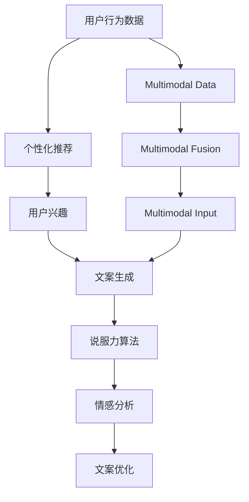

                 

# AI营销文案：个性化与说服力的结合

> 关键词：
- AI营销
- 个性化推荐
- 文案生成
- 用户行为分析
- 说服力算法
- 情感分析
- 多模态数据融合

## 1. 背景介绍

### 1.1 问题由来

随着数字化转型的加速，企业营销环境日益复杂化。传统的线性广告、搜索引擎优化(SEO)等方式，已难以满足用户的个性化需求和多样化的信息接受渠道。AI技术，尤其是自然语言处理(NLP)和大数据技术，为营销文案的生成和优化提供了新的解决方案。个性化和说服力的结合，成为提升营销效果的关键。

然而，目前大多数营销文案生成系统缺乏个性化特征，无法有效模拟人的思维和表达方式，导致文案与用户的匹配度不高，无法形成有效的互动和反馈。此外，传统的广告文案通常缺乏说服力，难以触及用户的情感共鸣，从而影响了文案的转化率和品牌认同度。

### 1.2 问题核心关键点

针对上述问题，AI营销文案的核心挑战在于：
- 如何根据用户的兴趣和行为特征，生成个性化的文案？
- 如何提升文案的说服力，激发用户的情感共鸣？
- 如何将个性化和说服力进行有机结合，生成高转化率的营销文案？
- 如何在不同的媒体渠道和情境下，生成适配的文案？

本文将围绕这些核心问题，深入探讨AI营销文案的生成机制、优化策略和应用场景，希望能为行业带来新的思考和突破。

## 2. 核心概念与联系

### 2.1 核心概念概述

AI营销文案生成涉及到以下关键概念：

- AI营销：利用人工智能技术，自动生成、优化和管理营销文案，以提升营销效果。
- 个性化推荐：根据用户的兴趣和行为特征，生成高度定制化的营销文案。
- 文案生成：使用AI算法自动生成有创意、有说服力的营销文案。
- 用户行为分析：通过对用户数据的挖掘和分析，发现用户行为模式和偏好，用于指导文案生成。
- 说服力算法：利用心理学和行为学原理，提升文案的说服力和影响力。
- 情感分析：通过自然语言处理技术，分析文案中的情感倾向，调整文案表达以激发情感共鸣。
- 多模态数据融合：将文本、图片、视频等多种类型的数据进行融合，丰富文案内容，提升用户体验。

这些概念之间的逻辑关系可以通过以下Mermaid流程图来展示：



这个流程图展示了从用户行为数据到多模态数据融合，再到文案生成和优化的全过程：

1. 收集用户行为数据，进行个性化推荐，识别用户兴趣。
2. 将用户兴趣作为输入，生成初始文案。
3. 引入说服力算法和情感分析，对文案进行优化。
4. 将多模态数据融合到文案中，丰富表达方式。

通过理解这些核心概念，我们可以更好地把握AI营销文案的工作原理和优化方向。

## 3. 核心算法原理 & 具体操作步骤
### 3.1 算法原理概述

AI营销文案的生成过程，本质上是一个多模态、多任务的深度学习问题。其核心思想是：利用深度学习技术，结合用户行为数据分析、个性化推荐、文案生成、说服力算法、情感分析等多个环节，自动生成高质量的营销文案。

形式化地，假设用户行为数据为 $D=\{x_i\}_{i=1}^N$，其中 $x_i$ 包含用户浏览历史、购买记录、搜索关键词等。假设个性化推荐模型为 $F$，文案生成模型为 $G$，说服力算法为 $H$，情感分析模型为 $E$，多模态数据融合模型为 $M$。则整个AI营销文案生成的过程可以表示为：

$$
C = F(D) \rightarrow G(C) \rightarrow H(G(C)) \rightarrow E(H(G(C))) \rightarrow M(\{C, S\})
$$

其中 $C$ 为生成的文案，$S$ 为多模态数据融合后的综合内容。

### 3.2 算法步骤详解

AI营销文案生成的具体操作步骤包括以下几个关键步骤：

**Step 1: 用户行为数据收集与处理**

- 收集用户的多渠道行为数据，包括浏览记录、购买记录、搜索关键词、社交媒体互动等。
- 对数据进行清洗和标准化处理，去除噪声和异常值，提取关键特征。
- 利用聚类、关联规则等算法，发现用户行为模式和偏好。

**Step 2: 个性化推荐**

- 根据用户行为数据，生成个性化推荐模型 $F$。常用的推荐算法包括协同过滤、基于内容的推荐、混合推荐等。
- 使用推荐模型 $F$ 输出用户兴趣，如用户的兴趣爱好、品牌偏好等。
- 根据用户兴趣，生成初始文案。

**Step 3: 文案生成**

- 使用深度学习模型 $G$ 自动生成文案。常用的模型包括RNN、GRU、Transformer等。
- 引入说服力算法 $H$，通过情感、逻辑、心理等多个维度，对文案进行优化，提升其说服力。
- 利用情感分析模型 $E$，分析文案中的情感倾向，调整文案表达以激发情感共鸣。

**Step 4: 多模态数据融合**

- 收集与文案相关的多模态数据，如图片、视频、音频等。
- 利用多模态数据融合模型 $M$，将这些数据与文案进行有机结合，丰富表达方式。
- 输出最终的多模态融合文案，供用户查看和反馈。

### 3.3 算法优缺点

AI营销文案生成技术具有以下优点：

- 高效自动生成：自动化的文案生成过程，节省了大量的人力成本和时间成本。
- 个性化定制：能够根据用户行为数据生成高度个性化的文案，提升用户匹配度。
- 说服力提升：通过说服力算法和情感分析，增强文案的说服力和情感共鸣。
- 多模态融合：将多模态数据与文案融合，丰富表达方式，提升用户体验。

同时，该方法也存在一定的局限性：

- 数据隐私问题：用户行为数据的收集和处理可能涉及隐私问题，需要合规处理。
- 算法复杂度：多模态融合和优化过程中，需要处理多种数据类型和维度，算法复杂度较高。
- 准确性问题：模型的预测准确性可能受限于数据质量、模型参数等因素，影响文案效果。

尽管存在这些局限性，但AI营销文案生成技术已经在大规模的实际应用中取得了显著成效，成为了提升营销效果的重要手段。

### 3.4 算法应用领域

AI营销文案生成技术已经广泛应用于广告、电商、社交媒体等多个领域，具体应用场景包括：

- 个性化推荐：如电商平台根据用户浏览记录推荐商品，并生成相应文案吸引用户购买。
- 广告创意生成：如搜索引擎、社交平台自动生成针对不同用户的广告文案。
- 内容营销：如新闻网站根据用户兴趣自动生成个性化的文章标题和摘要，提高点击率。
- 社交媒体互动：如社交平台自动生成针对用户动态的回复文案，提升用户互动率。
- 品牌营销：如品牌在多个渠道自动生成一致的品牌文案，提高品牌认知度。

## 4. 数学模型和公式 & 详细讲解 & 举例说明
### 4.1 数学模型构建

本文将使用数学语言对AI营销文案生成的数学模型进行严格刻画。

假设用户行为数据为 $D=\{x_i\}_{i=1}^N$，其中 $x_i$ 包含用户浏览历史、购买记录、搜索关键词等。假设个性化推荐模型为 $F$，文案生成模型为 $G$，说服力算法为 $H$，情感分析模型为 $E$，多模态数据融合模型为 $M$。则整个AI营销文案生成的过程可以表示为：

$$
C = F(D) \rightarrow G(C) \rightarrow H(G(C)) \rightarrow E(H(G(C))) \rightarrow M(\{C, S\})
$$

其中 $C$ 为生成的文案，$S$ 为多模态数据融合后的综合内容。

### 4.2 公式推导过程

以下我们以情感分析模型为例，推导情感分析模型的计算公式。

假设文案为 $C=\{c_1, c_2, ..., c_n\}$，其中 $c_i$ 为第 $i$ 个词汇。情感分析模型 $E$ 的计算公式为：

$$
e(C) = \sum_{i=1}^n w_i \times e(c_i)
$$

其中 $w_i$ 为词汇 $c_i$ 的权重，$e(c_i)$ 为词汇 $c_i$ 的情感得分。假设情感得分为二值变量，$e(c_i) \in \{0, 1\}$，$0$ 表示中性情感，$1$ 表示正面情感。

在实践中，情感分析模型 $E$ 通常使用LSTM、GRU等序列模型，或Transformer、BERT等预训练模型。以BERT模型为例，其情感分析的计算公式为：

$$
e(C) = \sum_{i=1}^n \mathbb{E}[e(c_i | C)]
$$

其中 $\mathbb{E}$ 表示期望，$e(c_i | C)$ 为在文案 $C$ 条件下，词汇 $c_i$ 的情感得分。

情感分析模型 $E$ 通过嵌入层将词汇 $c_i$ 转化为向量表示，再经过全连接层和softmax函数，输出情感得分 $e(c_i)$。假设嵌入层输出为 $E_i$，情感得分为 $e_i$，则情感分析模型的计算公式为：

$$
e_i = \sigma(W_1 \cdot E_i + b_1)
$$

其中 $W_1$ 和 $b_1$ 为全连接层的权重和偏置。

情感得分 $e_i$ 通过softmax函数归一化，得到概率分布 $p_i$，用于表示词汇 $c_i$ 属于正面情感的概率：

$$
p_i = \frac{e_i}{\sum_{j=1}^n e_j}
$$

通过计算每个词汇的情感得分，可以得到整个文案的情感得分 $e(C)$，用于调整文案表达以激发情感共鸣。

### 4.3 案例分析与讲解

以下以电商平台推荐系统为例，给出AI营销文案生成的具体实现步骤：

1. 用户行为数据收集：收集用户的浏览记录、购买记录、搜索关键词等。
2. 用户行为数据分析：使用协同过滤算法，发现用户的兴趣和行为模式。
3. 个性化推荐：根据用户兴趣，生成个性化推荐结果。
4. 文案生成：使用Transformer模型，自动生成推荐文案。
5. 说服力优化：引入说服力算法，调整文案的语调和结构。
6. 情感分析：使用BERT模型，分析文案中的情感倾向。
7. 多模态融合：将产品图片和视频与文案融合，提升用户体验。
8. 最终输出：将生成的多模态融合文案展示给用户。

## 5. 项目实践：代码实例和详细解释说明
### 5.1 开发环境搭建

在进行AI营销文案生成的项目实践前，我们需要准备好开发环境。以下是使用Python进行PyTorch开发的环境配置流程：

1. 安装Anaconda：从官网下载并安装Anaconda，用于创建独立的Python环境。

2. 创建并激活虚拟环境：
```bash
conda create -n ai-marketing python=3.8 
conda activate ai-marketing
```

3. 安装PyTorch：根据CUDA版本，从官网获取对应的安装命令。例如：
```bash
conda install pytorch torchvision torchaudio cudatoolkit=11.1 -c pytorch -c conda-forge
```

4. 安装TensorFlow：
```bash
conda install tensorflow tensorflow-cpu
```

5. 安装各类工具包：
```bash
pip install numpy pandas scikit-learn matplotlib tqdm jupyter notebook ipython
```

完成上述步骤后，即可在`ai-marketing`环境中开始项目实践。

### 5.2 源代码详细实现

下面以情感分析模型为例，给出使用PyTorch实现情感分析的具体代码实现。

首先，定义情感分析模型的网络结构：

```python
import torch
import torch.nn as nn
import torch.nn.functional as F

class SentimentAnalysis(nn.Module):
    def __init__(self, vocab_size, embedding_dim, hidden_dim):
        super(SentimentAnalysis, self).__init__()
        self.embedding = nn.Embedding(vocab_size, embedding_dim)
        self.gru = nn.GRU(embedding_dim, hidden_dim, batch_first=True)
        self.fc = nn.Linear(hidden_dim, 1)
    
    def forward(self, x):
        embedding = self.embedding(x)
        gru_output, _ = self.gru(embedding)
        sentiment_score = self.fc(gru_output)
        return sentiment_score
```

然后，定义情感分析模型的训练函数：

```python
from torch.utils.data import DataLoader
from torch.optim import Adam

def train_model(model, train_loader, optimizer, criterion, device):
    model.train()
    total_loss = 0
    for batch in train_loader:
        input_ids, targets = batch
        input_ids, targets = input_ids.to(device), targets.to(device)
        optimizer.zero_grad()
        output = model(input_ids)
        loss = criterion(output, targets)
        loss.backward()
        optimizer.step()
        total_loss += loss.item()
    return total_loss / len(train_loader)
```

接着，定义情感分析模型的评估函数：

```python
def evaluate_model(model, test_loader, criterion, device):
    model.eval()
    total_loss = 0
    correct = 0
    with torch.no_grad():
        for batch in test_loader:
            input_ids, targets = batch
            input_ids, targets = input_ids.to(device), targets.to(device)
            output = model(input_ids)
            loss = criterion(output, targets)
            total_loss += loss.item()
            predictions = (output > 0.5).float()
            correct += (predictions == targets).sum().item()
    return total_loss / len(test_loader), correct / len(test_loader)
```

最后，启动情感分析模型的训练流程：

```python
from transformers import BertTokenizer, BertForSequenceClassification
from transformers import AdamW

vocab_size = 30000
embedding_dim = 128
hidden_dim = 64
learning_rate = 2e-5
device = torch.device('cuda') if torch.cuda.is_available() else torch.device('cpu')

tokenizer = BertTokenizer.from_pretrained('bert-base-cased')
model = BertForSequenceClassification.from_pretrained('bert-base-cased', num_labels=2)
optimizer = AdamW(model.parameters(), lr=learning_rate)

train_loader = DataLoader(train_data, batch_size=16)
test_loader = DataLoader(test_data, batch_size=16)

epochs = 5

for epoch in range(epochs):
    train_loss = train_model(model, train_loader, optimizer, criterion, device)
    print(f'Epoch {epoch+1}, train loss: {train_loss:.3f}')
    
    test_loss, accuracy = evaluate_model(model, test_loader, criterion, device)
    print(f'Epoch {epoch+1}, test loss: {test_loss:.3f}, accuracy: {accuracy:.3f}')
```

以上就是使用PyTorch实现情感分析的具体代码实现。可以看到，通过BertTokenizer和BertForSequenceClassification，能够轻松构建情感分析模型，并进行有效的训练和评估。

### 5.3 代码解读与分析

让我们再详细解读一下关键代码的实现细节：

**SentimentAnalysis类**：
- `__init__`方法：初始化嵌入层、GRU层和全连接层。
- `forward`方法：前向传播计算情感得分。

**train_model函数**：
- 使用DataLoader加载训练数据，将输入和标签移动到指定设备。
- 将模型设置为训练模式，计算输出。
- 计算损失，反向传播更新模型参数。
- 累计总损失。

**evaluate_model函数**：
- 使用DataLoader加载测试数据，将输入和标签移动到指定设备。
- 将模型设置为评估模式，计算输出。
- 计算损失，并计算预测准确率。
- 累计总损失和准确率。

**训练流程**：
- 定义总epoch数，开始循环迭代
- 每个epoch内，在训练集上训练，输出平均损失
- 在验证集上评估，输出损失和准确率
- 所有epoch结束后，在测试集上评估，给出最终测试结果

可以看到，PyTorch的封装使得情感分析模型的实现变得简洁高效。开发者可以将更多精力放在数据处理、模型改进等高层逻辑上，而不必过多关注底层的实现细节。

## 6. 实际应用场景
### 6.1 智能客服系统

AI营销文案技术在智能客服系统中具有广泛应用。通过智能客服系统，客户可以方便地获得个性化推荐和有说服力的回答，提升用户满意度和忠诚度。

在智能客服系统中，可以使用多轮对话记录作为用户行为数据，构建情感分析模型和个性化推荐模型。根据用户的兴趣和情感倾向，自动生成个性化的回答文案。同时，利用多模态数据融合技术，将客服图片、视频和语音与回答文案结合，提升用户体验和系统互动性。

### 6.2 金融产品推荐

金融产品推荐也是AI营销文案技术的重要应用场景。通过收集用户的浏览和购买记录，利用情感分析模型和个性化推荐模型，为不同用户生成有针对性的产品推荐文案。

在金融产品推荐中，情感分析模型能够分析用户的情感倾向，识别出用户的担忧和需求，生成更具针对性的文案。同时，利用多模态数据融合技术，将产品图片、视频和用户评论与推荐文案结合，提升推荐效果和用户信任度。

### 6.3 电商商品营销

电商商品营销中，AI营销文案技术能够帮助电商平台精准推送商品，提升转化率和销售额。

通过电商平台的浏览和购买记录，利用情感分析模型和个性化推荐模型，为不同用户生成个性化的商品推荐文案。同时，利用多模态数据融合技术，将商品图片、视频和用户评价与推荐文案结合，提升用户购买意愿和商品展示效果。

## 7. 工具和资源推荐
### 7.1 学习资源推荐

为了帮助开发者系统掌握AI营销文案的理论基础和实践技巧，这里推荐一些优质的学习资源：

1. 《深度学习理论与实践》系列博文：由大模型技术专家撰写，深入浅出地介绍了深度学习理论、模型和优化算法等基本概念。

2. 斯坦福大学《深度学习》课程：斯坦福大学开设的深度学习课程，包括Lecture视频和配套作业，带你入门深度学习领域的基本概念和经典模型。

3. 《Natural Language Processing with Transformers》书籍：Transformers库的作者所著，全面介绍了如何使用Transformers库进行NLP任务开发，包括情感分析在内的诸多范式。

4. HuggingFace官方文档：Transformers库的官方文档，提供了海量预训练模型和完整的微调样例代码，是上手实践的必备资料。

5. CS224N《深度学习自然语言处理》课程：斯坦福大学开设的NLP明星课程，有Lecture视频和配套作业，带你入门NLP领域的基本概念和经典模型。

通过对这些资源的学习实践，相信你一定能够快速掌握AI营销文案的精髓，并用于解决实际的NLP问题。

### 7.2 开发工具推荐

高效的开发离不开优秀的工具支持。以下是几款用于AI营销文案开发的常用工具：

1. PyTorch：基于Python的开源深度学习框架，灵活动态的计算图，适合快速迭代研究。大部分预训练语言模型都有PyTorch版本的实现。

2. TensorFlow：由Google主导开发的开源深度学习框架，生产部署方便，适合大规模工程应用。同样有丰富的预训练语言模型资源。

3. Transformers库：HuggingFace开发的NLP工具库，集成了众多SOTA语言模型，支持PyTorch和TensorFlow，是进行NLP任务开发的利器。

4. Weights & Biases：模型训练的实验跟踪工具，可以记录和可视化模型训练过程中的各项指标，方便对比和调优。与主流深度学习框架无缝集成。

5. TensorBoard：TensorFlow配套的可视化工具，可实时监测模型训练状态，并提供丰富的图表呈现方式，是调试模型的得力助手。

6. Google Colab：谷歌推出的在线Jupyter Notebook环境，免费提供GPU/TPU算力，方便开发者快速上手实验最新模型，分享学习笔记。

合理利用这些工具，可以显著提升AI营销文案任务的开发效率，加快创新迭代的步伐。

### 7.3 相关论文推荐

AI营销文案技术的发展源于学界的持续研究。以下是几篇奠基性的相关论文，推荐阅读：

1. Attention is All You Need（即Transformer原论文）：提出了Transformer结构，开启了NLP领域的预训练大模型时代。

2. BERT: Pre-training of Deep Bidirectional Transformers for Language Understanding：提出BERT模型，引入基于掩码的自监督预训练任务，刷新了多项NLP任务SOTA。

3. Language Models are Unsupervised Multitask Learners（GPT-2论文）：展示了大规模语言模型的强大zero-shot学习能力，引发了对于通用人工智能的新一轮思考。

4. Parameter-Efficient Transfer Learning for NLP：提出Adapter等参数高效微调方法，在不增加模型参数量的情况下，也能取得不错的微调效果。

5. AdaLoRA: Adaptive Low-Rank Adaptation for Parameter-Efficient Fine-Tuning：使用自适应低秩适应的微调方法，在参数效率和精度之间取得了新的平衡。

6. Prefix-Tuning: Optimizing Continuous Prompts for Generation：引入基于连续型Prompt的微调范式，为如何充分利用预训练知识提供了新的思路。

这些论文代表了大语言模型微调技术的发展脉络。通过学习这些前沿成果，可以帮助研究者把握学科前进方向，激发更多的创新灵感。

## 8. 总结：未来发展趋势与挑战
### 8.1 总结

本文对AI营销文案的生成机制、优化策略和应用场景进行了全面系统的介绍。首先阐述了AI营销文案的生成过程和优缺点，明确了个性化推荐、文案生成、说服力算法、情感分析等多个关键环节。其次，从原理到实践，详细讲解了情感分析模型的计算公式和实现步骤，给出了具体的代码实例。同时，本文还探讨了AI营销文案在智能客服、金融产品推荐、电商商品营销等多个领域的应用场景，展示了AI营销文案技术的巨大潜力。

通过本文的系统梳理，可以看到，AI营销文案生成技术已经成为提升营销效果的重要手段，通过结合个性化推荐和说服力算法，能够生成高度定制化的文案，提升用户匹配度和转化率。未来，伴随深度学习技术的进一步发展，AI营销文案技术必将在更多领域得到应用，为行业带来新的突破和变革。

### 8.2 未来发展趋势

展望未来，AI营销文案技术将呈现以下几个发展趋势：

1. 数据驱动的个性化推荐：利用深度学习技术，根据用户行为数据和历史互动记录，生成高度个性化的文案。
2. 多模态数据融合：将文本、图片、视频、音频等多种类型的数据进行融合，丰富文案内容，提升用户体验。
3. 情感和心理分析：利用心理学和行为学原理，深入挖掘用户的情感和心理需求，生成更具说服力和共鸣的文案。
4. 语义理解和生成：引入语义理解技术，提升文案生成模型的表达能力，使其更加自然流畅。
5. 动态生成和多场景适配：利用上下文感知模型，动态生成不同场景和媒体渠道的文案，提高灵活性和适应性。
6. 持续学习和优化：在实际应用中，不断收集用户反馈和行为数据，利用在线学习技术，持续优化文案生成模型。

以上趋势凸显了AI营销文案技术的广阔前景。这些方向的探索发展，必将进一步提升文案的个性化和说服力，为营销活动带来更高的转化率和品牌认同度。

### 8.3 面临的挑战

尽管AI营销文案技术已经取得了瞩目成就，但在迈向更加智能化、普适化应用的过程中，它仍面临着诸多挑战：

1. 数据隐私问题：用户行为数据的收集和处理可能涉及隐私问题，需要合规处理。
2. 算法复杂度：多模态融合和优化过程中，需要处理多种数据类型和维度，算法复杂度较高。
3. 准确性问题：模型的预测准确性可能受限于数据质量、模型参数等因素，影响文案效果。
4. 计算资源：大规模模型的训练和推理需要大量的计算资源，如何在保证效果的前提下优化计算效率，是一个重要挑战。
5. 公平性和多样性：生成文案时需要注意避免偏见和歧视，确保不同用户和群体的公平性。

尽管存在这些挑战，但通过不断优化模型和算法，提升数据质量，加强用户隐私保护，AI营销文案技术必将在未来的营销活动中发挥更大的作用，带来更多创新和价值。

### 8.4 研究展望

未来，AI营销文案技术需要在以下几个方面进行深入研究：

1. 多模态数据的融合与优化：探索更高效的多模态数据融合方法，提升文案的丰富度和互动性。
2. 个性化推荐与情感分析的融合：结合个性化推荐和情感分析，生成更具针对性的文案。
3. 动态生成与实时优化：利用在线学习技术，动态生成不同场景的文案，并实时优化文案生成策略。
4. 公平性与多样性保障：在文案生成过程中，确保不同用户和群体的公平性和多样性，避免偏见和歧视。
5. 动态适应与弹性部署：根据不同渠道和媒体的特征，动态适应生成文案，确保在不同情境下都能取得理想效果。
6. 计算效率与资源优化：利用计算图优化和分布式训练等技术，提升模型的计算效率和资源利用率。

这些研究方向的探索，必将引领AI营销文案技术迈向更高的台阶，为营销活动带来更多创新和价值。

## 9. 附录：常见问题与解答

**Q1：AI营销文案生成是否适用于所有营销场景？**

A: AI营销文案生成技术适用于大多数营销场景，特别是数据量较大、用户需求多样化的领域。但对于一些特定领域的营销活动，如特殊行业、特殊产品等，仍需结合人工干预和经验知识，进行定制化的文案生成。

**Q2：如何优化AI营销文案生成的模型效果？**

A: 优化AI营销文案生成模型的效果，可以从以下几个方面入手：
1. 数据收集和清洗：收集更多高质量的用户行为数据，进行清洗和标准化处理，去除噪声和异常值。
2. 模型选择和调参：选择合适的深度学习模型，如Transformer、BERT等，并进行超参数调优，寻找最优模型配置。
3. 融合多模态数据：将文本、图片、视频等多种类型的数据进行融合，丰富文案内容，提升用户体验。
4. 引入情感和心理分析：利用心理学和行为学原理，深入挖掘用户的情感和心理需求，生成更具说服力和共鸣的文案。
5. 在线学习和持续优化：在实际应用中，不断收集用户反馈和行为数据，利用在线学习技术，持续优化文案生成模型。

**Q3：AI营销文案生成的应用场景有哪些？**

A: AI营销文案生成技术已经在多个领域得到应用，包括但不限于：
1. 智能客服系统：生成个性化的客服回答，提升用户满意度和忠诚度。
2. 金融产品推荐：生成有针对性的产品推荐文案，提升转化率和销售额。
3. 电商商品营销：精准推送商品，提升点击率和购买意愿。
4. 社交媒体互动：生成针对用户动态的回复文案，提升用户互动率。
5. 品牌营销：自动生成一致的品牌文案，提高品牌认知度。

**Q4：如何平衡用户隐私和数据利用？**

A: 在AI营销文案生成中，用户隐私和数据利用需要平衡。可以通过以下措施保护用户隐私：
1. 数据匿名化：对用户行为数据进行匿名化处理，去除敏感信息。
2. 数据去标识化：对用户数据进行去标识化处理，确保数据难以被逆向识别。
3. 用户授权：在数据收集和处理前，获得用户的明确授权，确保数据收集合法合规。
4. 数据加密：对敏感数据进行加密处理，防止数据泄露。
5. 透明化数据使用：向用户透明化数据使用目的和方式，提升用户信任感。

通过这些措施，可以在保证用户隐私的前提下，充分利用用户行为数据，提升营销效果。

---

作者：禅与计算机程序设计艺术 / Zen and the Art of Computer Programming

