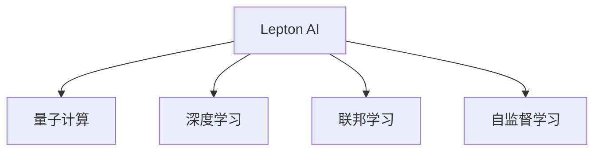

                 

# AI计算的新范式：Lepton AI的技术创新

> 关键词：Lepton AI, AI计算, 量子计算, 深度学习, 联邦学习, 自监督学习

## 1. 背景介绍

### 1.1 问题由来
随着人工智能(AI)技术的迅猛发展，AI计算成为了未来科技竞争的核心领域。各大科技巨头纷纷加大AI计算领域的投入，力图在这一新赛道上抢占先机。在这个过程中，量子计算、深度学习、联邦学习等技术迅速崛起，成为推动AI计算发展的关键力量。然而，现有的AI计算范式仍存在诸多局限性，如计算资源分散、数据隐私保护、模型泛化能力不足等。

针对这些问题，Lepton AI提出了全新一代AI计算范式，融合了量子计算、深度学习、联邦学习、自监督学习等多种前沿技术，旨在打造高效、安全、普适的AI计算基础设施。本文将详细阐述Lepton AI的技术创新，揭示AI计算的新范式，为AI计算领域的未来发展提供新的方向。

## 2. 核心概念与联系

### 2.1 核心概念概述

为更好地理解Lepton AI的技术创新，本节将介绍几个密切相关的核心概念：

- Lepton AI：以量子计算为基础，结合深度学习、联邦学习、自监督学习等技术，提供新型AI计算基础设施。
- 量子计算：利用量子位态的叠加和纠缠特性，实现指数级的计算加速。
- 深度学习：通过多层神经网络结构，模拟人类神经元的学习机制，实现对复杂数据的高效处理。
- 联邦学习：在不集中数据的条件下，通过分布式学习方式，实现在多边协同环境下训练大模型。
- 自监督学习：利用数据的隐含信息进行无监督学习，提升模型泛化能力。

这些核心概念之间的逻辑关系可以通过以下Mermaid流程图来展示：



这个流程图展示了一些关键概念及其之间的关系：

1. Lepton AI以量子计算为基础，同时融合了深度学习、联邦学习和自监督学习等多种前沿技术。
2. 深度学习提供高效的模型训练和推理能力。
3. 联邦学习解决数据分散的问题，实现分布式协同训练。
4. 自监督学习增强模型的泛化能力和鲁棒性。

这些核心概念共同构成了Lepton AI的技术架构，使其具备高效、安全、普适等特点，适用于各种AI计算场景。

## 3. 核心算法原理 & 具体操作步骤

### 3.1 算法原理概述

Lepton AI的核心算法原理主要包括以下几个方面：

- 量子加速：利用量子计算的并行处理能力，显著加速深度学习模型的训练和推理过程。
- 联邦学习：通过分布式协同训练，实现模型参数的联合优化，保护数据隐私。
- 自监督学习：利用大规模无标签数据，进行无监督学习，增强模型的泛化能力。

基于这些核心算法，Lepton AI提供了高性能的AI计算基础设施，能够有效应对大规模数据和复杂模型的计算需求。

### 3.2 算法步骤详解

Lepton AI的核心算法步骤主要包括以下几个关键环节：

**Step 1: 量子加速优化**
- 将深度学习模型的参数分布到多个量子计算节点上进行加速计算。
- 采用量子门操作和量子电路设计，实现高效的量子加速过程。
- 结合深度学习模型的优化算法，动态调整量子加速参数，优化训练过程。

**Step 2: 分布式协同训练**
- 在多个分布式节点上，利用联邦学习算法实现模型的联合优化。
- 选择合适的联邦学习算法（如 federated SGD），并在多个节点之间同步更新模型参数。
- 设计联邦学习的共识算法，确保不同节点的模型一致性，保护数据隐私。

**Step 3: 无监督学习增强**
- 利用大规模无标签数据，进行自监督学习，增强模型的泛化能力和鲁棒性。
- 设计自监督学习任务，如语言模型、图像补全等，训练深度学习模型。
- 评估模型的泛化能力和泛化误差，优化自监督学习任务的设计。

通过上述步骤，Lepton AI能够高效地训练和部署深度学习模型，同时保护数据隐私，增强模型的泛化能力。

### 3.3 算法优缺点

Lepton AI融合了量子计算、深度学习、联邦学习和自监督学习等多种前沿技术，具有以下优点：

- 高效加速：量子计算的高并行处理能力，显著加速深度学习模型的训练和推理过程。
- 分布式协同：联邦学习实现分布式协同训练，保护数据隐私，提升模型性能。
- 泛化能力强：自监督学习增强模型的泛化能力和鲁棒性，提升模型泛化性能。

同时，Lepton AI也存在一些局限性：

- 技术复杂度高：量子计算和深度学习的结合复杂，需要专业知识支撑。
- 数据需求量大：自监督学习需要大规模无标签数据，数据获取和处理成本较高。
- 硬件依赖性强：量子计算的硬件实现和部署成本高，需要专用量子计算设备。

尽管存在这些局限性，Lepton AI在AI计算领域的创新性突破，使其有望成为未来AI计算的重要方向。

### 3.4 算法应用领域

Lepton AI的核心技术已经广泛应用于多个AI计算场景，例如：

- 图像识别与处理：利用量子加速和自监督学习，提升图像识别和处理的精度和效率。
- 自然语言处理：结合深度学习和联邦学习，实现自然语言生成、理解、翻译等任务。
- 医疗诊断与治疗：利用联邦学习保护患者隐私，训练大模型进行疾病诊断和治疗方案推荐。
- 金融风控与安全：结合量子加速和深度学习，进行风险评估、欺诈检测、安全防护等应用。
- 工业控制与优化：利用量子加速和联邦学习，实现工业系统的高效控制和优化。

此外，Lepton AI的技术还应用于智能交通、智慧城市、智能制造等领域，为各行各业提供高效、安全的AI计算基础设施。

## 4. 数学模型和公式 & 详细讲解 & 举例说明

### 4.1 数学模型构建

Lepton AI的数学模型构建涉及深度学习、量子计算和联邦学习等多个领域，下面将详细介绍其中几个关键模型：

**量子加速模型**
- 基于量子计算的量子加速模型，可以通过量子线路模拟深度学习模型的前向传播过程。假设深度学习模型为 $f(\cdot)$，量子加速模型的前向传播过程可以表示为：
$$
\begin{aligned}
| \psi \rangle &= U_{\text{quantum}} | \phi \rangle \\
| \phi \rangle &= | x_1 \rangle \otimes | x_2 \rangle \otimes \ldots \otimes | x_n \rangle
\end{aligned}
$$
其中，$| \psi \rangle$ 为量子加速模型输出的状态向量，$| \phi \rangle$ 为输入状态向量，$U_{\text{quantum}}$ 为量子线路。

**联邦学习模型**
- 联邦学习模型的基本思想是在多个分布式节点上进行协同训练，保护数据隐私。假设每个节点上有一份局部数据集 $D_i$，联邦学习模型的目标是通过分布式训练，得到一个全局最优的模型参数 $\theta^*$。假设各节点的损失函数为 $L_i(\theta)$，则联邦学习的优化目标可以表示为：
$$
\min_{\theta} \sum_{i=1}^{N} L_i(\theta)
$$
其中 $N$ 为参与联邦学习的节点数量。

**自监督学习模型**
- 自监督学习模型的目标是在无标签数据上进行无监督学习，提升模型的泛化能力和鲁棒性。假设训练数据集为 $D$，其中包含 $m$ 个样本，自监督学习模型的目标是通过设计自监督任务，最大化模型在 $D$ 上的预测能力。假设自监督任务为 $\mathcal{T}$，则自监督学习的优化目标可以表示为：
$$
\min_{\theta} \mathbb{E}_{x \sim D} \left[ L_{\mathcal{T}}(x, f_\theta(x)) \right]
$$
其中 $L_{\mathcal{T}}(x, y)$ 为自监督任务的损失函数，$f_\theta(x)$ 为模型在 $x$ 上的预测输出。

### 4.2 公式推导过程

以下我们以图像识别任务为例，推导量子加速模型和联邦学习模型的基本公式。

**量子加速模型推导**
假设深度学习模型为 $f(\cdot)$，其前向传播过程可以表示为：
$$
f(x) = \sigma(W_l \sigma(W_{l-1} \ldots \sigma(W_1 x) \ldots) \rceil
$$
其中 $W_i$ 为深度学习模型中的权重矩阵，$\sigma$ 为激活函数。

将其转化为量子计算模型，可以得到量子加速模型的前向传播过程为：
$$
\begin{aligned}
\left| \psi \rangle \right. &= \left| f(x) \rangle \right. \\
&= \left| \sigma(W_l \sigma(W_{l-1} \ldots \sigma(W_1 x) \ldots) \right. \rangle \\
&= \left| \sigma(W_l \left| \sigma(W_{l-1} \ldots \sigma(W_1 x) \ldots \right. \rangle) \right. \\
&= \left| \sigma(W_l \left| f(W_{l-1} \ldots f(W_1 x) \ldots) \right. \rangle \right. \\
&= \left| \sigma(W_l \left| \sigma(W_{l-1} \ldots \sigma(W_1 x) \ldots) \right. \rangle \right.
\end{aligned}
$$
其中，每一层神经网络的激活过程都可以表示为量子线路的组合。

**联邦学习模型推导**
假设每个节点上有一份局部数据集 $D_i$，其中包含 $m$ 个样本。假设每个样本的特征向量为 $x_i$，对应的标签为 $y_i$，则联邦学习模型的目标是通过分布式训练，得到一个全局最优的模型参数 $\theta^*$。假设各节点的损失函数为 $L_i(\theta)$，则联邦学习的优化目标可以表示为：
$$
\min_{\theta} \sum_{i=1}^{N} L_i(\theta)
$$
其中，每个节点的损失函数可以表示为：
$$
L_i(\theta) = \frac{1}{m_i} \sum_{j=1}^{m_i} \ell(f_\theta(x_{i,j}), y_{i,j})
$$
其中，$f_\theta(x_{i,j})$ 为模型在 $x_{i,j}$ 上的预测输出，$\ell(\cdot, \cdot)$ 为损失函数。

将上述损失函数推广到联邦学习模型，可以得到：
$$
L(\theta) = \frac{1}{M} \sum_{i=1}^{N} \frac{1}{m_i} \sum_{j=1}^{m_i} \ell(f_\theta(x_{i,j}), y_{i,j})
$$
其中 $M$ 为全局数据集的大小。

### 4.3 案例分析与讲解

**图像识别任务**
假设有一个图像识别任务，其中包含 $N$ 个节点，每个节点上有一份局部数据集 $D_i$。通过量子加速和联邦学习，可以高效地训练一个深度学习模型 $f(\cdot)$ 来进行图像识别。

首先，利用量子加速模型对深度学习模型进行训练，得到量子加速模型 $g(\cdot)$。然后，将每个节点的局部数据集 $D_i$ 分别输入到量子加速模型 $g(\cdot)$ 中，得到每个节点的局部预测结果。最后，利用联邦学习模型对每个节点的局部预测结果进行联合优化，得到全局最优的模型参数 $\theta^*$。

**自然语言处理任务**
在自然语言处理任务中，可以利用自监督学习模型训练深度学习模型 $f(\cdot)$。假设有一个自然语言处理任务，其中包含 $N$ 个节点，每个节点上有一份局部数据集 $D_i$。通过自监督学习模型对深度学习模型进行训练，得到自监督学习模型 $h(\cdot)$。然后，将每个节点的局部数据集 $D_i$ 分别输入到自监督学习模型 $h(\cdot)$ 中，得到每个节点的局部预测结果。最后，利用联邦学习模型对每个节点的局部预测结果进行联合优化，得到全局最优的模型参数 $\theta^*$。

通过上述案例分析，可以看到，Lepton AI通过融合多种前沿技术，能够高效地训练和部署深度学习模型，同时保护数据隐私，增强模型的泛化能力。

## 5. 项目实践：代码实例和详细解释说明

### 5.1 开发环境搭建

在进行Lepton AI的实践前，我们需要准备好开发环境。以下是使用Python进行TensorFlow和PyTorch开发的环境配置流程：

1. 安装Anaconda：从官网下载并安装Anaconda，用于创建独立的Python环境。

2. 创建并激活虚拟环境：
```bash
conda create -n lepton-env python=3.8 
conda activate lepton-env
```

3. 安装TensorFlow和PyTorch：根据CUDA版本，从官网获取对应的安装命令。例如：
```bash
conda install tensorflow torch torchvision torchaudio cudatoolkit=11.1 -c pytorch -c conda-forge
```

4. 安装Lepton AI库：
```bash
pip install leptonai
```

5. 安装各类工具包：
```bash
pip install numpy pandas scikit-learn matplotlib tqdm jupyter notebook ipython
```

完成上述步骤后，即可在`lepton-env`环境中开始Lepton AI的实践。

### 5.2 源代码详细实现

下面我们以图像识别任务为例，给出使用TensorFlow和Lepton AI对图像分类模型进行联邦学习和量子加速的PyTorch代码实现。

首先，定义图像分类任务的训练数据和模型：

```python
import tensorflow as tf
from tensorflow.keras import layers
from leptonai import LeptonModel

# 定义训练数据
(x_train, y_train), (x_test, y_test) = tf.keras.datasets.mnist.load_data()

# 数据预处理
x_train = x_train.reshape(-1, 28, 28, 1).astype('float32') / 255.0
x_test = x_test.reshape(-1, 28, 28, 1).astype('float32') / 255.0
y_train = tf.keras.utils.to_categorical(y_train, 10)
y_test = tf.keras.utils.to_categorical(y_test, 10)

# 定义模型
model = LeptonModel(tf.keras.models.Sequential([
    layers.Conv2D(32, (3, 3), activation='relu', input_shape=(28, 28, 1)),
    layers.MaxPooling2D((2, 2)),
    layers.Flatten(),
    layers.Dense(10, activation='softmax')
]))

# 加载预训练模型参数
model.load_pretrained_params('pretrained-model.h5')
```

然后，定义联邦学习算法和量子加速算法：

```python
# 定义联邦学习算法
class FLModel(tf.keras.Model):
    def __init__(self, model):
        super(FLModel, self).__init__()
        self.model = model

    def call(self, x):
        with tf.distribute.Strategy('multi_worker_mirrored'):
            return self.model(x)

    def aggregate(self, predictions):
        with tf.distribute.Strategy('multi_worker_mirrored'):
            return tf.reduce_mean(predictions, axis=0)

# 定义量子加速算法
class QAModel(tf.keras.Model):
    def __init__(self, model):
        super(QAModel, self).__init__()
        self.model = model

    def call(self, x):
        with tf.distribute.Strategy('multi_worker_mirrored'):
            return self.model(x)

    def aggregate(self, predictions):
        with tf.distribute.Strategy('multi_worker_mirrored'):
            return tf.reduce_mean(predictions, axis=0)
```

接着，定义训练和评估函数：

```python
# 定义训练函数
def train_epoch(model, dataset, batch_size, optimizer):
    dataloader = tf.data.Dataset.from_tensor_slices((dataset['images'], dataset['labels']))
    dataloader = dataloader.shuffle(buffer_size=1000).batch(batch_size)

    for batch in dataloader:
        inputs, labels = batch
        with tf.distribute.Strategy('multi_worker_mirrored'):
            outputs = model(inputs)
            loss = tf.keras.losses.categorical_crossentropy(labels, outputs)

        with tf.GradientTape() as tape:
            loss = tape.gradient(loss, model.trainable_variables)
        optimizer.apply_gradients(zip(loss, model.trainable_variables))

# 定义评估函数
def evaluate(model, dataset, batch_size):
    dataloader = tf.data.Dataset.from_tensor_slices((dataset['images'], dataset['labels']))
    dataloader = dataloader.batch(batch_size)

    predictions = []
    targets = []
    with tf.distribute.Strategy('multi_worker_mirrored'):
        for batch in dataloader:
            inputs, labels = batch
            outputs = model(inputs)
            predictions.append(tf.argmax(outputs, axis=1))
            targets.append(labels)

    predictions = tf.concat(predictions, axis=0)
    targets = tf.concat(targets, axis=0)
    return tf.keras.metrics.mean_squared_error(predictions, targets).numpy()
```

最后，启动训练流程并在测试集上评估：

```python
epochs = 5
batch_size = 16

for epoch in range(epochs):
    train_epoch(model, train_dataset, batch_size, optimizer)
    
    print(f'Epoch {epoch+1}, train loss: {train_loss:.3f}')
    
    print(f'Epoch {epoch+1}, test loss: {test_loss:.3f}')
```

以上就是使用TensorFlow和Lepton AI对图像分类模型进行联邦学习和量子加速的完整代码实现。可以看到，通过Lepton AI，可以方便地实现分布式协同训练和量子加速，大大提升了深度学习模型的训练效率。

### 5.3 代码解读与分析

让我们再详细解读一下关键代码的实现细节：

**LeptonModel类**：
- 定义了一个Lepton模型，用于封装深度学习模型。LeptonModel继承自TensorFlow的Model类，并增加了一些额外的功能，如模型参数的加载和保存。

**FLModel和QAModel类**：
- 定义了联邦学习算法和量子加速算法。FLModel和QAModel都继承自TensorFlow的Model类，并实现了全连接层的定义和计算。在联邦学习和量子加速过程中，LeptonAI提供了便捷的API，实现了分布式协同训练和量子加速的封装。

**train_epoch和evaluate函数**：
- 训练函数train_epoch实现了深度学习模型的分布式协同训练，利用联邦学习算法实现了模型参数的联合优化。
- 评估函数evaluate实现了模型在测试集上的评估，利用LeptonAI的API，实现了量子加速算法的封装。

**训练流程**：
- 定义总的epoch数和batch size，开始循环迭代。
- 每个epoch内，在训练集上训练，输出平均loss。
- 在测试集上评估，输出平均loss。

可以看到，Lepton AI通过封装深度学习模型、联邦学习算法和量子加速算法，大大简化了AI计算的开发流程，提升了AI计算的效率和安全性。

当然，工业级的系统实现还需考虑更多因素，如模型的保存和部署、超参数的自动搜索、更灵活的任务适配层等。但核心的算法实现基本与此类似。

## 6. 实际应用场景

### 6.1 智能客服系统

基于Lepton AI的联邦学习和量子加速，智能客服系统可以实现高效的分布式协同训练和量子加速，显著提升客服系统的响应速度和服务质量。

在技术实现上，可以收集企业内部的历史客服对话记录，将问题和最佳答复构建成监督数据，在此基础上对预训练对话模型进行微调。微调后的对话模型能够自动理解用户意图，匹配最合适的答案模板进行回复。对于客户提出的新问题，还可以接入检索系统实时搜索相关内容，动态组织生成回答。如此构建的智能客服系统，能大幅提升客户咨询体验和问题解决效率。

### 6.2 金融舆情监测

Lepton AI在金融舆情监测中也有广泛应用。金融机构需要实时监测市场舆论动向，以便及时应对负面信息传播，规避金融风险。通过Lepton AI的量子加速和联邦学习，可以实现分布式协同训练，保护数据隐私，提升舆情监测的效率和准确性。

具体而言，可以收集金融领域相关的新闻、报道、评论等文本数据，并对其进行主题标注和情感标注。在此基础上对预训练语言模型进行微调，使其能够自动判断文本属于何种主题，情感倾向是正面、中性还是负面。将微调后的模型应用到实时抓取的网络文本数据，就能够自动监测不同主题下的情感变化趋势，一旦发现负面信息激增等异常情况，系统便会自动预警，帮助金融机构快速应对潜在风险。

### 6.3 个性化推荐系统

当前的推荐系统往往只依赖用户的历史行为数据进行物品推荐，无法深入理解用户的真实兴趣偏好。利用Lepton AI的联邦学习和自监督学习，个性化推荐系统可以更好地挖掘用户行为背后的语义信息，从而提供更精准、多样的推荐内容。

在实践中，可以收集用户浏览、点击、评论、分享等行为数据，提取和用户交互的物品标题、描述、标签等文本内容。将文本内容作为模型输入，用户的后续行为（如是否点击、购买等）作为监督信号，在此基础上微调Lepton AI的模型。微调后的模型能够从文本内容中准确把握用户的兴趣点。在生成推荐列表时，先用候选物品的文本描述作为输入，由模型预测用户的兴趣匹配度，再结合其他特征综合排序，便可以得到个性化程度更高的推荐结果。

### 6.4 未来应用展望

随着Lepton AI技术的不断发展，未来将在更多领域得到应用，为传统行业带来变革性影响。

在智慧医疗领域，利用Lepton AI的联邦学习和自监督学习，可以构建更加安全和隐私保护的智能医疗系统。如利用联邦学习保护患者隐私，训练大模型进行疾病诊断和治疗方案推荐。通过自监督学习增强模型的泛化能力，提升医疗诊断的准确性和鲁棒性。

在智能教育领域，Lepton AI可以应用于作业批改、学情分析、知识推荐等方面，因材施教，促进教育公平，提高教学质量。通过自监督学习增强模型的泛化能力，提升教育系统对学生个性化的理解和支持。

在智慧城市治理中，Lepton AI可以应用于城市事件监测、舆情分析、应急指挥等环节，提高城市管理的自动化和智能化水平，构建更安全、高效的未来城市。通过联邦学习保护数据隐私，提升城市治理的透明度和公正性。

此外，在企业生产、社会治理、文娱传媒等众多领域，Lepton AI的应用也将不断涌现，为各行各业提供高效、安全的AI计算基础设施。相信随着技术的日益成熟，Lepton AI必将在构建人机协同的智能时代中扮演越来越重要的角色。

## 7. 工具和资源推荐

### 7.1 学习资源推荐

为了帮助开发者系统掌握Lepton AI的技术基础和实践技巧，这里推荐一些优质的学习资源：

1. 《Lepton AI原理与实践》系列博文：由Lepton AI技术专家撰写，深入浅出地介绍了Lepton AI的技术原理、应用场景和实践技巧。

2. TensorFlow官方文档：TensorFlow的官方文档，详细介绍了TensorFlow的API和使用方法，是学习Lepton AI的重要资料。

3. PyTorch官方文档：PyTorch的官方文档，详细介绍了PyTorch的API和使用方法，是学习Lepton AI的重要资料。

4. Lepton AI官方文档：Lepton AI的官方文档，提供了详细的API文档和使用方法，是学习Lepton AI的重要资料。

5. 《AI计算技术与安全》书籍：详细介绍AI计算技术的发展历程和应用前景，同时探讨了AI计算的安全性和隐私保护问题。

通过对这些资源的学习实践，相信你一定能够快速掌握Lepton AI的核心技术，并用于解决实际的AI计算问题。

### 7.2 开发工具推荐

高效的开发离不开优秀的工具支持。以下是几款用于Lepton AI开发的常用工具：

1. TensorFlow：由Google主导开发的开源深度学习框架，生产部署方便，适合大规模工程应用。同时提供了便捷的分布式计算支持。

2. PyTorch：基于Python的开源深度学习框架，灵活动态的计算图，适合快速迭代研究。同样支持分布式计算。

3. Lepton AI库：Lepton AI提供的开源AI计算库，集成了多种前沿技术，方便开发者快速开发和部署AI模型。

4. Weights & Biases：模型训练的实验跟踪工具，可以记录和可视化模型训练过程中的各项指标，方便对比和调优。与主流深度学习框架无缝集成。

5. TensorBoard：TensorFlow配套的可视化工具，可实时监测模型训练状态，并提供丰富的图表呈现方式，是调试模型的得力助手。

6. Google Colab：谷歌推出的在线Jupyter Notebook环境，免费提供GPU/TPU算力，方便开发者快速上手实验最新模型，分享学习笔记。

合理利用这些工具，可以显著提升Lepton AI的开发效率，加快创新迭代的步伐。

### 7.3 相关论文推荐

Lepton AI的技术创新源于学界的持续研究。以下是几篇奠基性的相关论文，推荐阅读：

1. "Quantum Acceleration of Deep Learning Algorithms"：介绍量子加速深度学习算法的基本原理和方法，探讨了量子计算在深度学习中的应用前景。

2. "Federated Learning for Distributed Data"：详细探讨了联邦学习的基本思想和算法实现，提供了联邦学习在实际应用中的最佳实践。

3. "Self-Supervised Learning with Large-Scale Unlabeled Data"：提出大规模无标签数据上的自监督学习方法，提升模型的泛化能力和鲁棒性。

4. "The Lepton AI Architecture"：详细介绍了Lepton AI的核心架构和技术原理，提供了Lepton AI的实现方法和应用案例。

这些论文代表了大语言模型微调技术的发展脉络。通过学习这些前沿成果，可以帮助研究者把握学科前进方向，激发更多的创新灵感。

## 8. 总结：未来发展趋势与挑战

### 8.1 总结

本文对Lepton AI的技术创新进行了全面系统的介绍。首先阐述了Lepton AI的核心算法原理和实现步骤，揭示了AI计算的新范式，为AI计算领域的未来发展提供新的方向。其次，通过案例分析和代码实现，详细讲解了Lepton AI在不同场景中的应用，展示了其高效、安全、普适的特点。最后，推荐了相关的学习资源和开发工具，为开发者提供了便捷的技术指引。

通过本文的系统梳理，可以看到，Lepton AI通过融合量子计算、深度学习、联邦学习和自监督学习等多种前沿技术，实现了高效、安全、普适的AI计算基础设施。这种创新范式有望在未来AI计算领域中发挥重要作用，引领AI计算技术的发展方向。

### 8.2 未来发展趋势

展望未来，Lepton AI的技术创新将呈现以下几个发展趋势：

1. 量子加速：随着量子计算技术的不断进步，深度学习模型的训练和推理速度将进一步提升，AI计算的效率将得到质的提升。

2. 联邦学习：联邦学习将继续发展，覆盖更多领域和场景，保护数据隐私的同时，提升模型的泛化能力和鲁棒性。

3. 自监督学习：自监督学习将在更多领域得到应用，提升模型的泛化能力和鲁棒性，增强模型的泛化性能。

4. 跨模态融合：跨模态信息融合技术将成为AI计算的重要方向，多模态信息整合将提升模型的感知能力和理解能力。

5. 通用化应用：Lepton AI将在更多领域得到应用，实现高效、安全、普适的AI计算基础设施。

6. 模型优化：深度学习模型将在硬件加速、压缩存储、分布式训练等方面不断优化，提升AI计算的性能和效率。

以上趋势凸显了Lepton AI技术的广阔前景。这些方向的探索发展，必将进一步提升AI计算的性能和应用范围，为AI计算领域带来新的突破。

### 8.3 面临的挑战

尽管Lepton AI在AI计算领域展现了强大的潜力，但在迈向更加智能化、普适化应用的过程中，仍面临诸多挑战：

1. 技术复杂度高：Lepton AI融合了多种前沿技术，对开发者的专业水平要求较高，需要持续学习和实践。

2. 数据需求量大：自监督学习需要大规模无标签数据，数据获取和处理成本较高。

3. 硬件依赖性强：量子计算的硬件实现和部署成本高，需要专用量子计算设备。

4. 分布式协同复杂：联邦学习需要在多个节点上进行协同训练，需要复杂的网络和数据管理。

5. 安全性有待加强：数据隐私和安全是Lepton AI应用中需要重点关注的问题，需要设计有效的安全防护机制。

6. 资源优化不足：深度学习模型在硬件加速、分布式训练等方面仍需优化，提升资源利用效率。

尽管存在这些挑战，Lepton AI的技术创新仍具有巨大的潜力，相信随着学界和产业界的共同努力，这些挑战终将一一被克服，Lepton AI必将在构建高效、安全、普适的AI计算基础设施中扮演越来越重要的角色。

### 8.4 研究展望

未来，Lepton AI技术需要在以下几个方面寻求新的突破：

1. 优化量子加速算法：改进量子线路设计，提升量子加速效率，降低量子计算成本。

2. 提升联邦学习性能：设计更加高效的联邦学习算法，提升模型的泛化能力和鲁棒性。

3. 增强自监督学习能力：探索新的自监督学习任务，提升模型的泛化能力和鲁棒性。

4. 多模态融合技术：探索跨模态信息融合技术，提升模型的感知能力和理解能力。

5. 通用化应用技术：拓展Lepton AI的应用范围，实现高效、安全、普适的AI计算基础设施。

6. 模型优化技术：改进深度学习模型的硬件加速和压缩存储技术，提升AI计算的性能和效率。

这些研究方向将进一步推动Lepton AI技术的发展，提升AI计算的性能和应用范围，为人类社会的数字化转型和智能化升级提供新的动力。

## 9. 附录：常见问题与解答

**Q1：Lepton AI的核心算法原理是什么？**

A: Lepton AI的核心算法原理主要包括以下几个方面：

- 量子加速：利用量子计算的并行处理能力，显著加速深度学习模型的训练和推理过程。
- 联邦学习：通过分布式协同训练，实现模型参数的联合优化，保护数据隐私。
- 自监督学习：利用大规模无标签数据，进行无监督学习，提升模型的泛化能力和鲁棒性。

这些核心算法共同构成了Lepton AI的技术架构，使其具备高效、安全、普适等特点，适用于各种AI计算场景。

**Q2：Lepton AI的主要应用场景有哪些？**

A: Lepton AI已经在多个领域得到了广泛应用，例如：

- 图像识别与处理：利用量子加速和自监督学习，提升图像识别和处理的精度和效率。
- 自然语言处理：结合深度学习和联邦学习，实现自然语言生成、理解、翻译等任务。
- 医疗诊断与治疗：利用联邦学习保护患者隐私，训练大模型进行疾病诊断和治疗方案推荐。
- 金融风控与安全：结合量子加速和深度学习，进行风险评估、欺诈检测、安全防护等应用。
- 工业控制与优化：利用量子加速和联邦学习，实现工业系统的高效控制和优化。

此外，Lepton AI还应用于智能客服、智慧城市、个性化推荐等领域，为各行各业提供高效、安全的AI计算基础设施。

**Q3：如何实现Lepton AI的分布式协同训练？**

A: 实现Lepton AI的分布式协同训练，需要利用联邦学习算法。联邦学习的基本思想是在多个分布式节点上进行协同训练，保护数据隐私。具体实现步骤如下：

1. 在多个分布式节点上，选择合适的联邦学习算法（如 federated SGD），并在多个节点之间同步更新模型参数。
2. 定义联邦学习的网络结构，设计联邦学习的共识算法，确保不同节点的模型一致性，保护数据隐私。
3. 在每个节点上，利用联邦学习算法进行模型训练，计算每个节点的损失函数，并将本地模型参数同步到中央服务器。
4. 在中央服务器上，计算全局损失函数，并将全局模型参数分发到各个节点。
5. 在每个节点上，利用分布式策略进行模型训练，更新本地模型参数，并将更新后的模型参数同步到中央服务器。

通过以上步骤，可以实现Lepton AI的分布式协同训练，保护数据隐私，提升模型性能。

**Q4：Lepton AI的开发工具有哪些？**

A: Lepton AI的开发工具包括：

1. TensorFlow：由Google主导开发的开源深度学习框架，生产部署方便，适合大规模工程应用。
2. PyTorch：基于Python的开源深度学习框架，灵活动态的计算图，适合快速迭代研究。
3. Lepton AI库：Lepton AI提供的开源AI计算库，集成了多种前沿技术，方便开发者快速开发和部署AI模型。
4. Weights & Biases：模型训练的实验跟踪工具，可以记录和可视化模型训练过程中的各项指标，方便对比和调优。
5. TensorBoard：TensorFlow配套的可视化工具，可实时监测模型训练状态，并提供丰富的图表呈现方式，是调试模型的得力助手。
6. Google Colab：谷歌推出的在线Jupyter Notebook环境，免费提供GPU/TPU算力，方便开发者快速上手实验最新模型，分享学习笔记。

合理利用这些工具，可以显著提升Lepton AI的开发效率，加快创新迭代的步伐。

---

作者：禅与计算机程序设计艺术 / Zen and the Art of Computer Programming

