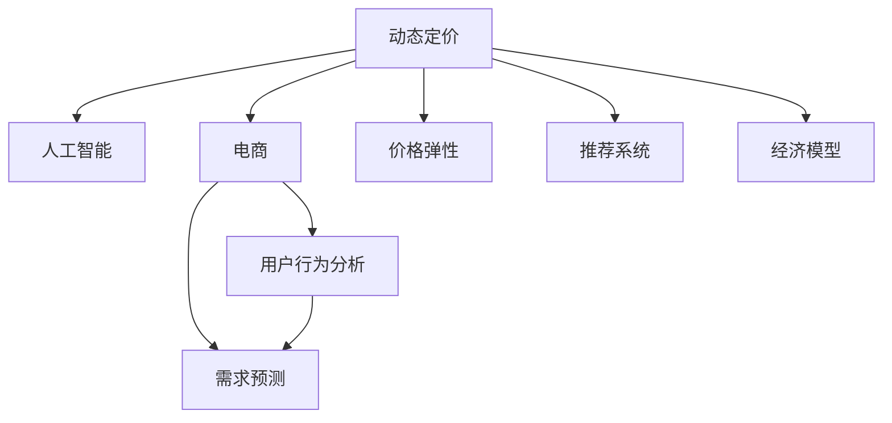

                 

# AI赋能的动态定价策略在电商中的应用

> 关键词：动态定价, 人工智能, 电商, 用户行为, 需求预测, 价格弹性, 推荐系统, 经济模型

## 1. 背景介绍

### 1.1 问题由来

电商行业的竞争日趋激烈，如何在保持利润的同时吸引更多消费者，提高市场占有率，成为商家亟需解决的难题。传统的定价策略以成本加成和竞争对手定价为基础，但这种策略在价格透明度高、消费者敏感度提升的今天已难以为继。如何根据市场动态变化，灵活调整价格，最大化销售收益，成为电商定价策略的核心问题。

### 1.2 问题核心关键点

动态定价策略是指商家根据市场环境、消费者行为、竞争对手价格等因素，实时调整商品价格，以实现最佳利润或销售量。人工智能（AI）技术的引入，使得动态定价策略在电商中得以广泛应用。AI不仅可以实时分析大量数据，预测市场需求，还能模拟用户行为，优化价格设定。

## 2. 核心概念与联系

### 2.1 核心概念概述

为更好地理解动态定价策略及其AI赋能的实践，本节将介绍几个密切相关的核心概念：

- 动态定价（Dynamic Pricing）：基于市场实时变化，调整商品价格以获取最佳收益。常见的策略包括基于需求预测的定价、基于竞价定价等。

- 人工智能（AI）：通过机器学习和数据分析技术，使机器具备类似于人类智能的行为和思维能力。在电商领域，AI被广泛应用于用户行为分析、需求预测、价格优化等方面。

- 电商（E-commerce）：利用互联网技术和平台，进行商品买卖活动的商业模式。电商行业是动态定价策略应用的重要场景。

- 用户行为分析（User Behavior Analysis）：通过数据收集和分析，了解用户偏好、购买习惯等，从而优化商品推荐和定价策略。

- 需求预测（Demand Prediction）：预测未来一段时间内的商品需求量，以便商家进行库存管理和价格调整。

- 价格弹性（Price Elasticity）：商品需求量对价格变化的敏感度，是动态定价策略的重要考量因素。

- 推荐系统（Recommendation System）：根据用户历史行为，推荐可能感兴趣的商品，提升用户体验和转化率。

- 经济模型（Economic Model）：基于市场供需、价格弹性等原理，建立动态定价策略的理论基础。

这些核心概念之间的逻辑关系可以通过以下Mermaid流程图来展示：



这个流程图展示了大语言模型的核心概念及其之间的关系：

1. 动态定价基于电商场景，利用AI技术优化。
2. 用户行为分析和需求预测是AI进行定价的基础。
3. 价格弹性考量市场对价格变化的敏感度。
4. 推荐系统提升用户体验和转化率。
5. 经济模型为动态定价策略提供理论依据。

这些概念共同构成了电商领域动态定价策略的理论框架，使其能够在市场竞争激烈的环境中，灵活调整价格，提升销售收益。

## 3. 核心算法原理 & 具体操作步骤

### 3.1 算法原理概述

基于AI的动态定价策略，本质上是一个结合市场分析和用户行为分析的优化过程。其核心思想是：利用AI技术实时监测市场环境、预测用户需求、模拟用户行为，从而调整商品价格，最大化销售收益。

形式化地，假设商品价格为 $p$，销售量为 $q$，利润为 $P=pq-c$，其中 $c$ 为固定成本。模型的优化目标为最大化总利润，即：

$$
\max_{p} P = pq - c
$$

在给定历史数据和市场环境的情况下，通过优化算法不断调整价格 $p$，使总利润最大化。

### 3.2 算法步骤详解

基于AI的动态定价策略一般包括以下几个关键步骤：

**Step 1: 数据准备**
- 收集电商平台的销售数据、市场趋势、用户行为数据等。
- 清洗和整理数据，建立特征工程。

**Step 2: 市场分析**
- 使用AI技术分析当前市场环境，包括需求、竞争态势、价格变化等。
- 构建市场预测模型，预测未来市场变化趋势。

**Step 3: 用户行为分析**
- 收集用户浏览、点击、购买、评价等行为数据。
- 使用机器学习算法分析用户行为，预测用户购买意向和价格敏感度。

**Step 4: 价格优化**
- 根据市场分析和用户行为分析的结果，设定价格模型。
- 使用优化算法（如梯度下降）调整价格，使总利润最大化。

**Step 5: 策略调整**
- 根据实时反馈和市场动态，不断调整价格模型和优化算法参数。
- 定期评估定价策略效果，进行策略优化。

### 3.3 算法优缺点

基于AI的动态定价策略具有以下优点：
1. 实时性高：可以实时监测市场变化，快速调整价格。
2. 精准度高：通过AI技术分析海量数据，预测准确。
3. 自动化程度高：减少人工干预，提升效率。
4. 策略灵活：适应不同市场环境和用户需求。

同时，该策略也存在一定的局限性：
1. 对数据质量依赖高：需要大量高质量的数据进行训练和分析。
2. 模型复杂度高：需要建立和维护复杂的AI模型，增加了技术难度。
3. 市场环境变化快：需要不断调整模型和算法，以适应市场变化。
4. 用户隐私问题：收集用户数据时需要遵守隐私保护法规。
5. 技术门槛高：需要具备一定的AI技术背景，才能实现和维护定价策略。

尽管存在这些局限性，但就目前而言，基于AI的动态定价策略仍是电商领域最先进和高效的价格优化手段。未来相关研究的重点在于如何进一步降低数据依赖，提高模型泛化能力，同时兼顾用户隐私和技术可实现性等因素。

### 3.4 算法应用领域

基于AI的动态定价策略在电商领域得到了广泛的应用，涵盖了几乎所有常见场景，例如：

- 商品促销：根据节假日、促销活动等，实时调整商品价格，提升销售量。
- 定价优化：分析用户行为和市场趋势，自动调整价格，实现最佳收益。
- 库存管理：根据预测需求和实时销售情况，动态调整库存水平，避免缺货和积压。
- 市场响应：实时监测竞争对手价格，及时调整自身价格，保持市场竞争力。
- 个性化推荐：根据用户行为和价格弹性，个性化推荐商品，提升用户满意度和转化率。

除了上述这些经典场景外，AI动态定价策略还被创新性地应用到更多场景中，如可控价格实验、动态调价策略优化、需求响应等，为电商行业带来了全新的突破。

## 4. 数学模型和公式 & 详细讲解  
### 4.1 数学模型构建

本节将使用数学语言对基于AI的电商动态定价模型进行更加严格的刻画。

记商品价格为 $p$，销售量为 $q$，利润为 $P=pq-c$，其中 $c$ 为固定成本。假设市场环境为 $E$，用户行为数据为 $B$，需求预测模型为 $D$，用户行为分析模型为 $U$，价格优化算法为 $O$。

模型的优化目标为最大化总利润，即：

$$
\max_{p,E,B,D,U,O} P = pq - c
$$

在给定历史数据和市场环境的情况下，通过优化算法不断调整价格 $p$，使总利润最大化。

### 4.2 公式推导过程

以下我们以商品促销为例，推导基于AI的动态定价模型的公式。

假设促销活动的目标是提升销售量，且价格变化为 $p'$，则促销后的利润为 $P'=p'q'-c$，其中 $q'$ 为促销后的销售量。假设价格变化对销售量的影响为 $k$，即：

$$
q' = q + k(p - p')
$$

促销后的利润公式为：

$$
P' = (p' + k(p - p'))q' - c = (p' + k(p - p'))(q + k(p - p')) - c
$$

将 $q'$ 代入优化目标，得：

$$
\max_{p,p',k} P' = (p' + k(p - p'))(q + k(p - p')) - c
$$

这是一个关于 $p$、$p'$、$k$ 的三元优化问题。通过求解该问题，可以得到最优的价格变化量和促销策略。

### 4.3 案例分析与讲解

**案例一：节假日促销**

电商平台的促销活动通常集中在节假日，此时用户消费意愿提升，商家可以相应地调低价格，吸引更多购买。以双十一为例，商家可以根据过去节假日的销售数据，预测本次双十一的需求量和价格敏感度。利用优化算法计算最优的促销价格和促销时长，实现销售收益最大化。

**案例二：个性化推荐**

根据用户的历史浏览和购买行为，分析用户对不同价格区间的需求弹性。通过构建个性化推荐模型，向用户推荐可能感兴趣的商品，同时设定个性化的价格策略。例如，对价格敏感用户，可以提供更多的折扣优惠，提升其购买意愿。

## 5. 项目实践：代码实例和详细解释说明

### 5.1 开发环境搭建

在进行动态定价策略实践前，我们需要准备好开发环境。以下是使用Python进行PyTorch开发的环境配置流程：

1. 安装Anaconda：从官网下载并安装Anaconda，用于创建独立的Python环境。

2. 创建并激活虚拟环境：
```bash
conda create -n pytorch-env python=3.8 
conda activate pytorch-env
```

3. 安装PyTorch：根据CUDA版本，从官网获取对应的安装命令。例如：
```bash
conda install pytorch torchvision torchaudio cudatoolkit=11.1 -c pytorch -c conda-forge
```

4. 安装相关库：
```bash
pip install torch pandas scikit-learn
```

5. 安装可视化工具：
```bash
pip install matplotlib seaborn
```

完成上述步骤后，即可在`pytorch-env`环境中开始实践。

### 5.2 源代码详细实现

下面我们以基于AI的电商动态定价模型为例，给出完整的代码实现。

首先，定义数据集和模型：

```python
import torch
import torch.nn as nn
import torch.optim as optim
from sklearn.model_selection import train_test_split

# 定义数据集
class DataLoader:
    def __init__(self, data, batch_size=32):
        self.data = data
        self.batch_size = batch_size
        self.index = 0

    def __iter__(self):
        while self.index < len(self.data):
            batch = self.data[self.index:self.index+self.batch_size]
            self.index += self.batch_size
            yield batch

    def __len__(self):
        return len(self.data) // self.batch_size

# 定义模型
class DynamicPricingModel(nn.Module):
    def __init__(self):
        super(DynamicPricingModel, self).__init__()
        self.fc1 = nn.Linear(1, 10)
        self.fc2 = nn.Linear(10, 1)
        self.relu = nn.ReLU()

    def forward(self, x):
        x = self.fc1(x)
        x = self.relu(x)
        x = self.fc2(x)
        return x
```

然后，定义损失函数和优化器：

```python
# 定义损失函数
def loss_fn(output, target):
    mse_loss = nn.MSELoss()
    return mse_loss(output, target)

# 定义优化器
def optimizer_fn(model, learning_rate):
    return optim.Adam(model.parameters(), lr=learning_rate)
```

接着，训练模型：

```python
# 定义训练函数
def train_model(model, data_loader, optimizer, device, epochs):
    model.train()
    total_loss = 0
    for epoch in range(epochs):
        for batch in data_loader:
            input, target = batch
            input = input.to(device)
            target = target.to(device)
            optimizer.zero_grad()
            output = model(input)
            loss = loss_fn(output, target)
            loss.backward()
            optimizer.step()
            total_loss += loss.item()
        print(f'Epoch {epoch+1}, Loss: {total_loss/len(data_loader):.4f}')
```

最后，评估模型：

```python
# 定义评估函数
def evaluate_model(model, data_loader, device):
    model.eval()
    total_loss = 0
    with torch.no_grad():
        for batch in data_loader:
            input, target = batch
            input = input.to(device)
            target = target.to(device)
            output = model(input)
            loss = loss_fn(output, target)
            total_loss += loss.item()
    print(f'Test Loss: {total_loss/len(data_loader):.4f}')
```

在代码中，我们使用了简单的线性模型来模拟动态定价的优化过程。模型输入为价格变化量，输出为促销后的利润。通过最小化预测利润与真实利润之间的均方误差，模型学习最优的促销价格和策略。在实际应用中，可以根据具体需求，使用更复杂的模型和优化算法。

### 5.3 代码解读与分析

让我们再详细解读一下关键代码的实现细节：

**DataLoader类**：
- 定义了数据集的迭代器，按批次加载数据，并返回输入和目标值。

**DynamicPricingModel类**：
- 定义了一个简单的线性模型，包含两个全连接层和ReLU激活函数。
- 使用PyTorch的nn.Module来定义模型结构，并在前向传播中应用线性变换和激活函数。

**loss_fn和optimizer_fn函数**：
- 定义了损失函数和优化器，分别使用了均方误差损失函数和Adam优化器。

**train_model和evaluate_model函数**：
- 定义了训练和评估函数，分别在模型训练和评估阶段使用数据迭代器，计算损失并更新模型参数。
- 在训练阶段，模型处于训练模式，损失函数计算真实利润与预测利润之间的误差，并通过反向传播更新参数。
- 在评估阶段，模型处于评估模式，不进行梯度更新，只计算损失。

通过上述代码，我们可以构建一个基于AI的电商动态定价模型，并进行训练和评估。这为实际应用提供了基本框架，开发者可以根据具体需求，选择不同的模型和优化算法，实现更高效的动态定价策略。

## 6. 实际应用场景

### 6.1 智能客服系统

基于AI的动态定价策略，可以广泛应用于智能客服系统的构建。传统客服往往需要配备大量人力，高峰期响应缓慢，且一致性和专业性难以保证。而使用动态定价策略，可以7x24小时不间断服务，快速响应客户咨询，用智能推荐和价格优化提升客户体验。

在技术实现上，可以收集企业内部的历史客服对话记录，将问题和最佳答复构建成监督数据，在此基础上对预训练语言模型进行微调。微调后的语言模型能够自动理解用户意图，匹配最合适的答复和价格策略，提供个性化的服务。对于客户提出的新问题，还可以接入检索系统实时搜索相关内容，动态生成最佳答复。如此构建的智能客服系统，能大幅提升客户咨询体验和问题解决效率。

### 6.2 金融舆情监测

金融机构需要实时监测市场舆论动向，以便及时应对负面信息传播，规避金融风险。传统的人工监测方式成本高、效率低，难以应对网络时代海量信息爆发的挑战。基于AI的动态定价策略，可以应用于金融舆情监测，构建自动化监控系统。

具体而言，可以收集金融领域相关的新闻、报道、评论等文本数据，并对其进行主题标注和情感标注。在此基础上对预训练语言模型进行微调，使其能够自动判断文本属于何种主题，情感倾向是正面、中性还是负面。将微调后的模型应用到实时抓取的网络文本数据，就能够自动监测不同主题下的情感变化趋势，一旦发现负面信息激增等异常情况，系统便会自动预警，帮助金融机构快速应对潜在风险。

### 6.3 个性化推荐系统

当前的推荐系统往往只依赖用户的历史行为数据进行物品推荐，无法深入理解用户的真实兴趣偏好。基于AI的动态定价策略，可以应用于个性化推荐系统，实现更精准、多样的推荐内容。

在实践中，可以收集用户浏览、点击、评论、分享等行为数据，提取和用户交互的物品标题、描述、标签等文本内容。将文本内容作为模型输入，用户的后续行为（如是否点击、购买等）作为监督信号，在此基础上微调预训练语言模型。微调后的模型能够从文本内容中准确把握用户的兴趣点。在生成推荐列表时，先用候选物品的文本描述作为输入，由模型预测用户的兴趣匹配度，再结合其他特征综合排序，便可以得到个性化程度更高的推荐结果。

### 6.4 未来应用展望

随着AI技术和大数据的发展，基于AI的动态定价策略将在更多领域得到应用，为各行各业带来变革性影响。

在智慧医疗领域，基于AI的动态定价策略可以应用于医疗资源分配、药物定价等场景，提升医疗服务的智能化水平，降低药品价格，让更多患者受益。

在智能教育领域，动态定价策略可以应用于在线课程定价、个性化学习材料推荐等环节，因材施教，促进教育公平，提高教学质量。

在智慧城市治理中，动态定价策略可以应用于城市事件监测、应急响应等环节，提高城市管理的自动化和智能化水平，构建更安全、高效的未来城市。

此外，在企业生产、社会治理、文娱传媒等众多领域，基于AI的动态定价策略也将不断涌现，为经济社会发展注入新的动力。相信随着技术的日益成熟，动态定价策略必将在构建人机协同的智能时代中扮演越来越重要的角色。

## 7. 工具和资源推荐

### 7.1 学习资源推荐

为了帮助开发者系统掌握基于AI的动态定价策略的理论基础和实践技巧，这里推荐一些优质的学习资源：

1. 《动态定价与市场需求》系列博文：由动态定价领域的专家撰写，深入浅出地介绍了动态定价的基本原理和应用场景。

2. 《人工智能在电商中的应用》课程：国内知名高校开设的电商AI课程，涵盖动态定价、推荐系统等多个关键模块，适合深入学习。

3. 《深度学习理论与实践》书籍：全面介绍深度学习算法及其在电商、金融等领域的应用，为动态定价策略提供技术基础。

4. HuggingFace官方文档：深度学习框架PyTorch的官方文档，提供了丰富的预训练模型和微调样例，是学习动态定价策略的重要资料。

5. TensorBoard：谷歌推出的可视化工具，可实时监测模型训练状态，提供丰富的图表呈现方式，是调试模型的得力助手。

通过学习这些资源，相信你一定能够快速掌握基于AI的动态定价策略的精髓，并用于解决实际的电商问题。

### 7.2 开发工具推荐

高效的开发离不开优秀的工具支持。以下是几款用于动态定价策略开发的常用工具：

1. PyTorch：基于Python的开源深度学习框架，灵活动态的计算图，适合快速迭代研究。大部分预训练语言模型都有PyTorch版本的实现。

2. TensorFlow：由Google主导开发的开源深度学习框架，生产部署方便，适合大规模工程应用。同样有丰富的预训练语言模型资源。

3. HuggingFace Transformers库：深度学习工具库，集成了众多SOTA语言模型，支持PyTorch和TensorFlow，是进行微调任务开发的利器。

4. Weights & Biases：模型训练的实验跟踪工具，可以记录和可视化模型训练过程中的各项指标，方便对比和调优。与主流深度学习框架无缝集成。

5. TensorBoard：谷歌推出的可视化工具，可实时监测模型训练状态，并提供丰富的图表呈现方式，是调试模型的得力助手。

6. Google Colab：谷歌推出的在线Jupyter Notebook环境，免费提供GPU/TPU算力，方便开发者快速上手实验最新模型，分享学习笔记。

合理利用这些工具，可以显著提升动态定价策略的开发效率，加快创新迭代的步伐。

### 7.3 相关论文推荐

动态定价策略的发展源于学界的持续研究。以下是几篇奠基性的相关论文，推荐阅读：

1. 《动态定价模型与算法》：介绍了基于优化理论和模拟算法的动态定价模型，为实际应用提供了理论支持。

2. 《基于人工智能的动态定价策略》：探讨了AI技术在电商、金融等领域的应用，为动态定价策略提供了新的思路。

3. 《需求预测与动态定价》：分析了需求预测在动态定价中的应用，提出了多种需求预测模型和定价策略。

4. 《个性化推荐系统与动态定价》：结合个性化推荐技术和动态定价策略，提升推荐系统的精准度和用户满意度。

这些论文代表了大动态定价策略的发展脉络。通过学习这些前沿成果，可以帮助研究者把握学科前进方向，激发更多的创新灵感。

## 8. 总结：未来发展趋势与挑战

### 8.1 总结

本文对基于AI的动态定价策略进行了全面系统的介绍。首先阐述了动态定价策略的研究背景和意义，明确了AI技术在提升电商定价灵活性和精准度方面的独特价值。其次，从原理到实践，详细讲解了基于AI的电商动态定价模型的数学原理和关键步骤，给出了动态定价策略的完整代码实例。同时，本文还广泛探讨了动态定价策略在电商领域的应用前景，展示了AI技术带来的巨大潜力。

通过本文的系统梳理，可以看到，基于AI的动态定价策略正在成为电商领域的重要范式，极大地提升了电商定价的实时性和精准度，推动了电商行业的智能化转型。未来，伴随AI技术和大数据的发展，基于AI的动态定价策略必将在更多领域得到应用，为各行各业带来变革性影响。

### 8.2 未来发展趋势

展望未来，基于AI的动态定价策略将呈现以下几个发展趋势：

1. 技术普及度高：AI技术和深度学习框架的普及将进一步降低动态定价策略的技术门槛，使其更容易被广泛应用。

2. 数据质量提升：随着数据采集和处理技术的进步，动态定价策略将逐渐摆脱对高质量标注数据的依赖，能够在大规模非结构化数据上实现良好效果。

3. 模型泛化能力强：未来的动态定价模型将具备更强的泛化能力，能够适应不同市场环境、用户行为和需求变化，提升策略的稳健性。

4. 个性化推荐和定价结合紧密：动态定价策略将与个性化推荐系统更加紧密结合，通过推荐结果预测用户需求，实现动态调价，提高用户体验。

5. 实时性和自动化程度高：实时市场监测和智能决策系统将使动态定价策略更加灵活和高效，实现全流程自动化。

6. 多模态数据融合：动态定价策略将进一步拓展到多模态数据融合，利用语音、视频、图像等多种数据源，提升市场分析的全面性和准确性。

以上趋势凸显了基于AI的动态定价策略的广阔前景。这些方向的探索发展，必将进一步提升动态定价策略的性能和应用范围，为电商行业带来更多创新和突破。

### 8.3 面临的挑战

尽管基于AI的动态定价策略已经取得了显著成就，但在迈向更加智能化、普适化应用的过程中，它仍面临着诸多挑战：

1. 数据隐私问题：收集和处理用户数据时需要遵守隐私保护法规，避免数据泄露和滥用。

2. 技术复杂度高：构建高效的动态定价模型需要深厚的AI技术背景，开发和维护成本较高。

3. 市场环境变化快：动态定价策略需要不断调整模型和算法，以适应市场变化，增加了技术难度。

4. 用户行为多样性：用户行为和需求变化多样，难以用单一模型进行准确预测，需要构建复杂的多模态模型。

5. 模型鲁棒性不足：动态定价模型在面对异常数据或市场扰动时，容易发生异常预测，需要提升模型的鲁棒性。

6. 实时性要求高：实时市场变化和用户行为需要实时监测和分析，增加了系统架构的复杂性。

7. 技术标准化问题：缺乏统一的动态定价技术标准，不同系统和平台之间的互通性差，增加了集成难度。

正视动态定价策略面临的这些挑战，积极应对并寻求突破，将是大数据和AI技术在电商领域进一步发展的必由之路。相信随着学界和产业界的共同努力，这些挑战终将一一被克服，基于AI的动态定价策略必将在构建人机协同的智能时代中扮演越来越重要的角色。

### 8.4 研究展望

面对动态定价策略所面临的种种挑战，未来的研究需要在以下几个方面寻求新的突破：

1. 探索基于非结构化数据的动态定价模型。通过自然语言处理和图像识别技术，从文本、视频等非结构化数据中提取有价值的信息，实现更全面、准确的市场分析。

2. 研究基于增强学习的动态定价算法。利用增强学习技术，使动态定价模型具备自适应学习和优化能力，提升策略的灵活性和鲁棒性。

3. 引入多模态数据的融合与融合机制。通过多种数据源的综合分析，提升市场分析和用户行为预测的全面性和准确性，增强定价策略的鲁棒性。

4. 开发实时化、自动化、标准化的动态定价系统。引入实时数据采集和分析技术，实现全流程自动化，同时制定统一的动态定价技术标准，促进系统互操作性。

这些研究方向的探索，必将引领基于AI的动态定价策略迈向更高的台阶，为构建高效、灵活、智能的定价系统铺平道路。面向未来，基于AI的动态定价策略需要与其他AI技术进行更深入的融合，如知识表示、因果推理、强化学习等，多路径协同发力，共同推动动态定价策略的进步。只有勇于创新、敢于突破，才能不断拓展AI技术在电商领域的应用边界，让智能技术更好地造福电商行业。

## 9. 附录：常见问题与解答

**Q1：动态定价策略如何应对市场竞争？**

A: 动态定价策略通过实时监测市场环境，灵活调整价格，可以有效应对市场竞争。具体来说，可以通过以下几种方式：
1. 竞争对手定价：实时监测竞争对手的价格变化，及时调整自身价格，保持市场竞争力。
2. 差异化定价：针对不同市场、不同用户群体，设计差异化的价格策略，提升用户体验和市场占有率。
3. 促销活动：在特定节假日或促销活动期间，通过降低价格或提供优惠，吸引更多用户，提升销售量。

**Q2：动态定价策略如何处理异常数据？**

A: 动态定价策略在面对异常数据时，通常采用以下策略：
1. 数据清洗：对数据进行预处理，去除异常值和噪声，提升数据质量。
2. 鲁棒性增强：在模型训练过程中引入正则化技术，如L2正则、Dropout等，提高模型的鲁棒性。
3. 异常检测：建立异常检测模型，及时发现和处理异常数据，避免模型预测出现偏差。
4. 重采样：采用重采样技术，如欠采样、过采样等，处理数据分布不均的问题。

通过上述策略，动态定价模型能够更好地应对市场变化和异常数据，提升定价策略的准确性和稳定性。

**Q3：动态定价策略如何实现个性化推荐？**

A: 动态定价策略与个性化推荐系统结合，可以实现更精准、多样化的推荐。具体来说，可以通过以下几种方式：
1. 用户行为分析：收集用户浏览、点击、购买等行为数据，建立用户行为模型，预测用户需求。
2. 推荐模型优化：根据用户行为和市场环境，优化推荐模型，提升推荐精准度。
3. 价格弹性分析：分析用户对价格变化的敏感度，设计个性化的价格策略，提升用户满意度。
4. 多模态数据融合：利用多模态数据（如图像、视频、语音等），提升市场分析和用户行为预测的全面性和准确性。

通过上述策略，动态定价策略与个性化推荐系统能够协同工作，提升推荐系统的精准度和用户满意度。

**Q4：动态定价策略如何优化实时性能？**

A: 动态定价策略的实时性能优化可以从以下几个方面入手：
1. 数据处理优化：采用数据预处理技术，如数据分片、批量处理等，减少数据加载和处理的延迟。
2. 模型压缩与优化：采用模型压缩、剪枝等技术，减小模型大小，提升计算效率。
3. 硬件优化：利用GPU、TPU等高性能设备，提升模型计算速度和资源利用率。
4. 异步处理：采用异步处理技术，提升系统并发能力和响应速度。
5. 缓存机制：建立数据缓存机制，减少频繁的数据读取和处理。

通过上述优化策略，动态定价系统能够实现更高的实时性能，满足业务需求。

---

作者：禅与计算机程序设计艺术 / Zen and the Art of Computer Programming

