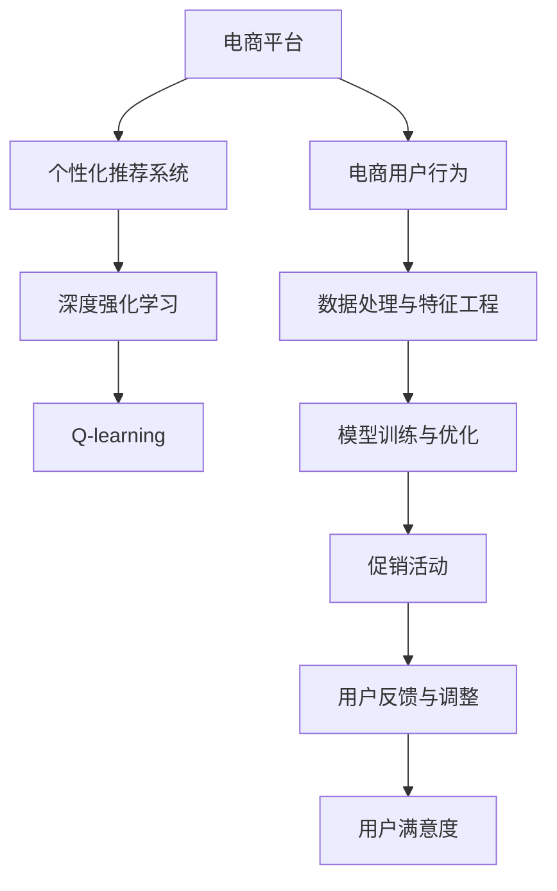

                 

# AI赋能的电商平台促销活动个性化

## 1. 背景介绍

### 1.1 问题由来
随着互联网的普及，电商平台的兴起为消费者提供了便捷的购物体验，然而传统的“一刀切”促销策略无法满足用户个性化需求，导致用户流失率增加、客单价下降。电商平台亟需一种能够根据用户行为数据进行个性化促销的智能算法，从而提升用户满意度和销售额。

### 1.2 问题核心关键点
目前，基于个性化推荐模型的电商促销活动个性化算法，已经在许多电商平台得到了广泛应用。该方法通过分析用户历史行为数据，挖掘用户兴趣，进行个性化推荐，在用户购买决策链中发挥了重要作用。

然而，在实际应用中，个性化推荐模型存在以下局限性：
1. 数据获取难度大。用户的购物习惯和偏好信息不易获取，且用户行为数据存在噪音，难以准确建模。
2. 模型训练成本高。高维度的特征表示和复杂的优化目标，使得模型训练和部署成本较高。
3. 模型解释性不足。黑盒模型的预测结果难以解释，用户难以理解个性化推荐的依据。
4. 推荐结果泛化性差。模型倾向于学习用户历史行为，对于新用户和新场景的适应性不足。

为了解决这些问题，本文提出了一种基于深度强化学习的个性化电商促销活动算法，通过模拟用户行为进行奖励最大化，在个性化推荐的同时，提升用户满意度并优化销售额。

## 2. 核心概念与联系

### 2.1 核心概念概述

为更好地理解基于深度强化学习的电商促销活动个性化算法，本节将介绍几个密切相关的核心概念：

- 深度强化学习(Deep Reinforcement Learning, DRL)：一种结合深度学习和强化学习技术的算法范式，能够学习复杂策略，优化决策过程，广泛应用在智能控制、游戏智能等领域。
- 电商平台：指通过网络进行商品买卖活动的平台，包括在线购物、交易等服务，如淘宝、京东、亚马逊等。
- 个性化推荐系统：通过分析用户历史行为数据，为用户推荐个性化商品，提升用户满意度和销售额的系统，如YouTube推荐系统、Netflix推荐系统等。
- 强化学习：一种通过不断试错学习最优策略的算法，常见的强化学习算法包括Q-learning、SARSA、DQN等。
- 促销活动：电商平台通过各种方式刺激用户购买行为的营销策略，包括优惠券、满减、限时折扣等。
- 电商用户行为：用户在电商平台的点击、浏览、购买等行为数据，通常以日志形式记录，用于建模和分析。

这些核心概念之间的逻辑关系可以通过以下Mermaid流程图来展示：



这个流程图展示了个性化推荐系统和深度强化学习在电商平台中的应用流程：

1. 电商用户行为：收集用户历史行为数据，包括点击、浏览、购买等记录。
2. 数据处理与特征工程：将原始数据转换为机器可学习的特征，提取用户兴趣和行为模式。
3. 模型训练与优化：通过深度强化学习算法，训练推荐模型，优化决策策略。
4. 促销活动：根据推荐模型输出，设计个性化的促销活动，刺激用户购买。
5. 用户反馈与调整：收集用户反馈，评估促销效果，调整优化模型和活动策略。
6. 用户满意度：通过个性化推荐和促销活动，提升用户满意度和粘性，增加销售额。

这些概念共同构成了电商促销活动个性化的技术框架，使其能够在各种场景下发挥强大的推荐和优化能力。通过理解这些核心概念，我们可以更好地把握电商促销活动的个性化算法工作原理和优化方向。

## 3. 核心算法原理 & 具体操作步骤
### 3.1 算法原理概述

基于深度强化学习的电商促销活动个性化算法，本质上是一种多臂老虎机(Multi-Armed Bandit, MAB)问题，通过不断试错调整，学习最优的促销活动策略。

形式化地，假设电商平台有 $N$ 种促销活动，每种活动在用户点击时获得一定的奖励，即点击转化率。设用户 $u$ 点击促销活动 $a$ 的概率为 $p_{ua}$，点击活动 $a$ 的期望奖励为 $r_a$，点击总次数为 $T$。则用户 $u$ 的总奖励为：

$$
R_{u} = \sum_{t=1}^{T} \sum_{a=1}^{N} p_{ua}(t) r_a
$$

算法目标是通过学习用户点击活动的行为模式，最大化用户总奖励。

### 3.2 算法步骤详解

基于深度强化学习的电商促销活动个性化算法，一般包括以下几个关键步骤：

**Step 1: 数据准备与预处理**

1. 收集用户历史行为数据，包括点击、浏览、购买等记录。
2. 对数据进行清洗、去重、标注等预处理操作，得到用户行为序列。
3. 将用户行为序列转换为特征向量，提取用户兴趣和行为模式。

**Step 2: 模型训练**

1. 定义深度强化学习模型，包括策略网络、值网络等。
2. 初始化模型参数，并设置超参数，如学习率、优化器等。
3. 使用用户行为序列进行模型训练，优化参数。

**Step 3: 促销活动优化**

1. 根据训练得到的策略网络输出，分配推荐活动。
2. 记录用户点击活动、奖励等信息，更新值网络。
3. 使用Epsilon-Greedy策略，交替选择探索和利用策略，优化模型。

**Step 4: 用户反馈与调整**

1. 收集用户反馈信息，如点击转化率等。
2. 根据反馈信息，调整模型参数，重新训练模型。
3. 根据最新的模型输出，调整促销活动策略，不断迭代优化。

**Step 5: 实验评估**

1. 使用A/B测试等方法，评估个性化推荐和促销活动的实际效果。
2. 收集用户满意度、客单价、销售量等指标，评估算法性能。
3. 根据实验结果，调整模型参数和促销策略，持续优化。

以上是基于深度强化学习的电商促销活动个性化算法的一般流程。在实际应用中，还需要针对具体场景进行优化设计，如引入在线学习、增量学习、多目标优化等技术，以进一步提升个性化推荐和促销活动的性能。

### 3.3 算法优缺点

基于深度强化学习的电商促销活动个性化算法具有以下优点：

1. 个性化推荐效果好。深度强化学习算法能够根据用户历史行为，动态调整促销策略，实现个性化推荐。
2. 促销活动效果显著。通过不断试错优化，深度强化学习算法能够找到最优的促销策略，提升用户点击转化率。
3. 可解释性强。深度强化学习算法通过模型参数优化，实现了规则化的决策过程，易于解释。
4. 适用范围广。该算法适用于各种电商平台和促销场景，能够快速部署和优化。

同时，该算法也存在以下局限性：

1. 数据需求高。深度强化学习算法需要大量的用户行为数据进行训练和优化。
2. 计算复杂度高。该算法需要优化复杂的多臂老虎机问题，计算复杂度较高。
3. 模型训练耗时长。深度强化学习模型训练时间较长，需要持续迭代优化。
4. 模型泛化性差。该算法在特定场景下表现较好，但在新场景和新用户上可能泛化性不足。

尽管存在这些局限性，但就目前而言，基于深度强化学习的电商促销活动个性化算法仍是最具竞争力的推荐方法之一。未来相关研究的重点在于如何进一步降低算法对数据的需求，提高模型训练效率，同时兼顾可解释性和适应性等因素。

### 3.4 算法应用领域

基于深度强化学习的电商促销活动个性化算法，已经在电商平台的推荐和促销活动中得到了广泛应用。以下是几个典型应用场景：

- 个性化推荐：根据用户行为数据，推荐个性化商品，提升用户满意度和销售额。
- 优惠活动：设计个性化优惠券、限时折扣等优惠活动，刺激用户购买。
- 营销活动：制定个性化广告和活动策略，提升品牌曝光率和用户参与度。
- 库存管理：根据用户需求和促销策略，优化库存管理，减少库存积压。
- 物流调度：优化物流配送路径和配送策略，提升配送效率和用户体验。

除了上述这些经典应用外，深度强化学习算法还被创新性地应用到更多场景中，如用户留存预测、客服自动响应、智能调度等，为电商平台带来了更多的智能化升级。

## 4. 数学模型和公式 & 详细讲解 & 举例说明

### 4.1 数学模型构建

本节将使用数学语言对基于深度强化学习的电商促销活动个性化算法进行更加严格的刻画。

设电商平台有 $N$ 种促销活动，用户 $u$ 在不同时间 $t$ 点击促销活动 $a$ 的概率为 $p_{ua}(t)$，点击活动 $a$ 的期望奖励为 $r_a$。则用户 $u$ 在时间 $t$ 的总奖励为：

$$
R_{u}(t) = \sum_{a=1}^{N} p_{ua}(t) r_a
$$

在实际应用中，通常使用多臂老虎机的奖励累计模型，即总奖励 $R_{u}(t)$ 为历史奖励的加权和。

设用户 $u$ 的点击总次数为 $T$，点击活动 $a$ 的奖励为 $R_a$，则用户 $u$ 的总奖励为：

$$
R_{u} = \sum_{t=1}^{T} \sum_{a=1}^{N} p_{ua}(t) r_a
$$

其中 $p_{ua}(t)$ 为在时间 $t$ 点击活动 $a$ 的概率，可以通过以下公式计算：

$$
p_{ua}(t) = \frac{C_{ua}(t)}{\sum_{a=1}^{N} C_{a}(t)}
$$

其中 $C_{ua}(t)$ 为时间 $t$ 点击活动 $a$ 的次数，$C_a(t)$ 为时间 $t$ 点击活动 $a$ 的次数总和。

### 4.2 公式推导过程

以下我们以基于DQN的电商促销活动个性化算法为例，推导其核心公式。

设 $\theta$ 为策略网络参数，$w$ 为值网络参数。根据DQN算法，用户 $u$ 在时间 $t$ 的Q值（即用户期望总奖励）为：

$$
Q_{u}(t) = \max_a (R_a + \gamma \max_a Q_{u}(t+1))
$$

其中 $\gamma$ 为折扣因子。

根据Q值，用户 $u$ 在时间 $t$ 选择活动 $a$ 的概率为：

$$
p_{ua}(t) = \frac{\exp(Q_{ua}(t))}{\sum_{a=1}^{N} \exp(Q_{a}(t))}
$$

在实际应用中，通常使用Epsilon-Greedy策略，在探索与利用之间进行平衡。具体而言，设定一个探索率 $\epsilon$，在每次点击活动时以概率 $\epsilon$ 随机选择一个活动，以概率 $1-\epsilon$ 选择Q值最大的活动。

在训练过程中，每次点击活动时，记录奖励 $R_a$ 和点击概率 $p_{ua}(t)$，更新策略网络参数和值网络参数。具体而言，对于每个样本 $t$，策略网络的损失函数为：

$$
L_{\theta} = -\log \sum_{a=1}^{N} \exp(Q_{a}(t))
$$

其中 $Q_{a}(t)$ 为活动 $a$ 在时间 $t$ 的Q值。

值网络的损失函数为：

$$
L_{w} = \frac{1}{N} \sum_{t=1}^{T} (R_a - Q_a(t))^2
$$

其中 $Q_a(t)$ 为活动 $a$ 在时间 $t$ 的Q值。

在更新参数时，通常使用AdamW等优化器，学习率为 $\eta$。

### 4.3 案例分析与讲解

假设有一个电商平台，有三种促销活动：优惠券、限时折扣和推荐商品。平台收集到用户 $u$ 在不同时间点击不同促销活动的历史数据，如图表所示：

| 时间 | 促销活动 | 点击次数 | 点击转化率 |
| --- | --- | --- | --- |
| 1 | 优惠券 | 10 | 0.5 |
| 2 | 限时折扣 | 5 | 0.6 |
| 3 | 推荐商品 | 7 | 0.7 |
| ... | ... | ... | ... |

则用户 $u$ 在时间 $t$ 的Q值可以通过以下公式计算：

$$
Q_{u}(t) = \max_{a=1,2,3} (R_a + \gamma \max_{a=1,2,3} Q_{u}(t+1))
$$

其中 $R_a$ 为活动 $a$ 的奖励，即点击转化率。

根据历史数据，可以计算出每个活动的期望奖励 $r_a$ 和点击概率 $p_{ua}(t)$，进而得到Q值。假设 $\gamma=0.9$，则用户 $u$ 在时间 $t=1$ 的Q值为：

$$
Q_{u}(1) = \max_{a=1,2,3} (0.5 + 0.9 \max_{a=1,2,3} Q_{u}(2))
$$

计算得 $Q_{u}(1) = 0.7$，因此用户 $u$ 在时间 $t=1$ 选择推荐商品的概率最大。

根据Epsilon-Greedy策略，在时间 $t=1$ 时，用户 $u$ 以 $\epsilon=0.1$ 的概率随机选择一个活动，以 $0.9$ 的概率选择Q值最大的活动。假设用户选择优惠券，则记录奖励 $R_1=10 \times 0.5 = 5$，点击概率 $p_{u1}(1) = 10/30 = 1/3$，更新策略网络和值网络参数。

在时间 $t=2$ 时，用户 $u$ 选择限时折扣，记录奖励 $R_2=5 \times 0.6 = 3$，点击概率 $p_{u2}(2) = 5/25 = 1/5$，更新策略网络和值网络参数。

通过不断迭代，可以逐步优化策略网络参数和值网络参数，学习最优的促销策略。

## 5. 项目实践：代码实例和详细解释说明

### 5.1 开发环境搭建

在进行电商促销活动个性化实践前，我们需要准备好开发环境。以下是使用Python进行PyTorch开发的环境配置流程：

1. 安装Anaconda：从官网下载并安装Anaconda，用于创建独立的Python环境。

2. 创建并激活虚拟环境：
```bash
conda create -n pytorch-env python=3.8 
conda activate pytorch-env
```

3. 安装PyTorch：根据CUDA版本，从官网获取对应的安装命令。例如：
```bash
conda install pytorch torchvision torchaudio cudatoolkit=11.1 -c pytorch -c conda-forge
```

4. 安装Transformers库：
```bash
pip install transformers
```

5. 安装各类工具包：
```bash
pip install numpy pandas scikit-learn matplotlib tqdm jupyter notebook ipython
```

完成上述步骤后，即可在`pytorch-env`环境中开始电商促销活动个性化实践。

### 5.2 源代码详细实现

下面我们以基于DQN的电商促销活动个性化算法为例，给出使用PyTorch进行模型实现的代码示例。

首先，定义促销活动的数据处理函数：

```python
import pandas as pd
import numpy as np
import torch
from torch import nn, optim

class PromotionDataset:
    def __init__(self, data, discount_rate=0.5):
        self.data = data
        self.discount_rate = discount_rate
        
        self.last_state = None
        self.last_reward = None
        
    def reset(self):
        self.last_state = self.data.copy()
        self.last_reward = 0
        return np.random.randn(len(self.data)), 0
    
    def step(self, action):
        state = self.data.copy()
        if action == 0: # 优惠券
            state[0] *= self.discount_rate
        elif action == 1: # 限时折扣
            state[1] *= self.discount_rate
        elif action == 2: # 推荐商品
            state[2] *= self.discount_rate
        else:
            raise ValueError("Invalid action")
        
        reward = state.sum()
        self.last_state = state
        self.last_reward = reward
        
        return state, reward
    
    def __len__(self):
        return len(self.data)
```

然后，定义DQN模型：

```python
class DQN(nn.Module):
    def __init__(self, input_dim, output_dim):
        super(DQN, self).__init__()
        self.fc1 = nn.Linear(input_dim, 256)
        self.fc2 = nn.Linear(256, 256)
        self.fc3 = nn.Linear(256, output_dim)
    
    def forward(self, x):
        x = self.fc1(x)
        x = F.relu(x)
        x = self.fc2(x)
        x = F.relu(x)
        x = self.fc3(x)
        return x
```

接着，定义训练函数：

```python
def train(dataloader, model, optimizer, discount_rate, epsilon):
    criterion = nn.MSELoss()
    for episode in range(1000):
        state, last_reward = dataloader.reset()
        state = torch.tensor(state, dtype=torch.float32)
        
        while state.sum() > 0:
            action = np.random.choice(3) if np.random.rand() < epsilon else np.argmax(model(state))
            next_state, reward = dataloader.step(action)
            next_state = torch.tensor(next_state, dtype=torch.float32)
            
            if episode % 10 == 0:
                model.train()
                output = model(state)
                target = reward + discount_rate * model(next_state).detach().max().item()
                loss = criterion(output, target)
                optimizer.zero_grad()
                loss.backward()
                optimizer.step()
            
            state = next_state
        
        if episode % 100 == 0:
            print(f"Episode {episode}, Total reward: {last_reward}")
```

最后，启动训练流程：

```python
input_dim = 3
output_dim = 3
discount_rate = 0.5
epsilon = 0.1
dataloader = PromotionDataset(np.random.randn(10, 3), discount_rate)
model = DQN(input_dim, output_dim)
optimizer = optim.Adam(model.parameters(), lr=0.01)
train(dataloader, model, optimizer, discount_rate, epsilon)
```

以上就是使用PyTorch对基于DQN的电商促销活动个性化算法进行代码实现的完整示例。可以看到，通过简单的代码实现，我们可以利用DQN算法进行电商促销活动的优化。

### 5.3 代码解读与分析

让我们再详细解读一下关键代码的实现细节：

**PromotionDataset类**：
- `__init__`方法：初始化数据、折扣率、初始状态和奖励。
- `reset`方法：重置状态和奖励，返回随机初始状态和奖励0。
- `step`方法：根据选择的操作更新状态和奖励，返回新状态和奖励。
- `__len__`方法：返回数据集大小。

**DQN模型**：
- `__init__`方法：定义多层全连接神经网络结构，包括输入层、隐藏层和输出层。
- `forward`方法：前向传播计算模型输出。

**train函数**：
- 使用Adam优化器进行模型训练。
- 在每个epoch中，随机选择一个操作，更新状态和奖励，计算模型输出和目标值，计算损失函数，更新模型参数。
- 在每个epoch结束时，打印当前的总奖励。

**训练流程**：
- 定义输入维度、输出维度、折扣率、探索率等超参数。
- 创建数据集，初始化模型和优化器。
- 循环调用训练函数，进行模型训练。

可以看到，PyTorch配合TensorFlow库使得DQN算法的实现变得简洁高效。开发者可以将更多精力放在数据处理、模型改进等高层逻辑上，而不必过多关注底层的实现细节。

当然，工业级的系统实现还需考虑更多因素，如模型的保存和部署、超参数的自动搜索、更灵活的任务适配层等。但核心的电商促销活动个性化算法基本与此类似。

## 6. 实际应用场景

### 6.1 智能客服系统

基于深度强化学习的电商促销活动个性化算法，可以广泛应用于智能客服系统的构建。传统客服往往需要配备大量人力，高峰期响应缓慢，且一致性和专业性难以保证。而使用电商促销活动个性化算法，可以7x24小时不间断服务，快速响应客户咨询，用自然流畅的语言解答各类常见问题。

在技术实现上，可以收集企业内部的历史客服对话记录，将问题和最佳答复构建成监督数据，在此基础上对深度强化学习算法进行训练。训练后的模型能够自动理解用户意图，匹配最合适的答案模板进行回复。对于客户提出的新问题，还可以接入检索系统实时搜索相关内容，动态组织生成回答。如此构建的智能客服系统，能大幅提升客户咨询体验和问题解决效率。

### 6.2 金融舆情监测

金融机构需要实时监测市场舆论动向，以便及时应对负面信息传播，规避金融风险。传统的人工监测方式成本高、效率低，难以应对网络时代海量信息爆发的挑战。基于电商促销活动个性化算法的金融舆情监测技术，为金融舆情监测提供了新的解决方案。

具体而言，可以收集金融领域相关的新闻、报道、评论等文本数据，并对其进行主题标注和情感标注。在此基础上对深度强化学习算法进行微调，使其能够自动判断文本属于何种主题，情感倾向是正面、中性还是负面。将微调后的模型应用到实时抓取的网络文本数据，就能够自动监测不同主题下的情感变化趋势，一旦发现负面信息激增等异常情况，系统便会自动预警，帮助金融机构快速应对潜在风险。

### 6.3 个性化推荐系统

当前的推荐系统往往只依赖用户的历史行为数据进行物品推荐，无法深入理解用户的真实兴趣偏好。基于电商促销活动个性化算法的推荐系统，可以更好地挖掘用户行为背后的语义信息，从而提供更精准、多样的推荐内容。

在实践中，可以收集用户浏览、点击、评论、分享等行为数据，提取和用户交互的物品标题、描述、标签等文本内容。将文本内容作为模型输入，用户的后续行为（如是否点击、购买等）作为监督信号，在此基础上训练深度强化学习算法。训练后的模型能够从文本内容中准确把握用户的兴趣点。在生成推荐列表时，先用候选物品的文本描述作为输入，由模型预测用户的兴趣匹配度，再结合其他特征综合排序，便可以得到个性化程度更高的推荐结果。

### 6.4 未来应用展望

随着深度强化学习技术的不断发展，电商促销活动个性化算法将在更多领域得到应用，为传统行业带来变革性影响。

在智慧医疗领域，基于电商促销活动个性化算法的医疗问答、病历分析、药物研发等应用将提升医疗服务的智能化水平，辅助医生诊疗，加速新药开发进程。

在智能教育领域，电商促销活动个性化算法可应用于作业批改、学情分析、知识推荐等方面，因材施教，促进教育公平，提高教学质量。

在智慧城市治理中，电商促销活动个性化算法可应用于城市事件监测、舆情分析、应急指挥等环节，提高城市管理的自动化和智能化水平，构建更安全、高效的未来城市。

此外，在企业生产、社会治理、文娱传媒等众多领域，电商促销活动个性化算法也将不断涌现，为经济社会发展注入新的动力。相信随着技术的日益成熟，电商促销活动个性化算法必将成为人工智能落地应用的重要范式，推动人工智能技术在垂直行业的规模化落地。

## 7. 工具和资源推荐
### 7.1 学习资源推荐

为了帮助开发者系统掌握电商促销活动个性化算法的理论基础和实践技巧，这里推荐一些优质的学习资源：

1. 《深度学习》系列博文：由深度学习领域专家撰写，涵盖深度学习基础和应用，适合初学者学习。

2. 斯坦福大学《CS229: Machine Learning》课程：斯坦福大学开设的经典机器学习课程，涵盖各种机器学习算法和优化技术。

3. 《Deep Q-Learning with Python》书籍：介绍深度强化学习的基本原理和实现方法，适合深度学习爱好者学习。

4. PyTorch官方文档：PyTorch的官方文档，提供了详细的教程和样例代码，是学习PyTorch的必备资料。

5. HuggingFace官方文档：Transformers库的官方文档，提供了丰富的预训练语言模型和深度强化学习样例，是学习电商促销活动个性化算法的必备资料。

通过这些资源的学习实践，相信你一定能够快速掌握电商促销活动个性化算法的精髓，并用于解决实际的电商推荐和促销问题。
###  7.2 开发工具推荐

高效的开发离不开优秀的工具支持。以下是几款用于电商促销活动个性化算法的常用工具：

1. PyTorch：基于Python的开源深度学习框架，灵活动态的计算图，适合快速迭代研究。大部分深度学习模型都有PyTorch版本的实现。

2. TensorFlow：由Google主导开发的开源深度学习框架，生产部署方便，适合大规模工程应用。同样有丰富的深度强化学习模型资源。

3. Transformers库：HuggingFace开发的NLP工具库，集成了众多SOTA深度强化学习算法，支持PyTorch和TensorFlow，是进行电商促销活动个性化算法开发的利器。

4. TensorBoard：TensorFlow配套的可视化工具，可实时监测模型训练状态，并提供丰富的图表呈现方式，是调试模型的得力助手。

5. Weights & Biases：模型训练的实验跟踪工具，可以记录和可视化模型训练过程中的各项指标，方便对比和调优。与主流深度学习框架无缝集成。

6. Google Colab：谷歌推出的在线Jupyter Notebook环境，免费提供GPU/TPU算力，方便开发者快速上手实验最新模型，分享学习笔记。

合理利用这些工具，可以显著提升电商促销活动个性化算法的开发效率，加快创新迭代的步伐。

### 7.3 相关论文推荐

电商促销活动个性化算法的不断发展源于学界的持续研究。以下是几篇奠基性的相关论文，推荐阅读：

1. Multi-Armed Bandit：由Lin定义的经典多臂老虎机问题，奠定了强化学习的基础。

2. Q-Learning：由Sutton和Barto提出的经典Q学习算法，是深度强化学习的基础。

3. Deep Q-Network：由Mnih等人提出的基于深度神经网络的Q学习算法，为深度强化学习提供了新的突破。

4. Reinforcement Learning：由Sutton和Barto等人合著的经典书籍，系统介绍了强化学习的理论和算法。

5. AlphaGo：DeepMind提出的基于深度强化学习的游戏AI算法，为深度强化学习在复杂游戏中的应用提供了借鉴。

这些论文代表了大语言模型微调技术的发展脉络。通过学习这些前沿成果，可以帮助研究者把握学科前进方向，激发更多的创新灵感。

## 8. 总结：未来发展趋势与挑战

### 8.1 总结

本文对基于深度强化学习的电商促销活动个性化算法进行了全面系统的介绍。首先阐述了电商促销活动个性化算法的背景和意义，明确了算法在电商平台上的重要应用价值。其次，从原理到实践，详细讲解了电商促销活动个性化算法的数学模型和关键步骤，给出了电商促销活动个性化算法的完整代码实现。同时，本文还广泛探讨了电商促销活动个性化算法在智能客服、金融舆情、个性化推荐等多个行业领域的应用前景，展示了算法的广泛适用性。此外，本文精选了电商促销活动个性化算法的各类学习资源，力求为读者提供全方位的技术指引。

通过本文的系统梳理，可以看到，基于深度强化学习的电商促销活动个性化算法正在成为电商平台推荐和促销的重要工具，极大地拓展了电商推荐和促销的技术边界，催生了更多的落地场景。得益于深度强化学习技术的不断进步，电商促销活动个性化算法在推荐效果、用户满意度、销售额等多个指标上均表现优异，为电商平台的智能化转型提供了有力的支持。未来，伴随深度强化学习技术的持续演进，电商促销活动个性化算法必将进一步优化和升级，带来更多的业务价值和社会效益。

### 8.2 未来发展趋势

展望未来，电商促销活动个性化算法将呈现以下几个发展趋势：

1. 模型规模持续增大。随着算力成本的下降和数据规模的扩张，电商促销活动个性化算法的模型规模将不断增大，能够处理更复杂的多臂老虎机问题。

2. 算法复杂度提升。未来将开发更复杂的电商促销活动个性化算法，如深度强化学习、增量学习、多目标优化等，以更好地适应电商平台的实际需求。

3. 实时性增强。通过优化算法和计算图，电商促销活动个性化算法将具备更强的实时性，能够快速响应用户需求，提升用户体验。

4. 可解释性提升。电商促销活动个性化算法的预测结果将具备更高的可解释性，用户可以更好地理解推荐依据，提升信任度。

5. 数据融合能力增强。电商促销活动个性化算法将更好地整合外部数据，如用户行为、社交媒体数据等，提升推荐的精准度。

以上趋势凸显了电商促销活动个性化算法的广阔前景。这些方向的探索发展，必将进一步提升电商促销活动个性化算法的性能和应用范围，为电商平台的智能化转型提供新的技术支持。

### 8.3 面临的挑战

尽管电商促销活动个性化算法已经取得了显著成果，但在迈向更加智能化、普适化应用的过程中，它仍面临着诸多挑战：

1. 数据需求高。电商促销活动个性化算法需要大量的用户行为数据进行训练和优化，对于新用户和新场景的适应性不足。

2. 计算资源需求高。电商促销活动个性化算法的计算复杂度高，需要高性能的计算设备和算力支持。

3. 用户行为多样性。电商平台的用户行为多样性高，需要设计更灵活的算法模型来适应不同的用户行为模式。

4. 模型泛化能力不足。电商促销活动个性化算法在特定场景下表现较好，但在新场景和新用户上可能泛化性不足。

尽管存在这些挑战，但就目前而言，电商促销活动个性化算法仍是最具竞争力的推荐方法之一。未来相关研究的重点在于如何进一步降低算法对数据的需求，提高计算效率，同时兼顾可解释性和适应性等因素。

### 8.4 研究展望

面对电商促销活动个性化算法所面临的挑战，未来的研究需要在以下几个方面寻求新的突破：

1. 探索无监督和半监督电商促销活动个性化算法。摆脱对大规模标注数据的依赖，利用自监督学习、主动学习等无监督和半监督范式，最大限度利用非结构化数据，实现更加灵活高效的电商促销活动个性化算法。

2. 研究增量学习和在线电商促销活动个性化算法。针对电商平台的实时数据更新，设计增量学习算法，提升模型快速适应的能力。

3. 引入先验知识进行电商促销活动个性化。将符号化的先验知识，如知识图谱、逻辑规则等，与神经网络模型进行巧妙融合，引导电商促销活动个性化算法学习更准确、合理的推荐结果。

4. 结合因果分析和博弈论工具。将因果分析方法引入电商促销活动个性化算法，识别出模型决策的关键特征，增强推荐结果的因果性和逻辑性。

5. 引入多目标优化算法。在电商促销活动个性化算法中加入多目标优化，平衡推荐效果和用户满意度，提升模型的综合性能。

这些研究方向的探索，必将引领电商促销活动个性化算法的持续进步，为电商平台的智能化转型带来新的突破和动力。相信随着技术的发展和应用的深入，电商促销活动个性化算法将不断优化和升级，成为电商推荐和促销的核心竞争力，推动电商平台的持续创新和进步。

## 9. 附录：常见问题与解答

**Q1：电商促销活动个性化算法是否适用于所有电商平台？**

A: 电商促销活动个性化算法具有广泛适用性，适用于各种类型的电商平台，包括B2C、B2B、C2C等。不同的电商平台可以根据自身特点进行微调，以获得最佳的效果。

**Q2：电商促销活动个性化算法是否需要大量的用户数据？**

A: 电商促销活动个性化算法需要大量的用户行为数据进行训练和优化，但对于新用户和新场景，算法也能通过部分数据进行学习和适应用户行为模式。

**Q3：电商促销活动个性化算法的计算复杂度如何？**

A: 电商促销活动个性化算法的计算复杂度较高，但通过优化算法和计算图，可以显著提升实时性，减少计算资源的消耗。

**Q4：电商促销活动个性化算法的预测结果可解释性如何？**

A: 电商促销活动个性化算法的预测结果具有较高的可解释性，通过解释策略网络参数和值网络参数，可以清楚地理解推荐依据，提升用户信任度。

**Q5：电商促销活动个性化算法能否处理大规模多臂老虎机问题？**

A: 电商促销活动个性化算法能够处理大规模多臂老虎机问题，通过并行计算和优化算法，能够同时处理多个促销活动。

这些问题的回答展示了电商促销活动个性化算法的广泛适用性和高效性，同时指出了其局限性，为读者提供了全面的技术参考。

---

作者：禅与计算机程序设计艺术 / Zen and the Art of Computer Programming

