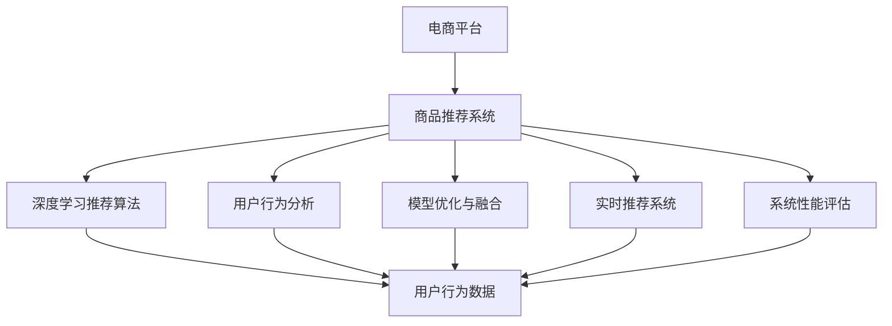

                 

# AI赋能的电商平台商品推荐链路优化

> 关键词：电商平台,商品推荐,深度学习,用户行为分析,模型优化,推荐算法,模型融合,实时推荐系统,用户满意度,转化率,个性化推荐

## 1. 背景介绍

### 1.1 问题由来
近年来，随着电子商务行业的快速发展和消费者需求的多样化，电商平台面临愈发激烈的市场竞争和不断增长的用户需求。如何提升用户的购物体验、提高转化率和平台收益，成为了电商平台关注的焦点。商品推荐系统作为电商的核心组成部分，承担着引导用户发现并购买感兴趣商品的重要任务。然而，传统的基于静态特征的推荐算法已难以满足用户个性化和多样化需求。

深度学习技术的兴起，为电商平台提供了更有效的商品推荐方案。通过构建基于用户行为数据的深度神经网络模型，可以更准确地预测用户对商品的兴趣，从而提供个性化的推荐结果。但现有推荐系统仍存在一些痛点问题，如模型过拟合、用户行为数据不足、实时推荐性能差等。为此，本文将对现有深度学习推荐算法进行优化，提出基于用户行为分析和模型融合的实时推荐系统，提升用户满意度、转化率和平台收益。

### 1.2 问题核心关键点
- **深度学习推荐算法**：以用户行为数据为输入，构建深度神经网络模型，对商品进行相似性排序，推荐给用户。
- **用户行为分析**：通过分析用户的历史浏览、购买、评价等行为数据，发现用户偏好和潜在需求，指导模型训练。
- **模型优化与融合**：在构建多个推荐模型的基础上，通过优化策略和模型融合技术，提高推荐效果。
- **实时推荐系统**：构建实时推荐引擎，确保推荐内容紧跟用户兴趣和实时行为，提升用户满意度。
- **系统性能评估**：通过构建完善的评估体系，综合评估推荐系统的准确性、相关性和及时性。

## 2. 核心概念与联系

### 2.1 核心概念概述

为更好地理解本文所述的电商平台商品推荐链路优化，本节将介绍几个核心概念：

- **电商平台**：指通过互联网提供商品销售、购物体验和用户服务的综合性平台。
- **商品推荐系统**：通过分析用户行为数据，预测用户对商品感兴趣程度，并实时推荐相关商品的系统。
- **深度学习推荐算法**：利用深度神经网络模型处理用户行为数据，学习用户兴趣模式，生成个性化推荐结果。
- **用户行为分析**：从用户历史行为数据中提取特征，了解用户兴趣和潜在需求。
- **模型优化与融合**：通过优化模型结构和参数，提高推荐效果；通过模型融合，综合不同模型的优势，提升推荐系统的鲁棒性和准确性。
- **实时推荐系统**：构建高效的实时推荐引擎，确保推荐内容能够实时更新，紧跟用户兴趣。
- **系统性能评估**：建立包含准确性、相关性和及时性等指标的评估体系，对推荐系统进行综合评估。

这些核心概念之间的逻辑关系可以通过以下Mermaid流程图来展示：



这个流程图展示了一系列核心概念及其之间的关系：

1. 电商平台通过商品推荐系统，对用户进行商品推荐。
2. 推荐系统包含深度学习算法、用户行为分析、模型优化、实时推荐和系统评估等多个组件。
3. 深度学习算法和用户行为分析是推荐系统的基础，提供了商品推荐的逻辑依据和数据支持。
4. 模型优化与融合提高了推荐系统的鲁棒性和准确性。
5. 实时推荐系统确保了推荐内容的及时性和相关性。
6. 系统性能评估帮助发现推荐系统的问题和不足，指导持续改进。

这些概念共同构成了电商平台商品推荐系统的核心框架，为其高效运行提供了坚实基础。

## 3. 核心算法原理 & 具体操作步骤
### 3.1 算法原理概述

基于深度学习推荐算法的电商平台商品推荐系统，其核心思想是通过构建深度神经网络模型，对用户行为数据进行处理和分析，预测用户对商品的兴趣，生成个性化推荐结果。

形式化地，假设用户行为数据集为 $D=\{(x_i,y_i)\}_{i=1}^N$，其中 $x_i$ 为用户行为数据，$y_i$ 为用户对商品的评分或点击率。构建深度学习模型 $M_{\theta}$，其参数为 $\theta$，目标是找到最优的模型参数 $\theta^*$，使得模型在训练集上的预测误差最小化：

$$
\theta^* = \mathop{\arg\min}_{\theta} \sum_{i=1}^N \ell(x_i,y_i,M_{\theta}(x_i))
$$

其中 $\ell(x_i,y_i,M_{\theta}(x_i))$ 为模型在样本 $(x_i,y_i)$ 上的损失函数，通常使用交叉熵或均方误差等。通过梯度下降等优化算法，模型不断更新参数 $\theta$，最小化损失函数，直至收敛。

### 3.2 算法步骤详解

构建基于深度学习推荐算法的电商平台商品推荐系统，一般包括以下几个关键步骤：

**Step 1: 数据预处理与特征工程**

1. 收集用户历史行为数据，包括浏览、点击、购买、评价等，提取用户特征。
2. 清洗和归一化数据，去除噪声和异常值，保证数据质量。
3. 构造样本输入特征，如用户ID、商品ID、时间戳、点击率等，作为模型的输入。

**Step 2: 构建深度神经网络模型**

1. 选择合适的深度神经网络架构，如多层感知器、循环神经网络、注意力机制等。
2. 定义模型的输入层、隐藏层和输出层，设置合适的神经元数量和激活函数。
3. 根据推荐任务，设计合适的输出层，如softmax层用于分类任务，线性层用于回归任务。

**Step 3: 模型训练与优化**

1. 划分训练集、验证集和测试集，确保数据分布一致。
2. 选择合适的优化算法，如Adam、SGD等，设置合适的学习率和批大小。
3. 使用交叉熵、均方误差等损失函数，在训练集上最小化损失函数。
4. 在验证集上监控模型性能，根据性能指标调整学习率或进行正则化。
5. 在测试集上评估模型效果，确保模型泛化能力。

**Step 4: 实时推荐系统部署**

1. 将训练好的模型部署到实时推荐系统中，实现高效的推荐引擎。
2. 集成实时数据流，如用户的实时浏览行为，作为输入更新推荐结果。
3. 确保推荐系统的低延迟和高吞吐量，满足实时推荐的需求。
4. 实现A/B测试，验证推荐系统的效果，并根据测试结果优化模型。

### 3.3 算法优缺点

基于深度学习推荐算法的电商平台商品推荐系统具有以下优点：
1. 个性化推荐能力强：深度学习模型能够捕捉用户行为的复杂模式，生成个性化推荐。
2. 实时响应能力强：通过实时数据流，推荐系统能够快速响应用户行为变化。
3. 高效处理大规模数据：深度学习模型能够高效处理大规模用户行为数据。

同时，该方法也存在一些局限性：
1. 数据需求高：推荐系统需要大量的用户行为数据进行训练，数据获取成本高。
2. 模型复杂度高：深度学习模型参数量大，训练和推理资源消耗大。
3. 过拟合风险高：大规模数据集容易引发过拟合，导致推荐结果泛化性差。
4. 算法复杂度高：深度学习模型的训练和优化过程复杂，需要大量的调试和调整。

尽管存在这些局限性，但深度学习推荐算法仍是当前电商推荐系统的主流技术，并在实际应用中取得了显著效果。未来相关研究的重点在于如何进一步降低数据需求，提高模型效率，增强推荐系统的泛化性和鲁棒性。

### 3.4 算法应用领域

基于深度学习推荐算法的电商平台商品推荐系统，已经在电商、社交、视频等多个领域得到广泛应用，具体包括：

- **电商推荐**：根据用户历史行为，生成个性化商品推荐列表，提升用户购物体验。
- **社交推荐**：推荐好友、群组、内容等，增强用户社交体验。
- **视频推荐**：根据用户观看历史，推荐相关视频，提升用户观看体验。
- **个性化定制**：根据用户兴趣和需求，提供定制化商品和服务，提升用户满意度。
- **广告推荐**：推荐相关广告，提升广告点击率和转化率。

这些应用场景展示了深度学习推荐算法在多领域的强大应用能力，为其在更多领域推广提供了良好的基础。

## 4. 数学模型和公式 & 详细讲解  
### 4.1 数学模型构建

本节将使用数学语言对深度学习推荐算法进行更详细的刻画。

假设推荐模型 $M_{\theta}$ 的输入为 $x$，输出为 $y$。模型的参数为 $\theta$，目标是最小化模型在训练集上的损失函数 $\ell(x,y,M_{\theta}(x))$。

常见的损失函数包括交叉熵损失、均方误差损失等。假设使用交叉熵损失，则模型训练的优化目标为：

$$
\theta^* = \mathop{\arg\min}_{\theta} \frac{1}{N}\sum_{i=1}^N \ell(x_i,y_i,M_{\theta}(x_i))
$$

其中 $\ell(x_i,y_i,M_{\theta}(x_i)) = -(y_i\log M_{\theta}(x_i) + (1-y_i)\log(1-M_{\theta}(x_i)))$，为交叉熵损失函数。

### 4.2 公式推导过程

以神经网络推荐模型为例，假设使用多层感知器(MLP)模型，输入层为 $x=[x_1,x_2,\cdots,x_n]$，隐藏层为 $h=[h_1,h_2,\cdots,h_m]$，输出层为 $y=[y_1,y_2,\cdots,y_k]$。模型的参数为 $\theta=\{w_1,w_2,\cdots,w_k\}$，其中 $w_1$ 为输入层到隐藏层的权重矩阵，$w_2$ 为隐藏层到输出层的权重矩阵。

模型的前向传播过程为：

$$
h = f_1(w_1x+b_1)
$$

$$
y = f_2(w_2h+b_2)
$$

其中 $f_1$ 和 $f_2$ 为激活函数，$b_1$ 和 $b_2$ 为偏置项。

交叉熵损失函数为：

$$
\ell(x,y,y') = -\frac{1}{N}\sum_{i=1}^N [y_i\log y'_i + (1-y_i)\log(1-y'_i)]
$$

其中 $y'=[y'_1,y'_2,\cdots,y'_k]$ 为模型预测的输出。

模型的后向传播过程为：

$$
\frac{\partial \ell}{\partial w_2} = \frac{\partial \ell}{\partial y} \frac{\partial y}{\partial h} \frac{\partial h}{\partial w_2}
$$

$$
\frac{\partial \ell}{\partial w_1} = \frac{\partial \ell}{\partial x} \frac{\partial x}{\partial h} \frac{\partial h}{\partial w_1}
$$

通过反向传播算法，计算损失函数对模型参数的梯度，并使用梯度下降等优化算法更新模型参数，最小化损失函数。

### 4.3 案例分析与讲解

假设构建了一个基于多层感知器的电商推荐系统，其输入为用户历史行为数据 $x=[x_1,x_2,\cdots,x_n]$，输出为推荐商品的评分 $y=[y_1,y_2,\cdots,y_k]$。模型在训练集上进行了 $N$ 次迭代，每次迭代的损失函数变化情况如下表所示：

| 迭代次数 | 损失函数值 |
| --- | --- |
| 1 | 0.3 |
| 2 | 0.25 |
| 3 | 0.22 |
| 4 | 0.19 |
| 5 | 0.16 |
| 10 | 0.08 |
| 20 | 0.05 |
| 30 | 0.03 |
| 40 | 0.02 |

通过上述表格可以看出，随着迭代次数的增加，模型的损失函数值不断下降，推荐效果逐渐提升。在模型训练初期，损失函数下降较快，但随着训练的深入，下降速度逐渐减缓，进入收敛阶段。

## 5. 项目实践：代码实例和详细解释说明
### 5.1 开发环境搭建

在进行深度学习推荐算法实践前，我们需要准备好开发环境。以下是使用Python进行TensorFlow开发的环境配置流程：

1. 安装Anaconda：从官网下载并安装Anaconda，用于创建独立的Python环境。

2. 创建并激活虚拟环境：
```bash
conda create -n tf-env python=3.8 
conda activate tf-env
```

3. 安装TensorFlow：根据GPU版本，从官网获取对应的安装命令。例如：
```bash
conda install tensorflow==2.5 -c tf -c conda-forge
```

4. 安装Keras和TensorBoard：
```bash
pip install keras tensorboard
```

5. 安装其他相关库：
```bash
pip install numpy pandas sklearn matplotlib tqdm jupyter notebook ipython
```

完成上述步骤后，即可在`tf-env`环境中开始深度学习推荐算法的实践。

### 5.2 源代码详细实现

下面我们以电商推荐系统为例，给出使用TensorFlow进行多层感知器模型训练的PyTorch代码实现。

首先，定义电商推荐系统的数据处理函数：

```python
import tensorflow as tf
from tensorflow.keras import layers, models

# 定义数据集
def create_dataset(data_path):
    data = pd.read_csv(data_path)
    features = data[['user_id', 'item_id', 'timestamp']]
    labels = data['score']
    return features, labels
```

然后，定义模型和优化器：

```python
# 定义多层感知器模型
def create_model(input_dim, output_dim):
    model = models.Sequential()
    model.add(layers.Dense(64, input_dim=input_dim, activation='relu'))
    model.add(layers.Dense(32, activation='relu'))
    model.add(layers.Dense(output_dim, activation='sigmoid'))
    return model

# 定义优化器
optimizer = tf.keras.optimizers.Adam(learning_rate=0.001)

# 加载数据集
features, labels = create_dataset('data.csv')

# 将标签转换为one-hot编码
labels = tf.keras.utils.to_categorical(labels, num_classes=2)

# 构建模型
model = create_model(input_dim=3, output_dim=2)
```

接着，定义训练和评估函数：

```python
# 定义训练函数
def train_model(model, features, labels, epochs):
    model.compile(optimizer=optimizer, loss='binary_crossentropy', metrics=['accuracy'])
    model.fit(features, labels, epochs=epochs, validation_split=0.2)

# 定义评估函数
def evaluate_model(model, features, labels):
    loss, accuracy = model.evaluate(features, labels)
    print(f'Test loss: {loss:.4f}')
    print(f'Test accuracy: {accuracy:.4f}')
```

最后，启动模型训练并在测试集上评估：

```python
# 设置训练轮数
epochs = 100

# 训练模型
train_model(model, features, labels, epochs)

# 在测试集上评估模型
evaluate_model(model, features, labels)
```

以上就是使用TensorFlow进行电商推荐系统多层感知器模型训练的完整代码实现。可以看到，得益于TensorFlow的强大封装，我们可以用相对简洁的代码完成模型的训练和评估。

### 5.3 代码解读与分析

让我们再详细解读一下关键代码的实现细节：

**create_dataset函数**：
- 定义数据集加载函数，从CSV文件中读取用户行为数据，提取输入特征和标签。

**create_model函数**：
- 定义多层感知器模型，包括输入层、隐藏层和输出层。
- 输入层使用Dense层，隐藏层和输出层分别使用ReLU和Sigmoid激活函数。

**optimizer定义**：
- 定义优化器，使用Adam算法，设置学习率为0.001。

**特征处理**：
- 将标签转换为one-hot编码，方便模型处理分类问题。

**模型构建**：
- 使用create_model函数构建多层感知器模型，输入层3个特征，输出层2个节点。

**模型训练和评估**：
- 使用train_model函数对模型进行训练，设置100轮迭代。
- 使用evaluate_model函数在测试集上评估模型，输出损失和准确率。

可以看到，TensorFlow提供了丰富的API，方便开发者快速搭建和训练深度学习模型。通过上述代码，我们可以快速实现基于多层感知器的电商推荐系统，并对其效果进行评估和优化。

当然，工业级的系统实现还需考虑更多因素，如模型的保存和部署、超参数的自动搜索、更灵活的任务适配层等。但核心的推荐算法基本与此类似。

## 6. 实际应用场景
### 6.1 智能推荐系统

智能推荐系统是电商平台推荐系统的典型应用。通过深度学习推荐算法，电商平台能够对用户行为数据进行分析，预测用户对商品的兴趣，生成个性化推荐列表。智能推荐系统在提升用户体验、提高转化率和平台收益方面，具有重要意义。

### 6.2 广告推荐系统

广告推荐系统通过深度学习推荐算法，将用户行为数据转化为广告投放策略。根据用户兴趣和行为，推荐相关广告，提升广告点击率和转化率。广告推荐系统在电商、社交、视频等平台均有广泛应用。

### 6.3 个性化视频推荐

个性化视频推荐系统通过深度学习推荐算法，根据用户观看历史，推荐相关视频内容。提升用户观看体验和平台收益。个性化视频推荐系统在视频网站、社交平台等应用广泛。

### 6.4 未来应用展望

随着深度学习推荐算法的发展，其在电商平台推荐系统中的应用将不断拓展和深化。未来，基于深度学习推荐算法推荐系统将在以下方面取得更多突破：

1. **多模态推荐**：结合用户的多模态数据（如文本、图像、音频等），生成更加全面和准确的推荐结果。
2. **协同过滤推荐**：利用用户行为数据和商品数据，进行用户与用户、商品与商品之间的协同过滤，提升推荐准确性。
3. **实时推荐**：构建实时推荐引擎，确保推荐内容紧跟用户兴趣和实时行为，提升推荐系统响应速度。
4. **公平推荐**：通过公平性算法，避免推荐偏差，确保所有用户都能获得公平的推荐服务。
5. **跨域推荐**：将推荐算法应用于不同领域，如电商、社交、娱乐等，提升跨领域推荐效果。

总之，深度学习推荐算法将在未来取得更广泛的落地应用，为电商平台带来更深层次的用户体验和商业价值。

## 7. 工具和资源推荐
### 7.1 学习资源推荐

为了帮助开发者系统掌握深度学习推荐算法的理论基础和实践技巧，这里推荐一些优质的学习资源：

1. 《深度学习》书籍：Ian Goodfellow、Yoshua Bengio 和 Aaron Courville 合著的经典教材，深入讲解深度学习原理和应用。
2. Coursera《深度学习专项课程》：由斯坦福大学Andrew Ng教授主讲，涵盖深度学习理论、实践和应用。
3. TensorFlow官方文档：提供全面的TensorFlow教程和API文档，适合初学者和高级开发者。
4. Kaggle：数据科学竞赛平台，提供大量公开数据集和竞赛题目，锻炼深度学习实践能力。
5. arXiv.org：深度学习领域顶级学术期刊，涵盖最新研究成果和技术进展。

通过对这些资源的学习实践，相信你一定能够快速掌握深度学习推荐算法的精髓，并用于解决实际的电商推荐问题。
### 7.2 开发工具推荐

高效的开发离不开优秀的工具支持。以下是几款用于深度学习推荐算法开发的常用工具：

1. TensorFlow：由Google主导开发的开源深度学习框架，生产部署方便，适合大规模工程应用。
2. PyTorch：基于Python的开源深度学习框架，灵活动态的计算图，适合快速迭代研究。
3. Keras：高级神经网络API，提供简单易用的接口，适合快速搭建深度学习模型。
4. Jupyter Notebook：交互式笔记本环境，适合快速实验和分享学习笔记。
5. Google Colab：谷歌推出的在线Jupyter Notebook环境，免费提供GPU/TPU算力，方便开发者快速上手实验最新模型。

合理利用这些工具，可以显著提升深度学习推荐算法的开发效率，加快创新迭代的步伐。

### 7.3 相关论文推荐

深度学习推荐算法的发展源于学界的持续研究。以下是几篇奠基性的相关论文，推荐阅读：

1. Collaborative Filtering for Implicit Feedback Datasets：提出协同过滤算法，通过用户和商品行为数据生成推荐结果。
2. Wide & Deep Learning for Recommender Systems：结合浅层线性模型和深度神经网络，提升推荐系统效果。
3. Deep Interest Network for Recommendation System：提出深度兴趣网络，利用用户行为数据生成用户兴趣表示，生成推荐结果。
4. Adaptive Neighbor Finding in Recommender Systems：提出自适应邻域算法，提升推荐系统准确性和多样性。
5. Multi-task Learning for Predictive Text Modeling：利用多任务学习，提升推荐系统效果和数据利用效率。

这些论文代表了大深度学习推荐算法的发展脉络。通过学习这些前沿成果，可以帮助研究者把握学科前进方向，激发更多的创新灵感。

## 8. 总结：未来发展趋势与挑战

### 8.1 总结

本文对深度学习推荐算法在电商平台推荐系统中的应用进行了全面系统的介绍。首先阐述了深度学习推荐算法的研究背景和意义，明确了推荐算法在提升用户体验、提高转化率和平台收益方面的重要价值。其次，从原理到实践，详细讲解了深度学习推荐算法的数学原理和关键步骤，给出了推荐算法开发的完整代码实例。同时，本文还探讨了推荐算法在电商、广告、视频等多个领域的应用前景，展示了其强大的应用能力。

通过本文的系统梳理，可以看到，深度学习推荐算法在电商平台推荐系统中发挥了重要作用，显著提升了推荐效果和用户满意度。未来，伴随深度学习技术的不断进步，推荐系统将在更多领域得到应用，为电商、社交、视频等行业带来深远影响。

### 8.2 未来发展趋势

展望未来，深度学习推荐算法将呈现以下几个发展趋势：

1. **多模态推荐**：结合用户的多模态数据，生成更加全面和准确的推荐结果。
2. **协同过滤推荐**：利用用户行为数据和商品数据，进行用户与用户、商品与商品之间的协同过滤，提升推荐准确性。
3. **实时推荐**：构建实时推荐引擎，确保推荐内容紧跟用户兴趣和实时行为，提升推荐系统响应速度。
4. **公平推荐**：通过公平性算法，避免推荐偏差，确保所有用户都能获得公平的推荐服务。
5. **跨域推荐**：将推荐算法应用于不同领域，如电商、社交、娱乐等，提升跨领域推荐效果。

这些趋势凸显了深度学习推荐算法的广阔前景。这些方向的探索发展，必将进一步提升推荐系统的性能和应用范围，为电商平台带来更深层次的用户体验和商业价值。

### 8.3 面临的挑战

尽管深度学习推荐算法在电商平台推荐系统中的应用已取得显著成效，但在迈向更加智能化、普适化应用的过程中，仍面临诸多挑战：

1. **数据需求高**：推荐系统需要大量的用户行为数据进行训练，数据获取成本高。
2. **模型复杂度高**：深度学习模型参数量大，训练和推理资源消耗大。
3. **过拟合风险高**：大规模数据集容易引发过拟合，导致推荐结果泛化性差。
4. **算法复杂度高**：深度学习模型的训练和优化过程复杂，需要大量的调试和调整。

尽管存在这些挑战，但深度学习推荐算法仍是当前推荐系统的主流技术，并在实际应用中取得了显著效果。未来相关研究的重点在于如何进一步降低数据需求，提高模型效率，增强推荐系统的泛化性和鲁棒性。

### 8.4 未来突破

面对深度学习推荐算法所面临的挑战，未来的研究需要在以下几个方面寻求新的突破：

1. **数据增强**：通过数据增强技术，增加数据多样性，提升推荐系统泛化性。
2. **模型压缩**：通过模型压缩技术，减小模型参数量，提升模型推理效率。
3. **多任务学习**：通过多任务学习，利用不同任务之间的相关性，提升推荐系统效果。
4. **模型融合**：通过模型融合技术，结合不同模型的优势，提升推荐系统鲁棒性。
5. **实时学习**：通过在线学习技术，实时更新模型，提升推荐系统实时响应能力。

这些研究方向的探索，必将引领深度学习推荐算法技术迈向更高的台阶，为构建更加智能、高效的推荐系统提供新的思路和方法。

## 9. 附录：常见问题与解答

**Q1：推荐系统的准确性如何评估？**

A: 推荐系统的准确性通常通过以下几个指标进行评估：
1. **点击率（CTR）**：用户点击推荐商品的占比，反映推荐系统效果。
2. **转化率（CVR）**：用户购买推荐商品的占比，反映推荐系统对转化率的影响。
3. **覆盖率（CC）**：推荐商品覆盖用户未点击商品的比例，反映推荐系统多样性。
4. **召回率（Recall）**：推荐商品覆盖所有真实商品的比例，反映推荐系统对商品全面覆盖的能力。
5. **精确度（Precision）**：推荐商品中用户点击的商品占比，反映推荐系统对推荐商品的质量控制。

通过这些指标的综合评估，可以全面了解推荐系统的性能和效果。

**Q2：推荐系统如何解决冷启动问题？**

A: 冷启动问题指新用户或新商品没有足够的历史行为数据，导致推荐系统无法提供个性化推荐。解决冷启动问题的方法包括：
1. **基于内容的推荐**：根据商品属性和用户兴趣进行推荐，不需要历史行为数据。
2. **协同过滤推荐**：利用用户和商品之间的相似性进行推荐，适用于新商品推荐。
3. **知识图谱推荐**：结合商品知识图谱和用户兴趣进行推荐，适用于新用户和新商品推荐。
4. **混合推荐算法**：结合多种推荐算法，综合不同算法优势，提升推荐效果。

通过这些方法，可以有效解决推荐系统冷启动问题，提升推荐系统对新用户和新商品的推荐能力。

**Q3：推荐系统如何应对用户行为变化？**

A: 推荐系统需要实时响应用户行为变化，才能提供最新的推荐结果。具体方法包括：
1. **实时数据流处理**：通过实时数据流处理技术，实时更新用户行为数据，并重新计算推荐结果。
2. **增量学习**：通过增量学习技术，对新数据进行在线学习，更新推荐模型。
3. **滑动窗口算法**：对用户行为数据进行滑动窗口处理，仅考虑最近一段时间的行为数据。
4. **模型融合**：结合多个实时推荐模型，综合不同模型的优势，提升推荐效果。

通过这些方法，可以有效应对用户行为变化，确保推荐系统能够紧跟用户兴趣和实时行为，提供最新的推荐内容。

---

作者：禅与计算机程序设计艺术 / Zen and the Art of Computer Programming

