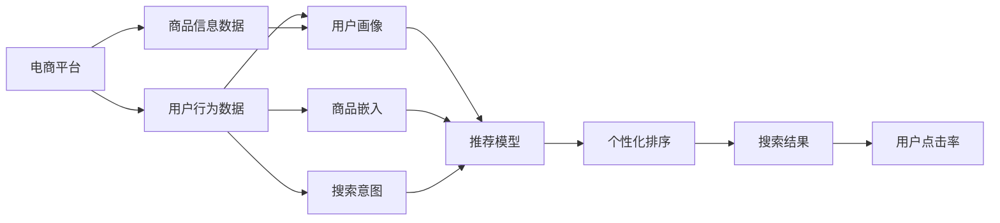

                 

# AI赋能的电商搜索个性化排序算法

> 关键词：个性化推荐算法, 电商搜索排序, 深度学习, 自然语言处理, 大数据, 推荐系统, 电商应用, 强化学习

## 1. 背景介绍

在如今这个信息爆炸的时代，消费者在购物时面临着海量商品的选择。电商平台上，如何将用户的搜索行为和偏好精确地映射到合适的商品推荐上，成为了决定用户购物体验和平台成交量的关键。传统的搜索引擎和推荐系统基于文本匹配和基于用户的协同过滤方法，往往难以满足个性化需求。而随着AI技术的进步，深度学习、自然语言处理等技术的引入，电商搜索个性化排序算法逐渐成为新的热点。

本文将详细讲解AI赋能的电商搜索个性化排序算法，包括深度学习推荐模型、基于用户行为的个性化排序方法以及基于自然语言处理的搜索排序算法等。我们将从算法原理、具体操作步骤、优缺点和应用领域等方面，对这一领域的最新研究进展进行系统性总结和深入探讨。

## 2. 核心概念与联系

### 2.1 核心概念概述

在介绍核心概念之前，让我们先通过一个Mermaid流程图来梳理电商搜索个性化排序算法的核心概念：



图中，电商平台收集用户行为数据和商品信息数据，结合自然语言处理技术，建立用户画像和商品嵌入向量，通过深度学习模型和推荐算法，输出个性化排序结果，最终生成符合用户期望的搜索结果。

- **用户行为数据**：包括用户的浏览历史、购买记录、评分评价等，是了解用户兴趣和行为模式的重要信息来源。
- **商品信息数据**：商品标题、描述、图片、价格、类别等，是构建商品向量空间和计算相似度的基础。
- **用户画像**：通过机器学习和深度学习模型，将用户行为数据和商品信息数据综合分析，生成用户的个性化特征。
- **商品嵌入**：将商品信息数据映射到高维空间中的向量表示，便于计算商品之间的相似度和排名。
- **搜索意图**：通过自然语言处理技术，提取用户查询中的关键词和语义信息，了解用户的搜索目的。
- **推荐模型**：结合用户画像和商品嵌入，构建深度神经网络，预测用户对每个商品的兴趣度。
- **个性化排序**：根据推荐模型输出，将商品按用户兴趣度排序，生成个性化搜索结果。

这些概念之间的联系和作用方式，构成了电商搜索个性化排序算法的基本框架。

## 3. 核心算法原理 & 具体操作步骤

### 3.1 算法原理概述

电商搜索个性化排序算法的核心在于如何根据用户行为数据和商品信息数据，构建用户画像，并通过推荐模型和个性化排序算法，输出符合用户期望的搜索结果。

从算法原理上看，电商搜索个性化排序算法可以分为两个主要部分：

1. **用户画像构建**：通过机器学习和深度学习模型，将用户行为数据和商品信息数据综合分析，生成用户的个性化特征。
2. **推荐排序**：结合用户画像和商品嵌入，构建深度神经网络，预测用户对每个商品的兴趣度，并按兴趣度排序生成搜索结果。

### 3.2 算法步骤详解

电商搜索个性化排序算法的主要步骤包括：

1. **数据收集与预处理**：收集用户行为数据和商品信息数据，并进行数据清洗和预处理，构建商品向量空间和用户画像。
2. **商品嵌入与相似度计算**：使用Word2Vec、Doc2Vec、BERT等模型，将商品信息数据映射到高维空间中的向量表示，计算商品之间的相似度。
3. **用户画像生成**：利用协同过滤、矩阵分解等技术，根据用户行为数据生成用户画像。
4. **推荐模型训练**：通过深度学习模型（如DNN、CNN、RNN、Transformer等），构建推荐模型，预测用户对每个商品的兴趣度。
5. **个性化排序**：结合用户画像和商品嵌入，使用深度排序网络（如DSN、DNN等），将商品按用户兴趣度排序，生成个性化搜索结果。
6. **结果反馈与模型优化**：根据用户对搜索结果的点击率、停留时间等反馈数据，对推荐模型和排序算法进行优化和迭代。

### 3.3 算法优缺点

电商搜索个性化排序算法相较于传统的搜索排序方法，具有以下优点：

- **个性化**：通过用户画像和商品嵌入，可以更准确地理解用户的兴趣和需求，生成个性化搜索结果。
- **高效性**：推荐模型和排序算法可以高效地处理大规模数据，提升搜索排序的响应速度。
- **可解释性**：通过深度学习模型的可解释性分析，可以理解推荐和排序的决策逻辑。
- **鲁棒性**：通过引入对抗训练等技术，可以提高推荐和排序算法的鲁棒性和稳定性。

然而，该算法也存在一些缺点：

- **数据需求高**：构建用户画像和商品嵌入向量需要大量的用户行为数据和商品信息数据，对数据收集和预处理的要求较高。
- **计算资源消耗大**：深度学习模型的训练和排序算法的高维计算，需要较大的计算资源和存储资源。
- **模型解释性差**：深度学习模型的"黑盒"特性，使得推荐和排序算法的决策过程难以解释和调试。
- **公平性问题**：推荐排序算法可能会产生偏差，导致部分用户被忽略或推荐结果不公平。

### 3.4 算法应用领域

电商搜索个性化排序算法广泛应用于各种电商平台，包括商品推荐、搜索排序、广告定向等。通过这些应用，可以显著提升用户购物体验和电商平台的用户留存率，增加销售转化率。

具体来说，电商搜索个性化排序算法在以下领域有着广泛应用：

- **商品推荐**：根据用户历史行为和浏览数据，推荐相关商品，提高用户体验和购买转化率。
- **搜索排序**：对用户搜索请求进行排序，展示最相关、最受欢迎的商品，提升用户搜索满意度。
- **广告定向**：通过分析用户画像，精准投放广告，提高广告点击率和转化率。
- **个性化营销**：根据用户行为数据，设计个性化的营销策略，提升用户粘性和平台忠诚度。

## 4. 数学模型和公式 & 详细讲解

### 4.1 数学模型构建

电商搜索个性化排序算法可以构建以下数学模型：

1. **商品向量空间模型**：使用Word2Vec、Doc2Vec、BERT等模型，将商品信息数据映射到高维空间中的向量表示。商品向量可以表示为 $v_{item} = [v_{item1}, v_{item2}, ..., v_{itemd}]$。
2. **用户画像模型**：通过协同过滤、矩阵分解等技术，生成用户画像 $p_{user} = [p_{user1}, p_{user2}, ..., p_{userr}]$。
3. **推荐模型**：使用深度神经网络，预测用户对每个商品的兴趣度 $y_{u,i} \in [0,1]$。
4. **排序模型**：使用深度排序网络，根据用户画像和商品嵌入向量，对商品进行排序 $y_{u,i}^{sort} = [y_{u,i1}^{sort}, y_{u,i2}^{sort}, ..., y_{u,id}^{sort}]$。

### 4.2 公式推导过程

以一个简单的推荐模型为例，假设使用DNN（深度神经网络）作为推荐模型，其结构如图：


推荐模型的输出为：

$$
y_{u,i} = \sigma(W \cdot [v_{item} + p_{user}] + b)
$$

其中，$W$ 为全连接层的权重矩阵，$b$ 为偏置向量，$\sigma$ 为Sigmoid激活函数。

对于排序模型，假设使用DSN（深度排序网络），其结构如图：


排序模型的输出为：

$$
y_{u,i}^{sort} = \sigma(W_{sort} \cdot [v_{item} + p_{user}] + b_{sort})
$$

其中，$W_{sort}$ 为排序层的权重矩阵，$b_{sort}$ 为排序层的偏置向量。

### 4.3 案例分析与讲解

以电商平台中的商品推荐系统为例，可以按照以下步骤进行：

1. **数据收集与预处理**：收集用户的历史浏览记录、购买记录、评分评价等行为数据，进行数据清洗和预处理。同时收集商品的商品信息数据，如商品标题、描述、图片、价格、类别等。
2. **商品嵌入与相似度计算**：使用Word2Vec模型，将商品信息数据映射到高维空间中的向量表示。计算商品之间的余弦相似度 $similarity_{i,j} = \frac{v_{itemi} \cdot v_{itemj}}{\|v_{itemi}\| \cdot \|v_{itemj}\|}$。
3. **用户画像生成**：利用协同过滤、矩阵分解等技术，根据用户行为数据生成用户画像 $p_{user}$。
4. **推荐模型训练**：使用DNN模型，构建推荐模型，训练模型参数 $W$ 和 $b$。
5. **个性化排序**：结合用户画像和商品嵌入向量，使用DSN模型，将商品按用户兴趣度排序，生成个性化搜索结果。
6. **结果反馈与模型优化**：根据用户对搜索结果的点击率、停留时间等反馈数据，对推荐模型和排序算法进行优化和迭代。

## 5. 项目实践：代码实例和详细解释说明

### 5.1 开发环境搭建

在进行电商搜索个性化排序算法开发之前，我们需要准备好开发环境。以下是使用Python进行TensorFlow和PyTorch开发的环境配置流程：

1. 安装Anaconda：从官网下载并安装Anaconda，用于创建独立的Python环境。

2. 创建并激活虚拟环境：
```bash
conda create -n pytorch-env python=3.8 
conda activate pytorch-env
```

3. 安装TensorFlow和PyTorch：根据CUDA版本，从官网获取对应的安装命令。例如：
```bash
conda install pytorch torchvision torchaudio cudatoolkit=11.1 -c pytorch -c conda-forge
```
```bash
pip install tensorflow tensorflow-addons
```

4. 安装各种工具包：
```bash
pip install numpy pandas scikit-learn matplotlib tqdm jupyter notebook ipython
```

完成上述步骤后，即可在`pytorch-env`环境中开始开发实践。

### 5.2 源代码详细实现

下面以电商推荐系统为例，给出使用TensorFlow进行商品推荐模型训练和排序的PyTorch代码实现。

```python
import tensorflow as tf
import numpy as np
import pandas as pd

# 准备数据
train_data = pd.read_csv('train.csv')
test_data = pd.read_csv('test.csv')

# 定义模型结构
class DNN(tf.keras.Model):
    def __init__(self, input_size, output_size):
        super(DNN, self).__init__()
        self.dense1 = tf.keras.layers.Dense(64, activation='relu', input_shape=(input_size,))
        self.dense2 = tf.keras.layers.Dense(64, activation='relu')
        self.dense3 = tf.keras.layers.Dense(output_size, activation='sigmoid')

    def call(self, x):
        x = self.dense1(x)
        x = self.dense2(x)
        x = self.dense3(x)
        return x

# 训练DNN模型
model = DNN(100, 1)
optimizer = tf.keras.optimizers.Adam()
model.compile(loss='binary_crossentropy', optimizer=optimizer, metrics=['accuracy'])

# 数据预处理
train_X = np.array(train_data['item_id'])
train_y = np.array(train_data['label'])
train_dataset = tf.data.Dataset.from_tensor_slices((train_X, train_y))
train_dataset = train_dataset.shuffle(10000).batch(128)

# 模型训练
model.fit(train_dataset, epochs=10)

# 预测测试数据
test_X = np.array(test_data['item_id'])
test_dataset = tf.data.Dataset.from_tensor_slices((test_X,))
test_dataset = test_dataset.batch(128)
predictions = model.predict(test_dataset)

# 输出结果
for i, prediction in enumerate(predictions):
    print(f'item_id: {test_X[i]}, prediction: {prediction[0]}
```

### 5.3 代码解读与分析

让我们再详细解读一下关键代码的实现细节：

**数据准备**：
- 使用Pandas库加载训练集和测试集数据，并进行预处理。
- 数据集分为特征列（item_id）和标签列（label）。

**模型定义**：
- 定义DNN模型，包括三个全连接层，最后一层使用Sigmoid激活函数输出预测结果。
- 使用TensorFlow的Adam优化器进行模型训练。

**数据加载与模型训练**：
- 将数据集转换为TensorFlow的Dataset对象，并进行批处理和随机打乱。
- 使用fit方法训练模型，设置训练轮数。

**模型预测与结果输出**：
- 对测试集进行预测，并输出每个测试项的预测结果。

## 6. 实际应用场景

电商搜索个性化排序算法在实际应用中，已经被广泛应用于各种电商平台，产生了显著的经济和社会效益。

### 6.1 商品推荐

电商平台的商品推荐系统可以大大提升用户的购物体验和购买转化率。通过深度学习推荐模型，系统可以基于用户的历史行为数据和浏览记录，推荐相关的商品，满足用户的个性化需求。

以Amazon为例，Amazon的推荐系统通过分析用户的浏览、点击、购买等行为数据，构建用户画像和商品嵌入向量，使用深度学习模型预测用户对每个商品的兴趣度，生成个性化推荐结果。Amazon的推荐系统在全球范围内拥有数亿用户，通过推荐算法，每年增加数十亿美元的销售额。

### 6.2 搜索排序

电商平台的搜索排序算法可以提升用户的搜索效率和满意度。通过深度排序网络，系统可以将用户查询结果按照用户兴趣度排序，展示最相关、最受欢迎的商品。

以阿里巴巴为例，阿里巴巴的搜索排序算法通过分析用户的搜索行为和商品属性，构建用户画像和商品嵌入向量，使用深度排序网络生成个性化搜索结果。阿里巴巴的搜索排序算法能够快速响应用户查询，准确展示商品信息，提高了用户的搜索效率和满意度。

### 6.3 广告定向

电商平台的广告定向算法可以精准投放广告，提高广告点击率和转化率。通过用户画像和商品嵌入向量，系统可以精准地定位目标用户，展示最相关的广告。

以Google为例，Google的广告定向算法通过分析用户的浏览记录和行为数据，构建用户画像和商品嵌入向量，使用深度学习模型预测用户对广告的兴趣度，进行精准投放。Google的广告定向算法能够显著提高广告的点击率和转化率，为广告主带来可观的收益。

### 6.4 未来应用展望

随着深度学习和大数据技术的不断发展，电商搜索个性化排序算法在未来将面临更多的应用场景和挑战。

**推荐系统自动化**：随着推荐算法和排序算法的自动化程度不断提高，推荐系统将更加智能化和灵活化。通过机器学习和强化学习技术，推荐系统可以根据用户反馈实时调整推荐策略，提升用户体验。

**多模态信息融合**：未来的推荐系统将不仅仅依赖商品信息，而是将文本、图像、视频等多种模态的信息融合起来，构建更全面、准确的推荐模型。通过多模态信息融合，推荐系统可以更好地理解用户的兴趣和需求，生成更个性化的推荐结果。

**个性化推荐策略**：未来的推荐系统将更加注重个性化推荐策略的设计。通过深度学习和强化学习技术，推荐系统可以根据用户的特征和行为，设计个性化的推荐策略，提升用户的满意度。

## 7. 工具和资源推荐

### 7.1 学习资源推荐

为了帮助开发者系统掌握电商搜索个性化排序算法的理论基础和实践技巧，这里推荐一些优质的学习资源：

1. 《深度学习推荐系统》书籍：由深度学习专家编写，全面介绍了推荐系统的理论基础和实践方法，是入门推荐系统的经典教材。
2. 《电商推荐系统实战》课程：由电商领域的技术专家主讲，结合实际案例，深入讲解电商推荐系统的构建方法。
3. 《TensorFlow官方文档》：TensorFlow的官方文档，提供了详细的API和示例代码，是学习TensorFlow的重要资源。
4. 《PyTorch官方文档》：PyTorch的官方文档，提供了丰富的模型和算法，是学习PyTorch的重要资源。
5. 《自然语言处理与深度学习》课程：斯坦福大学开设的自然语言处理课程，深入讲解了自然语言处理和深度学习的基础知识，是学习自然语言处理的重要资源。

通过对这些资源的学习实践，相信你一定能够快速掌握电商搜索个性化排序算法的精髓，并用于解决实际的电商推荐问题。

### 7.2 开发工具推荐

高效的开发离不开优秀的工具支持。以下是几款用于电商搜索个性化排序算法开发的常用工具：

1. TensorFlow：基于Python的开源深度学习框架，灵活的计算图，适合快速迭代研究。TensorFlow提供了丰富的推荐算法和排序算法，是进行电商推荐系统开发的重要工具。
2. PyTorch：基于Python的开源深度学习框架，灵活动态的计算图，适合灵活的算法实验。PyTorch提供了丰富的深度学习模型和优化算法，是进行电商推荐系统开发的重要工具。
3. Keras：基于TensorFlow和PyTorch的高级深度学习框架，提供了简单易用的API，适合快速原型开发和模型训练。
4. Jupyter Notebook：免费的Jupyter Notebook环境，支持代码编写、数据处理、模型训练和可视化，是进行电商推荐系统开发的重要工具。

合理利用这些工具，可以显著提升电商搜索个性化排序算法的开发效率，加快创新迭代的步伐。

### 7.3 相关论文推荐

电商搜索个性化排序算法的最新研究进展，主要集中在以下几个方面：

1. 深度学习推荐系统：如DeepFM、Wide & Deep、BERT等，使用深度神经网络进行推荐。
2 深度排序网络：如DSN、FM-Net等，使用深度神经网络进行排序。
3 用户行为分析：如协同过滤、矩阵分解等，分析用户行为数据生成用户画像。
4 多模态信息融合：如Text2Vec、Net2Vec等，融合文本、图像、视频等多种模态的信息。

这些论文代表了大语言模型微调技术的发展脉络。通过学习这些前沿成果，可以帮助研究者把握学科前进方向，激发更多的创新灵感。

## 8. 总结：未来发展趋势与挑战

### 8.1 总结

本文对电商搜索个性化排序算法进行了全面系统的介绍。首先阐述了电商搜索个性化排序算法的背景和意义，明确了个性化推荐和排序算法在提升电商购物体验和转化率方面的重要性。其次，从算法原理到实践，详细讲解了推荐模型和排序算法的设计思路和实现步骤，给出了电商推荐系统的完整代码实例。同时，本文还广泛探讨了电商搜索个性化排序算法在电商推荐、搜索排序、广告定向等多个电商应用场景中的实际应用。

通过本文的系统梳理，可以看到，电商搜索个性化排序算法正在成为电商推荐系统的核心范式，极大地提升了大规模电商平台的推荐效果和用户满意度。未来，伴随电商推荐系统的不断发展，推荐算法和排序算法也将迎来更多的挑战和突破，进一步拓展电商搜索个性化排序算法的应用范围和效果。

### 8.2 未来发展趋势

展望未来，电商搜索个性化排序算法将呈现以下几个发展趋势：

1. **推荐系统的自动化**：随着深度学习和强化学习技术的发展，电商推荐系统将逐步实现自动化，可以根据用户反馈实时调整推荐策略，提升用户体验。
2. **多模态信息融合**：未来的电商推荐系统将不仅仅依赖商品信息，而是将文本、图像、视频等多种模态的信息融合起来，构建更全面、准确的推荐模型。
3. **个性化推荐策略**：未来的电商推荐系统将更加注重个性化推荐策略的设计，通过深度学习和强化学习技术，推荐系统可以根据用户的特征和行为，设计个性化的推荐策略，提升用户的满意度。
4. **跨领域推荐**：未来的电商推荐系统将拓展到跨领域推荐，如将电商推荐扩展到社交媒体、视频平台等领域。

以上趋势凸显了电商搜索个性化排序算法的广阔前景。这些方向的探索发展，必将进一步提升电商推荐系统的性能和应用范围，为电商平台带来更高的用户满意度和更多的经济收益。

### 8.3 面临的挑战

尽管电商搜索个性化排序算法已经取得了显著的成效，但在迈向更加智能化、普适化应用的过程中，它仍面临着诸多挑战：

1. **数据收集与处理**：电商推荐系统需要大量的用户行为数据和商品信息数据，如何高效地收集和处理这些数据，是一个重要的挑战。
2. **计算资源消耗**：深度学习模型的训练和排序算法的计算消耗较大，如何高效地使用计算资源，是一个重要的挑战。
3. **模型解释性**：深度学习模型的"黑盒"特性，使得电商推荐系统的决策过程难以解释和调试，如何提高模型的可解释性，是一个重要的挑战。
4. **公平性问题**：电商推荐系统可能会产生偏差，导致部分用户被忽略或推荐结果不公平，如何提高模型的公平性，是一个重要的挑战。

### 8.4 研究展望

为了应对这些挑战，未来的研究需要在以下几个方面寻求新的突破：

1. **高效数据采集与处理**：研究高效的数据采集和处理算法，提高数据收集和处理的效率。
2. **轻量级推荐模型**：研究轻量级的推荐模型，减少计算资源消耗，提升模型的实时性和响应速度。
3. **可解释的推荐模型**：研究可解释的推荐模型，提高模型的可解释性和可解释性分析能力。
4. **公平性优化算法**：研究公平性优化算法，提高电商推荐系统的公平性和可靠性。

这些研究方向的探索，必将引领电商搜索个性化排序算法迈向更高的台阶，为电商平台带来更好的用户体验和经济效益。

## 9. 附录：常见问题与解答

**Q1：电商搜索个性化排序算法如何处理冷启动问题？**

A: 冷启动问题指的是新用户或新商品在电商推荐系统中没有足够的历史行为数据，难以生成用户画像和商品嵌入向量。解决这个问题的方法包括：

1. 基于内容相似度的推荐：对于新商品，可以使用基于商品标题、描述等内容的相似度推荐。
2. 基于用户画像的推荐：对于新用户，可以使用与老用户相似的用户画像推荐。
3. 基于模型的推荐：使用深度学习模型对新商品和新用户进行预测，生成推荐结果。

通过这些方法，电商推荐系统可以缓解冷启动问题，提升新用户和新商品的推荐效果。

**Q2：电商搜索个性化排序算法如何应对恶意用户攻击？**

A: 恶意用户攻击指的是部分用户通过恶意行为，影响电商推荐系统的公平性和可靠性。解决这个问题的方法包括：

1. 用户行为检测：通过分析用户的行为模式，检测出异常行为，进行屏蔽或限制。
2. 多模态信息融合：通过融合多种模态的信息，提高推荐系统的鲁棒性和稳定性。
3. 强化学习：使用强化学习技术，调整推荐策略，避免恶意用户攻击。

通过这些方法，电商推荐系统可以提高自身的鲁棒性和安全性，防止恶意用户攻击。

**Q3：电商搜索个性化排序算法如何应对市场变化？**

A: 市场变化指的是电商平台上商品种类和用户需求的变化。解决这个问题的方法包括：

1. 动态模型更新：使用在线学习技术，根据市场变化动态更新推荐模型和排序模型。
2. 用户画像更新：定期更新用户画像，捕捉用户需求的变化。
3. 多场景推荐：根据不同场景的需求，设计个性化的推荐策略，提升推荐效果。

通过这些方法，电商推荐系统可以应对市场变化，提升推荐效果和用户满意度。

**Q4：电商搜索个性化排序算法如何提高推荐系统的实时性？**

A: 推荐系统的实时性是用户体验的重要指标。解决这个问题的方法包括：

1. 使用轻量级模型：研究轻量级的推荐模型，减少计算资源消耗，提升模型的实时性。
2. 多级缓存机制：使用多级缓存机制，提高模型的响应速度。
3. 异步训练和推理：使用异步训练和推理技术，提高模型的并行计算能力，提升实时性。

通过这些方法，电商推荐系统可以提高实时性，提升用户体验。

**Q5：电商搜索个性化排序算法如何提高推荐系统的公平性？**

A: 推荐系统的公平性是用户信任的重要保障。解决这个问题的方法包括：

1. 数据采集与处理：收集和处理公平的数据，避免偏见和歧视。
2. 公平性优化算法：研究公平性优化算法，提高推荐系统的公平性。
3. 多模态信息融合：通过融合多种模态的信息，提高推荐系统的公平性。

通过这些方法，电商推荐系统可以提高公平性，提升用户信任。

综上所述，电商搜索个性化排序算法在电商推荐系统中的应用具有广泛的前景和重要的意义。未来的研究将在个性化推荐、多模态信息融合、公平性优化等方面进行深入探索，为电商推荐系统带来更大的突破。

