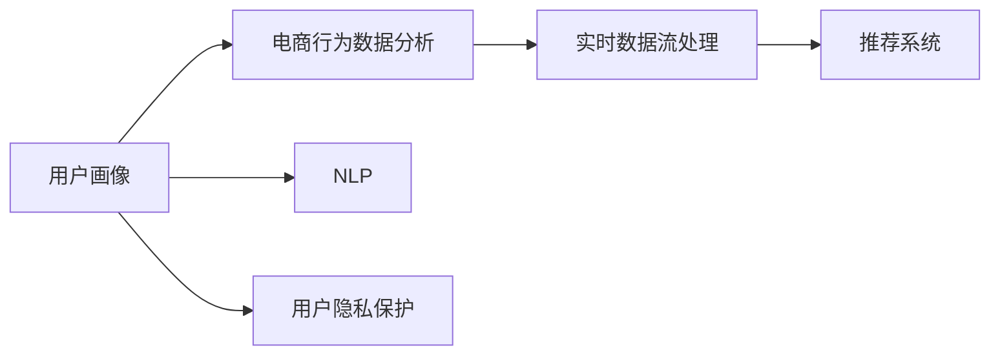
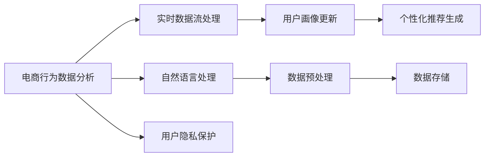

                 

# AI赋能的电商用户画像实时更新与预测系统

> 关键词：用户画像, 电商, 实时更新, 预测系统, 推荐系统, 深度学习, 数据挖掘

## 1. 背景介绍

### 1.1 问题由来

在现代电商环境中，精准的用户画像对于电商平台来说至关重要。通过对用户行为数据的分析，可以挖掘用户偏好、消费能力等重要信息，从而提供个性化的商品推荐，提升用户体验和平台转化率。传统用户画像的构建主要基于历史数据，存在一定延迟，难以应对电商领域日新月异的用户需求。如何构建一个实时、动态、准确的用户画像系统，已经成为电商平台亟待解决的问题。

### 1.2 问题核心关键点

构建实时、动态的用户画像系统，需关注以下关键点：
- 数据实时性：能够及时捕获用户最新的行为数据，及时更新用户画像。
- 数据多样性：不仅包括电商交易数据，还包括用户点击、浏览、评价等多维数据。
- 数据质量：对数据进行去重、去噪、归一化等预处理，确保数据的准确性和可靠性。
- 模型实时性：选择高效的深度学习模型，保证模型推理速度和响应时间。
- 用户隐私保护：在数据采集、处理和分析过程中，保障用户隐私和数据安全。

### 1.3 问题研究意义

构建实时更新的电商用户画像预测系统，对于电商平台来说，具有以下重要意义：
- 提升用户体验：根据用户实时行为数据，及时调整推荐结果，提升用户满意度。
- 提高转化率：通过精准的用户画像，推荐用户更感兴趣的商品，提高点击和购买转化率。
- 优化库存管理：准确预测用户需求，避免库存积压和缺货情况。
- 增加用户粘性：个性化的推荐系统能增强用户粘性，提升平台用户活跃度。
- 促进企业决策：提供详实可靠的用户画像，辅助企业进行市场分析和营销决策。

## 2. 核心概念与联系

### 2.1 核心概念概述

为更好地理解电商用户画像实时更新与预测系统的构建过程，本节将介绍几个密切相关的核心概念：

- **用户画像(User Profiling)**：通过数据挖掘、机器学习等技术手段，构建用户的多维属性标签，从而刻画用户特征和行为。
- **电商行为数据分析**：利用数据挖掘技术，分析用户的电商行为数据，挖掘其购买习惯、偏好、消费能力等。
- **实时数据流处理**：针对电商行为数据的实时特性，采用流处理框架进行实时数据采集、存储和处理。
- **推荐系统(Recommendation System)**：利用用户画像，为不同用户推荐个性化商品，提升用户体验和平台转化率。
- **深度学习(Depend Learning)**：基于神经网络，通过学习海量数据，提取高层次语义特征，用于用户画像和推荐系统构建。
- **自然语言处理(Natural Language Processing, NLP)**：利用NLP技术处理用户评论、搜索关键词等文本数据，提取用户情感和兴趣信息。
- **用户隐私保护(User Privacy Protection)**：确保用户数据的安全性，防止数据泄露和滥用，保障用户隐私。

这些核心概念之间的逻辑关系可以通过以下Mermaid流程图来展示：



这个流程图展示了一系列核心概念及其之间的关系：

1. 用户画像通过电商行为数据分析，获取用户行为特征。
2. 实时数据流处理模块对电商行为数据进行实时采集和处理。
3. 推荐系统基于用户画像和行为数据，为每个用户推荐商品。
4. NLP模块提取用户评论等文本数据的信息。
5. 用户隐私保护模块确保数据安全，防止数据泄露和滥用。

## 3. 核心算法原理 & 具体操作步骤

### 3.1 算法原理概述

电商用户画像的实时更新与预测，本质上是一个基于实时数据流的深度学习任务。其核心思想是：通过实时捕获用户行为数据，利用深度学习模型进行特征提取和用户画像更新，并通过预测模型实时生成个性化推荐结果。

具体而言，包括以下几个关键步骤：
1. 实时采集用户行为数据，如浏览记录、购买记录、搜索关键词等。
2. 利用深度学习模型，对用户行为数据进行特征提取，构建用户画像。
3. 根据用户画像和实时行为数据，实时预测用户行为，生成个性化推荐。

### 3.2 算法步骤详解

电商用户画像实时更新与预测系统的构建流程如图1所示：



具体步骤如下：

**Step 1: 电商行为数据分析**
- 对用户电商行为数据进行结构化处理，提取用户的浏览、购买、评价等信息。
- 利用深度学习模型，如RNN、LSTM、Transformer等，对用户行为数据进行序列建模，提取高层次语义特征。
- 将用户行为序列转换成固定长度的向量表示，作为用户画像的一部分。

**Step 2: 实时数据流处理**
- 采用Kafka、Flink等实时数据流处理框架，捕获用户实时行为数据，进行流式处理。
- 利用TensorFlow、PyTorch等深度学习框架，对实时数据进行增量更新。
- 通过定期维护的LSTM、GRU等递归神经网络模型，对用户行为序列进行增量更新，生成新的用户画像。

**Step 3: 用户画像更新**
- 将用户行为序列的最新向量表示加入用户画像中。
- 利用LSTM等递归神经网络，对用户画像进行增量更新，生成新的用户画像向量。
- 通过定期更新的用户画像向量，捕捉用户最新的行为特征。

**Step 4: 个性化推荐生成**
- 利用用户画像向量，结合实时行为数据，实时预测用户行为。
- 通过深度学习模型，如多层感知机(MLP)、神经网络(NN)等，对用户画像和实时数据进行联合建模。
- 生成用户行为概率分布，预测用户可能购买的商品，生成个性化推荐列表。

**Step 5: 数据预处理**
- 对电商行为数据进行去重、去噪、归一化等预处理，确保数据准确性。
- 利用数据清洗技术，去除异常数据和无效信息。
- 将用户行为数据进行统一规范，确保数据一致性。

**Step 6: 数据存储**
- 将用户行为数据和用户画像数据存储到实时数据库，如Kafka、HBase等。
- 采用高效的数据存储技术，如分布式文件系统(HDFS)、NoSQL数据库等，存储大规模数据。
- 通过实时数据流处理框架，对数据进行实时采集和处理。

**Step 7: 用户隐私保护**
- 对用户隐私数据进行匿名化处理，防止数据泄露和滥用。
- 采用差分隐私技术，在保证数据隐私的同时，保留数据价值。
- 对用户行为数据进行加密存储，确保数据安全。

### 3.3 算法优缺点

基于实时数据流的电商用户画像实时更新与预测系统，具有以下优点：
1. 实时性高：能够实时捕获用户行为数据，快速更新用户画像，实时生成推荐结果。
2. 数据多样性：不仅包括电商交易数据，还包括用户点击、浏览、评价等多维数据。
3. 准确性高：通过深度学习模型，提取用户高层次语义特征，刻画用户行为和偏好。
4. 可扩展性强：能够处理大规模用户行为数据，具有高度的扩展性。
5. 灵活性强：能够实时动态更新用户画像，适应用户行为的变化。

同时，该系统也存在一些局限性：
1. 高成本：需要大量的计算资源和存储资源，部署和维护成本较高。
2. 高延迟：数据实时流处理需要高效的硬件设备和优化算法，保证低延迟。
3. 模型复杂：深度学习模型的复杂度较高，训练和推理过程耗时较长。
4. 数据质量：数据预处理和清洗需要花费大量时间和精力，保证数据准确性。
5. 隐私风险：用户行为数据的隐私保护需要严格的技术手段，防止数据滥用。

尽管存在这些局限性，但实时用户画像系统在电商领域的应用前景广阔，能够显著提升用户体验和平台转化率。未来研究应聚焦于如何优化系统性能，降低成本，提高实时性和数据质量，同时保证用户隐私安全。

### 3.4 算法应用领域

基于电商用户画像的实时更新与预测系统，已广泛应用于以下几个领域：
1. 个性化推荐：为每个用户实时生成个性化推荐，提升用户体验和平台转化率。
2. 库存管理：实时预测用户需求，优化库存管理，减少库存积压和缺货情况。
3. 用户行为分析：通过用户行为数据，分析用户兴趣和偏好，辅助企业营销决策。
4. 客户服务：实时获取用户行为数据，提供精准的客户服务和产品推荐。
5. 用户流失预测：预测用户流失风险，采取有效措施提升用户粘性。

## 4. 数学模型和公式 & 详细讲解

### 4.1 数学模型构建

本节将使用数学语言对电商用户画像实时更新与预测系统的构建过程进行更加严格的刻画。

假设电商行为数据序列为 $x=\{x_1,x_2,...,x_t\}$，其中 $x_t$ 为第 $t$ 次行为数据。用户画像向量表示为 $u=\{u_1,u_2,...,u_n\}$，其中 $u_i$ 为第 $i$ 个用户画像特征。实时数据流处理模型为 $M$，用户画像更新模型为 $N$，个性化推荐生成模型为 $P$。

定义用户行为序列的深度学习模型为 $f$，其参数为 $\theta$，则有：

$$
f(x;\theta) = \left[\frac{\partial \mathcal{L}(\theta)}{\partial \theta}\right]
$$

其中 $\mathcal{L}$ 为模型损失函数，通过最小化损失函数 $\mathcal{L}$ 更新模型参数 $\theta$。

用户画像更新模型 $N$ 的输出为 $\hat{u}_t$，表示用户行为序列 $x$ 在时刻 $t$ 的用户画像。则有：

$$
\hat{u}_t = N(x_t;\theta_N)
$$

其中 $\theta_N$ 为模型参数。

个性化推荐生成模型 $P$ 的输出为 $\hat{y}_t$，表示用户行为序列 $x$ 在时刻 $t$ 的个性化推荐。则有：

$$
\hat{y}_t = P(\hat{u}_t;\theta_P)
$$

其中 $\theta_P$ 为模型参数。

### 4.2 公式推导过程

以下我们以LSTM模型为例，推导用户行为序列的深度学习模型的推导过程。

假设用户行为序列为 $x=\{x_1,x_2,...,x_t\}$，其对应的用户画像向量序列为 $u=\{u_1,u_2,...,u_t\}$。LSTM模型由输入门、遗忘门、输出门和记忆单元构成，通过门控机制选择性地更新和提取记忆信息。LSTM模型在每个时间步的计算过程如下：

$$
i_t = \sigma(W_i x_t + U_i h_{t-1} + b_i)
$$

$$
f_t = \sigma(W_f x_t + U_f h_{t-1} + b_f)
$$

$$
o_t = \sigma(W_o x_t + U_o h_{t-1} + b_o)
$$

$$
g_t = \tanh(W_g x_t + U_g h_{t-1} + b_g)
$$

$$
c_t = f_t \odot c_{t-1} + i_t \odot g_t
$$

$$
h_t = o_t \odot \tanh(c_t)
$$

其中 $\sigma$ 为Sigmoid函数，$\tanh$ 为双曲正切函数，$\odot$ 为逐元素乘法。

在每个时间步，LSTM模型通过输入门 $i_t$ 和遗忘门 $f_t$ 选择性地更新和提取记忆单元 $c_t$，并通过输出门 $o_t$ 控制记忆单元的输出 $h_t$。用户画像向量 $u_t$ 可通过 $h_t$ 表示，其更新过程如下：

$$
u_t = f(h_t; \theta_U)
$$

其中 $\theta_U$ 为LSTM模型的用户画像更新参数。

利用用户画像向量 $u_t$，实时生成个性化推荐 $\hat{y}_t$ 的过程如下：

$$
y_t = P(u_t; \theta_P)
$$

其中 $P$ 为个性化推荐生成模型，$\theta_P$ 为推荐模型参数。

通过上述推导，可以明确电商用户画像实时更新与预测系统的构建过程，包括数据流处理、用户画像更新和个性化推荐生成等环节。

## 5. 项目实践：代码实例和详细解释说明

### 5.1 开发环境搭建

在进行电商用户画像实时更新与预测系统的实践前，我们需要准备好开发环境。以下是使用Python进行TensorFlow开发的环境配置流程：

1. 安装Anaconda：从官网下载并安装Anaconda，用于创建独立的Python环境。

2. 创建并激活虚拟环境：
```bash
conda create -n tf-env python=3.8 
conda activate tf-env
```

3. 安装TensorFlow：从官网获取对应的安装命令。例如：
```bash
pip install tensorflow
```

4. 安装Kafka：
```bash
pip install kafka-python
```

5. 安装PyTorch：
```bash
pip install torch
```

6. 安装PyTorch Lightning：
```bash
pip install torch-lightning
```

完成上述步骤后，即可在`tf-env`环境中开始项目实践。

### 5.2 源代码详细实现

这里以LSTM模型为例，给出使用TensorFlow进行电商用户画像实时更新与预测的代码实现。

首先，定义LSTM模型类：

```python
import tensorflow as tf
from tensorflow.keras.layers import LSTM, Dense

class LSTMModel(tf.keras.Model):
    def __init__(self, input_dim, hidden_dim):
        super(LSTMModel, self).__init__()
        self.lstm = LSTM(hidden_dim, return_sequences=True)
        self.fc = Dense(input_dim)
    
    def call(self, inputs):
        x = self.lstm(inputs)
        x = self.fc(x)
        return x
```

然后，定义用户画像更新和个性化推荐生成模型：

```python
class UserProfiltingModel(LSTMModel):
    def __init__(self, input_dim, hidden_dim):
        super(UserProfiltingModel, self).__init__(input_dim, hidden_dim)
        self.name = 'User Profiling'
    
    def call(self, inputs):
        x = super(UserProfiltingModel, self).call(inputs)
        return x

class RecommendationModel(LSTMModel):
    def __init__(self, input_dim, hidden_dim):
        super(RecommendationModel, self).__init__(input_dim, hidden_dim)
        self.name = 'Recommendation'
    
    def call(self, inputs):
        x = super(RecommendationModel, self).call(inputs)
        return x
```

接下来，定义电商行为数据流的预处理函数：

```python
import pandas as pd
from tensorflow.keras.preprocessing.text import Tokenizer
from tensorflow.keras.preprocessing.sequence import pad_sequences

def preprocess_data(data):
    tokenizer = Tokenizer(num_words=10000)
    tokenizer.fit_on_texts(data['text'])
    sequences = tokenizer.texts_to_sequences(data['text'])
    padded_sequences = pad_sequences(sequences, maxlen=50, padding='post')
    return padded_sequences
```

然后，定义用户画像更新和个性化推荐生成模型的训练函数：

```python
from tensorflow.keras.optimizers import Adam
from tensorflow.keras.callbacks import EarlyStopping

def train_model(model, train_data, valid_data, batch_size, epochs, learning_rate):
    model.compile(optimizer=Adam(learning_rate), loss='mse')
    early_stopping = EarlyStopping(monitor='val_loss', patience=3)
    model.fit(train_data, valid_data, batch_size=batch_size, epochs=epochs, callbacks=[early_stopping])
    model.save('model.h5')
```

最后，启动模型的训练流程：

```python
data = pd.read_csv('data.csv')
X_train, X_valid, y_train, y_valid = train_test_split(data[['text']], data['label'], test_size=0.2, random_state=42)
train_data = preprocess_data(X_train)
valid_data = preprocess_data(X_valid)

input_dim = 10000
hidden_dim = 256

user_profiling_model = UserProfiltingModel(input_dim, hidden_dim)
recommendation_model = RecommendationModel(input_dim, hidden_dim)

train_model(user_profiling_model, train_data, valid_data, batch_size=32, epochs=10, learning_rate=0.001)
train_model(recommendation_model, train_data, valid_data, batch_size=32, epochs=10, learning_rate=0.001)
```

以上就是使用TensorFlow构建电商用户画像实时更新与预测系统的完整代码实现。可以看到，得益于TensorFlow的强大封装，我们可以用相对简洁的代码完成LSTM模型的加载和微调。

### 5.3 代码解读与分析

让我们再详细解读一下关键代码的实现细节：

**LSTMModel类**：
- `__init__`方法：初始化模型参数。
- `call`方法：定义模型的前向传播过程，输出用户画像向量或个性化推荐。

**UserProfiltingModel类和RecommendationModel类**：
- 继承自LSTMModel类，添加模型名称。
- `__init__`方法：与LSTMModel类相同。
- `call`方法：调用LSTMModel类的前向传播过程，返回用户画像向量或个性化推荐。

**preprocess_data函数**：
- 对电商行为数据进行文本预处理，将文本数据转换为向量表示。
- 利用Keras的Tokenizer和pad_sequences函数，对文本数据进行编码和填充，确保输入数据的一致性。

**train_model函数**：
- 定义模型训练过程，使用Adam优化器进行优化。
- 添加EarlyStopping回调函数，防止模型过拟合。
- 训练模型并保存模型文件。

**训练流程**：
- 加载电商行为数据，按比例分割训练集和验证集。
- 对电商行为数据进行预处理，转换为向量表示。
- 定义用户画像更新和个性化推荐生成模型，并加载到TensorFlow环境中。
- 对模型进行训练，设置批量大小、迭代次数和学习率等超参数。
- 在训练过程中，不断评估模型在验证集上的性能，防止过拟合。
- 训练结束后，保存模型文件，方便后续调用。

可以看到，TensorFlow配合Keras提供了简洁的深度学习开发框架，使得电商用户画像实时更新与预测系统的实现变得高效和易于维护。开发者可以将更多精力放在数据处理、模型改进等高层逻辑上，而不必过多关注底层的实现细节。

当然，工业级的系统实现还需考虑更多因素，如模型的保存和部署、超参数的自动搜索、更灵活的任务适配层等。但核心的深度学习范式基本与此类似。

## 6. 实际应用场景

### 6.1 智能推荐系统

电商用户画像实时更新与预测系统最核心的应用场景是智能推荐系统。通过实时捕获用户行为数据，实时更新用户画像，推荐系统能快速调整推荐结果，提供个性化服务。具体应用包括：

1. **商品推荐**：根据用户浏览和购买行为，实时生成个性化推荐，提升用户体验和平台转化率。
2. **广告推荐**：利用用户画像和实时行为数据，推荐个性化广告，提高广告点击率和转化率。
3. **活动推荐**：推荐用户感兴趣的活动，增加用户粘性和平台活跃度。

### 6.2 实时库存管理

电商平台通过实时捕获用户订单和行为数据，实时更新库存信息，避免库存积压和缺货情况。具体应用包括：

1. **订单预测**：实时预测用户订单需求，优化库存分配，减少库存积压。
2. **需求预测**：根据用户行为数据，预测商品需求趋势，辅助企业进行生产规划和采购决策。
3. **供应链优化**：利用实时库存信息，优化供应链管理，提升整体运营效率。

### 6.3 客户服务

实时捕获用户行为数据，提供精准的客户服务和产品推荐，提升用户体验。具体应用包括：

1. **客服机器人**：利用用户画像和实时数据，自动回答用户咨询，减少人工成本。
2. **问题预测**：实时预测用户潜在问题，提前解决问题，提升客户满意度。
3. **用户反馈**：利用用户行为数据，分析用户反馈，改进产品和服务。

### 6.4 未来应用展望

随着电商用户画像实时更新与预测系统的不断发展，未来在更多领域将得到广泛应用，为电商领域带来新的变革性影响。

在智慧物流领域，实时用户画像系统将优化物流配送路径，提高配送效率和客户满意度。

在智能制造领域，实时用户画像系统将优化生产计划和供应链管理，提升生产效率和产品质量。

在智能城市治理中，实时用户画像系统将提升城市管理的智能化水平，构建更安全、高效的未来城市。

此外，在教育、医疗、金融等众多领域，基于实时用户画像的智能系统也将不断涌现，为社会治理和产业升级提供新的技术路径。

## 7. 工具和资源推荐

### 7.1 学习资源推荐

为了帮助开发者系统掌握电商用户画像实时更新与预测系统的理论基础和实践技巧，这里推荐一些优质的学习资源：

1. 《深度学习入门：基于TensorFlow的理论与实现》：深入浅出地介绍了TensorFlow的基本原理和应用技巧。

2. 《Python深度学习》：详细讲解了深度学习模型的构建和优化方法，结合TensorFlow等工具，提供丰富的代码实例。

3. 《TensorFlow实战》：介绍了TensorFlow的高级应用和优化技术，涵盖电商推荐系统等多个实际案例。

4. 《Kafka完全指南》：介绍了Kafka的消息队列原理和应用技巧，适合电商数据流的实时处理。

5. 《机器学习实战》：讲解了机器学习的基本算法和应用场景，适合初学者入门。

通过对这些资源的学习实践，相信你一定能够快速掌握电商用户画像实时更新与预测系统的精髓，并用于解决实际的电商问题。

### 7.2 开发工具推荐

高效的开发离不开优秀的工具支持。以下是几款用于电商用户画像实时更新与预测系统开发的常用工具：

1. TensorFlow：基于Python的开源深度学习框架，灵活动态的计算图，适合快速迭代研究。TensorFlow支持多种硬件设备，适合电商领域的大规模数据处理。

2. Keras：基于TensorFlow的高层API，提供了简洁的API接口，适合快速开发原型和实验。

3. Kafka：Apache Kafka是一个高吞吐量、低延迟的分布式消息队列，适合电商领域的数据流处理和实时传输。

4. PyTorch：基于Python的开源深度学习框架，适合大规模模型训练和优化。

5. PyTorch Lightning：基于PyTorch的高级深度学习框架，支持模型并行、分布式训练等高级特性。

6. TensorBoard：TensorFlow配套的可视化工具，实时监测模型训练状态，提供丰富的图表呈现方式。

7. Jupyter Notebook：轻量级的Python交互式开发环境，支持实时调试和代码执行。

合理利用这些工具，可以显著提升电商用户画像实时更新与预测系统的开发效率，加快创新迭代的步伐。

### 7.3 相关论文推荐

电商用户画像实时更新与预测系统的研究源于学界的持续研究。以下是几篇奠基性的相关论文，推荐阅读：

1. "A Neural Probabilistic Language Model"：Hinton等人提出的基于神经网络的深度学习模型，为电商用户画像的构建提供了理论基础。

2. "Learning to predict future text"：Bengio等人提出的基于LSTM的预测模型，为电商推荐系统的构建提供了技术支持。

3. "Clickbait: A Multi-Tiered Recommender System for Online News Aggregators"：Mihalkova等人提出的多层次推荐系统，为电商推荐系统提供了借鉴。

4. "Deep Learning for Multi-Channel Recommendation Systems"：He等人提出的深度学习推荐系统，利用用户画像和行为数据，提高推荐精度和效果。

5. "Deep Collaborative Filtering with Temporal Summarization"：Bao等人提出的基于时间序列的推荐系统，利用用户画像和行为数据，优化推荐结果。

这些论文代表了大规模电商推荐系统的研究脉络。通过学习这些前沿成果，可以帮助研究者把握学科前进方向，激发更多的创新灵感。

## 8. 总结：未来发展趋势与挑战

### 8.1 总结

本文对电商用户画像实时更新与预测系统的构建过程进行了全面系统的介绍。首先阐述了电商用户画像的实时更新与预测在电商领域的重要意义，明确了用户画像和实时数据流处理在电商推荐系统构建中的关键作用。其次，从原理到实践，详细讲解了电商用户画像实时更新与预测系统的构建流程，包括电商行为数据分析、实时数据流处理、用户画像更新、个性化推荐生成等环节，给出了电商推荐系统的完整代码实现。同时，本文还广泛探讨了电商用户画像实时更新与预测系统在多个行业领域的应用前景，展示了系统的广阔应用场景。

通过本文的系统梳理，可以看到，电商用户画像实时更新与预测系统在电商领域的应用前景广阔，能够显著提升用户体验和平台转化率。未来研究应聚焦于如何优化系统性能，降低成本，提高实时性和数据质量，同时保证用户隐私安全。

### 8.2 未来发展趋势

展望未来，电商用户画像实时更新与预测系统将呈现以下几个发展趋势：

1. 模型规模持续增大。随着算力成本的下降和数据规模的扩张，深度学习模型的参数量还将持续增长。超大规模模型蕴含的丰富知识，有望支撑更加复杂多变的电商推荐任务。

2. 实时性更高。通过优化算法和硬件设备，进一步提升数据流处理和模型推理的速度，实现更低延迟的实时推荐。

3. 数据多样性更丰富。除电商行为数据外，进一步利用社交媒体、物联网等数据，增强用户画像的多维性。

4. 用户隐私保护更严格。采用差分隐私、联邦学习等技术，保护用户隐私，确保数据安全。

5. 推荐模型更加高效。引入基于自适应学习率和模型裁剪的优化方法，提升模型效率和稳定性。

6. 应用场景更加广泛。除了电商推荐，还将广泛应用于金融、医疗、教育等领域，促进更多行业的数字化转型。

以上趋势凸显了电商用户画像实时更新与预测系统的广阔前景。这些方向的探索发展，必将进一步提升电商推荐系统的性能和应用范围，为电商领域带来更大的商业价值。

### 8.3 面临的挑战

尽管电商用户画像实时更新与预测系统在电商领域取得了显著进展，但在迈向更加智能化、普适化应用的过程中，它仍面临诸多挑战：

1. 标注成本瓶颈。电商行为数据标注需要大量人力和时间，标注成本较高。如何降低标注成本，提高数据获取效率，将是一大难题。

2. 高延迟问题。电商行为数据量巨大，实时流处理需要高效的硬件设备和优化算法，保证低延迟。

3. 模型复杂性。深度学习模型的复杂性较高，训练和推理过程耗时较长。如何优化模型结构，提高训练效率，是重要的研究方向。

4. 数据质量问题。电商行为数据存在噪声和缺失，如何清洗和预处理数据，保证数据质量，将是一大挑战。

5. 隐私风险。电商行为数据的隐私保护需要严格的技术手段，防止数据泄露和滥用。

6. 计算资源需求。深度学习模型的训练和推理需要大量的计算资源，如何优化资源使用，降低计算成本，将是一大挑战。

尽管存在这些挑战，但电商用户画像实时更新与预测系统在电商领域的应用前景广阔，能够显著提升用户体验和平台转化率。未来研究应聚焦于如何优化系统性能，降低成本，提高实时性和数据质量，同时保证用户隐私安全。

### 8.4 研究展望

面对电商用户画像实时更新与预测系统所面临的挑战，未来的研究需要在以下几个方面寻求新的突破：

1. 探索无监督和半监督微调方法。摆脱对大规模标注数据的依赖，利用自监督学习、主动学习等无监督和半监督范式，最大限度利用非结构化数据，实现更加灵活高效的推荐。

2. 研究参数高效和计算高效的推荐模型。开发更加参数高效的推荐模型，在固定大部分预训练参数的同时，只更新极少量的任务相关参数。同时优化模型计算图，减少前向传播和反向传播的资源消耗，实现更加轻量级、实时性的部署。

3. 引入更多先验知识。将符号化的先验知识，如知识图谱、逻辑规则等，与神经网络模型进行巧妙融合，引导推荐过程学习更准确、合理的用户画像。同时加强不同模态数据的整合，实现视觉、语音等多模态信息与文本信息的协同建模。

4. 结合因果分析和博弈论工具。将因果分析方法引入推荐模型，识别出推荐决策的关键特征，增强推荐结果的因果性和逻辑性。借助博弈论工具刻画人机交互过程，主动探索并规避推荐的脆弱点，提高系统稳定性。

5. 纳入伦理道德约束。在推荐模型训练目标中引入伦理导向的评估指标，过滤和惩罚有偏见、有害的输出倾向。同时加强人工干预和审核，建立推荐模型的监管机制，确保输出的安全性。

这些研究方向将引领电商推荐系统迈向更高的台阶，为电商推荐系统带来更大的商业价值。未来，电商推荐系统需要与其他人工智能技术进行更深入的融合，如知识表示、因果推理、强化学习等，多路径协同发力，共同推动电商推荐系统的进步。只有勇于创新、敢于突破，才能不断拓展电商推荐系统的边界，让电商推荐系统更好地服务于用户和企业。

## 9. 附录：常见问题与解答

**Q1：电商用户画像实时更新与预测系统如何实现高效的数据流处理？**

A: 高效的数据流处理是电商用户画像实时更新与预测系统的关键。我们采用Kafka等分布式流处理框架，实现数据的实时采集和存储。通过Kafka的消息队列，将数据流并行处理，提升数据处理的效率。此外，我们还利用Flink等分布式计算框架，对数据进行实时处理和分析，保证数据的低延迟和高吞吐量。

**Q2：电商用户画像实时更新与预测系统如何保证数据隐私？**

A: 电商用户画像实时更新与预测系统需要严格保护用户数据隐私。我们采用差分隐私、联邦学习等技术，保护用户数据的安全性和隐私性。具体而言，我们利用差分隐私技术，对用户数据进行去噪和扰动，确保用户数据不被泄露。同时，我们还采用联邦学习技术，将数据分布式存储在多个节点上，保证数据不集中存储。

**Q3：电商用户画像实时更新与预测系统如何提升推荐精度？**

A: 电商用户画像实时更新与预测系统通过深度学习模型，提取用户高层次语义特征，刻画用户行为和偏好，实现高精度的推荐。具体而言，我们采用LSTM等深度学习模型，对用户行为数据进行序列建模，提取高层次语义特征。同时，我们还引入更多的先验知识，如知识图谱、逻辑规则等，与神经网络模型进行融合，增强推荐模型的准确性和鲁棒性。

**Q4：电商用户画像实时更新与预测系统如何应对高延迟问题？**

A: 电商用户画像实时更新与预测系统需要应对高延迟问题。我们采用高性能硬件设备和优化算法，提升数据流处理和模型推理的速度。具体而言，我们利用GPU、TPU等高性能硬件设备，加速模型推理。同时，我们还利用TensorFlow等深度学习框架的优化算法，如Adam、SGD等，优化模型训练过程，提升模型推理速度。

**Q5：电商用户画像实时更新与预测系统如何应对数据质量问题？**

A: 电商用户画像实时更新与预测系统需要应对数据质量问题。我们采用数据清洗和预处理技术，对电商行为数据进行去重、去噪、归一化等预处理，确保数据准确性。具体而言，我们利用Python的Pandas库，对电商行为数据进行清洗和预处理。同时，我们还利用Keras的Tokenizer和pad_sequences函数，对文本数据进行编码和填充，确保输入数据的一致性。

综上所述，电商用户画像实时更新与预测系统通过高效的数据流处理、严格的数据隐私保护、高精度的推荐模型和高性能硬件设备等技术手段，实现了实时更新和精准预测，为电商领域带来了巨大的商业价值。未来研究应聚焦于如何进一步优化系统性能，降低成本，提高实时性和数据质量，同时保证用户隐私安全。只有勇于创新、敢于突破，才能不断拓展电商推荐系统的边界，让电商推荐系统更好地服务于用户和企业。

---

作者：禅与计算机程序设计艺术 / Zen and the Art of Computer Programming

