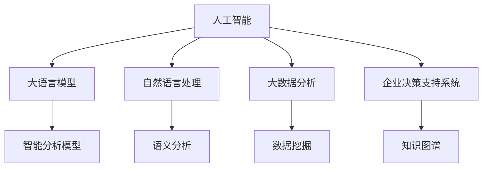

                 

# AI辅助决策：LLM在企业管理中的应用前景

> 关键词：人工智能,LLM,企业决策,大数据,自然语言处理

## 1. 背景介绍

### 1.1 问题由来
随着企业信息化进程的不断深入，数据量呈现爆炸式增长，企业决策的复杂度也在日益增加。传统的决策方式主要依赖经验判断和人工分析，无法快速应对瞬息万变的市场环境，且在数据量过大时难以有效利用。人工智能（AI）的兴起，特别是大语言模型（Large Language Models, LLM），为企业管理决策带来了新的思路和方法。

### 1.2 问题核心关键点
在企业管理决策中应用AI辅助决策，主要关注以下问题：
- 如何利用LLM处理和分析海量企业数据？
- 如何在数据驱动的基础上，通过自然语言处理（Natural Language Processing, NLP）技术进行高效决策？
- 如何通过构建智能分析模型，提升决策效率和准确性？

### 1.3 问题研究意义
将LLM应用于企业管理决策，对于提升企业的决策效率、风险控制、市场竞争力和整体管理水平具有重要意义：
1. 快速响应市场变化：通过大数据分析和智能模型，企业可以迅速掌握市场趋势和客户需求，作出及时调整。
2. 降低决策风险：通过数据分析和模型预测，帮助企业识别潜在风险点，制定规避策略。
3. 优化资源配置：智能分析模型可以全面评估各业务部门的表现，指导资源合理分配。
4. 提升决策质量：基于数据和逻辑推理，辅助决策者作出更准确、客观的判断。

## 2. 核心概念与联系

### 2.1 核心概念概述

为更好地理解LLM在企业管理决策中的应用，本节将介绍几个密切相关的核心概念：

- 人工智能（AI）：通过算法和机器学习技术，模拟人类智能行为，实现自主决策和问题解决。
- 大语言模型（LLM）：以深度学习为核心的自然语言处理模型，具有强大的自然语言理解和生成能力。
- 自然语言处理（NLP）：涉及计算机与人类语言之间的交互和理解，使计算机能够理解、分析、生成和翻译人类语言。
- 大数据分析（Big Data Analytics）：对海量数据进行分析和挖掘，发现其中的价值和规律，为决策提供数据支撑。
- 企业决策支持系统（Decision Support System, DSS）：利用计算机技术和数据分析，辅助企业进行决策的系统。
- 知识图谱（Knowledge Graph）：通过语义网络表示知识结构，支持事实推理和语义查询。

这些概念之间的逻辑关系可以通过以下Mermaid流程图来展示：



这个流程图展示了大语言模型在企业管理决策中的应用路径：

1. 通过AI和大语言模型进行数据分析和建模。
2. 利用NLP技术对数据进行语义理解和处理。
3. 通过大数据分析技术，挖掘数据的深层价值。
4. 结合知识图谱，进行事实推理和语义查询。
5. 最终通过智能分析模型辅助决策，构建企业决策支持系统。

## 3. 核心算法原理 & 具体操作步骤
### 3.1 算法原理概述

在企业管理决策中应用LLM，主要依赖于以下几个关键步骤：

1. **数据采集与预处理**：从企业内部和外部的各种数据源中收集数据，并进行清洗和预处理。
2. **自然语言处理**：利用NLP技术，将非结构化文本数据转换为结构化信息，如实体识别、关系抽取等。
3. **大语言模型预训练**：使用大规模无标签文本数据进行预训练，构建通用语言模型。
4. **微调与训练**：在大规模预训练模型基础上，使用企业特定任务进行微调，训练模型。
5. **智能分析与推理**：通过智能分析模型进行多维度分析，生成决策建议。
6. **可视化与报告**：将分析结果通过可视化工具展示，辅助管理层进行决策。

### 3.2 算法步骤详解

**Step 1: 数据采集与预处理**
- 收集企业内部数据，如财务报表、销售记录、市场调研等。
- 整合企业外部数据，如市场分析报告、新闻资讯、社交媒体评论等。
- 清洗和预处理数据，去除噪声和冗余信息。
- 进行特征提取，将文本数据转换为模型可处理的格式。

**Step 2: 自然语言处理**
- 使用NLP技术对文本数据进行分词、词性标注、命名实体识别等。
- 构建语义分析模型，提取文本中的实体关系和关键信息。
- 通过关系抽取和图谱构建，形成知识图谱，支持语义查询和事实推理。

**Step 3: 大语言模型预训练**
- 使用大规模无标签文本数据，如维基百科、新闻、小说等，进行预训练。
- 构建通用语言模型，如GPT、BERT等，学习语言知识。
- 预训练过程中，利用自监督学习任务，如掩码语言模型、下一句预测等，提高模型泛化能力。

**Step 4: 微调与训练**
- 选择适用于企业管理任务的语言模型，如GPT-3、BERT等。
- 使用企业特定的标注数据，如财务预测、市场分析、客户行为分析等，进行微调。
- 设置合适的学习率、优化器、正则化等参数，进行模型训练。
- 定期评估模型性能，避免过拟合。

**Step 5: 智能分析与推理**
- 利用训练好的模型，进行多维度数据分析，如财务报表分析、市场趋势预测、客户行为分析等。
- 构建智能分析模型，如回归分析、时间序列分析、聚类分析等，生成决策建议。
- 利用知识图谱，进行事实推理和语义查询，增强分析结果的准确性。

**Step 6: 可视化与报告**
- 将分析结果通过可视化工具展示，如Tableau、Power BI等，辅助决策者理解。
- 生成详细的决策报告，包含关键指标、趋势分析、预测结果等。
- 提供数据驱动的决策依据，帮助企业制定战略和运营策略。

### 3.3 算法优缺点

应用LLM于企业管理决策，有以下优点：
1. **高效处理海量数据**：LLM可以高效处理和分析海量文本数据，快速提取有用信息。
2. **灵活应用领域广泛**：LLM在多个领域具有广泛的适用性，包括金融、制造、零售等。
3. **提升决策质量**：基于数据和逻辑推理，LLM能提供更准确、客观的决策建议。
4. **支持动态调整**：LLM可以实时更新数据和模型，保持决策系统的时效性。

同时，也存在一些局限性：
1. **数据质量要求高**：LLM依赖于高质量的输入数据，数据噪声和偏差会影响分析结果。
2. **模型复杂度**：LLM模型复杂，训练和推理资源消耗较大。
3. **解释性不足**：LLM模型具有"黑盒"特性，决策过程难以解释和理解。
4. **依赖标注数据**：微调过程需要大量标注数据，标注成本较高。

尽管存在这些局限性，LLM在企业管理决策中的应用仍具有巨大潜力，未来需要进一步优化和改进。

### 3.4 算法应用领域

LLM在企业管理决策中的应用广泛，包括但不限于以下领域：

- **财务预测与分析**：利用LLM进行财务报表分析、预测未来收入和支出、评估投资风险等。
- **市场分析与客户洞察**：通过分析市场趋势、消费者行为、竞争对手动态，指导企业战略规划。
- **运营管理与供应链优化**：利用LLM进行生产计划、库存管理、供应链优化等决策支持。
- **风险管理与合规监控**：通过风险评估和合规监控，提升企业风险控制能力。
- **人力资源管理**：利用LLM进行人才招聘、绩效评估、员工关系管理等决策支持。
- **市场营销与品牌管理**：通过分析客户反馈、社交媒体数据，制定市场营销策略、品牌管理方案。

这些领域都是企业管理中非常重要的方面，LLM的应用有助于提升企业决策的科学性和效率。

## 4. 数学模型和公式 & 详细讲解 & 举例说明

### 4.1 数学模型构建

在企业管理决策中，常见的数学模型包括回归分析、时间序列分析、聚类分析等。以下以回归分析为例，介绍基于LLM的企业决策模型。

设企业预测指标为 $y$，相关特征向量为 $X$，预测模型为 $M_{\theta}$。回归分析的目标是最小化预测误差 $\epsilon$，即：

$$
\min_{\theta} \sum_{i=1}^n (y_i - M_{\theta}(X_i))^2
$$

其中，$n$ 为样本数量，$\epsilon$ 为预测误差。

### 4.2 公式推导过程

利用最小二乘法求解回归模型的参数 $\theta$，推导如下：

$$
\theta = (X^TX)^{-1}X^Ty
$$

其中，$(X^TX)^{-1}$ 为矩阵 $X^TX$ 的逆矩阵，$X^Ty$ 为矩阵 $X$ 和 $y$ 的矩阵乘积。

### 4.3 案例分析与讲解

假设企业需要预测下季度销售收入 $y$，相关特征包括上季度销售收入、市场趋势、季节性因素等。将这些特征作为向量 $X$，利用上述公式求解模型参数 $\theta$，得到预测模型 $M_{\theta}(X)$。

在实际应用中，企业可以将销售数据输入模型，得到下季度销售预测结果。该模型可以定期更新，以反映最新的市场动态和趋势变化。

## 5. 项目实践：代码实例和详细解释说明
### 5.1 开发环境搭建

在进行LLM应用实践前，我们需要准备好开发环境。以下是使用Python进行PyTorch开发的环境配置流程：

1. 安装Anaconda：从官网下载并安装Anaconda，用于创建独立的Python环境。

2. 创建并激活虚拟环境：
```bash
conda create -n llm-env python=3.8 
conda activate llm-env
```

3. 安装PyTorch：根据CUDA版本，从官网获取对应的安装命令。例如：
```bash
conda install pytorch torchvision torchaudio cudatoolkit=11.1 -c pytorch -c conda-forge
```

4. 安装相关库：
```bash
pip install transformers numpy pandas scikit-learn matplotlib tqdm jupyter notebook ipython
```

完成上述步骤后，即可在`llm-env`环境中开始LLM应用实践。

### 5.2 源代码详细实现

以下是一个基于PyTorch和BERT模型的财务预测项目，用于演示LLM在企业管理决策中的应用。

首先，导入必要的库和数据集：

```python
import torch
import pandas as pd
import numpy as np
from transformers import BertTokenizer, BertForRegression
from sklearn.model_selection import train_test_split
from sklearn.metrics import mean_squared_error

# 加载数据集
df = pd.read_csv('sales_data.csv')

# 分割数据集
X = df.drop('revenue', axis=1)
y = df['revenue']
X_train, X_test, y_train, y_test = train_test_split(X, y, test_size=0.2, random_state=42)
```

然后，定义BERT模型并进行微调：

```python
# 构建BERT模型
tokenizer = BertTokenizer.from_pretrained('bert-base-uncased')
model = BertForRegression.from_pretrained('bert-base-uncased')

# 微调模型
model.train()
optimizer = torch.optim.Adam(model.parameters(), lr=1e-5)
for epoch in range(10):
    for i, (inputs, labels) in enumerate(train_loader):
        inputs = inputs.to(device)
        labels = labels.to(device)
        outputs = model(inputs)
        loss = loss_fn(outputs, labels)
        optimizer.zero_grad()
        loss.backward()
        optimizer.step()

    # 评估模型
    with torch.no_grad():
        predictions = model(X_test.to(device))
        rmse = np.sqrt(mean_squared_error(y_test.to(device), predictions.to('cpu')))
        print(f'Epoch {epoch+1}, RMSE: {rmse:.4f}')
```

最后，进行预测并输出结果：

```python
# 进行预测
model.eval()
with torch.no_grad():
    predictions = model(X_test.to(device))
    y_pred = predictions.to('cpu').numpy()
    y_test = y_test.to('cpu').numpy()
    rmse = np.sqrt(mean_squared_error(y_test, y_pred))
    print(f'RMSE: {rmse:.4f}')
```

这就是一个简单的基于LLM的财务预测项目，利用BERT模型进行回归分析。在实际应用中，可以根据具体需求调整模型结构和超参数，以获得更好的预测效果。

### 5.3 代码解读与分析

让我们再详细解读一下关键代码的实现细节：

**数据加载与处理**：
- 使用Pandas库加载企业销售数据，进行特征工程和数据分割。
- 使用sklearn的train_test_split方法，将数据集分割为训练集和测试集。

**模型构建与微调**：
- 使用BertTokenizer对输入数据进行分词，构建BERT模型。
- 使用Adam优化器进行模型微调，设置学习率为1e-5。
- 通过训练循环，逐步更新模型参数，最小化预测误差。
- 定期在测试集上评估模型性能，输出RMSE值。

**预测与结果展示**：
- 使用测试集进行模型预测，将结果转换为NumPy数组。
- 计算预测结果与真实值之间的RMSE，评估模型预测精度。
- 输出最终RMSE值，供决策者参考。

可以看到，利用PyTorch和BERT模型，可以高效地实现财务预测等企业管理任务。代码实现简洁高效，易于理解与扩展。

## 6. 实际应用场景

### 6.1 智能财务分析

在企业管理中，财务分析是至关重要的决策依据之一。利用LLM进行财务分析，可以大幅提升数据处理和分析的效率，帮助企业快速识别财务风险和机会。

具体应用场景包括：
- **财务报表分析**：对企业季度和年度财务报表进行详细分析，提取关键指标和趋势变化。
- **预算与预测**：基于历史数据和市场趋势，进行销售收入、成本费用、现金流等预测，支持预算编制和调整。
- **投资分析**：利用NLP技术，对投资项目进行文本分析，提取关键信息，评估项目风险和收益。

通过LLM进行财务分析，企业可以更全面、深入地了解财务状况，制定科学合理的决策方案。

### 6.2 客户行为分析

客户行为分析是企业管理决策中不可或缺的一环，利用LLM进行客户行为分析，可以深入理解客户需求和行为模式，制定有效的营销策略。

具体应用场景包括：
- **客户画像构建**：通过分析客户评论、社交媒体互动、购买记录等文本数据，构建详细的客户画像，支持个性化营销。
- **客户满意度评估**：利用NLP技术，对客户反馈和评论进行情感分析，评估客户满意度，及时调整服务策略。
- **客户流失预警**：通过分析客户行为变化，识别流失风险，提前采取挽留措施。

通过LLM进行客户行为分析，企业可以更精准地定位目标客户，提高客户满意度和忠诚度，增强市场竞争力。

### 6.3 供应链优化

供应链管理是企业运营的重要环节，利用LLM进行供应链优化，可以提升供应链效率，降低运营成本。

具体应用场景包括：
- **需求预测**：基于历史销售数据和市场趋势，进行需求预测，优化库存管理。
- **供应商选择**：利用NLP技术，分析供应商评价和反馈，选择最优供应商。
- **物流优化**：通过分析运输和配送数据，优化物流路径和仓储布局，提升配送效率。

通过LLM进行供应链优化，企业可以更高效地管理供应链，提升运营效率和客户满意度。

### 6.4 未来应用展望

随着LLM技术的不断发展，其在企业管理决策中的应用前景将更加广阔：

1. **实时决策支持**：通过构建实时数据流，利用LLM进行实时分析，支持企业快速响应市场变化。
2. **跨领域应用**：LLM在金融、制造、零售等多个领域的应用将进一步深入，带来更多创新应用场景。
3. **多模态融合**：结合图像、视频、声音等多模态数据，利用LLM进行综合分析，提升决策的全面性和准确性。
4. **个性化决策**：利用LLM进行个性化推荐，根据不同用户需求提供定制化服务，提升用户体验。
5. **伦理与安全**：在模型训练和使用过程中，引入伦理和安全约束，确保AI决策的公正性和安全性。

未来，LLM将在企业管理决策中发挥更大的作用，助力企业实现智能化转型，提升核心竞争力。

## 7. 工具和资源推荐
### 7.1 学习资源推荐

为了帮助开发者系统掌握LLM在企业管理中的应用，这里推荐一些优质的学习资源：

1. **《深度学习实战》**：全面介绍了深度学习在自然语言处理、计算机视觉、推荐系统等多个领域的应用，适合初学者入门。
2. **Coursera《深度学习》课程**：由斯坦福大学Andrew Ng教授主讲，系统讲解深度学习原理和实践，涵盖NLP、CV、NLP等多个领域。
3. **Kaggle数据科学竞赛**：参与企业数据竞赛，锻炼数据处理和建模能力，提升实战经验。
4. **HuggingFace官方文档**：提供了大量预训练模型和代码示例，是学习和实践LLM的必备资料。
5. **Transformers库教程**：详细介绍如何使用Transformers库进行NLP任务开发，包括微调、推理等。

通过对这些资源的学习实践，相信你一定能够快速掌握LLM在企业管理中的应用技巧，并应用于实际问题解决。

### 7.2 开发工具推荐

高效的开发离不开优秀的工具支持。以下是几款用于LLM应用开发的常用工具：

1. **PyTorch**：基于Python的开源深度学习框架，支持动态计算图，适合快速迭代研究。
2. **TensorFlow**：由Google主导开发的开源深度学习框架，生产部署方便，适合大规模工程应用。
3. **Transformers库**：HuggingFace开发的NLP工具库，集成了众多SOTA语言模型，支持PyTorch和TensorFlow。
4. **Weights & Biases**：模型训练的实验跟踪工具，可以记录和可视化模型训练过程中的各项指标，方便对比和调优。
5. **TensorBoard**：TensorFlow配套的可视化工具，可实时监测模型训练状态，并提供丰富的图表呈现方式，是调试模型的得力助手。
6. **Jupyter Notebook**：支持代码、文本、图像等多种格式，方便开发者记录和分享研究笔记。
7. **Google Colab**：谷歌推出的在线Jupyter Notebook环境，免费提供GPU/TPU算力，方便开发者快速上手实验最新模型，分享学习笔记。

合理利用这些工具，可以显著提升LLM在企业管理决策中的开发效率，加快创新迭代的步伐。

### 7.3 相关论文推荐

LLM在企业管理决策中的应用源于学界的持续研究。以下是几篇奠基性的相关论文，推荐阅读：

1. **Attention is All You Need**：提出了Transformer结构，开启了NLP领域的预训练大模型时代。
2. **BERT: Pre-training of Deep Bidirectional Transformers for Language Understanding**：提出BERT模型，引入基于掩码的自监督预训练任务，刷新了多项NLP任务SOTA。
3. **Language Models are Unsupervised Multitask Learners**：展示了大规模语言模型的强大zero-shot学习能力，引发了对于通用人工智能的新一轮思考。
4. **Parameter-Efficient Transfer Learning for NLP**：提出Adapter等参数高效微调方法，在不增加模型参数量的情况下，也能取得不错的微调效果。
5. **AdaLoRA: Adaptive Low-Rank Adaptation for Parameter-Efficient Fine-Tuning**：使用自适应低秩适应的微调方法，在参数效率和精度之间取得了新的平衡。
6. **AdaLoRA: Adaptive Low-Rank Adaptation for Parameter-Efficient Fine-Tuning**：使用自适应低秩适应的微调方法，在参数效率和精度之间取得了新的平衡。

这些论文代表了大语言模型在企业管理决策中的发展脉络。通过学习这些前沿成果，可以帮助研究者把握学科前进方向，激发更多的创新灵感。

## 8. 总结：未来发展趋势与挑战
### 8.1 研究成果总结

本文对LLM在企业管理决策中的应用进行了全面系统的介绍。首先阐述了LLM的应用背景和意义，明确了LLM在企业管理决策中的独特价值。其次，从原理到实践，详细讲解了LLM在企业管理决策中的数学模型和算法步骤，给出了LLM应用的完整代码实例。同时，本文还广泛探讨了LLM在企业管理决策中的应用场景，展示了其巨大潜力。此外，本文精选了LLM应用的各类学习资源，力求为读者提供全方位的技术指引。

通过本文的系统梳理，可以看到，LLM在企业管理决策中的应用前景广阔，有望推动企业管理智能化转型，提升决策效率和质量。未来，伴随LLM技术的不断发展，LLM在企业管理决策中的应用将更加深入和广泛，为企业的数字化转型提供新的动力。

### 8.2 未来发展趋势

展望未来，LLM在企业管理决策中的应用将呈现以下几个发展趋势：

1. **智能化决策**：LLM将结合大数据分析和机器学习，构建智能决策支持系统，提高决策效率和准确性。
2. **实时分析**：通过实时数据流和智能分析模型，实现企业决策的即时化、动态化。
3. **跨领域应用**：LLM在金融、制造、零售等多个领域的应用将进一步深入，带来更多创新应用场景。
4. **多模态融合**：结合图像、视频、声音等多模态数据，利用LLM进行综合分析，提升决策的全面性和准确性。
5. **个性化决策**：利用LLM进行个性化推荐，根据不同用户需求提供定制化服务，提升用户体验。
6. **伦理与安全**：在模型训练和使用过程中，引入伦理和安全约束，确保AI决策的公正性和安全性。

这些趋势凸显了LLM在企业管理决策中的广阔前景，为构建智能化的企业管理系统提供了新的思路和方法。

### 8.3 面临的挑战

尽管LLM在企业管理决策中的应用前景广阔，但在迈向更加智能化、普适化应用的过程中，仍面临诸多挑战：

1. **数据质量要求高**：LLM依赖于高质量的输入数据，数据噪声和偏差会影响分析结果。
2. **模型复杂度**：LLM模型复杂，训练和推理资源消耗较大。
3. **解释性不足**：LLM模型具有"黑盒"特性，决策过程难以解释和理解。
4. **依赖标注数据**：微调过程需要大量标注数据，标注成本较高。
5. **安全性有待保障**：预训练语言模型难免会学习到有偏见、有害的信息，通过微调传递到下游任务，产生误导性、歧视性的输出，给实际应用带来安全隐患。
6. **知识整合能力不足**：现有的LLM模型往往局限于任务内数据，难以灵活吸收和运用更广泛的先验知识。

这些挑战需要技术、算法、工程和伦理等多方面的协同努力，才能将LLM在企业管理决策中的潜力充分挖掘和发挥。

### 8.4 研究展望

面对LLM在企业管理决策中面临的诸多挑战，未来的研究需要在以下几个方面寻求新的突破：

1. **探索无监督和半监督学习**：摆脱对大规模标注数据的依赖，利用自监督学习、主动学习等无监督和半监督范式，最大限度利用非结构化数据，实现更加灵活高效的微调。
2. **研究参数高效和计算高效的微调方法**：开发更加参数高效的微调方法，在固定大部分预训练参数的同时，只更新极少量的任务相关参数。同时优化微调模型的计算图，减少前向传播和反向传播的资源消耗，实现更加轻量级、实时性的部署。
3. **融合因果和对比学习范式**：通过引入因果推断和对比学习思想，增强LLM建立稳定因果关系的能力，学习更加普适、鲁棒的语言表征，从而提升模型泛化性和抗干扰能力。
4. **引入更多先验知识**：将符号化的先验知识，如知识图谱、逻辑规则等，与神经网络模型进行巧妙融合，引导LLM学习更准确、合理的语言模型。同时加强不同模态数据的整合，实现视觉、语音等多模态信息与文本信息的协同建模。
5. **结合因果分析和博弈论工具**：将因果分析方法引入LLM，识别出模型决策的关键特征，增强输出解释的因果性和逻辑性。借助博弈论工具刻画人机交互过程，主动探索并规避模型的脆弱点，提高系统稳定性。
6. **纳入伦理道德约束**：在模型训练目标中引入伦理导向的评估指标，过滤和惩罚有偏见、有害的输出倾向。同时加强人工干预和审核，建立模型行为的监管机制，确保输出符合人类价值观和伦理道德。

这些研究方向的探索，必将引领LLM在企业管理决策中迈向更高的台阶，为构建安全、可靠、可解释、可控的智能系统铺平道路。面向未来，LLM在企业管理决策中的研究还需要与其他人工智能技术进行更深入的融合，如知识表示、因果推理、强化学习等，多路径协同发力，共同推动自然语言理解和智能交互系统的进步。只有勇于创新、敢于突破，才能不断拓展LLM的边界，让智能技术更好地造福人类社会。

## 9. 附录：常见问题与解答

**Q1：LLM在企业管理决策中是否适用于所有应用场景？**

A: LLM在企业管理决策中具有广泛适用性，但不同应用场景对数据质量、模型复杂度和实时性要求不同。例如，财务预测和客户行为分析对数据质量要求较高，供应链优化对模型复杂度和实时性要求较高。需要根据具体场景选择适合的LLM模型和算法。

**Q2：LLM在企业管理决策中的效果如何评估？**

A: 在企业管理决策中，LLM的效果评估可以从以下几个方面考虑：
1. **预测精度**：通过计算预测值与真实值之间的误差（如RMSE），评估模型的预测精度。
2. **实时性**：通过测试模型在实时数据流上的处理速度，评估模型的实时性。
3. **可解释性**：通过可视化工具和解释性分析，评估模型的可解释性。
4. **业务影响**：通过实际业务测试，评估模型对企业决策的影响和提升效果。

**Q3：如何降低LLM在企业管理决策中的计算资源消耗？**

A: 降低LLM在企业管理决策中的计算资源消耗，可以从以下几个方面考虑：
1. **模型压缩**：通过量化、剪枝等技术，减少模型参数量和计算量。
2. **分布式训练**：使用多机分布式训练，提高训练效率。
3. **算法优化**：优化训练算法和模型结构，减少计算资源消耗。
4. **模型剪枝**：定期对模型进行剪枝，去除冗余参数，提高推理速度。
5. **数据增量更新**：采用增量学习策略，逐步更新模型，避免大规模重训。

**Q4：LLM在企业管理决策中如何处理多模态数据？**

A: 在企业管理决策中，多模态数据的处理可以通过以下步骤实现：
1. **数据融合**：将不同模态的数据进行融合，形成综合数据集。
2. **特征提取**：对不同模态的数据进行特征提取，提取关键信息。
3. **模型训练**：利用融合后的数据和提取的特征，训练多模态模型。
4. **综合分析**：结合多模态模型的输出，进行综合分析，生成决策建议。

通过多模态数据融合和模型训练，LLM可以更好地理解和处理多模态信息，提升决策的全面性和准确性。

**Q5：LLM在企业管理决策中如何避免过拟合？**

A: 在企业管理决策中，避免LLM过拟合可以从以下几个方面考虑：
1. **数据增强**：通过数据增强技术，扩充训练集，避免过拟合。
2. **正则化**：使用L2正则、Dropout等正则化技术，防止模型过拟合。
3. **早停法**：通过早停法，避免模型在训练集上过拟合。
4. **模型简化**：通过模型简化，减少模型复杂度，避免过拟合。
5. **集成学习**：利用集成学习方法，组合多个模型，降低过拟合风险。

这些技术手段可以结合使用，根据具体场景选择适合的过拟合避免策略。

总之，LLM在企业管理决策中的应用前景广阔，通过不断的技术创新和优化，LLM将在企业管理智能化转型中发挥更大的作用，提升企业的决策效率和竞争力。

