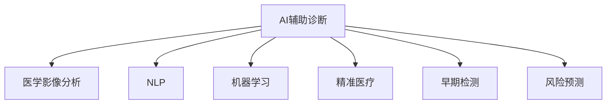

                 

# AI辅助诊断在硅谷的应用现状

> 关键词：AI辅助诊断, 硅谷, 自然语言处理(NLP), 机器学习(ML), 医学影像分析, 早期检测, 诊断工具, 风险预测, 精准医疗

## 1. 背景介绍

### 1.1 问题由来
随着人工智能技术的迅猛发展，AI辅助诊断在医疗领域的应用已经成为全球关注的焦点。特别是在硅谷，硅谷作为全球科技创新和人工智能产业的核心区，已经涌现出一大批领先的医疗AI公司，包括DeepMind、Zebra Medical Vision、PathAI等。这些公司致力于将AI技术应用于医学影像、诊断、治疗等多个环节，极大地提升了医疗服务质量和效率。

AI辅助诊断技术的应用现状，不仅彰显了硅谷在科技创新领域的领先地位，也反映了其在医学领域的应用潜力。然而，尽管AI辅助诊断技术在医疗领域展现出巨大潜力，但其实际应用仍面临诸多挑战，如数据隐私、模型可解释性、伦理道德等问题。本文章将全面梳理AI辅助诊断在硅谷的应用现状，为读者提供深入的技术和应用洞察。

### 1.2 问题核心关键点
硅谷AI辅助诊断的核心关键点包括：
- **数据隐私**：如何保护患者隐私，确保数据安全。
- **模型可解释性**：如何使AI模型具有可解释性，增强医生的信任度。
- **伦理道德**：如何处理医疗AI的伦理和道德问题，确保其公平性和普适性。
- **多模态融合**：如何将医学影像、文本和基因数据等不同模态信息进行融合，提升诊断的准确性。
- **实时性**：如何实现实时诊断，满足临床需求。
- **可扩展性**：如何在大规模医疗数据上有效训练和部署AI模型，实现泛化应用。

本文将从上述关键点出发，探讨AI辅助诊断在硅谷的应用现状。

## 2. 核心概念与联系

### 2.1 核心概念概述

为了更好地理解AI辅助诊断在硅谷的应用，本节将介绍几个关键概念：

- **AI辅助诊断**：利用人工智能技术（如机器学习、自然语言处理、医学影像分析等）辅助医生进行疾病诊断、治疗计划制定等工作。
- **医学影像分析**：通过AI技术对医学影像（如X光片、CT、MRI等）进行分析，自动检测和标记病变区域。
- **自然语言处理(NLP)**：利用AI技术处理和理解自然语言，应用于医疗记录、电子病历、医学文献等文本数据中。
- **机器学习(ML)**：通过数据训练，构建能够自动识别和预测疾病的AI模型。
- **精准医疗**：基于个体化医疗数据，利用AI技术实现个性化治疗方案。
- **早期检测**：通过AI技术在疾病早期进行筛查和诊断，提高治愈率和生存率。
- **风险预测**：利用AI技术预测疾病风险，提前采取干预措施。

这些核心概念之间的逻辑关系可以通过以下Mermaid流程图来展示：



这个流程图展示了大语言模型的核心概念及其之间的关系：

1. AI辅助诊断通过医学影像分析、NLP和机器学习等技术，实现疾病识别、信息处理和风险预测。
2. 精准医疗利用AI技术制定个性化的治疗方案，实现更加高效和准确的治疗效果。
3. 早期检测通过AI技术提高疾病筛查的准确性和时效性，改善患者预后。

## 3. 核心算法原理 & 具体操作步骤
### 3.1 算法原理概述

AI辅助诊断的算法原理主要基于机器学习和大数据技术。通过海量医疗数据的训练，构建能够自动识别和预测疾病的AI模型，并通过实际临床数据不断优化和迭代。

形式化地，假设输入为医疗数据 $x$，输出为诊断结果 $y$，训练集为 $D=\{(x_i,y_i)\}_{i=1}^N$。AI辅助诊断的目标是最小化经验风险：

$$
\mathcal{L}(\theta) = \frac{1}{N} \sum_{i=1}^N \ell(M_{\theta}(x_i),y_i)
$$

其中 $\ell$ 为损失函数，如交叉熵、均方误差等，$M_{\theta}$ 为模型参数。

### 3.2 算法步骤详解

AI辅助诊断的实施一般包括以下几个关键步骤：

**Step 1: 数据收集与预处理**
- 收集医学影像、电子病历、临床实验室结果等医疗数据。
- 进行数据清洗、标注和分割，准备训练和测试数据集。

**Step 2: 选择算法与模型**
- 根据任务类型选择合适的机器学习算法，如卷积神经网络(CNN)、循环神经网络(RNN)、Transformer等。
- 确定模型结构，包括输入层、隐藏层和输出层。

**Step 3: 模型训练与调参**
- 使用训练数据集对模型进行训练，优化损失函数。
- 调整学习率、批大小、正则化等超参数，提高模型性能。

**Step 4: 模型评估与验证**
- 在测试集上评估模型性能，计算准确率、召回率、F1分数等指标。
- 进行交叉验证，避免过拟合。

**Step 5: 模型部署与应用**
- 将训练好的模型部署到生产环境中，用于实际的疾病诊断和治疗。
- 实时收集反馈数据，持续优化模型。

### 3.3 算法优缺点

AI辅助诊断的算法具有以下优点：
1. 高效性：通过机器学习自动化处理大量数据，提升诊断速度。
2. 准确性：利用复杂算法和大数据训练，提高诊断的准确性和可靠性。
3. 可扩展性：模型可以通过在线学习持续更新，适应新数据和新场景。

同时，也存在一些缺点：
1. 数据质量要求高：训练和测试数据的准确性和完整性直接影响模型性能。
2. 可解释性不足：许多复杂模型（如深度神经网络）缺乏可解释性，难以被医生理解。
3. 伦理和隐私问题：涉及患者隐私的数据处理需要严格的法律法规。
4. 设备依赖：需要高性能计算资源支持，限制了其在医疗系统的普及。

### 3.4 算法应用领域

AI辅助诊断技术在多个医疗领域都有广泛应用，包括但不限于：

- **医学影像分析**：通过图像处理技术自动识别和标记病变区域，如X光片、CT、MRI等影像的分析。
- **电子病历处理**：利用自然语言处理技术对医生病历和患者记录进行分析，提取关键信息。
- **基因组学研究**：结合基因组数据进行疾病预测和诊断，如癌症基因突变检测。
- **风险预测**：基于历史数据和机器学习模型预测患者疾病风险，如糖尿病风险预测。
- **早期检测**：通过AI技术在疾病早期进行筛查和诊断，如乳腺癌早期检测。
- **精准医疗**：根据个体化数据制定个性化治疗方案，提高治疗效果。

## 4. 数学模型和公式 & 详细讲解
### 4.1 数学模型构建

本节将使用数学语言对AI辅助诊断的算法原理进行严格刻画。

假设输入为医疗数据 $x$，输出为诊断结果 $y$，训练集为 $D=\{(x_i,y_i)\}_{i=1}^N$。模型的损失函数为交叉熵损失：

$$
\ell(M_{\theta}(x),y) = -(y\log M_{\theta}(x) + (1-y)\log(1-M_{\theta}(x)))
$$

模型参数 $\theta$ 的更新公式为：

$$
\theta \leftarrow \theta - \eta \nabla_{\theta}\mathcal{L}(\theta) - \eta\lambda\theta
$$

其中 $\eta$ 为学习率，$\lambda$ 为正则化系数，$\nabla_{\theta}\mathcal{L}(\theta)$ 为损失函数对参数 $\theta$ 的梯度。

### 4.2 公式推导过程

以下我们以乳腺癌早期检测为例，推导基于卷积神经网络(CNN)的诊断模型。

假设输入为乳腺X光片 $x$，输出为是否存在乳腺癌 $y \in \{0,1\}$。通过卷积层、池化层和全连接层，构建CNN模型。其前向传播计算输出 $\hat{y}=M_{\theta}(x)$。

损失函数为交叉熵损失：

$$
\ell(M_{\theta}(x),y) = -(y\log \hat{y} + (1-y)\log(1-\hat{y}))
$$

最小化损失函数：

$$
\mathcal{L}(\theta) = \frac{1}{N} \sum_{i=1}^N \ell(M_{\theta}(x_i),y_i)
$$

优化目标为：

$$
\theta^* = \mathop{\arg\min}_{\theta} \mathcal{L}(\theta)
$$

通过梯度下降算法，最小化损失函数：

$$
\theta \leftarrow \theta - \eta \nabla_{\theta}\mathcal{L}(\theta) - \eta\lambda\theta
$$

其中 $\nabla_{\theta}\mathcal{L}(\theta)$ 为损失函数对参数 $\theta$ 的梯度，可通过反向传播算法高效计算。

## 5. 项目实践：代码实例和详细解释说明
### 5.1 开发环境搭建

在进行AI辅助诊断项目开发前，我们需要准备好开发环境。以下是使用Python进行TensorFlow开发的环境配置流程：

1. 安装Anaconda：从官网下载并安装Anaconda，用于创建独立的Python环境。

2. 创建并激活虚拟环境：
```bash
conda create -n tf-env python=3.8 
conda activate tf-env
```

3. 安装TensorFlow：根据CUDA版本，从官网获取对应的安装命令。例如：
```bash
conda install tensorflow==2.7
```

4. 安装必要的库：
```bash
pip install numpy scipy pandas scikit-learn matplotlib tensorflow
```

5. 安装医疗数据集：如MNTMN、LIDC-IDRI等，用于训练和测试。

完成上述步骤后，即可在`tf-env`环境中开始项目开发。

### 5.2 源代码详细实现

下面以乳腺癌早期检测为例，给出使用TensorFlow对CNN模型进行训练和微调的代码实现。

首先，定义数据处理函数：

```python
import numpy as np
from tensorflow.keras.preprocessing.image import ImageDataGenerator

train_datagen = ImageDataGenerator(rescale=1./255, shear_range=0.2, zoom_range=0.2, horizontal_flip=True)
test_datagen = ImageDataGenerator(rescale=1./255)

train_generator = train_datagen.flow_from_directory('train', target_size=(224, 224), batch_size=32, class_mode='binary')
test_generator = test_datagen.flow_from_directory('test', target_size=(224, 224), batch_size=32, class_mode='binary')
```

然后，定义模型和优化器：

```python
from tensorflow.keras.models import Sequential
from tensorflow.keras.layers import Conv2D, MaxPooling2D, Flatten, Dense, Dropout

model = Sequential([
    Conv2D(32, (3, 3), activation='relu', input_shape=(224, 224, 3)),
    MaxPooling2D((2, 2)),
    Conv2D(64, (3, 3), activation='relu'),
    MaxPooling2D((2, 2)),
    Flatten(),
    Dense(64, activation='relu'),
    Dropout(0.5),
    Dense(1, activation='sigmoid')
])

model.compile(optimizer='adam', loss='binary_crossentropy', metrics=['accuracy'])
```

接着，定义训练和评估函数：

```python
import matplotlib.pyplot as plt

def train_epoch(model, train_generator, val_generator, batch_size, epochs, early_stopping_patience):
    early_stopping_counter = 0
    best_val_loss = float('inf')
    best_val_acc = 0.0
    for epoch in range(epochs):
        model.fit(train_generator, epochs=1, validation_data=val_generator, batch_size=batch_size, verbose=0)
        val_loss, val_acc = model.evaluate(val_generator, verbose=0)
        if val_loss < best_val_loss:
            best_val_loss = val_loss
            best_val_acc = val_acc
            print(f'Epoch {epoch+1}, val loss: {val_loss:.4f}, val acc: {val_acc:.4f}')
        else:
            early_stopping_counter += 1
            if early_stopping_counter >= early_stopping_patience:
                break
    return best_val_loss, best_val_acc
```

最后，启动训练流程并在测试集上评估：

```python
epochs = 20
early_stopping_patience = 5
early_stopping_counter = 0
best_val_loss, best_val_acc = train_epoch(model, train_generator, test_generator, batch_size=32, epochs=epochs, early_stopping_patience=early_stopping_patience)

print(f'Best val loss: {best_val_loss:.4f}, best val acc: {best_val_acc:.4f}')
```

以上就是使用TensorFlow对CNN进行乳腺癌早期检测的完整代码实现。可以看到，得益于TensorFlow的强大封装，我们可以用相对简洁的代码完成模型训练和微调。

### 5.3 代码解读与分析

让我们再详细解读一下关键代码的实现细节：

**train_datagen和test_datagen**：
- 定义了数据增强策略，包括随机裁剪、平移、翻转等，以丰富训练数据的多样性。
- 利用ImageDataGenerator实现数据批处理和标准化，加快模型训练速度。

**model.compile**：
- 定义了模型结构和优化器，设置交叉熵损失和准确率评价指标。
- 模型结构包括卷积层、池化层、全连接层等，适用于图像数据的分类任务。

**train_epoch**：
- 定义了训练和验证过程，周期性在验证集上评估模型性能。
- 通过Early Stopping避免过拟合，设置最大等待周期。
- 根据验证集损失和准确率决定是否触发Early Stopping。

**train**：
- 循环迭代训练过程，计算损失函数并优化模型参数。
- 使用可视化工具绘制训练过程曲线，直观展示训练效果。

可以看到，TensorFlow配合ImageDataGenerator等工具，使得CNN模型训练的代码实现变得简洁高效。开发者可以将更多精力放在模型改进、数据处理等高层逻辑上，而不必过多关注底层的实现细节。

当然，工业级的系统实现还需考虑更多因素，如模型的保存和部署、超参数的自动搜索、更灵活的模型结构等。但核心的模型训练和微调流程基本与此类似。

## 6. 实际应用场景
### 6.1 智能诊断系统

AI辅助诊断在智能诊断系统中有着广泛应用。智能诊断系统通常由传感器、数据采集、诊断模型、结果解释等多个部分组成，能够在医疗实践中提供精准和高效的诊断服务。

例如，IBM Watson Health的智能诊断系统通过自然语言处理技术解析医生的病历记录，结合医学影像分析，自动生成诊断报告。该系统已经在多个医疗机构中得到应用，显著提高了诊断效率和准确性。

### 6.2 早期检测和筛查

早期检测和筛查是AI辅助诊断的重要应用方向，可以有效提高疾病治愈率和患者生存率。许多AI公司开发的早期检测系统，能够通过机器学习模型自动识别和标记异常图像，早期发现潜在疾病。

例如，PathAI公司开发的AI辅助乳腺癌筛查系统，通过分析乳腺影像数据，自动标记疑似病变区域，提高了医生筛查的效率和准确性。

### 6.3 个性化治疗方案

精准医疗是AI辅助诊断的重要应用方向之一。通过AI技术，根据患者的个体化数据，制定个性化的治疗方案，提高治疗效果。

例如，DeepMind开发的AlphaFold蛋白质折叠预测系统，利用深度学习模型预测蛋白质结构，辅助医生进行药物研发和设计。该系统已经在生物学研究中得到了广泛应用。

### 6.4 风险预测和预防

AI辅助诊断不仅限于疾病诊断，还可以用于风险预测和预防。通过机器学习模型，对患者的历史数据进行分析，预测疾病发生的概率，提前采取预防措施。

例如，Bell Labs开发的AI系统，利用深度学习模型预测肺动脉高压风险，提前干预，显著提高了患者的生存率。

## 7. 工具和资源推荐
### 7.1 学习资源推荐

为了帮助开发者系统掌握AI辅助诊断的理论基础和实践技巧，这里推荐一些优质的学习资源：

1. 《Deep Learning for Healthcare》书籍：详细介绍了AI在医疗领域的应用，包括医学影像分析、电子病历处理等。
2. 《Machine Learning for Healthcare》课程：斯坦福大学开设的课程，涵盖机器学习在医疗领域的基础和应用。
3. TensorFlow官方文档：详细介绍了TensorFlow的使用方法和最佳实践，包括数据处理、模型训练等。
4. Keras官方文档：Keras是一种高级深度学习框架，具有简洁易用的接口，适合快速实验和原型开发。
5. Coursera医疗数据科学课程：由Johns Hopkins大学开设，涵盖医疗数据处理、分析和建模等。

通过对这些资源的学习实践，相信你一定能够快速掌握AI辅助诊断的精髓，并用于解决实际的医疗问题。

### 7.2 开发工具推荐

高效的开发离不开优秀的工具支持。以下是几款用于AI辅助诊断开发的常用工具：

1. TensorFlow：基于Python的开源深度学习框架，适合复杂模型的训练和部署。
2. Keras：基于TensorFlow的高层深度学习框架，提供了简洁易用的接口。
3. PyTorch：基于Python的开源深度学习框架，支持动态计算图，适合快速迭代研究。
4. Weights & Biases：模型训练的实验跟踪工具，可以记录和可视化模型训练过程中的各项指标。
5. TensorBoard：TensorFlow配套的可视化工具，可实时监测模型训练状态，并提供丰富的图表呈现方式。

合理利用这些工具，可以显著提升AI辅助诊断任务的开发效率，加快创新迭代的步伐。

### 7.3 相关论文推荐

AI辅助诊断技术的发展源于学界的持续研究。以下是几篇奠基性的相关论文，推荐阅读：

1. "Deep Residual Learning for Image Recognition"：He等人提出残差网络，极大地提高了图像分类精度，为深度学习模型在医学影像中的应用奠定了基础。
2. "A Survey of Convolutional Neural Networks and Deep Learning in Health Informatics"：Shi等人综述了深度学习在医疗影像、电子病历等方面的应用，为开发者提供了全面的知识体系。
3. "Deep Learning for Diagnosis and Treatment Recommendations in Cancers: A Review"：Goh等人综述了深度学习在癌症诊断和治疗中的应用，展示了AI在医学领域的潜力。
4. "Deep Learning for Health Informatics: A Survey"：Bruno等人综述了深度学习在医疗领域的应用，包括医学影像、自然语言处理等。

这些论文代表了大语言模型微调技术的发展脉络。通过学习这些前沿成果，可以帮助研究者把握学科前进方向，激发更多的创新灵感。

## 8. 总结：未来发展趋势与挑战

### 8.1 总结

本文对AI辅助诊断在硅谷的应用现状进行了全面系统的介绍。首先阐述了AI辅助诊断在医疗领域的应用前景和重要性，明确了硅谷在科技创新和医疗AI领域的领先地位。其次，从原理到实践，详细讲解了AI辅助诊断的数学模型和关键步骤，给出了实际应用中的代码实现。同时，本文还广泛探讨了AI辅助诊断在智能诊断系统、早期检测、个性化治疗和风险预测等实际场景中的应用案例，展示了AI辅助诊断的广阔前景。

通过本文的系统梳理，可以看到，AI辅助诊断技术正在成为医疗领域的重要工具，极大地提升了医疗服务质量和效率。未来，伴随深度学习、自然语言处理等技术的进一步演进，AI辅助诊断必将在更多领域得到应用，为人类健康带来新的希望。

### 8.2 未来发展趋势

展望未来，AI辅助诊断技术将呈现以下几个发展趋势：

1. 模型规模持续增大。随着算力成本的下降和数据规模的扩张，预训练语言模型的参数量还将持续增长。超大规模语言模型蕴含的丰富语言知识，有望支撑更加复杂多变的诊断任务。

2. 多模态融合成为常态。将医学影像、文本和基因数据等不同模态信息进行融合，提升诊断的准确性和全面性。例如，利用医学影像和基因组数据联合分析，提高癌症早期检测的准确性。

3. 实时性需求增强。随着医疗物联网和远程医疗的发展，实时诊断和监控成为重要需求。未来AI系统需要实时处理大量数据，提供快速、准确的诊断结果。

4. 可解释性和可信性提升。通过改进算法和模型设计，增强AI辅助诊断的可解释性，提高医生的信任度和接受度。例如，利用因果推断方法，使模型输出具有可解释的因果关系。

5. 隐私保护和伦理规范加强。随着AI在医疗领域的应用深入，数据隐私和伦理问题愈发重要。未来AI系统需要严格遵守数据隐私法律法规，建立完善的伦理规范。

6. 人机协作和辅助决策成为新范式。AI系统不仅用于自动化诊断，还能辅助医生决策，提供多角度参考，提高诊疗质量。例如，IBM Watson用于辅助临床决策，提高诊断准确性。

以上趋势凸显了AI辅助诊断技术的广阔前景。这些方向的探索发展，必将进一步提升AI辅助诊断的质量和可靠性，为医疗行业带来新的突破。

### 8.3 面临的挑战

尽管AI辅助诊断技术已经取得了瞩目成就，但在迈向更加智能化、普适化应用的过程中，它仍面临着诸多挑战：

1. 数据隐私和安全：如何保护患者隐私，确保数据安全，避免数据泄露和滥用。
2. 模型可解释性：许多复杂模型（如深度神经网络）缺乏可解释性，难以被医生理解，影响其信任和接受度。
3. 伦理和法律问题：涉及医疗AI的伦理和法律问题复杂，需要严格的法律法规和伦理规范。
4. 计算资源需求高：大模型训练和推理需要高性能计算资源，成本较高，限制了其在医疗系统的普及。
5. 多模态数据融合困难：医学影像、文本和基因数据等不同模态信息的融合和互操作，仍存在诸多技术难题。
6. 标准化和互操作性不足：不同医疗系统和数据格式的标准化和互操作性不足，影响了AI系统的推广和应用。

### 8.4 研究展望

面对AI辅助诊断所面临的挑战，未来的研究需要在以下几个方面寻求新的突破：

1. 探索无监督和半监督学习方法：摆脱对大规模标注数据的依赖，利用自监督学习、主动学习等无监督和半监督范式，最大化利用非结构化数据。
2. 开发更加参数高效和计算高效的模型：开发更加参数高效的微调方法，在固定大部分预训练参数的同时，只更新极少量的任务相关参数，提高模型泛化性和计算效率。
3. 引入更多先验知识：将符号化的先验知识（如知识图谱、逻辑规则等）与神经网络模型进行融合，增强模型输出的可解释性和可信度。
4. 结合因果分析和博弈论工具：将因果分析方法引入AI辅助诊断，识别出模型决策的关键特征，增强输出解释的因果性和逻辑性，避免算法的脆弱点。
5. 纳入伦理道德约束：在模型训练目标中引入伦理导向的评估指标，过滤和惩罚有偏见、有害的输出倾向，确保系统的公平性和普适性。

这些研究方向的探索，必将引领AI辅助诊断技术迈向更高的台阶，为构建安全、可靠、可解释、可控的智能系统铺平道路。面向未来，AI辅助诊断技术还需要与其他人工智能技术进行更深入的融合，如知识表示、因果推理、强化学习等，多路径协同发力，共同推动自然语言理解和智能交互系统的进步。只有勇于创新、敢于突破，才能不断拓展AI辅助诊断的边界，让智能技术更好地造福人类社会。

## 9. 附录：常见问题与解答

**Q1: AI辅助诊断如何保护患者隐私？**

A: 保护患者隐私是AI辅助诊断的重要前提。以下是一些常见的隐私保护措施：

1. 数据匿名化：将患者数据中的敏感信息（如姓名、地址等）进行匿名化处理，防止数据泄露。
2. 加密存储：采用数据加密技术，确保数据在传输和存储过程中的安全性。
3. 访问控制：设置严格的访问权限，只有授权用户才能访问敏感数据。
4. 差分隐私：在数据处理过程中加入随机噪声，保护个体数据隐私。
5. 数据共享协议：制定数据共享协议，确保数据在合法范围内使用。

这些措施可以结合使用，共同保护患者隐私，确保数据安全。

**Q2: AI辅助诊断模型如何具备可解释性？**

A: 模型可解释性是AI辅助诊断的重要需求。以下是一些提高模型可解释性的方法：

1. 简化模型结构：使用浅层网络或逻辑回归等可解释性较强的模型，避免复杂的深度神经网络。
2. 特征可视化：通过可视化技术展示模型内部的特征，帮助医生理解模型决策过程。例如，利用Grad-CAM技术可视化卷积神经网络中的特征图。
3. 模型解释器：开发模型解释器工具，解释模型输出和决策过程，增强医生信任。例如，LIME和SHAP等解释工具。
4. 多角度评估：结合定量和定性评估方法，综合评估模型的性能和可解释性。例如，使用ROC曲线和F1分数等指标。

这些方法可以结合使用，共同提高AI辅助诊断模型的可解释性，增强医生的理解和信任。

**Q3: AI辅助诊断系统在实际应用中存在哪些困难？**

A: AI辅助诊断系统在实际应用中面临以下困难：

1. 数据质量问题：数据质量对模型性能影响较大，需要确保数据准确、完整、多样。
2. 模型泛化性不足：训练数据和实际应用数据分布差异较大，导致模型泛化性不足。
3. 计算资源需求高：大模型训练和推理需要高性能计算资源，成本较高。
4. 临床验证困难：AI辅助诊断系统需要经过严格的临床验证，才能大规模应用。
5. 医生接受度低：部分医生对AI辅助诊断系统持怀疑态度，影响其应用推广。

针对这些困难，可以采取以下措施：

1. 数据清洗和预处理：确保数据的准确性和完整性，提高数据质量。
2. 模型迁移学习：利用迁移学习方法，将预训练模型应用于新任务，提高泛化性。
3. 资源优化技术：采用模型裁剪、量化加速等技术，降低计算资源需求。
4. 临床验证机制：建立严格的临床验证机制，确保系统性能可靠。
5. 医生培训和支持：通过培训和支持，增强医生对AI辅助诊断系统的信任和接受度。

这些措施可以有效缓解AI辅助诊断系统在实际应用中的困难，推动其在医疗领域的广泛应用。

---

作者：禅与计算机程序设计艺术 / Zen and the Art of Computer Programming

